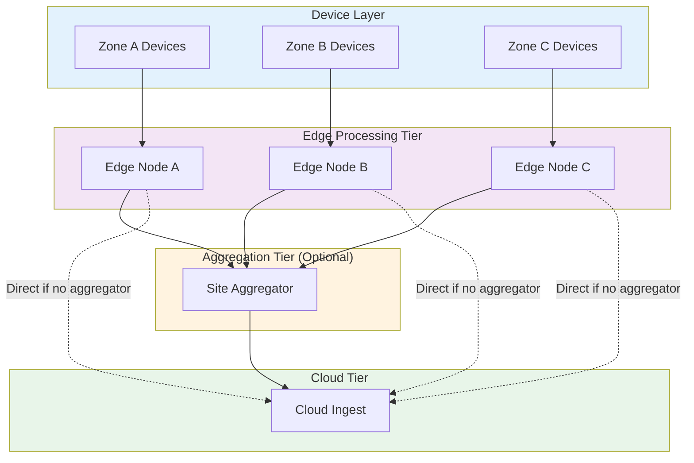
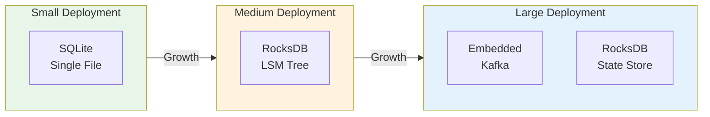
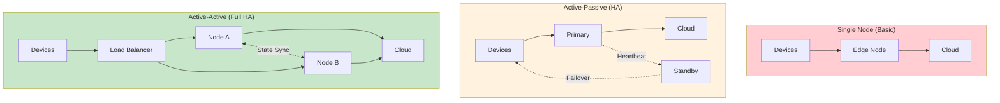
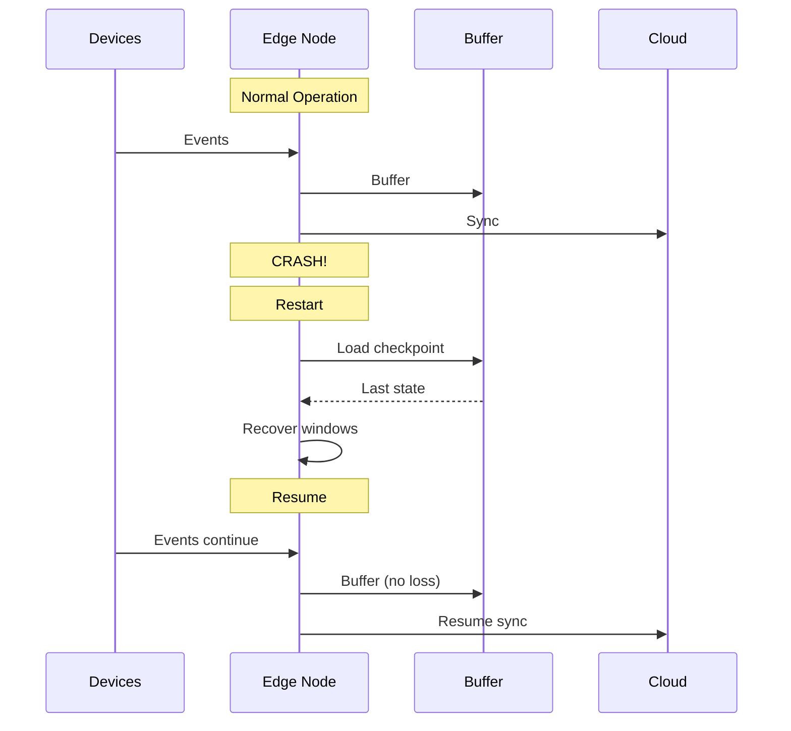
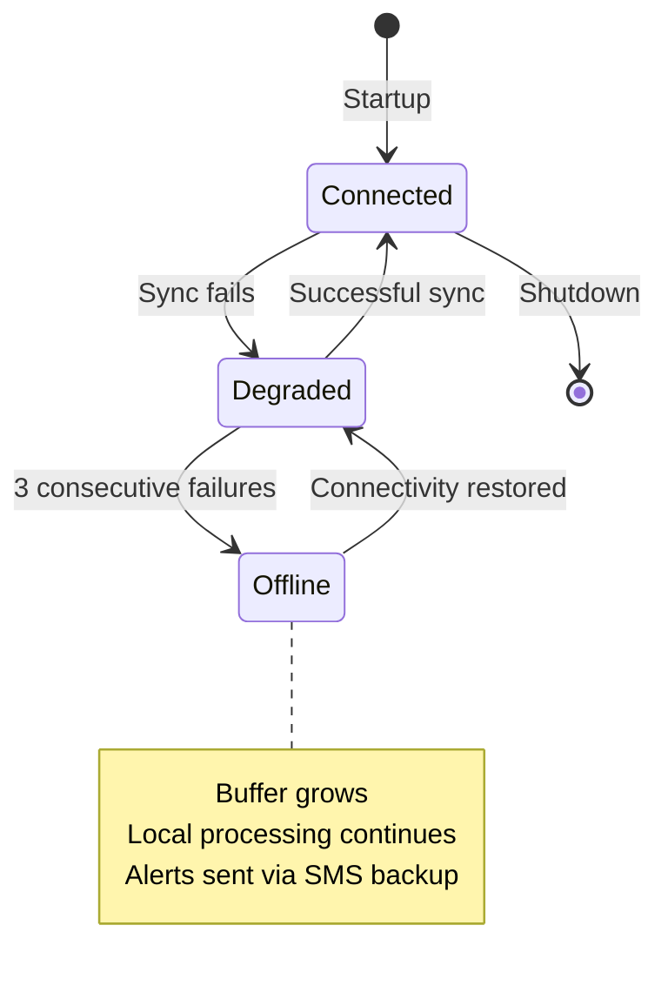
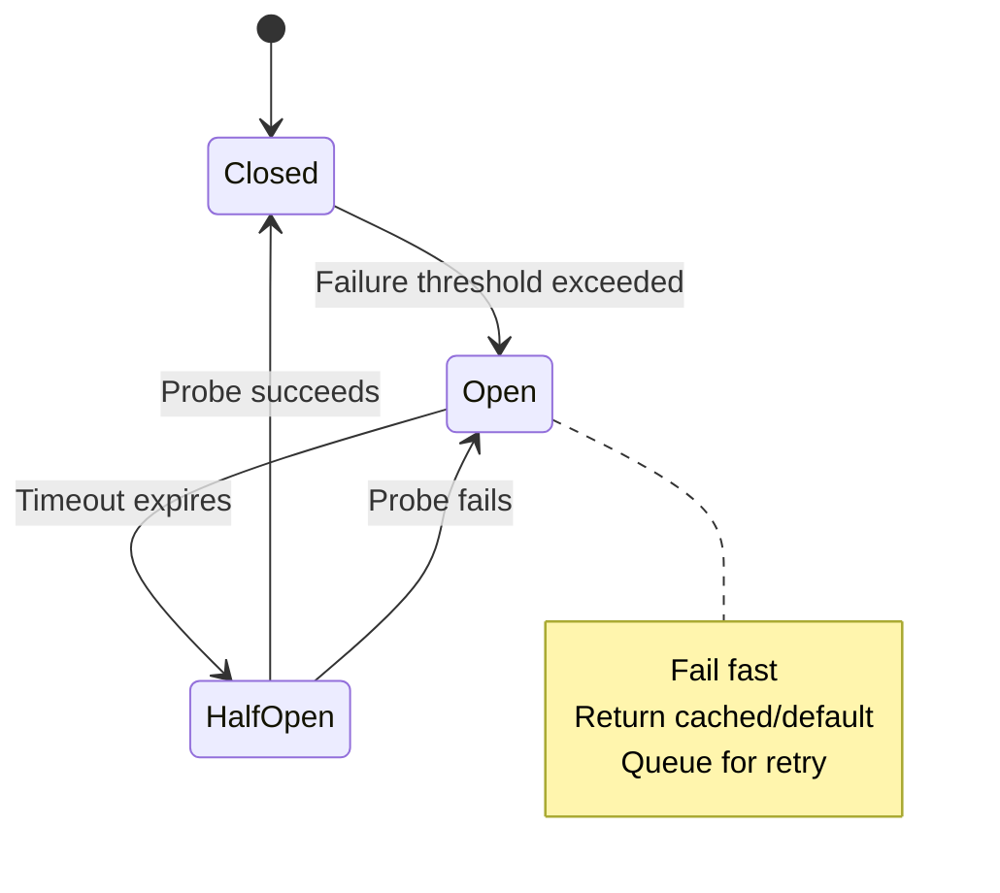
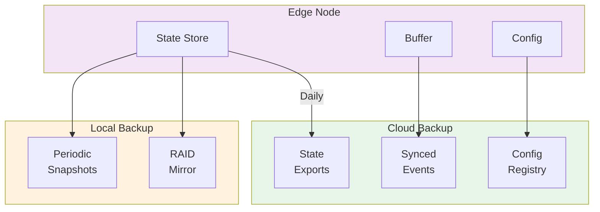

# Scalability & Reliability

[Back to Index](./00-index.md) | [Previous: Deep Dive](./04-deep-dive-and-bottlenecks.md) | [Next: Security →](./06-security-and-compliance.md)

---

## Scalability Strategies

### Horizontal Scaling: Multiple Edge Nodes



**Partition Strategies:**

| Strategy | Description | Use Case |
|----------|-------------|----------|
| **Geographic** | Devices route to nearest edge | Retail stores, factories |
| **Semantic** | Partition by device type or data stream | Mixed workloads |
| **Load-based** | Dynamic assignment based on capacity | Variable loads |
| **Sticky** | Devices always go to same edge | Stateful processing |

**Device-to-Edge Assignment:**

```
FUNCTION assign_edge_node(device: Device) -> EdgeNode:
    // Strategy 1: Geographic (default)
    IF config.partition_strategy == "geographic":
        candidates = edge_nodes.filter(
            zone = device.zone OR
            distance(device.location, node.location) < MAX_DISTANCE
        )

        IF candidates.empty():
            candidates = edge_nodes.all()  // Fallback to any

        RETURN candidates.min_by(node -> node.current_load)

    // Strategy 2: Consistent hashing (for stateful)
    IF config.partition_strategy == "sticky":
        hash = consistent_hash(device.device_id)
        RETURN edge_ring.get_node(hash)

    // Strategy 3: Load-based
    IF config.partition_strategy == "load":
        RETURN edge_nodes.min_by(node -> node.current_load)
```

### Vertical Scaling: Hardware Tiers

| Tier | Hardware | Capacity | Cost | Use Case |
|------|----------|----------|------|----------|
| **Micro** | Raspberry Pi 4 (4GB) | 1K events/s, 50 devices | $100 | Kiosks, small retail |
| **Small** | Intel NUC (16GB) | 10K events/s, 500 devices | $500 | Medium retail, small factory |
| **Medium** | Industrial PC (32GB) | 50K events/s, 2K devices | $2,000 | Large factory floor |
| **Large** | Edge Server (128GB) | 200K events/s, 10K devices | $10,000 | Data center edge, large campus |
| **TSN** | FPGA + Industrial PC | 500K events/s, deterministic | $25,000+ | Real-time control systems |

### Auto-Scaling Triggers

| Metric | Scale Up Trigger | Scale Down Trigger | Action |
|--------|------------------|-------------------|--------|
| **CPU Utilization** | > 80% for 5 min | < 30% for 30 min | Add/remove processing threads |
| **Buffer Utilization** | > 70% | < 20% | Increase sync frequency |
| **Queue Depth** | > 10K pending | < 1K pending | Add parallel processors |
| **Memory** | > 85% | < 50% | Spill to disk / load to memory |
| **Event Latency (p99)** | > 100ms | < 20ms | Prioritize fast path |

### Database Scaling

**Local Storage Scaling:**



| Scale | Storage Engine | Throughput | Recovery Time |
|-------|---------------|------------|---------------|
| **< 10K events/s** | SQLite WAL | 5-10K writes/s | < 1s |
| **10K-100K events/s** | RocksDB | 50-100K writes/s | < 5s |
| **> 100K events/s** | Embedded Kafka | 200K+ writes/s | < 30s |

---

## Reliability & Fault Tolerance

### Single Points of Failure (SPOF) Analysis

| Component | SPOF Risk | Mitigation | Residual Risk |
|-----------|-----------|------------|---------------|
| **Edge Node** | High | Dual nodes with failover | Hardware cost |
| **Local Disk** | High | RAID 1, dual SSDs | Performance impact |
| **Network Uplink** | Medium | Dual NICs, cellular backup | Cost |
| **Power** | High | UPS, generator | Duration limited |
| **Clock Source** | Medium | Multiple NTP/PTP sources | Accuracy degradation |

### Redundancy Strategies



**Active-Passive Failover:**

```
STRUCTURE FailoverConfig:
    heartbeat_interval_ms: 1000
    failure_threshold: 3  // consecutive failures
    takeover_delay_ms: 5000

FUNCTION monitor_primary(standby: EdgeNode, primary: EdgeNode):
    consecutive_failures = 0

    LOOP:
        response = primary.heartbeat()

        IF response.success:
            consecutive_failures = 0
            standby.update_checkpoint(response.checkpoint)
        ELSE:
            consecutive_failures += 1

            IF consecutive_failures >= FAILURE_THRESHOLD:
                LOG.warn("Primary failure detected, initiating failover")
                initiate_failover(standby, primary)
                BREAK

        SLEEP(heartbeat_interval_ms)

FUNCTION initiate_failover(standby: EdgeNode, primary: EdgeNode):
    // 1. Wait to avoid split-brain
    SLEEP(takeover_delay_ms)

    // 2. Verify primary still down
    IF primary.heartbeat().success:
        LOG.info("Primary recovered, aborting failover")
        RETURN

    // 3. Acquire leadership
    standby.become_primary()

    // 4. Redirect device traffic
    dns.update(edge_endpoint, standby.address)

    // 5. Resume processing from last checkpoint
    standby.restore_from_checkpoint()
    standby.start_processing()

    LOG.info("Failover complete")
```

### Failure Scenarios and Recovery

#### Scenario 1: Edge Node Crash



**Recovery Steps:**
1. Process restarts (supervisor, systemd)
2. Load last checkpoint from disk
3. Restore window states
4. Replay events from buffer since checkpoint
5. Resume normal processing

**Recovery Time:** 5-30 seconds depending on state size

#### Scenario 2: Network Outage



**Offline Behavior:**
- Local processing continues uninterrupted
- Buffer accumulates events
- Periodic retry attempts (exponential backoff)
- Critical alerts via backup channel (SMS, cellular)
- Status indicator shows offline state

#### Scenario 3: Buffer Overflow

```
FUNCTION handle_buffer_overflow():
    current_usage = buffer.utilization_percent()

    // Level 1: Warning (70%)
    IF current_usage > 70:
        alert("Buffer reaching capacity", level=WARNING)
        increase_sync_frequency()
        enable_aggressive_compression()

    // Level 2: Critical (85%)
    IF current_usage > 85:
        alert("Buffer critical", level=CRITICAL)
        start_priority_eviction()
        enable_sampling(rate=0.5)  // Process 50% of events

    // Level 3: Emergency (95%)
    IF current_usage > 95:
        alert("Buffer overflow imminent", level=EMERGENCY)
        // Evict synced data
        evict_synced_entries()
        // Downsample historical data
        downsample_old_events(ratio=10)
        // Drop low-priority streams
        drop_low_priority_events()

    // Level 4: Overflow (100%)
    IF current_usage >= 100:
        alert("Buffer overflow, data loss", level=EMERGENCY)
        // Last resort: drop oldest unsynced
        drop_oldest_pending(percent=10)
```

### Circuit Breaker Pattern



**Implementation:**

```
STRUCTURE CircuitBreaker:
    state: ENUM (CLOSED, OPEN, HALF_OPEN) = CLOSED
    failure_count: INT = 0
    failure_threshold: INT = 5
    timeout_ms: INT = 30000
    last_failure_time: TIMESTAMP = NULL

FUNCTION call_with_breaker(operation: Function) -> Result:
    IF state == OPEN:
        IF NOW() - last_failure_time > timeout_ms:
            state = HALF_OPEN
        ELSE:
            RETURN Error("Circuit open, failing fast")

    TRY:
        result = operation()
        on_success()
        RETURN result
    CATCH error:
        on_failure()
        RETURN Error(error)

FUNCTION on_success():
    failure_count = 0
    IF state == HALF_OPEN:
        state = CLOSED
        LOG.info("Circuit breaker closed")

FUNCTION on_failure():
    failure_count += 1
    last_failure_time = NOW()

    IF failure_count >= failure_threshold:
        state = OPEN
        LOG.warn("Circuit breaker opened")
```

### Retry Strategy with Exponential Backoff

```
STRUCTURE RetryConfig:
    initial_delay_ms: INT = 100
    max_delay_ms: INT = 60000
    multiplier: FLOAT = 2.0
    jitter_factor: FLOAT = 0.1
    max_attempts: INT = 10

FUNCTION retry_with_backoff(operation: Function, config: RetryConfig) -> Result:
    delay = config.initial_delay_ms
    attempts = 0

    WHILE attempts < config.max_attempts:
        TRY:
            RETURN operation()
        CATCH error:
            attempts += 1

            IF attempts >= config.max_attempts:
                RETURN Error("Max retries exceeded", cause=error)

            // Calculate next delay with jitter
            jitter = delay * config.jitter_factor * RANDOM(-1, 1)
            actual_delay = MIN(delay + jitter, config.max_delay_ms)

            LOG.warn("Retry attempt", attempt=attempts, delay_ms=actual_delay)
            SLEEP(actual_delay)

            delay = MIN(delay * config.multiplier, config.max_delay_ms)
```

---

## Disaster Recovery

### Recovery Objectives

| Scenario | RTO | RPO | Strategy |
|----------|-----|-----|----------|
| **Process crash** | < 30s | < 1 min | Auto-restart, checkpoint |
| **Node failure** | < 5 min | < 1 min | Failover to standby |
| **Disk failure** | < 15 min | < 5 min | RAID rebuild, cloud restore |
| **Site disaster** | < 1 hour | < 10 min | Cloud-based recovery |
| **Region failure** | < 4 hours | < 1 hour | Cross-region restore |

### Backup Strategy



**Backup Schedule:**

| Data Type | Frequency | Retention | Location |
|-----------|-----------|-----------|----------|
| **Checkpoints** | Every 30s | Last 3 | Local disk |
| **State snapshots** | Every 1 hour | Last 24 | Local + Cloud |
| **Full backup** | Daily | 30 days | Cloud |
| **Configuration** | On change | All versions | Cloud registry |

### Recovery Procedures

**Procedure 1: Node Replacement**

```
1. Deploy new edge node with base image
2. Register node with control plane
3. Pull configuration from registry
4. Download last state snapshot from cloud
5. Sync buffer from cloud (events since snapshot)
6. Verify state consistency
7. Update device routing to new node
8. Begin normal operation
9. Monitor for anomalies (24 hours)
```

**Procedure 2: Data Recovery from Cloud**

```
FUNCTION recover_from_cloud(edge_id: STRING, target_time: TIMESTAMP):
    // 1. Fetch configuration
    config = cloud.get_config(edge_id)
    apply_config(config)

    // 2. Fetch nearest state snapshot
    snapshot = cloud.get_snapshot(edge_id, before=target_time)
    restore_state(snapshot)

    // 3. Fetch events since snapshot
    events = cloud.get_events(
        edge_id = edge_id,
        from = snapshot.timestamp,
        to = target_time
    )

    // 4. Replay events to rebuild state
    FOR event IN events:
        process_event(event, skip_buffer=TRUE)

    // 5. Verify recovery
    validation = validate_state()
    IF NOT validation.success:
        ALERT("Recovery validation failed", details=validation)
        RETURN Error("Recovery incomplete")

    LOG.info("Recovery complete",
        snapshot_time = snapshot.timestamp,
        events_replayed = events.count())
```

---

## Graceful Degradation

### Degradation Levels

| Level | Condition | Actions | User Impact |
|-------|-----------|---------|-------------|
| **Normal** | All systems healthy | Full functionality | None |
| **Degraded** | Cloud unreachable | Local-only operation | No cloud visibility |
| **Limited** | High load | Sampling enabled | Reduced accuracy |
| **Minimal** | Resource exhaustion | Critical streams only | Limited data |
| **Emergency** | Near failure | Alerts only | No processing |

### Feature Degradation Matrix

| Feature | Normal | Degraded | Limited | Minimal |
|---------|--------|----------|---------|---------|
| **Raw ingestion** | Full | Full | 50% sample | Critical only |
| **Windowing** | All windows | All windows | 5m, 1h only | None |
| **Alerting** | Real-time | Real-time | Delayed | Critical only |
| **Cloud sync** | Real-time | Queued | Aggregates only | Disabled |
| **Local queries** | Full | Full | Cached only | Disabled |

---

## Hot Spot Mitigation

### Detecting Hot Spots

```
FUNCTION detect_hotspots() -> List[Hotspot]:
    hotspots = []

    // Check key distribution in windows
    FOR window IN active_windows:
        key_counts = window.get_key_distribution()
        top_keys = key_counts.top(10)

        IF top_keys[0].count > total_count * 0.1:  // Single key > 10%
            hotspots.append(Hotspot(
                type = "KEY_SKEW",
                window = window,
                key = top_keys[0].key,
                percentage = top_keys[0].count / total_count
            ))

    // Check stream distribution
    stream_rates = streams.get_event_rates()
    avg_rate = stream_rates.average()

    FOR stream, rate IN stream_rates:
        IF rate > avg_rate * 5:  // 5x average
            hotspots.append(Hotspot(
                type = "STREAM_SKEW",
                stream = stream,
                rate = rate,
                ratio = rate / avg_rate
            ))

    RETURN hotspots
```

### Mitigation Strategies

| Hot Spot Type | Strategy | Implementation |
|---------------|----------|----------------|
| **Key skew** | Salting | Add random suffix to hot keys |
| **Stream skew** | Partitioning | Split hot stream across workers |
| **Time skew** | Bucketing | Pre-aggregate in micro-batches |
| **Device burst** | Rate limiting | Per-device rate limits |

---

[Back to Index](./00-index.md) | [Previous: Deep Dive](./04-deep-dive-and-bottlenecks.md) | [Next: Security →](./06-security-and-compliance.md)
