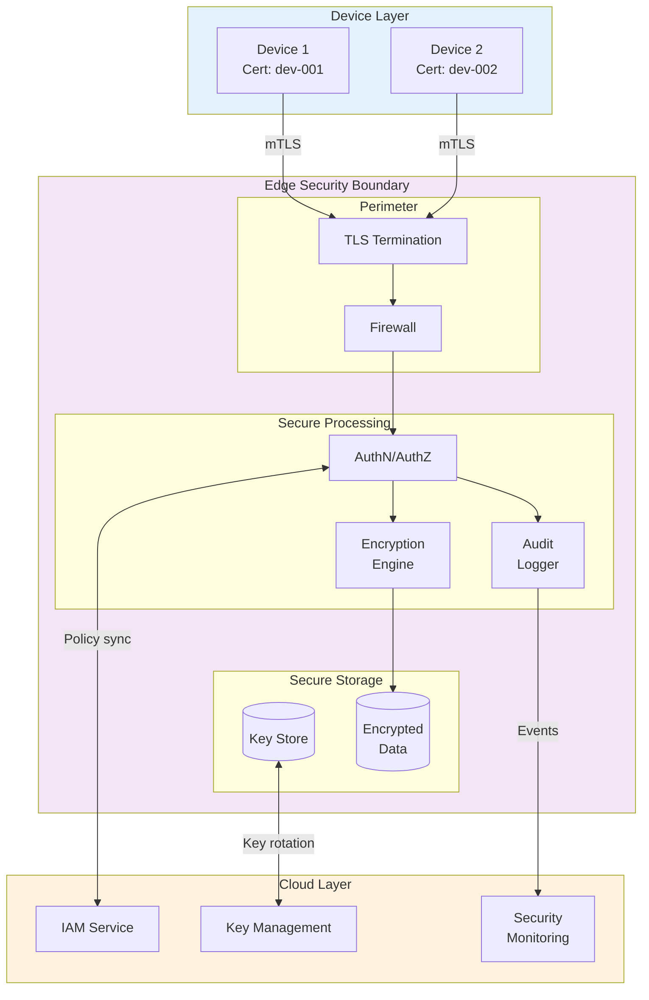
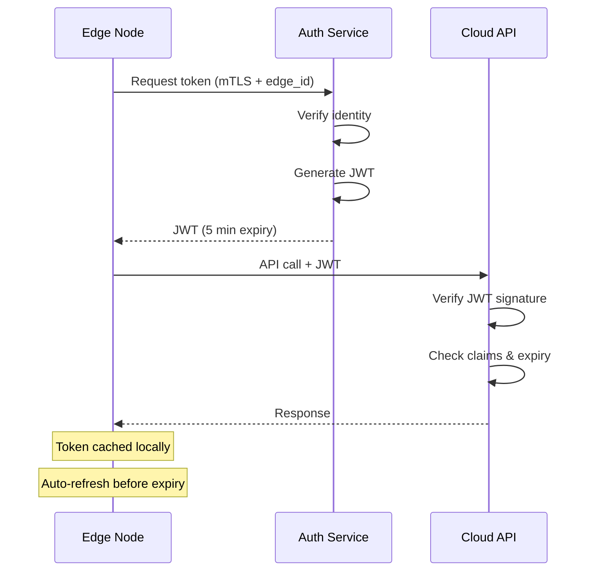
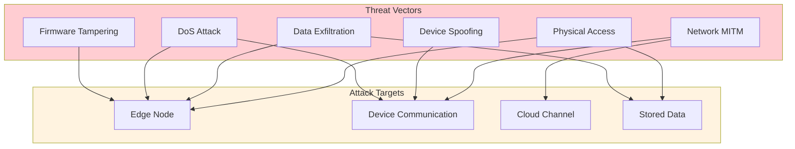
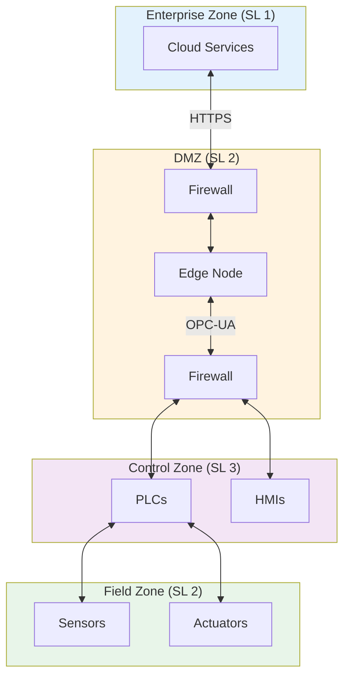

# Security & Compliance

[Back to Index](./00-index.md) | [Previous: Scalability](./05-scalability-and-reliability.md) | [Next: Observability →](./07-observability.md)

---

## Security Architecture Overview



---

## Authentication

### Device Authentication (mTLS)

**Certificate Hierarchy:**

```
Root CA (Cloud-managed)
├── Intermediate CA (Per-region)
│   ├── Edge CA (Per-site)
│   │   ├── Device Cert (dev-001)
│   │   ├── Device Cert (dev-002)
│   │   └── ...
│   └── Edge Node Cert
└── Admin CA (Operations)
```

**Certificate Provisioning:**

```
FUNCTION provision_device_certificate(device: Device) -> Certificate:
    // 1. Device generates key pair locally
    private_key, public_key = device.generate_key_pair(algorithm="ECDSA-P256")

    // 2. Device creates CSR
    csr = create_csr(
        public_key = public_key,
        common_name = device.device_id,
        organization = device.organization,
        serial_number = device.hardware_serial
    )

    // 3. Edge CA signs certificate
    certificate = edge_ca.sign(
        csr = csr,
        validity_days = 365,
        extensions = [
            KeyUsage(digital_signature=TRUE),
            ExtendedKeyUsage(client_auth=TRUE),
            SubjectAltName(dns=device.device_id)
        ]
    )

    // 4. Store certificate mapping
    certificate_store.register(
        device_id = device.device_id,
        certificate_fingerprint = certificate.fingerprint(),
        expires_at = certificate.not_after
    )

    RETURN certificate
```

**Certificate Validation:**

```
FUNCTION validate_device_connection(tls_context: TLSContext) -> AuthResult:
    cert = tls_context.peer_certificate

    // 1. Verify certificate chain
    IF NOT verify_chain(cert, trusted_cas):
        RETURN AuthResult(success=FALSE, reason="Invalid certificate chain")

    // 2. Check certificate not revoked
    IF is_revoked(cert.serial_number):
        RETURN AuthResult(success=FALSE, reason="Certificate revoked")

    // 3. Check certificate not expired
    IF cert.not_after < NOW():
        RETURN AuthResult(success=FALSE, reason="Certificate expired")

    // 4. Verify device is registered
    device_id = extract_device_id(cert)
    IF NOT device_registry.exists(device_id):
        RETURN AuthResult(success=FALSE, reason="Unknown device")

    // 5. Check device status
    device = device_registry.get(device_id)
    IF device.status == "disabled":
        RETURN AuthResult(success=FALSE, reason="Device disabled")

    RETURN AuthResult(
        success = TRUE,
        device_id = device_id,
        permissions = device.permissions
    )
```

### Edge-to-Cloud Authentication

| Method | Use Case | Rotation | Notes |
|--------|----------|----------|-------|
| **mTLS** | Primary channel | Annual | Most secure |
| **API Key** | Backup channel | Monthly | Rate-limited |
| **JWT** | Short-lived ops | Per-request | 5-minute expiry |
| **HMAC** | Batch uploads | Per-batch | Included in header |

**JWT Token Flow:**



---

## Authorization

### Role-Based Access Control (RBAC)

**Roles:**

| Role | Scope | Permissions |
|------|-------|-------------|
| **Device** | Single device | Write own events |
| **Edge Operator** | Single edge | Read all, manage config |
| **Site Admin** | All edges at site | Full local control |
| **Cloud Admin** | All edges | Global policy, audit |
| **Read-Only** | Specified streams | Read aggregates |

**Permission Model:**

```
STRUCTURE Permission:
    resource: STRING      // "stream:temperature", "config:*"
    action: STRING        // "read", "write", "admin"
    conditions: Map       // {"device_id": "dev-*", "time": "business_hours"}

STRUCTURE Role:
    name: STRING
    permissions: List[Permission]

FUNCTION check_permission(subject: Subject, action: STRING, resource: STRING) -> BOOL:
    // Get subject's roles
    roles = get_roles(subject)

    FOR role IN roles:
        FOR permission IN role.permissions:
            IF matches(permission.resource, resource) AND
               matches(permission.action, action) AND
               evaluate_conditions(permission.conditions, context):
                RETURN TRUE

    RETURN FALSE
```

### Device Allowlisting

```
FUNCTION validate_device_request(device_id: STRING, request: Request) -> Result:
    // 1. Check device allowlist
    allowlist = config.get("device_allowlist")
    IF allowlist.enabled AND device_id NOT IN allowlist.devices:
        IF NOT matches_pattern(device_id, allowlist.patterns):
            RETURN Error("Device not in allowlist")

    // 2. Check stream permissions
    stream_id = request.stream_id
    allowed_streams = device_registry.get(device_id).allowed_streams

    IF stream_id NOT IN allowed_streams AND "*" NOT IN allowed_streams:
        RETURN Error("Device not authorized for stream")

    // 3. Check rate limits
    IF rate_limiter.is_exceeded(device_id):
        RETURN Error("Rate limit exceeded")

    RETURN Ok()
```

---

## Data Security

### Encryption at Rest

| Data Type | Encryption | Key Source | Rotation |
|-----------|------------|------------|----------|
| **Buffer** | AES-256-GCM | Local DEK | Monthly |
| **State Store** | AES-256-GCM | Local DEK | Monthly |
| **Logs** | AES-256-GCM | Local DEK | Monthly |
| **Config** | AES-256-GCM | Cloud KEK | On change |

**Key Hierarchy:**

```
Cloud KEK (Key Encryption Key)
    │
    └── Edge KEK (Downloaded encrypted)
            │
            ├── Buffer DEK (Data Encryption Key)
            ├── State DEK
            └── Log DEK
```

**Key Management:**

```
FUNCTION initialize_encryption():
    // 1. Fetch edge KEK from cloud (encrypted with edge's public key)
    encrypted_kek = cloud.get_edge_kek(edge_id)

    // 2. Decrypt KEK using edge's private key (in TPM if available)
    edge_kek = decrypt_with_private_key(encrypted_kek)

    // 3. Generate or load DEKs
    buffer_dek = derive_dek(edge_kek, "buffer", version=current_version)
    state_dek = derive_dek(edge_kek, "state", version=current_version)
    log_dek = derive_dek(edge_kek, "logs", version=current_version)

    // 4. Store DEKs in secure memory
    key_store.set("buffer", buffer_dek)
    key_store.set("state", state_dek)
    key_store.set("logs", log_dek)

FUNCTION encrypt_data(plaintext: BYTES, key_name: STRING) -> BYTES:
    dek = key_store.get(key_name)
    nonce = generate_random_nonce(12)  // 96 bits for GCM

    ciphertext = aes_gcm_encrypt(plaintext, dek, nonce)

    RETURN nonce + ciphertext  // Prepend nonce
```

### Encryption in Transit

**TLS Configuration:**

```
TLS Settings:
  minimum_version: TLS 1.3
  cipher_suites:
    - TLS_AES_256_GCM_SHA384
    - TLS_CHACHA20_POLY1305_SHA256
  certificate_verification: REQUIRED
  client_auth: REQUIRED (for devices)
  session_tickets: DISABLED (for forward secrecy)
```

**Certificate Pinning:**

```
FUNCTION verify_cloud_certificate(cert: Certificate) -> BOOL:
    // Check against pinned certificates
    pinned_certs = config.get("pinned_cloud_certs")

    FOR pinned IN pinned_certs:
        IF cert.public_key_fingerprint == pinned.fingerprint:
            RETURN TRUE

    // Fallback: verify against trusted CAs
    IF verify_chain(cert, trusted_cas):
        LOG.warn("Certificate not pinned, using CA verification")
        RETURN TRUE

    RETURN FALSE
```

### PII Handling

**Data Classification:**

| Level | Examples | Handling |
|-------|----------|----------|
| **Public** | Temperature, pressure | Normal processing |
| **Internal** | Device IDs, timestamps | Pseudonymization optional |
| **Confidential** | Location, user data | Encryption required, access logged |
| **Restricted** | Credentials, keys | Never stored in events |

**Data Masking:**

```
FUNCTION mask_pii(event: Event, policy: MaskingPolicy) -> Event:
    masked = event.copy()

    FOR field, rule IN policy.rules:
        IF has_field(masked.payload, field):
            value = get_field(masked.payload, field)

            SWITCH rule.type:
                CASE "hash":
                    masked_value = sha256(value + rule.salt)
                CASE "truncate":
                    masked_value = value[:rule.keep_chars] + "***"
                CASE "redact":
                    masked_value = "[REDACTED]"
                CASE "tokenize":
                    masked_value = token_vault.get_or_create(value)

            set_field(masked.payload, field, masked_value)

    RETURN masked
```

---

## Threat Model

### Attack Surface



### Threat Mitigation Matrix

| Threat | Impact | Likelihood | Mitigation | Residual Risk |
|--------|--------|------------|------------|---------------|
| **Physical tampering** | High | Medium | Secure boot, TPM, tamper detection | Hardware bypass |
| **Network MITM** | High | Medium | mTLS, certificate pinning | Compromised CA |
| **Device spoofing** | Medium | Medium | Certificate auth, device attestation | Stolen certs |
| **Data exfiltration** | High | Low | Encryption at rest, access controls | Insider threat |
| **DoS attack** | Medium | High | Rate limiting, circuit breakers | Sustained attack |
| **Firmware tampering** | Critical | Low | Signed updates, secure boot | Supply chain |
| **Replay attacks** | Medium | Medium | Sequence numbers, timestamps | Clock manipulation |

### Specific Mitigations

**1. Physical Tampering:**

```
FUNCTION detect_tampering():
    // Check secure boot chain
    IF NOT verify_boot_chain():
        ALERT("Boot chain verification failed")
        enter_quarantine_mode()

    // Check TPM measurements
    pcr_values = tpm.read_pcrs([0, 1, 2, 7])
    IF pcr_values != expected_pcr_values:
        ALERT("PCR mismatch - possible tampering")
        enter_quarantine_mode()

    // Check tamper switch (if hardware supports)
    IF hardware.tamper_switch_triggered():
        ALERT("Physical tamper detected")
        wipe_sensitive_keys()
        enter_quarantine_mode()
```

**2. Replay Attack Prevention:**

```
FUNCTION validate_event_freshness(event: Event, device: Device) -> Result:
    // Check timestamp within acceptable window
    time_diff = ABS(NOW() - event.event_time)
    IF time_diff > MAX_CLOCK_SKEW:
        RETURN Error("Event timestamp out of acceptable range")

    // Check sequence number is monotonically increasing
    last_seq = device_state.get_last_sequence(device.device_id)
    IF event.sequence_num <= last_seq:
        RETURN Error("Replay detected: sequence number not increasing")

    // Update state
    device_state.set_last_sequence(device.device_id, event.sequence_num)

    RETURN Ok()
```

**3. Rate Limiting and DoS Protection:**

```
STRUCTURE RateLimiter:
    limits:
        per_device: 1000 events/sec
        per_stream: 10000 events/sec
        global: 100000 events/sec
    window_ms: 1000
    penalty_duration_ms: 60000

FUNCTION check_rate_limit(device_id: STRING, stream_id: STRING) -> Result:
    // Check per-device limit
    device_count = counter.increment(f"device:{device_id}")
    IF device_count > limits.per_device:
        add_to_penalty_box(device_id, penalty_duration_ms)
        RETURN Error("Device rate limit exceeded")

    // Check per-stream limit
    stream_count = counter.increment(f"stream:{stream_id}")
    IF stream_count > limits.per_stream:
        RETURN Error("Stream rate limit exceeded")

    // Check global limit
    global_count = counter.increment("global")
    IF global_count > limits.global:
        RETURN Error("Global rate limit exceeded")

    RETURN Ok()
```

---

## Compliance

### Regulatory Requirements

| Regulation | Scope | Key Requirements | Edge Implications |
|------------|-------|------------------|-------------------|
| **GDPR** | EU personal data | Consent, minimization, erasure | Local processing, data residency |
| **HIPAA** | US healthcare | PHI protection, audit trails | Encryption, access controls |
| **IEC 62443** | Industrial systems | Security levels, zones | Network segmentation |
| **PCI-DSS** | Payment data | Encryption, logging | Not typically in scope |
| **SOC 2** | Service providers | Security controls | Audit evidence |

### GDPR Compliance

**Data Minimization at Edge:**

```
FUNCTION apply_data_minimization(event: Event, config: GDPRConfig) -> Event:
    // 1. Remove unnecessary fields
    FOR field IN config.unnecessary_fields:
        event.payload.remove(field)

    // 2. Aggregate instead of storing raw
    IF config.aggregate_personal_data:
        event = aggregate_to_cohort(event)

    // 3. Apply retention limits
    event.metadata["retention_days"] = config.retention_days

    // 4. Record processing basis
    event.metadata["processing_basis"] = config.legal_basis

    RETURN event
```

**Right to Erasure (Local):**

```
FUNCTION handle_erasure_request(data_subject_id: STRING):
    // 1. Find all events for data subject
    events = buffer.query(data_subject_id=data_subject_id)
    aggregates = state_store.query(contains_subject=data_subject_id)

    // 2. Delete or anonymize
    FOR event IN events:
        IF can_delete(event):
            buffer.delete(event.event_id)
        ELSE:
            anonymized = anonymize(event)
            buffer.update(event.event_id, anonymized)

    // 3. Clear from aggregates (or mark for re-computation)
    FOR aggregate IN aggregates:
        mark_for_recomputation(aggregate, exclude=data_subject_id)

    // 4. Propagate to cloud
    cloud.request_erasure(data_subject_id)

    // 5. Log compliance action
    audit_log.record(
        action = "GDPR_ERASURE",
        data_subject = hash(data_subject_id),
        events_affected = events.count(),
        timestamp = NOW()
    )
```

### IEC 62443 for Industrial IoT

**Security Levels:**

| Level | Description | Edge Implementation |
|-------|-------------|---------------------|
| **SL 1** | Protection against casual violation | Basic auth, logging |
| **SL 2** | Protection against intentional violation | mTLS, encryption at rest |
| **SL 3** | Protection against sophisticated attack | TPM, secure boot, IDS |
| **SL 4** | Protection against state-sponsored attack | Air-gap capable, HSM |

**Zone Segmentation:**



---

## Audit Logging

### Audit Events

| Event Type | Trigger | Data Captured |
|------------|---------|---------------|
| **AUTH_SUCCESS** | Successful authentication | Device ID, timestamp, method |
| **AUTH_FAILURE** | Failed authentication | Device ID, timestamp, reason |
| **CONFIG_CHANGE** | Configuration update | Old/new config hash, admin |
| **DATA_ACCESS** | Query or export | User, resource, timestamp |
| **ADMIN_ACTION** | Administrative operation | Admin, action, target |
| **SECURITY_ALERT** | Security event | Alert type, severity, details |

### Audit Log Schema

```
STRUCTURE AuditEntry:
    id: UUID
    timestamp: TIMESTAMP (nanosecond precision)
    event_type: STRING
    severity: ENUM (INFO, WARNING, CRITICAL)
    actor: STRING (device_id, user_id, or "system")
    action: STRING
    resource: STRING
    outcome: ENUM (SUCCESS, FAILURE)
    details: Map[STRING, ANY]
    source_ip: STRING
    edge_id: STRING
    correlation_id: STRING (for tracing)
    signature: BYTES (HMAC for integrity)
```

### Log Integrity

```
FUNCTION write_audit_log(entry: AuditEntry):
    // 1. Add integrity signature
    entry.signature = hmac_sha256(
        key = audit_signing_key,
        data = serialize(entry, exclude=["signature"])
    )

    // 2. Write to tamper-evident log
    previous_hash = audit_log.get_last_hash()
    entry_hash = sha256(previous_hash + serialize(entry))

    audit_log.append(entry, entry_hash)

    // 3. Sync to cloud (append-only)
    IF cloud.is_connected():
        cloud.append_audit(entry)
```

---

[Back to Index](./00-index.md) | [Previous: Scalability](./05-scalability-and-reliability.md) | [Next: Observability →](./07-observability.md)
