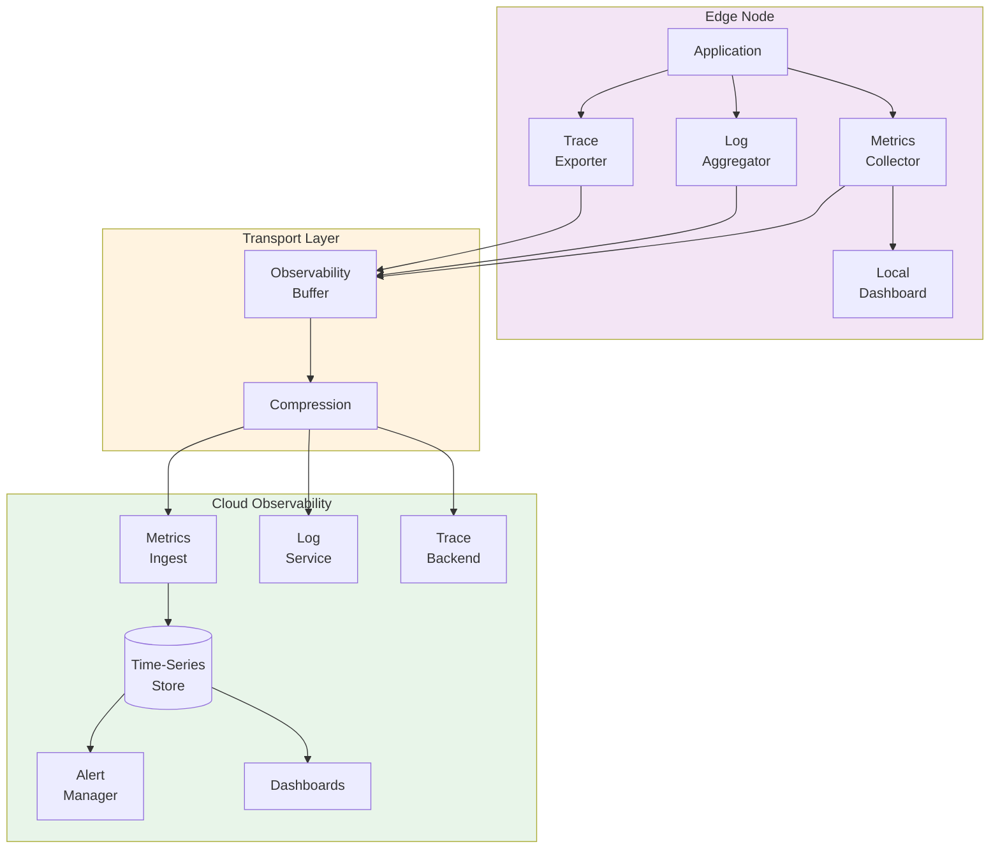
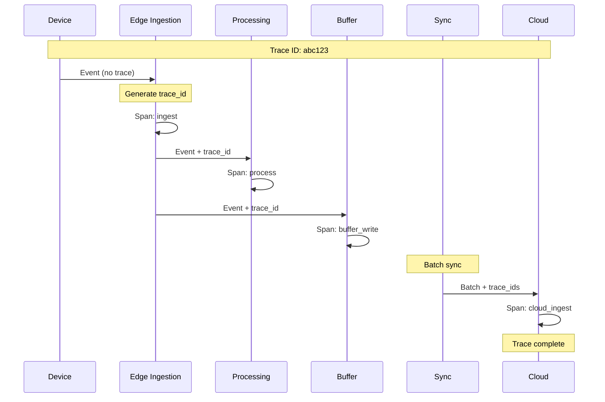
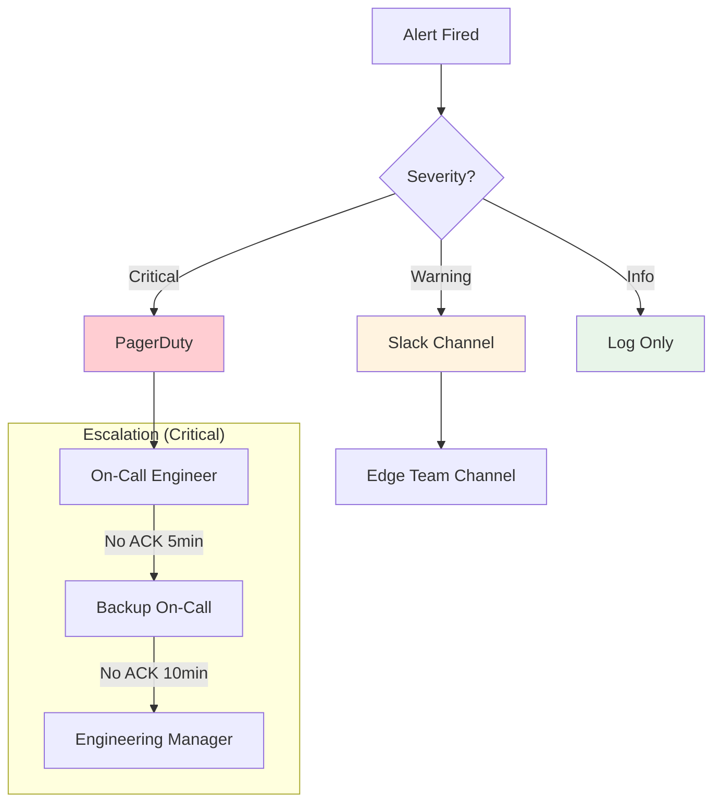

# Observability

[Back to Index](./00-index.md) | [Previous: Security](./06-security-and-compliance.md) | [Next: Interview Guide →](./08-interview-guide.md)

---

## Observability Architecture



---

## Metrics

### Key Metrics Framework

**USE Method (for Resources):**

| Resource | Utilization | Saturation | Errors |
|----------|-------------|------------|--------|
| **CPU** | cpu_usage_percent | run_queue_length | cpu_errors |
| **Memory** | memory_used_bytes | memory_pressure | oom_events |
| **Disk** | disk_used_percent | io_queue_depth | disk_errors |
| **Network** | bandwidth_used_bps | packet_queue_drops | network_errors |

**RED Method (for Services):**

| Service | Rate | Errors | Duration |
|---------|------|--------|----------|
| **Ingestion** | events_per_second | validation_errors | ingest_latency_ms |
| **Processing** | windows_processed | processing_errors | window_latency_ms |
| **Sync** | batches_per_minute | sync_failures | sync_latency_ms |
| **Query** | queries_per_second | query_errors | query_latency_ms |

### Core Metrics Catalog

#### Ingestion Metrics

| Metric | Type | Labels | Description |
|--------|------|--------|-------------|
| `edge_events_received_total` | Counter | stream, device_type | Total events received |
| `edge_events_rejected_total` | Counter | stream, reason | Events rejected (validation, rate limit) |
| `edge_ingest_latency_seconds` | Histogram | stream | Time from receive to buffer |
| `edge_bytes_received_total` | Counter | stream, protocol | Total bytes ingested |
| `edge_active_connections` | Gauge | protocol | Current device connections |

#### Buffer Metrics

| Metric | Type | Labels | Description |
|--------|------|--------|-------------|
| `edge_buffer_size_bytes` | Gauge | status | Buffer size by status (pending, syncing, synced) |
| `edge_buffer_utilization_ratio` | Gauge | - | Buffer usage as ratio of max |
| `edge_buffer_events_total` | Gauge | status | Event count by status |
| `edge_buffer_oldest_event_age_seconds` | Gauge | - | Age of oldest pending event |
| `edge_buffer_evictions_total` | Counter | reason | Events evicted (synced, overflow) |

#### Processing Metrics

| Metric | Type | Labels | Description |
|--------|------|--------|-------------|
| `edge_windows_open` | Gauge | stream, window_type | Currently open windows |
| `edge_windows_emitted_total` | Counter | stream, window_type | Windows completed and emitted |
| `edge_window_latency_seconds` | Histogram | stream | Window close to emit latency |
| `edge_late_events_total` | Counter | stream | Events arriving after window close |
| `edge_watermark_lag_seconds` | Gauge | stream | Current watermark lag from wall clock |

#### Sync Metrics

| Metric | Type | Labels | Description |
|--------|------|--------|-------------|
| `edge_sync_batches_total` | Counter | status | Batches by outcome (success, failure) |
| `edge_sync_events_total` | Counter | status | Events synced |
| `edge_sync_latency_seconds` | Histogram | - | Time to complete sync batch |
| `edge_sync_backlog_events` | Gauge | - | Events pending sync |
| `edge_sync_lag_seconds` | Gauge | - | Time since last successful sync |
| `edge_network_status` | Gauge | - | Network connectivity (1=up, 0=down) |

#### System Metrics

| Metric | Type | Labels | Description |
|--------|------|--------|-------------|
| `edge_uptime_seconds` | Gauge | - | Time since last restart |
| `edge_clock_drift_seconds` | Gauge | source | Drift from time source |
| `edge_checkpoint_age_seconds` | Gauge | - | Time since last checkpoint |
| `edge_config_version` | Gauge | - | Current configuration version |

### Metric Collection

```
FUNCTION collect_metrics() -> List[Metric]:
    metrics = []

    // Ingestion metrics
    metrics.append(Metric(
        name = "edge_events_received_total",
        type = COUNTER,
        value = ingestion_counter.value(),
        labels = {"stream": stream_id}
    ))

    // Buffer metrics
    buffer_stats = buffer.get_stats()
    metrics.append(Metric(
        name = "edge_buffer_utilization_ratio",
        type = GAUGE,
        value = buffer_stats.used_bytes / buffer_stats.max_bytes
    ))

    // Processing metrics
    FOR stream IN active_streams:
        watermark_lag = NOW() - stream.current_watermark
        metrics.append(Metric(
            name = "edge_watermark_lag_seconds",
            type = GAUGE,
            value = watermark_lag.total_seconds(),
            labels = {"stream": stream.id}
        ))

    // System metrics
    metrics.append(Metric(
        name = "edge_clock_drift_seconds",
        type = GAUGE,
        value = time_sync.get_drift().total_seconds(),
        labels = {"source": time_sync.source}
    ))

    RETURN metrics
```

### Dashboard Design

**Edge Node Dashboard Panels:**

```
┌─────────────────────────────────────────────────────────────────┐
│  EDGE NODE STATUS: edge-chicago-01                    [HEALTHY] │
├─────────────────────┬─────────────────────┬─────────────────────┤
│  Events/sec: 5,234  │  Buffer: 35%        │  Sync Lag: 45s      │
│  ████████░░ 52%     │  ███░░░░░░ 35%      │  █░░░░░░░░ 45s      │
├─────────────────────┴─────────────────────┴─────────────────────┤
│                    INGESTION THROUGHPUT (1h)                    │
│  10K ┤                    ╭─╮                                   │
│   5K ┤ ╭──────────────────╯ ╰──────────────────────────────     │
│    0 ┤─┴────────────────────────────────────────────────────    │
│       10:00    10:15    10:30    10:45    11:00                 │
├─────────────────────────────────────────────────────────────────┤
│  BUFFER UTILIZATION                 │  SYNC STATUS              │
│  ████████████████████░░░░░ 80% max  │  Last sync: 45s ago       │
│  ████████░░░░░░░░░░░░░░░░░ Current  │  Batches pending: 3       │
│  Pending: 50,234 events             │  Network: Connected       │
├─────────────────────────────────────┴───────────────────────────┤
│  WINDOW PROCESSING                                              │
│  Stream          │ Open Windows │ Emitted/min │ Late Events     │
│  temperature     │      12      │     12      │      0.1%       │
│  pressure        │      12      │     12      │      0.0%       │
│  vibration       │      24      │     24      │      0.3%       │
└─────────────────────────────────────────────────────────────────┘
```

---

## Logging

### Log Levels Strategy

| Level | When to Use | Examples | Volume |
|-------|-------------|----------|--------|
| **ERROR** | System cannot function | Buffer full, sync failed 3x | Low |
| **WARN** | Degraded but functional | High buffer usage, clock drift | Medium |
| **INFO** | Significant events | Config change, window emit | Medium |
| **DEBUG** | Troubleshooting | Event processing details | High |
| **TRACE** | Deep debugging | Wire protocol, state changes | Very High |

### Structured Log Format

```json
{
  "timestamp": "2024-01-15T10:30:00.123456Z",
  "level": "INFO",
  "logger": "edge.processing.window",
  "message": "Window emitted",
  "edge_id": "edge-chicago-01",
  "trace_id": "abc123def456",
  "span_id": "span789",
  "context": {
    "stream_id": "temperature",
    "window_start": "2024-01-15T10:25:00Z",
    "window_end": "2024-01-15T10:30:00Z",
    "event_count": 300,
    "aggregates": {
      "avg": 23.5,
      "min": 22.1,
      "max": 24.8
    }
  }
}
```

### Log Categories

| Category | Logger Name | Content |
|----------|-------------|---------|
| **Ingestion** | edge.ingest | Connection events, validation errors |
| **Processing** | edge.processing | Window lifecycle, late events |
| **Buffer** | edge.buffer | Capacity warnings, evictions |
| **Sync** | edge.sync | Batch status, failures, retries |
| **Security** | edge.security | Auth events, policy violations |
| **System** | edge.system | Startup, shutdown, health checks |

### Log Rotation and Forwarding

```
STRUCTURE LogConfig:
    local_retention_hours: 24
    max_file_size_mb: 100
    max_files: 10
    compression: "zstd"
    forward_to_cloud: TRUE
    forward_min_level: "WARN"

FUNCTION manage_logs(config: LogConfig):
    // Local rotation
    IF current_log.size > config.max_file_size_mb * MB:
        rotate_log(compress=config.compression)
        cleanup_old_logs(keep=config.max_files)

    // Forward to cloud (buffered)
    IF config.forward_to_cloud:
        pending_logs = log_buffer.get_pending(
            min_level = config.forward_min_level
        )
        IF pending_logs.count > BATCH_SIZE OR time_since_last_forward > 60s:
            cloud.forward_logs(pending_logs)
```

### Log Sampling for High-Volume Events

```
FUNCTION should_log_event(event_type: STRING, level: LogLevel) -> BOOL:
    // Always log errors and warnings
    IF level >= WARN:
        RETURN TRUE

    // Sample high-volume debug/info logs
    sample_config = {
        "event_received": 0.01,      // 1% of events
        "event_processed": 0.01,     // 1% of events
        "window_updated": 0.1,       // 10% of updates
        "heartbeat": 0.001           // 0.1% of heartbeats
    }

    rate = sample_config.get(event_type, 1.0)
    RETURN RANDOM() < rate
```

---

## Distributed Tracing

### Trace Context Propagation



### Span Structure

```
STRUCTURE Span:
    trace_id: STRING (128-bit hex)
    span_id: STRING (64-bit hex)
    parent_span_id: STRING (optional)
    operation_name: STRING
    service_name: STRING = "edge-processing"
    start_time: TIMESTAMP
    end_time: TIMESTAMP
    status: ENUM (OK, ERROR)
    tags: Map[STRING, STRING]
    logs: List[SpanLog]

STRUCTURE SpanLog:
    timestamp: TIMESTAMP
    message: STRING
    fields: Map[STRING, ANY]
```

### Key Spans

| Operation | Service | Tags | Notes |
|-----------|---------|------|-------|
| `ingest` | edge-ingest | stream, device_id, protocol | Entry point |
| `validate` | edge-ingest | schema_id, valid | Schema validation |
| `buffer_write` | edge-buffer | batch_size | Write to buffer |
| `window_assign` | edge-process | window_id, window_type | Window assignment |
| `aggregate` | edge-process | window_id, metrics | Aggregation compute |
| `window_emit` | edge-process | window_id, event_count | Window output |
| `sync_batch` | edge-sync | batch_id, event_count | Cloud sync |

### Trace Sampling Strategy

```
FUNCTION should_sample(trace_id: STRING, event: Event) -> BOOL:
    // Always sample errors
    IF event.has_error:
        RETURN TRUE

    // Always sample alerts
    IF event.is_alert:
        RETURN TRUE

    // Sample based on trace_id hash (deterministic)
    hash = fnv1a(trace_id)
    sample_rate = config.trace_sample_rate  // e.g., 0.01 = 1%

    IF (hash % 10000) < (sample_rate * 10000):
        RETURN TRUE

    // Head-based sampling for specific streams
    IF event.stream_id IN config.always_trace_streams:
        RETURN TRUE

    RETURN FALSE
```

---

## Alerting

### Alert Definitions

#### Critical Alerts (Page-Worthy)

| Alert | Condition | Duration | Action |
|-------|-----------|----------|--------|
| **BufferOverflow** | buffer_utilization > 95% | 5 min | Page on-call, enable emergency eviction |
| **SyncDown** | sync_lag > 1 hour | 10 min | Page on-call, check network |
| **ProcessingStalled** | events_processed = 0 | 5 min | Page on-call, check health |
| **DiskFull** | disk_used > 95% | Immediate | Page on-call, emergency cleanup |
| **SecurityBreach** | auth_failures > 100/min | 1 min | Page security, block IPs |

#### Warning Alerts

| Alert | Condition | Duration | Action |
|-------|-----------|----------|--------|
| **BufferHigh** | buffer_utilization > 70% | 15 min | Notify, increase sync rate |
| **SyncLag** | sync_lag > 10 min | 30 min | Notify, investigate |
| **LateEvents** | late_event_ratio > 5% | 10 min | Notify, check clock sync |
| **ClockDrift** | clock_drift > 5s | 5 min | Notify, resync time |
| **HighLatency** | p99_latency > 100ms | 10 min | Notify, check load |

### Alert Rule Configuration

```yaml
alerts:
  - name: BufferOverflow
    expr: edge_buffer_utilization_ratio > 0.95
    for: 5m
    severity: critical
    annotations:
      summary: "Edge buffer overflow imminent"
      description: "Buffer at {{ $value | humanizePercentage }} capacity"
      runbook: "https://runbooks.example.com/edge/buffer-overflow"
    labels:
      team: edge-platform

  - name: SyncDown
    expr: edge_sync_lag_seconds > 3600
    for: 10m
    severity: critical
    annotations:
      summary: "Edge sync to cloud failed"
      description: "No successful sync for {{ $value | humanizeDuration }}"
      runbook: "https://runbooks.example.com/edge/sync-failure"

  - name: LateEventsHigh
    expr: |
      rate(edge_late_events_total[5m]) / rate(edge_events_received_total[5m]) > 0.05
    for: 10m
    severity: warning
    annotations:
      summary: "High rate of late events"
      description: "{{ $value | humanizePercentage }} of events arriving late"
```

### Alert Routing



### Local Alerting (Offline Capable)

```
FUNCTION evaluate_local_alerts():
    alerts = []

    // Buffer alerts
    IF buffer.utilization > 0.90:
        alerts.append(Alert(
            name = "BufferCritical",
            severity = CRITICAL,
            message = f"Buffer at {buffer.utilization:.0%}"
        ))

    // Processing alerts
    IF processing.events_per_second < 1 AND processing.expected_rate > 100:
        alerts.append(Alert(
            name = "ProcessingStalled",
            severity = CRITICAL,
            message = "No events processed in last minute"
        ))

    // Dispatch alerts
    FOR alert IN alerts:
        // Always log locally
        log.alert(alert)

        // Try cloud notification
        IF cloud.is_connected():
            cloud.send_alert(alert)
        ELSE:
            // Fallback: SMS via cellular
            IF alert.severity == CRITICAL:
                sms_gateway.send(
                    to = config.on_call_phone,
                    message = f"[{edge_id}] {alert.name}: {alert.message}"
                )

        // Local action
        execute_local_action(alert)

FUNCTION execute_local_action(alert: Alert):
    SWITCH alert.name:
        CASE "BufferCritical":
            enable_emergency_eviction()
            reduce_ingestion_rate()

        CASE "ProcessingStalled":
            restart_processing_engine()

        CASE "DiskFull":
            emergency_log_cleanup()
            enable_aggressive_compression()
```

---

## Health Checks

### Health Check Endpoints

```
GET /health/live
Returns: 200 OK if process is running
{
  "status": "UP",
  "timestamp": "2024-01-15T10:30:00Z"
}

GET /health/ready
Returns: 200 OK if ready to accept traffic, 503 if not
{
  "status": "UP",
  "checks": {
    "buffer": "UP",
    "processing": "UP",
    "clock_sync": "UP"
  },
  "timestamp": "2024-01-15T10:30:00Z"
}

GET /health/detailed
Returns: Full health status
{
  "status": "DEGRADED",
  "checks": {
    "buffer": {
      "status": "UP",
      "utilization": 0.35,
      "pending_events": 50234
    },
    "processing": {
      "status": "UP",
      "events_per_second": 5234,
      "open_windows": 24
    },
    "sync": {
      "status": "DEGRADED",
      "last_success": "2024-01-15T10:25:00Z",
      "lag_seconds": 300,
      "reason": "Network timeout"
    },
    "clock": {
      "status": "UP",
      "drift_ms": 12,
      "source": "ntp"
    }
  }
}
```

### Health Check Implementation

```
FUNCTION check_health() -> HealthStatus:
    checks = {}
    overall = "UP"

    // Buffer health
    buffer_util = buffer.utilization_percent()
    IF buffer_util > 90:
        checks["buffer"] = HealthCheck("DOWN", f"Buffer at {buffer_util}%")
        overall = "DOWN"
    ELSE IF buffer_util > 70:
        checks["buffer"] = HealthCheck("DEGRADED", f"Buffer at {buffer_util}%")
        overall = min_status(overall, "DEGRADED")
    ELSE:
        checks["buffer"] = HealthCheck("UP")

    // Processing health
    IF processing.events_per_second == 0 AND processing.expected_rate > 0:
        checks["processing"] = HealthCheck("DOWN", "No events processed")
        overall = "DOWN"
    ELSE:
        checks["processing"] = HealthCheck("UP")

    // Sync health
    sync_lag = sync.lag_seconds()
    IF sync_lag > 3600:
        checks["sync"] = HealthCheck("DOWN", f"Sync lag {sync_lag}s")
        overall = min_status(overall, "DEGRADED")  // Don't fail readiness
    ELSE IF sync_lag > 600:
        checks["sync"] = HealthCheck("DEGRADED", f"Sync lag {sync_lag}s")
        overall = min_status(overall, "DEGRADED")
    ELSE:
        checks["sync"] = HealthCheck("UP")

    // Clock health
    drift = clock.drift_seconds()
    IF drift > 60:
        checks["clock"] = HealthCheck("DOWN", f"Clock drift {drift}s")
        overall = "DOWN"
    ELSE IF drift > 5:
        checks["clock"] = HealthCheck("DEGRADED", f"Clock drift {drift}s")
        overall = min_status(overall, "DEGRADED")
    ELSE:
        checks["clock"] = HealthCheck("UP")

    RETURN HealthStatus(status=overall, checks=checks)
```

---

## Debugging and Troubleshooting

### Common Issues Runbook

| Symptom | Likely Cause | Investigation | Resolution |
|---------|--------------|---------------|------------|
| Events not appearing | Device disconnected | Check `edge_active_connections` | Verify device cert, network |
| High buffer usage | Network outage | Check `edge_network_status` | Wait for recovery, or increase buffer |
| Late events spike | Clock drift | Check `edge_clock_drift_seconds` | Resync NTP/PTP |
| Processing slowdown | CPU saturation | Check `cpu_usage_percent` | Scale up, enable sampling |
| Sync failures | Cloud issue | Check cloud status | Retry, alert cloud team |

### Debug Commands

```bash
# Check edge status
curl http://localhost:8080/health/detailed | jq

# View recent errors
journalctl -u edge-processor --since "1 hour ago" | grep ERROR

# Check buffer status
curl http://localhost:8080/debug/buffer/stats | jq

# List open windows
curl http://localhost:8080/debug/windows | jq

# Check sync queue
curl http://localhost:8080/debug/sync/pending | jq

# Force checkpoint
curl -X POST http://localhost:8080/admin/checkpoint

# Enable debug logging (temporary)
curl -X PUT http://localhost:8080/admin/log-level -d '{"level": "DEBUG"}'
```

---

[Back to Index](./00-index.md) | [Previous: Security](./06-security-and-compliance.md) | [Next: Interview Guide →](./08-interview-guide.md)
