# Requirements & Estimations

[← Back to Index](./00-index.md) | [Next: High-Level Design →](./02-high-level-design.md)

---

## Functional Requirements

### Core Features (Must Have)

| ID | Requirement | Description |
|----|-------------|-------------|
| FR-1 | **Edge Flag Evaluation** | Evaluate feature flags at edge PoPs without origin round-trip |
| FR-2 | **Global Flag Sync** | Propagate flag changes to all edge locations within 1 second |
| FR-3 | **Targeting Rules at Edge** | Support user targeting (segments, attributes, percentages) locally |
| FR-4 | **Consistent Bucketing** | Same user always gets same variation (sticky assignments) |
| FR-5 | **Multi-Layer Fallback** | Graceful degradation: edge cache → KV → origin → defaults |
| FR-6 | **Bootstrap Support** | Initialize flags from server response (no cold start penalty) |
| FR-7 | **Segment Caching** | Cache user segment memberships at edge for targeting |

### Extended Features (Should Have)

| ID | Requirement | Description |
|----|-------------|-------------|
| FR-8 | **Edge-Local Overrides** | Per-PoP flag overrides for testing/debugging |
| FR-9 | **Geo-Targeting** | Automatic geo-based targeting using edge location |
| FR-10 | **A/B Test at Edge** | Experiment assignment and bucketing at edge layer |
| FR-11 | **Real-Time Streaming** | SSE-based updates for sub-second propagation |
| FR-12 | **Offline Resilience** | Continue serving flags if origin is unreachable |

### Out of Scope

| Exclusion | Rationale |
|-----------|-----------|
| Control Plane UI | Covered in [2.7 Feature Flag Management](../2.7-feature-flag-management/00-index.md) |
| Experimentation Analytics | Metrics aggregation handled by origin systems |
| SDK Development | Focus is on edge layer, not client/server SDKs |
| Flag CRUD Operations | Management API is origin-side concern |

---

## Non-Functional Requirements

### Performance

| Metric | Requirement | Rationale |
|--------|-------------|-----------|
| **Evaluation Latency (P50)** | <5ms | In-memory lookup at edge |
| **Evaluation Latency (P99)** | <15ms | Occasional cache refresh |
| **Global Propagation** | <1 second | Streaming-based sync |
| **Bootstrap Time** | <25ms | Initial flag load from response |
| **Cold Start (Edge Worker)** | <5ms | V8 isolate spin-up |

### Availability & Reliability

| Metric | Requirement | Rationale |
|--------|-------------|-----------|
| **Per-PoP Availability** | 99.99% | Individual edge node uptime |
| **Global Availability** | 99.999% | Anycast routes to healthy PoPs |
| **Data Durability** | 99.9999% | Flags are ephemeral (origin is source of truth) |
| **Failover Time** | <100ms | BGP reconvergence to alternate PoP |

### Consistency

| Metric | Requirement | Rationale |
|--------|-------------|-----------|
| **Consistency Model** | Eventual | Brief staleness acceptable for feature flags |
| **Staleness Budget** | <1 second typical, <10 seconds max | Streaming keeps edge fresh |
| **Read-Your-Writes** | Optional (origin-routed writes) | Not critical for flag reads |

### Scalability

| Metric | Requirement | Rationale |
|--------|-------------|-----------|
| **Edge Locations** | 100-300+ PoPs | Global coverage |
| **Flags per Organization** | 10,000+ | Enterprise scale |
| **Evaluations per Second** | 100K+ per PoP | High-traffic edge locations |
| **Concurrent Connections** | 10K+ SSE streams per origin | Streaming to edge nodes |

---

## Capacity Estimations

### Assumptions

| Parameter | Value | Notes |
|-----------|-------|-------|
| Number of edge PoPs | 200 | Global CDN coverage |
| Flags per organization | 5,000 | Mid-size deployment |
| Average flag config size | 500 bytes | Rules, targeting, variations |
| Segment definitions | 500 | Reusable user segments |
| Average segment size | 200 bytes | Segment rules |
| Flag changes per hour | 50 | Active development team |
| Peak evaluations per PoP | 100,000/second | High-traffic scenario |

### Storage Calculations

| Component | Calculation | Result |
|-----------|-------------|--------|
| **Flag data per PoP** | 5,000 flags × 500 bytes | **2.5 MB** |
| **Segment data per PoP** | 500 segments × 200 bytes | **100 KB** |
| **Total per PoP** | Flag + Segment data | **~2.6 MB** |
| **Global flag storage** | 2.6 MB × 200 PoPs | **520 MB** |

### Bandwidth Calculations

| Flow | Calculation | Result |
|------|-------------|--------|
| **Flag sync (per change)** | 500 bytes × 200 PoPs | **100 KB** |
| **Hourly sync bandwidth** | 50 changes × 100 KB | **5 MB/hour** |
| **Daily sync bandwidth** | 5 MB × 24 hours | **120 MB/day** |
| **SSE overhead per PoP** | ~1 KB/minute keepalive × 200 PoPs | **200 KB/minute** |

### Throughput Calculations

| Metric | Calculation | Result |
|--------|-------------|--------|
| **Peak global evaluations** | 100K/sec × 200 PoPs | **20M evaluations/sec** |
| **Evaluation memory ops** | Hash lookup + rule match | **<1μs per eval** |
| **Memory bandwidth per PoP** | 100K × 500 bytes (read) | **50 MB/sec** |

---

## Back-of-Envelope Summary

```
┌─────────────────────────────────────────────────────────────────┐
│                    CAPACITY SUMMARY                             │
├─────────────────────────────────────────────────────────────────┤
│  STORAGE (per PoP)                                              │
│  • Flag configurations: 2.5 MB                                  │
│  • Segment definitions: 100 KB                                  │
│  • Working memory: ~10 MB (with indexes)                        │
│  • Total per PoP: <50 MB                                        │
├─────────────────────────────────────────────────────────────────┤
│  THROUGHPUT                                                     │
│  • Per-PoP evaluations: 100K/sec peak                           │
│  • Global evaluations: 20M/sec peak                             │
│  • Sync messages: 50/hour (flag changes)                        │
│  • SSE connections: 200 (one per PoP)                           │
├─────────────────────────────────────────────────────────────────┤
│  BANDWIDTH                                                      │
│  • Origin → Edge sync: 120 MB/day                               │
│  • SSE keepalive overhead: 300 MB/day                           │
│  • Total sync bandwidth: <500 MB/day                            │
├─────────────────────────────────────────────────────────────────┤
│  LATENCY BUDGET                                                 │
│  • Network to edge: 0ms (local)                                 │
│  • Memory lookup: <1ms                                          │
│  • Rule evaluation: <2ms                                        │
│  • Response serialization: <1ms                                 │
│  • Total: <5ms P50                                              │
└─────────────────────────────────────────────────────────────────┘
```

---

## SLOs and SLAs

### Service Level Objectives (SLOs)

| SLO | Target | Measurement Window |
|-----|--------|-------------------|
| **Evaluation Availability** | 99.99% | Per PoP, monthly |
| **Evaluation Latency (P50)** | <5ms | Rolling 5-minute |
| **Evaluation Latency (P99)** | <15ms | Rolling 5-minute |
| **Global Propagation** | <1 second for 99% of updates | Per flag change |
| **Bootstrap Success Rate** | 99.9% | Per initialization |
| **Fallback Activation** | <100ms | On edge failure |

### Service Level Agreements (SLAs)

| Tier | Availability | Propagation | Support |
|------|--------------|-------------|---------|
| **Standard** | 99.9% | <5 seconds | Business hours |
| **Pro** | 99.95% | <2 seconds | 24/7 email |
| **Enterprise** | 99.99% | <1 second | 24/7 phone + dedicated |

### Error Budgets

| SLO | Target | Monthly Budget | Minutes/Month |
|-----|--------|----------------|---------------|
| 99.99% availability | 0.01% downtime | 4.32 minutes | ~4 min |
| 99.95% availability | 0.05% downtime | 21.6 minutes | ~22 min |
| 99.9% availability | 0.1% downtime | 43.2 minutes | ~43 min |

---

## Constraints & Assumptions

### Technical Constraints

| Constraint | Impact |
|------------|--------|
| **Edge worker memory limit** | Typically 128MB; must fit flags + runtime |
| **Edge worker CPU time** | 10-50ms limits per request |
| **No persistent connections at edge** | SSE terminates at origin, push to edge |
| **Eventual consistency** | Cannot guarantee strong consistency globally |

### Business Constraints

| Constraint | Impact |
|------------|--------|
| **Multi-tenant isolation** | Flags from different orgs must be isolated |
| **Compliance (GDPR/CCPA)** | User targeting data at edge must comply |
| **Cost sensitivity** | Edge compute charged per request/duration |

### Assumptions

| Assumption | Rationale |
|------------|-----------|
| Flags change infrequently | 50 changes/hour is high-activity scenario |
| Read-heavy workload | 1M+ reads per write is typical |
| Staleness is acceptable | Feature flags can be 1-10 seconds stale |
| Edge PoPs are reliable | 99.99% per-PoP availability achievable |

---

## Use Cases by Flag Type

| Flag Type | Freshness Need | Cache Strategy | Staleness Budget |
|-----------|----------------|----------------|------------------|
| **Kill Switch** | Critical | Short TTL (10s) | <30 seconds |
| **Release Flag** | Important | Medium TTL (1 min) | <2 minutes |
| **Experiment Flag** | Session-stable | Session-based | Session duration |
| **Operational Flag** | Relaxed | Long TTL (1 hour) | Hours |
| **Permission Flag** | User-specific | Per-user cache | Until segment change |

---

## Latency Breakdown

```mermaid
gantt
    title Edge Flag Evaluation Latency Budget (5ms target)
    dateFormat X
    axisFormat %L ms

    section Evaluation
    Memory lookup       :0, 1
    Rule matching       :1, 2
    Consistent hash     :2, 1
    Response build      :3, 1

    section Buffer
    Safety margin       :4, 1
```



| Phase | Time | Description |
|-------|------|-------------|
| Memory lookup | 0.5ms | Hash table access for flag config |
| Rule matching | 1.5ms | Evaluate targeting rules |
| Consistent hash | 0.5ms | Compute bucket for percentage rollout |
| Response build | 0.5ms | Serialize evaluation result |
| **Total** | **3ms** | Well under 5ms budget |
| Buffer | 2ms | For edge cases, GC pauses |

---

**Next:** [High-Level Design →](./02-high-level-design.md)
