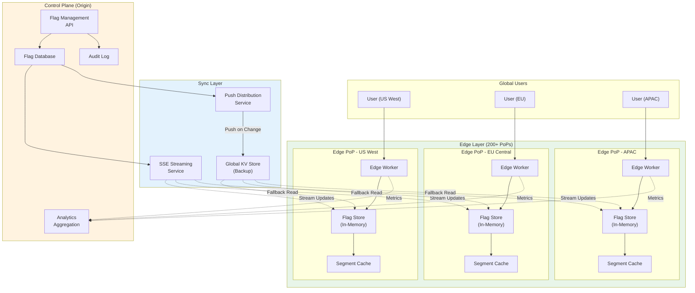
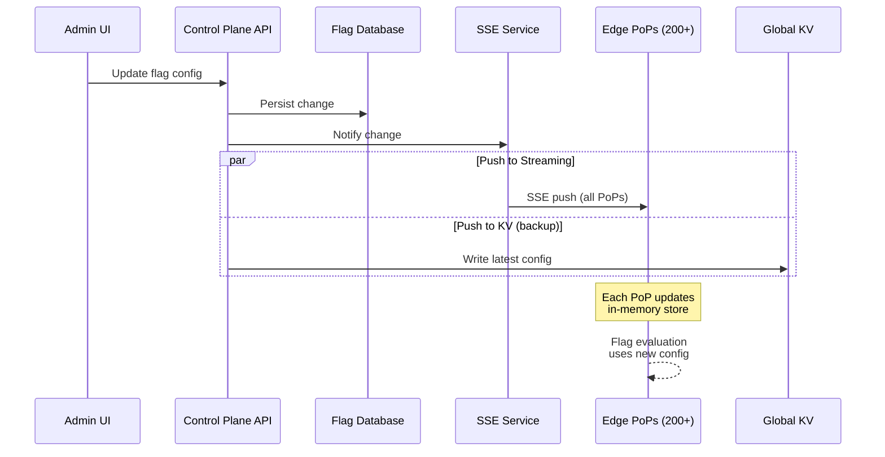
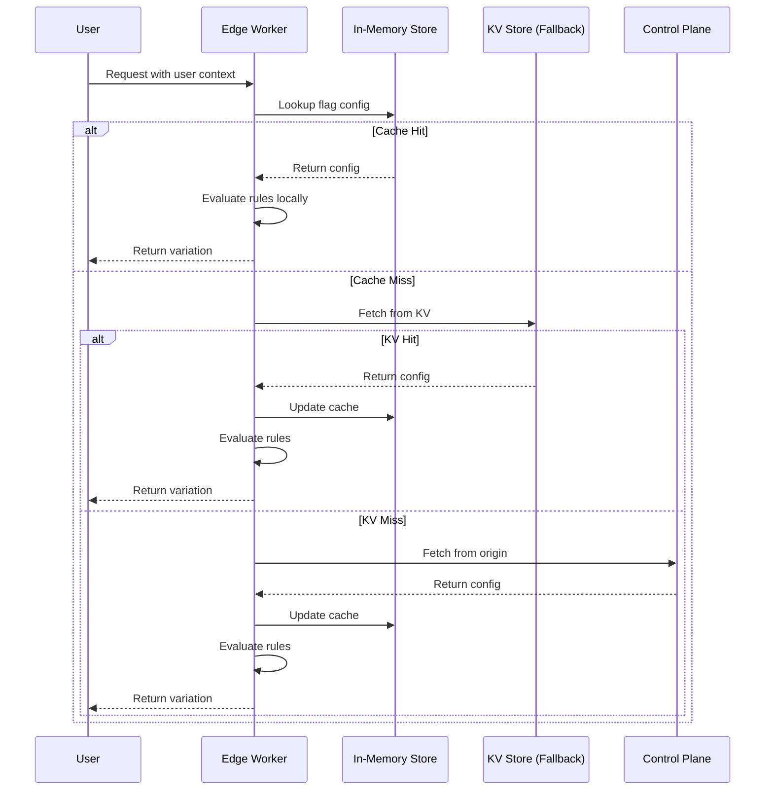
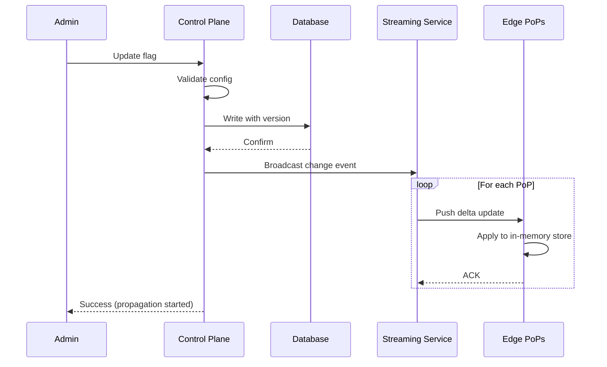
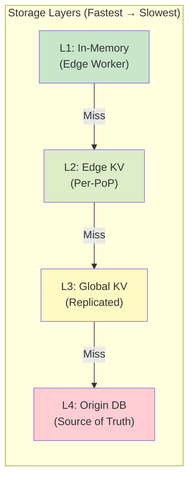
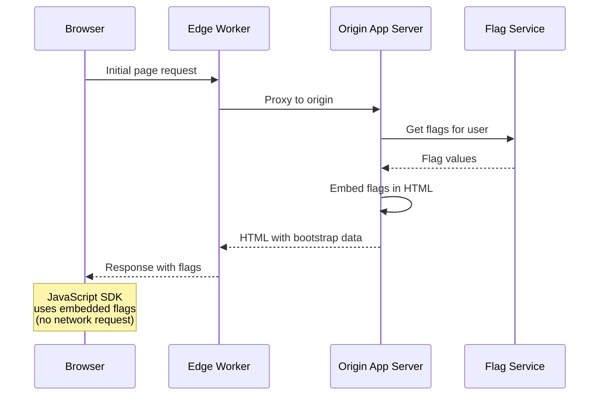
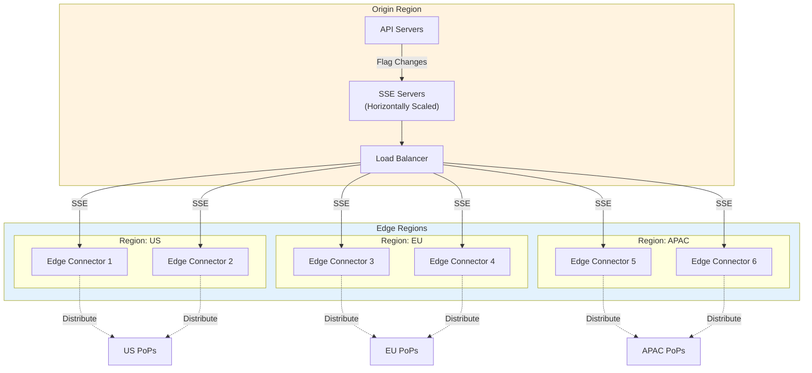
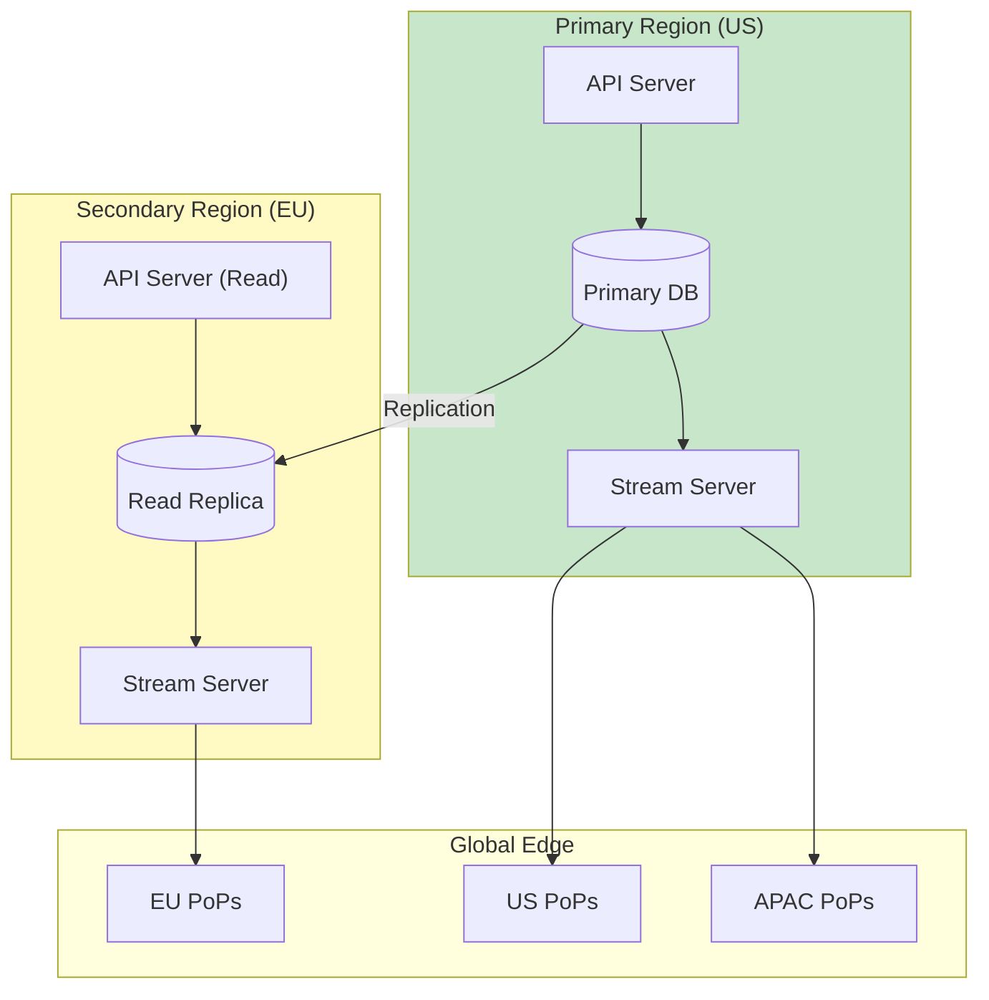
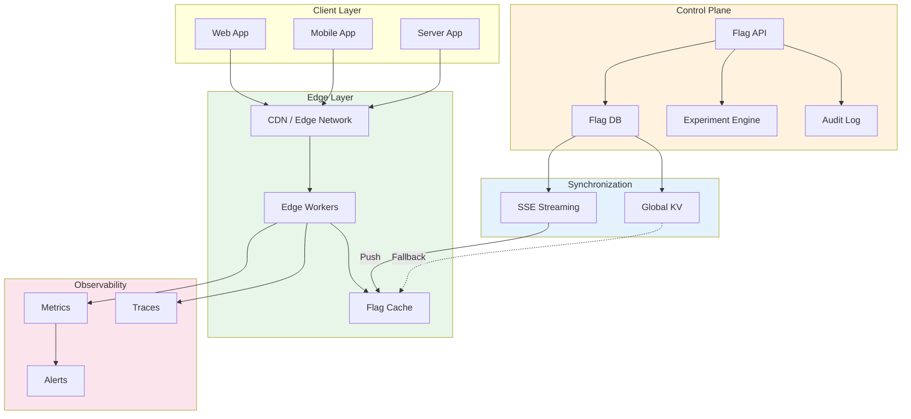

# High-Level Design

[← Back to Index](./00-index.md) | [Previous: Requirements](./01-requirements-and-estimations.md) | [Next: Low-Level Design →](./03-low-level-design.md)

---

## Architecture Overview

The edge-native feature flags system consists of three main layers:
1. **Control Plane** (Origin): Flag management, source of truth
2. **Sync Layer**: Push-based distribution to edge nodes
3. **Edge Layer**: Local evaluation at each PoP



---

## Push-Based Distribution Model

### Why Push Over Pull?

| Aspect | Push-Based | Pull-Based |
|--------|------------|------------|
| **First Request Latency** | <5ms (pre-positioned) | Cold start penalty |
| **Staleness** | <1 second | Cache TTL dependent |
| **Origin Load** | Proportional to changes | Proportional to requests |
| **Bandwidth** | Efficient (only changes) | Wasteful (full fetches) |
| **Complexity** | Higher (streaming infra) | Lower (simple HTTP) |

**Decision:** Use **push-based distribution** for flag configs to eliminate cold start and achieve sub-second propagation.

### Push Flow Architecture



---

## Data Flow Patterns

### Read Path (Flag Evaluation)



### Write Path (Flag Update)



---

## Key Architectural Decisions

### 1. Streaming Protocol Selection

| Protocol | Latency | Reliability | Complexity | Decision |
|----------|---------|-------------|------------|----------|
| **SSE (Server-Sent Events)** | <1s | Good (auto-reconnect) | Medium | **Selected** |
| WebSocket | <1s | Good | Higher | Overkill for unidirectional |
| Long Polling | 1-10s | Lower | Low | Too slow |
| gRPC Streaming | <1s | Excellent | High | Complex for edge deployment |

**Rationale:** SSE provides sub-second delivery with automatic reconnection, works over HTTP (CDN-friendly), and has native browser support for debugging.

### 2. Edge Storage Strategy



| Layer | Latency | Capacity | Durability | Use Case |
|-------|---------|----------|------------|----------|
| L1: In-Memory | <1ms | ~50MB | None (ephemeral) | Hot path evaluation |
| L2: Edge KV | 1-5ms | 1GB | Per-PoP | Cold start, worker restart |
| L3: Global KV | 5-20ms | Unlimited | Replicated | Cross-PoP consistency |
| L4: Origin | 50-200ms | Unlimited | Persistent | Source of truth |

### 3. Consistency Model

| Requirement | Model | Implementation |
|-------------|-------|----------------|
| **Flag reads** | Eventual | In-memory cache with streaming updates |
| **Flag writes** | Strong | Origin DB with transactions |
| **Propagation guarantee** | Best-effort, bounded | SSE + heartbeat + reconciliation |
| **Staleness budget** | <1 second (99th percentile) | Streaming latency SLO |

### 4. Bootstrap Strategy

To eliminate cold start latency for new users/sessions:



**Bootstrap Payload (embedded in HTML):**
```
<script>
  window.__FLAG_BOOTSTRAP__ = {
    "version": "v123",
    "flags": {
      "new-checkout": { "value": true, "variation": 1 },
      "dark-mode": { "value": false, "variation": 0 }
    }
  };
</script>
```

---

## Component Responsibilities

### Control Plane Components

| Component | Responsibility | Technology |
|-----------|---------------|------------|
| **Flag Management API** | CRUD operations, validation | REST/GraphQL API |
| **Flag Database** | Persistent storage, versioning | Relational DB (strong consistency) |
| **Audit Service** | Change logging, compliance | Append-only log |
| **Streaming Service** | SSE to edge nodes | Event streaming platform |
| **Analytics Aggregator** | Collect edge metrics | Time-series DB |

### Edge Layer Components

| Component | Responsibility | Technology |
|-----------|---------------|------------|
| **Edge Worker** | Request handling, evaluation | V8 Isolate / WASM |
| **In-Memory Store** | Hot flag cache | Worker memory (Map/Object) |
| **Segment Cache** | User segment memberships | LRU cache |
| **Evaluator** | Rule matching, bucketing | Local computation |
| **Metrics Collector** | Usage tracking | Async batched |

---

## Sync Architecture Deep Dive

### Streaming Connection Model



### Sync Message Types

| Message Type | Trigger | Payload | Frequency |
|--------------|---------|---------|-----------|
| **FLAG_UPDATE** | Flag changed | Delta (changed flag only) | On change |
| **SEGMENT_UPDATE** | Segment changed | Delta (changed segment) | On change |
| **FULL_SYNC** | Reconnection, drift | Complete flag set | Rare |
| **HEARTBEAT** | Keepalive | Timestamp, version | Every 30s |
| **ACK** | Update received | Version confirmed | Per update |

---

## Deployment Architecture

### Multi-Region Control Plane



### Edge Worker Deployment

| Deployment Model | Description | Use Case |
|-----------------|-------------|----------|
| **CDN Workers** | Deploy to CDN provider's edge | Cloudflare Workers, Vercel Edge |
| **Self-Hosted Edge** | Relay proxy in customer infra | Air-gapped, compliance |
| **Hybrid** | CDN + self-hosted for sensitive | Enterprise deployments |

---

## Architecture Pattern Checklist

| Decision | Choice | Rationale |
|----------|--------|-----------|
| Sync vs Async | **Async** (streaming) | Non-blocking flag updates |
| Push vs Pull | **Push** (SSE) | Eliminate cold start, sub-second propagation |
| Stateless vs Stateful | **Stateful** (cached state) | In-memory flag store for low latency |
| Read-heavy optimization | **Yes** | 1M+ reads per write |
| Edge vs Origin | **Edge evaluation** | <5ms latency requirement |
| Real-time vs Batch | **Real-time** streaming | <1 second propagation |

---

## High-Level Component Diagram



---

**Next:** [Low-Level Design →](./03-low-level-design.md)
