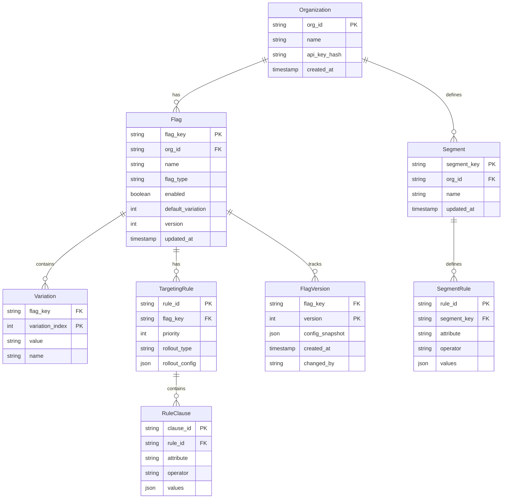

# Low-Level Design

[← Back to Index](./00-index.md) | [Previous: High-Level Design](./02-high-level-design.md) | [Next: Deep Dive →](./04-deep-dive-and-bottlenecks.md)

---

## Data Model

### Core Entities



### Edge Flag Configuration Schema

The configuration pushed to edge nodes is a denormalized, optimized format:

```
EdgeFlagConfig {
  version: string              // "v1234" - for sync tracking
  updated_at: timestamp        // Last modification time
  flags: Map<string, EdgeFlag> // flag_key -> config
  segments: Map<string, EdgeSegment>  // segment_key -> rules
}

EdgeFlag {
  key: string
  enabled: boolean
  variations: Variation[]
  default_variation: int
  rules: TargetingRule[]       // Ordered by priority
  fallthrough: RolloutConfig   // Default if no rules match
  salt: string                 // For consistent hashing
}

Variation {
  index: int
  value: any                   // boolean, string, number, JSON
  name: string                 // Human-readable
}

TargetingRule {
  id: string
  clauses: RuleClause[]        // AND logic within rule
  rollout: RolloutConfig
}

RuleClause {
  attribute: string            // "user_id", "country", "plan"
  operator: string             // "equals", "contains", "in", "startsWith"
  values: any[]                // Values to match against
  negate: boolean              // NOT operator
}

RolloutConfig {
  type: "variation" | "percentage" | "experiment"
  variation?: int              // Fixed variation index
  weights?: int[]              // Percentage weights per variation
  bucket_by?: string           // Attribute for bucketing (default: user key)
}

EdgeSegment {
  key: string
  rules: SegmentRule[]         // OR logic between rules
}

SegmentRule {
  clauses: RuleClause[]        // AND logic within rule
}
```

### Example Edge Configuration

```
{
  "version": "v1705934521",
  "updated_at": "2025-01-22T10:00:00Z",
  "flags": {
    "new-checkout-flow": {
      "key": "new-checkout-flow",
      "enabled": true,
      "variations": [
        { "index": 0, "value": false, "name": "Control" },
        { "index": 1, "value": true, "name": "Treatment" }
      ],
      "default_variation": 0,
      "rules": [
        {
          "id": "rule-1",
          "clauses": [
            { "attribute": "segment", "operator": "in", "values": ["beta-users"] }
          ],
          "rollout": { "type": "variation", "variation": 1 }
        },
        {
          "id": "rule-2",
          "clauses": [
            { "attribute": "country", "operator": "in", "values": ["US", "CA"] }
          ],
          "rollout": {
            "type": "percentage",
            "weights": [50, 50],
            "bucket_by": "user_id"
          }
        }
      ],
      "fallthrough": { "type": "variation", "variation": 0 },
      "salt": "abc123"
    }
  },
  "segments": {
    "beta-users": {
      "key": "beta-users",
      "rules": [
        {
          "clauses": [
            { "attribute": "email", "operator": "endsWith", "values": ["@company.com"] }
          ]
        },
        {
          "clauses": [
            { "attribute": "user_id", "operator": "in", "values": ["user-1", "user-2"] }
          ]
        }
      ]
    }
  }
}
```

---

## API Design

### Edge Evaluation API

**Endpoint: Evaluate Single Flag**

```
POST /v1/flags/{flag_key}/evaluate
Headers:
  Authorization: Bearer {sdk_key}
  X-Edge-Location: {pop_id}

Request Body:
{
  "context": {
    "key": "user-12345",            // Required: targeting key
    "anonymous": false,
    "attributes": {
      "email": "user@example.com",
      "country": "US",
      "plan": "premium",
      "custom": { "beta_tester": true }
    }
  }
}

Response (200 OK):
{
  "flag_key": "new-checkout-flow",
  "value": true,
  "variation_index": 1,
  "variation_name": "Treatment",
  "reason": {
    "kind": "RULE_MATCH",
    "rule_id": "rule-2",
    "rule_index": 1
  },
  "version": "v1705934521"
}
```

**Endpoint: Evaluate All Flags (Bootstrap)**

```
POST /v1/flags/evaluate-all
Headers:
  Authorization: Bearer {sdk_key}

Request Body:
{
  "context": { ... }
}

Response (200 OK):
{
  "flags": {
    "new-checkout-flow": {
      "value": true,
      "variation_index": 1,
      "reason": { "kind": "RULE_MATCH", "rule_id": "rule-2" }
    },
    "dark-mode": {
      "value": false,
      "variation_index": 0,
      "reason": { "kind": "FALLTHROUGH" }
    }
  },
  "version": "v1705934521",
  "evaluated_at": "2025-01-22T10:05:00Z"
}
```

### Sync API (Internal)

**SSE Stream Endpoint**

```
GET /v1/stream/flags
Headers:
  Authorization: Bearer {edge_token}
  Last-Event-ID: {last_version}    // For reconnection

Response (SSE Stream):
event: flag_update
id: v1705934522
data: {"type":"FLAG_UPDATE","flag_key":"new-checkout","config":{...}}

event: segment_update
id: v1705934523
data: {"type":"SEGMENT_UPDATE","segment_key":"beta-users","config":{...}}

event: heartbeat
id: v1705934524
data: {"type":"HEARTBEAT","timestamp":"2025-01-22T10:05:30Z"}
```

**Full Sync Endpoint (Fallback)**

```
GET /v1/flags/config
Headers:
  Authorization: Bearer {edge_token}
  If-None-Match: {current_version}

Response (200 OK):
{
  "version": "v1705934521",
  "flags": { ... },
  "segments": { ... }
}

Response (304 Not Modified):
// Empty body if version matches
```

### Control Plane API (Origin)

**Create/Update Flag**

```
PUT /v1/projects/{project_key}/flags/{flag_key}
Headers:
  Authorization: Bearer {api_token}

Request Body:
{
  "name": "New Checkout Flow",
  "enabled": true,
  "variations": [...],
  "rules": [...],
  "fallthrough": {...}
}

Response (200 OK):
{
  "flag": { ... },
  "version": "v1705934522",
  "propagation_status": "IN_PROGRESS"
}
```

---

## Core Algorithms

### Flag Evaluation Algorithm

```
FUNCTION EvaluateFlag(flag_key, context):
    // 1. Get flag configuration from cache
    flag = GetFlagFromCache(flag_key)

    IF flag IS NULL:
        RETURN DefaultValue(flag_key)

    IF NOT flag.enabled:
        RETURN flag.variations[flag.default_variation]

    // 2. Evaluate targeting rules in priority order
    FOR rule IN flag.rules:
        IF EvaluateRule(rule, context):
            RETURN ApplyRollout(rule.rollout, context, flag)

    // 3. No rules matched - use fallthrough
    RETURN ApplyRollout(flag.fallthrough, context, flag)


FUNCTION EvaluateRule(rule, context):
    // All clauses must match (AND logic)
    FOR clause IN rule.clauses:
        IF NOT EvaluateClause(clause, context):
            RETURN FALSE
    RETURN TRUE


FUNCTION EvaluateClause(clause, context):
    // Get attribute value from context
    attr_value = GetAttribute(context, clause.attribute)

    // Handle segment membership
    IF clause.attribute == "segment":
        result = CheckSegmentMembership(clause.values, context)
    ELSE:
        result = ApplyOperator(clause.operator, attr_value, clause.values)

    RETURN clause.negate XOR result


FUNCTION ApplyOperator(operator, attr_value, target_values):
    SWITCH operator:
        CASE "equals":
            RETURN attr_value IN target_values
        CASE "contains":
            RETURN ANY(v IN attr_value FOR v IN target_values)
        CASE "startsWith":
            RETURN ANY(attr_value.startsWith(v) FOR v IN target_values)
        CASE "endsWith":
            RETURN ANY(attr_value.endsWith(v) FOR v IN target_values)
        CASE "greaterThan":
            RETURN attr_value > target_values[0]
        CASE "lessThan":
            RETURN attr_value < target_values[0]
        CASE "regex":
            RETURN target_values[0].match(attr_value)
        DEFAULT:
            RETURN FALSE
```

### Consistent Bucketing Algorithm

```
FUNCTION ApplyRollout(rollout, context, flag):
    IF rollout.type == "variation":
        // Fixed variation
        RETURN flag.variations[rollout.variation]

    IF rollout.type == "percentage" OR rollout.type == "experiment":
        // Percentage-based rollout
        bucket_value = GetBucketValue(context, rollout.bucket_by)
        bucket = ComputeBucket(flag.key, flag.salt, bucket_value)

        // Find variation based on bucket
        variation_index = GetVariationForBucket(bucket, rollout.weights)
        RETURN flag.variations[variation_index]


FUNCTION ComputeBucket(flag_key, salt, bucket_value):
    // Consistent hash for sticky bucketing
    input = flag_key + "." + salt + "." + bucket_value
    hash = SHA256(input)

    // Take first 15 hex characters and convert to bucket (0-99999)
    hash_substring = hash.substring(0, 15)
    int_value = ParseHexToInt(hash_substring)
    bucket = int_value MOD 100000

    RETURN bucket


FUNCTION GetVariationForBucket(bucket, weights):
    // weights: [50000, 50000] means 50% each (out of 100000)
    cumulative = 0

    FOR i = 0 TO weights.length - 1:
        cumulative = cumulative + weights[i]
        IF bucket < cumulative:
            RETURN i

    // Fallback to last variation
    RETURN weights.length - 1
```

**Complexity Analysis:**

| Operation | Time | Space |
|-----------|------|-------|
| Flag lookup | O(1) | O(1) |
| Rule evaluation | O(R × C) | O(1) |
| Segment check | O(S × C) | O(1) |
| Consistent hash | O(1) | O(1) |
| **Total per evaluation** | O(R × C) | O(1) |

Where R = number of rules, C = clauses per rule, S = segment rules.

### Segment Membership Check

```
FUNCTION CheckSegmentMembership(segment_keys, context):
    FOR segment_key IN segment_keys:
        segment = GetSegmentFromCache(segment_key)

        IF segment IS NOT NULL:
            // OR logic between segment rules
            FOR rule IN segment.rules:
                IF EvaluateRule(rule, context):
                    RETURN TRUE

    RETURN FALSE
```

---

## Edge Cache Implementation

### In-Memory Store Structure

```
EdgeFlagStore {
    // Primary storage
    flags: HashMap<string, EdgeFlag>
    segments: HashMap<string, EdgeSegment>

    // Metadata
    version: string
    last_sync: timestamp
    sync_status: "SYNCED" | "STALE" | "DISCONNECTED"

    // Indexes for fast lookup
    flags_by_tag: HashMap<string, Set<string>>  // tag -> flag_keys
}

FUNCTION InitializeStore():
    // Try layers in order
    data = TryLoadFromSSE()

    IF data IS NULL:
        data = TryLoadFromKV()

    IF data IS NULL:
        data = TryLoadFromOrigin()

    IF data IS NULL:
        data = LoadDefaultConfig()

    store.flags = data.flags
    store.segments = data.segments
    store.version = data.version
    store.sync_status = "SYNCED"


FUNCTION HandleSSEMessage(message):
    SWITCH message.type:
        CASE "FLAG_UPDATE":
            store.flags[message.flag_key] = message.config
            store.version = message.id

        CASE "SEGMENT_UPDATE":
            store.segments[message.segment_key] = message.config
            store.version = message.id

        CASE "FULL_SYNC":
            store.flags = message.flags
            store.segments = message.segments
            store.version = message.version

        CASE "HEARTBEAT":
            store.last_sync = message.timestamp
            store.sync_status = "SYNCED"

    // Persist to edge KV for cold start
    PersistToEdgeKV(store)
```

### Cache Eviction Strategy

```
FUNCTION ManageMemory():
    current_size = CalculateStoreSize()

    IF current_size > MAX_MEMORY_THRESHOLD:
        // Evict least recently evaluated flags
        sorted_flags = SortByLastEvaluated(store.flags)

        WHILE current_size > TARGET_MEMORY_SIZE:
            flag_to_evict = sorted_flags.pop()

            // Don't evict if recently evaluated
            IF flag_to_evict.last_evaluated > NOW - 5_MINUTES:
                BREAK

            // Move to KV store (cold storage)
            PersistToKV(flag_to_evict)
            RemoveFromMemory(flag_to_evict)

            current_size = CalculateStoreSize()
```

---

## Sync Protocol Implementation

### SSE Client with Reconnection

```
FUNCTION StartSSEConnection():
    connection = NULL
    backoff = ExponentialBackoff(initial=100ms, max=30s)

    WHILE TRUE:
        TRY:
            url = SSE_ENDPOINT + "?since=" + store.version
            connection = OpenSSEConnection(url, headers={
                "Authorization": "Bearer " + EDGE_TOKEN,
                "Last-Event-ID": store.version
            })

            backoff.reset()

            FOR message IN connection:
                HandleSSEMessage(message)
                store.sync_status = "SYNCED"

        CATCH ConnectionError:
            store.sync_status = "DISCONNECTED"
            LogError("SSE connection failed")

            // Fallback to polling during disconnect
            StartPollingFallback()

            // Exponential backoff for reconnection
            WAIT backoff.next()


FUNCTION StartPollingFallback():
    WHILE store.sync_status == "DISCONNECTED":
        TRY:
            response = FetchFromKV()
            IF response.version > store.version:
                ApplyFullSync(response)

            WAIT POLLING_INTERVAL (10 seconds)

        CATCH Error:
            LogError("Polling fallback failed")
```

### Version Reconciliation

```
FUNCTION ReconcileVersions():
    // Periodic check for drift
    origin_version = FetchOriginVersion()

    IF origin_version != store.version:
        LogWarning("Version drift detected", {
            "local": store.version,
            "origin": origin_version
        })

        // Request full sync
        RequestFullSync()


FUNCTION RequestFullSync():
    response = FetchFullConfig()
    store.flags = response.flags
    store.segments = response.segments
    store.version = response.version
    store.sync_status = "SYNCED"

    LogInfo("Full sync completed", {"version": store.version})
```

---

## Wire Format Optimization

### Compact Binary Encoding

For bandwidth efficiency, use compact encoding for flag configs:

```
// Flags can be encoded using MessagePack or Protocol Buffers
// Example sizes:

JSON encoding:     ~500 bytes per flag
MessagePack:       ~300 bytes per flag (40% smaller)
Protocol Buffers:  ~250 bytes per flag (50% smaller)

// For 5000 flags:
JSON:              2.5 MB
MessagePack:       1.5 MB
Protocol Buffers:  1.25 MB
```

### Delta Updates

```
DeltaUpdate {
    type: "ADD" | "UPDATE" | "DELETE"
    flag_key: string
    config?: EdgeFlag    // For ADD/UPDATE
    version: string
}

// Delta message is typically 500 bytes vs 2.5MB full sync
// 5000x bandwidth reduction for single flag updates
```

---

## Indexing Strategy

### Flag Lookup Indexes

| Index | Purpose | Structure |
|-------|---------|-----------|
| **Primary** | Fast key lookup | HashMap<flag_key, EdgeFlag> |
| **By Tag** | Batch operations | HashMap<tag, Set<flag_key>> |
| **By Project** | Multi-tenant isolation | HashMap<project_id, Set<flag_key>> |
| **Recently Evaluated** | Eviction ordering | PriorityQueue<flag_key, timestamp> |

### Segment Membership Index

```
// For frequently checked segments, pre-compute memberships
SegmentMembershipCache {
    // user_key -> set of segment_keys they belong to
    memberships: HashMap<string, Set<string>>

    // TTL per entry
    expiry: HashMap<string, timestamp>
}

FUNCTION GetCachedSegments(user_key):
    IF user_key IN memberships AND NOT IsExpired(user_key):
        RETURN memberships[user_key]

    // Compute and cache
    segments = ComputeSegmentMembership(user_key, context)
    memberships[user_key] = segments
    expiry[user_key] = NOW + SEGMENT_CACHE_TTL

    RETURN segments
```

---

**Next:** [Deep Dive & Bottlenecks →](./04-deep-dive-and-bottlenecks.md)
