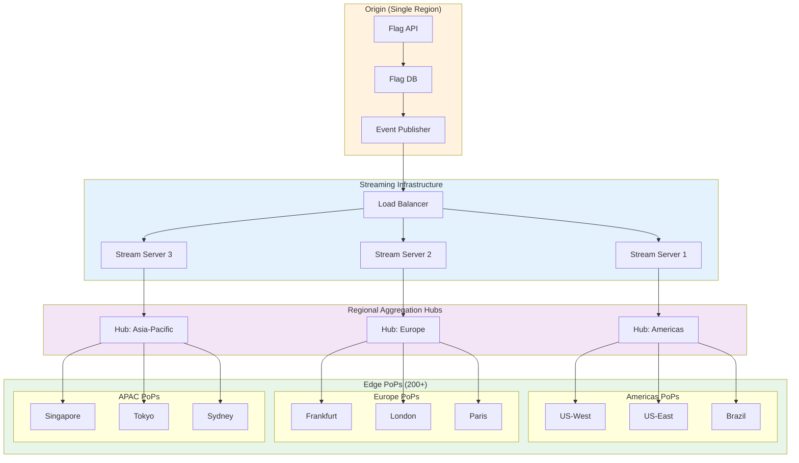
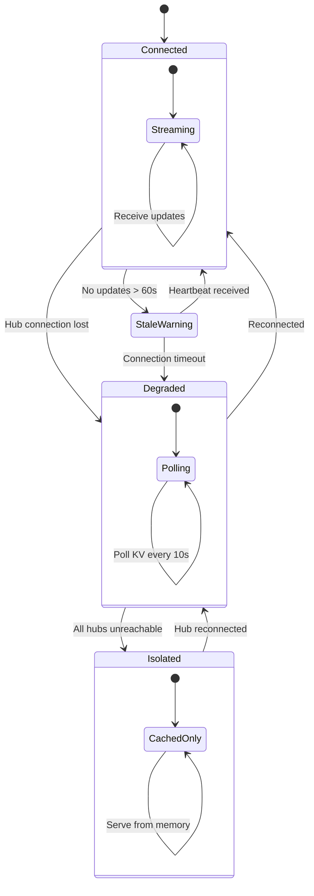
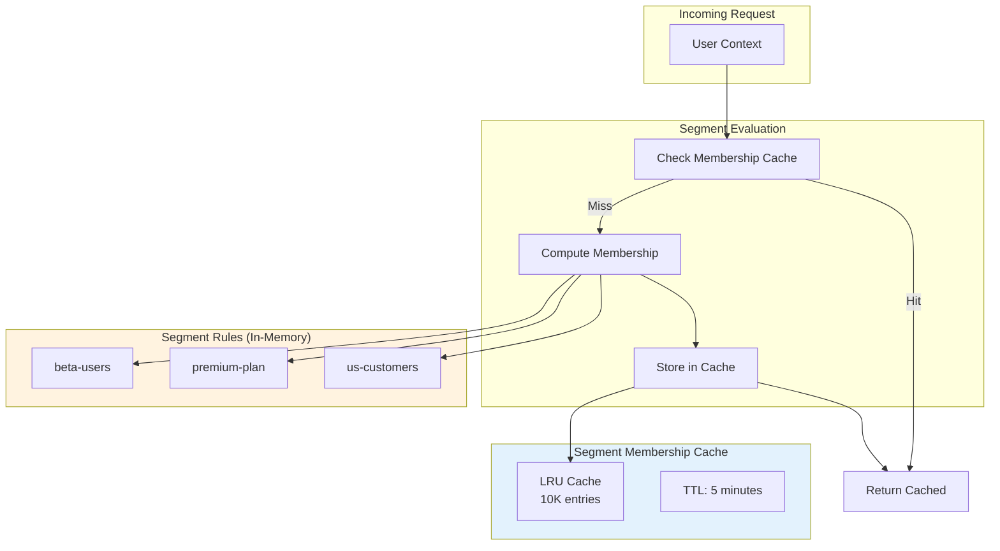
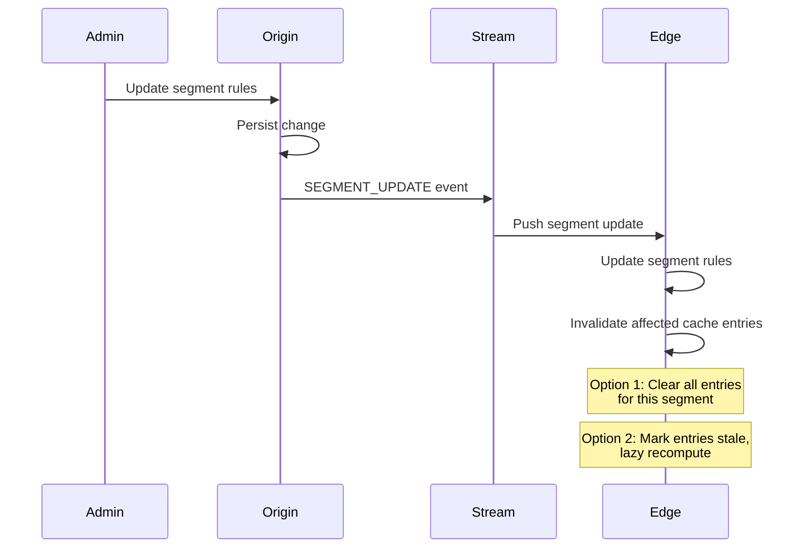
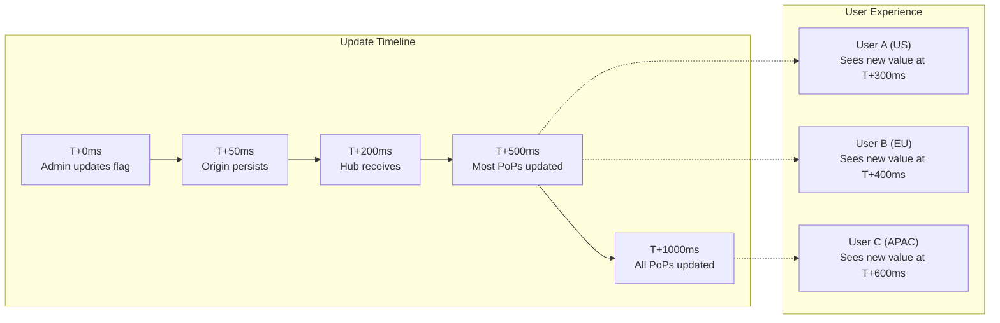
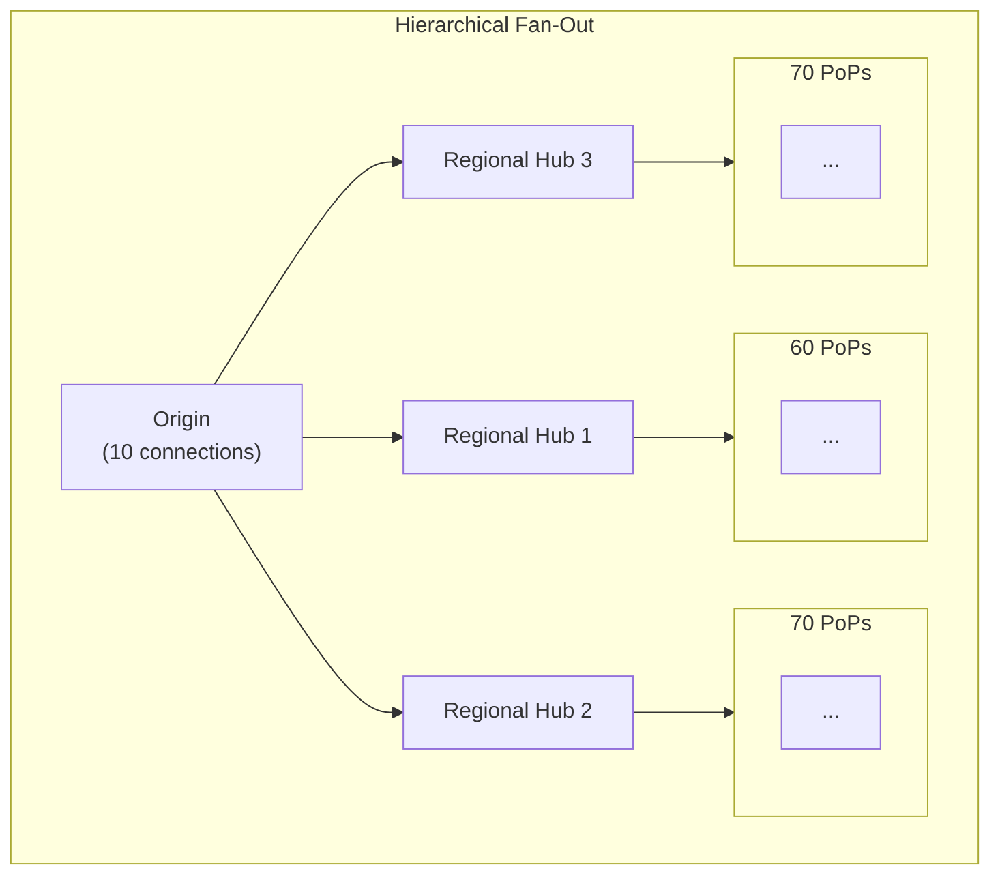
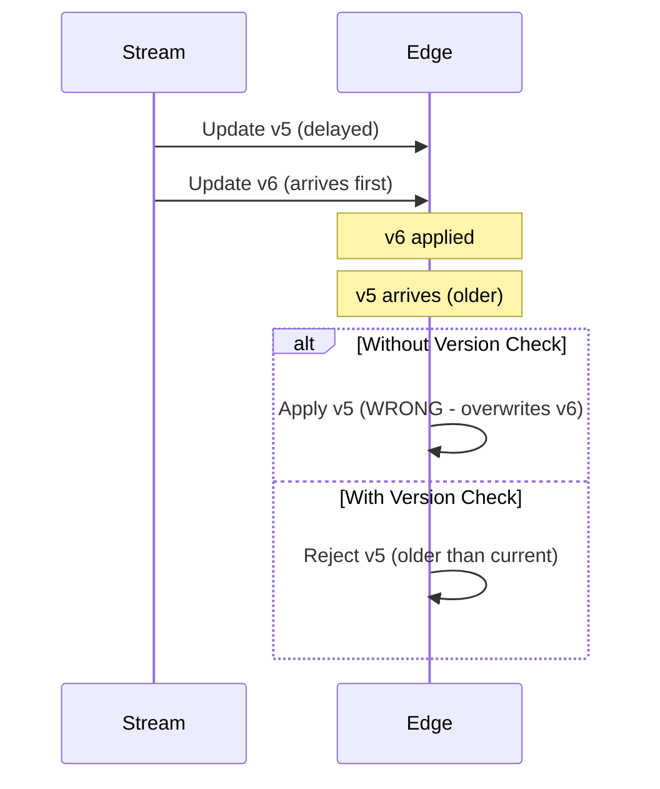

# Deep Dive & Bottlenecks

[← Back to Index](./00-index.md) | [Previous: Low-Level Design](./03-low-level-design.md) | [Next: Scalability →](./05-scalability-and-reliability.md)

---

## Deep Dive 1: Global Flag Synchronization

### The Challenge

Propagating flag changes to 200+ edge PoPs worldwide within 1 second while maintaining consistency and handling network partitions.

### Architecture Deep Dive



### Synchronization Protocol

**Phase 1: Origin Write**
```
FUNCTION HandleFlagUpdate(flag_update):
    // 1. Validate and persist
    validated = ValidateConfig(flag_update)
    version = DB.write(validated)

    // 2. Publish to event stream
    event = {
        type: "FLAG_UPDATE",
        flag_key: flag_update.key,
        config: validated,
        version: version,
        timestamp: NOW
    }

    EventPublisher.publish(event)

    // 3. Return immediately (async propagation)
    RETURN { version: version, status: "PROPAGATING" }
```

**Phase 2: Fan-Out to Regional Hubs**
```
FUNCTION StreamServerHandleEvent(event):
    // Each stream server maintains connections to regional hubs
    FOR hub IN connected_hubs:
        SendToHub(hub, event)
        // Non-blocking, fire-and-forget with ACK tracking


FUNCTION RegionalHubHandleEvent(event):
    // Hub maintains SSE connections to all PoPs in region
    FOR pop IN regional_pops:
        SendToPop(pop, event)

    // Track delivery status
    delivery_tracker.record(event.version, regional_pops)
```

**Phase 3: Edge PoP Application**
```
FUNCTION EdgePopHandleEvent(event):
    // Apply update to in-memory store
    SWITCH event.type:
        CASE "FLAG_UPDATE":
            flag_store[event.flag_key] = event.config
            current_version = event.version

        CASE "FULL_SYNC":
            flag_store = event.flags
            segment_store = event.segments
            current_version = event.version

    // Persist to edge KV for cold start
    edge_kv.write("flag_config", flag_store)

    // Send ACK back through hub
    SendAck(event.version)
```

### Latency Breakdown

| Phase | Typical Latency | 99th Percentile |
|-------|-----------------|-----------------|
| Origin write + publish | 10-20ms | 50ms |
| Stream server → Hub | 20-50ms | 100ms |
| Hub → Edge PoPs | 10-30ms | 80ms |
| Edge application | 1-5ms | 10ms |
| **Total** | **50-100ms** | **250ms** |

### Handling Network Partitions



**Fallback Behavior:**
```
FUNCTION GetFlagWithFallback(flag_key, context):
    // Layer 1: In-memory (always available)
    IF flag_key IN memory_store:
        RETURN Evaluate(memory_store[flag_key], context)

    // Layer 2: Edge KV (per-PoP persistent)
    config = edge_kv.get(flag_key)
    IF config IS NOT NULL:
        memory_store[flag_key] = config  // Warm cache
        RETURN Evaluate(config, context)

    // Layer 3: Global KV (cross-PoP)
    config = global_kv.get(flag_key)
    IF config IS NOT NULL:
        memory_store[flag_key] = config
        edge_kv.set(flag_key, config)
        RETURN Evaluate(config, context)

    // Layer 4: Hardcoded defaults
    RETURN GetHardcodedDefault(flag_key)
```

---

## Deep Dive 2: Segment Caching at Edge

### The Challenge

Evaluating user segment membership efficiently at the edge without fetching segment data for every request.

### Segment Evaluation Patterns



### Caching Strategy by Segment Type

| Segment Type | Cache TTL | Invalidation | Rationale |
|--------------|-----------|--------------|-----------|
| **Static segments** | 1 hour | On segment update | Rarely change (e.g., "internal-users") |
| **Attribute-based** | 5 minutes | TTL expiry | User attributes may change |
| **Dynamic segments** | 1 minute | Aggressive TTL | Frequently updated |
| **Session segments** | Session duration | Session end | One-time evaluation per session |

### Implementation

```
SegmentCache {
    // Two-level cache: user_key -> segment_key -> membership
    cache: LRUCache<string, Map<string, CacheEntry>>
    max_entries: 10000
    default_ttl: 300  // 5 minutes
}

CacheEntry {
    is_member: boolean
    computed_at: timestamp
    ttl: int
}

FUNCTION CheckSegmentMembership(segment_key, context):
    user_key = context.key
    cache_key = user_key + ":" + segment_key

    // Check cache first
    entry = segment_cache.get(cache_key)
    IF entry IS NOT NULL AND NOT IsExpired(entry):
        metrics.increment("segment_cache_hit")
        RETURN entry.is_member

    // Cache miss - compute membership
    metrics.increment("segment_cache_miss")

    segment = segment_store.get(segment_key)
    IF segment IS NULL:
        RETURN FALSE

    is_member = EvaluateSegmentRules(segment.rules, context)

    // Store in cache with appropriate TTL
    ttl = GetTTLForSegment(segment)
    segment_cache.set(cache_key, {
        is_member: is_member,
        computed_at: NOW,
        ttl: ttl
    })

    RETURN is_member


FUNCTION GetTTLForSegment(segment):
    // Adjust TTL based on segment characteristics
    IF segment.static:
        RETURN 3600  // 1 hour
    ELSE IF segment.high_cardinality:
        RETURN 60    // 1 minute
    ELSE:
        RETURN 300   // 5 minutes default
```

### Memory Management

```
FUNCTION ManageSegmentCacheMemory():
    current_size = segment_cache.size()

    IF current_size > MAX_SEGMENT_CACHE_SIZE:
        // Evict least recently used entries
        evict_count = current_size - TARGET_CACHE_SIZE

        FOR i = 0 TO evict_count:
            segment_cache.evict_lru()

        metrics.gauge("segment_cache_evictions", evict_count)


// Memory budget calculation:
// - 10K cache entries
// - ~200 bytes per entry (key + membership + metadata)
// - Total: ~2MB for segment cache
```

### Cache Invalidation



```
FUNCTION HandleSegmentUpdate(segment_key, new_rules):
    // Update segment rules in memory
    segment_store[segment_key] = new_rules

    // Invalidation strategy: lazy vs eager
    IF EAGER_INVALIDATION:
        // Clear all cache entries for this segment
        InvalidateSegmentEntries(segment_key)
    ELSE:
        // Mark segment as stale, recompute on next access
        segment_versions[segment_key] = new_version
        // Cache entries will be recomputed when version mismatch detected
```

---

## Deep Dive 3: Consistency and Staleness

### Consistency Model



### Staleness Budget Strategy

| Flag Type | Max Staleness | Rationale |
|-----------|---------------|-----------|
| **Kill switch** | 30 seconds | Critical safety; accept some delay |
| **Experiment flags** | 5 minutes | Consistency within session matters more |
| **Release flags** | 2 minutes | Balance freshness with stability |
| **Config flags** | 10 minutes | Low change frequency |

### Read-Your-Writes Guarantee (Optional)

For scenarios where admin must see their change immediately:

```
FUNCTION EvaluateFlagWithRYW(flag_key, context, expected_version):
    current_flag = flag_store[flag_key]

    IF expected_version IS NOT NULL:
        IF current_flag.version < expected_version:
            // Client expects newer version - fetch directly
            fresh_flag = FetchFromOrigin(flag_key)
            flag_store[flag_key] = fresh_flag
            RETURN Evaluate(fresh_flag, context)

    RETURN Evaluate(current_flag, context)
```

### Version Vector for Debugging

```
FUNCTION GetFlagWithMetadata(flag_key, context):
    flag = flag_store[flag_key]
    result = Evaluate(flag, context)

    RETURN {
        value: result.value,
        variation: result.variation,
        metadata: {
            flag_version: flag.version,
            edge_pop: CURRENT_POP_ID,
            last_sync: last_sync_timestamp,
            staleness_ms: NOW - flag.updated_at,
            evaluation_reason: result.reason
        }
    }
```

---

## Bottleneck Analysis

### Bottleneck 1: SSE Connection Scaling

**Problem:** Origin must maintain SSE connections to 200+ edge nodes.

**Analysis:**
```
Connections per org: ~200 (one per PoP)
Orgs on platform: 10,000
Total connections: 2,000,000

Memory per connection: ~10KB
Total memory: 20GB just for connections
```

**Mitigation:**



**Result:** Origin maintains 10 connections instead of 200. Regional hubs handle fan-out.

### Bottleneck 2: Edge Worker Memory Limits

**Problem:** Edge workers typically have 128MB memory limit.

**Analysis:**
```
Flag configs: 5000 × 500B = 2.5MB
Segment configs: 500 × 200B = 100KB
Segment cache: 10K × 200B = 2MB
Runtime overhead: ~50MB
Available for flags: ~75MB
```

**Mitigation:**

1. **Lazy loading:** Only load flags that are evaluated
2. **Compression:** Compress configs in KV, decompress on load
3. **Tiered storage:** Hot flags in memory, cold flags in KV

```
FUNCTION LoadFlagsWithTiering():
    // Load only frequently used flags into memory
    hot_flags = GetHotFlags(limit=1000)

    FOR flag IN hot_flags:
        memory_store[flag.key] = flag

    // Other flags loaded on-demand from KV
```

### Bottleneck 3: Targeting Rule Complexity

**Problem:** Complex targeting rules with many clauses slow evaluation.

**Analysis:**
```
Rules per flag: 10 average
Clauses per rule: 5 average
Evaluations per rule: 50 operations
Total per flag: 500 operations

At 100K eval/sec: 50M operations/sec
```

**Mitigation:**

1. **Rule ordering:** Put most selective rules first (short-circuit)
2. **Precompiled rules:** Convert rules to optimized evaluation functions
3. **Indexed attributes:** Index common attributes for O(1) lookup

```
FUNCTION OptimizeRuleOrder(rules):
    // Sort rules by selectivity (most selective first)
    // Short-circuits evaluation when early rules match

    FOR rule IN rules:
        rule.selectivity = EstimateSelectivity(rule)

    RETURN rules.sortBy(r => r.selectivity, DESC)


FUNCTION PrecompileRules(rules):
    // Convert declarative rules to optimized functions
    compiled = []

    FOR rule IN rules:
        fn = CompileRuleToFunction(rule)
        compiled.append(fn)

    RETURN compiled
```

### Bottleneck 4: Consistent Hashing Hot Spots

**Problem:** SHA256 hashing for every evaluation is expensive.

**Analysis:**
```
SHA256 time: ~1μs per hash
At 100K eval/sec: 100ms/sec spent hashing
10% CPU on hashing alone
```

**Mitigation:**

1. **Hash caching:** Cache hash results per user+flag
2. **Faster hash:** Use MurmurHash3 (10x faster) for bucketing
3. **Pre-bucketing:** Compute buckets in bulk, cache results

```
FUNCTION GetBucketWithCache(flag_key, user_key, salt):
    cache_key = flag_key + ":" + user_key

    IF cache_key IN bucket_cache:
        RETURN bucket_cache[cache_key]

    // Use faster hash for non-cryptographic bucketing
    bucket = MurmurHash3(flag_key + salt + user_key) MOD 100000

    bucket_cache[cache_key] = bucket
    RETURN bucket
```

---

## Concurrency Considerations

### Race Condition: Concurrent Updates

**Scenario:** Two flag updates arrive at edge simultaneously.



**Solution:** Version-based updates

```
FUNCTION ApplyFlagUpdate(flag_key, new_config, new_version):
    current = flag_store[flag_key]

    IF current IS NOT NULL AND current.version >= new_version:
        // Reject stale update
        LogDebug("Rejected stale update", {
            "flag": flag_key,
            "current_version": current.version,
            "rejected_version": new_version
        })
        RETURN FALSE

    flag_store[flag_key] = new_config
    RETURN TRUE
```

### Race Condition: Evaluation During Update

**Scenario:** Flag being evaluated while update is being applied.

**Solution:** Copy-on-write semantics

```
FUNCTION UpdateFlagStore(updates):
    // Create new store with updates
    new_store = CopyStore(flag_store)

    FOR update IN updates:
        new_store[update.key] = update.config

    // Atomic swap (single assignment)
    flag_store = new_store

    // Old store garbage collected after in-flight evaluations complete
```

---

## Performance Benchmarks

### Evaluation Latency by Complexity

| Scenario | Rules | Clauses | P50 | P99 |
|----------|-------|---------|-----|-----|
| Simple (boolean) | 0 | 0 | 0.1ms | 0.5ms |
| Basic targeting | 3 | 5 | 0.5ms | 2ms |
| Complex targeting | 10 | 20 | 1.5ms | 5ms |
| Segment-heavy | 5 | 10 + 5 segments | 2ms | 8ms |

### Sync Latency by Region

| Origin → Destination | P50 | P99 |
|---------------------|-----|-----|
| US-East → US-West | 80ms | 150ms |
| US-East → EU-Central | 120ms | 250ms |
| US-East → APAC | 200ms | 400ms |
| **Global (all PoPs)** | **150ms** | **500ms** |

### Memory Usage Profile

| Component | Size | Notes |
|-----------|------|-------|
| Flag configs (5K flags) | 2.5MB | Denormalized, optimized |
| Segment configs (500) | 100KB | Rules only |
| Segment membership cache | 2MB | 10K entries |
| Bucket cache | 1MB | 50K entries |
| Runtime overhead | 50MB | V8 isolate, SDK |
| **Total** | **~56MB** | Well under 128MB limit |

---

**Next:** [Scalability & Reliability →](./05-scalability-and-reliability.md)
