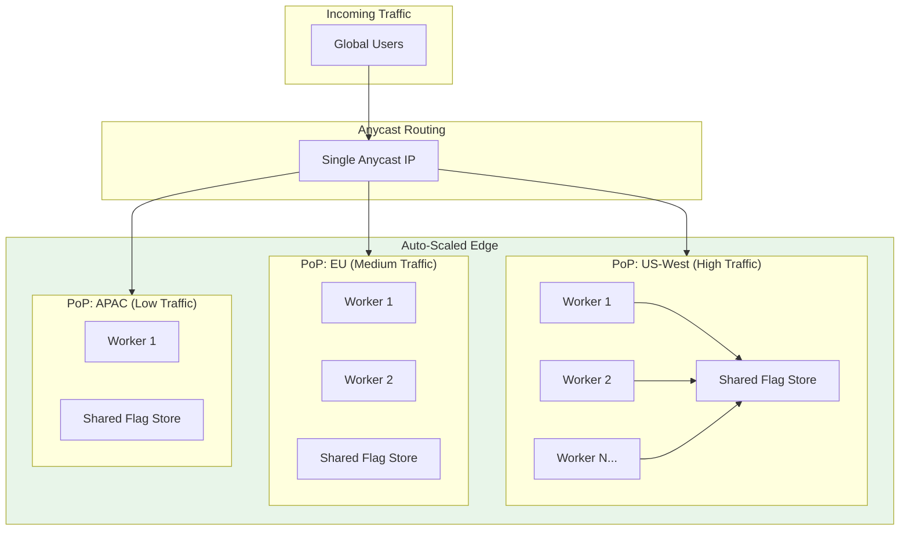
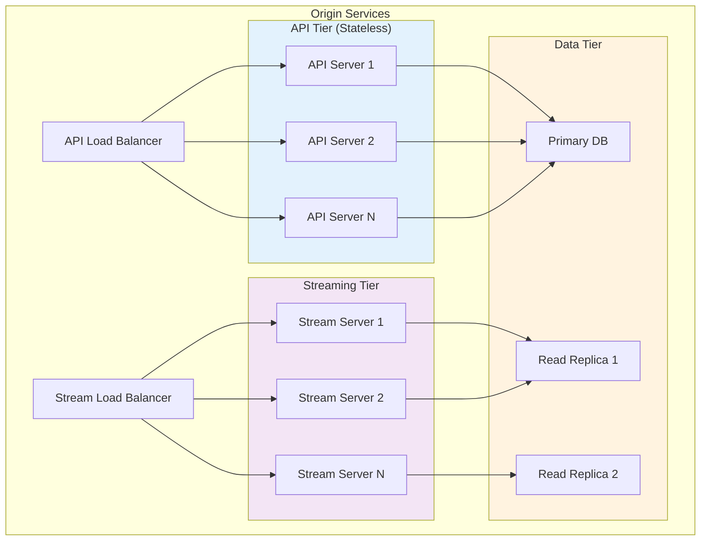
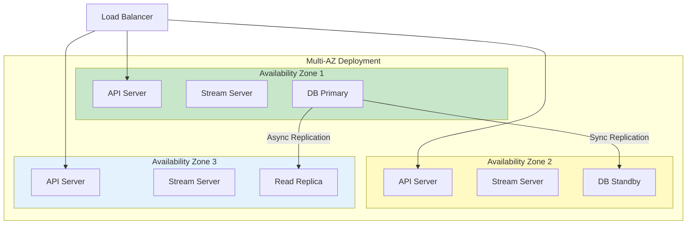
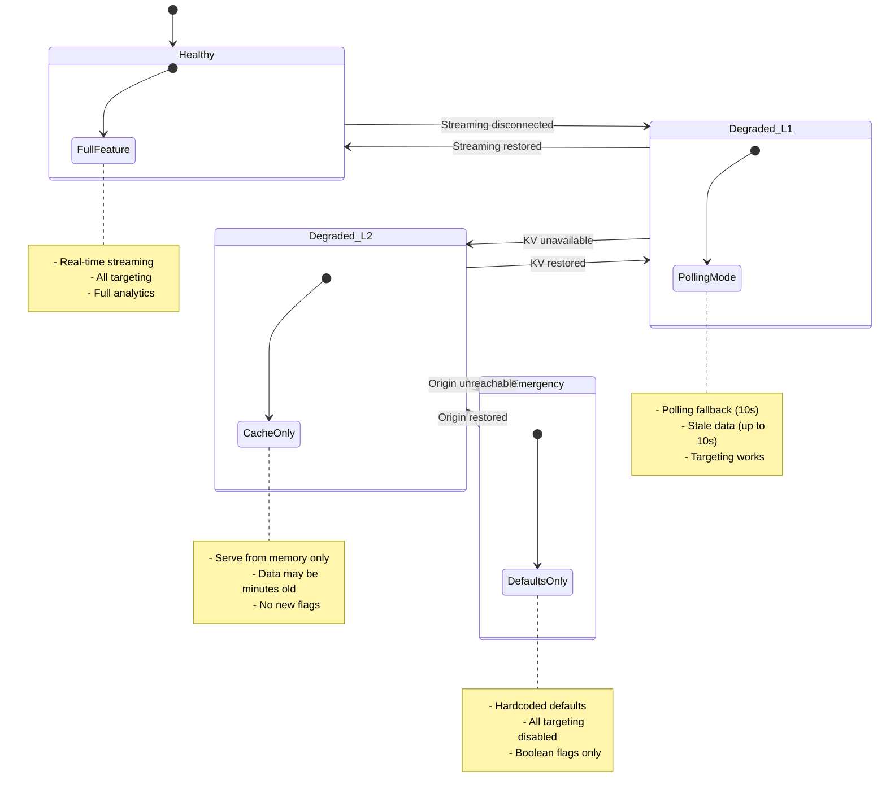
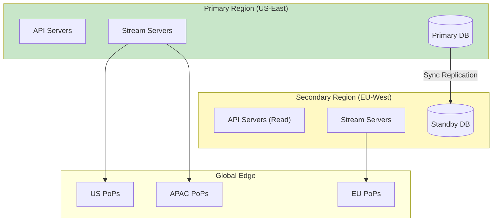

# Scalability & Reliability

[← Back to Index](./00-index.md) | [Previous: Deep Dive](./04-deep-dive-and-bottlenecks.md) | [Next: Security →](./06-security-and-compliance.md)

---

## Scalability Strategy

### Scaling Dimensions

| Dimension | Current | 10x Scale | Strategy |
|-----------|---------|-----------|----------|
| Edge PoPs | 200 | 2000 | Hierarchical fan-out |
| Flags per org | 5K | 50K | Tiered storage, lazy loading |
| Orgs on platform | 10K | 100K | Multi-tenant isolation |
| Evaluations/sec (global) | 20M | 200M | Horizontal edge scaling |
| SSE connections | 2K | 20K | Regional hub architecture |

### Horizontal Scaling

#### Edge Layer Scaling



**Auto-scaling triggers:**
```
SCALING_POLICY {
    metric: "requests_per_second"
    target: 50000  // per worker
    scale_up_threshold: 0.8  // 80% of target
    scale_down_threshold: 0.3  // 30% of target
    cooldown: 60 seconds
}
```

#### Origin/Streaming Layer Scaling



### Database Scaling

| Scaling Approach | When to Use | Implementation |
|------------------|-------------|----------------|
| **Read replicas** | Read-heavy queries | Streaming servers read from replicas |
| **Sharding by org_id** | >100K organizations | Hash-based partitioning |
| **Caching layer** | Reduce DB load | Redis cluster for flag configs |
| **Archive old versions** | History growth | Move old versions to cold storage |

```
SHARDING_STRATEGY {
    shard_key: "org_id"
    num_shards: 16  // Start with 16, expand to 256
    routing: consistent_hash(org_id) MOD num_shards

    // Shard distribution
    shard_0: orgs where hash(org_id) MOD 16 == 0
    shard_1: orgs where hash(org_id) MOD 16 == 1
    ...
}
```

---

## Reliability Architecture

### Single Points of Failure Analysis

| Component | SPOF Risk | Mitigation |
|-----------|-----------|------------|
| Origin DB | High | Multi-AZ primary, read replicas |
| Streaming servers | Medium | Multiple servers, hub architecture |
| Regional hubs | Medium | Multiple hubs per region, failover |
| Edge PoPs | Low | Anycast routes to healthy PoPs |
| Edge KV | Low | Replicated, multi-region |

### Redundancy Strategy



### Failover Mechanisms

#### Edge PoP Failover

```
FUNCTION HandlePoPFailure(failed_pop):
    // Anycast automatically routes to next nearest PoP
    // No explicit action needed - BGP handles routing

    // Log for monitoring
    LogEvent("POP_FAILURE", {
        pop_id: failed_pop,
        timestamp: NOW,
        failover_to: "automatic_anycast"
    })


// User experience:
// Request to failed PoP → BGP reconvergence (~100ms)
// → Routed to next nearest healthy PoP
// → User sees ~100-200ms additional latency once
```

#### Regional Hub Failover

```
FUNCTION HandleHubFailure(failed_hub):
    affected_pops = GetPoPsForHub(failed_hub)

    // Option 1: Redirect to backup hub in same region
    backup_hub = GetBackupHub(failed_hub.region)

    FOR pop IN affected_pops:
        ReconnectPopToHub(pop, backup_hub)

    // Option 2: If no backup hub, fall back to direct origin
    IF backup_hub IS NULL:
        FOR pop IN affected_pops:
            ConnectPopToOrigin(pop)

    AlertOps("HUB_FAILOVER", failed_hub)
```

#### Origin Failover

```
FUNCTION HandleOriginRegionFailure():
    // Promote standby region to primary
    new_primary = PromoteStandbyRegion()

    // Update DNS to point to new region
    UpdateDNS(new_primary)

    // Streaming servers reconnect to new primary
    BroadcastToHubs("ORIGIN_FAILOVER", new_primary)

    // RPO: 0 (sync replication)
    // RTO: ~5 minutes (DNS propagation + warmup)
```

### Circuit Breaker Pattern

```
CircuitBreaker {
    state: "CLOSED" | "OPEN" | "HALF_OPEN"
    failure_count: int
    success_count: int
    last_failure_time: timestamp

    failure_threshold: 5
    success_threshold: 3
    timeout: 30 seconds
}

FUNCTION CallWithCircuitBreaker(circuit, operation):
    IF circuit.state == "OPEN":
        IF NOW - circuit.last_failure_time > circuit.timeout:
            circuit.state = "HALF_OPEN"
        ELSE:
            RETURN FallbackResponse()

    TRY:
        result = operation()

        IF circuit.state == "HALF_OPEN":
            circuit.success_count++
            IF circuit.success_count >= circuit.success_threshold:
                circuit.state = "CLOSED"
                circuit.failure_count = 0

        RETURN result

    CATCH Error:
        circuit.failure_count++
        circuit.last_failure_time = NOW

        IF circuit.failure_count >= circuit.failure_threshold:
            circuit.state = "OPEN"

        RETURN FallbackResponse()
```

### Retry Strategy

```
RETRY_CONFIG {
    max_attempts: 3
    initial_delay: 100ms
    max_delay: 5000ms
    backoff_multiplier: 2
    jitter: true

    retryable_errors: [
        "TIMEOUT",
        "CONNECTION_RESET",
        "SERVICE_UNAVAILABLE"
    ]
}

FUNCTION RetryWithBackoff(operation, config):
    delay = config.initial_delay

    FOR attempt = 1 TO config.max_attempts:
        TRY:
            RETURN operation()

        CATCH error:
            IF error.type NOT IN config.retryable_errors:
                THROW error

            IF attempt == config.max_attempts:
                THROW error

            // Exponential backoff with jitter
            jitter = Random(0, delay * 0.1)
            WAIT delay + jitter

            delay = MIN(delay * config.backoff_multiplier, config.max_delay)
```

---

## Graceful Degradation

### Degradation Levels



### Degradation Handlers

```
FUNCTION GetFlagValue(flag_key, context):
    current_level = GetDegradationLevel()

    SWITCH current_level:
        CASE "HEALTHY":
            RETURN EvaluateFromMemory(flag_key, context)

        CASE "DEGRADED_L1":
            // Memory + stale warning
            result = EvaluateFromMemory(flag_key, context)
            result.metadata.stale_warning = TRUE
            RETURN result

        CASE "DEGRADED_L2":
            // Memory only, may be very stale
            IF flag_key IN memory_store:
                result = EvaluateFromMemory(flag_key, context)
                result.metadata.emergency_mode = TRUE
                RETURN result
            ELSE:
                RETURN GetDefault(flag_key)

        CASE "EMERGENCY":
            // Hardcoded defaults only
            RETURN GetHardcodedDefault(flag_key)
```

### Bulkhead Pattern

```
FUNCTION IsolateTenants():
    // Separate resources per organization tier

    SWITCH org.tier:
        CASE "ENTERPRISE":
            // Dedicated streaming connection
            // Higher memory allocation
            // Priority support

        CASE "PRO":
            // Shared but prioritized
            // Standard memory

        CASE "FREE":
            // Shared resources
            // Rate limited
            // Lower priority during degradation
```

---

## Disaster Recovery

### RTO/RPO Targets

| Scenario | RTO | RPO | Strategy |
|----------|-----|-----|----------|
| Single PoP failure | 0 (automatic) | 0 | Anycast routing |
| Regional hub failure | <1 minute | 0 | Hot standby hub |
| Origin AZ failure | <5 minutes | 0 | Multi-AZ deployment |
| Origin region failure | <15 minutes | <1 minute | Cross-region replication |
| Global platform outage | <30 minutes | <5 minutes | Cold standby + backups |

### Backup Strategy

```
BACKUP_STRATEGY {
    // Hot backups (continuous)
    streaming_replication: {
        primary -> standby: synchronous
        primary -> read_replicas: asynchronous (lag < 1s)
    }

    // Warm backups (hourly)
    snapshots: {
        frequency: hourly
        retention: 7 days
        location: cross-region object storage
    }

    // Cold backups (daily)
    full_backup: {
        frequency: daily
        retention: 90 days
        location: geo-redundant storage
    }
}
```

### Recovery Procedures

```
PROCEDURE RecoverFromRegionFailure():
    // 1. Detect failure (automated health checks)
    IF NOT HealthCheck(primary_region):
        AlertOps("REGION_FAILURE_DETECTED")

    // 2. Promote standby region
    secondary_region.PromoteToSrimary()

    // 3. Update DNS
    DNS.UpdateRecord("api.flags.example.com", secondary_region.ip)

    // 4. Notify streaming clients
    BroadcastToAllHubs("FAILOVER_COMPLETE", secondary_region)

    // 5. Verify
    RunSmokeTests()

    // 6. Alert resolution
    AlertOps("FAILOVER_COMPLETE")
```

---

## Multi-Region Architecture

### Active-Passive Configuration



### Global Load Distribution

| Traffic Source | Primary Route | Fallback Route |
|----------------|---------------|----------------|
| Americas | US-East Origin | EU-West Origin |
| Europe | EU-West (Read) / US-East (Write) | US-East |
| Asia-Pacific | US-East Origin | EU-West Origin |

---

## Capacity Planning

### Growth Projections

| Metric | Current | Year 1 | Year 3 |
|--------|---------|--------|--------|
| Organizations | 10K | 50K | 200K |
| Flags (total) | 50M | 250M | 1B |
| Evaluations/day | 100B | 500B | 2T |
| Edge PoPs | 200 | 300 | 500 |
| Storage (flags) | 25GB | 125GB | 500GB |

### Scaling Thresholds

```
SCALING_THRESHOLDS {
    // Add stream server when:
    connections_per_server > 10000
    cpu_utilization > 70%
    memory_utilization > 80%

    // Add regional hub when:
    pops_per_hub > 50
    latency_to_pops_p99 > 100ms

    // Add database shard when:
    queries_per_shard > 50000/sec
    storage_per_shard > 1TB
}
```

---

## Hot Spot Mitigation

### Flag Popularity Skew

**Problem:** Some flags (e.g., "maintenance-mode") are evaluated far more than others.

```
FUNCTION MitigateHotFlags():
    // Identify hot flags
    hot_flags = GetFlagsAboveThreshold(eval_rate > 10000/sec)

    FOR flag IN hot_flags:
        // 1. Increase cache TTL
        SetCacheTTL(flag, extended=TRUE)

        // 2. Pre-warm across all PoPs
        BroadcastToAllPoPs("PREWARM", flag)

        // 3. Use CDN edge caching for static variations
        IF flag.HasStaticVariation():
            EnableEdgeCaching(flag)
```

### Geographic Hot Spots

```
FUNCTION HandleGeographicHotSpot(pop_id):
    // Detected via metrics: single PoP receiving disproportionate traffic

    // Option 1: Add more workers to that PoP
    ScalePoP(pop_id, workers=+5)

    // Option 2: Anycast redistribution
    IF pop_id.load > CRITICAL_THRESHOLD:
        ReduceAnyCastWeight(pop_id)
        // Traffic redistributes to nearby PoPs
```

---

**Next:** [Security & Compliance →](./06-security-and-compliance.md)
