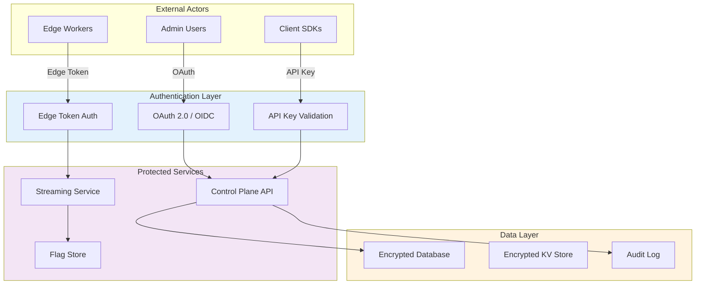
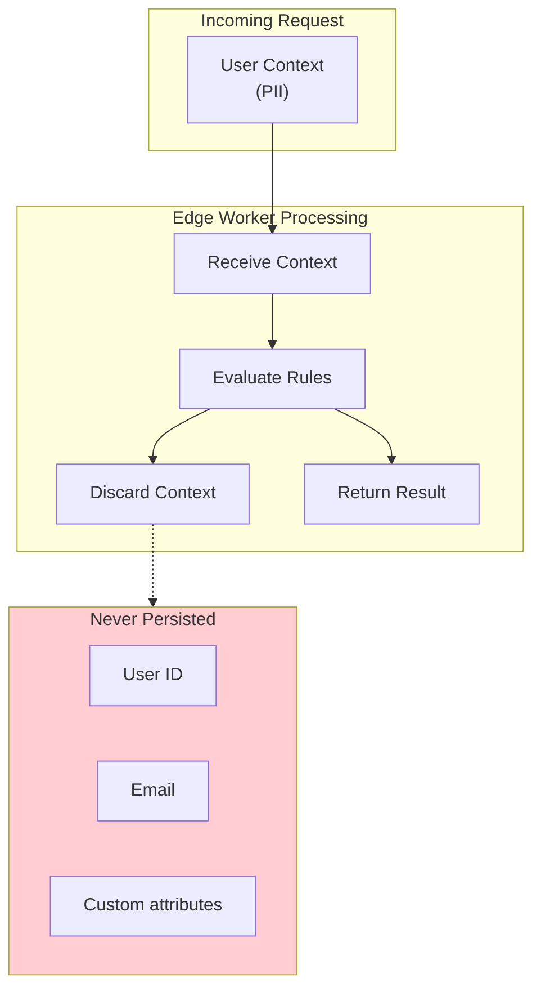
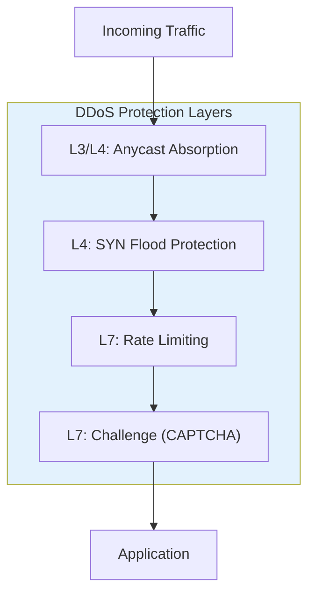

# Security & Compliance

[← Back to Index](./00-index.md) | [Previous: Scalability](./05-scalability-and-reliability.md) | [Next: Observability →](./07-observability.md)

---

## Security Architecture Overview



---

## Authentication & Authorization

### Authentication Mechanisms

| Actor | Auth Method | Token Type | Lifetime |
|-------|-------------|------------|----------|
| **Admin users** | OAuth 2.0 + OIDC | JWT access token | 1 hour |
| **Server SDKs** | API Key | Hashed key | Long-lived |
| **Client SDKs** | Client-side ID | Public identifier | N/A |
| **Edge workers** | Edge token | Signed JWT | 24 hours |
| **Streaming connections** | Bearer token | Signed JWT | 24 hours (renewable) |

### API Key Security

```
APIKey {
    key_id: "sdk-xxx"           // Public identifier
    key_hash: SHA256(secret)    // Stored (never plain text)
    org_id: "org-123"           // Tenant binding
    environment: "production"   // Environment scope
    permissions: ["evaluate"]   // Limited permissions
    created_at: timestamp
    last_used: timestamp
}

FUNCTION ValidateAPIKey(provided_key):
    key_id, secret = ParseKey(provided_key)

    stored = DB.GetKey(key_id)
    IF stored IS NULL:
        RETURN AuthError("Invalid key")

    IF SHA256(secret) != stored.key_hash:
        RETURN AuthError("Invalid key")

    IF stored.revoked:
        RETURN AuthError("Key revoked")

    // Update last used (async)
    AsyncUpdateLastUsed(key_id)

    RETURN AuthSuccess(stored)
```

### Authorization Model

| Role | Permissions | Scope |
|------|-------------|-------|
| **Owner** | All operations | Organization |
| **Admin** | Manage flags, users | Project |
| **Developer** | Create/edit flags | Project |
| **Viewer** | Read flags, analytics | Project |
| **SDK** | Evaluate flags only | Environment |

```
FUNCTION AuthorizeOperation(user, operation, resource):
    // Get user's role for the resource's project
    role = GetUserRole(user, resource.project_id)

    IF role IS NULL:
        RETURN Denied("No access to project")

    // Check permission matrix
    required_permission = GetRequiredPermission(operation)

    IF NOT role.HasPermission(required_permission):
        RETURN Denied("Insufficient permissions")

    RETURN Allowed()
```

---

## Data Security

### Data Classification

| Data Type | Classification | Protection |
|-----------|---------------|------------|
| Flag configurations | Internal | Encrypted at rest |
| Targeting rules | Internal | Encrypted at rest |
| User attributes (context) | PII | Not persisted at edge |
| API keys | Secret | Hashed, never logged |
| Audit logs | Sensitive | Encrypted, tamper-proof |
| Analytics data | Internal | Anonymized |

### Encryption

**At Rest:**
```
ENCRYPTION_CONFIG {
    database: {
        algorithm: "AES-256-GCM"
        key_management: "KMS"
        key_rotation: "90 days"
    }

    edge_kv: {
        algorithm: "AES-256-GCM"
        key_per_tenant: TRUE
    }

    backups: {
        algorithm: "AES-256-GCM"
        key_management: "KMS"
        envelope_encryption: TRUE
    }
}
```

**In Transit:**
```
TLS_CONFIG {
    min_version: "TLS 1.3"
    cipher_suites: [
        "TLS_AES_256_GCM_SHA384",
        "TLS_CHACHA20_POLY1305_SHA256"
    ]
    certificate_pinning: TRUE  // For SDK-to-API
    mtls: OPTIONAL  // For enterprise edge deployments
}
```

### Edge Data Handling



**Principle:** User context (PII) is processed in-memory at the edge for flag evaluation but is **never persisted** to edge storage.

```
FUNCTION EvaluateFlagSecurely(flag_key, user_context):
    // User context lives only in memory during evaluation
    result = EvaluateRules(flag_key, user_context)

    // Only non-PII data is logged/stored
    LogEvaluation({
        flag_key: flag_key,
        variation: result.variation,
        edge_pop: CURRENT_POP,
        timestamp: NOW
        // NO user_context logged
    })

    // Context is garbage collected after request
    RETURN result
```

---

## Threat Model

### Attack Vectors and Mitigations

| Attack Vector | Risk | Mitigation |
|---------------|------|------------|
| **API key theft** | High | Key rotation, environment scoping, IP allowlisting |
| **Flag injection** | High | Input validation, schema enforcement, audit logging |
| **Targeting rule manipulation** | High | RBAC, approval workflows, audit trails |
| **Man-in-the-middle** | Medium | TLS 1.3, certificate pinning |
| **Edge cache poisoning** | Medium | Signed flag configs, version verification |
| **DDoS on edge** | Medium | Rate limiting, anycast distribution |
| **Replay attacks** | Low | Nonce-based requests, short token lifetimes |

### API Key Protection

```
FUNCTION SecureAPIKeyHandling():
    // 1. Environment-scoped keys
    production_key -> can only access production flags
    staging_key -> can only access staging flags

    // 2. Permission scoping
    server_sdk_key -> can evaluate + stream
    client_sdk_key -> can only evaluate (limited flags)

    // 3. IP allowlisting (optional)
    IF org.has_ip_allowlist:
        IF request.ip NOT IN org.allowed_ips:
            RETURN Denied()

    // 4. Rate limiting per key
    IF RateLimiter.IsExceeded(key_id):
        RETURN RateLimited()
```

### Flag Config Integrity

```
FUNCTION EnsureFlagIntegrity():
    // Sign flag configs at origin
    config.signature = HMAC_SHA256(
        key=SIGNING_KEY,
        data=Serialize(config.flags) + config.version
    )

    // Verify at edge
    FUNCTION VerifyConfig(config):
        expected_sig = HMAC_SHA256(
            key=SIGNING_KEY,
            data=Serialize(config.flags) + config.version
        )

        IF config.signature != expected_sig:
            LogSecurity("CONFIG_TAMPER_DETECTED")
            RETURN FALSE

        RETURN TRUE
```

---

## Rate Limiting & DDoS Protection

### Rate Limiting Strategy

| Endpoint | Limit | Window | Scope |
|----------|-------|--------|-------|
| Flag evaluation | 100K/min | Per API key | Per key |
| Control plane API | 1K/min | Per user | Per user |
| Streaming connect | 10/min | Per key | Prevent reconnect storms |
| Admin operations | 100/min | Per user | Per user |

```
RATE_LIMIT_CONFIG {
    evaluation_api: {
        algorithm: "sliding_window"
        limit: 100000
        window: 60 seconds
        key: "api_key"
        response_on_limit: 429 with Retry-After header
    }

    control_plane: {
        algorithm: "token_bucket"
        limit: 1000
        refill_rate: 17/second
        key: "user_id"
    }
}
```

### DDoS Protection at Edge



**Anycast absorption:** Traffic distributed across 200+ PoPs naturally absorbs volumetric attacks.

---

## Compliance

### Regulatory Requirements

| Regulation | Requirement | Implementation |
|------------|-------------|----------------|
| **GDPR** | Data minimization | No PII persisted at edge |
| **GDPR** | Right to erasure | No user data stored |
| **CCPA** | Data access | Audit logs available |
| **SOC 2 Type II** | Access controls | RBAC, audit logging |
| **HIPAA** | PHI protection | BAA available, encryption |

### Data Residency

```
FUNCTION EnforceDataResidency(org):
    IF org.data_residency == "EU":
        // Route all writes to EU region
        // Store flags in EU-only KV namespace
        // Stream from EU hub only

    IF org.data_residency == "US":
        // Route all writes to US region
        // Store in US-only namespace

    // Edge evaluation still happens globally
    // (no user data persisted)
```

### Audit Logging

```
AuditEvent {
    event_id: UUID
    timestamp: ISO8601
    actor: {
        type: "user" | "api_key" | "system"
        id: string
        ip_address: string (masked)
    }
    action: string
    resource: {
        type: "flag" | "segment" | "api_key"
        id: string
    }
    changes: {
        before: JSON
        after: JSON
    }
    metadata: {
        user_agent: string
        request_id: string
    }
}

FUNCTION LogAuditEvent(event):
    // Write to append-only audit log
    AuditLog.Append(event)

    // Index for compliance queries
    AuditIndex.Index(event)

    // Retain for compliance period
    // (typically 7 years for SOC 2)
```

---

## Secure Configuration Management

### Secret Management

| Secret | Storage | Access |
|--------|---------|--------|
| Database credentials | Secret Manager | API servers only |
| API signing keys | HSM | Signing service only |
| Edge tokens | Generated on-demand | Short-lived (24h) |
| Encryption keys | KMS | Encrypted envelope |

```
FUNCTION SecureSecretAccess():
    // 1. Fetch from secret manager with short TTL
    db_password = SecretManager.Get("db_password", ttl=300)

    // 2. Never log secrets
    Logger.SetRedactionPatterns([
        /password=\S+/,
        /api_key=\S+/,
        /secret=\S+/
    ])

    // 3. Rotate on schedule
    SecretRotator.Schedule("db_password", every=30.days)
```

### Edge Token Security

```
EdgeToken {
    // JWT structure
    header: {
        alg: "ES256"  // Elliptic curve
        typ: "JWT"
    }
    payload: {
        iss: "flags.example.com"
        sub: "edge-pop-us-west-1"
        aud: "streaming-service"
        exp: NOW + 24 hours
        iat: NOW
        scope: ["stream", "read"]
    }
    signature: ECDSA_Sign(header + payload, private_key)
}

FUNCTION ValidateEdgeToken(token):
    // 1. Verify signature
    IF NOT ECDSA_Verify(token, public_key):
        RETURN Invalid()

    // 2. Check expiration
    IF token.exp < NOW:
        RETURN Expired()

    // 3. Verify audience
    IF token.aud != "streaming-service":
        RETURN Invalid()

    RETURN Valid(token.payload)
```

---

## Security Best Practices

### SDK Security Guidelines

```
// Client-side SDK - Limited exposure
CLIENT_SDK_CONFIG {
    // Only boolean/string variations (no complex objects)
    allowed_value_types: ["boolean", "string", "number"]

    // No targeting rules exposed
    expose_rules: FALSE

    // No segment definitions exposed
    expose_segments: FALSE

    // Only pre-evaluated values sent to client
    evaluation_mode: "server_evaluated"
}

// Server-side SDK - Full access
SERVER_SDK_CONFIG {
    // Full rule evaluation locally
    evaluation_mode: "local"

    // Secure key storage
    key_storage: "environment_variable"

    // No key in source code
    key_in_code: PROHIBITED
}
```

### Infrastructure Security

```
INFRASTRUCTURE_SECURITY {
    network: {
        vpc_isolation: TRUE
        private_subnets: TRUE
        nat_gateway: TRUE
        security_groups: LEAST_PRIVILEGE
    }

    compute: {
        imdsv2_only: TRUE  // No IMDS v1
        encrypted_ebs: TRUE
        no_public_ips: TRUE  // Except LBs
    }

    edge: {
        waf_enabled: TRUE
        bot_protection: TRUE
        ssl_only: TRUE
    }
}
```

---

## Incident Response

### Security Incident Classification

| Severity | Example | Response Time |
|----------|---------|---------------|
| **Critical** | API key compromise, data breach | 15 minutes |
| **High** | Unauthorized flag modification | 1 hour |
| **Medium** | Suspicious access pattern | 4 hours |
| **Low** | Failed auth attempts | 24 hours |

### Response Procedures

```
PROCEDURE HandleAPIKeyCompromise(compromised_key):
    // 1. Immediate revocation
    RevokeKey(compromised_key)
    InvalidateAllSessions(compromised_key)

    // 2. Alert affected organization
    NotifyOrg(compromised_key.org_id, "KEY_COMPROMISED")

    // 3. Audit recent activity
    suspicious_activity = AuditLog.Query(
        key=compromised_key,
        since=NOW - 7.days
    )

    // 4. Investigate and remediate
    SecurityTeam.CreateIncident(suspicious_activity)

    // 5. Issue new key (org must regenerate)
    // (Do not auto-issue to prevent further compromise)
```

---

**Next:** [Observability →](./07-observability.md)
