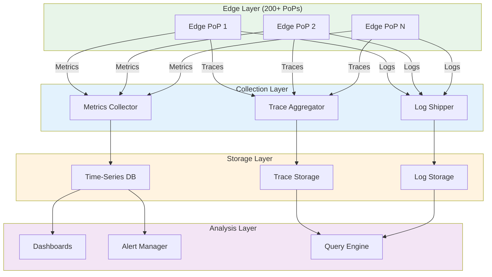
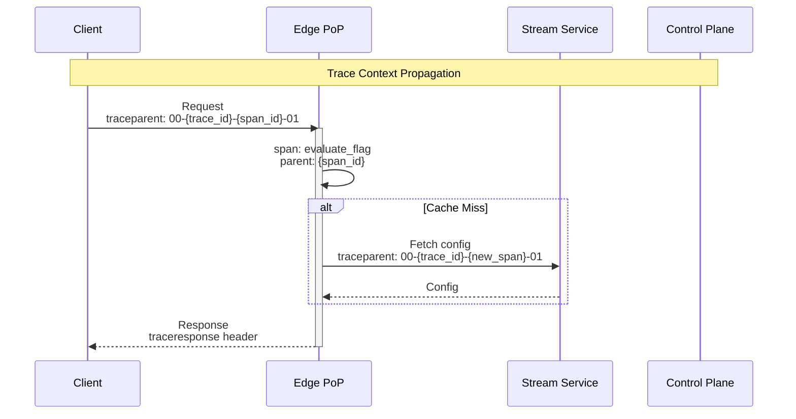
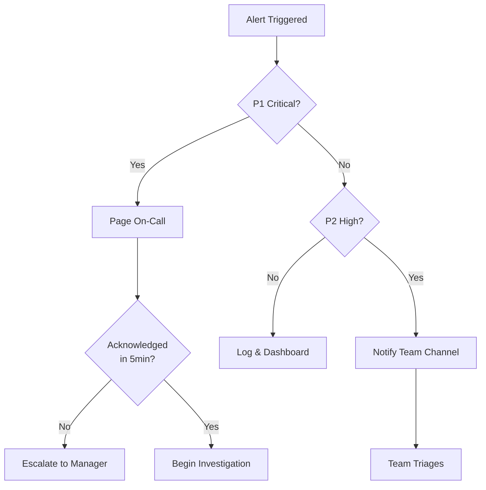

# Observability

[← Back to Index](./00-index.md) | [Previous: Security](./06-security-and-compliance.md) | [Next: Interview Guide →](./08-interview-guide.md)

---

## Observability Architecture



---

## Metrics (RED + USE)

### Request Metrics (RED)

| Metric | Description | Labels |
|--------|-------------|--------|
| `flag_evaluations_total` | Total evaluations | flag_key, variation, pop_id, org_id |
| `flag_evaluation_latency_ms` | Evaluation latency | flag_key, pop_id, quantile |
| `flag_evaluation_errors_total` | Evaluation errors | error_type, flag_key, pop_id |

### Resource Metrics (USE)

| Metric | Description | Labels |
|--------|-------------|--------|
| `edge_worker_cpu_percent` | CPU utilization | pop_id |
| `edge_worker_memory_bytes` | Memory usage | pop_id, type (heap/total) |
| `flag_store_size_bytes` | In-memory store size | pop_id |
| `segment_cache_entries` | Cached segment memberships | pop_id |
| `segment_cache_hit_ratio` | Cache hit rate | pop_id |

### Sync Metrics

| Metric | Description | Labels |
|--------|-------------|--------|
| `sync_lag_ms` | Time since last sync | pop_id |
| `sync_messages_received_total` | SSE messages received | message_type, pop_id |
| `sync_connection_state` | Connection status | pop_id, state |
| `sync_version_current` | Current flag version | pop_id |
| `propagation_latency_ms` | Time from change to edge | flag_key, pop_id |

### Business Metrics

| Metric | Description | Labels |
|--------|-------------|--------|
| `flag_enabled_state` | Current flag state | flag_key, org_id |
| `experiment_assignments_total` | Experiment enrollments | experiment_key, variation |
| `targeting_rule_matches_total` | Rule match counts | flag_key, rule_id |

### Metric Collection at Edge

```
FUNCTION CollectMetrics():
    // Batch metrics locally
    metrics_buffer = []

    ON_EVALUATION(flag_key, result, latency):
        metrics_buffer.append({
            name: "flag_evaluations_total",
            labels: {flag_key, result.variation, POP_ID},
            value: 1
        })

        metrics_buffer.append({
            name: "flag_evaluation_latency_ms",
            labels: {flag_key, POP_ID},
            value: latency
        })

    // Flush every 10 seconds
    EVERY 10 SECONDS:
        aggregated = AggregateMetrics(metrics_buffer)
        SendToCollector(aggregated)
        metrics_buffer.clear()


FUNCTION AggregateMetrics(buffer):
    // Pre-aggregate at edge to reduce bandwidth
    aggregated = {}

    FOR metric IN buffer:
        key = metric.name + SerializeLabels(metric.labels)
        IF key NOT IN aggregated:
            aggregated[key] = {
                name: metric.name,
                labels: metric.labels,
                count: 0,
                sum: 0,
                histogram: []
            }
        aggregated[key].count += 1
        aggregated[key].sum += metric.value
        aggregated[key].histogram.append(metric.value)

    RETURN aggregated
```

---

## Distributed Tracing

### Trace Propagation



### Key Spans

| Span Name | Description | Attributes |
|-----------|-------------|------------|
| `flag.evaluate` | Full evaluation | flag_key, variation, latency_ms |
| `flag.rule_match` | Rule evaluation | rule_id, matched |
| `flag.bucket` | Consistent hashing | bucket_value, variation |
| `segment.check` | Segment membership | segment_key, is_member |
| `cache.lookup` | Cache access | hit, layer (memory/kv) |
| `sync.receive` | SSE message | message_type, version |

### Trace Implementation

```
FUNCTION EvaluateFlagWithTracing(flag_key, context, parent_context):
    span = Tracer.StartSpan("flag.evaluate", parent=parent_context)
    span.SetAttribute("flag_key", flag_key)
    span.SetAttribute("pop_id", POP_ID)

    TRY:
        // Cache lookup span
        cache_span = Tracer.StartSpan("cache.lookup", parent=span)
        flag = GetFlagFromCache(flag_key)
        cache_span.SetAttribute("hit", flag IS NOT NULL)
        cache_span.End()

        IF flag IS NULL:
            span.SetAttribute("cache_miss", TRUE)
            flag = FetchFromKV(flag_key)

        // Rule evaluation span
        rule_span = Tracer.StartSpan("flag.rule_match", parent=span)
        result = EvaluateRules(flag, context)
        rule_span.SetAttribute("matched_rule", result.rule_id)
        rule_span.End()

        span.SetAttribute("variation", result.variation)
        span.SetStatus(OK)

        RETURN result

    CATCH error:
        span.SetStatus(ERROR)
        span.RecordException(error)
        THROW error

    FINALLY:
        span.End()
```

### Sampling Strategy

```
SAMPLING_CONFIG {
    // Head-based sampling at edge
    default_rate: 0.01  // 1% of requests

    // Higher sampling for specific scenarios
    rules: [
        {
            condition: "error == true",
            rate: 1.0  // 100% of errors
        },
        {
            condition: "latency_ms > 10",
            rate: 0.5  // 50% of slow requests
        },
        {
            condition: "flag_key == 'critical-flag'",
            rate: 0.1  // 10% of critical flags
        }
    ]
}
```

---

## Logging

### Log Levels

| Level | Use Case | Example |
|-------|----------|---------|
| **ERROR** | Evaluation failures, sync errors | "Failed to evaluate flag: {error}" |
| **WARN** | Degraded operation | "Serving stale flags, last sync: {time}" |
| **INFO** | Significant events | "Flag updated: {flag_key} v{version}" |
| **DEBUG** | Detailed debugging | "Rule {rule_id} matched for {flag_key}" |

### Structured Log Format

```
LogEntry {
    timestamp: "2025-01-22T10:05:00.123Z"
    level: "INFO"
    message: "Flag evaluated"
    service: "edge-worker"
    pop_id: "us-west-1"
    org_id: "org-123"
    trace_id: "abc123"
    span_id: "def456"
    attributes: {
        flag_key: "new-checkout"
        variation: 1
        latency_ms: 2.3
        cache_hit: true
        evaluation_reason: "RULE_MATCH"
    }
}
```

### Log Aggregation

```
FUNCTION ShipLogs():
    log_buffer = []

    ON_LOG(entry):
        // Enrich with context
        entry.pop_id = POP_ID
        entry.version = CURRENT_VERSION

        log_buffer.append(entry)

        // Flush on buffer full or timeout
        IF log_buffer.length >= 100 OR TimeSinceLastFlush() > 5 SECONDS:
            FlushLogs()

    FUNCTION FlushLogs():
        compressed = Compress(log_buffer)
        SendToLogShipper(compressed)
        log_buffer.clear()
```

### Log Retention

| Log Type | Retention | Storage |
|----------|-----------|---------|
| Error logs | 90 days | Hot storage |
| Audit logs | 7 years | Cold storage |
| Debug logs | 7 days | Hot storage |
| Access logs | 30 days | Warm storage |

---

## Dashboards

### Global Overview Dashboard

```
┌─────────────────────────────────────────────────────────────────┐
│                    EDGE FLAGS - GLOBAL VIEW                     │
├─────────────────────────────────────────────────────────────────┤
│ ┌─────────────┐ ┌─────────────┐ ┌─────────────┐ ┌─────────────┐│
│ │ Eval/sec    │ │ P99 Latency │ │ Error Rate  │ │ Sync Lag    ││
│ │   12.5M     │ │    4.2ms    │ │   0.001%    │ │   120ms     ││
│ └─────────────┘ └─────────────┘ └─────────────┘ └─────────────┘│
├─────────────────────────────────────────────────────────────────┤
│ Evaluations Over Time (24h)                                     │
│ ████████████████████████████████████████████████████████████   │
│                                                                 │
├─────────────────────────────────────────────────────────────────┤
│ Latency Distribution by PoP                                     │
│ US-West:  ██████ 3.1ms                                          │
│ US-East:  ████████ 4.2ms                                        │
│ EU:       ███████ 3.8ms                                         │
│ APAC:     █████████ 4.8ms                                       │
├─────────────────────────────────────────────────────────────────┤
│ PoP Health Map                                                  │
│ [World map with PoP status indicators]                          │
│ ● Healthy (195)  ◐ Degraded (3)  ○ Down (2)                    │
└─────────────────────────────────────────────────────────────────┘
```

### Sync Health Dashboard

```
┌─────────────────────────────────────────────────────────────────┐
│                    SYNC HEALTH DASHBOARD                        │
├─────────────────────────────────────────────────────────────────┤
│ Connection Status by Region                                     │
│ ┌──────────┐ ┌──────────┐ ┌──────────┐ ┌──────────┐            │
│ │ Americas │ │ Europe   │ │ APAC     │ │ Other    │            │
│ │ ● 65/65  │ │ ● 58/60  │ │ ◐ 48/50  │ │ ● 24/25  │            │
│ └──────────┘ └──────────┘ └──────────┘ └──────────┘            │
├─────────────────────────────────────────────────────────────────┤
│ Propagation Latency (Last 100 Updates)                          │
│ P50: 150ms  P90: 280ms  P99: 520ms                              │
│ [Histogram visualization]                                       │
├─────────────────────────────────────────────────────────────────┤
│ Version Distribution                                            │
│ v1705934521: ████████████████████████████████ 195 PoPs         │
│ v1705934520: ██ 3 PoPs (catching up)                           │
│ v1705934519: █ 2 PoPs (stale)                                  │
├─────────────────────────────────────────────────────────────────┤
│ Recent Sync Events                                              │
│ 10:05:00 FLAG_UPDATE  new-checkout  v1705934521  propagated    │
│ 10:04:30 HEARTBEAT    all PoPs confirmed                       │
│ 10:04:00 SEGMENT_UPDATE  beta-users  propagated                │
└─────────────────────────────────────────────────────────────────┘
```

### Flag Analytics Dashboard

```
┌─────────────────────────────────────────────────────────────────┐
│                FLAG: new-checkout-flow                          │
├─────────────────────────────────────────────────────────────────┤
│ Status: ● Enabled    Version: v1705934521    Updated: 5m ago   │
├─────────────────────────────────────────────────────────────────┤
│ Evaluation Distribution (24h)                                   │
│ ┌───────────────────────────────────────────────────────┐      │
│ │ Variation 0 (Control):  ████████████████ 52%          │      │
│ │ Variation 1 (Treatment):████████████████ 48%          │      │
│ └───────────────────────────────────────────────────────┘      │
├─────────────────────────────────────────────────────────────────┤
│ Evaluation Reasons                                              │
│ RULE_MATCH (rule-2):     65%                                   │
│ FALLTHROUGH:             30%                                   │
│ TARGETING (beta-users):   5%                                   │
├─────────────────────────────────────────────────────────────────┤
│ Latency by Variation                                            │
│ Control: 2.1ms avg    Treatment: 2.3ms avg                     │
└─────────────────────────────────────────────────────────────────┘
```

---

## Alerting

### Alert Categories

| Category | Priority | Response |
|----------|----------|----------|
| **Availability** | P1 | Page on-call |
| **Latency** | P2 | Page on-call |
| **Sync** | P2 | Alert team |
| **Capacity** | P3 | Notify team |
| **Business** | P3 | Notify stakeholders |

### Alert Definitions

```
ALERTS {
    // P1: Availability
    edge_evaluation_errors_high: {
        condition: rate(flag_evaluation_errors_total[5m]) > 0.01
        severity: critical
        message: "Flag evaluation error rate > 1%"
        runbook: "/runbooks/high-error-rate"
    }

    pop_down: {
        condition: up{job="edge-pop"} == 0 for 2m
        severity: critical
        message: "Edge PoP {{ $labels.pop_id }} is down"
        runbook: "/runbooks/pop-failure"
    }

    // P2: Latency
    evaluation_latency_high: {
        condition: histogram_quantile(0.99, flag_evaluation_latency_ms) > 15
        severity: high
        message: "P99 evaluation latency > 15ms"
        runbook: "/runbooks/high-latency"
    }

    sync_lag_high: {
        condition: sync_lag_ms > 5000 for 1m
        severity: high
        message: "Sync lag > 5 seconds for {{ $labels.pop_id }}"
        runbook: "/runbooks/sync-lag"
    }

    // P2: Sync
    streaming_disconnected: {
        condition: sync_connection_state != "connected" for 2m
        severity: high
        message: "Streaming disconnected for {{ $labels.pop_id }}"
        runbook: "/runbooks/streaming-disconnect"
    }

    version_drift: {
        condition: count(distinct(sync_version_current)) > 3
        severity: high
        message: "Multiple versions active across PoPs"
        runbook: "/runbooks/version-drift"
    }

    // P3: Capacity
    memory_high: {
        condition: edge_worker_memory_bytes / edge_worker_memory_limit > 0.85
        severity: medium
        message: "Edge worker memory > 85%"
        runbook: "/runbooks/high-memory"
    }

    cache_hit_ratio_low: {
        condition: segment_cache_hit_ratio < 0.5 for 10m
        severity: medium
        message: "Segment cache hit ratio < 50%"
        runbook: "/runbooks/low-cache-hit"
    }
}
```

### Alert Escalation



---

## Debugging Tools

### Flag Evaluation Debugger

```
// API endpoint for debugging evaluations
GET /v1/debug/evaluate/{flag_key}?context={...}&verbose=true

Response:
{
    "flag_key": "new-checkout",
    "result": {
        "value": true,
        "variation_index": 1
    },
    "evaluation_trace": [
        {
            "step": "FLAG_LOOKUP",
            "flag_found": true,
            "flag_enabled": true
        },
        {
            "step": "RULE_EVALUATION",
            "rule_id": "rule-1",
            "rule_clauses": [
                {
                    "attribute": "segment",
                    "operator": "in",
                    "values": ["beta-users"],
                    "context_value": null,
                    "result": false
                }
            ],
            "rule_matched": false
        },
        {
            "step": "RULE_EVALUATION",
            "rule_id": "rule-2",
            "rule_clauses": [
                {
                    "attribute": "country",
                    "operator": "in",
                    "values": ["US", "CA"],
                    "context_value": "US",
                    "result": true
                }
            ],
            "rule_matched": true,
            "rollout": {
                "type": "percentage",
                "bucket_value": 34521,
                "variation_selected": 1
            }
        }
    ],
    "metadata": {
        "pop_id": "us-west-1",
        "flag_version": "v1705934521",
        "evaluation_latency_ms": 1.2,
        "cache_hit": true
    }
}
```

### PoP Health Inspector

```
// Check specific PoP health
GET /v1/internal/pops/{pop_id}/health

Response:
{
    "pop_id": "us-west-1",
    "status": "healthy",
    "checks": {
        "memory": { "status": "ok", "used_mb": 45, "limit_mb": 128 },
        "cpu": { "status": "ok", "percent": 35 },
        "sync": { "status": "ok", "last_sync": "2025-01-22T10:04:30Z" },
        "version": { "status": "ok", "current": "v1705934521" },
        "cache": { "status": "ok", "hit_ratio": 0.92 }
    },
    "recent_errors": [],
    "uptime_seconds": 86400
}
```

---

## SLO Tracking

### SLO Definitions

| SLO | Target | Measurement |
|-----|--------|-------------|
| Evaluation availability | 99.99% | Success rate over 30 days |
| Evaluation latency (P99) | <15ms | 99th percentile over 5 min |
| Sync propagation | <1s for 99% | Time from change to edge |
| Error rate | <0.01% | Errors / total evaluations |

### Error Budget Dashboard

```
┌─────────────────────────────────────────────────────────────────┐
│                    SLO ERROR BUDGET STATUS                      │
├─────────────────────────────────────────────────────────────────┤
│ Availability SLO: 99.99%                                        │
│ ┌───────────────────────────────────────────────────────────┐  │
│ │ Budget: 4.32 min/month    Used: 1.2 min    Remaining: 72% │  │
│ │ ████████████████████████░░░░░░░░                          │  │
│ └───────────────────────────────────────────────────────────┘  │
│                                                                 │
│ Latency SLO: P99 < 15ms                                         │
│ ┌───────────────────────────────────────────────────────────┐  │
│ │ Current P99: 4.2ms    Status: ● Healthy                   │  │
│ │ Burn rate: 0.3x (well under budget)                       │  │
│ └───────────────────────────────────────────────────────────┘  │
└─────────────────────────────────────────────────────────────────┘
```

---

**Next:** [Interview Guide →](./08-interview-guide.md)
