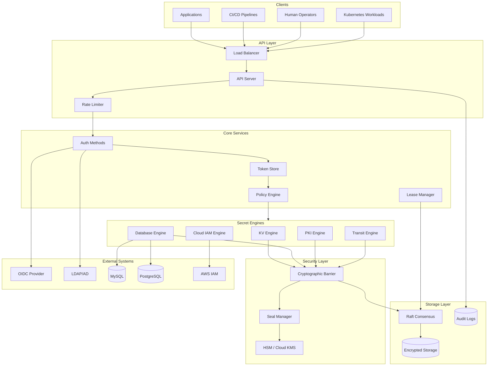
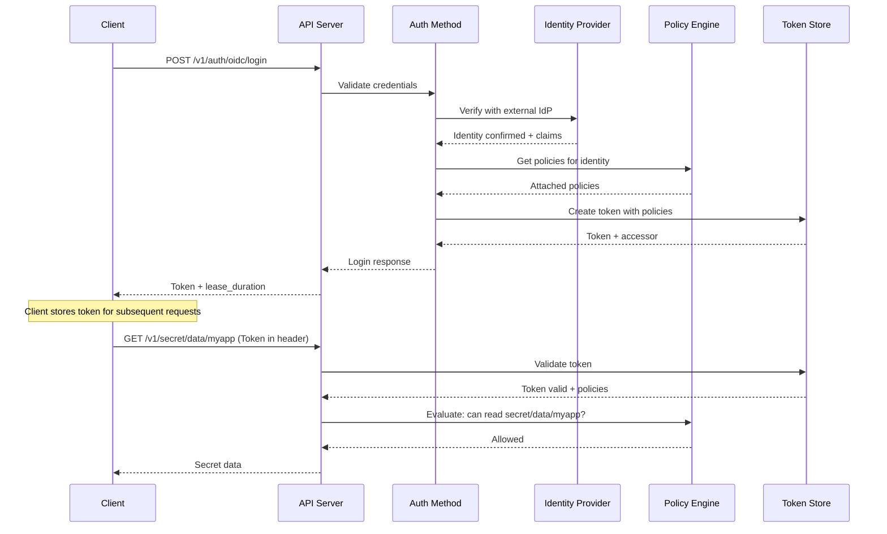
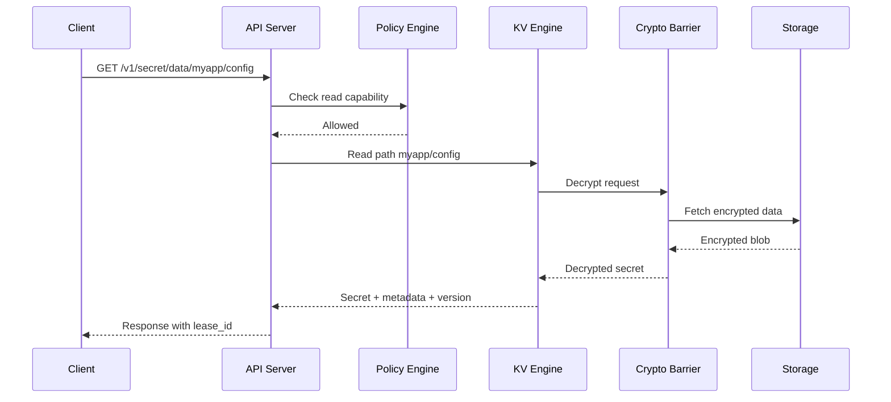
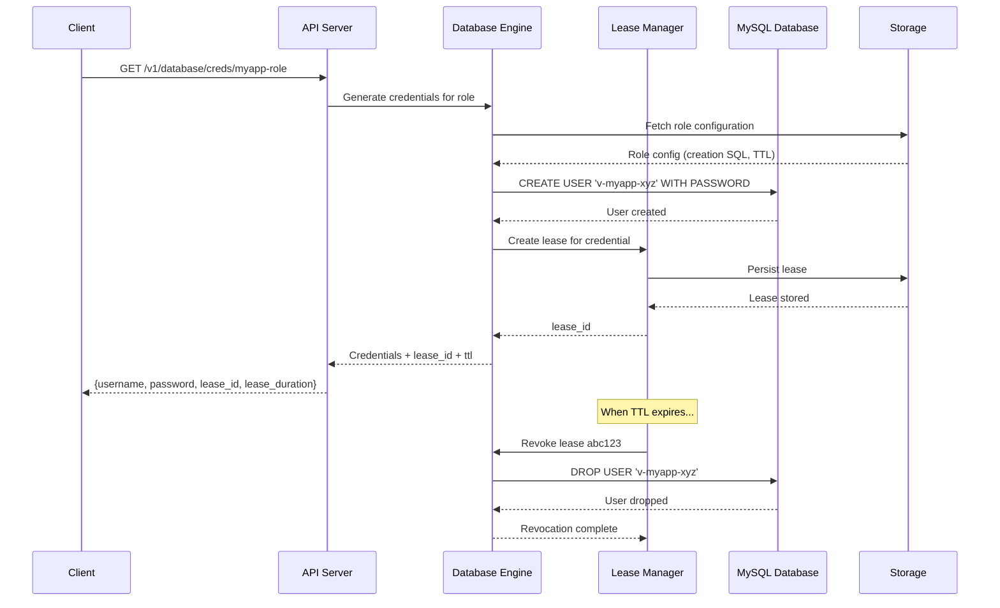
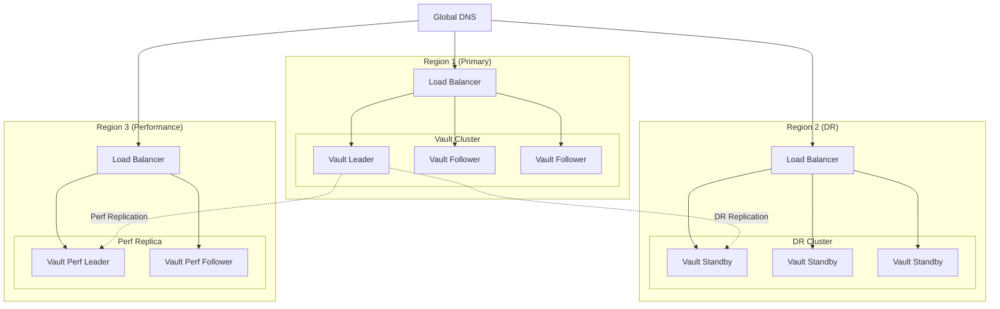

# Secret Management System - High-Level Design

## System Architecture



---

## Component Responsibilities

### API Layer

| Component | Responsibility | Implementation |
|-----------|---------------|----------------|
| **Load Balancer** | Distribute traffic across nodes; health checks | L7 LB with sticky sessions for writes |
| **API Server** | HTTP/gRPC interface; request routing | RESTful API with versioning (/v1/) |
| **Rate Limiter** | Prevent DoS; tenant quotas | Token bucket per client/path |

### Core Services

| Component | Responsibility | Criticality |
|-----------|---------------|-------------|
| **Auth Methods** | Verify client identity from various sources | Critical - gates all access |
| **Policy Engine** | Evaluate ACL rules against request path and capabilities | Critical - authorization enforcement |
| **Token Store** | Manage authentication tokens, track usage | Critical - session management |
| **Lease Manager** | Track dynamic secret TTLs, trigger renewals and revocations | Critical - secret lifecycle |

### Secret Engines

| Engine | Function | Output |
|--------|----------|--------|
| **KV v2** | Store versioned key-value secrets | Secret data + metadata |
| **Database** | Generate dynamic DB credentials | Username/password with TTL |
| **PKI** | Issue X.509 certificates | Certificate + private key |
| **Transit** | Encrypt/decrypt without key exposure | Ciphertext or plaintext |
| **Cloud IAM** | Generate cloud provider credentials | Temporary STS tokens |

### Security Layer

| Component | Responsibility | Protection |
|-----------|---------------|------------|
| **Cryptographic Barrier** | Encrypt/decrypt all persistent data | Zero-knowledge guarantee |
| **Seal Manager** | Protect master key; control access to barrier | Shamir's or auto-unseal |
| **HSM Integration** | Hardware protection for root key | FIPS 140-2 Level 3 |

### Storage Layer

| Component | Responsibility | Characteristics |
|-----------|---------------|-----------------|
| **Raft Consensus** | Distributed consensus for HA | 3-5 nodes, leader election |
| **Encrypted Storage** | Persist encrypted secrets and metadata | All data encrypted at rest |
| **Audit Logs** | Immutable operation history | Tamper-evident, HMAC protected |

---

## Authentication Flow



---

## Secret Read Path



---

## Dynamic Secret Generation Flow



---

## Key Architectural Decisions

### 1. Seal Mechanism: Shamir vs Auto-Unseal

| Factor | Shamir's Secret Sharing | Cloud KMS Auto-Unseal |
|--------|------------------------|----------------------|
| **Security** | No external dependency; highest assurance | Depends on cloud provider security |
| **Operations** | Requires human operators for unseal | Automatic recovery after restart |
| **Cold Start** | Manual intervention required | Automatic within seconds |
| **Compliance** | Preferred for air-gapped, FedRAMP | Acceptable for most enterprise |
| **Disaster Recovery** | Unseal keys must be distributed | KMS key must be available |

**Recommendation**: Use Cloud KMS Auto-Unseal for production automation with Shamir as backup for DR scenarios.

### 2. Storage Backend: Integrated (Raft) vs External (Consul)

| Factor | Integrated Storage (Raft) | External (Consul) |
|--------|--------------------------|-------------------|
| **Operational Complexity** | Single system to manage | Separate Consul cluster |
| **Performance** | Optimized for Vault workload | Additional network hop |
| **HA** | Built-in leader election | Consul provides HA |
| **Snapshot/Restore** | Native Raft snapshots | Consul snapshot |
| **Scalability** | 5-node practical limit | Scales with Consul |

**Recommendation**: Use Integrated Storage (Raft) for new deployments; simpler operations with sufficient performance.

### 3. Secret Types: Static vs Dynamic

| Factor | Static Secrets | Dynamic Secrets |
|--------|---------------|-----------------|
| **Complexity** | Simple CRUD | Lease management required |
| **Security** | Long-lived, shared | Short-lived, unique per request |
| **Rotation Burden** | Manual or scheduled | Automatic on expiry |
| **Blast Radius** | Wide if leaked | Limited to single consumer |
| **Use Case** | API keys, config | DB passwords, cloud creds |

**Recommendation**: Prefer dynamic secrets for databases and cloud access; use static for truly static values (API keys from vendors).

### 4. Certificate Lifecycle: Long-Lived vs Short-Lived

| Factor | Long-Lived (months/years) | Short-Lived (hours/days) |
|--------|--------------------------|-------------------------|
| **Revocation** | CRL/OCSP infrastructure required | Natural expiration |
| **Operational Load** | Lower issuance frequency | Higher issuance frequency |
| **Security** | Revocation may not propagate | Automatic protection |
| **Use Case** | External TLS, user certs | Service mesh, mTLS |

**Recommendation**: Short-lived certificates (24h or less) for internal services; longer-lived for external-facing with proper revocation infrastructure.

---

## Architecture Pattern Checklist

| Pattern | Decision | Justification |
|---------|----------|---------------|
| **Sync vs Async** | Synchronous for reads/writes; async for audit | Secrets need immediate consistency |
| **Push vs Pull** | Pull model (clients request secrets) | Clients control when to fetch; simpler security model |
| **Stateless vs Stateful** | Stateful (leader for writes) | Raft consensus requires leader |
| **Read vs Write optimization** | Read-optimized with write-through | 1000:1 read-to-write ratio |
| **Encryption** | Encrypt at rest and in transit | Zero-knowledge architecture |
| **Multi-tenancy** | Namespace isolation | Separate encryption contexts per tenant |

---

## Data Flow Summary

### Write Path (Strong Consistency)

```
Client → API → Auth → Policy (check write) → Engine → Barrier (encrypt) → Raft (consensus) → Storage
                                                                              ↓
                                                              Replicate to followers
```

### Read Path (Optimized)

```
Client → API → Auth → Policy (cached check) → Engine → Barrier (decrypt) → Storage (or cache)
```

### Audit Path (Synchronous)

```
Every operation → Audit Logger → Multiple backends (file, syslog, socket)
                                        ↓
                              If all backends fail → Block operation
```

---

## Integration Points

### Inbound Integrations

| System | Integration Type | Purpose |
|--------|-----------------|---------|
| OIDC Provider | Auth method | Human user authentication |
| LDAP/AD | Auth method | Enterprise directory auth |
| Kubernetes | Auth method | Workload authentication |
| CI/CD (Jenkins, GitHub Actions) | AppRole auth | Pipeline secret access |

### Outbound Integrations

| System | Integration Type | Purpose |
|--------|-----------------|---------|
| MySQL/PostgreSQL | Database engine | Dynamic credential generation |
| AWS/GCP/Azure | Cloud engine | Temporary cloud credentials |
| SIEM (Splunk, Elastic) | Audit export | Security monitoring |
| HSM | Seal mechanism | Hardware key protection |

---

## Deployment Topology



---

## Failure Scenarios and Handling

| Scenario | Detection | Response | Recovery |
|----------|-----------|----------|----------|
| **Single node failure** | Health check timeout | Traffic routed to other nodes | Replace node, rejoin cluster |
| **Leader failure** | Raft heartbeat timeout | Automatic leader election | New leader in ~10 seconds |
| **Network partition** | Split-brain detection | Minority partition becomes read-only | Heal partition, reconcile |
| **Seal triggered** | Seal status API | All operations blocked | Unseal with keys or auto-unseal |
| **Storage corruption** | Consistency checks | Restore from snapshot | Raft snapshot restore |
| **Region failure** | Cross-region health check | Promote DR cluster | DR promotion procedure |
