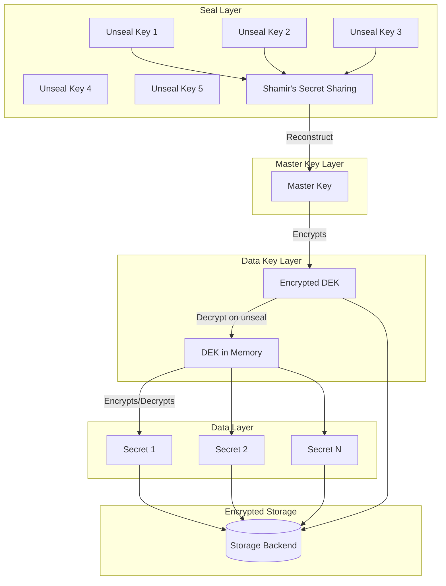
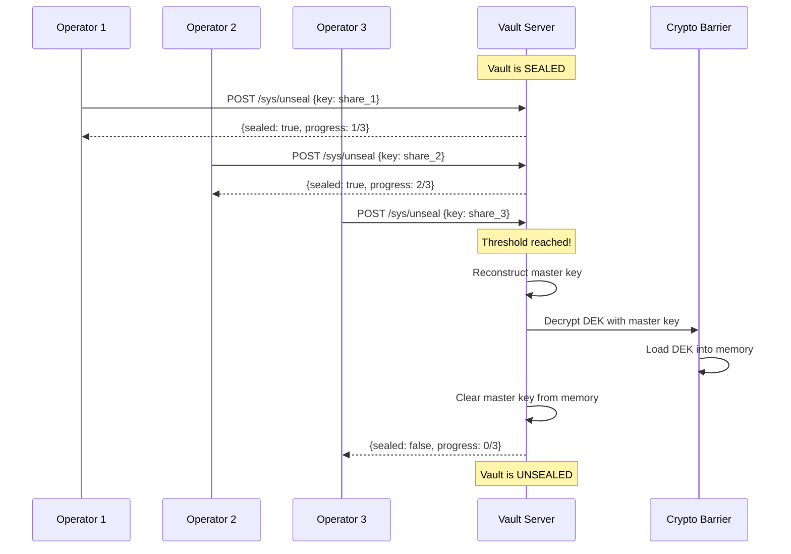
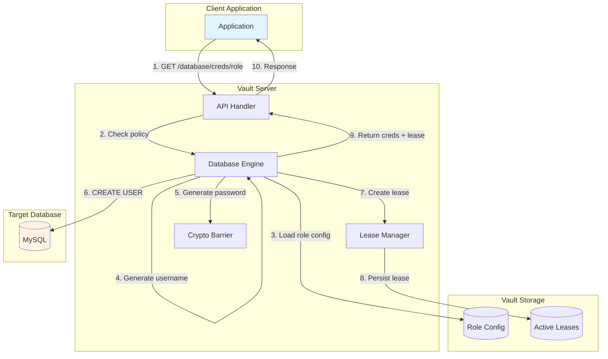
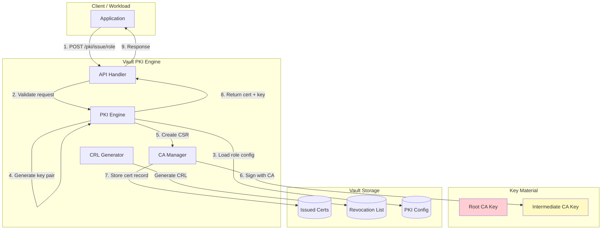

# Secret Management System - Deep Dive & Bottlenecks

## Deep Dive 1: Seal/Unseal Mechanism

### Overview

The seal mechanism is the most critical security component in a secret management system. It protects the master key that encrypts all data. When sealed, the system is cryptographically locked—even with full access to storage, an attacker cannot read secrets.

### Key Hierarchy Architecture



### Shamir's Secret Sharing Implementation

```
FUNCTION initialize_vault(shares: int, threshold: int) -> InitResult:
    """
    Initialize a new Vault instance.
    Generates master key and splits it using Shamir's algorithm.

    Args:
        shares: Number of unseal key shares to generate (n)
        threshold: Number of shares required to unseal (k)

    Returns:
        Root token and unseal keys
    """
    // 1. Generate cryptographically secure master key (256 bits)
    master_key = crypto_random_bytes(32)

    // 2. Generate Data Encryption Key
    dek = crypto_random_bytes(32)

    // 3. Encrypt DEK with master key
    encrypted_dek = aes_gcm_encrypt(master_key, dek)

    // 4. Split master key using Shamir's Secret Sharing
    unseal_keys = shamir_split(master_key, shares, threshold)

    // 5. Securely erase master key from memory
    secure_zero(master_key)

    // 6. Store encrypted DEK and initialization status
    storage.write("core/seal-config", SealConfig(
        type="shamir",
        shares=shares,
        threshold=threshold
    ))
    storage.write("core/keyring", encrypted_dek)

    // 7. Generate root token
    root_token = generate_root_token()

    // 8. Initialize audit devices
    initialize_audit()

    RETURN InitResult(
        unseal_keys=unseal_keys,
        root_token=root_token,
        recovery_keys=None  // Only for auto-unseal
    )
```

### Unseal Process



### Auto-Unseal with Cloud KMS

```
FUNCTION auto_unseal_init(kms_key_id: string) -> InitResult:
    """
    Initialize with auto-unseal using cloud KMS.
    Master key is encrypted by KMS, not split by Shamir.
    """
    // 1. Generate master key
    master_key = crypto_random_bytes(32)

    // 2. Encrypt master key with cloud KMS
    encrypted_master_key = cloud_kms.encrypt(kms_key_id, master_key)

    // 3. Generate recovery keys (for emergency access)
    recovery_keys = shamir_split(master_key, 5, 3)

    // 4. Generate and encrypt DEK
    dek = crypto_random_bytes(32)
    encrypted_dek = aes_gcm_encrypt(master_key, dek)

    // 5. Securely erase master key
    secure_zero(master_key)

    // 6. Store seal configuration
    storage.write("core/seal-config", SealConfig(
        type="awskms",  // or gcpckms, azurekeyvault, transit
        kms_key_id=kms_key_id
    ))
    storage.write("core/keyring", encrypted_dek)
    storage.write("core/recovery-key", encrypted_master_key)

    RETURN InitResult(
        unseal_keys=None,  // Not needed for auto-unseal
        root_token=generate_root_token(),
        recovery_keys=recovery_keys
    )


FUNCTION auto_unseal_on_startup():
    """
    Automatically unseal Vault on startup using cloud KMS.
    """
    seal_config = storage.read("core/seal-config")

    IF seal_config.type NOT IN ["awskms", "gcpckms", "azurekeyvault", "transit"]:
        RAISE Error("Auto-unseal not configured")

    // 1. Fetch encrypted master key
    encrypted_master_key = storage.read("core/recovery-key")

    // 2. Decrypt using cloud KMS
    TRY:
        master_key = cloud_kms.decrypt(seal_config.kms_key_id, encrypted_master_key)
    CATCH KMSError as e:
        log.error(f"Auto-unseal failed: {e}")
        RAISE SealError("Cannot contact KMS for auto-unseal")

    // 3. Decrypt DEK
    encrypted_dek = storage.read("core/keyring")
    dek = aes_gcm_decrypt(master_key, encrypted_dek)

    // 4. Load DEK into barrier
    barrier.set_dek(dek)

    // 5. Clear sensitive material
    secure_zero(master_key)

    log.info("Auto-unseal successful")
```

### Seal Comparison

| Aspect | Shamir | Cloud KMS Auto-Unseal |
|--------|--------|----------------------|
| **Cold Start** | Manual operator intervention | Automatic within seconds |
| **Security** | No external dependency | Depends on cloud provider |
| **DR Complexity** | Distribute keys to custodians | KMS key must be accessible |
| **Compliance** | Highest (air-gapped possible) | Acceptable for most |
| **Operations** | High touch | Low touch |
| **Failure Mode** | Humans unavailable | KMS outage |

---

## Deep Dive 2: Dynamic Secret Generation

### Database Credential Generation Flow



### Credential Generation Algorithm

```
FUNCTION generate_database_credential(role_name: string, token: Token) -> CredentialResponse:
    """
    Generate dynamic database credentials for a role.
    """
    // 1. Fetch role configuration
    role = storage.read(f"database/roles/{role_name}")
    IF role IS None:
        RAISE NotFoundError(f"Role {role_name} not found")

    // 2. Get database connection
    db_config = storage.read(f"database/config/{role.db_name}")
    connection = db_connection_pool.get(role.db_name)

    // 3. Generate unique username
    // Format: v-{auth_method}-{role}-{random}-{timestamp}
    username = generate_username(
        prefix="v",
        auth_display=token.display_name[:8],
        role=role_name[:16],
        random=random_alphanumeric(10),
        timestamp=unix_timestamp()[-4:]
    )
    // Truncate to DB limit (e.g., 32 chars for MySQL)
    username = truncate_username(username, db_config.username_max_length)

    // 4. Generate secure password
    password = generate_secure_password(
        length=role.password_length OR 24,
        include_upper=True,
        include_lower=True,
        include_digits=True,
        include_special=role.include_special OR False
    )

    // 5. Execute creation statements
    FOR statement IN role.creation_statements:
        // Replace template variables
        sql = statement.replace("{{name}}", username)
        sql = sql.replace("{{password}}", password)
        sql = sql.replace("{{expiration}}", calculate_expiration(role.default_ttl))

        TRY:
            connection.execute(sql)
        CATCH DBError as e:
            // Rollback: attempt to delete partially created user
            cleanup_partial_user(connection, username)
            RAISE Error(f"Failed to create user: {e}")

    // 6. Create lease for credential
    lease = lease_manager.create_lease(
        path=f"database/creds/{role_name}",
        token_accessor=token.accessor,
        ttl=role.default_ttl,
        max_ttl=role.max_ttl,
        renewable=True,
        revoke_callback=lambda: revoke_database_credential(role, username)
    )

    // 7. Store revocation context
    storage.write(f"sys/leases/{lease.lease_id}/revoke-data", RevocationData(
        db_name=role.db_name,
        username=username,
        role_name=role_name,
        revocation_statements=role.revocation_statements
    ))

    RETURN CredentialResponse(
        username=username,
        password=password,
        lease_id=lease.lease_id,
        lease_duration=lease.ttl_seconds,
        renewable=True
    )


FUNCTION revoke_database_credential(revoke_data: RevocationData):
    """
    Revoke a database credential by executing revocation statements.
    Called when lease expires or is explicitly revoked.
    """
    connection = db_connection_pool.get(revoke_data.db_name)

    FOR statement IN revoke_data.revocation_statements:
        sql = statement.replace("{{name}}", revoke_data.username)

        TRY:
            connection.execute(sql)
        CATCH DBError as e:
            log.error(f"Revocation failed for {revoke_data.username}: {e}")
            // Don't fail completely - user may already be deleted
            // or have active connections

    log.info(f"Revoked database credential: {revoke_data.username}")
```

### Static Role Rotation

```
FUNCTION rotate_static_role(role_name: string):
    """
    Rotate password for a static role (1:1 mapping to DB user).
    Used when application needs the same username but periodic password rotation.
    """
    role = storage.read(f"database/static-roles/{role_name}")
    db_config = storage.read(f"database/config/{role.db_name}")

    // 1. Generate new password
    new_password = generate_secure_password(length=24)

    // 2. Execute rotation statements
    connection = db_connection_pool.get(role.db_name)

    FOR statement IN role.rotation_statements:
        sql = statement.replace("{{name}}", role.username)
        sql = sql.replace("{{password}}", new_password)

        connection.execute(sql)

    // 3. Store rotated credential (encrypted)
    storage.write(f"database/static-creds/{role_name}", EncryptedCredential(
        username=role.username,
        password=encrypt_secret(new_password),
        last_rotated=now()
    ))

    // 4. Update rotation schedule
    next_rotation = now() + role.rotation_period
    scheduler.schedule(f"rotate-{role_name}", next_rotation, rotate_static_role, role_name)

    log.info(f"Rotated static role: {role_name}")
```

---

## Deep Dive 3: PKI Engine

### Certificate Issuance Architecture



### Certificate Issuance Algorithm

```
FUNCTION issue_certificate(role_name: string, request: CertRequest) -> CertResponse:
    """
    Issue a certificate based on a PKI role configuration.
    """
    // 1. Load role configuration
    role = storage.read(f"pki/roles/{role_name}")
    IF role IS None:
        RAISE NotFoundError(f"Role {role_name} not found")

    // 2. Validate request against role constraints
    validate_cert_request(request, role)

    // 3. Determine TTL (minimum of requested, role max, CA remaining validity)
    ca_cert = storage.read("pki/ca")
    requested_ttl = parse_duration(request.ttl) OR role.default_ttl
    max_ttl = min(role.max_ttl, ca_cert.not_after - now())
    ttl = min(requested_ttl, max_ttl)

    // 4. Generate key pair (unless CSR provided)
    IF request.csr IS NOT None:
        // Use provided CSR
        csr = parse_csr(request.csr)
        private_key = None  // Client has the key
    ELSE:
        // Generate new key pair
        key_type = role.key_type OR "rsa"
        key_bits = role.key_bits OR 2048

        IF key_type == "rsa":
            private_key, public_key = generate_rsa_key(key_bits)
        ELIF key_type == "ec":
            private_key, public_key = generate_ec_key(key_bits)
        ELIF key_type == "ed25519":
            private_key, public_key = generate_ed25519_key()

        csr = create_csr(public_key, request.common_name)

    // 5. Build certificate
    serial = generate_serial_number()
    not_before = now()
    not_after = now() + ttl

    cert_builder = CertificateBuilder()
        .subject_name(build_subject(request, role))
        .issuer_name(ca_cert.subject)
        .public_key(csr.public_key)
        .serial_number(serial)
        .not_valid_before(not_before)
        .not_valid_after(not_after)

    // 6. Add extensions
    IF request.alt_names:
        cert_builder.add_extension(
            SubjectAlternativeName(parse_san(request.alt_names, role))
        )

    IF role.server_flag:
        cert_builder.add_extension(
            ExtendedKeyUsage([ExtendedKeyUsageOID.SERVER_AUTH])
        )

    IF role.client_flag:
        cert_builder.add_extension(
            ExtendedKeyUsage([ExtendedKeyUsageOID.CLIENT_AUTH])
        )

    // 7. Sign certificate with CA private key
    ca_private_key = decrypt_ca_key()
    certificate = cert_builder.sign(
        private_key=ca_private_key,
        algorithm=hashes.SHA256()
    )
    secure_zero(ca_private_key)

    // 8. Store certificate record
    storage.write(f"pki/certs/{serial}", CertRecord(
        serial_number=serial,
        common_name=request.common_name,
        not_before=not_before,
        not_after=not_after,
        revoked=False,
        issued_at=now(),
        role=role_name
    ))

    // 9. Create lease (for tracking, not automatic revocation)
    lease = lease_manager.create_lease(
        path=f"pki/issue/{role_name}",
        token_accessor=token.accessor,
        ttl=ttl,
        renewable=False,
        revoke_callback=None  // Cert revocation is explicit, not automatic
    )

    RETURN CertResponse(
        certificate=encode_pem(certificate),
        issuing_ca=encode_pem(ca_cert),
        ca_chain=get_ca_chain(),
        private_key=encode_pem(private_key) IF private_key ELSE None,
        serial_number=format_serial(serial),
        lease_id=lease.lease_id,
        lease_duration=ttl
    )


FUNCTION validate_cert_request(request: CertRequest, role: PKIRole):
    """
    Validate certificate request against role constraints.
    """
    // Common name validation
    IF NOT matches_any_pattern(request.common_name, role.allowed_domains):
        RAISE ValidationError("Common name not allowed for this role")

    // SAN validation
    FOR san IN request.alt_names:
        IF NOT matches_any_pattern(san, role.allowed_domains):
            RAISE ValidationError(f"SAN {san} not allowed for this role")

    // Wildcard check
    IF "*" IN request.common_name AND NOT role.allow_wildcard_certificates:
        RAISE ValidationError("Wildcard certificates not allowed")

    // TTL check
    IF request.ttl AND parse_duration(request.ttl) > role.max_ttl:
        RAISE ValidationError("Requested TTL exceeds role maximum")
```

### Certificate Revocation

```
FUNCTION revoke_certificate(serial_number: string, reason: int = 0):
    """
    Revoke a certificate and update CRL.

    Reason codes (RFC 5280):
    0 - unspecified
    1 - keyCompromise
    2 - cACompromise
    3 - affiliationChanged
    4 - superseded
    5 - cessationOfOperation
    """
    // 1. Find certificate record
    cert_record = storage.read(f"pki/certs/{serial_number}")
    IF cert_record IS None:
        RAISE NotFoundError("Certificate not found")

    IF cert_record.revoked:
        RAISE AlreadyRevokedError("Certificate already revoked")

    // 2. Update certificate record
    cert_record.revoked = True
    cert_record.revoked_at = now()
    cert_record.revocation_reason = reason
    storage.write(f"pki/certs/{serial_number}", cert_record)

    // 3. Add to CRL
    storage.append("pki/crl-entries", CRLEntry(
        serial_number=serial_number,
        revoked_at=now(),
        reason=reason
    ))

    // 4. Trigger CRL regeneration (async)
    schedule_crl_regeneration()

    log.info(f"Revoked certificate: {serial_number}")


FUNCTION generate_crl() -> bytes:
    """
    Generate Certificate Revocation List.
    """
    ca_cert = storage.read("pki/ca")
    ca_key = decrypt_ca_key()

    crl_builder = CRLBuilder()
        .issuer_name(ca_cert.subject)
        .last_update(now())
        .next_update(now() + CRL_VALIDITY_PERIOD)

    // Add all revoked certificates
    revoked_entries = storage.read("pki/crl-entries")
    FOR entry IN revoked_entries:
        // Skip if certificate has expired (no longer relevant)
        cert = storage.read(f"pki/certs/{entry.serial_number}")
        IF cert.not_after < now():
            CONTINUE

        crl_builder.add_revoked_certificate(
            RevokedCertificate(
                serial_number=entry.serial_number,
                revocation_date=entry.revoked_at,
                reason=entry.reason
            )
        )

    crl = crl_builder.sign(ca_key, hashes.SHA256())
    secure_zero(ca_key)

    // Cache CRL
    storage.write("pki/crl", crl)

    RETURN encode_pem(crl)
```

---

## Bottleneck Analysis

### Bottleneck 1: Lease Explosion

| Aspect | Details |
|--------|---------|
| **Symptom** | Memory exhaustion, slow responses, high CPU on leader |
| **Cause** | Too many active leases (100K+) with long TTLs |
| **Impact** | System instability, potential crash |

**Root Cause Analysis:**
```
Lease storage: 100,000 leases × 500 bytes = 50 MB in memory
Expiration checks: O(log N) per operation = slow at scale
TTL processing: Background job can't keep up with expirations
```

**Solutions:**

| Solution | Implementation | Trade-off |
|----------|---------------|-----------|
| Shorter TTLs | Set default_ttl=1h, max_ttl=24h | More renewal traffic |
| Batch tokens | Use batch tokens for high-volume | No renewal capability |
| Rate limiting | Limit credential requests per client | May block legitimate use |
| Monitoring | Alert at 50K leases | Reactive, not preventive |

**Mitigation Algorithm:**
```
FUNCTION enforce_lease_limits(client_id: string) -> bool:
    // Per-client lease limit
    client_leases = count_leases_by_accessor(client_id)
    IF client_leases > MAX_LEASES_PER_CLIENT:
        RETURN False

    // Global lease limit
    total_leases = get_total_lease_count()
    IF total_leases > GLOBAL_LEASE_LIMIT:
        log.warn("Global lease limit reached, rejecting new leases")
        RETURN False

    RETURN True
```

### Bottleneck 2: Cold Start Latency

| Aspect | Details |
|--------|---------|
| **Symptom** | Long delay before system is operational after restart |
| **Cause** | Manual unseal, policy loading, cache warming |
| **Impact** | Extended downtime, dependent services timeout |

**Timeline Analysis:**
```
1. Container/VM start: 5-10 seconds
2. Vault process init: 2-3 seconds
3. Manual unseal (3 operators): 1-10 minutes (human coordination)
4. Raft leader election: 5-15 seconds
5. Policy cache warm: 10-30 seconds
6. Ready for traffic: Total 2-15 minutes
```

**Solutions:**

| Solution | Implementation | Trade-off |
|----------|---------------|-----------|
| Auto-unseal | Cloud KMS or Transit | External dependency |
| Warm standby | Performance replicas ready | Higher cost |
| Fast policy load | Precompile policies | Complexity |
| Health check tuning | Longer startup probe | Delayed detection |

### Bottleneck 3: Policy Evaluation at Scale

| Aspect | Details |
|--------|---------|
| **Symptom** | Increased latency on authorization checks |
| **Cause** | Many policies, complex path matching, no caching |
| **Impact** | Every request slowed down |

**Complexity Analysis:**
```
Token with 20 policies
Each policy has 50 rules
Request path: "secret/data/team-a/app-b/config"

Evaluation: 20 × 50 × path_match_cost = 1000 comparisons
Path match: O(path segments × pattern complexity)
```

**Solutions:**

| Solution | Implementation | Trade-off |
|----------|---------------|-----------|
| Policy caching | LRU cache with 60s TTL | Stale policy window |
| Precompiled policies | Build trie/FSM at load | Memory overhead |
| Reduce policy count | Use templating | Design complexity |
| Sentinel policies | Batch policy logic | Enterprise only |

**Optimized Evaluation:**
```
FUNCTION optimized_policy_check(token: Token, path: string, op: string) -> bool:
    // 1. Check cache first
    cache_key = f"{token.accessor}:{path}:{op}"
    cached = policy_cache.get(cache_key)
    IF cached IS NOT None:
        RETURN cached.allowed

    // 2. Check precompiled policy trie
    result = policy_trie.lookup(token.policies, path, op)

    // 3. Cache result
    policy_cache.set(cache_key, result, ttl=30)

    RETURN result.allowed
```

### Bottleneck 4: Certificate Generation Throughput

| Aspect | Details |
|--------|---------|
| **Symptom** | High latency on cert issuance, queue buildup |
| **Cause** | RSA key generation is CPU-intensive |
| **Impact** | Service mesh startup delays |

**Performance Profile:**
```
RSA-2048 key generation: 50-200ms
RSA-4096 key generation: 200-500ms
ECDSA P-256 key generation: 5-20ms
Ed25519 key generation: 1-5ms
Certificate signing: 1-5ms
```

**Solutions:**

| Solution | Implementation | Trade-off |
|----------|---------------|-----------|
| Use ECDSA/Ed25519 | Default to EC keys | Some legacy incompatibility |
| Pre-generate keys | Background key pool | Memory usage, security concerns |
| HSM offload | Hardware acceleration | Cost, latency to HSM |
| Caching | Cache cert for same params | Reduced uniqueness |

### Bottleneck Summary Table

| Bottleneck | Symptom | Trigger Threshold | Primary Mitigation |
|------------|---------|-------------------|-------------------|
| Lease explosion | Memory/CPU spike | >50K active leases | Shorter TTLs, batch tokens |
| Cold start | Extended downtime | Manual unseal | Auto-unseal with KMS |
| Policy evaluation | Slow requests | >1000 policies | Policy caching, templating |
| Cert generation | Queue buildup | >100 certs/sec | ECDSA, key pre-generation |
| Storage I/O | Write latency | >1000 writes/sec | SSD/NVMe, Raft batching |
| Audit logging | Request blocking | Audit backend failure | Multiple audit devices |

---

## Concurrency and Race Conditions

### Race Condition 1: Check-and-Set (CAS) for Secrets

**Problem:** Two clients read the same secret, both update, one overwrites the other.

**Solution:** Version-based CAS
```
FUNCTION write_secret_with_cas(path: string, data: bytes, expected_version: int):
    lock = acquire_lock(f"secret:{path}")
    TRY:
        current = storage.read(path)
        IF current.version != expected_version:
            RAISE CASMismatchError("Version mismatch, refresh and retry")

        new_version = current.version + 1
        storage.write(path, SecretVersion(data=data, version=new_version))
    FINALLY:
        release_lock(lock)
```

### Race Condition 2: Token Creation vs Parent Revocation

**Problem:** Child token created while parent is being revoked.

**Solution:** Hierarchical locking with orphan prevention
```
FUNCTION create_child_token(parent_token: Token) -> Token:
    // Lock parent first to prevent revocation during creation
    parent_lock = acquire_lock(f"token:{parent_token.accessor}")
    TRY:
        // Check parent is still valid
        IF NOT is_token_valid(parent_token):
            RAISE TokenExpiredError()

        child = create_token(parent=parent_token.accessor)
        // Atomic: add to parent's children list
        add_child_token(parent_token.accessor, child.accessor)
        RETURN child
    FINALLY:
        release_lock(parent_lock)
```

### Race Condition 3: Lease Renewal During Expiration

**Problem:** Lease being renewed while expiration job is revoking it.

**Solution:** Lease state machine with atomic transitions
```
FUNCTION renew_lease_safely(lease_id: string, increment: int) -> Lease:
    lease_lock = acquire_lock(f"lease:{lease_id}")
    TRY:
        lease = storage.read(lease_id)

        // Check lease state
        IF lease.state == "revoked":
            RAISE LeaseRevokedException()
        IF lease.state == "revoking":
            RAISE LeaseRevokingException("Lease is being revoked")

        // Transition to renewing state
        lease.state = "renewing"
        storage.write(lease_id, lease)

        // Perform renewal
        lease.expires_at = now() + increment
        lease.state = "active"
        storage.write(lease_id, lease)

        RETURN lease
    FINALLY:
        release_lock(lease_lock)
```
