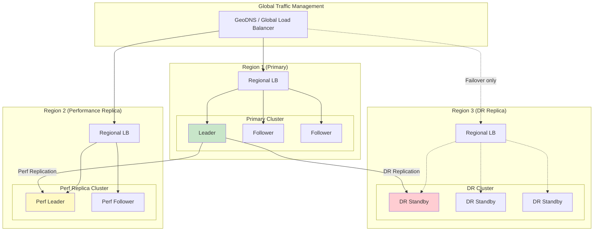
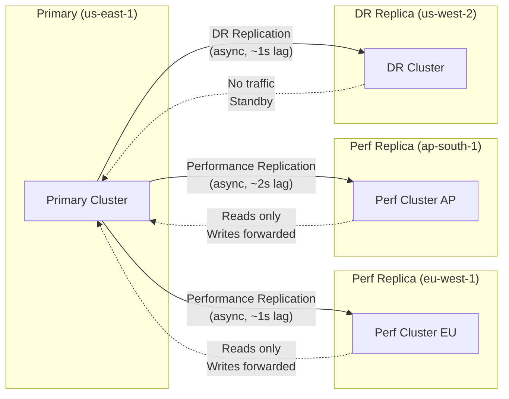
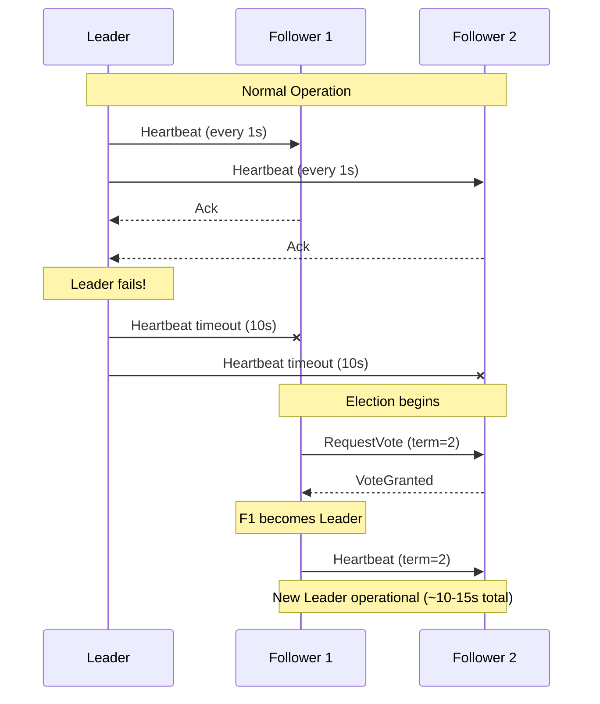

# Secret Management System - Scalability & Reliability

## Scaling Strategy Overview



---

## Horizontal Scaling

### Raft Cluster Scaling

| Cluster Size | Fault Tolerance | Write Performance | Read Performance |
|--------------|-----------------|-------------------|------------------|
| 3 nodes | 1 node failure | Baseline | 3× reads |
| 5 nodes | 2 node failures | -10% (more replication) | 5× reads |
| 7 nodes | 3 node failures | -20% | 7× reads |

**Recommendation:** 5 nodes for production; 7 only for extreme fault tolerance requirements.

### Read Scaling with Performance Replicas

```
Primary Cluster (Region A)
    ├── Leader: Handles all writes
    ├── Follower 1: Serves reads, vote in election
    └── Follower 2: Serves reads, vote in election

Performance Replica (Region B)
    ├── Perf Leader: Local reads, forwards writes to primary
    └── Perf Follower: Local reads

Performance Replica (Region C)
    ├── Perf Leader: Local reads, forwards writes to primary
    └── Perf Follower: Local reads
```

**Performance Replica Characteristics:**
- Maintains own tokens and leases (local lifecycle)
- Shares configuration, policies, secrets with primary
- Write requests transparently forwarded to primary
- Near real-time replication (seconds)
- Can have its own performance replicas (tree structure)

### Scaling Limits

| Dimension | Practical Limit | Bottleneck |
|-----------|-----------------|------------|
| Secrets | 1M+ | Storage I/O |
| Active leases | 100K | Memory, expiration processing |
| Policies | 10K | Evaluation latency |
| Concurrent connections | 50K per node | Network, goroutines |
| Requests per second | 10K per node | CPU |
| Replication clusters | 30+ | Network bandwidth |

---

## Multi-Region Architecture

### Replication Types



### Performance vs DR Replication

| Aspect | Performance Replication | DR Replication |
|--------|------------------------|----------------|
| **Purpose** | Reduce read latency | Disaster recovery |
| **Traffic** | Serves read requests | No traffic (standby) |
| **Tokens** | Local tokens and leases | Shares all tokens |
| **Write Path** | Forward to primary | No writes |
| **Activation** | Always active | Manual promotion |
| **Use Case** | Geographic distribution | Catastrophic failure |

### Regional Routing Strategy

```
FUNCTION route_request(request: Request) -> Cluster:
    """
    Route requests to appropriate cluster based on operation and location.
    """
    client_region = get_client_region(request.source_ip)

    IF request.operation IN ["write", "create", "update", "delete"]:
        // All writes go to primary
        RETURN get_primary_cluster()

    // Reads can go to nearest performance replica
    nearest = find_nearest_cluster(client_region)

    IF nearest.is_healthy():
        RETURN nearest
    ELSE:
        // Fallback to primary
        RETURN get_primary_cluster()
```

### Cross-Region Latency Considerations

| Route | Typical Latency | Acceptable For |
|-------|-----------------|----------------|
| Same region | < 5ms | All operations |
| Cross-region (same continent) | 20-50ms | Writes (infrequent) |
| Cross-continent | 100-200ms | Writes only, with caching |

---

## High Availability

### Cluster Health and Leader Election



### Node Health Checks

```
HEALTH CHECK CONFIGURATION:

/v1/sys/health endpoint:
  - 200: Initialized, unsealed, active
  - 429: Unsealed, standby (healthy, not leader)
  - 472: DR secondary (healthy, DR mode)
  - 473: Performance standby (healthy, perf replica)
  - 501: Not initialized
  - 503: Sealed

Load balancer configuration:
  - Health check: GET /v1/sys/health?standbyok=true
  - Interval: 5 seconds
  - Timeout: 2 seconds
  - Unhealthy threshold: 3 failures
  - Healthy threshold: 2 successes
```

### Automatic Failover

| Failure Type | Detection Time | Recovery Time | Data Loss |
|--------------|----------------|---------------|-----------|
| Single node crash | 10 seconds | 0 (traffic rerouted) | None |
| Leader failure | 10 seconds | 10-15 seconds (election) | None |
| Network partition | 10 seconds | Depends on partition duration | None (CP system) |
| Storage failure | Immediate | Restore from replica | Depends on replication lag |
| Region failure | 30-60 seconds | Manual DR promotion | Replication lag (seconds) |

---

## Disaster Recovery

### Recovery Objectives

| Metric | Target | Implementation |
|--------|--------|----------------|
| **RTO** (Recovery Time) | < 5 minutes | Pre-configured DR cluster, automated promotion |
| **RPO** (Recovery Point) | < 30 seconds | Synchronous replication within region, async cross-region |

### DR Promotion Procedure

```
PROCEDURE promote_dr_cluster():
    """
    Promote DR cluster to primary after catastrophic failure.
    """
    // 1. Verify primary is truly unavailable
    FOR i IN range(3):
        IF primary_cluster.is_reachable():
            RAISE Error("Primary still reachable, investigate before promotion")
        sleep(10 seconds)

    // 2. Stop replication on DR cluster
    dr_cluster.execute("vault operator raft remove-peer primary-node-1")
    dr_cluster.execute("vault operator raft remove-peer primary-node-2")
    dr_cluster.execute("vault operator raft remove-peer primary-node-3")

    // 3. Generate DR operation token (requires DR operation keys)
    dr_token = generate_dr_operation_token()

    // 4. Promote DR to primary
    dr_cluster.execute(f"vault operator generate-root -dr-token")
    dr_cluster.execute("vault write sys/replication/dr/secondary/promote dr_operation_token={dr_token}")

    // 5. Update DNS to point to promoted cluster
    update_dns_records(dr_cluster.endpoints)

    // 6. Reconfigure performance replicas to sync from new primary
    FOR perf_replica IN performance_replicas:
        perf_replica.execute("vault write sys/replication/performance/secondary/update-primary primary_api_addr=...")

    // 7. Verify system health
    verify_cluster_health(dr_cluster)

    log.critical("DR promotion complete. Former DR cluster is now primary.")
```

### Backup and Restore

```
BACKUP STRATEGY:

1. Raft Snapshots (automated):
   - Frequency: Every 1 hour
   - Retention: 7 days
   - Storage: Encrypted object storage in different region
   - Command: vault operator raft snapshot save backup-$(date +%Y%m%d-%H%M%S).snap

2. Seal Key Backup (manual):
   - Frequency: On initial setup, on key rotation
   - Storage: HSM, secure offline storage (split custody)
   - Process: Shamir shares to designated custodians

3. Recovery Key Backup (for auto-unseal):
   - Frequency: On setup
   - Storage: Offline, split custody
   - Purpose: Emergency unseal if KMS unavailable

RESTORE PROCEDURE:

1. Deploy new cluster (clean state)
2. Initialize with same seal configuration
3. Restore Raft snapshot:
   vault operator raft snapshot restore backup.snap
4. Unseal cluster
5. Verify data integrity
6. Reconfigure replication
```

### Data Integrity Verification

```
FUNCTION verify_backup_integrity(snapshot_path: string) -> bool:
    """
    Verify backup can be restored and contains expected data.
    """
    // 1. Restore to isolated test environment
    test_cluster = create_test_cluster()
    test_cluster.restore_snapshot(snapshot_path)
    test_cluster.unseal()

    // 2. Verify critical paths exist
    critical_paths = [
        "secret/data/critical-app/config",
        "database/config/production",
        "pki/ca"
    ]

    FOR path IN critical_paths:
        IF NOT test_cluster.path_exists(path):
            log.error(f"Critical path missing: {path}")
            RETURN False

    // 3. Verify secret counts match
    expected_count = get_expected_secret_count()
    actual_count = test_cluster.count_secrets()
    IF abs(expected_count - actual_count) > 100:
        log.error(f"Secret count mismatch: expected {expected_count}, got {actual_count}")
        RETURN False

    // 4. Cleanup test environment
    destroy_test_cluster(test_cluster)

    RETURN True
```

---

## Fault Tolerance Patterns

### Circuit Breaker for External Backends

```
FUNCTION get_database_credential_with_circuit_breaker(role: string) -> Credential:
    """
    Generate database credential with circuit breaker for DB connectivity.
    """
    circuit = circuit_breakers.get(f"db:{role}")

    IF circuit.is_open():
        RAISE CircuitOpenError("Database temporarily unavailable")

    TRY:
        credential = generate_database_credential(role)
        circuit.record_success()
        RETURN credential
    CATCH DatabaseConnectionError as e:
        circuit.record_failure()
        IF circuit.should_open():
            circuit.open(cooldown=30 seconds)
        RAISE e

CIRCUIT_BREAKER_CONFIG:
    failure_threshold: 5 failures in 60 seconds
    success_threshold: 3 successes to close
    half_open_requests: 1 (test request)
    cooldown: 30 seconds
```

### Graceful Degradation

```
DEGRADATION MODES:

1. External IdP Failure:
   - Fallback: Cached authentication decisions (5 min TTL)
   - Impact: New users cannot login, existing sessions continue
   - Alert: P1 - IdP connectivity failure

2. Storage Backend Slow:
   - Fallback: Serve from memory cache, queue writes
   - Impact: Stale reads possible, writes delayed
   - Alert: P2 - Storage latency elevated

3. Audit Backend Failure:
   - Fallback: NONE (operations blocked by default)
   - Alternative: If audit_non_hmac_request_keys configured, queue locally
   - Alert: P1 - Audit system failure

4. Performance Replica Lag:
   - Fallback: Route reads to primary
   - Impact: Higher latency for affected region
   - Alert: P3 - Replication lag > 10 seconds
```

### Bulkhead Pattern

```
RESOURCE ISOLATION:

1. Connection Pools (per target):
   - MySQL pool: 10 connections
   - PostgreSQL pool: 10 connections
   - AWS STS: 50 concurrent

2. Request Queues (per engine):
   - KV engine: 1000 queued requests
   - Database engine: 500 queued requests
   - PKI engine: 200 queued requests

3. Worker Pools:
   - API handlers: 100 goroutines
   - Lease expiration: 10 goroutines
   - Replication: 5 goroutines

Benefits:
- Failure in one area doesn't cascade
- Resource exhaustion isolated
- Predictable behavior under load
```

---

## Auto-Scaling Configuration

### Horizontal Pod Autoscaler (Kubernetes)

```yaml
apiVersion: autoscaling/v2
kind: HorizontalPodAutoscaler
metadata:
  name: vault-hpa
spec:
  scaleTargetRef:
    apiVersion: apps/v1
    kind: StatefulSet
    name: vault
  minReplicas: 3
  maxReplicas: 7
  metrics:
  - type: Resource
    resource:
      name: cpu
      target:
        type: Utilization
        averageUtilization: 70
  - type: Resource
    resource:
      name: memory
      target:
        type: Utilization
        averageUtilization: 80
  behavior:
    scaleDown:
      stabilizationWindowSeconds: 300  # Wait 5 min before scale down
      policies:
      - type: Pods
        value: 1
        periodSeconds: 300  # Remove max 1 pod per 5 min
    scaleUp:
      stabilizationWindowSeconds: 60
      policies:
      - type: Pods
        value: 2
        periodSeconds: 60  # Add max 2 pods per minute
```

### Scaling Triggers

| Metric | Scale Up Threshold | Scale Down Threshold | Notes |
|--------|-------------------|---------------------|-------|
| CPU | > 70% for 2 min | < 30% for 10 min | Primary trigger |
| Memory | > 80% for 2 min | < 40% for 10 min | Secondary trigger |
| Request latency p99 | > 100ms for 5 min | N/A | Manual investigation |
| Active connections | > 80% of limit | < 30% of limit | Network saturation |

---

## Capacity Planning

### Growth Projections

| Year | Secrets | Leases | Requests/Day | Storage |
|------|---------|--------|--------------|---------|
| Y1 | 100K | 60K | 10M | 4 TB |
| Y2 | 250K | 150K | 50M | 10 TB |
| Y3 | 500K | 300K | 100M | 20 TB |
| Y5 | 1M | 500K | 200M | 50 TB |

### Scaling Milestones

| Milestone | Action Required |
|-----------|-----------------|
| 50K secrets | Add monitoring for storage growth |
| 100K leases | Review TTL policies, consider batch tokens |
| 1K req/sec | Add performance replicas |
| 5K req/sec | Optimize policy caching, add nodes |
| 10K req/sec | Multi-cluster architecture, CDN for policies |

### Resource Planning Formula

```
Nodes required = ceil(
    max(
        expected_qps / 2000,              # ~2K QPS per node
        expected_leases / 30000,          # ~30K leases per node
        expected_secrets / 300000         # ~300K secrets per node
    )
)

Memory per node = base_memory + (leases × 500 bytes) + (policy_cache × 2)
CPU per node = base_cpu + (expected_qps / 500)

# Minimum 3 nodes for HA, recommended 5 for production
nodes = max(3, calculated_nodes)
```
