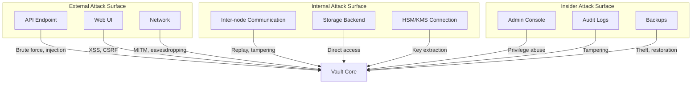
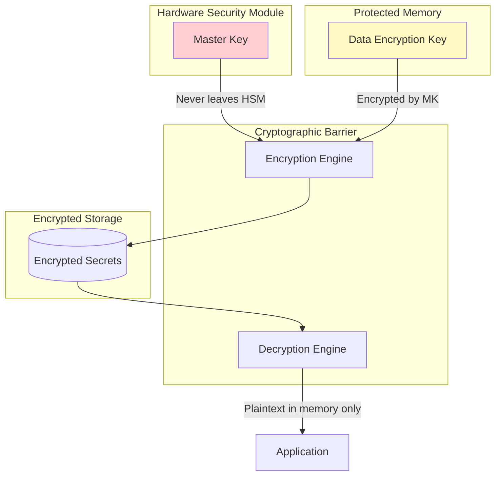
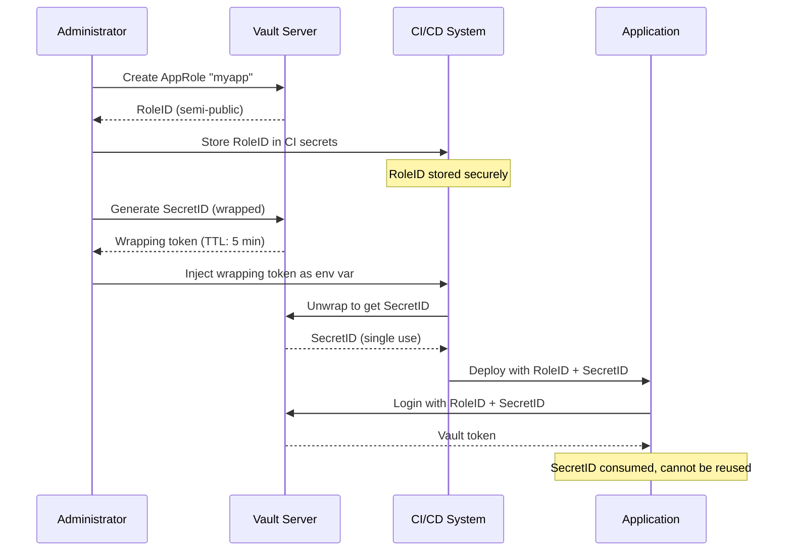
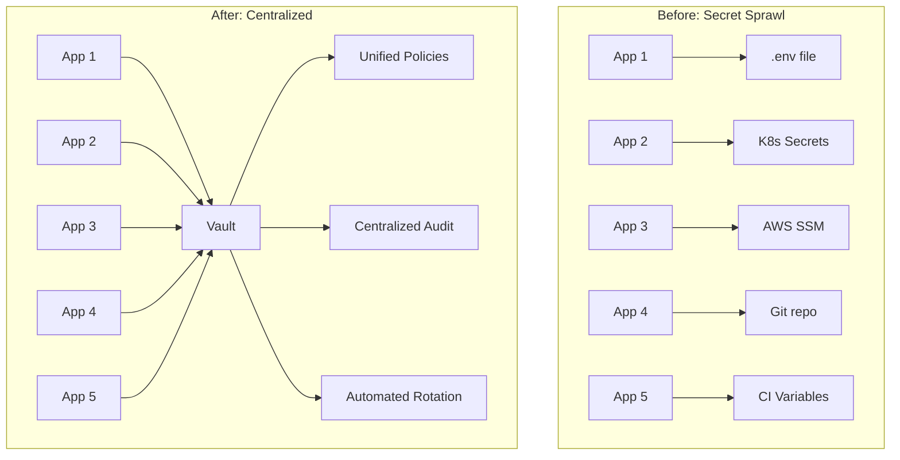

# Secret Management System - Security & Compliance

## Threat Model

### Assets to Protect

| Asset | Description | Impact if Compromised |
|-------|-------------|----------------------|
| **Master Key** | Encrypts all data encryption keys | Total system compromise; all secrets exposed |
| **Data Encryption Keys** | Encrypt individual secrets | All secrets encrypted with that key exposed |
| **Secrets** | Actual sensitive data (passwords, API keys) | Unauthorized access to protected systems |
| **Tokens** | Authentication credentials | Impersonation, unauthorized access |
| **Policies** | Access control rules | Privilege escalation, unauthorized access |
| **Audit Logs** | Security event records | Loss of forensic capability, compliance violation |
| **PKI Keys** | CA private keys | Ability to issue fraudulent certificates |

### Threat Actors

| Actor | Capability | Goal | Likelihood |
|-------|------------|------|------------|
| **External Attacker** | Network access, public exploits | Steal secrets, disrupt service | High |
| **Malicious Insider** | Valid credentials, system knowledge | Data exfiltration, sabotage | Medium |
| **Compromised Workload** | Valid service token, network access | Lateral movement, data theft | High |
| **Rogue Administrator** | Privileged access, root token | Mass data theft, backdoor installation | Low |
| **Supply Chain Attack** | Compromised dependencies | Backdoor, credential theft | Medium |

### Attack Surface



---

## Attack Vectors and Mitigations

### Vector 1: Authentication Bypass

| Attack | Description | Mitigation |
|--------|-------------|------------|
| Brute force | Repeated login attempts | Rate limiting, account lockout |
| Credential stuffing | Using leaked credentials | MFA requirement, password policies |
| Token theft | Stealing valid tokens | Short TTLs, token binding, response wrapping |
| Replay attack | Reusing captured requests | Nonce validation, TLS |

**Mitigation Implementation:**
```
RATE_LIMIT_CONFIG:
    login_attempts:
        per_ip: 10 per minute
        per_user: 5 per minute
        lockout_duration: 15 minutes

    token_creation:
        per_client: 100 per minute

    secret_read:
        per_token: 1000 per minute

FUNCTION check_rate_limit(client_id: string, operation: string) -> bool:
    bucket = rate_limiters.get(f"{operation}:{client_id}")
    IF NOT bucket.try_consume(1):
        audit_log.write(RateLimitEvent(client_id, operation))
        RAISE RateLimitExceeded()
    RETURN True
```

### Vector 2: Privilege Escalation

| Attack | Description | Mitigation |
|--------|-------------|------------|
| Policy manipulation | Modifying own policies | Policy writes require sudo |
| Token hierarchy abuse | Creating overprivileged child | Inheritance restrictions |
| Namespace escape | Accessing parent namespace | Strict namespace boundaries |
| Engine misconfiguration | Overly permissive roles | Regular policy audits |

**Mitigation Implementation:**
```
POLICY HIERARCHY RULES:

1. Child tokens cannot have more capabilities than parent
2. Orphan tokens require explicit sudo capability
3. Token policies are intersection of parent and requested
4. Root token creation requires multiple approvals

FUNCTION create_token_with_policies(parent: Token, requested_policies: List[str]) -> Token:
    // Cannot escalate beyond parent
    allowed_policies = intersection(parent.policies, requested_policies)

    // Orphan requires explicit capability
    IF "orphan" IN request.options AND "sudo" NOT IN parent.capabilities:
        RAISE PrivilegeEscalationError("Orphan tokens require sudo")

    // Cannot create root token
    IF "root" IN requested_policies:
        RAISE PrivilegeEscalationError("Cannot create root tokens via API")

    RETURN create_token(policies=allowed_policies, parent=parent)
```

### Vector 3: Key Compromise

| Attack | Description | Mitigation |
|--------|-------------|------------|
| Master key extraction | Memory dump, cold boot | HSM storage, memory encryption |
| Unseal key theft | Social engineering, theft | Shamir distribution, custodian training |
| DEK extraction | Storage compromise | Encryption barrier, HSM |
| Side-channel attack | Timing analysis | Constant-time operations |

**Key Protection Architecture:**


### Vector 4: Audit Tampering

| Attack | Description | Mitigation |
|--------|-------------|------------|
| Log deletion | Erasing evidence | Immutable storage, real-time forwarding |
| Log modification | Altering entries | HMAC signatures, append-only |
| Audit bypass | Operations without logging | Audit required (ops blocked if fails) |
| Timestamp manipulation | Altering event times | NTP synchronization, signed timestamps |

**Audit Integrity:**
```
AUDIT_CONFIGURATION:
    required: true  # Block operations if audit fails
    log_raw_request: false  # Never log plaintext secrets
    hmac_accessor: true  # HMAC the token accessor
    format: json

    backends:
        - type: file
          path: /var/log/vault/audit.log
          mode: append-only

        - type: syslog
          facility: AUTH
          tag: vault

        - type: socket
          address: siem.internal:514
          socket_type: tcp

FUNCTION audit_operation(request, response):
    audit_entry = AuditEntry(
        timestamp=now(),
        request_id=request.id,
        operation=request.operation,
        path=request.path,
        accessor=hmac(request.token_accessor),
        request_data=hmac(request.data),  # HMAC, not plaintext
        response_status=response.status
    )

    // Must succeed on ALL backends
    failures = []
    FOR backend IN audit_backends:
        TRY:
            backend.write(audit_entry)
        CATCH Error as e:
            failures.append((backend, e))

    IF len(failures) == len(audit_backends):
        RAISE AuditFailureError("All audit backends failed")
```

---

## Zero-Knowledge Architecture

### Encryption Layers

```
┌─────────────────────────────────────────────────────────────┐
│                    Client Application                        │
│  (Secrets in plaintext only in application memory)          │
└─────────────────────────────────────────────────────────────┘
                              │
                              ▼ TLS 1.3
┌─────────────────────────────────────────────────────────────┐
│                      Vault API Layer                         │
│  (Request processing, policy evaluation)                     │
└─────────────────────────────────────────────────────────────┘
                              │
                              ▼
┌─────────────────────────────────────────────────────────────┐
│                  Cryptographic Barrier                       │
│  ┌──────────────────────────────────────────────────────┐   │
│  │  Data Encryption Key (DEK) - AES-256-GCM             │   │
│  │  (Held in memory only when unsealed)                 │   │
│  └──────────────────────────────────────────────────────┘   │
│  (All data encrypted/decrypted here)                        │
└─────────────────────────────────────────────────────────────┘
                              │
                              ▼
┌─────────────────────────────────────────────────────────────┐
│                    Storage Backend                           │
│  (Only sees encrypted blobs - cannot read secrets)          │
│  ┌──────────────────────────────────────────────────────┐   │
│  │  Encrypted secrets, policies, tokens, leases          │   │
│  └──────────────────────────────────────────────────────┘   │
└─────────────────────────────────────────────────────────────┘
```

### Key Derivation Hierarchy

```
FUNCTION derive_key_hierarchy():
    """
    Key derivation for different purposes from single master.
    """
    // Master key (protected by seal)
    master_key = unseal()

    // Derive purpose-specific keys using HKDF
    keys = {
        "storage": hkdf(master_key, info="storage-encryption"),
        "transit": hkdf(master_key, info="transit-encryption"),
        "audit": hkdf(master_key, info="audit-hmac"),
        "token": hkdf(master_key, info="token-encryption")
    }

    // Each key used only for its purpose
    // Compromise of one doesn't directly expose others
    RETURN keys
```

### HSM Integration for FIPS Compliance

| Compliance Level | Key Storage | Operations |
|-----------------|-------------|------------|
| **FIPS 140-2 Level 1** | Software | Software |
| **FIPS 140-2 Level 2** | Tamper-evident HSM | HSM |
| **FIPS 140-2 Level 3** | Tamper-resistant HSM | HSM-only |

**HSM Configuration:**
```
seal "pkcs11" {
    lib = "/usr/lib/softhsm/libsofthsm2.so"
    slot = "0"
    pin = "env:HSM_PIN"
    key_label = "vault-master-key"
    mechanism = "0x0001"  # CKM_RSA_PKCS
    hmac_mechanism = "0x0251"  # CKM_SHA256_HMAC
}

// With HSM:
// - Master key never leaves HSM
// - All encryption/decryption operations performed in HSM
// - Meets FIPS 140-2 Level 3 requirements
```

---

## Authentication Security

### Token Types and Security Properties

| Token Type | Use Case | Security Properties |
|------------|----------|---------------------|
| **Service** | Long-running services | Renewable, hierarchical, accessor-based revocation |
| **Batch** | High-volume, short operations | Non-renewable, lightweight, no storage overhead |
| **Periodic** | CI/CD, automation | Fixed TTL, renewable indefinitely within period |
| **Orphan** | Standalone tokens | No parent, explicit revocation only |

### Response Wrapping

```
FUNCTION wrap_response(response: Response, wrap_ttl: int) -> WrappedResponse:
    """
    Wrap sensitive responses for secure delivery.
    Single-use, time-limited wrapper prevents interception.
    """
    // Generate one-time wrapping token
    wrapping_token = generate_token(
        policies=["response-wrapping"],
        ttl=wrap_ttl,
        num_uses=1  # Single use only
    )

    // Store wrapped response
    cubbyhole_path = f"cubbyhole/response-wrapping/{wrapping_token.accessor}"
    storage.write(cubbyhole_path, encrypt(response))

    // Return only the wrapping token
    RETURN WrappedResponse(
        token=wrapping_token.id,
        accessor=wrapping_token.accessor,
        ttl=wrap_ttl,
        creation_time=now()
    )

// Client unwraps:
// POST /v1/sys/wrapping/unwrap with wrapping token
// Response is decrypted, token invalidated, wrapper deleted
```

### Secure AppRole Bootstrapping



---

## Compliance Mapping

### SOC 2 Type II

| Trust Service Criteria | Control | Vault Implementation |
|----------------------|---------|---------------------|
| **CC6.1** - Logical access security | Access controls | Policy-based authorization, token authentication |
| **CC6.2** - Authentication | Multi-factor | OIDC/SAML integration, MFA support |
| **CC6.3** - Access modification | Provisioning | Namespace isolation, policy management |
| **CC6.6** - Encryption | Data protection | AES-256-GCM at rest, TLS in transit |
| **CC6.7** - Transmission protection | Secure communication | TLS 1.2+, mTLS for node-to-node |
| **CC7.1** - Monitoring | Threat detection | Audit logging, SIEM integration |
| **CC7.2** - Anomaly detection | Security monitoring | Rate limiting, failed auth tracking |

### HIPAA (PHI Protection)

| Safeguard | Requirement | Vault Implementation |
|-----------|-------------|---------------------|
| **Administrative** | Access management | Policy-based access, audit trails |
| **Technical - Access** | Unique user identification | Token accessors, entity aliases |
| **Technical - Audit** | Activity logging | Comprehensive audit logs, HMAC protection |
| **Technical - Integrity** | Data integrity | AEAD encryption (authentication + encryption) |
| **Technical - Transmission** | Encryption | TLS 1.3, mTLS support |
| **Physical** | Device security | HSM integration, seal mechanism |

### PCI DSS 4.0

| Requirement | Description | Vault Implementation |
|-------------|-------------|---------------------|
| **Req 3** | Protect stored account data | Encryption at rest, key management |
| **Req 7** | Restrict access | Least privilege policies, role-based access |
| **Req 8** | Identify and authenticate | Token authentication, MFA support |
| **Req 10** | Log and monitor access | Audit logging, real-time monitoring |
| **Req 12** | Security policies | Policy-as-code, version control |

### FedRAMP (NIST 800-53)

| Control Family | Controls | Vault Implementation |
|----------------|----------|---------------------|
| **AC** (Access Control) | AC-2, AC-3, AC-6 | Policies, namespaces, least privilege |
| **AU** (Audit) | AU-2, AU-3, AU-6 | Audit devices, SIEM export |
| **IA** (Identification) | IA-2, IA-5 | Auth methods, token management |
| **SC** (System/Comm) | SC-8, SC-13, SC-28 | TLS, FIPS crypto, encryption |
| **SI** (System Integrity) | SI-4, SI-7 | Monitoring, integrity verification |

---

## Secret Sprawl Prevention

### Centralization Strategy



### Secret Scanning Integration

```
SECRET_SCANNING_PIPELINE:

1. Pre-commit hooks (developer workstation):
   - Tools: gitleaks, git-secrets
   - Action: Block commit if secrets detected

2. CI pipeline (pull request):
   - Tools: TruffleHog, GitGuardian
   - Action: Fail PR, notify security team

3. Repository scanning (scheduled):
   - Tools: GitHub Secret Scanning, GitLab SAST
   - Action: Alert on historical secrets

4. Runtime detection:
   - Log monitoring for secret patterns
   - Environment variable auditing

RESPONSE_PROCEDURE:
    ON secret_detected(location, secret_type):
        1. Immediately rotate secret in Vault
        2. Update all consuming applications
        3. Audit access logs for compromise
        4. Document in incident report
        5. Train developer on secure practices
```

### Secretless Architecture (Workload Identity)

```
EVOLUTION PATH:

Phase 1: Static Secrets in Vault
    App → Vault → Static credential → Database
    (Manual rotation required)

Phase 2: Dynamic Secrets
    App → Vault → Dynamic credential → Database
    (Automatic rotation, unique per request)

Phase 3: Secretless with Workload Identity
    App (SPIFFE identity) → Database (validates identity)
    (No secrets exchanged, cryptographic identity)

IMPLEMENTATION:
    // Application presents SPIFFE SVID
    app_identity = "spiffe://trust-domain/app/myservice"

    // Database validates SVID signature
    // Grants access based on identity, not password
    db_policy = "GRANT SELECT ON data TO @'spiffe://trust-domain/app/myservice'"
```

---

## Security Monitoring

### Key Security Metrics

| Metric | Alert Threshold | Response |
|--------|-----------------|----------|
| Failed auth attempts | > 100/min | Investigate, possible brute force |
| Token creation rate | > 1000/min | Check for token abuse |
| Policy denials | > 50/min | Review policy configuration |
| Seal events | Any | Immediate investigation |
| Root token usage | Any | Verify authorized operation |
| Audit backend failures | Any | P1 alert, restore immediately |

### Security Event Correlation

```
CORRELATION RULES:

Rule: Brute Force Detection
    IF failed_auth_count(source_ip, 5min) > 50
    THEN alert("Potential brute force", severity=HIGH, source_ip)

Rule: Privilege Escalation Attempt
    IF token_policy_denied AND target_path CONTAINS "sys/policies"
    THEN alert("Privilege escalation attempt", severity=CRITICAL, accessor)

Rule: Unusual Access Pattern
    IF accessor_accessed_paths(accessor, 1hour) > normal_baseline * 3
    THEN alert("Anomalous access pattern", severity=MEDIUM, accessor)

Rule: Off-Hours Activity
    IF time NOT IN business_hours AND operation IN ["write", "delete"]
    THEN alert("Off-hours sensitive operation", severity=LOW, accessor)
```
