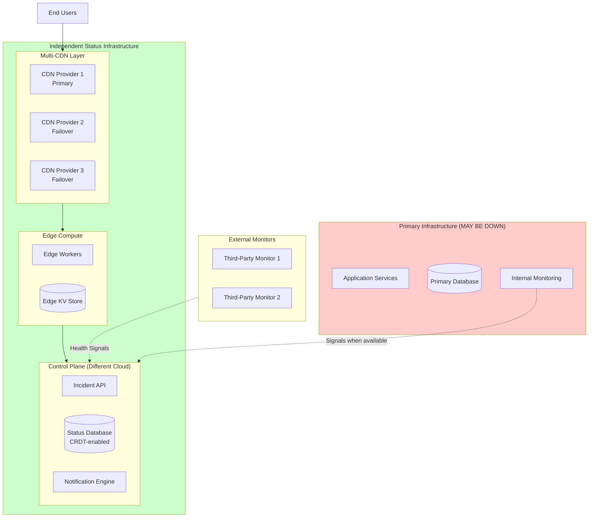

# Highly Resilient Status Page System - System Design

[Back to System Design Index](../README.md)

---

## System Overview

A **Highly Resilient Status Page System** is a specialized platform for communicating service health, incidents, and maintenance windows to end users and stakeholders. The defining architectural challenge is **independence architecture** - the status page must remain operational when the entire primary infrastructure it monitors is completely down. This constraint drives every design decision: the status page cannot share cloud providers, CDNs, DNS, or any infrastructure with the services being monitored.

Modern status page systems like Statuspage.io, Instatus, and Better Uptime achieve this through multi-CDN deployment, edge-first rendering, CRDT-based multi-region data synchronization, and queue-based notification delivery. The system must handle extreme traffic spikes (100x-1000x normal) during major incidents while maintaining sub-200ms global latency for status page loads.

Unlike simple HTML pages, production status pages require real-time updates via Server-Sent Events, multi-channel subscriber notifications (email, SMS, webhooks, Slack), component-level status tracking, historical uptime metrics, and embeddable widgets for third-party sites - all while maintaining higher availability than the services they report on.

---

## Key Characteristics

| Characteristic | Value | Implication |
|----------------|-------|-------------|
| **Traffic Pattern** | Read-heavy (1000:1), extreme spikes during incidents | Edge-cached static pages, CDN absorbs spikes |
| **Consistency Model** | Eventual (< 30s propagation) | CRDTs for incident data, accept stale reads |
| **Availability Target** | 99.99% (higher than monitored services) | Multi-CDN, multi-cloud, static fallback |
| **Latency Target** | p50 < 50ms, p99 < 200ms TTFB globally | Edge-served, pre-rendered HTML |
| **Independence Requirement** | Critical - cannot share infrastructure | Different cloud provider, different CDN |
| **Real-time Updates** | Sub-5 second for connected clients | SSE with polling fallback |
| **Notification Delivery** | Email < 2min, SMS < 1min (p95) | Queue-based async, multi-provider |

---

## Complexity Rating

| Aspect | Rating | Reason |
|--------|--------|--------|
| **Overall** | High | Independence architecture, multi-provider resilience |
| **Independence Architecture** | Very High | Multi-cloud, multi-CDN orchestration |
| **CRDT Synchronization** | High | Conflict-free multi-region writes |
| **Notification Pipeline** | High | Multi-channel delivery guarantees, retries |
| **Real-time Updates** | Medium | SSE/WebSocket with graceful fallback |
| **Edge Rendering** | Medium | Static + dynamic tiers, cache invalidation |

---

## Quick Navigation

| Document | Description |
|----------|-------------|
| [01 - Requirements & Estimations](./01-requirements-and-estimations.md) | Functional/Non-functional requirements, capacity planning, SLOs |
| [02 - High-Level Design](./02-high-level-design.md) | Architecture, independence layers, data flow, key decisions |
| [03 - Low-Level Design](./03-low-level-design.md) | Data model, API design, CRDT algorithms, SSE protocol |
| [04 - Deep Dive & Bottlenecks](./04-deep-dive-and-bottlenecks.md) | Multi-CDN failover, CRDT sync, notification pipeline |
| [05 - Scalability & Reliability](./05-scalability-and-reliability.md) | Multi-region active-active, DR, chaos engineering |
| [06 - Security & Compliance](./06-security-and-compliance.md) | Auth, data security, threat model, GDPR |
| [07 - Observability](./07-observability.md) | Metrics, logging, tracing, alerting |
| [08 - Interview Guide](./08-interview-guide.md) | 45-min pacing, trap questions, trade-offs |

---

## Core Components

| Component | Responsibility | Criticality |
|-----------|----------------|-------------|
| **Multi-CDN Layer** | Edge delivery with automatic failover | Critical |
| **Edge Compute** | Render pages from Edge KV when origin unavailable | Critical |
| **Incident Management Hub** | CRUD operations for incidents, status transitions | Critical |
| **Component Registry** | Track service components and their status | High |
| **Subscriber Notification Engine** | Multi-channel delivery (email, SMS, webhook, Slack) | High |
| **Real-time Update Service** | SSE/WebSocket for live status changes | Medium |
| **External Health Monitors** | Independent monitoring probes from outside network | High |
| **Embedded Widget Service** | Shadow DOM widgets for third-party sites | Medium |
| **Uptime Metrics Engine** | Calculate and display historical availability | Medium |

---

## Independence Architecture Overview



**Key Independence Layers:**

| Layer | Requirement | Implementation |
|-------|-------------|----------------|
| **Network** | Different DNS providers | Dedicated DNS, Anycast routing |
| **Delivery** | Different CDN | Multi-CDN with health-based failover |
| **Compute** | Different cloud provider | Status backend on separate cloud |
| **Data** | Separate database infrastructure | CRDT-enabled multi-region database |
| **Monitoring** | External health checks | Third-party monitoring services |

---

## Status Levels

### Component Status

| Status | Display | Meaning |
|--------|---------|---------|
| `operational` | Operational | Service functioning normally |
| `degraded_performance` | Degraded Performance | Slower than normal but functional |
| `partial_outage` | Partial Outage | Some functionality unavailable |
| `major_outage` | Major Outage | Service completely unavailable |
| `under_maintenance` | Under Maintenance | Planned maintenance in progress |

### Incident Status

| Status | Display | Meaning |
|--------|---------|---------|
| `investigating` | Investigating | Issue detected, root cause unknown |
| `identified` | Identified | Root cause found, working on fix |
| `monitoring` | Monitoring | Fix deployed, monitoring stability |
| `resolved` | Resolved | Issue fully resolved |

### Incident Impact

| Impact | Display | Meaning |
|--------|---------|---------|
| `none` | None | Informational update only |
| `minor` | Minor | Minimal user impact |
| `major` | Major | Significant functionality affected |
| `critical` | Critical | Complete service unavailable |

---

## When to Use This Design

**Use Status Page System When:**
- Need to communicate service health externally
- Multiple services/components require status tracking
- Subscribers need proactive incident notifications
- Historical uptime data is required for SLAs
- Higher availability than monitored services is critical

**Do NOT Use When:**
- Internal-only monitoring dashboard (use Grafana/Datadog)
- Simple health check endpoint needed
- No external stakeholder communication required
- Budget cannot support multi-cloud infrastructure

---

## Real-World Implementations

| System | Architecture | Key Innovation |
|--------|--------------|----------------|
| **Statuspage.io (Atlassian)** | Multi-CDN, multi-region | Industry standard, 150+ integrations |
| **Instatus** | Edge-first, Cloudflare Workers | Ultra-fast, minimal infrastructure |
| **Better Uptime** | Active-active multi-region | Integrated monitoring + status |
| **Status.io** | Multi-provider redundancy | Enterprise-focused, custom domains |
| **Cachet** | Self-hosted open source | Full control, community-maintained |

---

## Architecture Trade-offs at a Glance

```
Single CDN ←――――――――――――――――――→ Multi-CDN
      ↑                              ↑
    Simpler                    Survives CDN failure
    Lower cost                 Higher complexity
    CDN-dependent              True independence
   (Not acceptable)           (Required for status pages)

Strong Consistency ←―――――――――→ CRDTs (Eventual)
      ↑                              ↑
    Always fresh               Multi-region writes
    Coordination required      No coordination
    Lower availability         Higher availability
   (Risky during partitions)  (Correct for status pages)

Origin-First ←――――――――――――――――→ Edge-First
      ↑                              ↑
    Always fresh               Cached/eventual
    Origin-dependent           Survives origin failure
    Higher latency             Lowest latency
   (Single point of failure)  (Required for resilience)

Polling ←――――――――――――――――――――→ Server-Sent Events
      ↑                              ↑
    Simple                     Real-time updates
    Works everywhere           Connection overhead
    Higher latency             Requires fallback
   (Acceptable fallback)      (Primary mechanism)
```

---

## Graceful Degradation Levels

```
Level 0: Full Operation
├── Real-time SSE updates
├── Full incident management API
├── All notification channels active
└── Dynamic content from origin

Level 1: Origin Degraded
├── Edge-cached pages serving (< 30s stale)
├── SSE fallback to polling
├── Notifications may be delayed
└── Read-only mode for status page

Level 2: Compute Degraded
├── Static HTML from CDN cache
├── No real-time updates
├── Webhook notifications only
└── Pre-rendered status snapshot

Level 3: Emergency Mode
├── Pre-generated static "investigating" page
├── DNS TXT record for status updates
├── Social media channel (Twitter/X)
└── Manual update via separate tooling
```

---

## Quick Reference Card

```
┌─────────────────────────────────────────────────────────────────┐
│           STATUS PAGE SYSTEM - QUICK REFERENCE                  │
├─────────────────────────────────────────────────────────────────┤
│                                                                 │
│  SCALE TARGETS               KEY PATTERNS                       │
│  ─────────────               ────────────                       │
│  • 99.99% availability       • Independence architecture        │
│  • < 200ms TTFB globally     • Multi-CDN with failover         │
│  • 1M+ concurrent viewers    • Edge-first rendering            │
│  • 1M+ subscribers/page      • CRDTs for incident sync         │
│  • < 30s update propagation  • SSE with polling fallback       │
│                                                                 │
├─────────────────────────────────────────────────────────────────┤
│                                                                 │
│  CORE ENTITIES               NOTIFICATION CHANNELS              │
│  ─────────────               ────────────────────               │
│  • StatusPage (tenant)       • Email (double opt-in)           │
│  • Component (service)       • SMS (via Twilio/similar)        │
│  • Incident (outage)         • Webhooks (retry w/ backoff)     │
│  • IncidentUpdate (timeline) • Slack/Teams integration         │
│  • Subscriber (notification) • RSS/Atom feeds                  │
│  • MaintenanceWindow         • Embedded status widgets         │
│                                                                 │
├─────────────────────────────────────────────────────────────────┤
│                                                                 │
│  FAILURE MODES → MITIGATION                                     │
│  ──────────────────────────                                     │
│  • CDN failure → Failover to backup CDN (< 30s)                │
│  • Origin failure → Serve from edge cache                      │
│  • Region failure → CRDT sync to other regions                 │
│  • Total failure → Static HTML fallback                        │
│                                                                 │
├─────────────────────────────────────────────────────────────────┤
│                                                                 │
│  INTERVIEW KEYWORDS                                             │
│  ─────────────────                                              │
│  Independence architecture, Correlated failure, Multi-CDN,      │
│  CRDTs, Eventual consistency, Edge-first, Graceful degradation, │
│  SSE, Deduplication, At-least-once delivery, Vector clocks     │
│                                                                 │
└─────────────────────────────────────────────────────────────────┘
```

---

## Interview Readiness Checklist

| Topic | Must Know | Deep Dive |
|-------|-----------|-----------|
| Independence Architecture | Why status pages cannot share infrastructure | Multi-CDN failover mechanisms |
| Data Model | Component, Incident, Subscriber entities | CRDT algorithms (OR-Set, LWW-Register) |
| Notifications | Multi-channel delivery | Deduplication, retry strategies, guarantees |
| Real-time | SSE vs WebSocket vs Polling | Connection management, fallback |
| Scaling | How to handle incident traffic spikes | Edge caching, request coalescing |
| Failure Modes | What happens when origin fails | Graceful degradation levels |
| Security | API key auth, subscriber PII | GDPR compliance, webhook security |

---

## Related Systems

- [Multi-Region Active-Active Architecture](../2.9-multi-region-active-active/00-index.md) - CRDT patterns, conflict resolution
- [Content Delivery Network (CDN)](../1.15-content-delivery-network-cdn/00-index.md) - Edge caching, cache invalidation
- [Distributed Message Queue](../1.6-distributed-message-queue/00-index.md) - Notification delivery patterns
- [Feature Flag Management](../2.7-feature-flag-management/00-index.md) - Similar multi-tenant SaaS patterns

---

## References

- Atlassian Statuspage Architecture - Multi-CDN, multi-region deployment
- Instatus Blog - Edge-first incident management strategies
- Cloudflare Workers - Edge compute patterns for status pages
- Status.io - Multi-provider redundancy approach
- incident.io - Modern incident management with AI features
- Datadog Incident Management - Notification workflow automation
- PagerDuty - Event-driven incident orchestration
