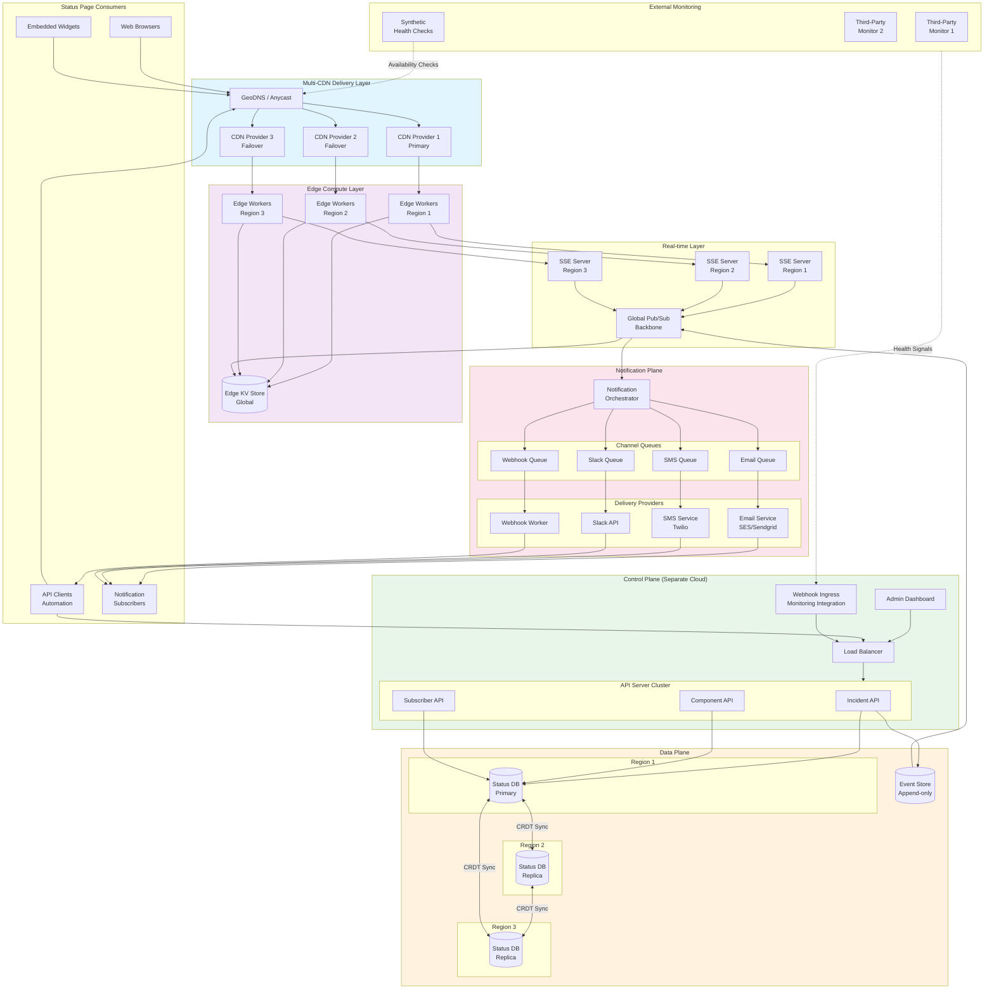
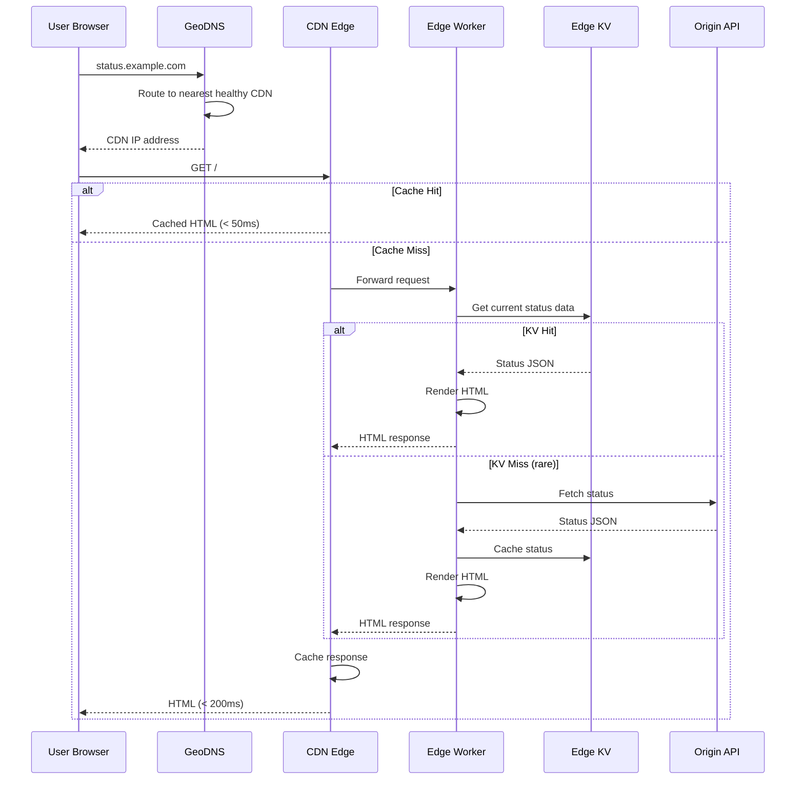
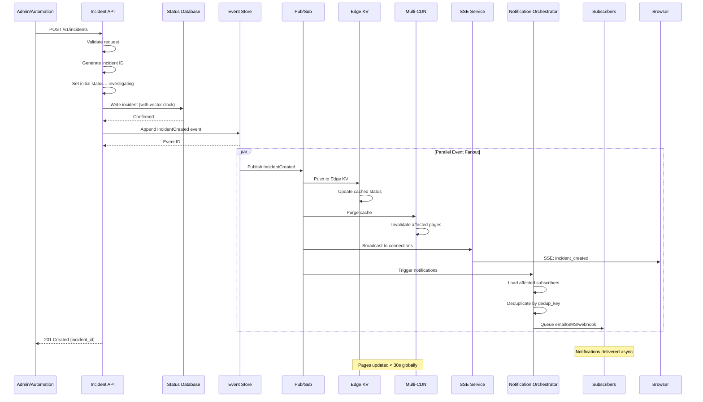
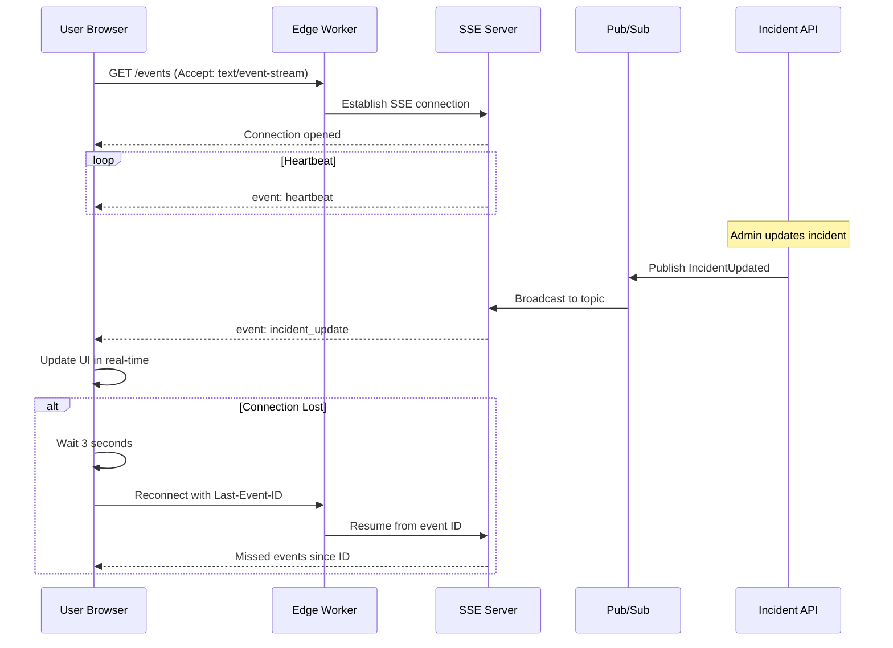
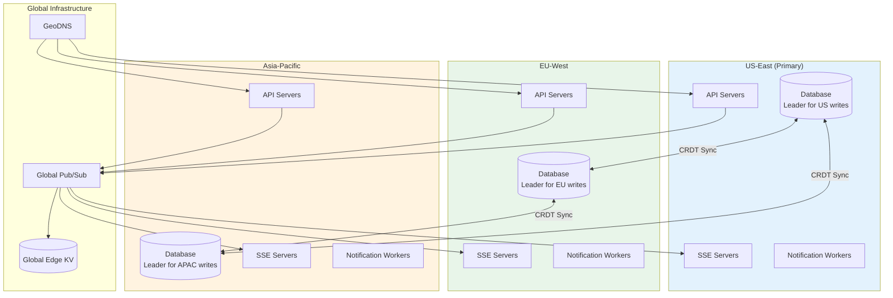

# High-Level Design

[Back to Index](./00-index.md)

---

## System Architecture Overview

The status page system is architected around the principle of **independence** - it must remain operational when the services it monitors are completely unavailable. This drives a multi-layered architecture with redundancy at every level.

### Architecture Layers

| Layer | Responsibility | Independence Mechanism |
|-------|---------------|----------------------|
| **Delivery Layer** | Serve status pages to end users | Multi-CDN with automatic failover |
| **Edge Layer** | Dynamic rendering, real-time connections | Edge compute with local KV storage |
| **Control Plane** | Incident management, configuration | Separate cloud provider from monitored services |
| **Data Plane** | Status storage, CRDT synchronization | Multi-region with conflict-free replication |
| **Notification Plane** | Subscriber alerts | Queue-based async with multi-provider |
| **Monitoring Layer** | External health checks | Third-party monitoring services |

---

## Complete System Architecture



---

## Core Data Flows

### Flow 1: Status Page View (Read Path)



### Flow 2: Incident Creation (Write Path)



### Flow 3: Real-time Update via SSE



---

## Component Overview

### Control Plane Components

| Component | Responsibility | Scale | Technology Choice |
|-----------|---------------|-------|-------------------|
| **Incident API** | CRUD for incidents and updates | 1K RPS | Stateless API servers |
| **Component API** | Manage service components | 500 RPS | Stateless API servers |
| **Subscriber API** | Subscription management | 500 RPS | Stateless API servers |
| **Admin Dashboard** | Web UI for operators | N/A | Single-page application |
| **Webhook Ingress** | Receive monitoring alerts | 10K RPS | Event-driven workers |

### Data Plane Components

| Component | Responsibility | Consistency | Technology Choice |
|-----------|---------------|-------------|-------------------|
| **Status Database** | Primary storage for incidents/components | CRDT-enabled eventual | Distributed document store |
| **Event Store** | Append-only event log | Strong (single leader) | Log-based message store |
| **Edge KV** | Cached current status per page | Eventual (< 1s) | Edge key-value store |

### Notification Plane Components

| Component | Responsibility | Throughput | Technology Choice |
|-----------|---------------|------------|-------------------|
| **Notification Orchestrator** | Route events to channels | 100K/s | Stream processor |
| **Email Queue** | Email delivery buffer | 50K/s | Message queue |
| **SMS Queue** | SMS delivery buffer | 10K/s | Priority queue |
| **Webhook Queue** | Webhook delivery with retry | 20K/s | Persistent queue |
| **Channel Workers** | Actual delivery to providers | Per-provider limits | Worker pools |

---

## Key Architectural Decisions

### Decision 1: Multi-CDN Strategy

| Option | Pros | Cons | Verdict |
|--------|------|------|---------|
| **Single CDN** | Simple, lower cost | CDN outage = status page down | Not acceptable |
| **Multi-CDN (DNS failover)** | Survives CDN failure, ~30s failover | DNS TTL delay, higher cost | **Recommended** |
| **Multi-CDN (Anycast)** | Instant failover, BGP routing | Complex, requires ASN | Enterprise option |

**Recommendation**: Multi-CDN with DNS-based health checks. Configure at least 2 CDN providers with health monitoring at the DNS layer. Accept 30-second failover time as acceptable trade-off for operational simplicity.

### Decision 2: Edge vs Origin Rendering

| Option | Pros | Cons | Verdict |
|--------|------|------|---------|
| **Origin-first** | Always fresh data | Origin failure = page unavailable | Not acceptable |
| **Edge-first** | Survives origin failure, lowest latency | Eventually consistent | **Recommended** |
| **Hybrid (tiered)** | Best of both | Complexity | For advanced features |

**Recommendation**: Edge-first with tiered degradation:
- Tier 1: Edge render from Edge KV (primary)
- Tier 2: Serve stale cached page
- Tier 3: Static fallback HTML

### Decision 3: Consistency Model for Incidents

| Option | Pros | Cons | Verdict |
|--------|------|------|---------|
| **Strong consistency** | Always correct | Requires coordination, lower availability | Not suitable |
| **Eventual (CRDT)** | Multi-region writes, high availability | Temporary inconsistency | **Recommended** |
| **Causal consistency** | Preserves order | Complex implementation | Overkill |

**Recommendation**: CRDTs for incident data. Users accept seeing updates within 30 seconds. The benefit of multi-region writes without coordination outweighs brief inconsistency.

### Decision 4: Real-time Update Protocol

| Option | Pros | Cons | Verdict |
|--------|------|------|---------|
| **Polling** | Simple, works everywhere | Latency, server load | Fallback only |
| **Long Polling** | Lower latency than polling | Connection overhead | Not recommended |
| **SSE** | Simple, one-way, efficient | One-way only | **Recommended** |
| **WebSocket** | Bidirectional, lowest latency | Complexity, overkill | Fallback |

**Recommendation**: Server-Sent Events (SSE) as primary. Simple, supported everywhere, perfect for one-way status updates. Fall back to polling for environments that don't support SSE.

### Decision 5: Notification Delivery Guarantees

| Option | Pros | Cons | Verdict |
|--------|------|------|---------|
| **Best effort** | Simple | Lost notifications | Not acceptable |
| **At-most-once** | No duplicates | Lost notifications | Not acceptable |
| **At-least-once** | Guaranteed delivery | Potential duplicates | **Recommended** |
| **Exactly-once** | Perfect | Very complex, expensive | Overkill |

**Recommendation**: At-least-once delivery with client-side deduplication. Include idempotency keys in webhooks, dedup_key in events, and message IDs for subscriber-side filtering.

---

## Architecture Pattern Checklist

| Pattern | Decision | Rationale |
|---------|----------|-----------|
| Sync vs Async communication | **Async** for notifications, **Sync** for API | Notifications are fire-and-forget, API needs immediate response |
| Event-driven vs Request-response | **Event-driven** for propagation | Status changes are events that fan out |
| Push vs Pull | **Push** (SSE) with **Pull** fallback | Real-time updates, graceful degradation |
| Stateless vs Stateful services | **Stateless** API, **Stateful** SSE | SSE maintains connections, everything else scales horizontally |
| Read-heavy vs Write-heavy | **Read-heavy** (1000:1) | Optimize read path (edge caching), tolerate slower writes |
| Real-time vs Batch | **Real-time** with **Batch** for analytics | Status updates immediate, uptime calculations batched |
| Edge vs Origin | **Edge-first** | Critical for independence and latency |

---

## Independence Architecture Deep Dive

```
┌─────────────────────────────────────────────────────────────────────────────┐
│                     INDEPENDENCE ARCHITECTURE LAYERS                        │
├─────────────────────────────────────────────────────────────────────────────┤
│                                                                             │
│  LAYER 1: DNS INDEPENDENCE                                                  │
│  ┌───────────────────────────────────────────────────────────────────────┐ │
│  │  • Use separate DNS provider from monitored services                  │ │
│  │  • Multiple nameservers across providers (Route53 + Cloudflare)       │ │
│  │  • Anycast DNS for geographic redundancy                              │ │
│  │  • Health-checked DNS records with automatic failover                 │ │
│  └───────────────────────────────────────────────────────────────────────┘ │
│                                                                             │
│  LAYER 2: NETWORK INDEPENDENCE                                              │
│  ┌───────────────────────────────────────────────────────────────────────┐ │
│  │  • Multi-CDN with different backbone networks                         │ │
│  │  • CDN providers: Cloudflare + Fastly + CloudFront                   │ │
│  │  • Anycast IP routing (300+ global PoPs)                             │ │
│  │  • Independent peering relationships                                  │ │
│  └───────────────────────────────────────────────────────────────────────┘ │
│                                                                             │
│  LAYER 3: COMPUTE INDEPENDENCE                                              │
│  ┌───────────────────────────────────────────────────────────────────────┐ │
│  │  • Status backend on DIFFERENT cloud provider                        │ │
│  │  • If primary app on AWS → Status on GCP or Azure                    │ │
│  │  • Edge compute for rendering (Cloudflare Workers / Lambda@Edge)     │ │
│  │  • Can serve pages even when origin is unreachable                   │ │
│  └───────────────────────────────────────────────────────────────────────┘ │
│                                                                             │
│  LAYER 4: DATA INDEPENDENCE                                                 │
│  ┌───────────────────────────────────────────────────────────────────────┐ │
│  │  • Separate database cluster from monitored services                 │ │
│  │  • CRDT replication across independent regions                       │ │
│  │  • Edge KV stores current state at edge (survives origin failure)    │ │
│  │  • Event store on separate infrastructure                            │ │
│  └───────────────────────────────────────────────────────────────────────┘ │
│                                                                             │
│  LAYER 5: MONITORING INDEPENDENCE                                           │
│  ┌───────────────────────────────────────────────────────────────────────┐ │
│  │  • External synthetic monitors (third-party services)                │ │
│  │  • Health checks from OUTSIDE the network                            │ │
│  │  • Multiple independent signal sources                               │ │
│  │  • Can detect issues internal monitoring misses                      │ │
│  └───────────────────────────────────────────────────────────────────────┘ │
│                                                                             │
└─────────────────────────────────────────────────────────────────────────────┘
```

### Independence Verification Checklist

| Question | Required Answer |
|----------|-----------------|
| Is status page DNS on same provider as app DNS? | **NO** |
| Is status page CDN same as app CDN? | **NO** |
| Is status backend on same cloud as app? | **NO** |
| Does status page share any databases with app? | **NO** |
| Can status page serve when app cloud is down? | **YES** |
| Are there external monitors checking status page? | **YES** |

---

## Failure Modes and Mitigations

| Failure Mode | Detection | Mitigation | Recovery Time |
|--------------|-----------|------------|---------------|
| **Single CDN failure** | Health check fails | DNS failover to backup CDN | < 30 seconds |
| **All CDN failure** | Multiple health checks fail | Direct origin access (degraded) | Manual intervention |
| **Origin region failure** | Region health check | Route to healthy region (CRDT sync) | < 10 seconds |
| **All origin regions** | Global health check | Serve from Edge KV cache | Indefinite (read-only) |
| **Database failure** | Query timeouts | Failover to replica | < 30 seconds |
| **Pub/Sub failure** | Delivery timeout | Retry with backoff, queue locally | < 5 minutes |
| **Notification provider failure** | Delivery failures | Failover to backup provider | < 1 minute |
| **SSE server failure** | Connection drops | Client reconnect to different server | < 5 seconds |

---

## Multi-Region Deployment



### Regional Routing Strategy

| User Location | Primary Region | Failover Region |
|---------------|----------------|-----------------|
| Americas | US-East | EU-West |
| Europe/Africa | EU-West | US-East |
| Asia/Oceania | Asia-Pacific | US-East |

---

## Technology Stack (Reference)

| Layer | Technology Options | Selection Criteria |
|-------|-------------------|-------------------|
| **CDN** | Cloudflare, Fastly, CloudFront | Global presence, edge compute support |
| **Edge Compute** | Cloudflare Workers, Lambda@Edge | Cold start time, KV store support |
| **API Framework** | Any stateless framework | Performance, team expertise |
| **Database** | CockroachDB, YugabyteDB, custom CRDT | Multi-region, CRDT support |
| **Event Store** | Kafka, Pulsar | Durability, multi-region replication |
| **Pub/Sub** | Cloud Pub/Sub, SNS/SQS | Global fanout, durability |
| **Message Queue** | RabbitMQ, SQS | Reliability, retry support |
| **Email** | SES, Sendgrid, Mailgun | Deliverability, scale |
| **SMS** | Twilio, SNS | Coverage, reliability |

---

## Next Steps

- [Low-Level Design](./03-low-level-design.md) - Data model, API specifications, algorithms
