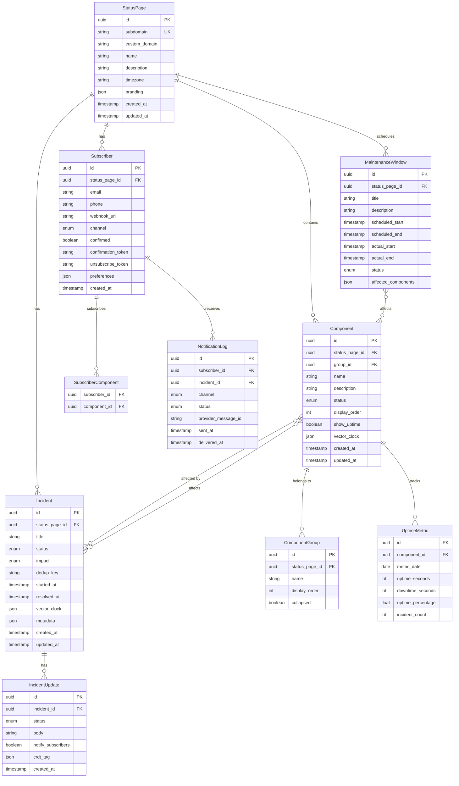

# Low-Level Design

[Back to Index](./00-index.md)

---

## Data Model

### Entity Relationship Diagram



---

## Core Entity Schemas

### StatusPage

```
┌─────────────────────────────────────────────────────────────────┐
│                       StatusPage Entity                          │
├─────────────────────────────────────────────────────────────────┤
│  id                 : UUID           (Primary Key)              │
│  subdomain          : string         (Unique, e.g., "acme")     │
│  custom_domain      : string         (Nullable, CNAME target)   │
│  name               : string         (Display name)             │
│  description        : string         (Page description)         │
│  timezone           : string         (e.g., "America/New_York") │
│  branding           : JSON           (Logo, colors, CSS)        │
│  notification_email : string         (Sender email address)     │
│  allow_subscriptions: boolean        (Enable/disable subs)      │
│  created_at         : timestamp                                  │
│  updated_at         : timestamp                                  │
├─────────────────────────────────────────────────────────────────┤
│  Indexes:                                                        │
│  - PRIMARY KEY (id)                                              │
│  - UNIQUE (subdomain)                                            │
│  - UNIQUE (custom_domain) WHERE custom_domain IS NOT NULL       │
└─────────────────────────────────────────────────────────────────┘
```

### Component

```
┌─────────────────────────────────────────────────────────────────┐
│                       Component Entity                           │
├─────────────────────────────────────────────────────────────────┤
│  id                 : UUID           (Primary Key)              │
│  status_page_id     : UUID           (Foreign Key → StatusPage) │
│  group_id           : UUID           (Nullable, → ComponentGroup)│
│  name               : string         (e.g., "API", "Website")   │
│  description        : string         (Optional description)     │
│  status             : enum           (operational, degraded,    │
│                                       partial_outage,           │
│                                       major_outage)             │
│  display_order      : int            (Sort order on page)       │
│  show_uptime        : boolean        (Display uptime graph)     │
│  start_date         : date           (When tracking started)    │
│  vector_clock       : JSON           (CRDT version vector)      │
│  created_at         : timestamp                                  │
│  updated_at         : timestamp                                  │
├─────────────────────────────────────────────────────────────────┤
│  Indexes:                                                        │
│  - PRIMARY KEY (id)                                              │
│  - INDEX (status_page_id)                                        │
│  - INDEX (status_page_id, display_order)                        │
├─────────────────────────────────────────────────────────────────┤
│  Vector Clock Example:                                           │
│  {"us-east": 5, "eu-west": 3, "apac": 4}                        │
└─────────────────────────────────────────────────────────────────┘
```

### Incident

```
┌─────────────────────────────────────────────────────────────────┐
│                        Incident Entity                           │
├─────────────────────────────────────────────────────────────────┤
│  id                 : UUID           (Primary Key)              │
│  status_page_id     : UUID           (Foreign Key → StatusPage) │
│  title              : string         (Incident title)           │
│  status             : enum           (investigating, identified,│
│                                       monitoring, resolved)     │
│  impact             : enum           (none, minor, major,       │
│                                       critical)                 │
│  dedup_key          : string         (For alert consolidation)  │
│  affected_components: UUID[]         (Array of component IDs)   │
│  started_at         : timestamp      (When incident started)    │
│  resolved_at        : timestamp      (Nullable, when resolved)  │
│  scheduled          : boolean        (Is this maintenance?)     │
│  vector_clock       : JSON           (CRDT version vector)      │
│  metadata           : JSON           (Custom fields)            │
│  created_at         : timestamp                                  │
│  updated_at         : timestamp                                  │
├─────────────────────────────────────────────────────────────────┤
│  Indexes:                                                        │
│  - PRIMARY KEY (id)                                              │
│  - INDEX (status_page_id, status) WHERE status != 'resolved'   │
│  - INDEX (status_page_id, started_at DESC)                      │
│  - UNIQUE (status_page_id, dedup_key) WHERE dedup_key NOT NULL │
└─────────────────────────────────────────────────────────────────┘
```

### IncidentUpdate

```
┌─────────────────────────────────────────────────────────────────┐
│                     IncidentUpdate Entity                        │
├─────────────────────────────────────────────────────────────────┤
│  id                 : UUID           (Primary Key)              │
│  incident_id        : UUID           (Foreign Key → Incident)   │
│  status             : enum           (Status at time of update) │
│  body               : text           (Update message)           │
│  notify_subscribers : boolean        (Send notifications?)      │
│  created_by         : UUID           (User or API key ID)       │
│  crdt_tag           : JSON           (OR-Set add tag)           │
│  created_at         : timestamp                                  │
├─────────────────────────────────────────────────────────────────┤
│  Indexes:                                                        │
│  - PRIMARY KEY (id)                                              │
│  - INDEX (incident_id, created_at DESC)                         │
├─────────────────────────────────────────────────────────────────┤
│  CRDT Tag Example:                                               │
│  {"region": "us-east", "timestamp": 1705432800123, "seq": 42}  │
└─────────────────────────────────────────────────────────────────┘
```

### Subscriber

```
┌─────────────────────────────────────────────────────────────────┐
│                       Subscriber Entity                          │
├─────────────────────────────────────────────────────────────────┤
│  id                 : UUID           (Primary Key)              │
│  status_page_id     : UUID           (Foreign Key → StatusPage) │
│  email              : string         (Nullable)                 │
│  phone              : string         (Nullable, E.164 format)   │
│  webhook_url        : string         (Nullable)                 │
│  slack_webhook      : string         (Nullable)                 │
│  channel            : enum           (email, sms, webhook,      │
│                                       slack)                    │
│  confirmed          : boolean        (Double opt-in completed)  │
│  confirmation_token : string         (For email confirmation)   │
│  unsubscribe_token  : string         (For one-click unsub)      │
│  subscribed_components: UUID[]       (Null = all components)    │
│  notification_types : enum[]         (incident, maintenance,    │
│                                       all)                      │
│  created_at         : timestamp                                  │
│  confirmed_at       : timestamp      (Nullable)                 │
├─────────────────────────────────────────────────────────────────┤
│  Indexes:                                                        │
│  - PRIMARY KEY (id)                                              │
│  - UNIQUE (status_page_id, email) WHERE email IS NOT NULL       │
│  - UNIQUE (status_page_id, phone) WHERE phone IS NOT NULL       │
│  - INDEX (status_page_id, confirmed) WHERE confirmed = true    │
│  - INDEX (unsubscribe_token)                                    │
└─────────────────────────────────────────────────────────────────┘
```

---

## API Design

### API Overview

| Category | Base Path | Authentication |
|----------|-----------|----------------|
| Public Status | `/v1/pages/{page_id}` | None (rate limited) |
| Admin API | `/v1/` | API Key (Bearer token) |
| Subscriber API | `/v1/subscribers` | Token-based |
| Webhook Ingress | `/v1/webhooks` | HMAC signature |
| Real-time | `/v1/events` | None (SSE endpoint) |

### Public Endpoints

#### Get Status Page Summary

```
GET /v1/pages/{page_id}/summary

Response 200:
{
  "page": {
    "id": "page_abc123",
    "name": "Acme Status",
    "url": "https://status.acme.com",
    "updated_at": "2025-01-22T10:30:00Z"
  },
  "status": {
    "indicator": "minor",
    "description": "Minor System Outage"
  },
  "components": [
    {
      "id": "cmp_api",
      "name": "API",
      "status": "operational",
      "updated_at": "2025-01-22T10:00:00Z"
    },
    {
      "id": "cmp_web",
      "name": "Website",
      "status": "degraded_performance",
      "updated_at": "2025-01-22T10:25:00Z"
    }
  ],
  "incidents": [
    {
      "id": "inc_xyz789",
      "title": "Elevated error rates on Website",
      "status": "identified",
      "impact": "minor",
      "started_at": "2025-01-22T10:15:00Z",
      "updated_at": "2025-01-22T10:25:00Z"
    }
  ],
  "scheduled_maintenances": []
}
```

#### Get Active Incidents

```
GET /v1/pages/{page_id}/incidents?status=active

Response 200:
{
  "incidents": [
    {
      "id": "inc_xyz789",
      "title": "Elevated error rates on Website",
      "status": "identified",
      "impact": "minor",
      "affected_components": ["cmp_web"],
      "started_at": "2025-01-22T10:15:00Z",
      "updates": [
        {
          "id": "upd_001",
          "status": "identified",
          "body": "We have identified the root cause as a database connection pool issue.",
          "created_at": "2025-01-22T10:25:00Z"
        },
        {
          "id": "upd_000",
          "status": "investigating",
          "body": "We are investigating elevated error rates on the website.",
          "created_at": "2025-01-22T10:15:00Z"
        }
      ]
    }
  ],
  "meta": {
    "total": 1,
    "page": 1,
    "per_page": 20
  }
}
```

### Admin Endpoints

#### Create Incident

```
POST /v1/incidents
Authorization: Bearer {api_key}
Content-Type: application/json
Idempotency-Key: {unique_key}

Request:
{
  "status_page_id": "page_abc123",
  "title": "API degradation",
  "status": "investigating",
  "impact": "minor",
  "affected_components": ["cmp_api"],
  "body": "We are investigating reports of slow API responses.",
  "notify_subscribers": true,
  "dedup_key": "alert-12345",
  "metadata": {
    "source": "datadog",
    "alert_id": "12345"
  }
}

Response 201:
{
  "incident": {
    "id": "inc_new123",
    "title": "API degradation",
    "status": "investigating",
    "impact": "minor",
    "affected_components": ["cmp_api"],
    "started_at": "2025-01-22T11:00:00Z",
    "created_at": "2025-01-22T11:00:00Z",
    "shortlink": "https://stspg.io/abc123"
  }
}

Response 409 (dedup_key exists):
{
  "error": {
    "code": "INCIDENT_EXISTS",
    "message": "Incident with dedup_key already exists",
    "existing_incident_id": "inc_existing456"
  }
}
```

#### Update Incident

```
PATCH /v1/incidents/{incident_id}
Authorization: Bearer {api_key}
Content-Type: application/json

Request:
{
  "status": "identified",
  "body": "Root cause identified. Deploying fix.",
  "notify_subscribers": true
}

Response 200:
{
  "incident": {
    "id": "inc_new123",
    "status": "identified",
    "updated_at": "2025-01-22T11:15:00Z"
  },
  "update": {
    "id": "upd_002",
    "status": "identified",
    "body": "Root cause identified. Deploying fix.",
    "created_at": "2025-01-22T11:15:00Z"
  }
}
```

#### Resolve Incident

```
POST /v1/incidents/{incident_id}/resolve
Authorization: Bearer {api_key}
Content-Type: application/json

Request:
{
  "body": "Fix deployed. All systems operational.",
  "notify_subscribers": true,
  "component_status": {
    "cmp_api": "operational"
  }
}

Response 200:
{
  "incident": {
    "id": "inc_new123",
    "status": "resolved",
    "resolved_at": "2025-01-22T11:30:00Z"
  }
}
```

#### Update Component Status

```
PATCH /v1/components/{component_id}
Authorization: Bearer {api_key}
Content-Type: application/json

Request:
{
  "status": "degraded_performance"
}

Response 200:
{
  "component": {
    "id": "cmp_api",
    "name": "API",
    "status": "degraded_performance",
    "updated_at": "2025-01-22T11:00:00Z"
  }
}
```

### Subscriber Endpoints

#### Subscribe

```
POST /v1/pages/{page_id}/subscribers
Content-Type: application/json

Request:
{
  "email": "user@example.com",
  "components": ["cmp_api", "cmp_web"],
  "notification_types": ["incident", "maintenance"]
}

Response 202:
{
  "message": "Confirmation email sent. Please check your inbox.",
  "subscriber_id": "sub_temp123"
}
```

#### Confirm Subscription

```
GET /v1/subscribers/confirm/{confirmation_token}

Response 200 (HTML):
Subscription confirmed! You will receive notifications for Acme Status.
```

#### Unsubscribe

```
GET /v1/subscribers/unsubscribe/{unsubscribe_token}

Response 200 (HTML):
You have been unsubscribed from Acme Status notifications.
```

### Webhook Ingress Endpoints

#### Generic Webhook

```
POST /v1/webhooks/generic
X-Webhook-Signature: sha256={hmac_signature}
Content-Type: application/json

Request:
{
  "api_key": "key_abc123",
  "event": "alert.triggered",
  "alert": {
    "title": "High CPU usage",
    "severity": "warning",
    "source": "monitoring-tool"
  },
  "dedup_key": "cpu-alert-server1"
}

Response 200:
{
  "received": true,
  "incident_id": "inc_created456"
}
```

#### Provider-Specific Webhooks

```
POST /v1/webhooks/datadog
POST /v1/webhooks/pagerduty
POST /v1/webhooks/prometheus
POST /v1/webhooks/grafana
```

---

## CRDT Data Structures

### Component Status: LWW-Register (Last-Writer-Wins)

```
STRUCTURE ComponentStatusLWW:
    component_id: UUID
    status: ComponentStatus
    hlc: HybridLogicalClock
    region_id: string

STRUCTURE HybridLogicalClock:
    physical_time: int64    // Wall clock milliseconds
    logical_counter: int32  // Tiebreaker within same millisecond
    node_id: string         // Unique node identifier

FUNCTION compare_hlc(a: HLC, b: HLC) -> int:
    IF a.physical_time != b.physical_time:
        RETURN a.physical_time - b.physical_time
    IF a.logical_counter != b.logical_counter:
        RETURN a.logical_counter - b.logical_counter
    RETURN compare_strings(a.node_id, b.node_id)

FUNCTION set_status(component: ComponentStatusLWW, new_status: Status, hlc: HLC):
    IF compare_hlc(hlc, component.hlc) > 0:
        component.status = new_status
        component.hlc = hlc
    // Otherwise ignore (stale update)

FUNCTION merge(local: ComponentStatusLWW, remote: ComponentStatusLWW):
    IF compare_hlc(remote.hlc, local.hlc) > 0:
        local.status = remote.status
        local.hlc = remote.hlc
```

**Example:**

```
Initial state: {status: "operational", hlc: {time: 100, counter: 0, node: "us-east"}}

Update from eu-west: {status: "degraded", hlc: {time: 105, counter: 0, node: "eu-west"}}
→ Applied (105 > 100)

Update from apac: {status: "partial_outage", hlc: {time: 102, counter: 0, node: "apac"}}
→ Ignored (102 < 105, stale)

Final state: {status: "degraded", hlc: {time: 105, counter: 0, node: "eu-west"}}
```

### Incident Updates: OR-Set (Observed-Remove Set)

```
STRUCTURE IncidentUpdateORSet:
    adds: Map<UpdateID, {update: IncidentUpdate, tag: UniqueTag}>
    removes: Set<UniqueTag>

STRUCTURE UniqueTag:
    region_id: string
    timestamp: int64
    sequence: int32

FUNCTION generate_tag(region: string) -> UniqueTag:
    RETURN {
        region_id: region,
        timestamp: current_time_millis(),
        sequence: increment_local_counter()
    }

FUNCTION add_update(set: IncidentUpdateORSet, update: IncidentUpdate, region: string):
    tag = generate_tag(region)
    set.adds[update.id] = {update: update, tag: tag}

FUNCTION remove_update(set: IncidentUpdateORSet, update_id: UpdateID):
    IF update_id IN set.adds:
        set.removes.add(set.adds[update_id].tag)

FUNCTION merge(local: IncidentUpdateORSet, remote: IncidentUpdateORSet):
    // Merge adds (union)
    FOR each (id, entry) IN remote.adds:
        IF id NOT IN local.adds OR entry.tag > local.adds[id].tag:
            local.adds[id] = entry

    // Merge removes (union)
    local.removes = local.removes UNION remote.removes

FUNCTION get_visible_updates(set: IncidentUpdateORSet) -> List<IncidentUpdate>:
    visible = []
    FOR each (id, entry) IN set.adds:
        IF entry.tag NOT IN set.removes:
            visible.append(entry.update)
    RETURN sort_by_timestamp(visible)
```

**Key Property:** An update that has been observed (added) can only be removed by someone who has seen that specific add. Concurrent adds of the same update from different regions both survive.

### Incident Vector Clock

```
STRUCTURE IncidentVectorClock:
    clocks: Map<RegionID, int64>

FUNCTION increment(vc: VectorClock, region: RegionID):
    vc.clocks[region] = vc.clocks.get(region, 0) + 1

FUNCTION merge(local: VectorClock, remote: VectorClock):
    FOR each region IN (local.clocks.keys UNION remote.clocks.keys):
        local.clocks[region] = MAX(
            local.clocks.get(region, 0),
            remote.clocks.get(region, 0)
        )

FUNCTION is_concurrent(a: VectorClock, b: VectorClock) -> boolean:
    a_less = false
    b_less = false

    FOR each region IN (a.clocks.keys UNION b.clocks.keys):
        a_val = a.clocks.get(region, 0)
        b_val = b.clocks.get(region, 0)

        IF a_val < b_val: a_less = true
        IF b_val < a_val: b_less = true

    RETURN a_less AND b_less  // Neither dominates the other
```

---

## Real-time Update Protocol (SSE)

### SSE Connection Establishment

```
GET /v1/pages/{page_id}/events
Accept: text/event-stream
Last-Event-ID: {optional_last_event_id}

Response:
HTTP/1.1 200 OK
Content-Type: text/event-stream
Cache-Control: no-cache
Connection: keep-alive
X-Accel-Buffering: no

:connected

event: connected
id: evt_000
data: {"page_id": "page_abc123", "server_time": "2025-01-22T11:00:00Z"}

event: heartbeat
id: evt_001
data: {"timestamp": "2025-01-22T11:00:30Z"}

event: incident_created
id: evt_002
data: {"incident_id": "inc_xyz", "title": "API issues", "status": "investigating", "impact": "minor"}

event: incident_updated
id: evt_003
data: {"incident_id": "inc_xyz", "status": "identified", "update_id": "upd_001"}

event: component_status_changed
id: evt_004
data: {"component_id": "cmp_api", "old_status": "operational", "new_status": "degraded_performance"}

event: incident_resolved
id: evt_005
data: {"incident_id": "inc_xyz", "resolved_at": "2025-01-22T11:30:00Z"}

event: heartbeat
id: evt_006
data: {"timestamp": "2025-01-22T11:01:00Z"}

...
```

### Event Types

| Event Type | Trigger | Data Fields |
|------------|---------|-------------|
| `connected` | Connection established | page_id, server_time |
| `heartbeat` | Every 30 seconds | timestamp |
| `incident_created` | New incident | incident_id, title, status, impact |
| `incident_updated` | Status/update change | incident_id, status, update_id, body |
| `incident_resolved` | Incident resolved | incident_id, resolved_at |
| `component_status_changed` | Component status change | component_id, old_status, new_status |
| `maintenance_started` | Maintenance begins | maintenance_id, title |
| `maintenance_ended` | Maintenance ends | maintenance_id |

### Client Reconnection Logic

```
FUNCTION establish_sse_connection(page_id, last_event_id):
    url = "/v1/pages/{page_id}/events"
    IF last_event_id:
        headers["Last-Event-ID"] = last_event_id

    event_source = new EventSource(url, headers)

    event_source.onmessage = (event) -> handle_event(event)

    event_source.onerror = (error) ->
        event_source.close()
        schedule_reconnect(page_id, last_event_id)

FUNCTION schedule_reconnect(page_id, last_event_id):
    delay = calculate_backoff(reconnect_attempt)
    delay = add_jitter(delay, 0.5)  // ±50% jitter

    WAIT delay

    establish_sse_connection(page_id, last_event_id)

FUNCTION calculate_backoff(attempt):
    base = 1000  // 1 second
    max_delay = 30000  // 30 seconds
    RETURN MIN(base * (2 ^ attempt), max_delay)
```

---

## Notification Deduplication Algorithm

```
STRUCTURE NotificationEvent:
    event_id: string
    incident_id: string
    dedup_key: string       // From incident or generated
    subscriber_id: string
    channel: enum
    created_at: timestamp

FUNCTION should_notify(event: NotificationEvent, cache: RedisClient) -> boolean:
    // Level 1: Event-level deduplication (same event to same subscriber)
    event_key = hash(event.event_id, event.subscriber_id)
    IF cache.exists(event_key):
        RETURN false

    // Level 2: Dedup key window (suppress rapid updates)
    IF event.dedup_key:
        dedup_window_key = hash(event.dedup_key, event.subscriber_id, event.channel)
        IF cache.exists(dedup_window_key):
            RETURN false
        cache.setex(dedup_window_key, DEDUP_WINDOW_SECONDS, "1")

    // Level 3: Rate limiting per subscriber per channel
    rate_key = "rate:{subscriber_id}:{channel}"
    current_count = cache.incr(rate_key)
    IF current_count == 1:
        cache.expire(rate_key, RATE_WINDOW_SECONDS)
    IF current_count > RATE_LIMIT:
        RETURN false

    // Mark event as processed
    cache.setex(event_key, EVENT_TTL_SECONDS, "1")

    RETURN true

CONSTANTS:
    DEDUP_WINDOW_SECONDS = 300      // 5 minutes
    RATE_WINDOW_SECONDS = 3600      // 1 hour
    RATE_LIMIT = 10                 // Max 10 per hour per channel
    EVENT_TTL_SECONDS = 86400       // 24 hours
```

---

## Webhook Delivery with Retry

```
STRUCTURE WebhookDelivery:
    id: string
    subscriber_id: string
    webhook_url: string
    payload: JSON
    attempt: int
    max_attempts: int
    next_retry_at: timestamp
    status: enum  // pending, delivered, failed

FUNCTION deliver_webhook(delivery: WebhookDelivery):
    signature = compute_hmac_signature(delivery.payload, subscriber.secret)

    TRY:
        response = http_post(
            url = delivery.webhook_url,
            headers = {
                "Content-Type": "application/json",
                "X-Statuspage-Signature": signature,
                "X-Statuspage-Delivery-ID": delivery.id,
                "X-Statuspage-Timestamp": current_timestamp()
            },
            body = delivery.payload,
            timeout = 10_seconds
        )

        IF response.status_code >= 200 AND response.status_code < 300:
            mark_delivered(delivery)
        ELSE:
            schedule_retry(delivery)

    CATCH timeout_error, connection_error:
        schedule_retry(delivery)

FUNCTION schedule_retry(delivery: WebhookDelivery):
    delivery.attempt += 1

    IF delivery.attempt >= delivery.max_attempts:
        mark_failed(delivery)
        notify_subscriber_of_webhook_failure(delivery)
        RETURN

    delay = calculate_retry_delay(delivery.attempt)
    delivery.next_retry_at = current_time() + delay
    enqueue_for_retry(delivery)

FUNCTION calculate_retry_delay(attempt: int) -> duration:
    // Exponential backoff with jitter
    base_delay = 30_seconds
    max_delay = 1_hour

    delay = MIN(base_delay * (2 ^ (attempt - 1)), max_delay)
    jitter = random_float(0.5, 1.5)

    RETURN delay * jitter

// Retry schedule example:
// Attempt 1: Immediate
// Attempt 2: ~30 seconds
// Attempt 3: ~1 minute
// Attempt 4: ~2 minutes
// Attempt 5: ~4 minutes
// Attempt 6: ~8 minutes
// Attempt 7: ~16 minutes
// Attempt 8: ~32 minutes
// Total: ~8 retries over ~1 hour
MAX_ATTEMPTS = 8
```

---

## Embedded Widget Architecture

```
┌─────────────────────────────────────────────────────────────────┐
│                    WIDGET EMBEDDING FLOW                         │
├─────────────────────────────────────────────────────────────────┤
│                                                                  │
│  1. Third-party site includes script:                           │
│     <script src="https://status.acme.com/widget.js"></script>   │
│     <div id="status-widget" data-page="page_abc123"></div>      │
│                                                                  │
│  2. Widget script loads:                                         │
│     ┌─────────────────────────────────────────────────────────┐ │
│     │  widget.js (~5KB gzipped)                               │ │
│     │  - Finds container element                              │ │
│     │  - Creates Shadow DOM for isolation                     │ │
│     │  - Fetches current status from API                      │ │
│     │  - Renders status badge                                 │ │
│     │  - Establishes SSE connection for live updates          │ │
│     └─────────────────────────────────────────────────────────┘ │
│                                                                  │
│  3. Shadow DOM structure:                                        │
│     <div id="status-widget">                                    │
│       #shadow-root (open)                                       │
│       ├── <style>/* Scoped widget CSS */</style>               │
│       └── <div class="sp-widget">                              │
│             <div class="sp-indicator operational"></div>        │
│             <span>All Systems Operational</span>                │
│           </div>                                                 │
│     </div>                                                       │
│                                                                  │
│  Benefits:                                                       │
│  • CSS completely isolated (no conflicts with host page)        │
│  • No iframe overhead                                           │
│  • Real-time updates via shared SSE connection                  │
│  • Minimal JavaScript footprint                                 │
│  • Accessible via JavaScript API:                               │
│    window.StatusWidget.getStatus() → "operational"              │
│                                                                  │
└─────────────────────────────────────────────────────────────────┘
```

### Widget JavaScript API

```
INTERFACE StatusWidget:
    // Get current status
    getStatus() -> "operational" | "degraded" | "partial" | "major"

    // Get component statuses
    getComponents() -> [{id, name, status}]

    // Subscribe to status changes
    onStatusChange(callback: (status) -> void) -> unsubscribe_fn

    // Force refresh
    refresh() -> Promise<void>

    // Destroy widget and cleanup
    destroy() -> void
```

---

## Uptime Calculation Algorithm

```
FUNCTION calculate_daily_uptime(component_id: UUID, date: Date) -> float:
    // Get all status changes for the component on the given day
    events = query_status_events(component_id, date.start_of_day, date.end_of_day)

    total_seconds = 86400  // Seconds in a day
    downtime_seconds = 0

    current_status = get_status_at_midnight(component_id, date)
    current_time = date.start_of_day

    FOR each event IN events:
        IF is_down_status(current_status):
            downtime_seconds += (event.timestamp - current_time).seconds

        current_status = event.new_status
        current_time = event.timestamp

    // Handle remainder of day
    IF is_down_status(current_status):
        downtime_seconds += (date.end_of_day - current_time).seconds

    uptime_percentage = (total_seconds - downtime_seconds) / total_seconds * 100
    RETURN round(uptime_percentage, 2)

FUNCTION is_down_status(status: ComponentStatus) -> boolean:
    RETURN status IN ["partial_outage", "major_outage"]
    // Note: "degraded_performance" is NOT counted as downtime

FUNCTION calculate_monthly_uptime(component_id: UUID, year: int, month: int) -> float:
    daily_uptimes = []
    FOR each day IN days_in_month(year, month):
        daily_uptimes.append(calculate_daily_uptime(component_id, day))

    RETURN average(daily_uptimes)
```

---

## Index Strategy

### Primary Indexes

| Table | Index | Columns | Purpose |
|-------|-------|---------|---------|
| incidents | pk_incidents | (id) | Primary key |
| incidents | idx_incidents_page_active | (status_page_id, status) WHERE status != 'resolved' | Active incidents query |
| incidents | idx_incidents_page_date | (status_page_id, started_at DESC) | Incident history |
| incidents | idx_incidents_dedup | (status_page_id, dedup_key) UNIQUE WHERE dedup_key NOT NULL | Alert deduplication |
| components | pk_components | (id) | Primary key |
| components | idx_components_page | (status_page_id, display_order) | Component listing |
| subscribers | pk_subscribers | (id) | Primary key |
| subscribers | idx_subscribers_page_email | (status_page_id, email) UNIQUE | Email lookup |
| subscribers | idx_subscribers_confirmed | (status_page_id) WHERE confirmed = true | Notification targeting |

### Partitioning Strategy

| Table | Partition Key | Strategy | Retention |
|-------|--------------|----------|-----------|
| incident_updates | created_at (monthly) | Range | 5 years |
| notification_logs | sent_at (monthly) | Range | 1 year |
| uptime_metrics | metric_date (monthly) | Range | 2 years |
| audit_logs | created_at (monthly) | Range | 1 year (rolling) |

---

## Next Steps

- [Deep Dive & Bottlenecks](./04-deep-dive-and-bottlenecks.md) - Critical component analysis
