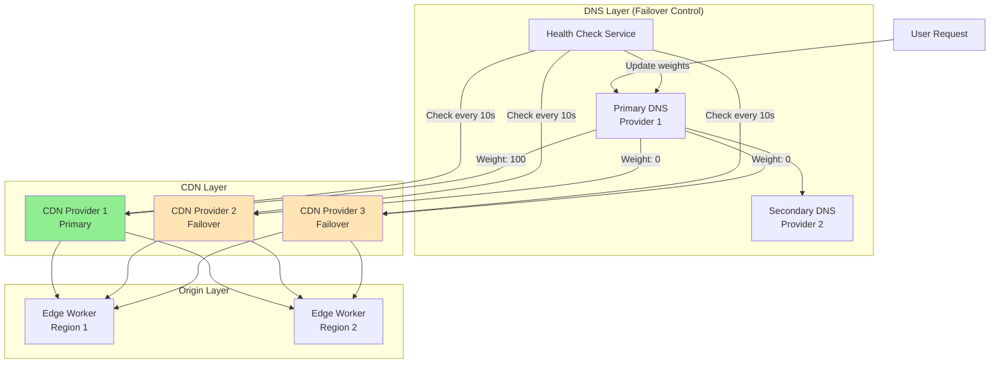
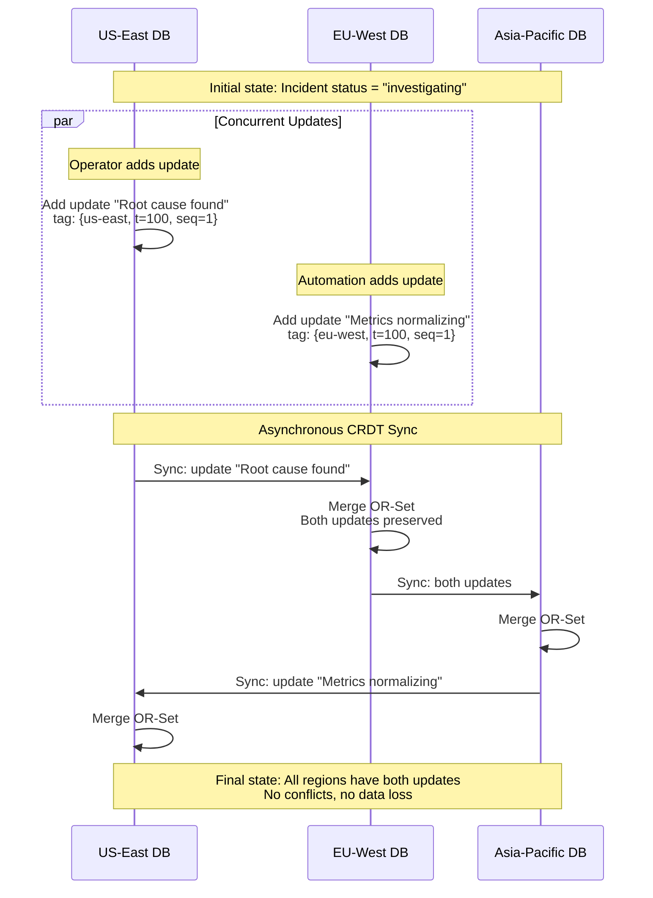
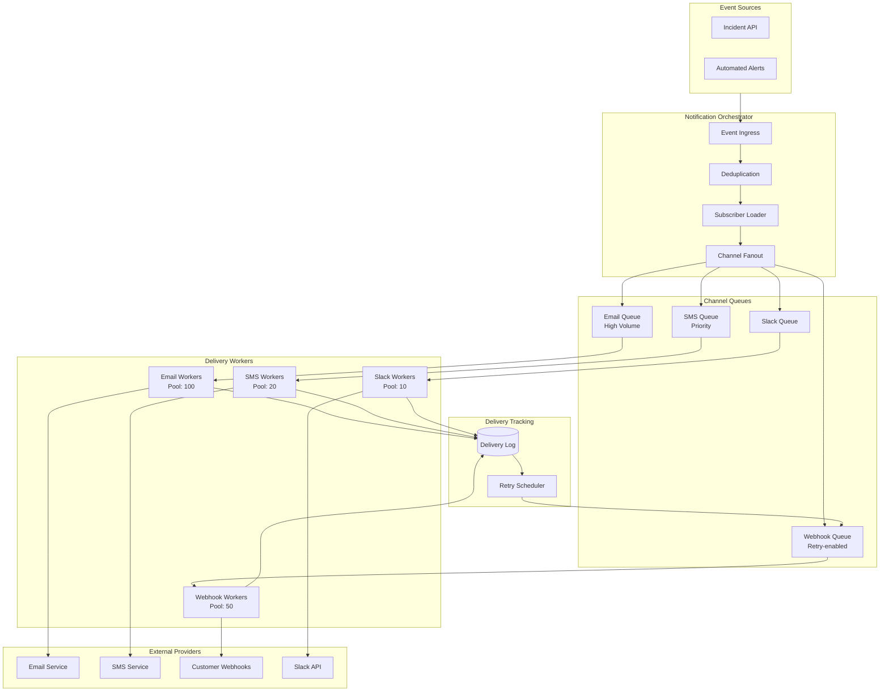

# Deep Dive and Bottlenecks

[Back to Index](./00-index.md)

---

## Critical Component 1: Multi-CDN Failover

### Why This Is Critical

The status page must remain accessible when primary infrastructure fails. A single CDN provider represents a single point of failure - CDN outages, while rare, do occur and would render the status page inaccessible precisely when users need it most.

### Multi-CDN Architecture



### DNS-Based Health Check Failover

```
STRUCTURE HealthCheck:
    target_url: string         // e.g., "https://cdn1.status.example.com/health"
    interval_seconds: int      // 10 seconds
    timeout_seconds: int       // 5 seconds
    healthy_threshold: int     // 2 consecutive successes
    unhealthy_threshold: int   // 2 consecutive failures

STRUCTURE CDNEndpoint:
    cdn_id: string
    hostname: string
    current_weight: int        // 0-100
    health_status: enum        // healthy, unhealthy
    consecutive_successes: int
    consecutive_failures: int

FUNCTION run_health_check_loop():
    WHILE true:
        FOR each endpoint IN cdn_endpoints:
            check_result = perform_health_check(endpoint)
            update_endpoint_health(endpoint, check_result)
            adjust_dns_weights()

        WAIT health_check_interval

FUNCTION perform_health_check(endpoint: CDNEndpoint) -> boolean:
    TRY:
        response = http_get(
            url = endpoint.hostname + "/health",
            timeout = health_check_timeout,
            headers = {"Host": "status.example.com"}
        )

        // Check response criteria
        IF response.status_code == 200:
            IF response.time < acceptable_latency:
                RETURN true

        RETURN false

    CATCH timeout, connection_error:
        RETURN false

FUNCTION update_endpoint_health(endpoint: CDNEndpoint, check_passed: boolean):
    IF check_passed:
        endpoint.consecutive_failures = 0
        endpoint.consecutive_successes += 1

        IF endpoint.health_status == "unhealthy":
            IF endpoint.consecutive_successes >= healthy_threshold:
                endpoint.health_status = "healthy"
                log("CDN {endpoint.cdn_id} recovered")
    ELSE:
        endpoint.consecutive_successes = 0
        endpoint.consecutive_failures += 1

        IF endpoint.health_status == "healthy":
            IF endpoint.consecutive_failures >= unhealthy_threshold:
                endpoint.health_status = "unhealthy"
                alert("CDN {endpoint.cdn_id} marked unhealthy")

FUNCTION adjust_dns_weights():
    healthy_endpoints = filter(cdn_endpoints, e -> e.health_status == "healthy")

    IF len(healthy_endpoints) == 0:
        // CRITICAL: No healthy CDNs
        alert_critical("All CDNs unhealthy - entering emergency mode")
        enable_emergency_static_page()
        RETURN

    // Distribute weight among healthy endpoints
    weight_per_endpoint = 100 / len(healthy_endpoints)

    FOR each endpoint IN cdn_endpoints:
        IF endpoint.health_status == "healthy":
            endpoint.current_weight = weight_per_endpoint
        ELSE:
            endpoint.current_weight = 0

    update_dns_records(cdn_endpoints)
```

### Failover Timing Analysis

| Phase | Duration | Cumulative |
|-------|----------|------------|
| CDN failure occurs | 0s | 0s |
| Health check detects (interval) | 10s | 10s |
| Second failed check (threshold) | 10s | 20s |
| DNS update propagated | 5s | 25s |
| DNS TTL expiration (client-side) | 0-60s | 25-85s |
| **Total failover time** | | **25-85 seconds** |

### Optimization: Anycast + BGP Failover

```
┌─────────────────────────────────────────────────────────────────┐
│                  ANYCAST FAILOVER (Advanced)                    │
├─────────────────────────────────────────────────────────────────┤
│                                                                 │
│  Instead of DNS failover, use Anycast IP addresses:            │
│                                                                 │
│  status.example.com → 203.0.113.1 (Anycast IP)                 │
│                                                                 │
│  Multiple CDN PoPs announce the same IP via BGP:               │
│                                                                 │
│    ┌─────────────┐  ┌─────────────┐  ┌─────────────┐          │
│    │  PoP NYC    │  │  PoP LON    │  │  PoP TYO    │          │
│    │  203.0.113.1│  │  203.0.113.1│  │  203.0.113.1│          │
│    └─────────────┘  └─────────────┘  └─────────────┘          │
│          ↑               ↑                ↑                    │
│          └───────────────┼────────────────┘                    │
│                          │                                     │
│                    BGP Routing                                 │
│                          │                                     │
│                     ┌────┴────┐                                │
│                     │  User   │                                │
│                     └─────────┘                                │
│                                                                 │
│  When a PoP fails:                                             │
│  1. PoP stops announcing IP (withdraws BGP route)              │
│  2. BGP reconverges (~1-5 seconds)                             │
│  3. Traffic automatically routes to next closest PoP           │
│                                                                 │
│  Advantages:                                                    │
│  • Failover in seconds (not minutes)                           │
│  • No DNS TTL dependency                                       │
│  • Automatic closest PoP selection                             │
│                                                                 │
│  Disadvantages:                                                 │
│  • Requires ASN ownership                                      │
│  • Complex setup and operations                                │
│  • Not suitable for most organizations                         │
│                                                                 │
└─────────────────────────────────────────────────────────────────┘
```

### Failure Modes

| Failure | Detection | Mitigation |
|---------|-----------|------------|
| Single CDN PoP failure | BGP/Anycast automatic | Traffic reroutes to next PoP |
| CDN provider outage | Health check (25-85s) | DNS failover to backup CDN |
| DNS provider outage | Monitoring + backup NS | Secondary DNS takes over |
| All CDNs fail | Health checks | Emergency static page mode |

---

## Critical Component 2: CRDT Incident Synchronization

### Why This Is Critical

Incidents can be created or updated from multiple regions simultaneously (e.g., automated alerts from different monitoring systems, operators in different time zones). Without proper synchronization, concurrent updates could conflict, lose data, or result in inconsistent views across regions.

### CRDT Synchronization Flow



### Merge Semantics

```
EXAMPLE: Concurrent Incident Updates

Region US-East creates update at time T=100:
  adds: {
    "upd_001": {
      update: {body: "Root cause identified", status: "identified"},
      tag: {region: "us-east", time: 100, seq: 1}
    }
  }
  removes: {}

Region EU-West creates update at time T=100:
  adds: {
    "upd_002": {
      update: {body: "Metrics normalizing", status: "monitoring"},
      tag: {region: "eu-west", time: 100, seq: 1}
    }
  }
  removes: {}

After merge (any region):
  adds: {
    "upd_001": {
      update: {body: "Root cause identified", status: "identified"},
      tag: {region: "us-east", time: 100, seq: 1}
    },
    "upd_002": {
      update: {body: "Metrics normalizing", status: "monitoring"},
      tag: {region: "eu-west", time: 100, seq: 1}
    }
  }
  removes: {}

Both updates preserved. Displayed in timestamp order.
```

### Status Resolution with LWW-Register

When the incident status itself is updated concurrently, use Last-Writer-Wins with Hybrid Logical Clocks:

```
EXAMPLE: Concurrent Status Changes

US-East sets status to "identified" at HLC {time: 100, counter: 5, node: "us-east"}
EU-West sets status to "monitoring" at HLC {time: 100, counter: 3, node: "eu-west"}

Comparison:
  time: 100 == 100 (tie)
  counter: 5 > 3

Winner: US-East's "identified" status

Final status: "identified" (US-East wins because counter is higher)
```

### Synchronization Protocol

```
FUNCTION sync_with_peer(local_region: string, peer_region: string):
    // Get local changes since last sync
    local_changes = get_changes_since(last_sync_vector[peer_region])

    // Send to peer
    peer_changes = rpc_sync(peer_region, local_changes, local_vector_clock)

    // Apply peer changes locally
    FOR each change IN peer_changes:
        SWITCH change.type:
            CASE "incident_created":
                merge_incident(change.incident)
            CASE "incident_updated":
                merge_incident_updates(change.incident_id, change.updates)
            CASE "component_status":
                merge_component_status(change.component_id, change.status)

    // Update sync vector
    last_sync_vector[peer_region] = peer_changes.vector_clock

FUNCTION merge_incident(remote_incident: Incident):
    local_incident = get_incident(remote_incident.id)

    IF local_incident IS NULL:
        // New incident from remote
        save_incident(remote_incident)
        RETURN

    // Merge vector clocks
    merged_vc = merge_vector_clocks(local_incident.vector_clock, remote_incident.vector_clock)

    // Merge status (LWW)
    IF compare_hlc(remote_incident.status_hlc, local_incident.status_hlc) > 0:
        local_incident.status = remote_incident.status
        local_incident.status_hlc = remote_incident.status_hlc

    // Merge updates (OR-Set)
    local_incident.updates = merge_or_set(local_incident.updates, remote_incident.updates)

    local_incident.vector_clock = merged_vc
    save_incident(local_incident)
```

### Convergence Guarantees

| Property | Guarantee | Mechanism |
|----------|-----------|-----------|
| **Eventual Consistency** | All replicas converge | CRDT mathematical properties |
| **No Lost Updates** | All writes preserved | OR-Set add-wins semantics |
| **Deterministic Merge** | Same result regardless of order | Commutative, associative, idempotent |
| **Causality Preservation** | Happens-before respected | Vector clocks |

---

## Critical Component 3: Notification Delivery Pipeline

### Why This Is Critical

During a major incident, potentially millions of subscribers need to be notified quickly. The notification system must handle extreme bursts while ensuring at-least-once delivery, managing provider rate limits, and avoiding duplicate notifications.

### Notification Pipeline Architecture



### Fanout Algorithm

```
FUNCTION process_incident_event(event: IncidentEvent):
    // Step 1: Deduplication check
    IF NOT should_process_event(event):
        log("Event deduplicated: {event.id}")
        RETURN

    // Step 2: Load affected subscribers
    subscribers = load_subscribers(
        status_page_id = event.status_page_id,
        components = event.affected_components,
        notification_type = event.type,  // incident, maintenance
        confirmed_only = true
    )

    log("Loaded {len(subscribers)} subscribers for event {event.id}")

    // Step 3: Group by channel for efficient batching
    by_channel = group_by(subscribers, s -> s.channel)

    // Step 4: Fanout to channel queues
    FOR each (channel, channel_subscribers) IN by_channel:
        batch_size = get_batch_size(channel)

        FOR each batch IN chunk(channel_subscribers, batch_size):
            notification = build_notification(event, batch, channel)
            enqueue(channel + "_queue", notification)

    // Step 5: Update event as processed
    mark_event_processed(event.id)

FUNCTION load_subscribers(status_page_id, components, notification_type, confirmed_only):
    // Optimized query with index hints
    query = """
        SELECT s.*
        FROM subscribers s
        WHERE s.status_page_id = ?
          AND s.confirmed = ?
          AND ? = ANY(s.notification_types)
          AND (
            s.subscribed_components IS NULL  -- Subscribed to all
            OR s.subscribed_components && ?  -- Overlap with affected components
          )
    """
    RETURN execute_query(query, [status_page_id, confirmed_only, notification_type, components])
```

### Rate Limiting Per Channel

```
STRUCTURE ChannelRateLimiter:
    channel: string
    max_per_second: int
    max_per_minute: int
    current_second_count: int
    current_minute_count: int
    last_second: timestamp
    last_minute: timestamp

CHANNEL_LIMITS = {
    "email": {max_per_second: 1000, max_per_minute: 50000},
    "sms": {max_per_second: 100, max_per_minute: 5000},
    "webhook": {max_per_second: 500, max_per_minute: 25000},
    "slack": {max_per_second: 50, max_per_minute: 3000}
}

FUNCTION acquire_rate_limit(channel: string) -> boolean:
    limiter = get_limiter(channel)
    now = current_timestamp()

    // Reset counters if window passed
    IF now.second != limiter.last_second:
        limiter.current_second_count = 0
        limiter.last_second = now.second

    IF now.minute != limiter.last_minute:
        limiter.current_minute_count = 0
        limiter.last_minute = now.minute

    // Check limits
    limits = CHANNEL_LIMITS[channel]
    IF limiter.current_second_count >= limits.max_per_second:
        RETURN false
    IF limiter.current_minute_count >= limits.max_per_minute:
        RETURN false

    // Acquire
    limiter.current_second_count += 1
    limiter.current_minute_count += 1
    RETURN true

FUNCTION worker_loop(channel: string):
    WHILE true:
        notification = dequeue(channel + "_queue", block=true)

        // Respect rate limits
        WHILE NOT acquire_rate_limit(channel):
            WAIT 10ms

        // Deliver
        result = deliver_notification(notification)

        // Log result
        log_delivery(notification.id, result)

        // Schedule retry if needed
        IF NOT result.success AND notification.attempt < MAX_RETRIES:
            schedule_retry(notification, channel)
```

### Delivery Tracking and Retry

```
STRUCTURE DeliveryAttempt:
    notification_id: string
    subscriber_id: string
    channel: string
    attempt: int
    status: enum  // pending, delivered, bounced, failed
    provider_message_id: string
    error_message: string
    attempted_at: timestamp
    delivered_at: timestamp

FUNCTION handle_delivery_result(notification: Notification, result: DeliveryResult):
    attempt = DeliveryAttempt{
        notification_id: notification.id,
        subscriber_id: notification.subscriber_id,
        channel: notification.channel,
        attempt: notification.attempt,
        status: result.status,
        provider_message_id: result.provider_id,
        error_message: result.error,
        attempted_at: current_timestamp()
    }

    save_delivery_attempt(attempt)

    SWITCH result.status:
        CASE "delivered":
            // Success - no action needed
            metrics.increment("notifications.delivered", tags={channel: notification.channel})

        CASE "bounced":
            // Permanent failure - disable subscriber
            IF notification.channel == "email":
                mark_subscriber_bounced(notification.subscriber_id)
            metrics.increment("notifications.bounced", tags={channel: notification.channel})

        CASE "failed":
            // Transient failure - schedule retry
            IF notification.attempt < MAX_RETRIES[notification.channel]:
                schedule_retry(notification)
            ELSE:
                mark_notification_failed(notification.id)
                metrics.increment("notifications.failed", tags={channel: notification.channel})

RETRY_SCHEDULE = {
    "email": [60, 300, 900, 3600],        // 1m, 5m, 15m, 1h
    "sms": [30, 60, 120, 300],            // 30s, 1m, 2m, 5m
    "webhook": [30, 60, 120, 240, 480, 960, 1920, 3600],  // Up to 1h
    "slack": [60, 300, 900]               // 1m, 5m, 15m
}
```

---

## Critical Component 4: Edge Rendering with Graceful Degradation

### Why This Is Critical

The status page must be accessible even when origin servers are unreachable. Edge rendering with multiple degradation tiers ensures the page remains visible with progressively reduced functionality.

### Rendering Tier Architecture

```
┌─────────────────────────────────────────────────────────────────┐
│                    EDGE RENDERING TIERS                         │
├─────────────────────────────────────────────────────────────────┤
│                                                                 │
│  TIER 1: DYNAMIC EDGE (Normal Operation)                       │
│  ┌───────────────────────────────────────────────────────────┐ │
│  │  • Edge Worker reads current status from Edge KV          │ │
│  │  • Renders full HTML with real-time data                  │ │
│  │  • SSE connection for live updates                        │ │
│  │  • Full feature set available                             │ │
│  │  • Latency: < 50ms                                        │ │
│  └───────────────────────────────────────────────────────────┘ │
│                          ↓                                      │
│                    [Edge KV unavailable]                        │
│                          ↓                                      │
│  TIER 2: ORIGIN-BACKED EDGE                                    │
│  ┌───────────────────────────────────────────────────────────┐ │
│  │  • Edge Worker fetches from origin API                    │ │
│  │  • Slightly stale data acceptable                         │ │
│  │  • SSE may be degraded                                    │ │
│  │  • Latency: < 200ms                                       │ │
│  └───────────────────────────────────────────────────────────┘ │
│                          ↓                                      │
│                    [Origin unavailable]                         │
│                          ↓                                      │
│  TIER 3: STALE CACHE                                           │
│  ┌───────────────────────────────────────────────────────────┐ │
│  │  • Serve last known good response from CDN cache          │ │
│  │  • Cache-Control: stale-while-revalidate                  │ │
│  │  • Shows "Last updated: X minutes ago"                    │ │
│  │  • No real-time updates                                   │ │
│  │  • Latency: < 50ms                                        │ │
│  └───────────────────────────────────────────────────────────┘ │
│                          ↓                                      │
│                    [Cache expired/empty]                        │
│                          ↓                                      │
│  TIER 4: STATIC FALLBACK                                       │
│  ┌───────────────────────────────────────────────────────────┐ │
│  │  • Pre-deployed static HTML page                          │ │
│  │  • Generic "We're investigating" message                  │ │
│  │  • Links to Twitter/social for updates                    │ │
│  │  • Always available (CDN origin)                          │ │
│  │  • Latency: < 50ms                                        │ │
│  └───────────────────────────────────────────────────────────┘ │
│                                                                 │
└─────────────────────────────────────────────────────────────────┘
```

### Edge Worker Logic

```
FUNCTION handle_request(request: Request) -> Response:
    page_id = extract_page_id(request)

    // TIER 1: Try Edge KV first
    TRY:
        status_data = edge_kv.get("status:" + page_id)
        IF status_data:
            html = render_status_page(status_data)
            RETURN Response(html, headers={
                "Cache-Control": "public, max-age=10, stale-while-revalidate=60",
                "X-Render-Tier": "edge-kv"
            })
    CATCH edge_kv_error:
        log_warning("Edge KV unavailable: {edge_kv_error}")

    // TIER 2: Try origin API
    TRY:
        origin_response = fetch_with_timeout(
            origin_url + "/v1/pages/" + page_id + "/status",
            timeout = 3_seconds
        )
        IF origin_response.ok:
            status_data = origin_response.json()
            html = render_status_page(status_data)

            // Async update Edge KV for next request
            edge_kv.put("status:" + page_id, status_data)

            RETURN Response(html, headers={
                "Cache-Control": "public, max-age=30, stale-while-revalidate=300",
                "X-Render-Tier": "origin"
            })
    CATCH origin_error:
        log_warning("Origin unavailable: {origin_error}")

    // TIER 3: Check for stale cache in CDN
    // (This happens automatically via stale-while-revalidate)
    // If we reach here, we need tier 4

    // TIER 4: Static fallback
    log_error("Serving static fallback for page {page_id}")
    metrics.increment("render.fallback")

    RETURN Response(STATIC_FALLBACK_HTML, headers={
        "Cache-Control": "public, max-age=60",
        "X-Render-Tier": "static-fallback"
    })

STATIC_FALLBACK_HTML = """
<!DOCTYPE html>
<html>
<head>
  <title>System Status</title>
  <style>/* Minimal inline CSS */</style>
</head>
<body>
  <div class="status-page">
    <h1>System Status</h1>
    <div class="status investigating">
      <h2>We're investigating an issue</h2>
      <p>Our team is aware and working on resolution.</p>
      <p>For real-time updates, follow us on <a href="https://twitter.com/example">Twitter</a>.</p>
      <p><small>This is a fallback page. Full status page temporarily unavailable.</small></p>
    </div>
  </div>
</body>
</html>
"""
```

### Cache Invalidation Flow

```
FUNCTION invalidate_on_status_change(event: StatusChangeEvent):
    page_id = event.status_page_id

    // Step 1: Update Edge KV (fast, global)
    edge_kv.put("status:" + page_id, event.new_status, expiration=HOUR)

    // Step 2: Purge CDN cache (async)
    cdn_purge_urls = [
        "https://status.example.com/" + page_id,
        "https://status.example.com/" + page_id + "/",
        "https://status.example.com/api/v1/pages/" + page_id + "/*"
    ]

    FOR each cdn_provider IN active_cdn_providers:
        enqueue_async(purge_cdn_cache, cdn_provider, cdn_purge_urls)

    // Step 3: Broadcast to SSE connections
    publish_to_pubsub("status_updates:" + page_id, event)

    log("Cache invalidation complete for page {page_id}")

FUNCTION purge_cdn_cache(provider: CDNProvider, urls: List<string>):
    TRY:
        provider.purge(urls)
        metrics.increment("cdn.purge.success", tags={provider: provider.name})
    CATCH purge_error:
        log_error("CDN purge failed: {purge_error}")
        metrics.increment("cdn.purge.failure", tags={provider: provider.name})
        // Don't retry - stale-while-revalidate handles this
```

---

## Bottleneck Analysis

### Identified Bottlenecks

| Bottleneck | Cause | Impact | Severity |
|------------|-------|--------|----------|
| **CDN Cache Stampede** | Major incident causes surge | Origin overwhelmed | High |
| **Notification Queue Backlog** | Million subscribers, major incident | Delayed notifications | High |
| **SSE Connection Limits** | Too many concurrent viewers | New connections refused | Medium |
| **Database During Spike** | Read amplification | Slow API responses | Medium |
| **Edge KV Write Limits** | Rapid status updates | Stale edge data | Low |

### Mitigation Strategies

#### 1. CDN Cache Stampede Prevention

```
STRATEGY: Request Coalescing + Stale-While-Revalidate

Configuration:
  Cache-Control: public, max-age=10, stale-while-revalidate=60, stale-if-error=300

Behavior:
  • Normal: Serve cached content, revalidate in background every 10s
  • Origin slow: Serve stale content up to 60s while revalidating
  • Origin down: Serve stale content up to 5 minutes

Request Coalescing:
  • CDN collapses concurrent origin requests into one
  • 1000 simultaneous requests = 1 origin request
  • All 1000 clients get same response
```

#### 2. Notification Queue Scaling

```
STRATEGY: Pre-sharded Queues + Priority Lanes

Architecture:
  EmailQueue_Shard_0..99  (100 shards)
  EmailQueue_Priority     (1 priority queue for critical)

Sharding:
  shard = hash(subscriber_id) % NUM_SHARDS
  enqueue(EmailQueue_Shard_{shard}, notification)

Priority:
  IF incident.impact == "critical":
      enqueue(EmailQueue_Priority, notification)  // Processed first

Auto-scaling:
  • Monitor queue depth
  • Scale workers when depth > threshold
  • Target: < 5 minute drain time for full queue
```

#### 3. SSE Connection Management

```
STRATEGY: Edge Termination + Connection Pooling

Architecture:
  Users → Edge (terminates SSE) → Pub/Sub → Origin

Edge SSE:
  • Edge worker maintains SSE connections
  • Subscribes to Pub/Sub for page updates
  • Fan-out happens at edge, not origin
  • Connection limit: 100K per edge location

Connection Limits:
  MAX_CONNECTIONS_PER_PAGE = 100000  // Per edge location
  MAX_CONNECTIONS_PER_IP = 10        // Prevent abuse

  IF current_connections >= MAX_CONNECTIONS_PER_PAGE:
      RETURN Response(503, "Too many connections, retry later")
      // Client will fall back to polling
```

#### 4. Database Read Scaling

```
STRATEGY: Heavy Caching + Read Replicas

Cache Hierarchy:
  L1: Edge KV (< 1ms, global)
  L2: Application cache (< 5ms, regional)
  L3: Database read replica (< 20ms)
  L4: Database primary (< 50ms)

Read Path:
  1. Check Edge KV → hit 95% of reads
  2. Check app cache → hit 4% of reads
  3. Query read replica → hit 0.9% of reads
  4. Query primary → 0.1% of reads (writes only)

Write Path:
  1. Write to primary
  2. Replicate to read replicas (async, < 100ms)
  3. Push to app cache (async)
  4. Push to Edge KV (async)
```

---

## Concurrency and Race Conditions

### Race Condition 1: Simultaneous Incident Creation

**Scenario:** Two monitoring systems detect the same issue and try to create incidents simultaneously.

```
PROBLEM:
  Monitor A: POST /incidents {dedup_key: "alert-123"}
  Monitor B: POST /incidents {dedup_key: "alert-123"}
  Both requests arrive at same time

SOLUTION: Database-level uniqueness + upsert

  CREATE UNIQUE INDEX idx_dedup ON incidents(status_page_id, dedup_key)
    WHERE dedup_key IS NOT NULL;

  INSERT INTO incidents (...)
  ON CONFLICT (status_page_id, dedup_key)
  DO UPDATE SET updated_at = NOW()
  RETURNING id, (xmax = 0) AS inserted;

  IF NOT inserted:
      RETURN existing_incident_id
```

### Race Condition 2: Concurrent Status Updates

**Scenario:** Operator updates incident to "identified" while automation updates to "resolved".

```
PROBLEM:
  Operator: PATCH /incidents/123 {status: "identified"}
  Automation: PATCH /incidents/123 {status: "resolved"}
  Both arrive at same time

SOLUTION: CRDTs with HLC (handled by merge semantics)

  Each update includes Hybrid Logical Clock
  LWW-Register ensures deterministic winner
  Both updates recorded as incident_updates (OR-Set)
  Final status = winner of HLC comparison
```

### Race Condition 3: Subscriber Confirmation

**Scenario:** User clicks confirmation link twice rapidly.

```
PROBLEM:
  Click 1: GET /confirm/{token}
  Click 2: GET /confirm/{token}
  Both try to confirm same subscriber

SOLUTION: Idempotent confirmation

  UPDATE subscribers
  SET confirmed = true, confirmed_at = NOW()
  WHERE confirmation_token = ?
    AND confirmed = false;

  IF rows_affected == 0:
      // Already confirmed or invalid token
      RETURN "Already confirmed"
  ELSE:
      RETURN "Confirmation successful"
```

---

## Next Steps

- [Scalability & Reliability](./05-scalability-and-reliability.md) - Multi-region deployment and DR
