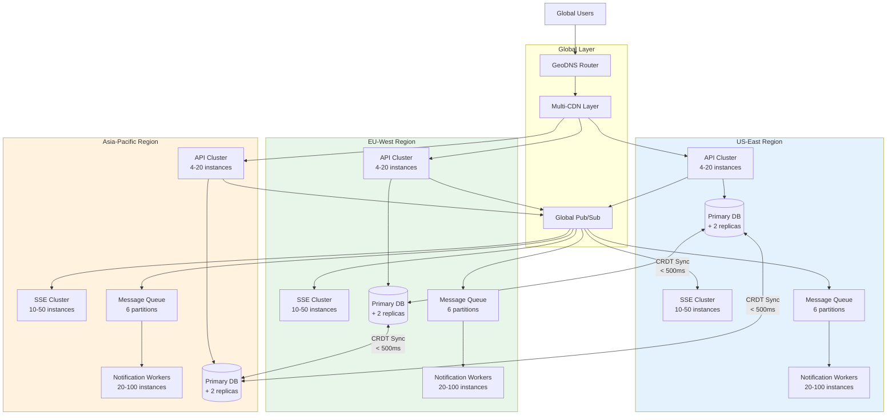

# Scalability and Reliability

[Back to Index](./00-index.md)

---

## Scalability Strategy

### Scaling by Component

| Component | Scaling Approach | Bottleneck | Target Scale |
|-----------|-----------------|------------|--------------|
| **CDN/Edge** | CDN-managed (automatic) | N/A | Unlimited |
| **Edge Workers** | Auto-scale per region | CPU, memory | 1M+ requests/second |
| **Edge KV** | Managed (automatic) | Write rate | 1K writes/second |
| **SSE Servers** | Horizontal (stateful) | Connections | 10M concurrent |
| **API Servers** | Horizontal (stateless) | CPU, connections | 50K RPS |
| **Status Database** | Read replicas + sharding | Connections, storage | 100K pages |
| **Notification Workers** | Queue-based auto-scale | CPU | 1M notifications/min |
| **Message Queues** | Partition-based | Throughput | 500K messages/sec |

### Horizontal Scaling Patterns

```
┌─────────────────────────────────────────────────────────────────┐
│                   HORIZONTAL SCALING ARCHITECTURE               │
├─────────────────────────────────────────────────────────────────┤
│                                                                 │
│  STATELESS COMPONENTS (Scale freely)                           │
│  ┌───────────────────────────────────────────────────────────┐ │
│  │                                                           │ │
│  │   Load Balancer                                           │ │
│  │        │                                                  │ │
│  │   ┌────┼────┬────────┬────────┐                          │ │
│  │   ▼    ▼    ▼        ▼        ▼                          │ │
│  │  API  API  API      API      API                         │ │
│  │   1    2    3        N       N+1                         │ │
│  │                                                           │ │
│  │  • Add instances during incident spikes                  │ │
│  │  • No session affinity required                          │ │
│  │  • Scale based on CPU/request rate                       │ │
│  └───────────────────────────────────────────────────────────┘ │
│                                                                 │
│  STATEFUL COMPONENTS (Scale with coordination)                 │
│  ┌───────────────────────────────────────────────────────────┐ │
│  │                                                           │ │
│  │   SSE Connection Manager                                  │ │
│  │        │                                                  │ │
│  │   Consistent Hashing Ring                                │ │
│  │        │                                                  │ │
│  │   ┌────┼────┬────────┬────────┐                          │ │
│  │   ▼    ▼    ▼        ▼        ▼                          │ │
│  │  SSE  SSE  SSE      SSE      SSE                         │ │
│  │   1    2    3        N       N+1                         │ │
│  │                                                           │ │
│  │  • Connections routed by page_id hash                    │ │
│  │  • Pub/Sub for cross-server events                       │ │
│  │  • Graceful connection migration on scale                │ │
│  └───────────────────────────────────────────────────────────┘ │
│                                                                 │
└─────────────────────────────────────────────────────────────────┘
```

### Auto-Scaling Configuration

```
AUTOSCALING_RULES:
  api_servers:
    min_instances: 4
    max_instances: 100
    scale_up:
      - metric: cpu_utilization
        threshold: 70%
        duration: 2 minutes
        action: add 50% capacity
      - metric: request_rate
        threshold: 80% of capacity
        duration: 1 minute
        action: add 25% capacity
    scale_down:
      - metric: cpu_utilization
        threshold: 30%
        duration: 10 minutes
        action: remove 25% capacity

  sse_servers:
    min_instances: 10
    max_instances: 200
    scale_up:
      - metric: active_connections
        threshold: 80K per server
        duration: 1 minute
        action: add 2 instances
    scale_down:
      - metric: active_connections
        threshold: 20K per server
        duration: 15 minutes
        action: remove 1 instance

  notification_workers:
    min_instances: 20
    max_instances: 500
    scale_up:
      - metric: queue_depth
        threshold: 100K messages
        duration: 30 seconds
        action: add 50% workers
    scale_down:
      - metric: queue_depth
        threshold: 1K messages
        duration: 5 minutes
        action: remove 25% workers
```

---

## Multi-Region Active-Active Architecture



### Regional Routing Strategy

| User Location | Primary Region | Read Fallback | Write Fallback |
|---------------|----------------|---------------|----------------|
| North America | US-East | EU-West | EU-West |
| South America | US-East | EU-West | EU-West |
| Europe | EU-West | US-East | US-East |
| Africa | EU-West | US-East | US-East |
| Middle East | EU-West | APAC | US-East |
| Asia | APAC | US-East | US-East |
| Oceania | APAC | US-East | US-East |

### Cross-Region Replication

```
REPLICATION_CONFIG:
  database:
    type: CRDT_SYNC
    topology: MESH  # All regions sync with all others
    sync_interval: 100ms
    max_lag: 500ms
    conflict_resolution: LWW_WITH_VECTOR_CLOCK

  event_store:
    type: ASYNC_REPLICATION
    topology: LEADER_FOLLOWER_PER_REGION
    replication_lag_target: < 1 second
    cross_region_sync: VIA_PUBSUB

  edge_kv:
    type: MANAGED_EVENTUAL
    propagation_target: < 1 second globally
    write_location: NEAREST_REGION

CRDT_SYNC_PROTOCOL:
  // Peer-to-peer mesh sync
  FOR each region_pair IN all_region_pairs:
      schedule_sync(region_pair, interval=100ms)

  FUNCTION sync_pair(region_a, region_b):
      changes_a = region_a.get_changes_since(last_sync[region_b])
      changes_b = region_b.get_changes_since(last_sync[region_a])

      region_a.apply_changes(changes_b)
      region_b.apply_changes(changes_a)

      update_sync_vectors()
```

---

## Reliability and Fault Tolerance

### Single Points of Failure (SPOF) Analysis

| Component | SPOF Risk | Mitigation | Residual Risk |
|-----------|-----------|------------|---------------|
| DNS | Provider outage | Multi-provider NS, low TTL | Very Low |
| CDN | Provider outage | Multi-CDN with health failover | Very Low |
| Origin Region | Region outage | Multi-region active-active | Very Low |
| Database Leader | Node failure | Auto-failover, CRDT sync | Low |
| Pub/Sub | Cluster failure | Multi-zone deployment | Low |
| Notification Providers | Provider outage | Multi-provider fallback | Low |

### Redundancy Strategy

```
┌─────────────────────────────────────────────────────────────────┐
│                    REDUNDANCY LAYERS                            │
├─────────────────────────────────────────────────────────────────┤
│                                                                 │
│  DNS REDUNDANCY                                                 │
│  • Primary: Provider A (4 nameservers)                         │
│  • Secondary: Provider B (4 nameservers)                       │
│  • Total: 8 authoritative nameservers                          │
│  • Anycast distribution                                         │
│                                                                 │
│  CDN REDUNDANCY                                                 │
│  • Primary: CDN Provider 1 (300+ PoPs)                         │
│  • Failover: CDN Provider 2 (200+ PoPs)                        │
│  • Failover: CDN Provider 3 (100+ PoPs)                        │
│  • Health-check based DNS steering                             │
│                                                                 │
│  COMPUTE REDUNDANCY                                             │
│  • Per region: 3 availability zones                            │
│  • Per AZ: N+1 capacity (can lose 1 AZ)                       │
│  • Cross-region: Can serve from any region                     │
│                                                                 │
│  DATABASE REDUNDANCY                                            │
│  • Per region: 1 primary + 2 replicas                         │
│  • Cross-region: CRDT sync (no single leader)                  │
│  • Backup: Daily snapshots, 30-day retention                   │
│                                                                 │
│  NOTIFICATION REDUNDANCY                                        │
│  • Email: Primary (SES) + Fallback (Sendgrid)                  │
│  • SMS: Primary (Twilio) + Fallback (Alternative)              │
│  • Webhook: Retry with exponential backoff                     │
│                                                                 │
└─────────────────────────────────────────────────────────────────┘
```

### Failover Mechanisms

#### Database Failover

```
DATABASE_FAILOVER:
  within_region:
    trigger: Primary health check fails (3 consecutive)
    detection_time: 30 seconds
    action:
      1. Promote highest-LSN replica to primary
      2. Update connection routing
      3. Reconnect application pools
    recovery_time: < 30 seconds
    data_loss: 0 (synchronous replication within AZ)

  cross_region:
    trigger: Entire region unavailable
    detection_time: 1 minute
    action:
      1. Traffic routed to other regions (already happening via GeoDNS)
      2. Other regions have full data via CRDT sync
      3. No explicit failover needed (active-active)
    recovery_time: 0 (already serving from other regions)
    data_loss: < 500ms of writes (CRDT sync lag)
```

#### Notification Provider Failover

```
FUNCTION send_email_with_failover(notification: EmailNotification):
    providers = [PRIMARY_EMAIL_PROVIDER, BACKUP_EMAIL_PROVIDER]

    FOR each provider IN providers:
        TRY:
            result = provider.send(notification)
            IF result.success:
                log_delivery(notification, provider, "success")
                RETURN result
            ELSE:
                log_delivery(notification, provider, "failed", result.error)
        CATCH provider_error:
            log_delivery(notification, provider, "error", provider_error)
            metrics.increment("email.provider_failure", tags={provider: provider.name})

    // All providers failed
    enqueue_for_retry(notification)
    RETURN {success: false, error: "All providers failed"}
```

### Circuit Breaker Pattern

```
STRUCTURE CircuitBreaker:
    state: enum  // CLOSED, OPEN, HALF_OPEN
    failure_count: int
    success_count: int
    last_failure_time: timestamp
    failure_threshold: int = 5
    success_threshold: int = 3
    timeout_seconds: int = 60

FUNCTION call_with_circuit_breaker(breaker: CircuitBreaker, operation: Function):
    SWITCH breaker.state:
        CASE CLOSED:
            TRY:
                result = operation()
                breaker.failure_count = 0
                RETURN result
            CATCH error:
                breaker.failure_count += 1
                breaker.last_failure_time = now()
                IF breaker.failure_count >= breaker.failure_threshold:
                    breaker.state = OPEN
                    log("Circuit breaker OPENED")
                THROW error

        CASE OPEN:
            IF now() - breaker.last_failure_time > breaker.timeout_seconds:
                breaker.state = HALF_OPEN
                breaker.success_count = 0
                RETURN call_with_circuit_breaker(breaker, operation)
            ELSE:
                THROW CircuitOpenError("Circuit is open")

        CASE HALF_OPEN:
            TRY:
                result = operation()
                breaker.success_count += 1
                IF breaker.success_count >= breaker.success_threshold:
                    breaker.state = CLOSED
                    breaker.failure_count = 0
                    log("Circuit breaker CLOSED")
                RETURN result
            CATCH error:
                breaker.state = OPEN
                breaker.last_failure_time = now()
                log("Circuit breaker re-OPENED")
                THROW error

// Usage
origin_breaker = CircuitBreaker()

FUNCTION fetch_from_origin(page_id):
    RETURN call_with_circuit_breaker(origin_breaker, () ->
        http_get(origin_url + "/pages/" + page_id)
    )
```

### Bulkhead Pattern

```
BULKHEAD_CONFIGURATION:
  api_server:
    thread_pools:
      incident_api:
        max_threads: 50
        queue_size: 100
      component_api:
        max_threads: 30
        queue_size: 50
      subscriber_api:
        max_threads: 40
        queue_size: 100
      public_read:
        max_threads: 100
        queue_size: 500

    connection_pools:
      database_primary:
        max_connections: 50
        min_connections: 10
      database_replica:
        max_connections: 100
        min_connections: 20
      redis_cache:
        max_connections: 200
        min_connections: 50

  // Isolation ensures one component failure doesn't cascade
  // Example: If subscriber_api pool exhausted, incident_api still works
```

---

## Disaster Recovery

### DR Scenarios and Response

| Scenario | RTO | RPO | Recovery Procedure |
|----------|-----|-----|-------------------|
| Single AZ failure | 0 (automatic) | 0 | Traffic redistributed within region |
| Single region failure | < 30s | < 500ms | GeoDNS routes to healthy regions |
| Multi-region failure | < 5 min | < 1 min | Edge serves cached, manual intervention |
| CDN provider failure | < 30s | 0 | DNS failover to backup CDN |
| Complete infrastructure loss | < 15 min | < 5 min | Deploy from IaC, restore from backup |
| Database corruption | < 1 hour | < 24 hours | Restore from snapshot |

### Backup Strategy

```
BACKUP_STRATEGY:
  database:
    continuous:
      type: WAL_STREAMING
      retention: 7 days
      point_in_time_recovery: YES

    snapshots:
      frequency: DAILY
      retention: 30 days
      storage: CROSS_REGION_OBJECT_STORAGE

    logical_backups:
      frequency: WEEKLY
      retention: 90 days
      format: SQL_DUMP
      encryption: AES_256

  configuration:
    storage: GIT_REPOSITORY
    secrets: VAULT_BACKUP
    frequency: ON_CHANGE

  event_store:
    type: LOG_COMPACTION
    retention: 1 YEAR
    archive: OBJECT_STORAGE
```

### Recovery Procedures

```
RUNBOOK: Region Failure Recovery

SITUATION: Entire region (e.g., US-East) becomes unavailable

AUTOMATIC ACTIONS (No human intervention):
  1. GeoDNS detects region health check failures
  2. Traffic automatically routes to EU-West and APAC
  3. Edge KV continues serving cached status pages
  4. SSE clients reconnect to nearest healthy region
  5. Notification queues in healthy regions continue processing

HUMAN ACTIONS (If recovery needed):
  1. Assess root cause (cloud provider outage, network issue, etc.)
  2. If prolonged (> 1 hour):
     - Scale up healthy regions to handle increased load
     - Communicate status via social media channels
  3. When region recovers:
     - Verify CRDT sync completes
     - Gradually restore traffic (canary)
     - Monitor for anomalies

VERIFICATION:
  - All status pages accessible from all regions
  - CRDT sync caught up (vector clocks aligned)
  - No notification backlog
  - All health checks passing
```

---

## Chaos Engineering

### Chaos Experiments

| Experiment | Frequency | Scope | Expected Outcome |
|------------|-----------|-------|------------------|
| Kill random API server | Daily | Single instance | No user impact, auto-replaced |
| Kill SSE server | Weekly | Single instance | Clients reconnect, < 5s impact |
| Block database primary | Monthly | Single region | Failover to replica, < 30s |
| Simulate CDN failure | Monthly | Single provider | Failover to backup, < 30s |
| Network partition (region) | Quarterly | Single region | Other regions serve traffic |
| Notification provider outage | Monthly | Single provider | Fallback provider takes over |
| Spike traffic 10x | Weekly | Global | Edge absorbs, no origin impact |

### Chaos Implementation

```
CHAOS_EXPERIMENT: CDN Provider Failure

SETUP:
  - Verify monitoring and alerts are active
  - Ensure backup CDN is healthy
  - Schedule maintenance window (internal only)

EXECUTION:
  1. Gradually reduce primary CDN weight in DNS (100 → 50 → 0)
  2. Monitor:
     - Page load times
     - Error rates
     - Backup CDN traffic
     - Alert triggers

EXPECTED RESULTS:
  - Traffic shifts to backup CDN within 30-60 seconds
  - No increase in error rates
  - Page load times remain < 200ms p99
  - No manual intervention required

SUCCESS CRITERIA:
  - All synthetic monitors remain green
  - No customer-reported issues
  - Backup CDN handles full load

ROLLBACK:
  - Restore primary CDN weight in DNS
  - If backup CDN issues: Enable emergency static pages

LEARNINGS_TEMPLATE:
  - Failover time actual: ___
  - Issues observed: ___
  - Improvements needed: ___
```

---

## Capacity Planning

### Traffic Projections

| Metric | Current | Year 1 | Year 3 | Year 5 |
|--------|---------|--------|--------|--------|
| Status pages | 10K | 25K | 75K | 150K |
| Daily page views | 10M | 25M | 75M | 150M |
| Peak incident views/hour | 1M | 2.5M | 7.5M | 15M |
| Subscribers | 50M | 125M | 375M | 750M |
| Notifications/month | 100M | 250M | 750M | 1.5B |

### Infrastructure Scaling Plan

```
SCALING_TIERS:

  TIER_1 (Current - 10K pages):
    Regions: 3
    API servers per region: 4
    SSE servers per region: 10
    Database: 3-node cluster per region

  TIER_2 (25K pages):
    Regions: 3
    API servers per region: 8
    SSE servers per region: 25
    Database: 5-node cluster per region
    + Add read replicas

  TIER_3 (75K pages):
    Regions: 5 (add South America, Middle East)
    API servers per region: 15
    SSE servers per region: 50
    Database: Sharded (by tenant) + read replicas

  TIER_4 (150K pages):
    Regions: 7 (add additional coverage)
    API servers per region: 30
    SSE servers per region: 100
    Database: Multi-level sharding
    + Dedicated notification infrastructure
```

### Scaling Triggers

| Metric | Warning Threshold | Action Threshold | Auto-Scale Action |
|--------|-------------------|------------------|-------------------|
| CPU utilization | 60% | 75% | Add 25% capacity |
| Memory utilization | 70% | 85% | Add 25% capacity |
| Request latency p99 | 300ms | 500ms | Add 50% capacity |
| Queue depth | 50K | 100K | Double workers |
| Connection count | 70K/server | 90K/server | Add SSE servers |
| Error rate | 0.1% | 0.5% | Alert + investigate |

---

## Next Steps

- [Security & Compliance](./06-security-and-compliance.md) - Authentication, authorization, and compliance
