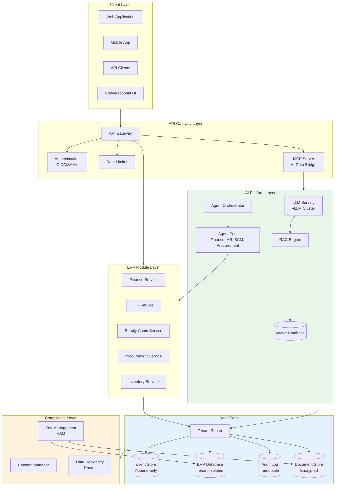

# AI Native Cloud ERP SaaS - System Design

[Back to System Design Index](../README.md)

---

## System Overview

An **AI Native Cloud ERP SaaS** is a next-generation enterprise resource planning platform where artificial intelligence is embedded as a first-class architectural component rather than a bolt-on feature. Unlike traditional ERPs that add AI capabilities through external integrations, this system hosts its own LLMs, deploys autonomous agents for business process automation, and enforces privacy-first and compliance-first principles at every layer.

The defining architectural challenges include: (1) **self-hosted AI infrastructure** with GPU cluster management and model serving at scale, (2) **multi-tenant data isolation** with cryptographic guarantees for privacy, (3) **multi-agent orchestration** where specialized AI agents handle finance, HR, procurement, and supply chain workflows autonomously, and (4) **compliance-first design** supporting SOC 2, GDPR, HIPAA, and regional regulations like India DPDP and China PIPL.

Modern AI-native ERPs like Oracle NetSuite's SuiteAgent, SAP Joule, Workday Illuminate, and Microsoft Dynamics 365 Copilot demonstrate this architectural shift toward autonomous agent-driven operations, exception-based workflows, and conversational interfaces - transforming ERPs from passive data repositories to proactive business automation platforms.

---

## Key Characteristics

| Characteristic | Value | Implication |
|----------------|-------|-------------|
| **Traffic Pattern** | Mixed (read-heavy queries, write-heavy transactions) | CQRS pattern, separate read/write paths |
| **Consistency Model** | Strong for transactions, Eventual for analytics | Hybrid consistency, event sourcing |
| **Availability Target** | 99.99% core ERP, 99.9% AI features | Graceful AI degradation during outages |
| **Latency Target** | <200ms UI, <2s AI inference, <100ms transaction posting | Edge caching, GPU optimization, async AI |
| **Privacy Requirement** | Critical - zero-knowledge for tenant data | Tenant-specific encryption, HSM key management |
| **Compliance Requirement** | Multi-framework (SOC2, GDPR, HIPAA, PCI-DSS) | Audit logging, consent management, data residency |
| **AI Integration** | Native - self-hosted LLMs, RAG, multi-agent | GPU infrastructure, model serving, agent orchestration |

---

## Complexity Rating

| Aspect | Rating | Reason |
|--------|--------|--------|
| **Overall** | Very High | AI infrastructure + ERP modules + compliance + multi-tenancy |
| **Self-Hosted LLM Infrastructure** | Very High | GPU cluster management, model serving, inference optimization |
| **Multi-Agent Orchestration** | High | Agent coordination, governance, shared context |
| **Compliance & Privacy** | High | Multi-framework mapping, data residency, audit trails |
| **Multi-Tenant Data Isolation** | High | Cryptographic isolation, key management |
| **ERP Module Integration** | Medium | Well-understood domain, event-driven patterns |

---

## Quick Navigation

| Document | Description |
|----------|-------------|
| [01 - Requirements & Estimations](./01-requirements-and-estimations.md) | Functional/Non-functional requirements, capacity planning, SLOs |
| [02 - High-Level Design](./02-high-level-design.md) | Architecture, AI platform, data flows, key decisions |
| [03 - Low-Level Design](./03-low-level-design.md) | Data model, API design, RAG pipeline, agent algorithms |
| [04 - Deep Dive & Bottlenecks](./04-deep-dive-and-bottlenecks.md) | LLM serving, agent orchestration, tenant isolation |
| [05 - Scalability & Reliability](./05-scalability-and-reliability.md) | GPU scaling, multi-region, disaster recovery |
| [06 - Security & Compliance](./06-security-and-compliance.md) | Privacy architecture, compliance mapping, threat model |
| [07 - Observability](./07-observability.md) | Metrics, logging, tracing, AI-specific monitoring |
| [08 - Interview Guide](./08-interview-guide.md) | 45-min pacing, trap questions, trade-offs |

---

## Core ERP Modules

| Module | Responsibility | AI Enhancement |
|--------|----------------|----------------|
| **Finance & General Ledger** | Chart of accounts, journal entries, financial reporting | Anomaly detection, automated reconciliation |
| **Accounts Payable/Receivable** | Invoice processing, payments, collections | Intelligent document processing, payment prediction |
| **Human Resources** | Employee records, org structure, workforce planning | Natural language queries, attrition prediction |
| **Payroll** | Compensation, deductions, tax compliance | Automated compliance, exception flagging |
| **Inventory Management** | Stock levels, warehousing, reorder points | Demand forecasting, optimization |
| **Procurement** | Purchase orders, vendor management, sourcing | Supplier scoring, contract analysis |
| **Supply Chain** | Order fulfillment, logistics, demand planning | Predictive analytics, route optimization |
| **CRM Integration** | Customer data sync, opportunity tracking | Lead scoring, churn prediction |

---

## AI Capabilities Matrix

| Capability | Technology | Use Cases |
|------------|------------|-----------|
| **Intelligent Document Processing** | OCR + LLM extraction | Invoice parsing, receipt processing, contract analysis |
| **Conversational Interface** | RAG + LLM | Natural language queries, guided workflows |
| **Autonomous Agents** | Multi-agent orchestration | Exception handling, approval routing, data entry |
| **Anomaly Detection** | Time-series ML + LLM reasoning | Fraud detection, compliance violations, data quality |
| **Forecasting & Prediction** | Statistical ML + LLM interpretation | Demand planning, cash flow, workforce needs |
| **Process Automation** | Agent workflows + RPA | Month-end close, reconciliation, reporting |

---

## Architecture Overview



---

## AI-Native vs Traditional ERP

| Aspect | Traditional ERP | AI-Native ERP |
|--------|-----------------|---------------|
| **User Interaction** | Menu navigation, forms | Conversational, natural language |
| **Data Entry** | Manual, form-based | Intelligent extraction, agents |
| **Exception Handling** | Manual review queues | Autonomous agent resolution |
| **Reporting** | Pre-built reports, BI tools | Natural language queries, auto-insights |
| **Process Automation** | Rule-based workflows | AI-driven, adaptive workflows |
| **AI Integration** | External API calls | Self-hosted, embedded, private |
| **Data Privacy** | External AI sees data | Zero-knowledge, on-premises inference |

---

## When to Use This Design

**Use AI Native Cloud ERP When:**
- Enterprise requires data sovereignty (AI must not leave premises)
- Compliance mandates audit trails for AI decisions
- Business processes benefit from autonomous agent automation
- Natural language interface improves user productivity
- Predictive capabilities drive competitive advantage

**Do NOT Use When:**
- Simple accounting needs (use off-the-shelf accounting software)
- No AI requirements (use traditional SaaS ERP)
- Limited budget for GPU infrastructure
- Small team without ML/AI expertise for operations

---

## Real-World Implementations

| System | Architecture | AI Innovation |
|--------|--------------|---------------|
| **Oracle NetSuite SuiteAgent** | Multi-agent on SuiteCloud, MCP integration | Autonomous agents, AI Connector Service |
| **SAP S/4HANA + Joule** | BTP-based, embedded in Work Zone | Generative AI assistant, process mining |
| **Workday Illuminate** | 800B-parameter proprietary LLM | HR/Finance specialized, AI Gateway |
| **Microsoft Dynamics 365 Copilot** | Azure fabric, Dataverse grounding | Agent-driven apps, MCP servers |
| **Zoho Zia** | Proprietary LLM (H100 clusters) | No-code agent studio, private data centers |

---

## Technology Stack (Reference)

| Layer | Technology Options | Selection Criteria |
|-------|-------------------|-------------------|
| **LLM Serving** | vLLM, TensorRT-LLM, Triton | Throughput, GPU efficiency |
| **Vector Database** | Milvus, Pinecone, Weaviate | Scale, hybrid search |
| **Agent Framework** | LangGraph, CrewAI, custom | Governance, observability |
| **ERP Database** | PostgreSQL, CockroachDB | ACID, multi-region |
| **Event Store** | Kafka, Pulsar | Durability, replay |
| **Key Management** | HSM, Vault | Compliance, rotation |
| **API Gateway** | Kong, Envoy | MCP support, rate limiting |

---

## Quick Reference Card

```
┌─────────────────────────────────────────────────────────────────┐
│        AI NATIVE CLOUD ERP SAAS - QUICK REFERENCE               │
├─────────────────────────────────────────────────────────────────┤
│                                                                 │
│  SCALE TARGETS               KEY PATTERNS                       │
│  ─────────────               ────────────                       │
│  • 10K+ tenants              • Self-hosted LLM (vLLM)           │
│  • 500K DAU                  • Multi-agent orchestration        │
│  • 100M txns/day             • Event sourcing + CQRS            │
│  • 10M AI inferences/day     • Tenant-specific encryption       │
│  • 99.99% availability       • MCP for AI-data integration      │
│                                                                 │
├─────────────────────────────────────────────────────────────────┤
│                                                                 │
│  ERP MODULES                 AI CAPABILITIES                    │
│  ───────────                 ───────────────                    │
│  • Finance/GL                • Intelligent doc processing       │
│  • AP/AR                     • Conversational interface         │
│  • HR/Payroll                • Autonomous agents                │
│  • Inventory                 • Anomaly detection                │
│  • Procurement               • Forecasting/prediction           │
│  • Supply Chain              • Process automation               │
│                                                                 │
├─────────────────────────────────────────────────────────────────┤
│                                                                 │
│  COMPLIANCE                  PRIVACY                            │
│  ──────────                  ───────                            │
│  • SOC 2 Type II             • Tenant-specific DEKs             │
│  • GDPR (Art. 15-22)         • HSM key management               │
│  • HIPAA                     • Differential privacy             │
│  • PCI-DSS                   • Right to erasure                 │
│  • India DPDP                • Immutable audit logs             │
│                                                                 │
├─────────────────────────────────────────────────────────────────┤
│                                                                 │
│  INTERVIEW KEYWORDS                                             │
│  ─────────────────                                              │
│  Self-hosted LLM, vLLM, PagedAttention, RAG, Multi-agent,       │
│  MCP (Model Context Protocol), Event sourcing, CQRS,            │
│  Tenant isolation, Key hierarchy, Differential privacy,         │
│  Compliance-as-code, Agent governance, GPU autoscaling          │
│                                                                 │
└─────────────────────────────────────────────────────────────────┘
```

---

## Interview Readiness Checklist

| Topic | Must Know | Deep Dive |
|-------|-----------|-----------|
| Self-Hosted LLM | vLLM, GPU serving basics | PagedAttention, continuous batching, KV cache |
| Multi-Agent | Agent orchestration pattern | Governance, handoffs, shared memory |
| Multi-Tenancy | Logical isolation, encryption | Key hierarchy, HSM, rotation |
| Compliance | SOC2/GDPR/HIPAA basics | Control mapping, audit trails |
| ERP Domain | Finance/HR/SCM modules | Double-entry, period close, reconciliation |
| RAG Pipeline | Embedding → retrieval → generation | Chunking strategies, hybrid search |
| Privacy | Encryption at rest/transit | Differential privacy, federated learning |

---

## Related Systems

- [Identity & Access Management (IAM)](../2.5-identity-access-management/00-index.md) - AuthN/AuthZ patterns
- [Secret Management System](../2.16-secret-management-system/00-index.md) - Key management, rotation
- [Event Sourcing System](../1.18-event-sourcing-system/00-index.md) - Audit trails, replay
- [CQRS Implementation](../1.19-cqrs-implementation/00-index.md) - Read/write separation
- [Distributed Job Scheduler](../2.6-distributed-job-scheduler/00-index.md) - Batch processing, period close

---

## References

- Oracle NetSuite SuiteCloud AI Platform - Multi-agent architecture, MCP integration
- SAP Joule Architecture - BTP integration, Work Zone deployment
- Workday Illuminate - 800B-parameter proprietary LLM
- Microsoft Dynamics 365 Copilot - Agent-driven ERP operations
- Anthropic Model Context Protocol - AI-data integration standard
- vLLM Project - PagedAttention, high-throughput LLM serving
- NVIDIA Run:ai - GPU cluster management for AI workloads
