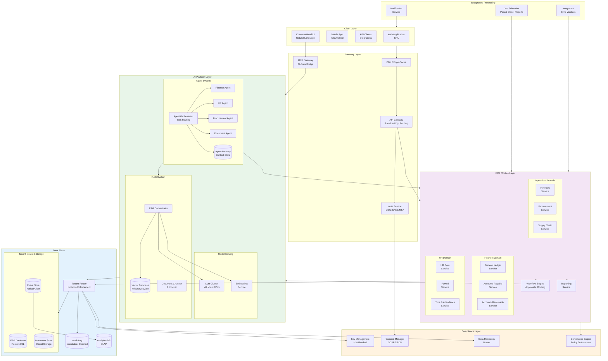
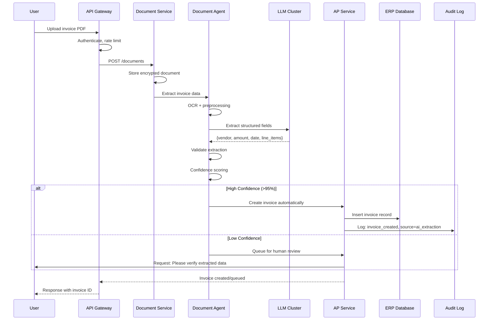
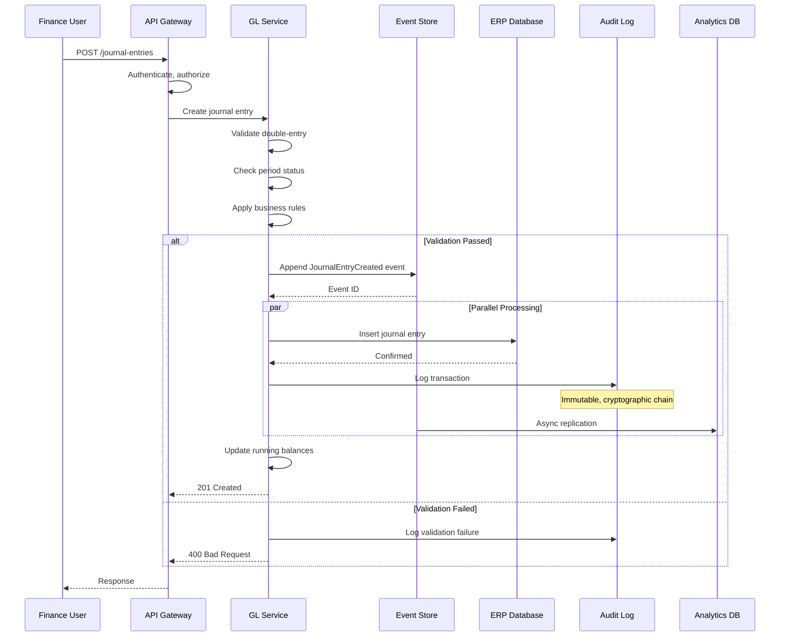
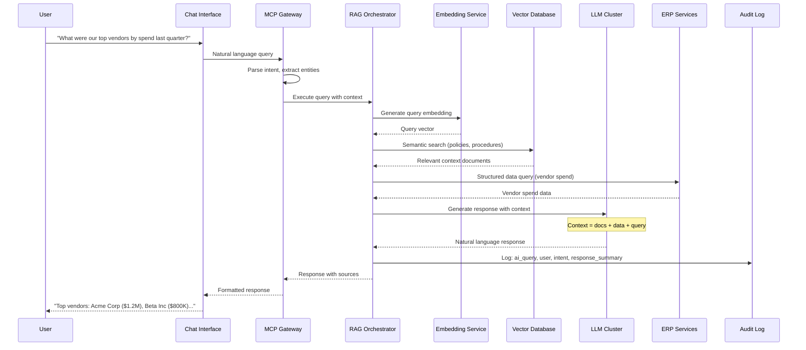
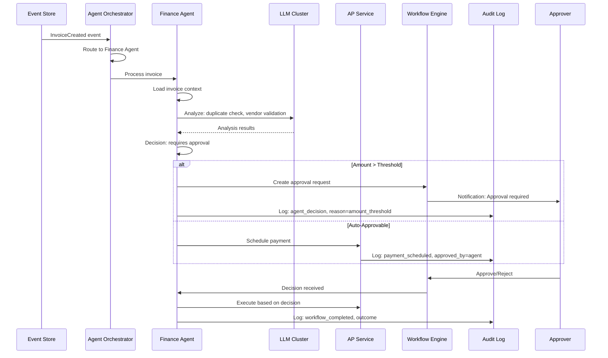
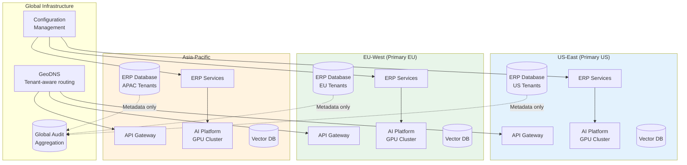

# High-Level Design

[Back to Index](./00-index.md)

---

## System Architecture Overview

The AI Native Cloud ERP is architected around three foundational principles: **AI-first design** where LLMs and agents are embedded throughout the system, **privacy-first isolation** ensuring tenant data never leaks across boundaries, and **compliance-first operations** with immutable audit trails and governance enforcement.

### Architecture Layers

| Layer | Responsibility | Key Components |
|-------|---------------|----------------|
| **Client Layer** | User interfaces, external integrations | Web app, mobile, API clients, conversational UI |
| **Gateway Layer** | Authentication, routing, rate limiting | API Gateway, Auth service, MCP server |
| **ERP Module Layer** | Core business logic | Finance, HR, SCM, Procurement, Inventory services |
| **AI Platform Layer** | Machine learning infrastructure | LLM serving, RAG engine, agent orchestrator |
| **Data Plane** | Persistent storage with isolation | Tenant-isolated databases, event store, document store |
| **Compliance Layer** | Privacy and regulatory enforcement | Key management, consent, data residency |

---

## Complete System Architecture



---

## Core Data Flows

### Flow 1: Invoice Processing with AI Extraction



### Flow 2: Financial Transaction with Audit Trail



### Flow 3: Conversational Query with RAG



### Flow 4: Autonomous Agent Workflow



---

## Component Overview

### ERP Module Layer

| Component | Responsibility | Scale | Technology |
|-----------|---------------|-------|------------|
| **General Ledger Service** | Chart of accounts, journal entries, trial balance | 500 TPS | Stateless, event-sourced |
| **Accounts Payable Service** | Invoices, payments, vendor management | 300 TPS | Stateless, workflow-integrated |
| **Accounts Receivable Service** | Customer invoices, receipts, aging | 300 TPS | Stateless, notification-enabled |
| **HR Core Service** | Employee records, org structure | 100 TPS | Stateless, RBAC-enforced |
| **Payroll Service** | Compensation, deductions, tax | 50 TPS (batch) | Stateless, compliance-aware |
| **Inventory Service** | Stock levels, movements, valuations | 400 TPS | Stateless, real-time |
| **Procurement Service** | POs, requisitions, vendor scoring | 200 TPS | Stateless, approval-integrated |
| **Supply Chain Service** | Orders, logistics, demand planning | 300 TPS | Stateless, external-integrated |

### AI Platform Layer

| Component | Responsibility | Scale | Technology |
|-----------|---------------|-------|------------|
| **LLM Cluster** | Model inference for all AI features | 320 QPS peak | vLLM on GPU cluster |
| **Embedding Service** | Text to vector conversion | 500 QPS | Dedicated embedding model |
| **RAG Orchestrator** | Query → retrieve → generate | 200 QPS | Stateless coordinator |
| **Vector Database** | Semantic search storage | 1M+ vectors/tenant | Milvus, Weaviate |
| **Agent Orchestrator** | Task routing, governance | 100 tasks/s | Stateful coordinator |
| **Agent Pool** | Specialized agents (Finance, HR, etc.) | 50 concurrent/agent | LangGraph, custom framework |
| **Agent Memory** | Conversation and task context | 10K sessions | Redis, persistent store |

### Data Plane

| Component | Responsibility | Consistency | Technology |
|-----------|---------------|-------------|------------|
| **ERP Database** | Transactional data (tenant-isolated) | Strong | PostgreSQL with RLS |
| **Event Store** | Append-only event log | Strong (per partition) | Kafka, Pulsar |
| **Document Store** | Files, PDFs, images | Eventual | Object storage (S3-compatible) |
| **Audit Log** | Immutable operation log | Strong, chained | Custom append-only store |
| **Analytics DB** | OLAP queries, reporting | Eventual | ClickHouse, BigQuery |
| **Vector Database** | RAG embeddings | Eventual | Milvus, Weaviate |

---

## Key Architectural Decisions

### Decision 1: Self-Hosted LLM vs Cloud AI APIs

| Option | Pros | Cons | Verdict |
|--------|------|------|---------|
| **Cloud AI APIs (OpenAI, etc.)** | No GPU management, latest models | Data leaves premises, compliance risk, latency, cost | Not acceptable for compliance |
| **Self-Hosted (vLLM)** | Data sovereignty, low latency, cost control | GPU infrastructure, model updates, operational overhead | **Recommended** |
| **Hybrid (sensitive on-prem, rest cloud)** | Balance of cost and privacy | Complex routing, two systems | Enterprise option |

**Recommendation**: Self-hosted vLLM cluster for all AI inference. Critical for compliance (SOC2, HIPAA) and data sovereignty requirements. Accept operational overhead in exchange for full control.

### Decision 2: Multi-Tenancy Model

| Option | Pros | Cons | Verdict |
|--------|------|------|---------|
| **Shared database, row-level security** | Cost-efficient, simpler operations | Noisy neighbor risk, complex isolation | SMB tier |
| **Shared database, schema per tenant** | Better isolation, moderate cost | Schema proliferation, migration complexity | Mid-market tier |
| **Database per tenant** | Maximum isolation, dedicated resources | High cost, complex operations | **Enterprise tier** |

**Recommendation**: Tiered approach based on customer segment:
- SMB: Shared database with row-level security + tenant-specific encryption keys
- Mid-market: Schema per tenant
- Enterprise: Dedicated database (optional dedicated GPU pool)

### Decision 3: Consistency Model

| Option | Pros | Cons | Verdict |
|--------|------|------|---------|
| **Strong consistency everywhere** | Always correct | High latency, lower availability, complex | Overkill |
| **Eventual consistency everywhere** | High performance, availability | Incorrect financial data risk | Not acceptable |
| **Hybrid (CQRS)** | Strong for writes, eventual for reads | Complexity, eventual read lag | **Recommended** |

**Recommendation**: Event sourcing with CQRS pattern:
- Strong consistency for all financial transactions (GL, AP, AR)
- Eventual consistency for read models (reports, analytics, dashboards)
- Real-time sync target: <1s for read model updates

### Decision 4: Agent Architecture

| Option | Pros | Cons | Verdict |
|--------|------|------|---------|
| **Single monolithic agent** | Simple, unified context | Limited specialization, hard to scale | Not recommended |
| **Peer-to-peer agents** | Flexible, decentralized | Complex coordination, inconsistent behavior | Risky |
| **Central orchestrator with specialized agents** | Clear governance, specialized capabilities | Orchestrator bottleneck | **Recommended** |

**Recommendation**: Central orchestrator pattern with specialized agents:
- Orchestrator handles task routing, governance enforcement, conflict resolution
- Specialized agents (Finance, HR, Procurement, Document) focus on domain expertise
- Agent Memory provides shared context across interactions
- All agent actions logged with explainability

### Decision 5: Data Residency Architecture

| Option | Pros | Cons | Verdict |
|--------|------|------|---------|
| **Single global region** | Simple, cost-effective | Compliance violations for regulated tenants | Not acceptable |
| **Multi-region with data routing** | Compliance, performance | Operational complexity, cross-region sync | **Recommended** |
| **Fully isolated regional deployments** | Maximum compliance | High cost, feature disparity, operational silos | For extreme cases |

**Recommendation**: Multi-region with intelligent data routing:
- Tenant configuration specifies data residency requirements
- Data plane routes reads/writes to compliant region
- Cross-region replication only for non-PII data (metrics, aggregates)
- AI inference in same region as data

---

## Architecture Pattern Checklist

| Pattern | Decision | Rationale |
|---------|----------|-----------|
| **Sync vs Async** | Sync for user requests, Async for AI/batch | Immediate feedback for users, efficient AI processing |
| **Event-driven vs Request-response** | Event-driven for internal, Request-response for API | Audit trails, decoupling, replay capability |
| **Push vs Pull** | Push for notifications, Pull for reports | Real-time alerts, on-demand heavy queries |
| **Stateless vs Stateful** | Stateless ERP services, Stateful agents | Horizontal scaling for ERP, context for agents |
| **Read-heavy vs Write-heavy** | Both (ERP writes, Analytics reads) | CQRS pattern for optimization |
| **Real-time vs Batch** | Real-time for transactions, Batch for close | User expectations, period-end requirements |
| **Edge vs Origin** | Edge for static, Origin for dynamic | Performance for assets, consistency for data |

---

## Multi-Region Deployment



### Regional Routing Strategy

| Tenant Location | Primary Region | Failover Region | AI Inference |
|-----------------|----------------|-----------------|--------------|
| Americas | US-East | US-West | Same region |
| Europe | EU-West | EU-North | Same region (GDPR) |
| India | Asia-Pacific (Mumbai) | Singapore | Same region (DPDP) |
| China | China (isolated) | None (regulatory) | Same region (PIPL) |
| Other APAC | Singapore | Tokyo | Same region |

---

## Technology Stack (Reference)

| Layer | Technology Options | Selection Criteria |
|-------|-------------------|-------------------|
| **API Gateway** | Kong, Envoy, custom | MCP support, rate limiting, observability |
| **Auth Service** | Keycloak, Auth0, custom | OIDC/SAML, MFA, SCIM |
| **ERP Services** | Any stateless framework | Team expertise, performance |
| **Workflow Engine** | Temporal, custom | Durability, visibility, versioning |
| **LLM Serving** | vLLM, TensorRT-LLM | Throughput, GPU efficiency |
| **Vector Database** | Milvus, Weaviate, Pinecone | Scale, hybrid search |
| **Agent Framework** | LangGraph, CrewAI, custom | Governance, observability |
| **ERP Database** | PostgreSQL, CockroachDB | ACID, RLS support |
| **Event Store** | Kafka, Pulsar | Durability, partitioning |
| **Object Storage** | S3-compatible, MinIO | Encryption, lifecycle |
| **Key Management** | Vault, Cloud HSM | FIPS 140-2, rotation |

---

## Failure Modes and Mitigations

| Failure Mode | Detection | Mitigation | Recovery Time |
|--------------|-----------|------------|---------------|
| **GPU cluster failure** | Health checks, inference timeouts | Queue requests, graceful degradation | < 5 minutes |
| **Single GPU failure** | Container crash, OOM | Pod restart, rebalance | < 30 seconds |
| **Database primary failure** | Replication lag, connection errors | Automatic failover to replica | < 30 seconds |
| **Event store partition failure** | Consumer lag, write failures | Failover to replica partition | < 10 seconds |
| **Agent orchestrator failure** | Task queue growth | Stateless restart, task replay | < 1 minute |
| **Vector DB failure** | Search timeouts | Fallback to keyword search | Immediate |
| **HSM failure** | Key operation timeouts | HSM cluster failover | < 10 seconds |
| **Regional outage** | Multi-region health checks | DNS failover to secondary region | < 5 minutes |

---

## Graceful Degradation Levels

```
Level 0: Full Operation
├── All ERP modules operational
├── All AI features available
├── Real-time agents processing
└── Full analytics and reporting

Level 1: AI Degraded
├── ERP modules fully operational
├── AI inference queued (higher latency)
├── Agents paused, manual workflows active
└── Reports may be delayed

Level 2: AI Unavailable
├── ERP modules fully operational
├── AI features disabled
├── All approvals require manual review
└── Document processing manual only

Level 3: Read-Only Mode
├── No new transactions
├── Read access to all data
├── Reports from cached data
└── Used during maintenance/recovery

Level 4: Emergency Mode
├── Critical reads only (balances, status)
├── Authentication still functional
├── Status page updates
└── Used during major outages
```

---

## Next Steps

- [Low-Level Design](./03-low-level-design.md) - Data model, API specifications, algorithms
