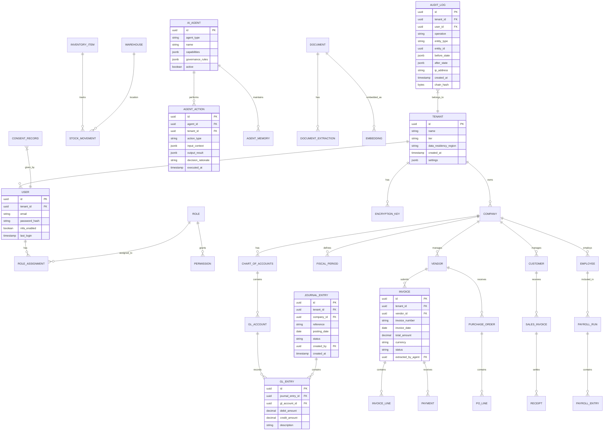

# Low-Level Design

[Back to Index](./00-index.md)

---

## Data Model

### Entity Relationship Diagram



---

## Core Schema Definitions

### Tenant & Identity

```
TABLE tenants (
    id              UUID PRIMARY KEY,
    name            VARCHAR(255) NOT NULL,
    tier            ENUM('smb', 'mid_market', 'enterprise'),
    status          ENUM('active', 'suspended', 'terminated'),
    data_residency  VARCHAR(50) NOT NULL,  -- 'us-east', 'eu-west', 'ap-south'
    settings        JSONB,                  -- tenant-specific configuration
    created_at      TIMESTAMP WITH TIME ZONE,
    updated_at      TIMESTAMP WITH TIME ZONE
);
-- Index: tier, status, data_residency

TABLE users (
    id              UUID PRIMARY KEY,
    tenant_id       UUID REFERENCES tenants(id),
    email           VARCHAR(255) NOT NULL,
    password_hash   VARCHAR(255),           -- Argon2id hash
    mfa_enabled     BOOLEAN DEFAULT false,
    mfa_secret      BYTEA,                  -- Encrypted TOTP secret
    status          ENUM('active', 'inactive', 'locked'),
    last_login      TIMESTAMP WITH TIME ZONE,
    created_at      TIMESTAMP WITH TIME ZONE
);
-- Index: (tenant_id, email) UNIQUE
-- Row-level security: tenant_id = current_tenant()

TABLE roles (
    id              UUID PRIMARY KEY,
    tenant_id       UUID REFERENCES tenants(id),
    name            VARCHAR(100) NOT NULL,
    permissions     JSONB NOT NULL,         -- Array of permission strings
    is_system       BOOLEAN DEFAULT false,  -- System roles cannot be deleted
    created_at      TIMESTAMP WITH TIME ZONE
);

TABLE role_assignments (
    user_id         UUID REFERENCES users(id),
    role_id         UUID REFERENCES roles(id),
    company_id      UUID,                   -- Optional company scope
    assigned_at     TIMESTAMP WITH TIME ZONE,
    assigned_by     UUID REFERENCES users(id),
    PRIMARY KEY (user_id, role_id, company_id)
);
```

### Finance Module

```
TABLE companies (
    id              UUID PRIMARY KEY,
    tenant_id       UUID REFERENCES tenants(id),
    name            VARCHAR(255) NOT NULL,
    legal_name      VARCHAR(255),
    currency        CHAR(3) NOT NULL,       -- ISO 4217
    fiscal_year_start SMALLINT DEFAULT 1,   -- Month (1-12)
    status          ENUM('active', 'inactive'),
    created_at      TIMESTAMP WITH TIME ZONE
);
-- Index: (tenant_id, name)

TABLE chart_of_accounts (
    id              UUID PRIMARY KEY,
    tenant_id       UUID REFERENCES tenants(id),
    company_id      UUID REFERENCES companies(id),
    name            VARCHAR(100) NOT NULL,
    version         INTEGER DEFAULT 1,
    created_at      TIMESTAMP WITH TIME ZONE
);

TABLE gl_accounts (
    id              UUID PRIMARY KEY,
    chart_id        UUID REFERENCES chart_of_accounts(id),
    account_number  VARCHAR(20) NOT NULL,
    name            VARCHAR(255) NOT NULL,
    account_type    ENUM('asset', 'liability', 'equity', 'revenue', 'expense'),
    parent_id       UUID REFERENCES gl_accounts(id),
    is_active       BOOLEAN DEFAULT true,
    created_at      TIMESTAMP WITH TIME ZONE
);
-- Index: (chart_id, account_number) UNIQUE

TABLE fiscal_periods (
    id              UUID PRIMARY KEY,
    company_id      UUID REFERENCES companies(id),
    period_name     VARCHAR(50) NOT NULL,   -- '2025-Q1', '2025-01'
    start_date      DATE NOT NULL,
    end_date        DATE NOT NULL,
    status          ENUM('open', 'closed', 'locked'),
    closed_at       TIMESTAMP WITH TIME ZONE,
    closed_by       UUID REFERENCES users(id)
);
-- Index: (company_id, start_date, end_date)

TABLE journal_entries (
    id              UUID PRIMARY KEY,
    tenant_id       UUID REFERENCES tenants(id),
    company_id      UUID REFERENCES companies(id),
    reference       VARCHAR(50) NOT NULL,
    posting_date    DATE NOT NULL,
    description     TEXT,
    status          ENUM('draft', 'posted', 'reversed'),
    source_type     VARCHAR(50),            -- 'manual', 'invoice', 'payroll', 'agent'
    source_id       UUID,                   -- Reference to source document
    created_by      UUID REFERENCES users(id),
    created_at      TIMESTAMP WITH TIME ZONE,
    posted_at       TIMESTAMP WITH TIME ZONE
);
-- Index: (tenant_id, company_id, posting_date)
-- Index: (tenant_id, reference)

TABLE gl_entries (
    id              UUID PRIMARY KEY,
    journal_entry_id UUID REFERENCES journal_entries(id),
    gl_account_id   UUID REFERENCES gl_accounts(id),
    debit_amount    DECIMAL(18, 4) DEFAULT 0,
    credit_amount   DECIMAL(18, 4) DEFAULT 0,
    description     VARCHAR(255),
    dimension_1     VARCHAR(50),            -- Cost center
    dimension_2     VARCHAR(50),            -- Project
    created_at      TIMESTAMP WITH TIME ZONE
);
-- Constraint: debit_amount = 0 OR credit_amount = 0 (mutually exclusive)
-- Index: (journal_entry_id)
-- Index: (gl_account_id, journal_entry_id)
```

### Accounts Payable

```
TABLE vendors (
    id              UUID PRIMARY KEY,
    tenant_id       UUID REFERENCES tenants(id),
    company_id      UUID REFERENCES companies(id),
    vendor_code     VARCHAR(50) NOT NULL,
    name            VARCHAR(255) NOT NULL,
    tax_id          VARCHAR(50),            -- Encrypted
    payment_terms   INTEGER DEFAULT 30,     -- Days
    default_gl_account UUID REFERENCES gl_accounts(id),
    status          ENUM('active', 'inactive', 'blocked'),
    ai_risk_score   DECIMAL(3, 2),          -- 0.00 to 1.00
    created_at      TIMESTAMP WITH TIME ZONE
);
-- Index: (tenant_id, company_id, vendor_code) UNIQUE

TABLE invoices (
    id              UUID PRIMARY KEY,
    tenant_id       UUID REFERENCES tenants(id),
    company_id      UUID REFERENCES companies(id),
    vendor_id       UUID REFERENCES vendors(id),
    invoice_number  VARCHAR(50) NOT NULL,
    invoice_date    DATE NOT NULL,
    due_date        DATE NOT NULL,
    currency        CHAR(3) NOT NULL,
    subtotal        DECIMAL(18, 4) NOT NULL,
    tax_amount      DECIMAL(18, 4) DEFAULT 0,
    total_amount    DECIMAL(18, 4) NOT NULL,
    status          ENUM('draft', 'pending_approval', 'approved', 'paid', 'cancelled'),
    extraction_confidence DECIMAL(3, 2),    -- AI confidence score
    extracted_by_agent UUID,                -- Agent that processed
    document_id     UUID,                   -- Link to source document
    journal_entry_id UUID REFERENCES journal_entries(id),
    created_at      TIMESTAMP WITH TIME ZONE,
    approved_at     TIMESTAMP WITH TIME ZONE,
    approved_by     UUID REFERENCES users(id)
);
-- Index: (tenant_id, company_id, invoice_number, vendor_id) UNIQUE
-- Index: (tenant_id, status, due_date)

TABLE invoice_lines (
    id              UUID PRIMARY KEY,
    invoice_id      UUID REFERENCES invoices(id),
    line_number     SMALLINT NOT NULL,
    description     TEXT NOT NULL,
    quantity        DECIMAL(12, 4) DEFAULT 1,
    unit_price      DECIMAL(18, 4) NOT NULL,
    amount          DECIMAL(18, 4) NOT NULL,
    gl_account_id   UUID REFERENCES gl_accounts(id),
    tax_code        VARCHAR(20)
);
-- Index: (invoice_id, line_number)

TABLE payments (
    id              UUID PRIMARY KEY,
    tenant_id       UUID REFERENCES tenants(id),
    invoice_id      UUID REFERENCES invoices(id),
    payment_date    DATE NOT NULL,
    amount          DECIMAL(18, 4) NOT NULL,
    payment_method  ENUM('check', 'ach', 'wire', 'card'),
    reference       VARCHAR(100),
    journal_entry_id UUID REFERENCES journal_entries(id),
    created_at      TIMESTAMP WITH TIME ZONE
);
```

### AI & Agent Tables

```
TABLE ai_agents (
    id              UUID PRIMARY KEY,
    agent_type      VARCHAR(50) NOT NULL,   -- 'finance', 'hr', 'procurement', 'document'
    name            VARCHAR(100) NOT NULL,
    description     TEXT,
    capabilities    JSONB NOT NULL,         -- List of capabilities
    governance_rules JSONB NOT NULL,        -- Approval thresholds, restrictions
    model_config    JSONB,                  -- LLM parameters
    is_active       BOOLEAN DEFAULT true,
    version         INTEGER DEFAULT 1,
    created_at      TIMESTAMP WITH TIME ZONE
);

TABLE agent_actions (
    id              UUID PRIMARY KEY,
    agent_id        UUID REFERENCES ai_agents(id),
    tenant_id       UUID REFERENCES tenants(id),
    session_id      UUID,                   -- Conversation/task session
    action_type     VARCHAR(100) NOT NULL,  -- 'extract_invoice', 'approve_payment', etc.
    input_context   JSONB NOT NULL,         -- What agent received
    output_result   JSONB NOT NULL,         -- What agent produced
    decision_rationale TEXT,                -- Explainable AI output
    confidence_score DECIMAL(3, 2),
    tokens_used     INTEGER,
    latency_ms      INTEGER,
    status          ENUM('success', 'failed', 'pending_review'),
    executed_at     TIMESTAMP WITH TIME ZONE
);
-- Index: (tenant_id, agent_id, executed_at)
-- Index: (session_id)

TABLE agent_memory (
    id              UUID PRIMARY KEY,
    agent_id        UUID REFERENCES ai_agents(id),
    tenant_id       UUID REFERENCES tenants(id),
    session_id      UUID NOT NULL,
    memory_type     ENUM('conversation', 'task', 'long_term'),
    content         JSONB NOT NULL,
    ttl_seconds     INTEGER,                -- Time to live
    created_at      TIMESTAMP WITH TIME ZONE,
    expires_at      TIMESTAMP WITH TIME ZONE
);
-- Index: (tenant_id, session_id, memory_type)

TABLE documents (
    id              UUID PRIMARY KEY,
    tenant_id       UUID REFERENCES tenants(id),
    company_id      UUID REFERENCES companies(id),
    file_name       VARCHAR(255) NOT NULL,
    file_type       VARCHAR(50) NOT NULL,   -- 'pdf', 'image', 'csv'
    file_size       BIGINT NOT NULL,
    storage_path    VARCHAR(500) NOT NULL,  -- Encrypted path
    content_hash    CHAR(64) NOT NULL,      -- SHA-256
    status          ENUM('uploaded', 'processing', 'processed', 'failed'),
    uploaded_by     UUID REFERENCES users(id),
    uploaded_at     TIMESTAMP WITH TIME ZONE
);
-- Index: (tenant_id, company_id, uploaded_at)
-- Index: (content_hash) for deduplication

TABLE document_extractions (
    id              UUID PRIMARY KEY,
    document_id     UUID REFERENCES documents(id),
    agent_id        UUID REFERENCES ai_agents(id),
    extraction_type VARCHAR(50) NOT NULL,   -- 'invoice', 'receipt', 'contract'
    extracted_data  JSONB NOT NULL,
    confidence_score DECIMAL(3, 2),
    human_verified  BOOLEAN DEFAULT false,
    verified_by     UUID REFERENCES users(id),
    extracted_at    TIMESTAMP WITH TIME ZONE
);

TABLE embeddings (
    id              UUID PRIMARY KEY,
    tenant_id       UUID REFERENCES tenants(id),
    source_type     VARCHAR(50) NOT NULL,   -- 'document', 'policy', 'faq'
    source_id       UUID NOT NULL,
    chunk_index     INTEGER NOT NULL,
    chunk_text      TEXT NOT NULL,
    embedding       VECTOR(1536),           -- For vector DB
    metadata        JSONB,
    created_at      TIMESTAMP WITH TIME ZONE
);
-- Vector index on embedding column
```

### Audit & Compliance

```
TABLE audit_logs (
    id              UUID PRIMARY KEY,
    tenant_id       UUID NOT NULL,
    user_id         UUID,
    agent_id        UUID,                   -- If action by AI agent
    operation       VARCHAR(50) NOT NULL,   -- 'create', 'update', 'delete', 'read'
    entity_type     VARCHAR(100) NOT NULL,
    entity_id       UUID NOT NULL,
    before_state    JSONB,                  -- State before change (redacted PII)
    after_state     JSONB,                  -- State after change (redacted PII)
    ip_address      INET,
    user_agent      VARCHAR(500),
    request_id      UUID,                   -- Correlation ID
    created_at      TIMESTAMP WITH TIME ZONE NOT NULL,
    chain_hash      BYTEA NOT NULL          -- HMAC for integrity
);
-- Append-only table (no UPDATE/DELETE allowed)
-- Partitioned by tenant_id and created_at
-- Index: (tenant_id, entity_type, entity_id, created_at)
-- Index: (tenant_id, user_id, created_at)

TABLE consent_records (
    id              UUID PRIMARY KEY,
    tenant_id       UUID REFERENCES tenants(id),
    user_id         UUID REFERENCES users(id),
    consent_type    VARCHAR(100) NOT NULL,  -- 'data_processing', 'marketing', 'ai_analysis'
    granted         BOOLEAN NOT NULL,
    version         VARCHAR(20) NOT NULL,   -- Policy version
    ip_address      INET,
    granted_at      TIMESTAMP WITH TIME ZONE,
    revoked_at      TIMESTAMP WITH TIME ZONE
);
-- Index: (tenant_id, user_id, consent_type)

TABLE encryption_keys (
    id              UUID PRIMARY KEY,
    tenant_id       UUID REFERENCES tenants(id),
    key_type        ENUM('dek', 'kek'),     -- Data Encryption Key, Key Encryption Key
    key_version     INTEGER NOT NULL,
    encrypted_key   BYTEA NOT NULL,         -- Encrypted by HSM
    algorithm       VARCHAR(50) NOT NULL,   -- 'AES-256-GCM'
    status          ENUM('active', 'rotating', 'archived'),
    created_at      TIMESTAMP WITH TIME ZONE,
    rotated_at      TIMESTAMP WITH TIME ZONE,
    expires_at      TIMESTAMP WITH TIME ZONE
);
-- Index: (tenant_id, key_type, status)
```

---

## Sharding and Partitioning Strategy

### Tenant-Based Sharding

```
SHARDING STRATEGY:

  Key: tenant_id
  Algorithm: Consistent hashing with virtual nodes

  Shard Distribution:
  ┌─────────────────────────────────────────────────┐
  │  Hash Ring (256 virtual nodes per physical)     │
  │                                                 │
  │  Shard 1: tenants A-F (33%)                     │
  │  Shard 2: tenants G-N (33%)                     │
  │  Shard 3: tenants O-Z (34%)                     │
  │                                                 │
  │  Enterprise tenants: Dedicated shard (optional) │
  └─────────────────────────────────────────────────┘

TENANT ROUTING PSEUDOCODE:

FUNCTION get_shard_for_tenant(tenant_id):
    hash = consistent_hash(tenant_id)

    // Check if enterprise tenant with dedicated shard
    IF is_enterprise_tenant(tenant_id):
        dedicated = get_dedicated_shard(tenant_id)
        IF dedicated EXISTS:
            RETURN dedicated

    // Route to shared shard based on hash
    shard_index = hash MOD number_of_shards
    RETURN shards[shard_index]

FUNCTION route_query(tenant_id, query):
    shard = get_shard_for_tenant(tenant_id)
    connection = get_connection(shard)

    // Inject tenant context for RLS
    connection.set("app.current_tenant", tenant_id)

    RETURN connection.execute(query)
```

### Time-Based Partitioning

```
PARTITIONING STRATEGY (Audit Logs, Events):

  Base Table: audit_logs
  Partition Key: (tenant_id, created_at)

  Partitions:
  ├── audit_logs_2025_q1 (Jan-Mar 2025)
  ├── audit_logs_2025_q2 (Apr-Jun 2025)
  ├── audit_logs_2025_q3 (Jul-Sep 2025)
  └── audit_logs_2025_q4 (Oct-Dec 2025)

  Retention:
  - Hot: Last 90 days (SSD)
  - Warm: 90 days - 1 year (HDD)
  - Cold: 1-7 years (Object storage)

PARTITION MANAGEMENT PSEUDOCODE:

FUNCTION create_partition_if_needed(table_name, date):
    quarter = get_quarter(date)
    partition_name = format("{table}_{year}_q{quarter}",
                            table_name, date.year, quarter)

    IF NOT partition_exists(partition_name):
        start_date = get_quarter_start(date)
        end_date = get_quarter_end(date)

        CREATE_PARTITION(
            parent=table_name,
            name=partition_name,
            range_start=start_date,
            range_end=end_date
        )

FUNCTION archive_old_partitions():
    FOR partition IN get_partitions_older_than(1_year):
        // Export to object storage
        export_to_object_storage(partition)

        // Verify export
        IF verify_export(partition):
            // Detach but keep metadata
            detach_partition(partition)

            // Log archival
            audit_log("partition_archived", partition.name)
```

---

## API Design

### REST API Structure

```
BASE URL: https://api.erp.example.com/v1

AUTHENTICATION:
  - Bearer token (JWT) for user requests
  - API key + signature for service-to-service
  - mTLS for internal services

COMMON HEADERS:
  X-Tenant-ID: <tenant_uuid>          (Required)
  X-Request-ID: <correlation_uuid>    (Required)
  X-Idempotency-Key: <key>            (For POST/PUT)
```

### Finance API Endpoints

```
JOURNAL ENTRIES:

POST   /finance/journal-entries
  Request:
    {
      "company_id": "uuid",
      "reference": "JE-2025-001",
      "posting_date": "2025-01-15",
      "description": "Monthly accruals",
      "lines": [
        {
          "account_number": "5000",
          "debit": 1000.00,
          "description": "Rent expense"
        },
        {
          "account_number": "2100",
          "credit": 1000.00,
          "description": "Accrued expenses"
        }
      ]
    }
  Response: 201 Created
    {
      "id": "uuid",
      "reference": "JE-2025-001",
      "status": "draft",
      "created_at": "2025-01-15T10:30:00Z"
    }

GET    /finance/journal-entries/{id}
GET    /finance/journal-entries?company_id=X&date_from=Y&date_to=Z
POST   /finance/journal-entries/{id}/post
POST   /finance/journal-entries/{id}/reverse

ACCOUNTS:

GET    /finance/accounts?company_id=X
GET    /finance/accounts/{id}
GET    /finance/accounts/{id}/balance?as_of_date=X

REPORTS:

POST   /finance/reports/trial-balance
  Request:
    {
      "company_id": "uuid",
      "as_of_date": "2025-01-31",
      "include_zero_balances": false
    }
  Response: 202 Accepted (async)
    {
      "report_id": "uuid",
      "status": "processing",
      "estimated_completion": "2025-01-31T10:35:00Z"
    }

GET    /finance/reports/{report_id}
GET    /finance/reports/{report_id}/download
```

### AI API Endpoints

```
DOCUMENT PROCESSING:

POST   /ai/documents/extract
  Request: multipart/form-data
    - file: <binary>
    - extraction_type: "invoice" | "receipt" | "contract"
    - company_id: "uuid"
  Response: 202 Accepted
    {
      "document_id": "uuid",
      "status": "processing",
      "estimated_time_seconds": 5
    }

GET    /ai/documents/{id}/extraction
  Response:
    {
      "document_id": "uuid",
      "extraction_type": "invoice",
      "confidence": 0.95,
      "extracted_data": {
        "vendor_name": "Acme Corp",
        "invoice_number": "INV-001",
        "date": "2025-01-10",
        "total": 1500.00,
        "line_items": [...]
      },
      "requires_review": false
    }

CONVERSATIONAL:

POST   /ai/chat
  Request:
    {
      "session_id": "uuid",  // Optional, for context
      "message": "What were our top 5 vendors by spend last quarter?",
      "company_id": "uuid"
    }
  Response:
    {
      "session_id": "uuid",
      "response": "Based on Q4 2024 data, your top vendors by spend were...",
      "sources": [
        {"type": "data", "query": "vendor_spend_q4_2024"},
        {"type": "document", "id": "uuid", "title": "Procurement Policy"}
      ],
      "suggested_actions": [
        {"action": "view_report", "label": "View full report"}
      ]
    }

AGENTS:

POST   /ai/agents/invoke
  Request:
    {
      "agent_type": "finance",
      "action": "analyze_invoice",
      "context": {
        "invoice_id": "uuid"
      }
    }
  Response:
    {
      "action_id": "uuid",
      "status": "completed",
      "result": {
        "duplicate_check": "passed",
        "vendor_valid": true,
        "amount_within_threshold": true,
        "recommendation": "auto_approve",
        "rationale": "Invoice matches PO, vendor active, amount under $5000 limit"
      }
    }

GET    /ai/agents/actions?tenant_id=X&date_from=Y
```

### MCP Integration Endpoints

```
MCP (Model Context Protocol) SERVER:

// Tool Discovery
GET    /mcp/tools
  Response:
    {
      "tools": [
        {
          "name": "query_vendor_spend",
          "description": "Query vendor spending for a time period",
          "parameters": {
            "company_id": "string",
            "date_from": "date",
            "date_to": "date",
            "vendor_id": "string (optional)"
          }
        },
        {
          "name": "create_journal_entry",
          "description": "Create a new journal entry",
          "parameters": {...}
        }
      ]
    }

// Tool Invocation
POST   /mcp/invoke
  Request:
    {
      "tool": "query_vendor_spend",
      "arguments": {
        "company_id": "uuid",
        "date_from": "2024-10-01",
        "date_to": "2024-12-31"
      }
    }
  Response:
    {
      "result": {
        "vendors": [
          {"name": "Acme Corp", "total_spend": 150000.00},
          {"name": "Beta Inc", "total_spend": 80000.00}
        ],
        "period": "Q4 2024",
        "total": 230000.00
      }
    }

// Resource Access
GET    /mcp/resources/vendors/{id}
GET    /mcp/resources/invoices/{id}
```

---

## Core Algorithms

### RAG Pipeline

```
ALGORITHM: Retrieval-Augmented Generation Pipeline

INPUT:
  - query: User's natural language query
  - tenant_id: Tenant context
  - company_id: Company context (optional)

OUTPUT:
  - response: Generated answer
  - sources: List of source documents/data

PSEUDOCODE:

FUNCTION rag_pipeline(query, tenant_id, company_id):

    // Step 1: Query Understanding
    intent = classify_intent(query)
    entities = extract_entities(query)

    // Step 2: Generate Query Embedding
    query_embedding = embedding_model.encode(query)

    // Step 3: Retrieve Relevant Context

    // 3a: Vector search for documents
    doc_results = vector_db.search(
        embedding=query_embedding,
        filter={
            "tenant_id": tenant_id,
            "company_id": company_id
        },
        top_k=5,
        min_score=0.7
    )

    // 3b: Structured data retrieval based on intent
    IF intent.requires_data:
        data_query = generate_data_query(intent, entities, company_id)
        data_results = execute_query(data_query, tenant_id)
    ELSE:
        data_results = []

    // Step 4: Context Assembly
    context = assemble_context(
        documents=doc_results,
        data=data_results,
        max_tokens=4000  // Leave room for query and response
    )

    // Step 5: Generate Response
    prompt = format_prompt(
        system="You are an ERP assistant. Answer based only on provided context.",
        context=context,
        query=query
    )

    response = llm.generate(
        prompt=prompt,
        max_tokens=1000,
        temperature=0.1  // Low temperature for factual responses
    )

    // Step 6: Extract Sources
    sources = extract_sources(doc_results, data_results)

    // Step 7: Log for Audit
    log_ai_action(
        tenant_id=tenant_id,
        action="rag_query",
        input=query,
        output=response,
        sources=sources
    )

    RETURN {
        "response": response,
        "sources": sources,
        "confidence": calculate_confidence(doc_results)
    }

FUNCTION assemble_context(documents, data, max_tokens):
    context_parts = []
    current_tokens = 0

    // Prioritize data results
    IF data:
        data_text = format_as_text(data)
        data_tokens = count_tokens(data_text)
        IF current_tokens + data_tokens <= max_tokens:
            context_parts.append("## Relevant Data\n" + data_text)
            current_tokens += data_tokens

    // Add document chunks by relevance
    FOR doc IN sorted(documents, by="score", descending=TRUE):
        doc_tokens = count_tokens(doc.text)
        IF current_tokens + doc_tokens <= max_tokens:
            context_parts.append("## From: " + doc.title + "\n" + doc.text)
            current_tokens += doc_tokens
        ELSE:
            BREAK

    RETURN "\n\n".join(context_parts)
```

### Agent Orchestration

```
ALGORITHM: Multi-Agent Task Orchestration

INPUT:
  - event: Triggering event (e.g., InvoiceCreated)
  - tenant_id: Tenant context

OUTPUT:
  - actions: List of actions taken
  - status: Final status

PSEUDOCODE:

FUNCTION orchestrate_agents(event, tenant_id):

    // Step 1: Load Governance Rules
    governance = load_governance_rules(tenant_id)

    // Step 2: Select Appropriate Agent
    agent = select_agent(event.type)

    IF agent IS NULL:
        RETURN {"status": "no_handler", "actions": []}

    // Step 3: Load Context
    context = load_context(
        tenant_id=tenant_id,
        event=event,
        memory=load_agent_memory(agent.id, event.session_id)
    )

    // Step 4: Plan Actions
    action_plan = agent.plan(context)

    // Step 5: Governance Check
    FOR action IN action_plan.actions:
        approval = check_governance(action, governance)

        IF approval.requires_human:
            // Queue for human approval
            queue_for_approval(action, approval.approvers)
            action.status = "pending_approval"
        ELSE IF approval.denied:
            action.status = "denied"
            action.reason = approval.reason
        ELSE:
            action.status = "approved"

    // Step 6: Execute Approved Actions
    executed_actions = []
    FOR action IN action_plan.actions:
        IF action.status == "approved":
            TRY:
                result = execute_action(action, context)
                action.result = result
                action.status = "completed"
            CATCH error:
                action.status = "failed"
                action.error = error

            executed_actions.append(action)

            // Log action for audit
            log_agent_action(
                agent_id=agent.id,
                tenant_id=tenant_id,
                action=action,
                rationale=action_plan.rationale
            )

    // Step 7: Update Memory
    update_agent_memory(
        agent_id=agent.id,
        session_id=event.session_id,
        context=context,
        actions=executed_actions
    )

    RETURN {
        "status": determine_overall_status(executed_actions),
        "actions": executed_actions
    }

FUNCTION check_governance(action, governance):
    rules = governance.get_rules_for(action.type)

    FOR rule IN rules:
        IF rule.type == "threshold":
            IF action.amount > rule.limit:
                RETURN ApprovalRequired(rule.approvers)

        ELSE IF rule.type == "vendor_new":
            IF action.vendor.created_days_ago < 30:
                RETURN ApprovalRequired(rule.approvers)

        ELSE IF rule.type == "sensitive_field":
            IF action.modifies_field IN rule.fields:
                RETURN ApprovalRequired(rule.approvers)

        ELSE IF rule.type == "blacklist":
            IF action.target IN rule.blocked_entities:
                RETURN Denied(rule.reason)

    RETURN Approved()
```

### Double-Entry Bookkeeping Validation

```
ALGORITHM: Journal Entry Validation

INPUT:
  - journal_entry: Journal entry with line items
  - tenant_id: Tenant context
  - company_id: Company context

OUTPUT:
  - valid: Boolean
  - errors: List of validation errors

PSEUDOCODE:

FUNCTION validate_journal_entry(journal_entry, tenant_id, company_id):
    errors = []

    // Rule 1: Double-entry must balance
    total_debits = SUM(line.debit_amount FOR line IN journal_entry.lines)
    total_credits = SUM(line.credit_amount FOR line IN journal_entry.lines)

    IF ABS(total_debits - total_credits) > 0.01:  // Allow 1 cent rounding
        errors.append({
            "code": "UNBALANCED",
            "message": "Debits ($" + total_debits + ") != Credits ($" + total_credits + ")"
        })

    // Rule 2: Period must be open
    period = get_fiscal_period(company_id, journal_entry.posting_date)
    IF period IS NULL:
        errors.append({
            "code": "NO_PERIOD",
            "message": "No fiscal period for date " + journal_entry.posting_date
        })
    ELSE IF period.status != "open":
        errors.append({
            "code": "PERIOD_CLOSED",
            "message": "Fiscal period " + period.name + " is " + period.status
        })

    // Rule 3: All accounts must exist and be active
    FOR line IN journal_entry.lines:
        account = get_account(company_id, line.account_number)
        IF account IS NULL:
            errors.append({
                "code": "INVALID_ACCOUNT",
                "message": "Account " + line.account_number + " not found"
            })
        ELSE IF NOT account.is_active:
            errors.append({
                "code": "INACTIVE_ACCOUNT",
                "message": "Account " + line.account_number + " is inactive"
            })

    // Rule 4: Each line must have debit XOR credit
    FOR line IN journal_entry.lines:
        IF line.debit_amount > 0 AND line.credit_amount > 0:
            errors.append({
                "code": "BOTH_DEBIT_CREDIT",
                "message": "Line cannot have both debit and credit"
            })
        IF line.debit_amount == 0 AND line.credit_amount == 0:
            errors.append({
                "code": "ZERO_AMOUNT",
                "message": "Line must have debit or credit > 0"
            })

    // Rule 5: Reference must be unique in period
    existing = find_journal_entry(company_id, journal_entry.reference, period.id)
    IF existing IS NOT NULL AND existing.id != journal_entry.id:
        errors.append({
            "code": "DUPLICATE_REFERENCE",
            "message": "Reference " + journal_entry.reference + " already exists"
        })

    RETURN {
        "valid": LEN(errors) == 0,
        "errors": errors
    }
```

### Anomaly Detection

```
ALGORITHM: Financial Anomaly Detection

INPUT:
  - transaction: New transaction to analyze
  - tenant_id: Tenant context
  - company_id: Company context

OUTPUT:
  - anomalies: List of detected anomalies
  - risk_score: Overall risk score (0.0 - 1.0)

PSEUDOCODE:

FUNCTION detect_anomalies(transaction, tenant_id, company_id):
    anomalies = []

    // Load historical patterns
    vendor_history = get_vendor_history(
        company_id=company_id,
        vendor_id=transaction.vendor_id,
        months=12
    )

    account_history = get_account_history(
        company_id=company_id,
        account_id=transaction.account_id,
        months=12
    )

    // Check 1: Amount deviation from vendor average
    IF vendor_history.transaction_count > 10:
        z_score = (transaction.amount - vendor_history.avg_amount) / vendor_history.std_amount
        IF ABS(z_score) > 3:
            anomalies.append({
                "type": "amount_deviation",
                "severity": "high" IF z_score > 4 ELSE "medium",
                "message": "Amount $" + transaction.amount + " is " + z_score + " std devs from vendor average",
                "context": {
                    "avg": vendor_history.avg_amount,
                    "std": vendor_history.std_amount
                }
            })

    // Check 2: Unusual timing
    transaction_hour = transaction.created_at.hour
    IF transaction_hour < 6 OR transaction_hour > 22:
        IF NOT is_batch_job(transaction.source):
            anomalies.append({
                "type": "unusual_timing",
                "severity": "low",
                "message": "Transaction created at unusual hour: " + transaction_hour
            })

    // Check 3: Round number amounts (potential fraud indicator)
    IF transaction.amount > 1000 AND transaction.amount % 1000 == 0:
        anomalies.append({
            "type": "round_amount",
            "severity": "low",
            "message": "Suspiciously round amount: $" + transaction.amount
        })

    // Check 4: New vendor with large transaction
    IF vendor_history.days_since_first_transaction < 30:
        IF transaction.amount > tenant_settings.new_vendor_threshold:
            anomalies.append({
                "type": "new_vendor_large_amount",
                "severity": "high",
                "message": "New vendor (<30 days) with large transaction",
                "context": {
                    "vendor_age_days": vendor_history.days_since_first_transaction,
                    "amount": transaction.amount
                }
            })

    // Check 5: Duplicate detection
    recent_similar = find_similar_transactions(
        vendor_id=transaction.vendor_id,
        amount=transaction.amount,
        date_range=7  // days
    )
    IF LEN(recent_similar) > 0:
        anomalies.append({
            "type": "potential_duplicate",
            "severity": "medium",
            "message": "Similar transaction found within 7 days",
            "context": {
                "similar_ids": [t.id FOR t IN recent_similar]
            }
        })

    // Check 6: Account pattern deviation
    IF NOT matches_expected_pattern(account_history, transaction):
        anomalies.append({
            "type": "account_pattern_deviation",
            "severity": "medium",
            "message": "Transaction pattern unusual for this account"
        })

    // Calculate overall risk score
    severity_weights = {"high": 0.5, "medium": 0.3, "low": 0.1}
    risk_score = MIN(1.0, SUM(
        severity_weights[a.severity] FOR a IN anomalies
    ))

    // Log for audit and model improvement
    log_anomaly_detection(
        transaction_id=transaction.id,
        tenant_id=tenant_id,
        anomalies=anomalies,
        risk_score=risk_score
    )

    RETURN {
        "anomalies": anomalies,
        "risk_score": risk_score,
        "requires_review": risk_score > 0.5
    }
```

---

## Indexing Strategy

### Primary Indexes

```
ERP DATABASE INDEXES:

-- Tenant isolation (all queries filtered by tenant)
CREATE INDEX idx_users_tenant ON users(tenant_id);
CREATE INDEX idx_invoices_tenant ON invoices(tenant_id);
CREATE INDEX idx_journal_entries_tenant ON journal_entries(tenant_id);

-- Common query patterns
CREATE INDEX idx_invoices_status_due ON invoices(tenant_id, status, due_date);
CREATE INDEX idx_journal_entries_date ON journal_entries(tenant_id, company_id, posting_date);
CREATE INDEX idx_gl_entries_account ON gl_entries(gl_account_id, journal_entry_id);

-- Full-text search
CREATE INDEX idx_documents_content ON documents USING GIN(to_tsvector('english', content));

-- Unique constraints
CREATE UNIQUE INDEX idx_invoices_unique ON invoices(tenant_id, company_id, vendor_id, invoice_number);
CREATE UNIQUE INDEX idx_accounts_unique ON gl_accounts(chart_id, account_number);
```

### Vector Indexes

```
VECTOR DATABASE INDEXES (Milvus/Weaviate):

Collection: document_embeddings
  - Index type: HNSW (Hierarchical Navigable Small World)
  - Metric: Cosine similarity
  - Parameters:
    - M: 16 (connections per node)
    - efConstruction: 200 (build-time accuracy)
    - efSearch: 100 (query-time accuracy)

Filtering fields (for partition pruning):
  - tenant_id (partition key)
  - company_id
  - document_type
  - created_at
```

---

## Next Steps

- [Deep Dive & Bottlenecks](./04-deep-dive-and-bottlenecks.md) - Critical components analysis
