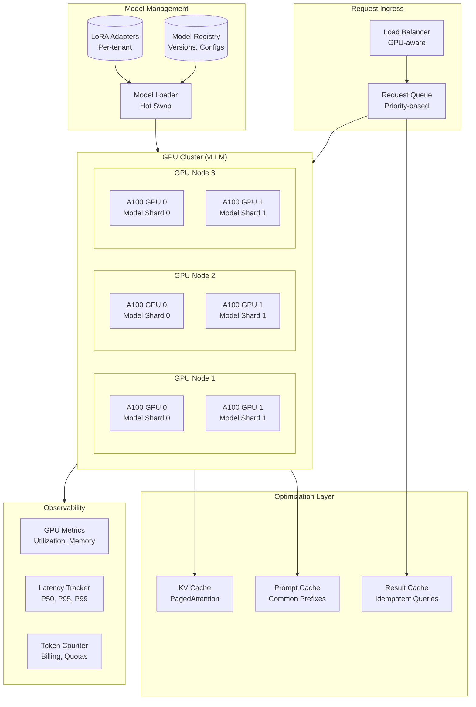
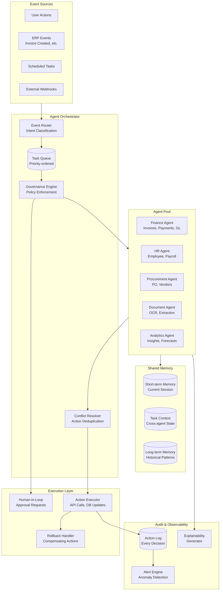

# Deep Dive and Bottlenecks

[Back to Index](./00-index.md)

---

## Overview

This document provides detailed analysis of three critical components that define the AI Native Cloud ERP's unique architectural challenges:

1. **Self-Hosted LLM Serving Infrastructure** - GPU cluster management, model serving at scale
2. **Multi-Agent Orchestration Engine** - Agent coordination, governance, shared context
3. **Tenant Data Isolation & Encryption** - Cryptographic guarantees, key management

Each deep dive covers internal architecture, failure modes, and mitigation strategies.

---

## Deep Dive 1: Self-Hosted LLM Serving Infrastructure

### Why This Is Critical

Self-hosted LLM serving is the foundation of the AI-native architecture. Unlike cloud AI APIs:
- **Data never leaves tenant boundary** - critical for compliance
- **Predictable latency** - no external network hops
- **Cost control** - amortized GPU investment vs per-token pricing
- **Customization** - fine-tuned models per tenant or domain

However, it introduces significant infrastructure complexity.

### Internal Architecture



### vLLM with PagedAttention

```
PAGEDATTENTION MECHANISM:

Traditional Attention:
  ┌─────────────────────────────────────────────────────┐
  │  Contiguous KV Cache per request                    │
  │  Memory: O(batch_size × seq_length × hidden_dim)    │
  │  Problem: Memory fragmentation, wasted space        │
  └─────────────────────────────────────────────────────┘

PagedAttention (vLLM):
  ┌─────────────────────────────────────────────────────┐
  │  Virtual Memory Pages for KV Cache                  │
  │                                                     │
  │  Page Table:                                        │
  │  Request A: [Page 1] → [Page 5] → [Page 12]        │
  │  Request B: [Page 2] → [Page 3] → [Page 7]         │
  │  Request C: [Page 4] → [Page 8] → [Page 9]         │
  │                                                     │
  │  Benefits:                                          │
  │  - No contiguous memory required                   │
  │  - Share pages for common prefixes (prompt cache)  │
  │  - Dynamic allocation as sequence grows            │
  │  - 2-4x more concurrent requests                   │
  └─────────────────────────────────────────────────────┘

CONFIGURATION PARAMETERS:

  gpu_memory_utilization: 0.85      // Leave headroom for spikes
  max_num_batched_tokens: 8192      // Continuous batching window
  max_num_seqs: 256                 // Max concurrent sequences
  block_size: 16                    // Tokens per page
  swap_space: 4GB                   // CPU swap for overflow
```

### GPU Cluster Management

```
MULTI-TENANT GPU ALLOCATION:

Strategy: Time-sliced sharing with priority queues

┌────────────────────────────────────────────────────────────┐
│  GPU Resource Pool (NVIDIA Run:ai / Kubernetes)           │
│                                                            │
│  Priority Queues:                                          │
│  ┌──────────────────────────────────────────────────────┐ │
│  │  P0 (Interactive): 50% guaranteed, 100% burst        │ │
│  │  - User-facing queries, chat                         │ │
│  │  - Latency SLO: <2s                                  │ │
│  └──────────────────────────────────────────────────────┘ │
│  ┌──────────────────────────────────────────────────────┐ │
│  │  P1 (Agent): 30% guaranteed, 80% burst               │ │
│  │  - Agent actions, document processing                │ │
│  │  - Latency SLO: <10s                                 │ │
│  └──────────────────────────────────────────────────────┘ │
│  ┌──────────────────────────────────────────────────────┐ │
│  │  P2 (Batch): 20% guaranteed, 50% burst               │ │
│  │  - Embedding generation, bulk processing             │ │
│  │  - Latency SLO: best effort                          │ │
│  └──────────────────────────────────────────────────────┘ │
│                                                            │
│  Tenant Quotas (Enterprise tier):                          │
│  - Dedicated GPU fraction: 10% minimum                    │
│  - Burst: up to available capacity                        │
│  - Tokens/day limit: configurable                         │
└────────────────────────────────────────────────────────────┘

AUTOSCALING LOGIC:

FUNCTION autoscale_gpu_cluster():
    metrics = get_cluster_metrics()

    // Scale up triggers
    IF metrics.queue_depth > threshold_high:
        IF metrics.avg_latency_p95 > slo_latency:
            add_gpu_nodes(calculate_needed())
            RETURN "scaled_up"

    // Scale down triggers (with hysteresis)
    IF metrics.gpu_utilization < 30% FOR 15_minutes:
        IF metrics.queue_depth < threshold_low:
            remove_gpu_nodes(1)  // Gradual scale down
            RETURN "scaled_down"

    RETURN "no_change"
```

### Model Loading Strategy

```
MODEL LOADING ARCHITECTURE:

Base Model (Pre-loaded):
  - 70B parameter model sharded across GPUs
  - Loaded at cluster startup
  - Takes 5-10 minutes to load

LoRA Adapters (On-demand):
  - Lightweight adapters (< 100MB each)
  - Tenant-specific or domain-specific
  - Hot-swappable in <1 second

PSEUDOCODE:

FUNCTION load_model_for_request(request):
    base_model = get_cached_base_model()

    IF request.tenant.has_custom_adapter:
        adapter = adapter_cache.get(request.tenant.adapter_id)

        IF adapter IS NULL:
            // Load from storage (async, with timeout)
            adapter = load_adapter_from_storage(request.tenant.adapter_id)
            adapter_cache.put(request.tenant.adapter_id, adapter)

        RETURN merge_adapter(base_model, adapter)

    RETURN base_model

FUNCTION merge_adapter(base_model, adapter):
    // LoRA: W' = W + BA where B and A are low-rank matrices
    // Merge is lightweight - just pointer updates
    merged = base_model.clone_with_adapter(adapter)
    RETURN merged
```

### Failure Modes and Mitigations

| Failure Mode | Detection | Impact | Mitigation | Recovery Time |
|--------------|-----------|--------|------------|---------------|
| **GPU OOM** | CUDA error, process crash | Single request fails | Request retry, reduce batch size | Immediate |
| **GPU hardware failure** | Health check timeout | Reduced capacity | Pod rescheduling, node drain | 1-5 minutes |
| **Model corruption** | Inference produces garbage | All requests on GPU fail | Reload model from registry | 5-10 minutes |
| **KV cache exhaustion** | Queue growth, latency spike | New requests queued | Scale up, request shedding | 2-5 minutes |
| **Network partition** | GPU node unreachable | Reduced capacity | Route to healthy nodes | Immediate |
| **Cluster-wide outage** | All GPU health checks fail | AI features unavailable | Graceful degradation to manual | Variable |

```
GRACEFUL DEGRADATION PSEUDOCODE:

FUNCTION handle_ai_request(request):
    TRY:
        result = gpu_cluster.inference(request, timeout=5s)
        RETURN result

    CATCH GpuTimeoutError:
        // Queue for later if acceptable
        IF request.can_be_queued:
            queue_for_later(request)
            RETURN {"status": "queued", "estimated_wait": "5 minutes"}
        ELSE:
            RETURN fallback_response(request)

    CATCH GpuUnavailableError:
        // Full degradation
        notify_user("AI features temporarily unavailable")
        log_incident("gpu_cluster_unavailable")

        IF request.type == "document_extraction":
            RETURN {"status": "manual_required",
                    "message": "Please enter data manually"}

        ELSE IF request.type == "chat":
            RETURN {"status": "unavailable",
                    "message": "AI assistant temporarily unavailable"}
```

---

## Deep Dive 2: Multi-Agent Orchestration Engine

### Why This Is Critical

Multi-agent orchestration transforms the ERP from a passive data repository into an active automation platform. Key challenges:
- **Agent coordination** - Multiple specialized agents must work together
- **Governance enforcement** - Agents must respect approval thresholds and policies
- **Shared context** - Agents need consistent view of ongoing work
- **Explainability** - Every agent decision must be auditable

### Internal Architecture



### Agent Registry and Capability Discovery

```
AGENT REGISTRY SCHEMA:

agents:
  finance_agent:
    name: "Finance Agent"
    version: "2.1.0"
    capabilities:
      - "analyze_invoice"
      - "detect_duplicate"
      - "validate_vendor"
      - "recommend_approval"
      - "schedule_payment"
      - "reconcile_accounts"
    governance:
      max_auto_approve_amount: 5000
      requires_human_for:
        - "new_vendor_payment"
        - "amount_above_threshold"
        - "unusual_timing"
      restricted_actions:
        - "delete_transaction"
        - "modify_posted_entry"
    model_config:
      base_model: "llama-70b"
      adapter: "finance-v2"
      temperature: 0.1
      max_tokens: 2000

  document_agent:
    name: "Document Agent"
    version: "1.5.0"
    capabilities:
      - "extract_invoice_fields"
      - "extract_receipt_fields"
      - "classify_document"
      - "detect_anomalies"
    governance:
      confidence_threshold: 0.85
      requires_human_for:
        - "low_confidence_extraction"
        - "new_document_type"
    model_config:
      base_model: "llama-70b"
      adapter: "document-extraction-v3"

CAPABILITY DISCOVERY PSEUDOCODE:

FUNCTION find_agent_for_task(task):
    required_capability = map_task_to_capability(task.type)

    candidates = []
    FOR agent IN agent_registry:
        IF required_capability IN agent.capabilities:
            IF agent.is_active AND agent.is_healthy:
                candidates.append(agent)

    IF LEN(candidates) == 0:
        RAISE NoAgentAvailable(task.type)

    // Select best candidate (version, load, specialization)
    RETURN select_best_agent(candidates, task.context)
```

### Task Delegation and Handoff Protocol

```
TASK STATE MACHINE:

    ┌─────────────┐
    │   CREATED   │
    └──────┬──────┘
           │ assign_agent()
           ▼
    ┌─────────────┐
    │  ASSIGNED   │
    └──────┬──────┘
           │ start_execution()
           ▼
    ┌─────────────┐     governance_check()     ┌─────────────┐
    │  EXECUTING  │ ─────────────────────────► │PENDING_HUMAN│
    └──────┬──────┘                            └──────┬──────┘
           │                                          │ human_decision()
           │ complete() / fail()                      │
           ▼                                          ▼
    ┌─────────────┐                            ┌─────────────┐
    │  COMPLETED  │ ◄──────────────────────────│  APPROVED   │
    └─────────────┘                            └─────────────┘
           │
           │ handoff_required()
           ▼
    ┌─────────────┐
    │  HANDOFF    │ ──► assign_next_agent() ──► ASSIGNED
    └─────────────┘

HANDOFF PROTOCOL PSEUDOCODE:

FUNCTION execute_with_handoff(task, primary_agent):
    // Execute primary agent
    result = primary_agent.execute(task)

    // Check if handoff needed
    IF result.requires_handoff:
        handoff_context = {
            "original_task": task,
            "primary_result": result.partial_result,
            "handoff_reason": result.handoff_reason,
            "relevant_memory": get_task_memory(task.id)
        }

        next_agent = find_agent_for_task(result.handoff_task)

        IF next_agent IS NULL:
            // Queue for human
            RETURN queue_for_human(task, handoff_context)

        // Create subtask with context
        subtask = create_subtask(
            parent=task,
            agent=next_agent,
            context=handoff_context
        )

        // Execute recursively
        subtask_result = execute_with_handoff(subtask, next_agent)

        // Merge results
        RETURN merge_results(result, subtask_result)

    RETURN result
```

### Shared Context and Memory Management

```
MEMORY ARCHITECTURE:

┌─────────────────────────────────────────────────────────────┐
│  Short-Term Memory (Redis)                                  │
│  TTL: 1 hour                                                │
│  Content: Current conversation, immediate context           │
│                                                             │
│  Key: session:{session_id}:context                          │
│  Value: {                                                   │
│    "messages": [...],                                       │
│    "current_task": {...},                                   │
│    "entities_mentioned": [...],                             │
│    "pending_actions": [...]                                 │
│  }                                                          │
└─────────────────────────────────────────────────────────────┘

┌─────────────────────────────────────────────────────────────┐
│  Task Context (PostgreSQL + Redis)                          │
│  TTL: Until task completion + 24 hours                      │
│  Content: Cross-agent state for multi-step tasks            │
│                                                             │
│  Table: task_contexts                                       │
│  Columns: task_id, agent_chain, state, created_at           │
└─────────────────────────────────────────────────────────────┘

┌─────────────────────────────────────────────────────────────┐
│  Long-Term Memory (PostgreSQL + Vector DB)                  │
│  TTL: Configurable per tenant (default: 90 days)            │
│  Content: Historical patterns, preferences, learnings       │
│                                                             │
│  Uses: Pattern recognition, personalization                 │
│  Privacy: Aggregated/anonymized where possible              │
└─────────────────────────────────────────────────────────────┘

MEMORY ACCESS PSEUDOCODE:

FUNCTION get_agent_context(agent_id, task):
    context = {}

    // Layer 1: Short-term (current session)
    IF task.session_id:
        session_context = redis.get(f"session:{task.session_id}:context")
        context["session"] = session_context

    // Layer 2: Task context (cross-agent state)
    IF task.parent_task_id:
        task_context = db.query(
            "SELECT state FROM task_contexts WHERE task_id = ?",
            task.parent_task_id
        )
        context["task"] = task_context

    // Layer 3: Long-term (historical patterns)
    IF agent.uses_long_term_memory:
        historical = vector_db.search(
            query=task.description,
            filter={"tenant_id": task.tenant_id},
            top_k=5
        )
        context["historical"] = historical

    // Layer 4: Tenant-specific context
    tenant_context = get_tenant_preferences(task.tenant_id)
    context["tenant"] = tenant_context

    RETURN context
```

### Governance Enforcement

```
GOVERNANCE ENGINE:

┌─────────────────────────────────────────────────────────────┐
│  Rule Categories                                            │
│                                                             │
│  1. THRESHOLD RULES                                         │
│     - Amount limits by action type                          │
│     - Volume limits per time period                         │
│                                                             │
│  2. ENTITY RULES                                            │
│     - New vendor restrictions                               │
│     - Sensitive account access                              │
│                                                             │
│  3. TEMPORAL RULES                                          │
│     - Business hours enforcement                            │
│     - Period close restrictions                             │
│                                                             │
│  4. BEHAVIORAL RULES                                        │
│     - Anomaly detection triggers                            │
│     - Pattern deviation alerts                              │
│                                                             │
│  5. COMPLIANCE RULES                                        │
│     - Segregation of duties                                 │
│     - Regulatory requirements                               │
└─────────────────────────────────────────────────────────────┘

GOVERNANCE CHECK PSEUDOCODE:

FUNCTION check_governance(action, agent, context):
    tenant_rules = load_governance_rules(context.tenant_id)
    violations = []

    // Check each rule category
    FOR rule IN tenant_rules:
        result = evaluate_rule(rule, action, context)

        IF result.violated:
            violations.append({
                "rule_id": rule.id,
                "rule_name": rule.name,
                "severity": rule.severity,
                "required_action": rule.required_action,
                "approvers": rule.approvers
            })

    // Determine outcome
    IF LEN(violations) == 0:
        RETURN GovernanceResult(approved=TRUE)

    critical_violations = [v FOR v IN violations IF v.severity == "critical"]
    IF LEN(critical_violations) > 0:
        RETURN GovernanceResult(
            approved=FALSE,
            denied=TRUE,
            reason="Critical policy violation",
            violations=critical_violations
        )

    // Requires human approval
    approvers = collect_approvers(violations)
    RETURN GovernanceResult(
        approved=FALSE,
        requires_human=TRUE,
        approvers=approvers,
        violations=violations
    )

FUNCTION evaluate_rule(rule, action, context):
    SWITCH rule.type:
        CASE "threshold":
            IF action.amount > rule.limit:
                RETURN RuleViolation(rule, action.amount)

        CASE "new_entity":
            entity_age = get_entity_age(action.entity_id)
            IF entity_age < rule.min_age_days:
                RETURN RuleViolation(rule, entity_age)

        CASE "temporal":
            current_time = now()
            IF NOT is_within_allowed_hours(current_time, rule.allowed_hours):
                IF NOT action.is_automated:
                    RETURN RuleViolation(rule, current_time)

        CASE "segregation":
            IF action.created_by == action.approved_by:
                RETURN RuleViolation(rule, "same_user")

    RETURN RulePassed()
```

### Failure Modes and Mitigations

| Failure Mode | Detection | Impact | Mitigation | Recovery |
|--------------|-----------|--------|------------|----------|
| **Agent infinite loop** | Cycle detection, timeout | Resource exhaustion | Max iterations limit, circuit breaker | Immediate |
| **Conflicting actions** | Concurrent modification | Data inconsistency | Optimistic locking, action serialization | Immediate |
| **Memory overflow** | Memory limits exceeded | Agent crash | TTL enforcement, memory caps | Auto-restart |
| **Orchestrator crash** | Health check failure | All agents paused | Stateless restart, task replay | <30 seconds |
| **Governance service down** | API timeout | Actions blocked | Fail-safe: block all automated actions | <1 minute |
| **Human approval timeout** | SLA breach | Task stuck | Escalation, auto-timeout rules | Configurable |

---

## Deep Dive 3: Tenant Data Isolation & Encryption

### Why This Is Critical

Multi-tenant SaaS with AI creates unique privacy challenges:
- **AI models must not leak data** between tenants
- **Encryption keys** must be tenant-specific
- **Audit logs** must prove isolation
- **Compliance** requires provable data boundaries

### Key Hierarchy Architecture

```
KEY HIERARCHY:

Level 0: Master Key (HSM)
┌─────────────────────────────────────────────────────────────┐
│  Hardware Security Module (FIPS 140-2 Level 3)              │
│  - Never exported                                           │
│  - Used only to encrypt Level 1 keys                        │
│  - Requires M-of-N quorum for rotation                      │
└─────────────────────────────────────────────────────────────┘
                              │
                              │ encrypts
                              ▼
Level 1: Key Encryption Keys (KEK) - Per Region
┌─────────────────────────────────────────────────────────────┐
│  KEK-US-EAST-001: Encrypted by Master Key                   │
│  KEK-EU-WEST-001: Encrypted by Master Key                   │
│  KEK-AP-SOUTH-001: Encrypted by Master Key                  │
│                                                             │
│  Rotation: Annual or on-demand                              │
│  Storage: Encrypted in database, cached in secure memory    │
└─────────────────────────────────────────────────────────────┘
                              │
                              │ encrypts
                              ▼
Level 2: Data Encryption Keys (DEK) - Per Tenant
┌─────────────────────────────────────────────────────────────┐
│  DEK-Tenant-A-001: Encrypted by KEK                         │
│  DEK-Tenant-A-002: Encrypted by KEK (after rotation)        │
│  DEK-Tenant-B-001: Encrypted by KEK                         │
│                                                             │
│  Rotation: 90 days or on-demand                             │
│  Used to encrypt: Database fields, Documents, AI context    │
└─────────────────────────────────────────────────────────────┘
```

### Encryption Flow

```
DATA ENCRYPTION PSEUDOCODE:

FUNCTION encrypt_tenant_data(plaintext, tenant_id, data_type):
    // Step 1: Get active DEK for tenant
    dek = get_active_dek(tenant_id)

    IF dek IS NULL:
        // Generate new DEK
        dek = generate_dek(tenant_id)

    // Step 2: Generate unique nonce
    nonce = generate_random_bytes(12)  // 96 bits for AES-GCM

    // Step 3: Build Additional Authenticated Data (AAD)
    aad = build_aad(tenant_id, data_type, timestamp())

    // Step 4: Encrypt
    ciphertext = aes_gcm_encrypt(
        key=dek.key_bytes,
        nonce=nonce,
        plaintext=plaintext,
        aad=aad
    )

    // Step 5: Return encrypted package
    RETURN EncryptedData(
        ciphertext=ciphertext,
        nonce=nonce,
        dek_version=dek.version,
        tenant_id=tenant_id
    )

FUNCTION decrypt_tenant_data(encrypted_data):
    // Step 1: Get DEK for version
    dek = get_dek_by_version(
        encrypted_data.tenant_id,
        encrypted_data.dek_version
    )

    // Step 2: Reconstruct AAD
    aad = reconstruct_aad(encrypted_data)

    // Step 3: Decrypt
    plaintext = aes_gcm_decrypt(
        key=dek.key_bytes,
        nonce=encrypted_data.nonce,
        ciphertext=encrypted_data.ciphertext,
        aad=aad
    )

    RETURN plaintext

FUNCTION build_aad(tenant_id, data_type, timestamp):
    // AAD prevents cross-tenant decryption even if key leaked
    RETURN hash(
        tenant_id + "|" +
        data_type + "|" +
        timestamp.floor_to_hour()
    )
```

### Row-Level Security Implementation

```
DATABASE RLS CONFIGURATION:

-- Enable RLS on all tenant tables
ALTER TABLE invoices ENABLE ROW LEVEL SECURITY;
ALTER TABLE journal_entries ENABLE ROW LEVEL SECURITY;
ALTER TABLE documents ENABLE ROW LEVEL SECURITY;

-- Create tenant isolation policy
CREATE POLICY tenant_isolation ON invoices
    USING (tenant_id = current_setting('app.current_tenant')::uuid);

CREATE POLICY tenant_isolation ON journal_entries
    USING (tenant_id = current_setting('app.current_tenant')::uuid);

-- Application sets tenant context on every connection
-- SET app.current_tenant = 'tenant-uuid';

APPLICATION MIDDLEWARE:

FUNCTION tenant_context_middleware(request, next):
    // Extract tenant from JWT
    tenant_id = request.auth.tenant_id

    // Validate tenant exists and is active
    tenant = validate_tenant(tenant_id)
    IF tenant IS NULL OR tenant.status != "active":
        RETURN HttpError(403, "Invalid tenant")

    // Set database context
    db_connection = get_connection()
    db_connection.execute(
        "SET app.current_tenant = $1",
        tenant_id
    )

    // Add to request context
    request.tenant = tenant

    // Continue to handler
    TRY:
        response = next(request)
        RETURN response
    FINALLY:
        // Clear context
        db_connection.execute("RESET app.current_tenant")
```

### Key Rotation Without Downtime

```
KEY ROTATION PROCESS:

Phase 1: Prepare New Key
┌─────────────────────────────────────────────────────────────┐
│  1. Generate new DEK in HSM                                 │
│  2. Encrypt with current KEK                                │
│  3. Store with status = 'pending'                           │
│  4. Increment version number                                │
└─────────────────────────────────────────────────────────────┘

Phase 2: Transition (Dual-Key Period)
┌─────────────────────────────────────────────────────────────┐
│  1. Mark new DEK as 'active'                                │
│  2. Mark old DEK as 'decryption_only'                       │
│  3. New writes use new DEK                                  │
│  4. Reads try new DEK, fallback to old                      │
│  Duration: 24-48 hours                                      │
└─────────────────────────────────────────────────────────────┘

Phase 3: Re-encryption (Background)
┌─────────────────────────────────────────────────────────────┐
│  1. Scan for data encrypted with old DEK                    │
│  2. Re-encrypt with new DEK (batch, throttled)              │
│  3. Update version pointers                                 │
│  4. Monitor progress                                        │
└─────────────────────────────────────────────────────────────┘

Phase 4: Cleanup
┌─────────────────────────────────────────────────────────────┐
│  1. Verify all data re-encrypted                            │
│  2. Mark old DEK as 'archived'                              │
│  3. After retention period, securely delete old DEK         │
│  4. Audit log rotation completion                           │
└─────────────────────────────────────────────────────────────┘

PSEUDOCODE:

FUNCTION rotate_dek(tenant_id):
    // Phase 1
    new_dek = hsm.generate_key(algorithm="AES-256")
    encrypted_new_dek = encrypt_with_kek(new_dek, get_active_kek())

    db.insert("encryption_keys", {
        "tenant_id": tenant_id,
        "version": get_next_version(tenant_id),
        "encrypted_key": encrypted_new_dek,
        "status": "pending",
        "created_at": now()
    })

    // Phase 2
    db.update("encryption_keys",
        SET status = "active"
        WHERE tenant_id = tenant_id AND version = new_version
    )
    db.update("encryption_keys",
        SET status = "decryption_only"
        WHERE tenant_id = tenant_id AND version = old_version
    )

    // Phase 3 (async job)
    schedule_job("reencrypt_tenant_data", {
        "tenant_id": tenant_id,
        "old_version": old_version,
        "new_version": new_version
    })

    // Phase 4 happens when reencryption job completes
    RETURN {"status": "rotation_started", "new_version": new_version}
```

### Cross-Tenant Query Prevention

```
QUERY VALIDATION:

FUNCTION validate_query(query, tenant_context):
    // Parse query AST
    ast = parse_sql(query)

    // Check 1: All table references must be tenant-filtered
    FOR table IN ast.tables:
        IF is_tenant_table(table):
            IF NOT has_tenant_filter(ast, table, tenant_context.tenant_id):
                RAISE SecurityViolation("Missing tenant filter on " + table)

    // Check 2: No cross-tenant joins
    FOR join IN ast.joins:
        IF involves_different_tenants(join):
            RAISE SecurityViolation("Cross-tenant join detected")

    // Check 3: Subqueries must also be validated
    FOR subquery IN ast.subqueries:
        validate_query(subquery, tenant_context)

    RETURN TRUE

AI-SPECIFIC ISOLATION:

FUNCTION validate_ai_context(context, tenant_id):
    // Check 1: No documents from other tenants
    FOR doc IN context.documents:
        IF doc.tenant_id != tenant_id:
            RAISE SecurityViolation("Cross-tenant document in AI context")

    // Check 2: No embeddings from other tenants
    FOR embedding IN context.embeddings:
        IF embedding.tenant_id != tenant_id:
            RAISE SecurityViolation("Cross-tenant embedding in AI context")

    // Check 3: Agent memory isolation
    FOR memory IN context.agent_memory:
        IF memory.tenant_id != tenant_id:
            RAISE SecurityViolation("Cross-tenant agent memory")

    RETURN TRUE
```

### Failure Modes and Mitigations

| Failure Mode | Detection | Impact | Mitigation | Recovery |
|--------------|-----------|--------|------------|----------|
| **HSM unavailable** | Connection timeout | Cannot decrypt/encrypt | HSM cluster HA, cached DEKs | <30 seconds |
| **DEK not found** | Decryption failure | Data inaccessible | Key version fallback, recovery from backup | Minutes |
| **Key rotation failure** | Job failure | Inconsistent key state | Rollback, manual intervention | Variable |
| **RLS bypass attempt** | Query validation | Security breach | Block query, alert, investigate | Immediate |
| **Cross-tenant data in AI** | Context validation | Privacy breach | Block inference, audit, remediate | Immediate |

---

## Bottleneck Analysis

### Bottleneck 1: GPU Contention During Peak Inference

```
PROBLEM:
  - Peak inference: 320 QPS
  - GPU capacity: ~40 QPS per A100 with batching
  - Period-end processing creates 10x spikes

SYMPTOMS:
  - Queue depth > 100 requests
  - P99 latency > 5 seconds
  - Request timeouts

MITIGATIONS:

  1. Request Prioritization
     - P0: Interactive user queries (timeout: 2s)
     - P1: Agent actions (timeout: 10s)
     - P2: Batch processing (no timeout)
     - Drop P2 requests when P0 queue > threshold

  2. Continuous Batching
     - vLLM continuous batching: 4x throughput
     - Dynamic batch sizing based on queue depth

  3. Autoscaling with Prediction
     - Predict period-end spikes (known schedule)
     - Pre-scale GPU cluster 1 hour before
     - Scale down gradually after peak

  4. Caching
     - Cache common prefix computations
     - Cache idempotent query results
     - Share KV cache for similar prompts

  5. Request Shedding (Last Resort)
     - Reject new requests when queue > max_queue
     - Return 503 with Retry-After header
```

### Bottleneck 2: Database Hotspots for High-Volume Tenants

```
PROBLEM:
  - Enterprise tenants: 50K users, 500 TPS
  - Shared database with SMB tenants
  - Hot partitions on tenant shard

SYMPTOMS:
  - Increased lock contention
  - Connection pool exhaustion
  - Slower queries for co-located tenants

MITIGATIONS:

  1. Tenant-Aware Sharding
     - Enterprise tenants: Dedicated shard
     - Mid-market: Grouped by region
     - SMB: Shared pools

  2. Connection Pool Isolation
     - Separate connection pools per tenant tier
     - Max connections per tenant: configurable

  3. Read Replicas
     - Route read queries to replicas
     - Replica per region for latency

  4. Query Optimization
     - Index on (tenant_id, entity_id, date)
     - Partition by tenant + time

  5. Caching Layer
     - Cache frequently accessed entities
     - Invalidate on write
     - TTL based on access patterns
```

### Bottleneck 3: Audit Log Write Throughput

```
PROBLEM:
  - Every operation logged: 50M events/day
  - Append-only with cryptographic chaining
  - Cannot batch (breaks chain)

SYMPTOMS:
  - Write latency increases
  - Transaction slowdown (waiting for log)
  - Storage growth

MITIGATIONS:

  1. Asynchronous Logging
     - Queue audit events
     - Batch writes to storage
     - Maintain chain in memory buffer

  2. Sharded Event Store
     - Partition by tenant_id
     - Separate chain per partition
     - Cross-partition verification periodic

  3. Tiered Storage
     - Hot: Last 7 days (SSD)
     - Warm: 7-90 days (HDD)
     - Cold: 90+ days (Object storage)

  4. Compression
     - Compress before storage
     - Decompress on read
     - 3-5x space savings

  5. Sampling for Analytics
     - Log 100% for compliance
     - Sample 10% for analytics
     - Reduces downstream processing
```

### Bottleneck 4: Vector Search Latency at Scale

```
PROBLEM:
  - 100M+ embeddings per region
  - Sub-second search requirement
  - Tenant filtering required

SYMPTOMS:
  - Search latency > 500ms
  - Memory pressure on vector DB
  - Timeout on complex queries

MITIGATIONS:

  1. Partition by Tenant
     - Separate index per tenant (large tenants)
     - Shared index with metadata filter (small tenants)

  2. Tiered Indexing
     - Frequently accessed: In-memory (IVF_FLAT)
     - Less accessed: Disk-based (IVF_PQ)
     - Archive: Object storage (offline)

  3. Query Optimization
     - Hybrid search: vector + keyword filter
     - Early termination (top-k with threshold)
     - Pre-filter by metadata before vector search

  4. Caching
     - Cache popular query results
     - Cache embedding computations
     - TTL: 1 hour for documents, 5 minutes for queries

  5. Horizontal Scaling
     - Sharded vector database
     - Query routing based on tenant
     - Parallel search across shards
```

---

## Next Steps

- [Scalability & Reliability](./05-scalability-and-reliability.md) - Scaling strategies, fault tolerance
