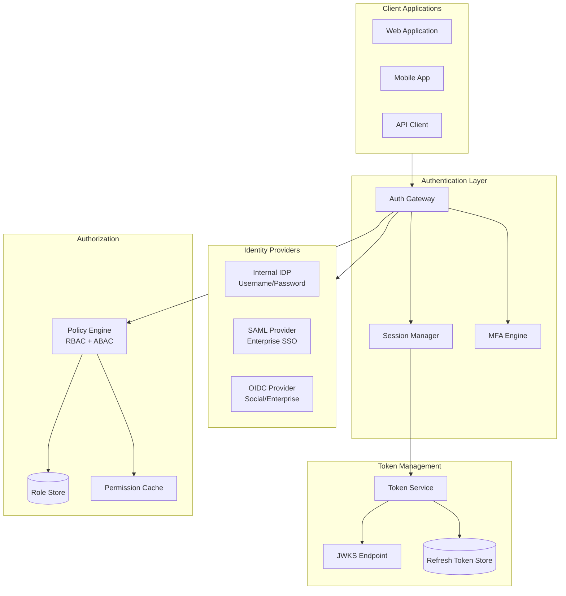

# Security and Compliance

[Back to Index](./00-index.md)

---

## Overview

The AI Native Cloud ERP operates in a heavily regulated environment where security and compliance are non-negotiable. This document covers:
- **Authentication & Authorization** - Identity, access control, federation
- **Privacy Architecture** - Encryption, isolation, data minimization
- **Compliance Framework Mapping** - SOC2, GDPR, HIPAA, PCI-DSS, regional regulations
- **Threat Model** - Attack vectors, mitigations, AI-specific threats

---

## Authentication & Authorization

### Authentication Architecture



### Authentication Mechanisms

```
SUPPORTED AUTHENTICATION METHODS:

1. Username/Password + MFA
   - Password: Argon2id hash (memory=64MB, iterations=3, parallelism=4)
   - MFA: TOTP (RFC 6238), WebAuthn/FIDO2, SMS (fallback)
   - Session: JWT with 15-minute access token, 7-day refresh token

2. SAML 2.0 (Enterprise SSO)
   - IdP-initiated and SP-initiated flows
   - Signed assertions required
   - Encrypted assertions optional
   - Tenant-specific IdP configuration

3. OIDC/OAuth 2.0
   - Authorization Code Flow with PKCE
   - Supported providers: Okta, Azure AD, Google Workspace
   - Custom claim mapping per tenant

4. API Keys (Service-to-Service)
   - Format: prefix_randomBytes (e.g., erp_live_a1b2c3d4...)
   - Hash: SHA-256 for storage (only hash stored)
   - Scopes: Configurable per key
   - Rotation: 90-day recommended, forced at 180 days

TOKEN STRUCTURE:

{
  "header": {
    "alg": "RS256",
    "kid": "key-2025-01"
  },
  "payload": {
    "iss": "https://auth.erp.example.com",
    "sub": "user-uuid",
    "aud": "erp-api",
    "exp": 1706123456,
    "iat": 1706122556,
    "tenant_id": "tenant-uuid",
    "roles": ["finance_user", "approver"],
    "permissions": ["invoices:read", "invoices:approve"],
    "mfa_verified": true,
    "session_id": "session-uuid"
  }
}
```

### Authorization Model

```
RBAC + ABAC HYBRID:

┌─────────────────────────────────────────────────────────────┐
│  Role-Based Access Control (RBAC)                           │
│                                                             │
│  Roles:                                                     │
│  ├── admin: Full access to tenant                          │
│  ├── finance_admin: Finance module admin                   │
│  ├── finance_user: Finance module user                     │
│  ├── hr_admin: HR module admin                             │
│  ├── hr_user: HR module user                               │
│  ├── approver: Approval capabilities                       │
│  └── auditor: Read-only access for audit                   │
│                                                             │
│  Permissions:                                               │
│  ├── invoices:read, invoices:write, invoices:approve       │
│  ├── journal_entries:read, journal_entries:post            │
│  ├── employees:read, employees:write, employees:pii        │
│  ├── reports:generate, reports:export                      │
│  └── agents:invoke, agents:configure                       │
└─────────────────────────────────────────────────────────────┘

┌─────────────────────────────────────────────────────────────┐
│  Attribute-Based Access Control (ABAC)                      │
│                                                             │
│  Attributes:                                                │
│  ├── user.department: HR, Finance, Operations              │
│  ├── user.location: US, EU, APAC                           │
│  ├── resource.company_id: Scope to specific company        │
│  ├── resource.sensitivity: public, internal, confidential  │
│  ├── context.time: Business hours enforcement              │
│  └── context.device_trust: Managed vs unmanaged            │
│                                                             │
│  Example Policy:                                            │
│  ALLOW IF:                                                  │
│    user.role == "finance_user" AND                          │
│    user.department == resource.department AND               │
│    resource.sensitivity <= user.clearance AND               │
│    context.time IN business_hours                           │
└─────────────────────────────────────────────────────────────┘

AUTHORIZATION CHECK PSEUDOCODE:

FUNCTION check_authorization(user, action, resource):
    // Step 1: Check RBAC permissions
    user_permissions = get_permissions_for_roles(user.roles)
    required_permission = map_action_to_permission(action)

    IF required_permission NOT IN user_permissions:
        RETURN Denied("Insufficient role permissions")

    // Step 2: Check ABAC policies
    abac_context = build_abac_context(user, resource)
    policies = get_applicable_policies(action, resource.type)

    FOR policy IN policies:
        result = evaluate_policy(policy, abac_context)
        IF result == DENY:
            RETURN Denied(policy.denial_reason)

    // Step 3: Check tenant boundary
    IF resource.tenant_id != user.tenant_id:
        RETURN Denied("Cross-tenant access denied")

    // Step 4: Log access (for audit)
    log_access_decision(user, action, resource, ALLOWED)

    RETURN Allowed()
```

### Service-to-Service Authentication

```
MTLS CONFIGURATION:

All internal service communication uses mutual TLS:

Certificate Authority:
  - Internal CA (HSM-backed)
  - Certificate lifetime: 24 hours (auto-renewed)
  - SPIFFE identity: spiffe://erp.example.com/service/{service-name}

Service Mesh (Envoy/Istio):
  - mTLS enforced by default
  - Certificate rotation: Automatic
  - RBAC policies defined in mesh config

API KEY + SIGNATURE (External Integrations):

REQUEST SIGNING:
  1. Canonical request string:
     method + "\n" +
     path + "\n" +
     sorted_query_params + "\n" +
     timestamp + "\n" +
     payload_hash

  2. Signature:
     HMAC-SHA256(api_secret, canonical_request)

  3. Authorization header:
     Authorization: ERP-HMAC-SHA256 Credential=api_key,
                    Signature=signature,
                    SignedHeaders=host;x-erp-date
```

---

## Privacy Architecture

### Encryption Strategy

```
ENCRYPTION LAYERS:

Layer 1: Transport Encryption
┌─────────────────────────────────────────────────────────────┐
│  Protocol: TLS 1.3                                          │
│  Cipher suites:                                             │
│  - TLS_AES_256_GCM_SHA384                                  │
│  - TLS_CHACHA20_POLY1305_SHA256                            │
│  Certificate: 2048-bit RSA or P-256 ECDSA                   │
│  HSTS: max-age=31536000; includeSubDomains                 │
└─────────────────────────────────────────────────────────────┘

Layer 2: Application Encryption (Tenant Data)
┌─────────────────────────────────────────────────────────────┐
│  Algorithm: AES-256-GCM                                     │
│  Key hierarchy:                                             │
│  - Master Key (HSM, FIPS 140-2 Level 3)                    │
│  - KEK per region                                           │
│  - DEK per tenant                                           │
│  AAD (Additional Authenticated Data): tenant_id + data_type │
└─────────────────────────────────────────────────────────────┘

Layer 3: Field-Level Encryption (Sensitive Fields)
┌─────────────────────────────────────────────────────────────┐
│  Fields: SSN, tax_id, bank_account, salary, health_data    │
│  Algorithm: AES-256-GCM with field-specific DEK            │
│  Searchable encryption: For SSN/tax_id lookup              │
└─────────────────────────────────────────────────────────────┘

Layer 4: Storage Encryption (Defense in Depth)
┌─────────────────────────────────────────────────────────────┐
│  Database: Transparent Data Encryption (TDE)               │
│  Object Storage: SSE with customer-managed keys            │
│  Backups: Encrypted with backup-specific keys              │
└─────────────────────────────────────────────────────────────┘
```

### PII Classification and Handling

```
PII CLASSIFICATION:

Category 1: Direct Identifiers (Highest Protection)
├── Full name
├── Social Security Number / Tax ID
├── Bank account numbers
├── Credit card numbers (PCI scope)
├── Biometric data
└── Government ID numbers

Category 2: Indirect Identifiers
├── Email address
├── Phone number
├── Physical address
├── Date of birth
├── Employee ID
└── IP address

Category 3: Sensitive Business Data
├── Salary / compensation
├── Performance reviews
├── Health information (HIPAA scope)
├── Disciplinary records
└── Background check results

Category 4: Business Data (Standard Protection)
├── Transaction amounts
├── Invoice data
├── Vendor information
└── Financial statements

HANDLING RULES:

PII_HANDLING_RULES = {
    "ssn": {
        "storage": "encrypted_field",
        "logging": "never",
        "display": "masked",  # ***-**-1234
        "export": "requires_consent",
        "retention": "employment + 7 years"
    },
    "email": {
        "storage": "encrypted_field",
        "logging": "hashed",
        "display": "full",
        "export": "included",
        "retention": "account_lifetime + 30 days"
    },
    "salary": {
        "storage": "encrypted_field",
        "logging": "never",
        "display": "role_based",  # Only HR/Payroll
        "export": "requires_consent",
        "retention": "employment + 7 years"
    },
    "ip_address": {
        "storage": "truncated",  # Last octet zeroed
        "logging": "truncated",
        "display": "truncated",
        "export": "anonymized",
        "retention": "90 days"
    }
}
```

### Data Masking in Logs

```
LOG MASKING IMPLEMENTATION:

FUNCTION mask_for_logging(log_entry):
    masked = log_entry.copy()

    // PII fields - never log
    PII_NEVER_LOG = ["ssn", "tax_id", "password", "api_secret", "credit_card"]
    FOR field IN PII_NEVER_LOG:
        IF field IN masked:
            masked[field] = "[REDACTED]"

    // PII fields - hash for correlation
    PII_HASH = ["email", "phone", "user_id"]
    FOR field IN PII_HASH:
        IF field IN masked:
            masked[field] = sha256(masked[field])[:16]  # Truncated hash

    // Numeric fields - bucket
    NUMERIC_BUCKET = ["amount", "salary"]
    FOR field IN NUMERIC_BUCKET:
        IF field IN masked:
            masked[field] = bucket_amount(masked[field])
            # $1,234.56 → "$1K-$5K"

    // Truncate long strings
    FOR field, value IN masked:
        IF is_string(value) AND len(value) > 200:
            masked[field] = value[:100] + "...[truncated]"

    RETURN masked

FUNCTION bucket_amount(amount):
    IF amount < 100: RETURN "$0-$100"
    IF amount < 1000: RETURN "$100-$1K"
    IF amount < 5000: RETURN "$1K-$5K"
    IF amount < 10000: RETURN "$5K-$10K"
    IF amount < 50000: RETURN "$10K-$50K"
    IF amount < 100000: RETURN "$50K-$100K"
    RETURN ">$100K"
```

### Right to Erasure (GDPR Article 17)

```
DATA DELETION WORKFLOW:

┌─────────────────────────────────────────────────────────────┐
│  Step 1: Request Validation                                 │
│  - Verify user identity (MFA required)                      │
│  - Check legal holds (prevent deletion if hold exists)      │
│  - Verify 30-day waiting period hasn't passed              │
└─────────────────────────────────────────────────────────────┘
                              │
                              ▼
┌─────────────────────────────────────────────────────────────┐
│  Step 2: Data Discovery                                     │
│  - Query all systems for user data                          │
│  - Include: ERP records, documents, audit logs, AI memory  │
│  - Generate deletion manifest                               │
└─────────────────────────────────────────────────────────────┘
                              │
                              ▼
┌─────────────────────────────────────────────────────────────┐
│  Step 3: Cryptographic Erasure                              │
│  - Delete user's DEK (makes encrypted data unreadable)      │
│  - Physical deletion scheduled for background               │
└─────────────────────────────────────────────────────────────┘
                              │
                              ▼
┌─────────────────────────────────────────────────────────────┐
│  Step 4: Audit Log Handling                                 │
│  - Anonymize user_id in audit logs (replace with hash)      │
│  - Retain logs for compliance (without PII)                 │
└─────────────────────────────────────────────────────────────┘
                              │
                              ▼
┌─────────────────────────────────────────────────────────────┐
│  Step 5: Third-Party Notification                           │
│  - Notify integrated systems of deletion                    │
│  - Request deletion from third parties                      │
│  - Track confirmation                                       │
└─────────────────────────────────────────────────────────────┘
                              │
                              ▼
┌─────────────────────────────────────────────────────────────┐
│  Step 6: Confirmation                                       │
│  - Generate deletion certificate                            │
│  - Notify user within 30 days                              │
│  - Archive deletion record (without PII)                    │
└─────────────────────────────────────────────────────────────┘

PSEUDOCODE:

FUNCTION process_erasure_request(user_id, tenant_id):
    // Step 1: Validate
    user = get_user(user_id, tenant_id)
    IF NOT verify_identity(user, mfa_required=TRUE):
        RAISE AuthenticationError()

    legal_holds = get_legal_holds(user_id)
    IF LEN(legal_holds) > 0:
        RAISE LegalHoldException(legal_holds)

    // Step 2: Discover data
    manifest = discover_user_data(user_id, tenant_id)
    log_discovery("erasure_manifest", manifest.summary())

    // Step 3: Cryptographic erasure
    user_dek = get_user_dek(user_id, tenant_id)
    delete_key(user_dek)  // Data becomes unreadable

    // Step 4: Anonymize audit logs
    anonymize_audit_logs(user_id, replacement=hash(user_id))

    // Step 5: Third-party cleanup
    FOR integration IN get_active_integrations(tenant_id):
        schedule_third_party_deletion(integration, user_id)

    // Step 6: Confirm
    certificate = generate_deletion_certificate(user_id, manifest)
    notify_user(user.email, "deletion_complete", certificate)

    RETURN certificate
```

### Differential Privacy for Analytics

```
DIFFERENTIAL PRIVACY IMPLEMENTATION:

Use Case: Aggregate salary analytics without exposing individual salaries

FUNCTION compute_dp_average_salary(department_id, epsilon=1.0):
    // Get raw data
    salaries = get_salaries_by_department(department_id)
    n = LEN(salaries)

    IF n < 10:
        // Too few samples - don't release
        RETURN NULL

    // Compute true average
    true_average = SUM(salaries) / n

    // Determine sensitivity (max impact of one individual)
    sensitivity = (MAX_SALARY - MIN_SALARY) / n

    // Add Laplace noise calibrated to sensitivity and epsilon
    noise = laplace(scale=sensitivity / epsilon)
    dp_average = true_average + noise

    // Clamp to reasonable range
    dp_average = MAX(MIN_SALARY, MIN(MAX_SALARY, dp_average))

    // Log privacy budget consumption
    log_privacy_budget(department_id, epsilon)

    RETURN round(dp_average, -3)  # Round to nearest $1000

PRIVACY BUDGET MANAGEMENT:

tenant_privacy_budget = {
    "total_epsilon": 10.0,
    "consumed": 0.0,
    "queries": []
}

FUNCTION check_privacy_budget(tenant_id, epsilon_needed):
    budget = get_privacy_budget(tenant_id)

    IF budget.consumed + epsilon_needed > budget.total_epsilon:
        RAISE PrivacyBudgetExhausted()

    budget.consumed += epsilon_needed
    budget.queries.append({
        "timestamp": now(),
        "epsilon": epsilon_needed,
        "query_type": "aggregate"
    })

    save_privacy_budget(tenant_id, budget)
```

---

## Compliance Framework Mapping

### SOC 2 Type II Controls

| Trust Service Criteria | Control | Implementation |
|------------------------|---------|----------------|
| **CC6.1** | Logical access controls | RBAC + ABAC, MFA enforcement, policy engine |
| **CC6.2** | Registration and authorization | SCIM provisioning, approval workflows |
| **CC6.3** | Access removal | Automated deprovisioning, 24-hour SLA |
| **CC6.4** | Separation of duties | Role separation, dual approval for sensitive |
| **CC6.5** | Physical and logical access | mTLS, network segmentation, VPN |
| **CC6.6** | Encryption of data | AES-256-GCM, HSM key management |
| **CC6.7** | Transmission protection | TLS 1.3, certificate pinning |
| **CC7.1** | Vulnerability management | Weekly scans, patch SLA <7 days |
| **CC7.2** | Monitoring and alerting | SIEM integration, 24/7 SOC |
| **CC7.3** | Incident response | Playbooks, 15-min SLA for P1 |
| **CC8.1** | Change management | CI/CD with approval gates, audit trail |
| **CC9.1** | Risk mitigation | Annual risk assessment, controls testing |

### GDPR Compliance

```
GDPR ARTICLE MAPPING:

Article 5: Principles
├── Lawfulness: Documented legal basis per processing activity
├── Purpose limitation: Data used only for stated purposes
├── Data minimization: Collect only necessary PII
├── Accuracy: Self-service correction, data validation
├── Storage limitation: Retention policies, auto-deletion
└── Integrity: Encryption, access controls, audit logs

Article 6: Legal Basis
├── Consent: Consent management system, granular opt-in
├── Contract: Processing necessary for service delivery
├── Legal obligation: Tax records, financial reporting
├── Vital interests: N/A for ERP
├── Public interest: N/A for ERP
└── Legitimate interests: Analytics with DP, fraud detection

Articles 15-22: Data Subject Rights
├── Art. 15 - Access: Data export API, JSON format
├── Art. 16 - Rectification: Self-service profile editing
├── Art. 17 - Erasure: Deletion workflow (see above)
├── Art. 18 - Restriction: Processing freeze capability
├── Art. 20 - Portability: Export in machine-readable format
├── Art. 21 - Objection: Processing opt-out per purpose
└── Art. 22 - Automated decisions: Human review option

Article 25: Privacy by Design
├── Default: Minimal data collection
├── Pseudonymization: IDs instead of direct identifiers
├── Encryption: At rest and in transit
└── Access controls: Least privilege

Article 32: Security Measures
├── Encryption: AES-256-GCM
├── Confidentiality: Tenant isolation
├── Integrity: Checksums, audit logs
├── Availability: Multi-region, DR
└── Testing: Penetration testing, audits

Article 33-34: Breach Notification
├── DPA notification: Within 72 hours
├── User notification: Without undue delay
├── Documentation: Breach register maintained
└── Impact assessment: Automated severity scoring
```

### HIPAA Compliance (Healthcare Module)

```
HIPAA SAFEGUARDS:

Administrative Safeguards:
├── Security Officer: Designated role with documented responsibilities
├── Risk Assessment: Annual, documented findings and remediation
├── Workforce Training: Annual security awareness, role-based training
├── Access Management: Least privilege, regular reviews
├── Incident Response: Breach notification within 60 days
└── Business Associates: BAA required for all vendors with PHI access

Physical Safeguards:
├── Facility Access: Data center certifications (SOC 2, ISO 27001)
├── Workstation Security: Endpoint protection, disk encryption
├── Device Controls: MDM for mobile, secure disposal
└── Access Controls: Badge access, visitor logs (data center)

Technical Safeguards:
├── Access Control: Unique user IDs, automatic logoff
├── Audit Controls: All PHI access logged, 6-year retention
├── Integrity: PHI modification detection (checksums)
├── Transmission Security: TLS 1.3, end-to-end encryption
└── Encryption: AES-256 at rest, field-level for PHI

PHI HANDLING IN ERP:

PHI_FIELDS = [
    "diagnosis_code",
    "treatment_notes",
    "prescription_data",
    "insurance_claims",
    "medical_history"
]

FUNCTION handle_phi_access(user, phi_record):
    // Verify user has PHI access permission
    IF "phi:read" NOT IN user.permissions:
        RAISE AccessDenied("PHI access not authorized")

    // Verify minimum necessary
    requested_fields = get_requested_fields()
    allowed_fields = get_minimum_necessary(user.role, phi_record.type)
    filtered_record = filter_to_allowed(phi_record, allowed_fields)

    // Log access
    audit_log.write({
        "event_type": "phi_access",
        "user_id": user.id,
        "patient_id": hash(phi_record.patient_id),  # Don't log actual ID
        "record_type": phi_record.type,
        "fields_accessed": list(filtered_record.keys()),
        "access_reason": user.stated_reason,
        "timestamp": now()
    })

    RETURN filtered_record
```

### PCI-DSS Compliance (Payment Module)

```
PCI-DSS SCOPE REDUCTION:

Strategy: Tokenization to minimize PCI scope

┌─────────────────────────────────────────────────────────────┐
│  PCI Environment (Isolated)                                 │
│                                                             │
│  ┌─────────────────────────────────────────────────────┐   │
│  │  Payment Gateway (Third-party, PCI-certified)       │   │
│  │  - Receives card data directly from browser         │   │
│  │  - Returns token to application                     │   │
│  │  - ERP never sees full card number                  │   │
│  └─────────────────────────────────────────────────────┘   │
│                                                             │
│  ERP stores only:                                           │
│  - Token (for recurring payments)                          │
│  - Last 4 digits (for display)                             │
│  - Expiry month/year (for reminders)                       │
│  - NO: Full PAN, CVV, PIN                                  │
└─────────────────────────────────────────────────────────────┘

PAYMENT FLOW:

1. Browser → Payment Gateway: Card data
2. Payment Gateway: Tokenize, return token
3. Browser → ERP API: Token + payment request
4. ERP → Payment Gateway: Charge using token
5. Payment Gateway → ERP: Transaction result
6. ERP: Store token, last4, result (no PAN)

PCI REQUIREMENTS MET:

Req 1: Firewall - Network segmentation, WAF
Req 2: No defaults - Hardened configurations
Req 3: Protect stored data - Tokenization (no storage)
Req 4: Encrypt transmission - TLS 1.3
Req 5: Antivirus - Endpoint protection
Req 6: Secure systems - Patch management
Req 7: Restrict access - Role-based access
Req 8: Unique IDs - Individual authentication
Req 9: Physical access - N/A (tokenized)
Req 10: Logging - All payment transactions logged
Req 11: Testing - Quarterly ASV scans, annual pen test
Req 12: Security policy - Documented, reviewed annually
```

### Regional Regulations

```
INDIA DPDP (Digital Personal Data Protection):

Requirements:
├── Data Localization: PII stored only in India
├── Consent: Explicit, granular, withdrawable
├── Data Principal Rights: Access, correction, erasure
├── Grievance Redressal: 30-day SLA
├── Children's Data: Verifiable parental consent for <18
└── Cross-border: Only to notified countries

Implementation:
├── India region deployment (Mumbai + Hyderabad)
├── No replication of PII outside India
├── Consent management with India-specific clauses
├── Dedicated grievance portal
└── Age verification for user registration

CHINA PIPL (Personal Information Protection Law):

Requirements:
├── Data Localization: All PI stored in China
├── Cross-border: Prohibited without assessment
├── Security Assessment: Required for large processors
├── Consent: Explicit, informed, specific
├── Data Subject Rights: Access, correction, deletion
└── Data Protection Officer: Required

Implementation:
├── Isolated China deployment (no connectivity to global)
├── Chinese entity as data controller
├── Separate encryption keys (China HSM)
├── Security assessment documentation
└── Chinese DPO appointment
```

---

## Threat Model

### Attack Vectors and Mitigations

```
THREAT CATEGORY 1: AUTHENTICATION ATTACKS

Attack: Credential Stuffing
├── Vector: Automated login attempts with leaked credentials
├── Impact: Account takeover
└── Mitigation:
    ├── Rate limiting (10 failed attempts → CAPTCHA)
    ├── MFA enforcement for all users
    ├── Breach password checking (HaveIBeenPwned API)
    └── Anomaly detection (unusual login location)

Attack: Session Hijacking
├── Vector: Steal session token via XSS, network sniffing
├── Impact: Impersonate user
└── Mitigation:
    ├── HttpOnly, Secure, SameSite cookies
    ├── Token binding to IP/device fingerprint
    ├── Short-lived access tokens (15 min)
    └── Refresh token rotation on use

THREAT CATEGORY 2: AUTHORIZATION ATTACKS

Attack: Privilege Escalation
├── Vector: Modify request to access higher privilege resources
├── Impact: Unauthorized access to admin functions
└── Mitigation:
    ├── Server-side authorization checks on every request
    ├── Role assignment requires admin approval
    ├── Audit logging of privilege changes
    └── Regular access reviews

Attack: Cross-Tenant Access
├── Vector: Manipulate tenant_id in requests
├── Impact: Access other tenant's data
└── Mitigation:
    ├── Tenant extracted from auth token (not request)
    ├── Row-level security in database
    ├── Encryption keys bound to tenant
    └── Query validation in application layer

THREAT CATEGORY 3: AI-SPECIFIC ATTACKS

Attack: Prompt Injection
├── Vector: Malicious input designed to manipulate LLM
├── Impact: Unauthorized actions, data disclosure
└── Mitigation:
    ├── Input sanitization (remove known patterns)
    ├── Instruction hierarchy (system > user)
    ├── Output validation before action execution
    ├── Sensitive operations require human approval
    └── Agent governance with action limits

Attack: Model Extraction
├── Vector: Query model repeatedly to reconstruct it
├── Impact: IP theft, training attack model
└── Mitigation:
    ├── Rate limiting per user
    ├── Output perturbation (noise)
    ├── Query logging and anomaly detection
    └── Only return top-1 result (not probabilities)

Attack: Training Data Poisoning
├── Vector: Inject malicious data into training/fine-tuning
├── Impact: Model behaves maliciously
└── Mitigation:
    ├── Data provenance tracking
    ├── Input validation for training data
    ├── Model versioning with rollback
    └── Behavioral testing before deployment

Attack: Context Leakage Between Tenants
├── Vector: AI model retains context from previous tenant
├── Impact: Cross-tenant data disclosure
└── Mitigation:
    ├── Stateless inference (no persistent memory across tenants)
    ├── Session isolation in agent memory
    ├── Clear KV cache between tenant contexts
    └── Separate model instances for enterprise tenants

THREAT CATEGORY 4: DATA ATTACKS

Attack: SQL Injection
├── Vector: Malicious SQL in user input
├── Impact: Data theft, modification
└── Mitigation:
    ├── Parameterized queries (no string concatenation)
    ├── ORM with query sanitization
    ├── WAF with SQL injection rules
    └── Least privilege database accounts

Attack: Insider Threat
├── Vector: Malicious employee accessing data
├── Impact: Data theft, sabotage
└── Mitigation:
    ├── Least privilege access
    ├── All access logged and monitored
    ├── Anomaly detection on access patterns
    ├── Background checks for sensitive roles
    └── Separation of duties (no single person can exfiltrate)
```

### AI-Specific Security Controls

```
AI SECURITY CONTROLS:

1. Input Validation
┌─────────────────────────────────────────────────────────────┐
│  FUNCTION sanitize_ai_input(user_input):                    │
│      // Remove known injection patterns                     │
│      dangerous = ["ignore previous", "[SYSTEM]", "admin"]   │
│      FOR pattern IN dangerous:                              │
│          user_input = user_input.replace(pattern, "")       │
│                                                             │
│      // Length limits                                       │
│      IF LEN(user_input) > 10000:                           │
│          user_input = user_input[:10000]                   │
│                                                             │
│      // Character whitelist for structured fields           │
│      IF input_type == "account_number":                    │
│          user_input = regex_match("[0-9]+", user_input)    │
│                                                             │
│      RETURN user_input                                      │
└─────────────────────────────────────────────────────────────┘

2. Output Validation
┌─────────────────────────────────────────────────────────────┐
│  FUNCTION validate_ai_output(output, expected_schema):      │
│      // Schema validation                                   │
│      IF NOT matches_schema(output, expected_schema):        │
│          RAISE OutputValidationError()                      │
│                                                             │
│      // PII detection                                       │
│      IF contains_pii(output):                              │
│          output = redact_pii(output)                       │
│          log_warning("PII detected in AI output")          │
│                                                             │
│      // Instruction leak detection                          │
│      IF contains_system_prompt(output):                    │
│          RAISE SecurityViolation("System prompt leaked")   │
│                                                             │
│      RETURN output                                          │
└─────────────────────────────────────────────────────────────┘

3. Action Gating
┌─────────────────────────────────────────────────────────────┐
│  SENSITIVE_ACTIONS = [                                      │
│      "delete_record",                                       │
│      "modify_permission",                                   │
│      "export_data",                                         │
│      "payment_above_threshold"                              │
│  ]                                                          │
│                                                             │
│  FUNCTION execute_ai_action(agent, action, context):        │
│      IF action.type IN SENSITIVE_ACTIONS:                  │
│          // Require human approval                          │
│          approval = request_human_approval(                 │
│              action,                                        │
│              reason=agent.decision_rationale               │
│          )                                                  │
│          IF NOT approval.granted:                          │
│              RETURN ActionBlocked(approval.reason)         │
│                                                             │
│      // Execute with full audit                             │
│      result = execute_action(action)                       │
│      audit_log.write({                                     │
│          "agent_id": agent.id,                             │
│          "action": action.type,                            │
│          "context": context.summary(),                     │
│          "result": result.status,                          │
│          "rationale": agent.decision_rationale             │
│      })                                                     │
│                                                             │
│      RETURN result                                          │
└─────────────────────────────────────────────────────────────┘
```

---

## Security Testing and Compliance Verification

```
SECURITY TESTING SCHEDULE:

Continuous:
├── Automated vulnerability scanning (daily)
├── Static code analysis (every commit)
├── Dependency vulnerability scanning (every build)
└── Runtime anomaly detection (real-time)

Periodic:
├── Penetration testing (quarterly)
├── Red team exercises (annually)
├── Access review (monthly)
├── Compliance audit (annually)
└── DR testing (quarterly)

COMPLIANCE ATTESTATIONS:

SOC 2 Type II:
├── Auditor: Big 4 accounting firm
├── Frequency: Annual
├── Scope: Full platform
└── Report: Available to customers under NDA

ISO 27001:
├── Certifying body: Accredited registrar
├── Frequency: Annual surveillance, 3-year recertification
├── Scope: Information security management system
└── Certificate: Publicly available

HIPAA:
├── Auditor: Healthcare compliance specialist
├── Frequency: Annual
├── Scope: Healthcare module
└── BAA: Available for healthcare customers
```

---

## Next Steps

- [Observability](./07-observability.md) - Metrics, logging, tracing, alerting
