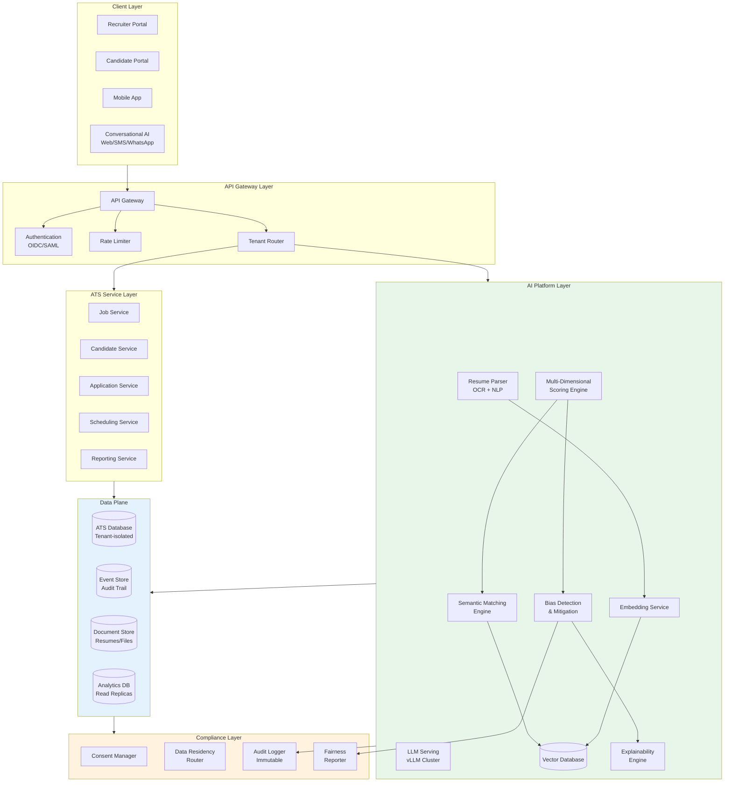

# AI Native ATS Cloud SaaS - System Design

[Back to System Design Index](../README.md)

---

## System Overview

An **AI Native ATS (Applicant Tracking System) Cloud SaaS** is a next-generation talent acquisition platform where artificial intelligence is embedded as a first-class architectural component rather than a bolt-on feature. Unlike traditional ATS platforms that rely on keyword matching and boolean filters, this system employs **semantic understanding** through self-hosted LLMs, achieving 87% accuracy in predicting job-candidate fit versus 52% for keyword-based approaches.

The defining architectural challenges include: (1) **self-hosted AI infrastructure** for privacy-first candidate data processing with no external API transmission, (2) **semantic matching engine** using vector embeddings for contextual understanding beyond keywords, (3) **multi-dimensional scoring** evaluating skills, experience, culture fit, and career trajectory simultaneously, (4) **bias detection and mitigation** with real-time fairness monitoring and explainable AI, and (5) **compliance-first design** supporting GDPR, CCPA, EEOC requirements, and EU AI Act (which classifies hiring as "high-risk" AI).

Modern AI-native ATS platforms like Workday Recruiting (ASOR multi-agent architecture), Ashby (citation-based AI with FairNow bias audits), and Paradox (conversational ATS with Olivia AI) demonstrate this architectural shift toward semantic understanding, autonomous agents, and privacy-preserving AI infrastructure.

---

## Key Characteristics

| Characteristic | Value | Implication |
|----------------|-------|-------------|
| **Traffic Pattern** | Read-heavy (recruiters reviewing), Write-spiky (application deadlines) | CQRS pattern, read replicas, queue-based ingestion |
| **Consistency Model** | Strong for applications/scores, Eventual for analytics | Hybrid consistency, event sourcing for audit |
| **Availability Target** | 99.9% core ATS, 99.5% AI scoring | Graceful AI degradation, fallback to basic matching |
| **Latency Target** | <200ms UI, <500ms AI scoring, <2s full ranking | Edge caching, pre-computed embeddings, async scoring |
| **Privacy Requirement** | Critical - candidate PII, self-hosted AI | Zero external API transmission, tenant encryption |
| **Compliance Requirement** | Multi-framework (GDPR, CCPA, EEOC, EU AI Act) | Bias auditing, right to explanation, data residency |
| **AI Integration** | Native - self-hosted LLMs, semantic matching | GPU infrastructure, vector DB, explainable AI |

---

## Complexity Rating

| Aspect | Rating | Reason |
|--------|--------|--------|
| **Overall** | Very High | AI infrastructure + compliance + bias mitigation + multi-tenancy |
| **Self-Hosted LLM Infrastructure** | Very High | GPU cluster management, model serving, inference optimization |
| **Semantic Matching Engine** | High | Vector embeddings, similarity computation, ranking algorithms |
| **Bias Detection & Mitigation** | High | Fairness metrics, real-time monitoring, explainable decisions |
| **Resume Parsing Pipeline** | High | OCR, NLP extraction, normalization across formats |
| **Compliance & Explainability** | High | GDPR/EEOC mapping, decision audit trails, right to explanation |
| **Multi-Tenant Data Isolation** | Medium | Tenant-specific encryption, data residency routing |

---

## Quick Navigation

| Document | Description |
|----------|-------------|
| [01 - Requirements & Estimations](./01-requirements-and-estimations.md) | Functional/Non-functional requirements, capacity planning, SLOs |
| [02 - High-Level Design](./02-high-level-design.md) | Architecture, AI platform, data flows, key decisions |
| [03 - Low-Level Design](./03-low-level-design.md) | Data model, API design, matching algorithms, scoring pseudocode |
| [04 - Deep Dive & Bottlenecks](./04-deep-dive-and-bottlenecks.md) | Resume parsing, semantic matching, bias detection deep dives |
| [05 - Scalability & Reliability](./05-scalability-and-reliability.md) | GPU scaling, multi-tenant isolation, disaster recovery |
| [06 - Security & Compliance](./06-security-and-compliance.md) | GDPR/CCPA, EEOC compliance, bias auditing, explainability |
| [07 - Observability](./07-observability.md) | Metrics, logging, tracing, fairness dashboards |
| [08 - Interview Guide](./08-interview-guide.md) | 45-min pacing, trap questions, trade-offs |

---

## Core ATS Modules

| Module | Responsibility | AI Enhancement |
|--------|----------------|----------------|
| **Job Management** | Job descriptions, requirements, workflows | Skill extraction, requirement inference |
| **Candidate Intake** | Resume upload, profile creation, source tracking | Intelligent parsing, deduplication |
| **Screening & Scoring** | Candidate evaluation, qualification checks | Semantic matching, multi-dimensional scoring |
| **Interview Scheduling** | Calendar coordination, availability matching | Conversational AI, autonomous scheduling |
| **Pipeline Management** | Stage tracking, workflow automation | Predictive analytics, bottleneck detection |
| **Offer Management** | Compensation, approval workflows | Market benchmarking, negotiation insights |
| **Analytics & Reporting** | Hiring metrics, funnel analysis | Bias auditing, quality-of-hire prediction |
| **Compliance & Audit** | EEOC reporting, decision trails | Explainability engine, fairness reports |

---

## AI Capabilities Matrix

| Capability | Technology | Use Cases |
|------------|------------|-----------|
| **Resume Parsing** | OCR + NLP + LLM extraction | Convert PDF/DOCX to structured profiles |
| **Semantic Matching** | Vector embeddings + similarity | Job-candidate fit beyond keywords |
| **Multi-Dimensional Scoring** | ML scoring + LLM reasoning | Skills, experience, culture, trajectory |
| **Conversational Screening** | LLM + dialog management | Candidate Q&A, qualification verification |
| **Interview Scheduling** | Conversational AI + calendar API | Autonomous scheduling via chat/SMS |
| **Bias Detection** | Fairness metrics + statistical analysis | Real-time disparate impact monitoring |
| **Explainable Decisions** | SHAP/LIME + citation generation | Decision reasoning with evidence |

---

## Architecture Overview



---

## AI-Native vs Traditional ATS

| Aspect | Traditional ATS | AI-Native ATS |
|--------|-----------------|---------------|
| **Resume Screening** | Keyword matching, boolean filters | Semantic understanding, contextual inference |
| **Candidate Ranking** | Manual sorting, simple scores | Multi-dimensional AI scoring (skills + experience + culture + trajectory) |
| **Matching Accuracy** | ~52% (keyword-based) | ~87% (semantic vectors) |
| **Scheduling** | Manual email coordination | Conversational AI (SMS/WhatsApp) |
| **Bias Detection** | Post-hoc annual audits | Real-time monitoring, proactive mitigation |
| **Explainability** | None | Decision citations, feature attribution, override capability |
| **AI Data Privacy** | External API calls (data leaves system) | Self-hosted LLM, zero external transmission |
| **Skill Inference** | Explicit keywords only | Implicit skill inference from context |

---

## When to Use This Design

**Use AI Native ATS When:**
- Organization requires data sovereignty (candidate data must not leave premises)
- High-volume hiring (>10K applications/month) requires automated screening
- Compliance mandates audit trails for AI hiring decisions (GDPR, EU AI Act)
- Quality-of-hire improvement is a strategic priority
- Conversational candidate experience differentiates employer brand
- Bias mitigation is a legal or ethical requirement

**Do NOT Use When:**
- Small hiring volume (<100 hires/year) - traditional ATS sufficient
- No AI compliance requirements - simpler solutions available
- Limited budget for GPU infrastructure
- No internal ML/AI operations expertise
- Simple job matching without semantic understanding needs

---

## Real-World Implementations

| System | Architecture | AI Innovation |
|--------|--------------|---------------|
| **Workday Recruiting + Illuminate** | ASOR multi-agent, 800B-parameter LLM | Autonomous agents for sourcing, screening, mobility |
| **Ashby** | Citation-based AI, no customer data training | FairNow bias audits, explainable recommendations |
| **Paradox (Olivia)** | Conversational ATS, multi-channel | SMS/WhatsApp scheduling, natural language screening |
| **Greenhouse** | API-first, agent-oriented | Third-party AI integration, adaptive workflows |
| **HireVue** | Video AI, structured assessment | Predictive analytics, skills-based testing |
| **SmartRecruiters** | Hub-and-spoke integration | Deep API, marketplace ecosystem |

---

## Technology Stack (Reference)

| Layer | Technology Options | Selection Criteria |
|-------|-------------------|-------------------|
| **LLM Serving** | vLLM, TensorRT-LLM, Triton | Throughput, GPU efficiency, latency |
| **Vector Database** | Milvus, Pinecone, Weaviate, Qdrant | Scale, hybrid search, filtering |
| **Embedding Models** | BGE, E5, Instructor, OpenAI Ada | Accuracy, inference speed, fine-tuning |
| **Resume Parsing** | Apache Tika, Textract, custom OCR | Format coverage, extraction quality |
| **NLP Extraction** | SpaCy, HuggingFace NER, LLM | Entity accuracy, customization |
| **ATS Database** | PostgreSQL, CockroachDB | ACID, multi-region, tenant isolation |
| **Event Store** | Kafka, Pulsar, EventStoreDB | Durability, replay, audit trails |
| **Fairness Tools** | FairML, AI Fairness 360, Aequitas | Bias metrics, debiasing algorithms |

---

## Quick Reference Card

```
┌─────────────────────────────────────────────────────────────────┐
│           AI NATIVE ATS CLOUD SAAS - QUICK REFERENCE            │
├─────────────────────────────────────────────────────────────────┤
│                                                                 │
│  SCALE TARGETS               KEY PATTERNS                       │
│  ─────────────               ────────────                       │
│  • 10K+ tenants              • Self-hosted LLM (vLLM)           │
│  • 1M candidates/month       • Semantic matching (vectors)      │
│  • 100M match scores/day     • Multi-dimensional scoring        │
│  • 10K concurrent users      • Conversational AI (scheduling)   │
│  • 99.9% availability        • Real-time bias detection         │
│                                                                 │
├─────────────────────────────────────────────────────────────────┤
│                                                                 │
│  ATS MODULES                 AI CAPABILITIES                    │
│  ───────────                 ───────────────                    │
│  • Job Management            • Resume parsing (OCR+NLP)         │
│  • Candidate Intake          • Semantic matching                │
│  • Screening/Scoring         • Multi-dim scoring                │
│  • Interview Scheduling      • Conversational AI                │
│  • Pipeline Management       • Bias detection                   │
│  • Offer Management          • Explainable decisions            │
│                                                                 │
├─────────────────────────────────────────────────────────────────┤
│                                                                 │
│  COMPLIANCE                  PRIVACY                            │
│  ──────────                  ───────                            │
│  • GDPR (Art. 22)            • Self-hosted LLM                  │
│  • CCPA/CPRA                 • Zero external API calls          │
│  • EEOC (4/5 rule)           • Tenant-specific encryption       │
│  • EU AI Act (high-risk)     • Data residency routing           │
│  • NYC bias audits           • Immutable audit logs             │
│                                                                 │
├─────────────────────────────────────────────────────────────────┤
│                                                                 │
│  INTERVIEW KEYWORDS                                             │
│  ─────────────────                                              │
│  Self-hosted LLM, Vector embeddings, Semantic matching,         │
│  Cosine similarity, SHAP/LIME, Disparate impact, 4/5 rule,      │
│  Right to explanation, Bias mitigation, Resume parsing,         │
│  Conversational ATS, Multi-dimensional scoring, EEOC, GDPR      │
│                                                                 │
└─────────────────────────────────────────────────────────────────┘
```

---

## Interview Readiness Checklist

| Topic | Must Know | Deep Dive |
|-------|-----------|-----------|
| Semantic Matching | Vector embeddings, cosine similarity | ANN algorithms (HNSW, IVF), hybrid search |
| Resume Parsing | OCR → NLP → normalization pipeline | Layout detection, entity extraction, format handling |
| Bias Detection | Disparate impact, 4/5 rule, protected classes | Fairness metrics (DI, SPD, EOD), debiasing techniques |
| Self-Hosted LLM | vLLM, GPU serving basics | PagedAttention, continuous batching, KV cache |
| Explainability | SHAP, LIME, feature attribution | Citation generation, decision trails |
| Compliance | GDPR Art. 22, EEOC, EU AI Act | NYC audit law, CCPA automated decision rights |
| Multi-Tenancy | Logical isolation, encryption | Data residency, tenant-specific keys |

---

## Related Systems

- [Identity & Access Management (IAM)](../2.5-identity-access-management/00-index.md) - AuthN/AuthZ patterns
- [AI Native Cloud ERP SaaS](../2.18-ai-native-cloud-erp-saas/00-index.md) - Similar AI platform architecture
- [Distributed Job Scheduler](../2.6-distributed-job-scheduler/00-index.md) - Batch processing for scoring
- [Event Sourcing System](../1.18-event-sourcing-system/00-index.md) - Audit trails, replay
- [Secret Management System](../2.16-secret-management-system/00-index.md) - Key management, rotation

---

## References

- Workday Illuminate ASOR - Multi-agent architecture for talent acquisition
- Ashby AI Platform - Citation-based AI, FairNow bias auditing partnership
- Paradox Conversational ATS - Olivia AI for scheduling and screening
- EU AI Act (Aug 2024) - Hiring classified as "high-risk" AI application
- EEOC Strategic Enforcement Plan (2023-2027) - AI hiring as priority area
- NYC Local Law 144 - Annual bias audit requirements for automated employment decisions
- Vector embedding research - 87% accuracy vs 52% keyword matching (2024 studies)
- AI Fairness 360 - IBM toolkit for bias detection and mitigation
