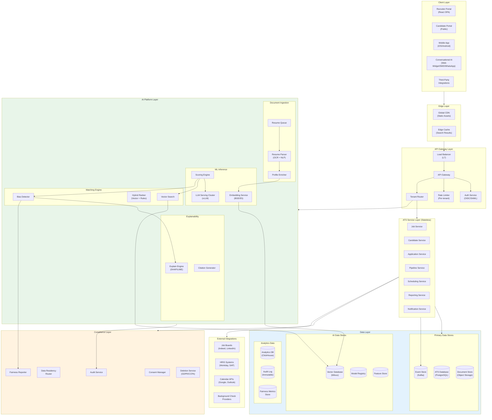
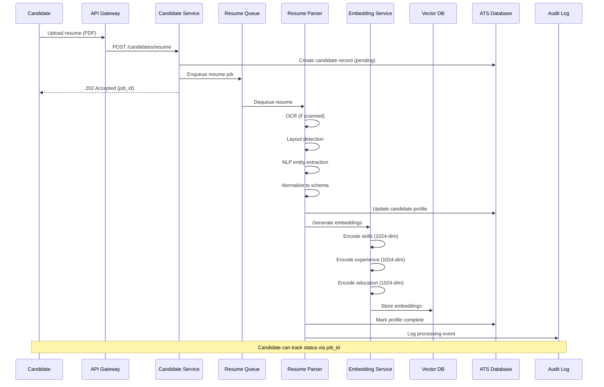
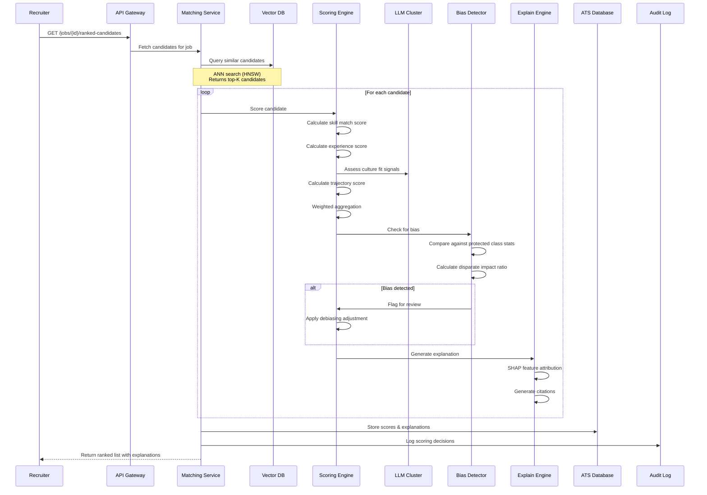
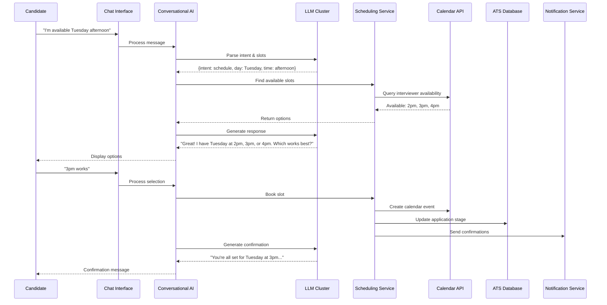
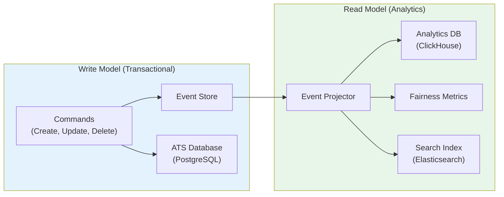
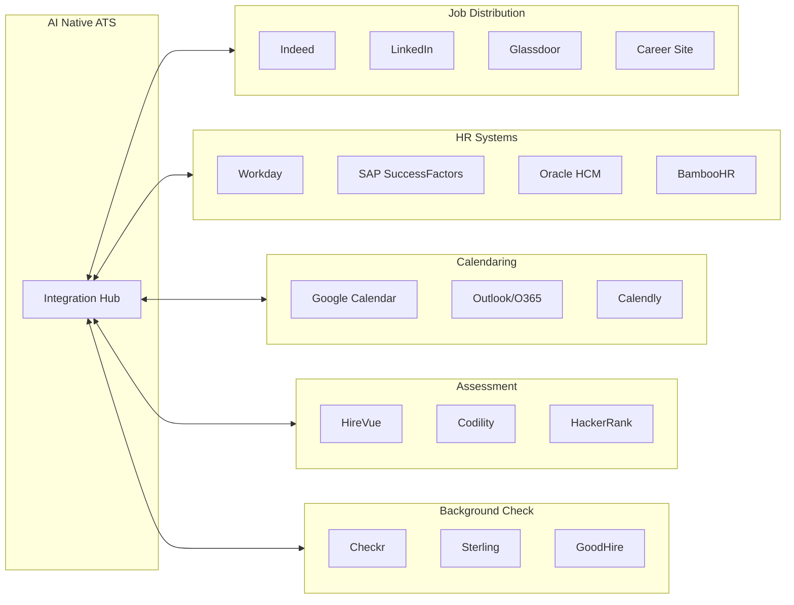
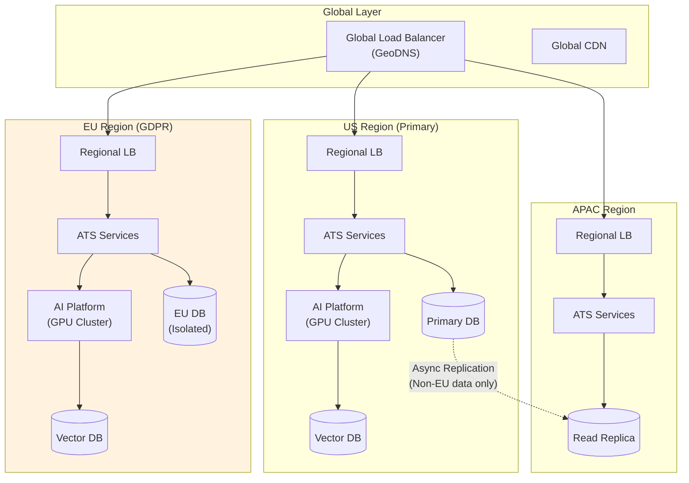

# AI Native ATS Cloud SaaS - High-Level Design

[← Previous: Requirements & Estimations](./01-requirements-and-estimations.md) | [Back to Index](./00-index.md) | [Next: Low-Level Design →](./03-low-level-design.md)

---

## System Architecture

### Component Architecture Diagram



---

## Data Flow Diagrams

### Resume Upload & Processing Flow



### AI Scoring & Matching Flow



### Conversational Scheduling Flow



---

## Key Architectural Decisions

### Decision 1: Self-Hosted LLM vs External API

| Option | Pros | Cons |
|--------|------|------|
| **Self-Hosted (Chosen)** | Data never leaves system, GDPR compliant, customizable, predictable costs | High GPU infrastructure cost, operational complexity |
| External API (OpenAI, etc.) | Easy to start, no infrastructure, latest models | Data transmission concerns, compliance risk, variable costs, explainability challenges |

**Decision:** Self-hosted LLM infrastructure using vLLM

**Rationale:**
1. Candidate PII must not be transmitted to external services
2. GDPR Article 22 requires explainability for automated decisions
3. NYC Law 144 requires bias audits - need full control over model
4. Enterprise customers demand data sovereignty
5. Predictable costs at scale vs. per-token pricing

### Decision 2: Vector Database Selection

| Option | Pros | Cons |
|--------|------|------|
| **Milvus (Chosen)** | Open-source, horizontal scaling, hybrid search | Operational complexity |
| Pinecone | Managed, easy scaling | Data residency concerns, vendor lock-in |
| Qdrant | Fast, good filtering | Smaller ecosystem |
| PostgreSQL pgvector | Unified database | Limited scale, basic ANN |

**Decision:** Milvus for vector storage with PostgreSQL for metadata

**Rationale:**
1. Need to scale to 100M+ vectors across tenants
2. Hybrid search (vector + metadata filters) required
3. Open-source enables self-hosting for compliance
4. Strong filtering support for tenant isolation

### Decision 3: Event-Driven vs Request-Response

| Pattern | Use Case | Rationale |
|---------|----------|-----------|
| **Event-Driven** | Resume processing, scoring, analytics | Async processing, audit trail, decoupling |
| **Request-Response** | Search, profile retrieval, UI operations | Low latency required, synchronous need |

**Decision:** Hybrid architecture - event-driven for AI pipeline, request-response for core ATS

```
┌─────────────────────────────────────────────────────────────────┐
│                    HYBRID ARCHITECTURE                          │
├─────────────────────────────────────────────────────────────────┤
│                                                                 │
│  EVENT-DRIVEN PATH (Async)         REQUEST-RESPONSE (Sync)      │
│  ─────────────────────────         ───────────────────────      │
│  • Resume upload → parse           • Candidate search           │
│  • Parse complete → embed          • Profile retrieval          │
│  • Embed complete → index          • Application status         │
│  • Score request → AI scoring      • Dashboard data             │
│  • Score complete → store          • Real-time chat responses   │
│  • Any mutation → audit log                                     │
│                                                                 │
│  Benefits:                         Benefits:                    │
│  • Decoupled processing            • Low latency                │
│  • Retry on failure                • Immediate feedback         │
│  • Complete audit trail            • Simpler client logic       │
│  • Scale AI independently                                       │
│                                                                 │
└─────────────────────────────────────────────────────────────────┘
```

### Decision 4: Multi-Tenancy Model

| Option | Pros | Cons |
|--------|------|------|
| **Shared DB, Row-Level Isolation (Chosen)** | Cost efficient, simpler ops | Noisy neighbor risk, compliance complexity |
| Database per tenant | Strong isolation, easier compliance | High cost, operational burden |
| Schema per tenant | Good isolation, moderate cost | Migration complexity, connection pooling |

**Decision:** Shared database with row-level tenant isolation + tenant-specific encryption

**Implementation:**
- All tables include `tenant_id` column
- Row-level security (RLS) policies enforce isolation
- Tenant-specific data encryption keys (DEKs)
- Master encryption key per region (KEK in HSM)
- Option for dedicated infrastructure for enterprise tier

### Decision 5: CQRS for Analytics



**Rationale:**
- Hiring analytics are read-heavy, distinct from transactional ATS
- Fairness metrics require aggregations across all decisions
- Search needs denormalized index for fast queries
- Event replay enables recalculation of historical metrics

---

## Architecture Pattern Checklist

| Pattern | Decision | Justification |
|---------|----------|---------------|
| **Sync vs Async** | Hybrid | Sync for UI, async for AI processing |
| **Event-driven vs Request-response** | Event-driven AI pipeline | Audit trail, decoupling, retry |
| **Push vs Pull** | Pull for rankings, Push for notifications | Recruiters pull rankings, candidates receive push notifications |
| **Stateless vs Stateful** | Stateless services, stateful data stores | Horizontal scaling, session in JWT |
| **Read-heavy vs Write-heavy** | Read-heavy (100:1) | Heavy search/view, optimize read path |
| **Real-time vs Batch** | Real-time scoring, batch analytics | Immediate scoring, periodic reports |
| **Edge vs Origin** | Edge for assets + search cache | Reduce latency for global users |

---

## Component Responsibilities

### ATS Service Layer

| Service | Responsibility | Key Operations |
|---------|----------------|----------------|
| **Job Service** | Job lifecycle management | Create, publish, close, archive jobs |
| **Candidate Service** | Candidate profile management | CRUD, deduplication, consent tracking |
| **Application Service** | Application state machine | Apply, advance, reject, withdraw |
| **Pipeline Service** | Workflow orchestration | Stage transitions, automation triggers |
| **Scheduling Service** | Interview coordination | Availability, booking, reminders |
| **Reporting Service** | Analytics and compliance reports | EEOC reports, bias audits, funnels |
| **Notification Service** | Multi-channel notifications | Email, SMS, push, in-app |

### AI Platform Layer

| Component | Responsibility | Key Operations |
|-----------|----------------|----------------|
| **Resume Parser** | Document to structured data | OCR, NLP extraction, normalization |
| **Embedding Service** | Vector encoding | Skills, experience, education embeddings |
| **LLM Cluster** | Language model inference | Culture fit, explanation generation |
| **Scoring Engine** | Multi-dimensional scoring | Aggregate scores with explainability |
| **Bias Detector** | Fairness monitoring | Disparate impact, demographic parity |
| **Explain Engine** | Decision transparency | SHAP attribution, citation generation |

### Compliance Layer

| Component | Responsibility | Key Operations |
|-----------|----------------|----------------|
| **Consent Manager** | Candidate consent tracking | Collect, update, withdraw consent |
| **Data Residency Router** | Geographic data routing | Route EU data to EU, etc. |
| **Audit Service** | Immutable decision logging | Record all AI decisions with context |
| **Fairness Reporter** | Bias audit generation | NYC Law 144 reports, EEOC reports |
| **Deletion Service** | Data deletion workflows | GDPR/CCPA deletion requests |

---

## Integration Architecture

### External System Integrations



### Integration Patterns

| Integration Type | Pattern | Protocol |
|------------------|---------|----------|
| **Job Boards** | Push (job posting), Pull (applications) | REST API, XML feeds |
| **HRIS** | Bidirectional sync | REST API, SFTP, webhooks |
| **Calendar** | OAuth2 + Calendar API | Google/Microsoft Graph API |
| **Assessment** | Webhooks for results | REST API + webhooks |
| **Background Check** | Async request/response | REST API + webhooks |

---

## Deployment Architecture

### Multi-Region Deployment



### Data Residency Rules

| Data Type | EU Candidate | US Candidate | APAC Candidate |
|-----------|--------------|--------------|----------------|
| **Profile data** | EU only | US primary | US primary |
| **Resumes** | EU only | US primary | US primary |
| **AI embeddings** | EU only | US primary | US primary |
| **Audit logs** | EU only | US primary | US primary |
| **Analytics (anonymized)** | Global | Global | Global |

---

## Technology Stack Summary

| Layer | Technology | Purpose |
|-------|------------|---------|
| **Frontend** | React, TypeScript | Recruiter/candidate portals |
| **API Gateway** | Kong/Envoy | Routing, auth, rate limiting |
| **Services** | Go / Node.js | Stateless microservices |
| **Event Bus** | Kafka | Event streaming, audit |
| **Primary DB** | PostgreSQL | Transactional data |
| **Vector DB** | Milvus | Embedding storage/search |
| **Analytics DB** | ClickHouse | OLAP, reporting |
| **LLM Serving** | vLLM | Self-hosted inference |
| **Embeddings** | BGE-large | Text encoding |
| **Object Storage** | MinIO / Cloud Storage | Resumes, documents |
| **Cache** | Redis | Session, hot data |
| **Search** | Elasticsearch | Full-text search |

---

## Capacity Planning Summary

| Component | Scale Target | Scaling Strategy |
|-----------|--------------|------------------|
| **API Services** | 120 QPS peak | Horizontal auto-scaling |
| **GPU Cluster** | 26 scoring QPS | GPU pool with queue management |
| **Vector DB** | 100M vectors | Sharded by tenant hash |
| **Primary DB** | 5M candidates/year | Read replicas, eventual sharding |
| **Event Bus** | 100K events/hour | Partitioned by tenant |
