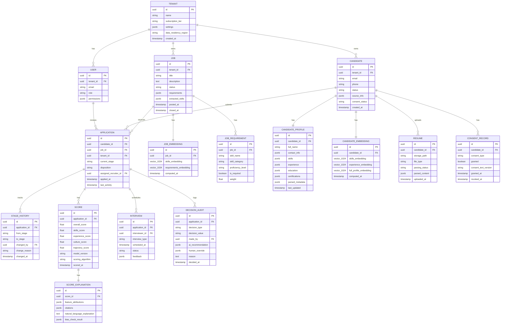

# AI Native ATS Cloud SaaS - Low-Level Design

[← Previous: High-Level Design](./02-high-level-design.md) | [Back to Index](./00-index.md) | [Next: Deep Dive & Bottlenecks →](./04-deep-dive-and-bottlenecks.md)

---

## Data Model

### Entity Relationship Diagram



### Key Schema Definitions

#### Candidate Profile (JSON Structure)

```json
{
  "full_name": "Jane Smith",
  "contact_info": {
    "email": "jane.smith@email.com",
    "phone": "+1-555-123-4567",
    "location": {
      "city": "San Francisco",
      "state": "CA",
      "country": "US"
    }
  },
  "skills": [
    {
      "name": "Python",
      "category": "programming_language",
      "proficiency": "expert",
      "years_experience": 8,
      "last_used": "2024",
      "inferred": false
    },
    {
      "name": "Machine Learning",
      "category": "domain",
      "proficiency": "advanced",
      "years_experience": 5,
      "last_used": "2024",
      "inferred": true,
      "inferred_from": ["work_experience", "education"]
    }
  ],
  "experience": [
    {
      "company": "Tech Corp",
      "title": "Senior Data Scientist",
      "start_date": "2020-03",
      "end_date": "present",
      "duration_months": 48,
      "description": "Led ML team...",
      "extracted_skills": ["Python", "TensorFlow", "AWS"],
      "industry": "technology"
    }
  ],
  "education": [
    {
      "institution": "Stanford University",
      "degree": "MS",
      "field": "Computer Science",
      "graduation_year": 2018,
      "gpa": null
    }
  ],
  "certifications": [
    {
      "name": "AWS Solutions Architect",
      "issuer": "Amazon",
      "year": 2022
    }
  ],
  "parsed_metadata": {
    "parser_version": "2.3.1",
    "confidence_score": 0.92,
    "extraction_warnings": [],
    "processing_time_ms": 1250
  }
}
```

#### Score Explanation (JSON Structure)

```json
{
  "feature_attributions": {
    "skills_match": {
      "contribution": 0.35,
      "details": {
        "Python": {"match": "exact", "weight": 0.15},
        "Machine Learning": {"match": "exact", "weight": 0.12},
        "TensorFlow": {"match": "partial", "weight": 0.08}
      }
    },
    "experience_relevance": {
      "contribution": 0.28,
      "details": {
        "years_in_role": {"value": 4, "weight": 0.10},
        "industry_match": {"match": "exact", "weight": 0.08},
        "seniority_alignment": {"match": "above", "weight": 0.10}
      }
    },
    "education_fit": {
      "contribution": 0.12,
      "details": {
        "degree_level": {"match": "meets_requirement", "weight": 0.06},
        "field_relevance": {"match": "exact", "weight": 0.06}
      }
    },
    "trajectory_signal": {
      "contribution": 0.15,
      "details": {
        "career_progression": "positive",
        "role_growth": "consistent"
      }
    },
    "culture_indicators": {
      "contribution": 0.10,
      "details": {
        "collaboration_signals": "present",
        "leadership_signals": "present"
      }
    }
  },
  "citations": [
    {
      "claim": "8 years Python experience",
      "source": "resume",
      "section": "skills",
      "confidence": 0.95
    },
    {
      "claim": "ML leadership experience",
      "source": "resume",
      "section": "experience[0].description",
      "confidence": 0.88
    }
  ],
  "natural_language_explanation": "This candidate scores 87/100 for this role. Key strengths: exact match on required Python and ML skills with 8+ years experience, relevant industry background in technology, and demonstrated career progression from individual contributor to team lead. The candidate meets education requirements with an MS in Computer Science from Stanford. Culture fit signals are positive based on collaboration and leadership indicators in their experience descriptions.",
  "bias_check_result": {
    "disparate_impact_ratio": 0.89,
    "flags": [],
    "adjustments_applied": false
  }
}
```

### Indexing Strategy

| Table | Index | Type | Purpose |
|-------|-------|------|---------|
| `application` | `(tenant_id, job_id, current_stage)` | B-tree | Pipeline queries |
| `application` | `(tenant_id, applied_at DESC)` | B-tree | Recent applications |
| `candidate` | `(tenant_id, email)` | Unique B-tree | Deduplication |
| `candidate_profile` | `(skills)` | GIN | Skill filtering |
| `score` | `(application_id, scored_at DESC)` | B-tree | Latest score lookup |
| `decision_audit` | `(tenant_id, decided_at)` | B-tree | Audit queries |
| `job` | `(tenant_id, status, posted_at)` | B-tree | Active job listing |

### Partitioning Strategy

| Table | Partition Key | Strategy | Rationale |
|-------|---------------|----------|-----------|
| `application` | `tenant_id` | Hash (64 partitions) | Even distribution, tenant isolation |
| `decision_audit` | `decided_at` | Range (monthly) | Time-based retention, query efficiency |
| `stage_history` | `changed_at` | Range (monthly) | Historical queries, archival |
| `candidate_embedding` | `tenant_id` | Hash (64 partitions) | Vector DB sharding alignment |

---

## API Design

### RESTful API Endpoints

#### Job Management

```yaml
# Create job
POST /api/v1/jobs
Request:
  {
    "title": "Senior Data Scientist",
    "description": "We are looking for...",
    "department": "Engineering",
    "location": {"city": "San Francisco", "remote_allowed": true},
    "requirements": {
      "skills": [
        {"name": "Python", "required": true, "min_years": 5},
        {"name": "Machine Learning", "required": true}
      ],
      "education": {"min_degree": "bachelors", "preferred_fields": ["CS", "Statistics"]},
      "experience": {"min_years": 5}
    }
  }
Response: 201 Created
  {
    "id": "job_abc123",
    "status": "draft",
    "extracted_skills": [...],  // AI-extracted from description
    "created_at": "2024-01-15T10:00:00Z"
  }

# Get ranked candidates for job
GET /api/v1/jobs/{job_id}/candidates?sort=ai_score&limit=50&include_explanation=true
Response: 200 OK
  {
    "candidates": [
      {
        "candidate_id": "cand_xyz789",
        "application_id": "app_def456",
        "name": "Jane Smith",
        "current_stage": "screening",
        "scores": {
          "overall": 87,
          "skills": 92,
          "experience": 85,
          "culture": 78,
          "trajectory": 88
        },
        "explanation": {
          "summary": "Strong technical match with relevant ML experience...",
          "top_factors": ["Python expertise", "ML leadership", "Industry experience"],
          "concerns": ["No cloud certification"]
        }
      }
    ],
    "pagination": {"total": 234, "page": 1, "per_page": 50}
  }
```

#### Candidate & Application

```yaml
# Upload resume and create candidate
POST /api/v1/candidates
Content-Type: multipart/form-data
Request:
  - file: resume.pdf
  - source: "linkedin"
  - job_id: "job_abc123" (optional, to auto-create application)
  - consent: {"processing": true, "ai_scoring": true}
Response: 202 Accepted
  {
    "candidate_id": "cand_xyz789",
    "application_id": "app_def456",  // if job_id provided
    "resume_processing": {
      "job_id": "parse_job_123",
      "status": "processing",
      "estimated_completion": "2024-01-15T10:01:00Z"
    }
  }

# Get candidate profile with AI-parsed data
GET /api/v1/candidates/{candidate_id}
Response: 200 OK
  {
    "id": "cand_xyz789",
    "profile": {
      "full_name": "Jane Smith",
      "skills": [...],
      "experience": [...],
      "education": [...]
    },
    "parsing_confidence": 0.92,
    "applications": [
      {"job_id": "job_abc123", "stage": "screening", "score": 87}
    ]
  }

# Advance application stage
POST /api/v1/applications/{application_id}/advance
Request:
  {
    "to_stage": "interview",
    "reason": "Strong technical background",
    "override_ai": false
  }
Response: 200 OK
  {
    "application_id": "app_def456",
    "previous_stage": "screening",
    "current_stage": "interview",
    "ai_recommendation": {"action": "advance", "confidence": 0.85},
    "audit_id": "audit_ghi012"
  }
```

#### AI Scoring

```yaml
# Request AI scoring for application
POST /api/v1/applications/{application_id}/score
Request:
  {
    "scoring_config": {
      "weights": {
        "skills": 0.4,
        "experience": 0.3,
        "culture": 0.15,
        "trajectory": 0.15
      },
      "include_explanation": true,
      "bias_check": true
    }
  }
Response: 202 Accepted
  {
    "score_job_id": "score_job_456",
    "status": "processing",
    "estimated_completion": "2024-01-15T10:00:05Z"
  }

# Get score with explanation
GET /api/v1/applications/{application_id}/score
Response: 200 OK
  {
    "overall_score": 87,
    "component_scores": {
      "skills": 92,
      "experience": 85,
      "culture": 78,
      "trajectory": 88
    },
    "explanation": {
      "feature_attributions": {...},
      "citations": [...],
      "natural_language": "This candidate scores 87/100..."
    },
    "bias_check": {
      "disparate_impact_ratio": 0.89,
      "status": "passed",
      "flags": []
    },
    "model_version": "v2.3.1",
    "scored_at": "2024-01-15T10:00:05Z"
  }
```

#### Conversational Scheduling

```yaml
# Send message to scheduling AI
POST /api/v1/conversations/{conversation_id}/messages
Request:
  {
    "message": "I'm available Tuesday afternoon or Wednesday morning",
    "channel": "sms",
    "candidate_id": "cand_xyz789",
    "application_id": "app_def456"
  }
Response: 200 OK
  {
    "response": "Great! I have the following slots available:\n\n1. Tuesday, Jan 16 at 2:00 PM\n2. Tuesday, Jan 16 at 3:30 PM\n3. Wednesday, Jan 17 at 10:00 AM\n\nWhich works best for you?",
    "parsed_intent": "schedule_interview",
    "available_slots": [
      {"datetime": "2024-01-16T14:00:00Z", "duration_minutes": 60},
      {"datetime": "2024-01-16T15:30:00Z", "duration_minutes": 60},
      {"datetime": "2024-01-17T10:00:00Z", "duration_minutes": 60}
    ],
    "conversation_state": "awaiting_slot_selection"
  }
```

#### Compliance & Audit

```yaml
# Get bias audit report
GET /api/v1/compliance/bias-audit?start_date=2024-01-01&end_date=2024-03-31
Response: 200 OK
  {
    "period": {"start": "2024-01-01", "end": "2024-03-31"},
    "summary": {
      "total_applications_scored": 15234,
      "total_hires": 423,
      "overall_disparate_impact": 0.87
    },
    "by_protected_class": {
      "gender": {
        "male": {"scored": 8234, "hired": 245, "hire_rate": 0.0297},
        "female": {"scored": 6789, "hired": 172, "hire_rate": 0.0253},
        "disparate_impact_ratio": 0.85
      },
      "ethnicity": {...},
      "age_group": {...}
    },
    "ai_model_audit": {
      "model_version": "v2.3.1",
      "score_distribution": {...},
      "feature_importance": {...}
    },
    "compliance_status": {
      "nyc_local_law_144": "compliant",
      "eeoc_4_5_rule": "compliant"
    }
  }

# Request candidate data deletion (GDPR/CCPA)
DELETE /api/v1/candidates/{candidate_id}
Request:
  {
    "reason": "candidate_request",
    "retain_anonymized_for_audit": true
  }
Response: 202 Accepted
  {
    "deletion_job_id": "del_job_789",
    "status": "processing",
    "estimated_completion": "2024-01-15T12:00:00Z",
    "data_to_delete": ["profile", "resumes", "embeddings"],
    "data_to_anonymize": ["audit_logs", "scores"]
  }
```

### API Design Principles

| Principle | Implementation |
|-----------|----------------|
| **Idempotency** | POST operations use client-provided idempotency keys |
| **Versioning** | URL path versioning (`/api/v1/`) |
| **Rate Limiting** | Per-tenant limits, returned in headers |
| **Pagination** | Cursor-based for large collections |
| **Partial Responses** | `fields` query param for selective data |
| **Async Operations** | 202 Accepted with job_id for long-running ops |

### Rate Limits

| Endpoint Category | Limit | Window |
|-------------------|-------|--------|
| Read operations | 1000/min | Per tenant |
| Write operations | 100/min | Per tenant |
| AI scoring | 50/min | Per tenant |
| Bulk operations | 10/min | Per tenant |
| File uploads | 100/hour | Per tenant |

---

## Core Algorithms

### Algorithm 1: Semantic Matching with Vector Similarity

```
ALGORITHM SemanticMatch(job, candidates, top_k)
    INPUT:
        job: Job object with requirements and embedding
        candidates: List of candidate profiles with embeddings
        top_k: Number of top matches to return
    OUTPUT:
        ranked_list: List of (candidate, similarity_score) tuples

    // Step 1: Retrieve job embedding
    job_embedding = GET_EMBEDDING(job.id) // 1024-dim vector

    // Step 2: Build query with filters
    filter_conditions = BUILD_FILTERS(job.requirements)
        // e.g., min_experience >= 3, location IN ['SF', 'Remote']

    // Step 3: Approximate Nearest Neighbor search
    // Using HNSW index for O(log n) complexity
    candidate_ids = VECTOR_SEARCH(
        collection = "candidate_embeddings",
        query_vector = job_embedding,
        top_k = top_k * 2,  // Over-fetch for post-filtering
        filters = filter_conditions,
        metric = "cosine"
    )

    // Step 4: Fetch full profiles for refinement
    profiles = BATCH_GET(candidate_ids)

    // Step 5: Re-rank with detailed scoring
    scored_candidates = []
    FOR candidate IN profiles:
        similarity = COSINE_SIMILARITY(job_embedding, candidate.embedding)

        // Apply skill-level matching refinement
        skill_match = CALCULATE_SKILL_MATCH(job.requirements.skills, candidate.skills)

        // Weighted combination
        final_score = (0.6 * similarity) + (0.4 * skill_match)

        scored_candidates.APPEND((candidate, final_score))

    // Step 6: Sort and return top_k
    SORT(scored_candidates, BY = score, DESC)
    RETURN scored_candidates[:top_k]

FUNCTION CALCULATE_SKILL_MATCH(required_skills, candidate_skills)
    total_weight = 0
    matched_weight = 0

    FOR skill IN required_skills:
        total_weight += skill.weight

        IF skill.name IN candidate_skills:
            candidate_skill = candidate_skills[skill.name]

            // Exact match
            IF candidate_skill.proficiency >= skill.min_proficiency:
                matched_weight += skill.weight
            // Partial match
            ELSE:
                match_ratio = candidate_skill.proficiency / skill.min_proficiency
                matched_weight += skill.weight * match_ratio * 0.7

    RETURN matched_weight / total_weight

TIME COMPLEXITY: O(log n) for ANN search + O(k) for re-ranking
SPACE COMPLEXITY: O(k) for result set
```

### Algorithm 2: Multi-Dimensional Scoring

```
ALGORITHM MultiDimensionalScore(candidate, job, config)
    INPUT:
        candidate: Candidate profile with embeddings
        job: Job requirements
        config: Scoring weights and thresholds
    OUTPUT:
        score_result: Overall score with component breakdown

    // Component 1: Skills Match Score
    skills_score = CALCULATE_SKILLS_SCORE(candidate.skills, job.requirements.skills)

    // Component 2: Experience Score
    experience_score = CALCULATE_EXPERIENCE_SCORE(
        candidate.experience,
        job.requirements.experience
    )

    // Component 3: Culture Fit Score (LLM-based)
    culture_score = CALCULATE_CULTURE_SCORE(candidate, job)

    // Component 4: Career Trajectory Score
    trajectory_score = CALCULATE_TRAJECTORY_SCORE(candidate.experience)

    // Weighted aggregation
    overall_score = (
        config.weights.skills * skills_score +
        config.weights.experience * experience_score +
        config.weights.culture * culture_score +
        config.weights.trajectory * trajectory_score
    )

    RETURN {
        overall: overall_score,
        components: {
            skills: skills_score,
            experience: experience_score,
            culture: culture_score,
            trajectory: trajectory_score
        }
    }

FUNCTION CALCULATE_SKILLS_SCORE(candidate_skills, required_skills)
    scores = []

    FOR req_skill IN required_skills:
        best_match = 0

        FOR cand_skill IN candidate_skills:
            // Semantic similarity between skill names
            similarity = EMBEDDING_SIMILARITY(req_skill.name, cand_skill.name)

            IF similarity > 0.8:  // Consider it a match
                // Factor in proficiency and recency
                proficiency_factor = PROFICIENCY_MAP[cand_skill.proficiency]  // 0.5-1.0
                recency_factor = MAX(0.5, 1.0 - (CURRENT_YEAR - cand_skill.last_used) * 0.1)

                match_score = similarity * proficiency_factor * recency_factor
                best_match = MAX(best_match, match_score)

        // Weight by requirement importance
        weighted_score = best_match * req_skill.weight
        scores.APPEND(weighted_score)

    RETURN SUM(scores) / SUM(req.weight FOR req IN required_skills) * 100

FUNCTION CALCULATE_EXPERIENCE_SCORE(experience, requirements)
    // Total relevant experience
    relevant_years = 0
    industry_match = FALSE
    seniority_match = FALSE

    FOR exp IN experience:
        // Check industry relevance
        IF IS_RELEVANT_INDUSTRY(exp.industry, requirements.preferred_industries):
            relevance = 1.0
            industry_match = TRUE
        ELSE:
            relevance = 0.7

        // Calculate duration
        duration_years = exp.duration_months / 12
        relevant_years += duration_years * relevance

        // Check seniority progression
        IF IS_SENIOR_ROLE(exp.title) AND requirements.seniority == "senior":
            seniority_match = TRUE

    // Score components
    years_score = MIN(100, (relevant_years / requirements.min_years) * 80)
    industry_bonus = 10 IF industry_match ELSE 0
    seniority_bonus = 10 IF seniority_match ELSE 0

    RETURN MIN(100, years_score + industry_bonus + seniority_bonus)

FUNCTION CALCULATE_CULTURE_SCORE(candidate, job)
    // Use LLM to assess culture signals from resume/profile
    prompt = BUILD_CULTURE_PROMPT(candidate.profile, job.culture_attributes)

    llm_response = LLM_INFERENCE(prompt, max_tokens=500)

    // Parse structured response
    culture_signals = PARSE_CULTURE_RESPONSE(llm_response)

    // Score based on signal presence
    score = 0
    FOR signal IN job.culture_attributes:
        IF signal IN culture_signals.detected:
            score += culture_signals.detected[signal].strength * signal.weight

    RETURN NORMALIZE(score, 0, 100)

FUNCTION CALCULATE_TRAJECTORY_SCORE(experience)
    // Analyze career progression
    sorted_exp = SORT(experience, BY = start_date, ASC)

    progression_score = 0
    tenure_score = 0
    growth_score = 0

    FOR i IN RANGE(1, LEN(sorted_exp)):
        prev = sorted_exp[i-1]
        curr = sorted_exp[i]

        // Title progression
        IF SENIORITY_LEVEL(curr.title) > SENIORITY_LEVEL(prev.title):
            progression_score += 20
        ELIF SENIORITY_LEVEL(curr.title) == SENIORITY_LEVEL(prev.title):
            progression_score += 5

        // Reasonable tenure (2-5 years is ideal)
        tenure_months = prev.duration_months
        IF 24 <= tenure_months <= 60:
            tenure_score += 15
        ELIF 12 <= tenure_months < 24:
            tenure_score += 10
        ELIF tenure_months > 60:
            tenure_score += 12
        ELSE:
            tenure_score += 5  // Very short tenure

    // Growth velocity
    total_years = SUM(exp.duration_months FOR exp IN experience) / 12
    level_growth = SENIORITY_LEVEL(sorted_exp[-1].title) - SENIORITY_LEVEL(sorted_exp[0].title)

    IF total_years > 0:
        growth_rate = level_growth / total_years
        growth_score = MIN(30, growth_rate * 20)

    RETURN MIN(100, progression_score + tenure_score + growth_score)

TIME COMPLEXITY: O(s*c) for skills matching + O(1) for LLM call + O(e) for trajectory
    where s=required skills, c=candidate skills, e=experience entries
SPACE COMPLEXITY: O(1)
```

### Algorithm 3: Bias Detection and Mitigation

```
ALGORITHM BiasDetection(scores, demographic_data, threshold)
    INPUT:
        scores: List of (candidate_id, score) tuples
        demographic_data: Map of candidate_id -> demographics
        threshold: Disparate impact threshold (typically 0.8)
    OUTPUT:
        bias_report: Report with disparate impact ratios and flags

    // Group scores by protected classes
    groups = {}
    FOR class IN ["gender", "ethnicity", "age_group", "disability_status"]:
        groups[class] = GROUP_BY_ATTRIBUTE(scores, demographic_data, class)

    bias_report = {
        disparate_impact: {},
        flags: [],
        recommendations: []
    }

    FOR class, class_groups IN groups:
        // Find majority group (highest selection rate)
        selection_rates = {}
        FOR group_name, group_scores IN class_groups:
            selected = COUNT(s FOR s IN group_scores WHERE s.score >= SELECTION_THRESHOLD)
            total = LEN(group_scores)
            selection_rates[group_name] = selected / total IF total > 0 ELSE 0

        majority_rate = MAX(selection_rates.values())

        // Calculate disparate impact for each group
        FOR group_name, rate IN selection_rates:
            IF majority_rate > 0:
                di_ratio = rate / majority_rate
            ELSE:
                di_ratio = 1.0

            bias_report.disparate_impact[f"{class}_{group_name}"] = di_ratio

            // Flag if below threshold (EEOC 4/5 rule)
            IF di_ratio < threshold:
                bias_report.flags.APPEND({
                    "class": class,
                    "group": group_name,
                    "ratio": di_ratio,
                    "severity": "high" IF di_ratio < 0.6 ELSE "medium"
                })

    // Generate recommendations if bias detected
    IF LEN(bias_report.flags) > 0:
        bias_report.recommendations = GENERATE_RECOMMENDATIONS(bias_report.flags)

    RETURN bias_report

ALGORITHM BiasMitigation(candidate, score, bias_report, config)
    INPUT:
        candidate: Candidate with demographic info
        score: Original AI score
        bias_report: Current bias metrics for tenant
        config: Mitigation configuration
    OUTPUT:
        adjusted_score: Score after bias adjustment (if applicable)
        adjustment_applied: Boolean and details

    adjustment_applied = FALSE
    adjusted_score = score
    adjustment_details = {}

    // Check if candidate belongs to underrepresented group
    FOR flag IN bias_report.flags:
        IF MATCHES_GROUP(candidate, flag.class, flag.group):
            // Calculate adjustment factor based on severity
            IF config.mitigation_strategy == "calibration":
                // Calibrate to equalize selection rates
                adjustment_factor = 1.0 / flag.ratio
                max_adjustment = config.max_adjustment  // e.g., 1.1 (10% max boost)
                adjustment_factor = MIN(adjustment_factor, max_adjustment)

                adjusted_score = score * adjustment_factor
                adjustment_applied = TRUE
                adjustment_details = {
                    "class": flag.class,
                    "original_score": score,
                    "adjustment_factor": adjustment_factor,
                    "reason": "disparate_impact_mitigation"
                }

            ELIF config.mitigation_strategy == "flagging":
                // Don't adjust, but flag for human review
                adjustment_details = {
                    "class": flag.class,
                    "flag": "requires_human_review",
                    "reason": f"Candidate from underrepresented group: {flag.group}"
                }

    RETURN {
        score: adjusted_score,
        adjustment_applied: adjustment_applied,
        details: adjustment_details
    }

FUNCTION GENERATE_RECOMMENDATIONS(flags)
    recommendations = []

    FOR flag IN flags:
        IF flag.severity == "high":
            recommendations.APPEND({
                "action": "immediate_review",
                "description": f"Review scoring model for {flag.class} bias",
                "priority": "high"
            })
            recommendations.APPEND({
                "action": "expand_sourcing",
                "description": f"Increase candidate sourcing from {flag.group} communities",
                "priority": "medium"
            })
        ELSE:
            recommendations.APPEND({
                "action": "monitor",
                "description": f"Continue monitoring {flag.class} metrics",
                "priority": "low"
            })

    RETURN recommendations

TIME COMPLEXITY: O(n) where n = number of candidates
SPACE COMPLEXITY: O(g) where g = number of demographic groups
```

### Algorithm 4: Explainability Generation

```
ALGORITHM GenerateExplanation(candidate, job, score_components, config)
    INPUT:
        candidate: Candidate profile
        job: Job requirements
        score_components: Breakdown of scores by factor
        config: Explanation verbosity and format settings
    OUTPUT:
        explanation: Structured explanation with citations

    explanation = {
        feature_attributions: {},
        citations: [],
        natural_language: ""
    }

    // Step 1: Calculate SHAP-style feature attributions
    baseline_score = config.baseline_score  // Average score for this job

    FOR component, component_score IN score_components:
        // Calculate marginal contribution
        contribution = (component_score * config.weights[component]) -
                       (baseline_score * config.weights[component])

        explanation.feature_attributions[component] = {
            "contribution": contribution,
            "details": GET_COMPONENT_DETAILS(component, candidate, job)
        }

    // Step 2: Generate citations for claims
    FOR claim IN EXTRACT_CLAIMS(explanation.feature_attributions):
        citation = FIND_EVIDENCE(claim, candidate.profile, candidate.resume)
        IF citation:
            explanation.citations.APPEND({
                "claim": claim.text,
                "source": citation.source,
                "section": citation.location,
                "confidence": citation.confidence
            })

    // Step 3: Generate natural language explanation
    IF config.include_natural_language:
        prompt = BUILD_EXPLANATION_PROMPT(
            candidate = candidate,
            job = job,
            attributions = explanation.feature_attributions,
            citations = explanation.citations,
            score = score_components.overall
        )

        explanation.natural_language = LLM_INFERENCE(
            prompt = prompt,
            max_tokens = 300,
            temperature = 0.3  // Low temperature for consistency
        )

    // Step 4: Add bias check transparency
    explanation.bias_check = {
        "checked_classes": ["gender", "ethnicity", "age"],
        "disparate_impact_ratio": score_components.bias_metrics.di_ratio,
        "adjustments_applied": score_components.bias_metrics.adjusted
    }

    RETURN explanation

FUNCTION BUILD_EXPLANATION_PROMPT(candidate, job, attributions, citations, score)
    prompt = f"""
    Generate a clear, professional explanation for a candidate's fit score.

    CANDIDATE: {candidate.name}
    JOB: {job.title}
    OVERALL SCORE: {score}/100

    KEY FACTORS:
    {FORMAT_ATTRIBUTIONS(attributions)}

    SUPPORTING EVIDENCE:
    {FORMAT_CITATIONS(citations)}

    Instructions:
    1. Start with the overall assessment (1 sentence)
    2. Highlight top 2-3 strengths with specific evidence
    3. Note any gaps or areas of concern
    4. Keep tone professional and objective
    5. Avoid subjective language or bias
    6. Maximum 3 sentences
    """
    RETURN prompt

FUNCTION FIND_EVIDENCE(claim, profile, resume)
    // Search profile and resume for supporting evidence
    IF claim.type == "skill":
        // Look in skills section
        FOR skill IN profile.skills:
            IF SEMANTIC_MATCH(claim.skill_name, skill.name) > 0.9:
                RETURN {
                    source: "profile",
                    location: "skills",
                    confidence: 0.95
                }

    ELIF claim.type == "experience":
        // Look in experience section
        FOR exp IN profile.experience:
            IF claim.keyword IN exp.description:
                RETURN {
                    source: "profile",
                    location: f"experience.{exp.company}",
                    confidence: 0.85
                }

    ELIF claim.type == "education":
        FOR edu IN profile.education:
            IF MATCHES_CLAIM(claim, edu):
                RETURN {
                    source: "profile",
                    location: "education",
                    confidence: 0.90
                }

    RETURN NULL  // No evidence found

TIME COMPLEXITY: O(c + e + 1) where c=claims, e=experience entries, 1=LLM call
SPACE COMPLEXITY: O(c) for citations storage
```

---

## Resume Parsing Pipeline

### Parsing Flow

```
┌─────────────────────────────────────────────────────────────────┐
│                    RESUME PARSING PIPELINE                      │
├─────────────────────────────────────────────────────────────────┤
│                                                                 │
│  ┌─────────┐    ┌─────────┐    ┌─────────┐    ┌─────────────┐  │
│  │ Document│    │ Layout  │    │   NLP   │    │Normalization│  │
│  │ Ingest  │───▶│Detection│───▶│Extract  │───▶│  & Output   │  │
│  └─────────┘    └─────────┘    └─────────┘    └─────────────┘  │
│       │              │              │               │           │
│       ▼              ▼              ▼               ▼           │
│  ┌─────────┐    ┌─────────┐    ┌─────────┐    ┌─────────────┐  │
│  │• PDF    │    │• Header │    │• Name   │    │• Skill      │  │
│  │• DOCX   │    │• Columns│    │• Email  │    │  taxonomy   │  │
│  │• Scanned│    │• Tables │    │• Skills │    │• Date       │  │
│  │• HTML   │    │• Lists  │    │• Jobs   │    │  format     │  │
│  │         │    │• Sections│   │• Edu    │    │• Title      │  │
│  └─────────┘    └─────────┘    └─────────┘    │  mapping    │  │
│                                               └─────────────┘  │
│                                                                 │
├─────────────────────────────────────────────────────────────────┤
│  OUTPUT: Structured JSON profile + Confidence scores            │
└─────────────────────────────────────────────────────────────────┘
```

### Parsing Algorithm

```
ALGORITHM ParseResume(document)
    INPUT:
        document: Raw document bytes + metadata (type, filename)
    OUTPUT:
        parsed_profile: Structured candidate profile
        confidence: Parsing confidence score
        warnings: List of extraction warnings

    // Step 1: Document type detection and extraction
    IF document.type == "pdf":
        text, layout = EXTRACT_PDF(document.bytes)
        IF IS_SCANNED(text):  // Low text density indicates scanned
            text, layout = OCR_EXTRACT(document.bytes)
    ELIF document.type == "docx":
        text, layout = EXTRACT_DOCX(document.bytes)
    ELIF document.type == "html":
        text, layout = EXTRACT_HTML(document.bytes)

    // Step 2: Section detection
    sections = DETECT_SECTIONS(text, layout)
    // Returns: {contact, summary, experience, education, skills, certifications, ...}

    // Step 3: Entity extraction per section
    profile = {}
    confidence_scores = {}
    warnings = []

    // Contact info extraction
    profile.contact, confidence_scores.contact = EXTRACT_CONTACT(sections.contact)

    // Skills extraction (NER + pattern matching)
    profile.skills, confidence_scores.skills = EXTRACT_SKILLS(
        CONCAT(sections.skills, sections.experience, sections.summary)
    )

    // Experience extraction
    profile.experience, confidence_scores.experience = EXTRACT_EXPERIENCE(sections.experience)

    // Education extraction
    profile.education, confidence_scores.education = EXTRACT_EDUCATION(sections.education)

    // Step 4: Normalization
    profile.skills = NORMALIZE_SKILLS(profile.skills)  // Map to taxonomy
    profile.experience = NORMALIZE_EXPERIENCE(profile.experience)  // Standardize dates, titles

    // Step 5: Calculate overall confidence
    overall_confidence = WEIGHTED_AVG(confidence_scores)

    // Step 6: Validation and warnings
    IF NOT profile.contact.email:
        warnings.APPEND("No email extracted")
    IF LEN(profile.experience) == 0:
        warnings.APPEND("No experience extracted")

    RETURN {
        profile: profile,
        confidence: overall_confidence,
        warnings: warnings,
        metadata: {
            parser_version: PARSER_VERSION,
            processing_time_ms: ELAPSED_TIME(),
            document_pages: layout.page_count
        }
    }

FUNCTION EXTRACT_SKILLS(text)
    skills = []
    confidence_total = 0

    // Method 1: Named Entity Recognition
    ner_skills = NER_MODEL.extract(text, entity_type="SKILL")
    FOR skill IN ner_skills:
        skills.APPEND({
            name: skill.text,
            confidence: skill.score,
            source: "ner"
        })
        confidence_total += skill.score

    // Method 2: Pattern matching against skill database
    pattern_skills = PATTERN_MATCH(text, SKILL_PATTERNS)
    FOR skill IN pattern_skills:
        IF NOT ALREADY_EXTRACTED(skill, skills):
            skills.APPEND({
                name: skill.matched_text,
                confidence: skill.match_score,
                source: "pattern"
            })
            confidence_total += skill.match_score

    // Method 3: LLM extraction for implicit skills
    llm_skills = LLM_EXTRACT_SKILLS(text)
    FOR skill IN llm_skills:
        IF NOT ALREADY_EXTRACTED(skill, skills):
            skills.APPEND({
                name: skill.name,
                confidence: skill.confidence,
                source: "llm",
                inferred: TRUE
            })
            confidence_total += skill.confidence

    avg_confidence = confidence_total / LEN(skills) IF skills ELSE 0
    RETURN skills, avg_confidence

FUNCTION NORMALIZE_SKILLS(raw_skills)
    normalized = []

    FOR skill IN raw_skills:
        // Map to canonical skill taxonomy
        canonical = SKILL_TAXONOMY.lookup(skill.name)

        IF canonical:
            normalized.APPEND({
                name: canonical.name,
                category: canonical.category,
                aliases: [skill.name] IF skill.name != canonical.name ELSE [],
                proficiency: INFER_PROFICIENCY(skill),
                confidence: skill.confidence
            })
        ELSE:
            // Keep original if not in taxonomy
            normalized.APPEND({
                name: skill.name,
                category: "uncategorized",
                proficiency: INFER_PROFICIENCY(skill),
                confidence: skill.confidence * 0.8  // Lower confidence for unknown skills
            })

    // Deduplicate
    normalized = DEDUPE_BY_CANONICAL_NAME(normalized)

    RETURN normalized
```

---

## Database Access Patterns

### Common Query Patterns

| Query | Pattern | Index Used |
|-------|---------|------------|
| Get candidates for job | Point query + filter | `(tenant_id, job_id, current_stage)` |
| Search candidates by skills | GIN array contains | `(skills)` GIN |
| Recent applications | Range scan | `(tenant_id, applied_at DESC)` |
| Candidate dedup check | Point query | `(tenant_id, email)` unique |
| Pipeline stage counts | Aggregate | `(tenant_id, job_id, current_stage)` |
| Audit trail lookup | Range scan | `(tenant_id, application_id, decided_at)` |

### Caching Strategy

| Data | Cache TTL | Invalidation |
|------|-----------|--------------|
| Job details | 5 minutes | On job update |
| Candidate profile | 5 minutes | On profile update |
| AI scores | 1 hour | On re-score request |
| Pipeline counts | 1 minute | On stage change |
| Search results | 30 seconds | Time-based |
| Bias metrics | 1 hour | On new score |

### Connection Pooling

```
┌─────────────────────────────────────────────────────────────────┐
│                    CONNECTION POOL CONFIG                       │
├─────────────────────────────────────────────────────────────────┤
│                                                                 │
│  Service Instance                                               │
│  ───────────────                                                │
│  • Min connections: 5                                           │
│  • Max connections: 20                                          │
│  • Idle timeout: 10 minutes                                     │
│  • Connection lifetime: 30 minutes                              │
│  • Health check interval: 30 seconds                            │
│                                                                 │
│  Read vs Write Split                                            │
│  ──────────────────                                             │
│  • Write pool: Primary only                                     │
│  • Read pool: Replicas with round-robin                         │
│  • Sticky reads: 5 second window after write                    │
│                                                                 │
│  Tenant Isolation                                               │
│  ────────────────                                               │
│  • SET app.current_tenant = :tenant_id at connection start      │
│  • RLS policies enforce row-level filtering                     │
│                                                                 │
└─────────────────────────────────────────────────────────────────┘
```
