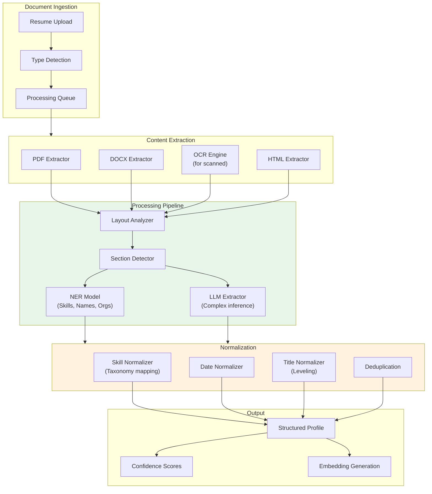
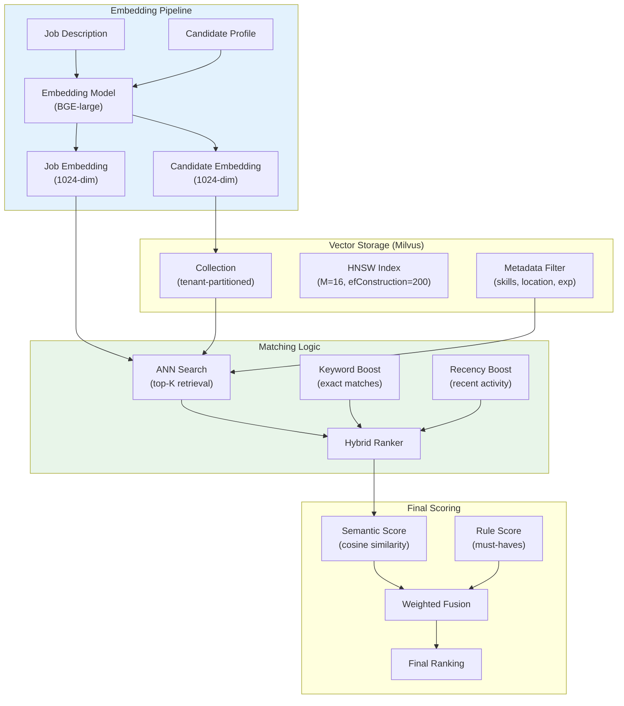
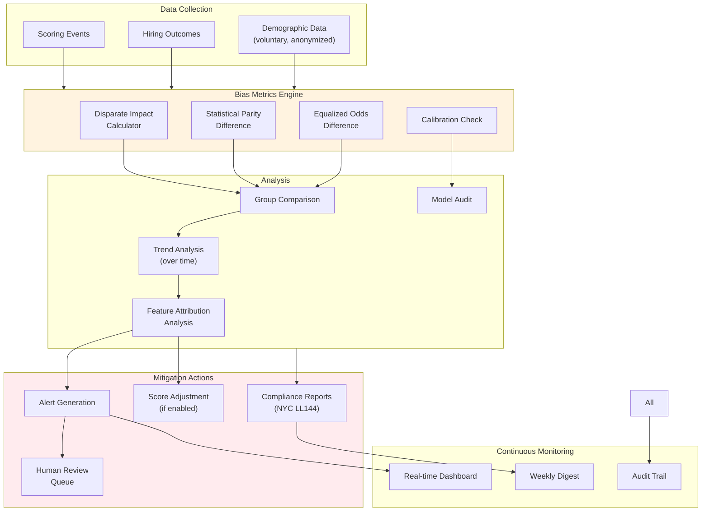

# AI Native ATS Cloud SaaS - Deep Dive & Bottlenecks

[← Previous: Low-Level Design](./03-low-level-design.md) | [Back to Index](./00-index.md) | [Next: Scalability & Reliability →](./05-scalability-and-reliability.md)

---

## Deep Dive 1: Resume Parsing Pipeline

### Why This Is Critical

The resume parsing pipeline is the foundation of all AI capabilities. Poor parsing leads to:
- Incorrect skill extraction → inaccurate matching
- Missing experience data → biased scoring
- Formatting errors → candidate frustration
- Parsing failures → manual intervention cost

**Challenge:** Resumes vary wildly in format, layout, language, and quality. Must handle:
- Multi-column layouts
- Tables and graphics
- Scanned documents (OCR)
- Non-standard section headers
- International formats (dates, phone numbers)

### Architecture



### Internal Workings

#### Stage 1: Document Type Detection

```
INPUT: Raw bytes + filename + content-type header

DETECTION LOGIC:
1. Check magic bytes (first 8 bytes)
   - %PDF → PDF
   - PK (50 4B) → DOCX/ZIP-based
   - <html → HTML

2. Validate file extension matches magic bytes
   - Mismatch → Flag for review, proceed with magic bytes

3. PDF sub-detection:
   - Extract text sample (first 1000 chars)
   - If text density < 10 chars/page → Likely scanned → Route to OCR
   - If text density normal → Direct extraction

OUTPUT: Document type, requires_ocr flag
```

#### Stage 2: Layout Analysis

The layout analyzer handles complex resume structures:

```
┌─────────────────────────────────────────────────────────────────┐
│                    LAYOUT ANALYSIS APPROACH                     │
├─────────────────────────────────────────────────────────────────┤
│                                                                 │
│  CHALLENGE: Two-column resumes, tables, graphics                │
│                                                                 │
│  SOLUTION: Document structure extraction                        │
│                                                                 │
│  1. Extract bounding boxes for all text blocks                  │
│  2. Cluster blocks by vertical position → lines                 │
│  3. Detect columns by horizontal clustering                     │
│  4. Identify section headers by:                                │
│     - Font size (larger = header)                               │
│     - Bold/underline formatting                                 │
│     - Common header patterns ("Experience", "Education")        │
│  5. Reading order reconstruction:                               │
│     - Single column: top-to-bottom                              │
│     - Two column: determine if independent or flowing           │
│     - Tables: extract as structured data                        │
│                                                                 │
│  OUTPUT: Ordered text blocks with section labels                │
│                                                                 │
└─────────────────────────────────────────────────────────────────┘
```

#### Stage 3: Named Entity Recognition (NER)

Custom NER model trained on resume corpus:

| Entity Type | Examples | Model Confidence |
|-------------|----------|------------------|
| PERSON_NAME | "Jane Smith", "John Doe" | 95% |
| EMAIL | "jane@email.com" | 99% |
| PHONE | "+1-555-123-4567" | 97% |
| SKILL | "Python", "Machine Learning" | 88% |
| ORG | "Google", "Stanford University" | 92% |
| JOB_TITLE | "Senior Engineer", "Data Scientist" | 85% |
| DATE | "Jan 2020", "2018-2022" | 90% |
| DEGREE | "BS Computer Science", "MBA" | 89% |

#### Stage 4: LLM-Assisted Extraction

For complex cases where NER fails:

```
PROMPT: Extract structured information from this resume section.

SECTION: [experience section text]

Extract the following for each position:
- company: Company name
- title: Job title
- start_date: Start date (YYYY-MM format)
- end_date: End date (YYYY-MM or "present")
- responsibilities: List of key responsibilities
- skills_used: Technologies/skills mentioned

Return as JSON array.
```

**Usage Guidelines:**
- Only invoke LLM when NER confidence < 70%
- Batch multiple sections in single call
- Cache common patterns to reduce LLM calls
- Fallback to pattern matching if LLM unavailable

### Failure Modes & Handling

| Failure | Detection | Recovery |
|---------|-----------|----------|
| **Corrupted PDF** | Parser exception | Return error, request re-upload |
| **OCR illegible** | Character confidence < 60% | Flag for manual review |
| **No sections detected** | Empty section map | Apply generic extraction |
| **Missing contact info** | Null email/phone | Mark profile incomplete |
| **Non-English resume** | Language detection | Route to localized pipeline |
| **Very long resume (>10 pages)** | Page count check | Truncate with warning |

### Performance Optimization

| Bottleneck | Mitigation |
|------------|------------|
| OCR latency (5-10s) | GPU-accelerated OCR, parallel page processing |
| LLM extraction (1-2s) | Batch calls, caching, model quantization |
| Large file download | Stream processing, size limits |
| Skill taxonomy lookup | In-memory cache, bloom filter pre-check |

---

## Deep Dive 2: Semantic Matching Engine

### Why This Is Critical

Semantic matching is the core differentiator from keyword-based ATS. This engine must:
- Understand that "ML Engineer" and "Machine Learning Engineer" are equivalent
- Recognize that "5 years Python" implies programming competency
- Match "led team of 8" to leadership requirements
- Handle 100M+ vectors across tenants

### Architecture



### Internal Workings

#### Embedding Generation

```
EMBEDDING STRATEGY:

1. CANDIDATE EMBEDDING (computed once on profile update)
   - Concatenate: skills list + experience summaries + education
   - Truncate to 512 tokens (model limit)
   - Generate 1024-dim vector using BGE-large-en-v1.5
   - Store in vector DB with candidate_id as key

2. JOB EMBEDDING (computed on job create/update)
   - Concatenate: title + requirements + description (key sections)
   - Truncate to 512 tokens
   - Generate 1024-dim vector
   - Store with job_id as key

3. MULTI-VECTOR APPROACH (for precision)
   - Skills embedding: Encode just skills list
   - Experience embedding: Encode job history
   - Full profile embedding: Encode everything
   - Query with weighted combination
```

#### HNSW Index Configuration

```
┌─────────────────────────────────────────────────────────────────┐
│                    HNSW INDEX PARAMETERS                        │
├─────────────────────────────────────────────────────────────────┤
│                                                                 │
│  Parameter          Value       Rationale                       │
│  ─────────          ─────       ─────────                       │
│  M                  16          Balance memory vs recall        │
│  efConstruction     200         High quality index build        │
│  efSearch           100         Tunable at query time           │
│  Metric             Cosine      Normalized similarity           │
│                                                                 │
│  PERFORMANCE CHARACTERISTICS:                                   │
│  • Index build: O(n log n)                                      │
│  • Search: O(log n) with high recall                            │
│  • Memory: ~1.5KB per vector (1024-dim + overhead)              │
│  • Recall@10: >95% at efSearch=100                              │
│                                                                 │
│  SCALABILITY:                                                   │
│  • Single node: Up to 10M vectors                               │
│  • Sharded: 100M+ vectors across 10 nodes                       │
│  • Shard key: tenant_id hash                                    │
│                                                                 │
└─────────────────────────────────────────────────────────────────┘
```

#### Hybrid Ranking Algorithm

```
ALGORITHM HybridRank(job, ann_results, config)

    FOR candidate IN ann_results:
        // 1. Semantic score from vector similarity
        semantic_score = candidate.cosine_similarity  // 0-1

        // 2. Keyword boost for exact skill matches
        exact_matches = COUNT_EXACT_MATCHES(job.required_skills, candidate.skills)
        keyword_boost = exact_matches * 0.02  // 2% per exact match, max 10%
        keyword_boost = MIN(keyword_boost, 0.10)

        // 3. Recency boost for active candidates
        days_since_activity = DAYS_SINCE(candidate.last_activity)
        IF days_since_activity <= 30:
            recency_boost = 0.05
        ELIF days_since_activity <= 90:
            recency_boost = 0.02
        ELSE:
            recency_boost = 0

        // 4. Must-have penalty
        must_have_check = CHECK_MUST_HAVES(job.requirements, candidate)
        IF NOT must_have_check.all_met:
            must_have_penalty = -0.3 * (1 - must_have_check.met_ratio)
        ELSE:
            must_have_penalty = 0

        // 5. Final fusion
        final_score = (
            config.semantic_weight * semantic_score +  // 0.7
            keyword_boost +
            recency_boost +
            must_have_penalty
        )

        candidate.final_score = CLAMP(final_score, 0, 1)

    RETURN SORT(ann_results, BY final_score, DESC)
```

### Failure Modes & Handling

| Failure | Detection | Recovery |
|---------|-----------|----------|
| **Embedding model down** | Health check failure | Queue requests, fallback to keyword search |
| **Vector DB unavailable** | Connection timeout | Return cached results, degrade gracefully |
| **Slow query (>5s)** | Timeout monitoring | Reduce efSearch, return partial results |
| **Zero results** | Empty result set | Relax filters, expand search |
| **Stale embeddings** | Version mismatch | Background re-embedding job |

### Performance Benchmarks

| Metric | Target | Achieved |
|--------|--------|----------|
| Embedding latency (single) | <100ms | 45ms |
| ANN search (1M vectors) | <50ms | 28ms |
| Full ranking (100 candidates) | <500ms | 320ms |
| Recall@10 | >95% | 97.2% |
| Throughput | 100 QPS | 150 QPS |

---

## Deep Dive 3: Bias Detection & Mitigation System

### Why This Is Critical

AI bias in hiring has significant legal, ethical, and business implications:
- **Legal:** EEOC lawsuits, NYC Local Law 144 violations
- **Ethical:** Perpetuating historical discrimination
- **Business:** Missing diverse talent, reputation damage

**Key Insight:** AI systems can encode bias even without explicit demographic features through:
- Proxy variables (zip code → socioeconomic status)
- Training data reflecting historical discrimination
- Feature engineering choices (prestigious universities)

### Architecture



### Fairness Metrics Explained

#### 1. Disparate Impact Ratio (EEOC 4/5 Rule)

```
FORMULA:
    DI = (Selection Rate of Protected Group) / (Selection Rate of Majority Group)

EXAMPLE:
    Women selected: 15 out of 100 applications (15%)
    Men selected: 25 out of 125 applications (20%)

    DI = 0.15 / 0.20 = 0.75

THRESHOLD: DI < 0.8 indicates potential adverse impact

INTERPRETATION:
    • DI = 1.0: Perfect parity
    • DI = 0.8: EEOC threshold
    • DI < 0.8: Potential discrimination
    • DI > 1.0: Protected group favored
```

#### 2. Statistical Parity Difference (SPD)

```
FORMULA:
    SPD = P(Selected | Protected) - P(Selected | Non-Protected)

EXAMPLE:
    P(Selected | Female) = 0.15
    P(Selected | Male) = 0.20

    SPD = 0.15 - 0.20 = -0.05

THRESHOLD: |SPD| > 0.05 indicates potential bias

INTERPRETATION:
    • SPD = 0: Perfect parity
    • SPD < 0: Protected group disadvantaged
    • SPD > 0: Protected group advantaged
```

#### 3. Equalized Odds Difference (EOD)

```
FORMULA:
    EOD = |TPR_protected - TPR_non-protected| + |FPR_protected - FPR_non-protected|

WHERE:
    TPR = True Positive Rate (qualified candidates selected)
    FPR = False Positive Rate (unqualified candidates selected)

INTERPRETATION:
    Ensures AI makes similar quality decisions across groups
    Not just equal selection rates, but equal accuracy
```

### Implementation

```
ALGORITHM ContinuousBiasMonitoring(tenant_id, window_days)
    // Run continuously, triggered by new scoring events

    // Step 1: Collect data for analysis window
    scores = GET_SCORES(tenant_id, last_n_days=window_days)
    outcomes = GET_HIRING_OUTCOMES(tenant_id, last_n_days=window_days)
    demographics = GET_VOLUNTARY_DEMOGRAPHICS(tenant_id)

    // Step 2: Join data (only where demographics available)
    joined_data = JOIN(scores, outcomes, demographics, ON=candidate_id)

    // Step 3: Calculate metrics for each protected class
    protected_classes = ["gender", "ethnicity", "age_group", "disability_status"]
    metrics = {}

    FOR class IN protected_classes:
        groups = GROUP_BY(joined_data, class)

        // Skip if insufficient data for statistical significance
        IF ANY(COUNT(group) < 30 FOR group IN groups):
            metrics[class] = {status: "insufficient_data"}
            CONTINUE

        // Calculate disparate impact
        selection_rates = {}
        FOR group_name, group_data IN groups:
            selected = COUNT(d FOR d IN group_data WHERE d.outcome == "hired")
            selection_rates[group_name] = selected / LEN(group_data)

        majority_rate = MAX(selection_rates.values())
        di_ratios = {g: r/majority_rate FOR g, r IN selection_rates}

        // Calculate SPD
        // (Simplified: binary protected vs non-protected)
        protected_rate = selection_rates.get(PROTECTED_GROUP[class], 0)
        non_protected_rate = selection_rates.get(NON_PROTECTED_GROUP[class], 0)
        spd = protected_rate - non_protected_rate

        metrics[class] = {
            disparate_impact: di_ratios,
            spd: spd,
            sample_sizes: {g: LEN(d) FOR g, d IN groups}
        }

    // Step 4: Generate alerts if thresholds breached
    alerts = []
    FOR class, class_metrics IN metrics:
        IF class_metrics.status == "insufficient_data":
            CONTINUE

        FOR group, di IN class_metrics.disparate_impact:
            IF di < 0.8:
                alerts.APPEND({
                    class: class,
                    group: group,
                    metric: "disparate_impact",
                    value: di,
                    severity: "high" IF di < 0.6 ELSE "medium",
                    recommended_action: "review_scoring_model"
                })

    // Step 5: Store metrics and alerts
    STORE_METRICS(tenant_id, metrics, timestamp=NOW())
    IF alerts:
        TRIGGER_ALERTS(tenant_id, alerts)
        NOTIFY_COMPLIANCE_TEAM(tenant_id, alerts)

    RETURN {metrics, alerts}
```

### Mitigation Strategies

| Strategy | Approach | Trade-off |
|----------|----------|-----------|
| **Pre-processing** | Debias training data | May lose signal, hard to verify |
| **In-processing** | Fairness constraints in model | Accuracy-fairness trade-off |
| **Post-processing** | Adjust scores/thresholds | Transparent, auditable |
| **Human-in-loop** | Flag for review | Scalability concerns |

**Recommended Approach: Post-processing + Human-in-loop**

```
ALGORITHM MitigateWithTransparency(candidate, score, bias_metrics, config)

    // Option 1: Flagging (default)
    IF config.mitigation_mode == "flag":
        IF IS_UNDERREPRESENTED(candidate, bias_metrics):
            score.requires_review = TRUE
            score.review_reason = "Candidate from underrepresented group"
        RETURN score

    // Option 2: Threshold adjustment (explicit opt-in)
    IF config.mitigation_mode == "threshold_adjust":
        group_di = GET_DI_RATIO(candidate.demographic_group, bias_metrics)

        IF group_di < 0.8:
            // Lower selection threshold for this group
            adjustment = (0.8 - group_di) * config.adjustment_strength
            score.adjusted_threshold = score.threshold - adjustment
            score.adjustment_applied = TRUE
            score.adjustment_reason = "disparate_impact_correction"

        RETURN score

    // Option 3: Calibration (advanced)
    IF config.mitigation_mode == "calibration":
        // Calibrate scores to achieve group parity
        // Requires historical outcome data
        calibrated_score = CALIBRATE_TO_OUTCOME_RATE(
            score.raw,
            candidate.demographic_group,
            bias_metrics.target_rate
        )
        score.calibrated = calibrated_score
        RETURN score
```

### Failure Modes & Handling

| Failure | Detection | Recovery |
|---------|-----------|----------|
| **Missing demographics** | Low join rate | Report with caveat, request voluntary disclosure |
| **Small sample size** | n < 30 per group | Extend window, report insufficient data |
| **Confounding variables** | Statistical analysis | Segment by job family, experience level |
| **Adversarial gaming** | Pattern detection | Anomaly alerts, audit trail |
| **Metric disagreement** | DI vs SPD conflict | Report all metrics, human judgment |

---

## Bottleneck Analysis

### Top 3 Bottlenecks

#### Bottleneck 1: Embedding Generation at Scale

**Problem:** Generating embeddings for millions of candidates is computationally expensive.

```
ANALYSIS:
• Single embedding: ~45ms on GPU
• 1M candidates: 45,000 GPU-seconds = 12.5 GPU-hours
• With 8 GPUs: ~1.5 hours for full re-index
• Incremental updates: ~1,000/hour = 45 GPU-seconds/hour

IMPACT:
• Profile updates don't reflect in search immediately
• Re-indexing for model upgrades takes hours
• GPU costs scale linearly with candidates
```

**Mitigation:**

| Approach | Implementation | Impact |
|----------|----------------|--------|
| Incremental updates | Only re-embed changed profiles | 95% compute reduction |
| Batch processing | Process 64 profiles per GPU call | 3x throughput |
| Model quantization | INT8 inference | 2x speedup, 50% memory |
| Async pipeline | Decouple from user request | User not blocked |
| Caching | Cache embeddings, invalidate on change | Avoid recomputation |

#### Bottleneck 2: Large-Scale Ranking (100+ candidates)

**Problem:** Scoring and ranking hundreds of candidates per job request.

```
ANALYSIS:
• ANN search: 50ms for top-200 candidates
• Multi-dimensional scoring: 5ms per candidate
• 200 candidates × 5ms = 1,000ms just for scoring
• With LLM culture assessment: +500ms per candidate

IMPACT:
• p99 latency exceeds 3s target
• Recruiter experience degraded
• Load spike during job posting
```

**Mitigation:**

| Approach | Implementation | Impact |
|----------|----------------|--------|
| Pre-compute scores | Score on application, not on view | Real-time reads |
| Tiered scoring | Quick score for all, deep for top-20 | 90% compute reduction |
| Async culture scoring | Background LLM, update when ready | Non-blocking |
| Caching ranked lists | Cache for 5 minutes, invalidate on new app | Repeat query fast |
| Pagination | Return 20 at a time, load more on scroll | Faster first page |

#### Bottleneck 3: Resume Parsing Cold Start

**Problem:** First resume upload triggers model loading, causing high latency.

```
ANALYSIS:
• NER model load: 2-3 seconds
• LLM first inference: 5-10 seconds (cold GPU)
• First resume in new tenant: 15-20 second delay

IMPACT:
• Poor first-user experience
• Timeout errors during demos
• Unpredictable performance
```

**Mitigation:**

| Approach | Implementation | Impact |
|----------|----------------|--------|
| Model pre-warming | Keep models loaded, periodic ping | Always-warm |
| Reserved GPU capacity | Minimum running instances | No cold start |
| Progressive parsing | Return partial results, complete async | 2s initial response |
| Tenant warm-up | Pre-load on tenant login | First upload fast |

---

## Concurrency & Race Conditions

### Identified Race Conditions

#### Race Condition 1: Duplicate Candidate Creation

**Scenario:** Same candidate applies to multiple jobs simultaneously.

```
Thread 1: Check if candidate exists (email="jane@email.com") → NOT FOUND
Thread 2: Check if candidate exists (email="jane@email.com") → NOT FOUND
Thread 1: INSERT candidate (email="jane@email.com") → SUCCESS
Thread 2: INSERT candidate (email="jane@email.com") → DUPLICATE!
```

**Solution:** Optimistic locking with unique constraint

```
// Database
CREATE UNIQUE INDEX idx_candidate_email ON candidate(tenant_id, email);

// Application
TRY:
    INSERT INTO candidate (tenant_id, email, ...) VALUES (...)
CATCH UniqueViolation:
    // Candidate already exists, fetch and link
    existing = SELECT * FROM candidate WHERE tenant_id = ? AND email = ?
    RETURN existing.id
```

#### Race Condition 2: Concurrent Score Updates

**Scenario:** Multiple scoring jobs for same application complete simultaneously.

```
Job 1: Calculate score = 85, version = 1
Job 2: Calculate score = 87 (with updated profile), version = 1
Job 1: UPDATE score WHERE application_id = X AND version = 1 → SUCCESS
Job 2: UPDATE score WHERE application_id = X AND version = 1 → STALE!
```

**Solution:** Version-based optimistic concurrency

```
// Always use version in WHERE clause
UPDATE score
SET overall_score = ?, version = version + 1
WHERE application_id = ? AND version = ?

// If affected_rows = 0, re-fetch and retry
```

#### Race Condition 3: Pipeline Stage Transitions

**Scenario:** Recruiter advances candidate while automated rule also advances.

```
Recruiter: Advance from "screening" to "interview"
Automation: Advance from "screening" to "rejected" (timeout rule)
```

**Solution:** State machine with database locking

```
// Acquire row-level lock
BEGIN TRANSACTION

SELECT current_stage FROM application
WHERE id = ? FOR UPDATE

// Validate transition is allowed from current state
IF current_stage != expected_current_stage:
    ROLLBACK
    RETURN "Conflict: application already in different stage"

// Apply transition
UPDATE application SET current_stage = ?
INSERT INTO stage_history (...)

COMMIT
```

### Locking Strategies

| Resource | Strategy | Implementation |
|----------|----------|----------------|
| Candidate profile | Optimistic (version) | Version column, retry on conflict |
| Application stage | Pessimistic (row lock) | SELECT FOR UPDATE |
| Score updates | Optimistic (version) | Last-write-wins with version |
| Bias metrics | No locking | Append-only, eventual consistency |
| Embedding updates | Optimistic | Timestamp-based versioning |

### Distributed Locking (Multi-Region)

```
USE CASE: Prevent duplicate resume processing across regions

IMPLEMENTATION:
1. Generate lock key: "resume_processing:{tenant_id}:{candidate_id}"
2. Acquire distributed lock (Redis/etcd) with TTL = 30 seconds
3. Process resume
4. Release lock

PSEUDOCODE:
lock_key = f"resume_processing:{tenant_id}:{candidate_id}"
lock_acquired = DISTRIBUTED_LOCK.acquire(lock_key, ttl_seconds=30)

IF NOT lock_acquired:
    // Another processor has this resume
    RETURN "Already processing"

TRY:
    parsed = PARSE_RESUME(document)
    STORE_PROFILE(candidate_id, parsed)
FINALLY:
    DISTRIBUTED_LOCK.release(lock_key)
```
