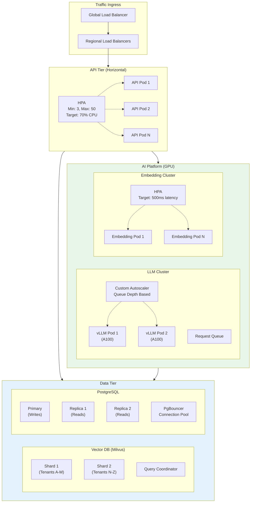
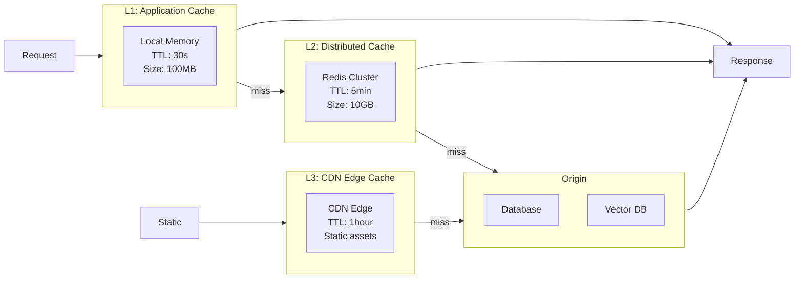
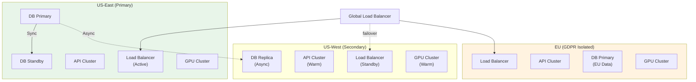
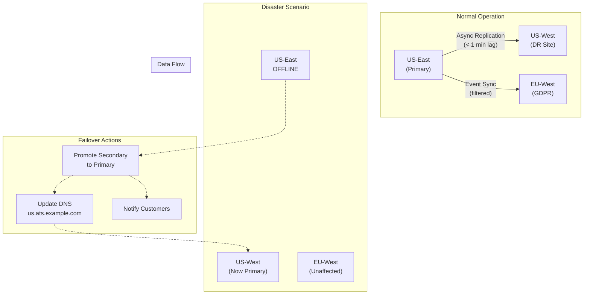

# AI Native ATS Cloud SaaS - Scalability & Reliability

[← Previous: Deep Dive & Bottlenecks](./04-deep-dive-and-bottlenecks.md) | [Back to Index](./00-index.md) | [Next: Security & Compliance →](./06-security-and-compliance.md)

---

## Scalability Strategy

### Horizontal vs Vertical Scaling Decisions

| Component | Scaling Type | Rationale |
|-----------|--------------|-----------|
| **API Services** | Horizontal | Stateless, easily replicated |
| **Resume Parser** | Horizontal | CPU-bound, parallelizable |
| **LLM Inference** | Horizontal + Vertical | GPU-bound, needs larger GPUs AND more of them |
| **Embedding Service** | Horizontal | CPU/GPU, parallelizable |
| **Vector Database** | Horizontal (sharding) | Data volume scales with candidates |
| **Primary Database** | Vertical + Read Replicas | Write scaling limited, read scaling via replicas |
| **Event Bus** | Horizontal (partitions) | Throughput scales with partitions |

### Scaling Architecture



### Auto-Scaling Configuration

#### API Services

```yaml
# Kubernetes HPA Configuration
apiVersion: autoscaling/v2
kind: HorizontalPodAutoscaler
metadata:
  name: ats-api-hpa
spec:
  scaleTargetRef:
    apiVersion: apps/v1
    kind: Deployment
    name: ats-api
  minReplicas: 3
  maxReplicas: 50
  metrics:
    - type: Resource
      resource:
        name: cpu
        target:
          type: Utilization
          averageUtilization: 70
    - type: External
      external:
        metric:
          name: http_requests_per_second
        target:
          type: AverageValue
          averageValue: "100"
  behavior:
    scaleUp:
      stabilizationWindowSeconds: 60
      policies:
        - type: Pods
          value: 4
          periodSeconds: 60
    scaleDown:
      stabilizationWindowSeconds: 300
      policies:
        - type: Percent
          value: 10
          periodSeconds: 60
```

#### GPU Inference (Custom Autoscaler)

```
ALGORITHM GPUAutoscaling(current_pods, queue_metrics, config)

    // Metric: Queue depth and latency
    queue_depth = GET_QUEUE_DEPTH("llm_inference_queue")
    avg_latency_ms = GET_AVG_LATENCY("llm_inference", window="5m")
    current_throughput = GET_THROUGHPUT("llm_inference", window="1m")

    // Target: Queue should be < 100, latency < 1000ms
    target_queue_depth = 100
    target_latency_ms = 1000

    // Calculate desired pods based on queue
    IF queue_depth > target_queue_depth:
        // Each pod can process ~10 requests/second
        required_throughput = queue_depth / config.max_queue_wait_seconds
        desired_pods_queue = CEIL(required_throughput / config.throughput_per_pod)

    // Calculate desired pods based on latency
    IF avg_latency_ms > target_latency_ms:
        latency_ratio = avg_latency_ms / target_latency_ms
        desired_pods_latency = CEIL(current_pods * latency_ratio)

    // Take maximum
    desired_pods = MAX(desired_pods_queue, desired_pods_latency, config.min_pods)
    desired_pods = MIN(desired_pods, config.max_pods)

    // Scale decision
    IF desired_pods > current_pods:
        SCALE_UP(desired_pods)
        LOG("Scaling up LLM pods", current=current_pods, target=desired_pods)
    ELIF desired_pods < current_pods AND cooldown_expired:
        SCALE_DOWN(desired_pods)

    RETURN desired_pods
```

### Database Scaling Strategy

#### PostgreSQL Scaling

```
┌─────────────────────────────────────────────────────────────────┐
│                    DATABASE SCALING STRATEGY                    │
├─────────────────────────────────────────────────────────────────┤
│                                                                 │
│  PHASE 1: Vertical Scaling (Initial)                            │
│  ─────────────────────────────────────                          │
│  • Start with large instance (32 vCPU, 128GB RAM)               │
│  • Scale up to 64 vCPU, 256GB RAM                               │
│  • Add read replicas (2-4 per region)                           │
│                                                                 │
│  PHASE 2: Read Scaling                                          │
│  ─────────────────────                                          │
│  • Route read queries to replicas                               │
│  • Use sticky sessions for read-your-writes                     │
│  • Scale to 8+ replicas per region                              │
│                                                                 │
│  PHASE 3: Functional Partitioning                               │
│  ─────────────────────────────────                              │
│  • Separate databases for:                                      │
│    - ATS core (candidates, applications)                        │
│    - Audit logs (append-only, high write)                       │
│    - Analytics (aggregated, OLAP-optimized)                     │
│                                                                 │
│  PHASE 4: Horizontal Sharding (if needed)                       │
│  ───────────────────────────────────────                        │
│  • Shard by tenant_id (Citus extension)                         │
│  • Dedicated databases for large enterprise tenants             │
│  • Cross-shard queries via coordinator                          │
│                                                                 │
└─────────────────────────────────────────────────────────────────┘
```

#### Vector Database Scaling

```
MILVUS SHARDING STRATEGY:

1. COLLECTION DESIGN
   - One collection per tenant (< 10M vectors): Simple isolation
   - Shared collection with tenant_id field (> 10M vectors): Efficiency

2. SHARDING CONFIGURATION
   - Shard key: hash(tenant_id)
   - Number of shards: 16 (scales to 64)
   - Replication factor: 2 (HA)

3. QUERY ROUTING
   - Tenant queries route to specific shards
   - Cross-tenant analytics query all shards

4. SCALING TRIGGERS
   - Shard > 5M vectors: Add shard
   - Query latency > 100ms: Add query node
   - Memory usage > 80%: Add data node

PSEUDOCODE for shard allocation:

FUNCTION AllocateShard(tenant_id, vector_count)
    shard_id = HASH(tenant_id) % NUM_SHARDS

    // Check if shard is overloaded
    shard_load = GET_SHARD_LOAD(shard_id)
    IF shard_load > THRESHOLD:
        // Rebalance or add shard
        TRIGGER_REBALANCE(shard_id)

    RETURN shard_id
```

### Caching Layers



| Cache Layer | Data | TTL | Invalidation |
|-------------|------|-----|--------------|
| **L1 (Local)** | Hot data, session | 30s | Time-based |
| **L2 (Redis)** | Profiles, scores, job details | 5 min | Event-driven |
| **L3 (CDN)** | Static assets, public job pages | 1 hour | Purge on update |

### Hot Spot Mitigation

| Hot Spot | Detection | Mitigation |
|----------|-----------|------------|
| **Popular job posting** | Query rate > 1000/min | Cache ranked list, stagger scoring |
| **Large tenant** | Tenant QPS > 50% total | Dedicated resources, rate limiting |
| **Viral application link** | Traffic spike on single job | CDN caching, queue admission control |
| **Batch scoring request** | Score 10K+ candidates | Background job, progressive results |

---

## Reliability & Fault Tolerance

### Single Points of Failure (SPOF) Identification

| Component | SPOF Risk | Mitigation |
|-----------|-----------|------------|
| **Load Balancer** | High | Multiple LBs, health checks, failover |
| **API Gateway** | Medium | Clustered deployment, auto-failover |
| **Primary Database** | High | Synchronous standby, auto-failover |
| **LLM Cluster** | Medium | Multiple pods, queue-based routing |
| **Vector DB Coordinator** | High | HA deployment, read replicas |
| **Event Bus (Kafka)** | Medium | Multi-broker, replication factor 3 |

### Redundancy Strategy



### Failover Mechanisms

#### Database Failover

```
AUTOMATED FAILOVER PROCESS:

1. DETECTION (< 30 seconds)
   - Health checks every 5 seconds
   - 3 consecutive failures = unhealthy
   - Consensus among monitoring nodes

2. DECISION (< 10 seconds)
   - Verify primary is truly down (split-brain check)
   - Select standby with most recent data
   - Quorum agreement among control plane

3. PROMOTION (< 60 seconds)
   - Promote standby to primary
   - Update DNS/service discovery
   - Notify connection pools to reconnect

4. RECOVERY
   - Old primary becomes standby after repair
   - Sync from new primary
   - No data loss if sync standby used

TOTAL RTO: < 2 minutes for database failover
```

#### GPU Cluster Failover

```
LLM INFERENCE FAILOVER:

1. PRIMARY PATH
   Request → LLM Queue → GPU Pod → Response

2. FAILURE DETECTION
   - Pod health check fails
   - Request timeout > 30 seconds
   - Error rate > 10%

3. FAILOVER ACTIONS
   a. Reroute to healthy pods in same cluster
   b. If cluster degraded:
      - Enable queue throttling
      - Route overflow to backup cluster
   c. If total failure:
      - Fallback to smaller model (lower quality)
      - Queue requests for later processing
      - Return cached results where available

4. DEGRADATION MODES
   Level 1: Reduced throughput (healthy pods only)
   Level 2: Fallback model (faster, less accurate)
   Level 3: No AI scoring (manual review mode)
```

### Circuit Breaker Patterns

```
CIRCUIT BREAKER CONFIGURATION:

SERVICE: LLM Inference
┌─────────────────────────────────────────────────────────────────┐
│  State: CLOSED → OPEN → HALF-OPEN → CLOSED                      │
├─────────────────────────────────────────────────────────────────┤
│                                                                 │
│  CLOSED (Normal operation)                                      │
│  ─────────────────────────                                      │
│  • Track error rate over 60-second window                       │
│  • Threshold: 50% errors OR 10 consecutive failures             │
│  • If threshold exceeded → OPEN                                 │
│                                                                 │
│  OPEN (Failing fast)                                            │
│  ──────────────────                                             │
│  • Immediately reject/fallback all requests                     │
│  • Duration: 30 seconds                                         │
│  • After timeout → HALF-OPEN                                    │
│                                                                 │
│  HALF-OPEN (Testing recovery)                                   │
│  ──────────────────────────                                     │
│  • Allow 10% of requests through                                │
│  • If success rate > 90% → CLOSED                               │
│  • If failures continue → OPEN                                  │
│                                                                 │
└─────────────────────────────────────────────────────────────────┘

FALLBACK BEHAVIOR:
- LLM scoring fails → Return keyword-based score + flag
- Vector search fails → Return recent applicants + flag
- Resume parsing fails → Queue for retry + notify candidate
```

### Retry Strategies

| Operation | Retry Count | Backoff | Timeout |
|-----------|-------------|---------|---------|
| API calls (internal) | 3 | Exponential (100ms, 200ms, 400ms) | 5s |
| Database queries | 2 | Fixed (50ms) | 10s |
| LLM inference | 2 | Exponential (1s, 2s) | 30s |
| Resume parsing | 3 | Exponential (1s, 5s, 30s) | 5 min |
| External integrations | 3 | Exponential (1s, 5s, 30s) | 30s |

```
RETRY WITH EXPONENTIAL BACKOFF:

FUNCTION RetryWithBackoff(operation, config)
    attempts = 0
    last_error = null

    WHILE attempts < config.max_retries:
        TRY:
            result = operation()
            RETURN result
        CATCH RetryableError AS e:
            last_error = e
            attempts += 1

            IF attempts < config.max_retries:
                delay = config.base_delay * (2 ^ attempts)
                delay = MIN(delay, config.max_delay)
                jitter = RANDOM(0, delay * 0.1)
                SLEEP(delay + jitter)

    THROW MaxRetriesExceeded(last_error)
```

### Graceful Degradation

| Feature | Normal | Degraded | Fully Degraded |
|---------|--------|----------|----------------|
| **AI Scoring** | Full multi-dimensional | Keyword match + basic rules | Manual review queue |
| **Semantic Search** | Vector + hybrid | Keyword only | No search (browse only) |
| **Scheduling AI** | Conversational | Slot selection UI | Manual coordination |
| **Resume Parsing** | Full extraction | Basic text extraction | Manual data entry |
| **Bias Detection** | Real-time alerts | Daily batch reports | No alerts (audit mode) |

### Bulkhead Pattern

```
┌─────────────────────────────────────────────────────────────────┐
│                    BULKHEAD ISOLATION                           │
├─────────────────────────────────────────────────────────────────┤
│                                                                 │
│  RESOURCE POOLS (Isolated)                                      │
│  ─────────────────────────                                      │
│                                                                 │
│  ┌─────────────┐  ┌─────────────┐  ┌─────────────┐              │
│  │   Search    │  │   Scoring   │  │   Parsing   │              │
│  │   Pool      │  │   Pool      │  │   Pool      │              │
│  │             │  │             │  │             │              │
│  │ Threads: 50 │  │ Threads: 20 │  │ Threads: 30 │              │
│  │ Queue: 100  │  │ Queue: 50   │  │ Queue: 200  │              │
│  │ Timeout: 5s │  │ Timeout: 30s│  │ Timeout: 60s│              │
│  └─────────────┘  └─────────────┘  └─────────────┘              │
│                                                                 │
│  BENEFIT: Scoring spike doesn't block search                    │
│  BENEFIT: Parsing backlog doesn't affect real-time ops          │
│                                                                 │
└─────────────────────────────────────────────────────────────────┘
```

---

## Disaster Recovery

### Recovery Objectives

| Metric | Target | Justification |
|--------|--------|---------------|
| **RTO (Recovery Time)** | 4 hours | Business can tolerate short outage |
| **RPO (Recovery Point)** | 1 hour | Lose max 1 hour of applications |
| **MTTR (Mean Time to Repair)** | 2 hours | Automated recovery + manual verification |

### Backup Strategy

```
┌─────────────────────────────────────────────────────────────────┐
│                    BACKUP ARCHITECTURE                          │
├─────────────────────────────────────────────────────────────────┤
│                                                                 │
│  TIER 1: Continuous (< 1 min RPO)                               │
│  ─────────────────────────────────                              │
│  • WAL streaming to standby (PostgreSQL)                        │
│  • Kafka topic replication (factor = 3)                         │
│  • Real-time vector DB replication                              │
│                                                                 │
│  TIER 2: Hourly Snapshots (1 hour RPO)                          │
│  ────────────────────────────────────                           │
│  • Database snapshots to object storage                         │
│  • Vector index snapshots                                       │
│  • Configuration backups                                        │
│                                                                 │
│  TIER 3: Daily Full Backups                                     │
│  ───────────────────────────                                    │
│  • Full database dumps (compressed)                             │
│  • Document storage sync to cold storage                        │
│  • Audit log archival                                           │
│                                                                 │
│  RETENTION:                                                     │
│  • Hourly: 24 hours                                             │
│  • Daily: 30 days                                               │
│  • Monthly: 1 year                                              │
│  • Yearly: 7 years (compliance)                                 │
│                                                                 │
└─────────────────────────────────────────────────────────────────┘
```

### Multi-Region Disaster Recovery



### DR Runbook

```
DISASTER RECOVERY PROCEDURE:

PHASE 1: DETECTION & DECLARATION (0-15 minutes)
─────────────────────────────────────────────────
1. Automated monitoring detects region failure
2. On-call engineer receives alert
3. Verify outage is region-wide (not partial)
4. Declare disaster, initiate DR protocol
5. Notify stakeholders (Slack, PagerDuty, Status Page)

PHASE 2: FAILOVER EXECUTION (15-60 minutes)
──────────────────────────────────────────────
1. Verify DR site data freshness (replication lag)
2. Promote DR database to primary
3. Scale up DR compute resources
4. Update DNS to point to DR site
5. Verify core functionality working
6. Enable write traffic to DR site

PHASE 3: VALIDATION (60-120 minutes)
────────────────────────────────────────
1. Run smoke tests on all critical paths
2. Verify data integrity (checksums, counts)
3. Confirm AI services operational
4. Test external integrations
5. Monitor error rates and latency

PHASE 4: COMMUNICATION (Throughout)
────────────────────────────────────────
1. Update status page with incident details
2. Send customer notifications (email)
3. Provide ETA for full recovery
4. Document incident timeline

PHASE 5: RECOVERY (Post-incident)
────────────────────────────────────────
1. Repair original primary region
2. Re-establish replication
3. Plan failback during maintenance window
4. Conduct post-incident review
```

### Data Recovery Priorities

| Priority | Data Type | Recovery Method | RTO |
|----------|-----------|-----------------|-----|
| **P0** | Candidate PII, applications | Standby promotion | 15 min |
| **P1** | AI scores, audit logs | Event replay | 1 hour |
| **P2** | Vector embeddings | Re-generate from profiles | 4 hours |
| **P3** | Analytics, reports | Rebuild from events | 24 hours |
| **P4** | Cache data | Rebuild on demand | N/A |

---

## Capacity Planning

### Growth Projections

| Metric | Year 1 | Year 2 | Year 3 |
|--------|--------|--------|--------|
| **Tenants** | 500 | 1,500 | 4,000 |
| **Candidates (total)** | 5M | 20M | 60M |
| **Applications/month** | 500K | 2M | 6M |
| **Embeddings stored** | 5M | 20M | 60M |
| **AI inferences/day** | 100K | 500K | 2M |

### Infrastructure Scaling Plan

| Phase | Compute | GPU | Storage | Database |
|-------|---------|-----|---------|----------|
| **Launch** | 20 pods | 8 A100 | 30TB | 3 nodes |
| **Year 1** | 50 pods | 16 A100 | 100TB | 6 nodes |
| **Year 2** | 150 pods | 40 A100 | 300TB | 12 nodes |
| **Year 3** | 400 pods | 100 A100 | 1PB | 24 nodes |

### Cost Efficiency Measures

| Measure | Savings | Implementation |
|---------|---------|----------------|
| **Spot/preemptible instances** | 60-70% | Non-critical batch jobs |
| **Reserved capacity** | 30-40% | Baseline compute/GPU |
| **Auto-scaling** | Variable | Scale down during off-hours |
| **Storage tiering** | 50% | Move old data to cold storage |
| **Model quantization** | 50% GPU | INT8 inference for embeddings |
