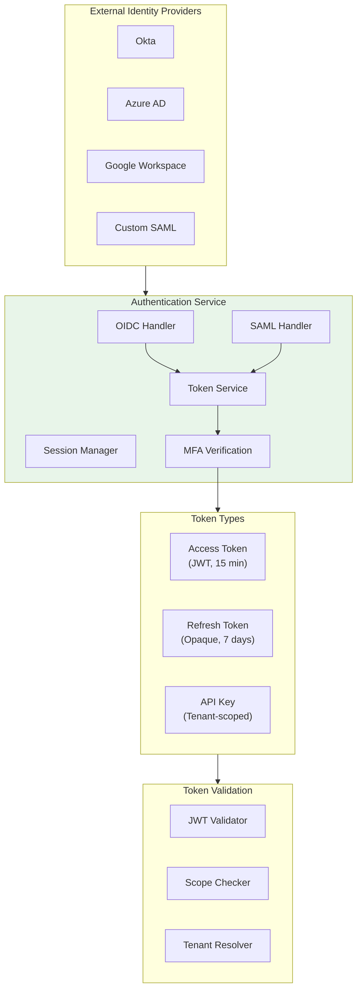

# AI Native ATS Cloud SaaS - Security & Compliance

[← Previous: Scalability & Reliability](./05-scalability-and-reliability.md) | [Back to Index](./00-index.md) | [Next: Observability →](./07-observability.md)

---

## Authentication & Authorization

### Authentication Mechanisms



### Authentication Flow

```
AUTHENTICATION FLOW (OIDC):

1. USER INITIATES LOGIN
   → Redirect to IdP with: client_id, redirect_uri, scope, state, nonce

2. IDP AUTHENTICATES
   → User enters credentials
   → MFA challenge (if configured)
   → IdP returns authorization code

3. TOKEN EXCHANGE
   → ATS backend exchanges code for tokens
   → Validate ID token (signature, issuer, audience, nonce)
   → Extract user claims (email, name, groups)

4. SESSION CREATION
   → Map IdP user to ATS user (by email or IdP subject)
   → Resolve tenant membership
   → Generate ATS access token (JWT) + refresh token
   → Set secure HTTP-only cookies

5. ONGOING VALIDATION
   → Each request: Validate JWT signature, expiry, tenant
   → Token refresh: Use refresh token before expiry
   → Session termination: Revoke on logout or security event
```

### Authorization Model (RBAC)

| Role | Permissions | Scope |
|------|-------------|-------|
| **Super Admin** | Full system access | Platform-wide |
| **Tenant Admin** | Tenant settings, user management | Single tenant |
| **Hiring Manager** | Create jobs, view all candidates for own jobs | Own jobs |
| **Recruiter** | Full ATS operations, view assigned jobs | Assigned jobs |
| **Interviewer** | View assigned candidates, submit feedback | Assigned interviews |
| **Read-Only** | View jobs, candidates (no actions) | Configured scope |

### Permission Matrix

```
┌─────────────────────────────────────────────────────────────────┐
│                    PERMISSION MATRIX                            │
├─────────────────────────────────────────────────────────────────┤
│                                                                 │
│  Resource          SuperAdmin  TenantAdmin  HiringMgr  Recruiter│
│  ────────          ──────────  ───────────  ─────────  ─────────│
│  Jobs                                                           │
│    Create          ✓           ✓            ✓          ✗        │
│    Edit            ✓           ✓            own        assigned │
│    Delete          ✓           ✓            own        ✗        │
│    View            ✓           ✓            ✓          assigned │
│                                                                 │
│  Candidates                                                     │
│    View Profile    ✓           ✓            own_jobs   assigned │
│    Edit Profile    ✓           ✓            ✗          assigned │
│    View Score      ✓           ✓            own_jobs   assigned │
│    Override Score  ✓           ✓            own_jobs   ✗        │
│                                                                 │
│  Applications                                                   │
│    Advance Stage   ✓           ✓            own_jobs   assigned │
│    Reject          ✓           ✓            own_jobs   assigned │
│    View History    ✓           ✓            own_jobs   assigned │
│                                                                 │
│  Reports                                                        │
│    Bias Audit      ✓           ✓            ✗          ✗        │
│    EEOC Report     ✓           ✓            ✗          ✗        │
│    Pipeline Stats  ✓           ✓            own_jobs   assigned │
│                                                                 │
│  Settings                                                       │
│    Tenant Config   ✓           ✓            ✗          ✗        │
│    User Mgmt       ✓           ✓            ✗          ✗        │
│    Integrations    ✓           ✓            ✗          ✗        │
│                                                                 │
└─────────────────────────────────────────────────────────────────┘
```

### API Key Management

```
API KEY STRUCTURE:

Format: ats_{tenant_id}_{random_32_chars}
Example: ats_acme123_a1b2c3d4e5f6g7h8i9j0k1l2m3n4o5p6

STORAGE:
- Hash stored in database (SHA-256)
- Original shown once on creation
- Associated with: tenant_id, scopes, expiry, created_by

SCOPES:
- read:candidates - Read candidate data
- write:candidates - Create/update candidates
- read:jobs - Read job postings
- write:jobs - Create/update jobs
- read:applications - Read applications
- write:applications - Update application state
- admin:reports - Access compliance reports

ROTATION:
- Keys expire after 1 year (configurable)
- Grace period: 30 days (both keys work)
- Audit log on key usage
```

### Token Management

| Token Type | Format | Lifetime | Storage | Rotation |
|------------|--------|----------|---------|----------|
| **Access Token** | JWT (RS256) | 15 minutes | Client memory | Auto-refresh |
| **Refresh Token** | Opaque (UUID) | 7 days | Secure cookie + DB | On use |
| **API Key** | Prefixed string | 1 year | Hashed in DB | Manual |
| **Session Token** | UUID | 24 hours | Server-side + cookie | On activity |

---

## Data Security

### Encryption at Rest

```
┌─────────────────────────────────────────────────────────────────┐
│                    ENCRYPTION KEY HIERARCHY                     │
├─────────────────────────────────────────────────────────────────┤
│                                                                 │
│                      ┌──────────────┐                           │
│                      │  Master Key  │                           │
│                      │    (HSM)     │                           │
│                      └──────┬───────┘                           │
│                             │                                   │
│              ┌──────────────┼──────────────┐                    │
│              │              │              │                    │
│        ┌─────▼────┐  ┌──────▼─────┐  ┌─────▼─────┐              │
│        │  KEK-US  │  │  KEK-EU    │  │  KEK-APAC │              │
│        │(Regional)│  │ (Regional) │  │(Regional) │              │
│        └─────┬────┘  └──────┬─────┘  └─────┬─────┘              │
│              │              │              │                    │
│     ┌────────┼────────┐     │        ┌─────┼─────┐              │
│     │        │        │     │        │     │     │              │
│  ┌──▼──┐  ┌──▼──┐  ┌──▼──┐  │     ┌──▼──┐ ... (DEKs)           │
│  │DEK-1│  │DEK-2│  │DEK-3│  │     │DEK-N│                       │
│  │Acme │  │Beta │  │Gamma│  │     │Zeta │                       │
│  └─────┘  └─────┘  └─────┘  │     └─────┘                       │
│                             │                                   │
│  DEK = Data Encryption Key (per tenant)                         │
│  KEK = Key Encryption Key (per region)                          │
│  Master Key = Root key in HSM, never exported                   │
│                                                                 │
└─────────────────────────────────────────────────────────────────┘

ENCRYPTION DETAILS:
- Algorithm: AES-256-GCM
- DEK rotation: Every 90 days
- KEK rotation: Every 1 year
- Master key: Never rotated (HSM protected)
```

### Encryption in Transit

| Connection | Protocol | Cipher Suite |
|------------|----------|--------------|
| Client → Load Balancer | TLS 1.3 | AES-256-GCM, ChaCha20-Poly1305 |
| Service → Service | mTLS | TLS 1.3 + client certs |
| Service → Database | TLS 1.2+ | AES-256-GCM |
| Database replication | TLS 1.2+ | AES-256-GCM |

### PII Handling

```
PII CLASSIFICATION:

TIER 1 - HIGHLY SENSITIVE (Encrypted at field level)
─────────────────────────────────────────────────────
• Social Security Number (if collected)
• Government ID numbers
• Financial account numbers
• Health information (if applicable)

TIER 2 - SENSITIVE (Encrypted at rest, access logged)
─────────────────────────────────────────────────────
• Full name
• Email address
• Phone number
• Home address
• Date of birth
• Resume content
• Interview notes

TIER 3 - OPERATIONAL (Standard encryption at rest)
─────────────────────────────────────────────────────
• Job application status
• AI scores (non-identifiable)
• Aggregated metrics
• System logs (anonymized)

HANDLING RULES:
• Tier 1: Never logged, field-level encryption, strict access
• Tier 2: Access logged, encrypted at rest, retention limits
• Tier 3: Standard security controls
```

### Data Masking & Anonymization

```
MASKING STRATEGIES:

1. DISPLAY MASKING (UI)
   Email: j***@example.com
   Phone: ***-***-1234
   SSN: ***-**-6789

2. LOG MASKING (Automatic)
   Before: {"email": "jane@email.com", "action": "login"}
   After: {"email": "[REDACTED]", "action": "login"}

3. ANALYTICS ANONYMIZATION
   - Remove direct identifiers (name, email, phone)
   - Generalize quasi-identifiers (age → age_group, zip → region)
   - k-anonymity: Each record indistinguishable from k-1 others
   - Minimum k = 5 for hiring analytics

4. DELETION ANONYMIZATION (Right to erasure)
   - Replace PII with "[DELETED]" tokens
   - Retain anonymized record for aggregate statistics
   - Remove from all backups (within compliance window)
```

---

## Threat Model

### Top Attack Vectors

```
┌─────────────────────────────────────────────────────────────────┐
│                    THREAT MODEL - STRIDE                        │
├─────────────────────────────────────────────────────────────────┤
│                                                                 │
│  THREAT              VECTOR                     MITIGATION      │
│  ──────              ──────                     ──────────      │
│                                                                 │
│  SPOOFING            Credential theft           MFA, SSO, short │
│                      Session hijacking          token lifetime  │
│                      IdP impersonation          Certificate     │
│                                                 pinning         │
│                                                                 │
│  TAMPERING           Resume modification        Integrity hashes│
│                      Score manipulation         Audit trails    │
│                      Data injection             Input validation│
│                                                                 │
│  REPUDIATION         Deny decision made         Immutable logs  │
│                      False audit claims         Digital signing │
│                                                                 │
│  INFO DISCLOSURE     Candidate data leak        Encryption, RBAC│
│                      Resume exfiltration        DLP, monitoring │
│                      Model extraction           Rate limiting   │
│                                                                 │
│  DENIAL OF SERVICE   API flooding               Rate limiting   │
│                      Resume parsing bomb        Size limits     │
│                      GPU exhaustion             Queue limits    │
│                                                                 │
│  ELEVATION           IDOR (access others' data) Tenant isolation│
│                      Role escalation            RBAC, least priv│
│                      Cross-tenant access        RLS policies    │
│                                                                 │
└─────────────────────────────────────────────────────────────────┘
```

### AI-Specific Threats

| Threat | Description | Mitigation |
|--------|-------------|------------|
| **Prompt Injection** | Malicious content in resume to manipulate parsing | Input sanitization, output validation |
| **Model Extraction** | Repeated queries to reverse-engineer model | Rate limiting, anomaly detection |
| **Adversarial Examples** | Crafted resumes to game scoring | Ensemble models, human review |
| **Data Poisoning** | Manipulate training data to bias model | Training data validation, anomaly detection |
| **Model Inversion** | Infer training data from model outputs | Differential privacy, output perturbation |

### Rate Limiting & DDoS Protection

```
RATE LIMITING CONFIGURATION:

LAYER 1: Edge/CDN
─────────────────
• Global: 10,000 requests/second (total capacity)
• Per IP: 100 requests/second
• Geographic blocking for suspicious regions

LAYER 2: API Gateway
────────────────────
• Per tenant: 1,000 requests/minute
• Per user: 100 requests/minute
• Per endpoint:
  - Resume upload: 10/minute
  - AI scoring: 50/minute
  - Search: 200/minute

LAYER 3: Application
────────────────────
• Circuit breakers on downstream services
• Bulkhead isolation for heavy operations
• Priority queues (paid tiers get priority)

DDOS MITIGATION:
• Anycast DNS for global distribution
• Web Application Firewall (WAF) rules
• Bot detection and challenge
• Automatic traffic analysis and blocking
```

---

## Compliance Framework

### GDPR Compliance

| Article | Requirement | Implementation |
|---------|-------------|----------------|
| **Art. 5** | Data minimization | Only collect necessary data for hiring |
| **Art. 6** | Lawful basis | Legitimate interest (recruiting) + consent for AI |
| **Art. 7** | Consent management | Explicit opt-in for AI scoring, withdrawable |
| **Art. 12-14** | Transparency | Privacy policy, processing purposes disclosed |
| **Art. 15** | Right of access | Self-service data export |
| **Art. 16** | Right to rectification | Candidate can update profile |
| **Art. 17** | Right to erasure | Deletion workflow, retention limits |
| **Art. 20** | Data portability | JSON export of candidate data |
| **Art. 22** | Automated decisions | Explanation for AI scores, human review option |
| **Art. 25** | Privacy by design | Default privacy settings, data minimization |
| **Art. 32** | Security measures | Encryption, access controls, auditing |
| **Art. 33-34** | Breach notification | 72-hour notification, incident response plan |

### GDPR Article 22 - Automated Decision Making

```
ARTICLE 22 COMPLIANCE:

REQUIREMENT:
"The data subject shall have the right not to be subject to a decision
based solely on automated processing, including profiling, which produces
legal effects concerning him or her or similarly significantly affects him."

IMPLEMENTATION:

1. DISCLOSURE
   - Inform candidates AI is used in screening
   - Explain what AI evaluates (skills, experience, fit)
   - Describe how scores influence decisions

2. HUMAN OVERSIGHT
   - No automatic rejections without human review
   - Human reviews flagged low-score candidates
   - Hiring manager makes final decision

3. RIGHT TO EXPLANATION
   - Provide score breakdown on request
   - Explain which factors influenced score
   - Cite specific evidence from resume

4. RIGHT TO OBJECT
   - Candidate can request human-only review
   - Flag in system prevents AI scoring
   - Manual screening queue

5. MEANINGFUL INFORMATION
   - Decision logic documentation
   - Feature importance disclosure
   - Significance and consequences explained
```

### CCPA/CPRA Compliance

| Requirement | Implementation |
|-------------|----------------|
| **Notice at collection** | Privacy policy, data use disclosure |
| **Right to know** | Self-service data access portal |
| **Right to delete** | Deletion request workflow (45-day SLA) |
| **Right to opt-out** | No selling of personal info (N/A) |
| **Right to correct** | Profile editing capability |
| **Right to limit use** | Consent granularity for AI processing |
| **Non-discrimination** | Same service regardless of rights exercise |
| **ADMT disclosure** | Starting April 2027: AI decision notification |

### EEOC Compliance

```
EEOC COMPLIANCE FRAMEWORK:

1. RECORD KEEPING (29 CFR 1602)
   ────────────────────────────
   • Retain application records for 1 year (2 years federal contractor)
   • Track demographic data (voluntary, for reporting)
   • Document selection criteria and decisions

2. ADVERSE IMPACT ANALYSIS
   ─────────────────────────
   • Calculate selection rates by protected class
   • Apply 4/5 (80%) rule for disparate impact
   • Document business necessity if impact found

3. UNIFORM GUIDELINES (29 CFR 1607)
   ─────────────────────────────────
   • Validate selection procedures
   • Document job-relatedness of criteria
   • Consider less discriminatory alternatives

4. EEO-1 REPORTING
   ─────────────────
   • Annual workforce composition report
   • Job categories by race/ethnicity/gender
   • Automated report generation

5. AI-SPECIFIC GUIDANCE
   ─────────────────────
   • EEOC Strategic Enforcement Plan (2023-2027) targets AI
   • Treat AI scoring as "selection procedure"
   • Employer liable for vendor AI discrimination
```

### NYC Local Law 144 (Automated Employment Decision Tools)

```
NYC LOCAL LAW 144 COMPLIANCE:

EFFECTIVE: July 5, 2023

REQUIREMENTS:

1. BIAS AUDIT (Annual)
   ───────────────────
   • Independent auditor required
   • Calculate impact ratios by race/ethnicity and sex
   • Intersectional analysis (e.g., Black women)
   • Published summary on company website

2. NOTICE TO CANDIDATES
   ─────────────────────
   • 10 business days before use of AEDT
   • Disclose: job qualifications assessed, data sources
   • NYC residents: request alternative process

3. DATA RETENTION
   ────────────────
   • Keep audit results for 4 years
   • Make available to candidates upon request

AUDIT REPORT TEMPLATE:
┌─────────────────────────────────────────────────────────────────┐
│  AEDT BIAS AUDIT SUMMARY - [Company Name] - [Date]              │
├─────────────────────────────────────────────────────────────────┤
│  Tool: AI Candidate Scoring System v2.3                         │
│  Auditor: [Independent Auditor Name]                            │
│  Period: [Start Date] to [End Date]                             │
│  Candidates Assessed: [Number]                                  │
│                                                                 │
│  IMPACT RATIOS:                                                 │
│  Sex:                                                           │
│    Male: 1.00 (reference)                                       │
│    Female: 0.87 [PASS]                                          │
│                                                                 │
│  Race/Ethnicity:                                                │
│    White: 1.00 (reference)                                      │
│    Black: 0.82 [PASS]                                           │
│    Hispanic: 0.85 [PASS]                                        │
│    Asian: 0.91 [PASS]                                           │
│                                                                 │
│  Intersectional:                                                │
│    [Detailed breakdown]                                         │
│                                                                 │
│  CONCLUSION: Tool meets 4/5 rule threshold                      │
└─────────────────────────────────────────────────────────────────┘
```

### EU AI Act Compliance (High-Risk AI)

```
EU AI ACT - HIRING AS HIGH-RISK AI:

CLASSIFICATION: Annex III, Area 4(a)
"AI systems intended to be used for recruitment or selection of
natural persons, notably for advertising vacancies, screening or
filtering applications, evaluating candidates"

REQUIREMENTS:

1. RISK MANAGEMENT SYSTEM (Art. 9)
   ─────────────────────────────────
   • Identify and analyze known/foreseeable risks
   • Estimate and evaluate risks
   • Implement mitigation measures
   • Continuous monitoring and updating

2. DATA GOVERNANCE (Art. 10)
   ─────────────────────────────
   • Training data relevance and quality
   • Bias examination and mitigation
   • Data protection compliance

3. TECHNICAL DOCUMENTATION (Art. 11)
   ────────────────────────────────────
   • System description and purpose
   • Design specifications
   • Risk assessment
   • Testing and validation results

4. RECORD-KEEPING (Art. 12)
   ─────────────────────────────
   • Automatic logging of operations
   • Traceability of decisions
   • Retention for regulatory access

5. TRANSPARENCY (Art. 13)
   ────────────────────────────
   • Instructions for use
   • Capabilities and limitations
   • Human oversight requirements

6. HUMAN OVERSIGHT (Art. 14)
   ─────────────────────────────
   • Human able to understand AI output
   • Human able to decide not to use AI
   • Human able to override AI decisions

7. ACCURACY & ROBUSTNESS (Art. 15)
   ────────────────────────────────────
   • Appropriate levels of accuracy
   • Resilient to errors and adversarial attacks
   • Cybersecurity measures
```

---

## Security Operations

### Incident Response Plan

```
INCIDENT RESPONSE PHASES:

PHASE 1: DETECTION & TRIAGE (0-15 minutes)
──────────────────────────────────────────
• Automated alert triggers
• On-call engineer acknowledges
• Initial severity assessment
  - P1: Data breach, system-wide outage
  - P2: Partial outage, potential breach
  - P3: Degraded performance, contained issue

PHASE 2: CONTAINMENT (15-60 minutes)
─────────────────────────────────────
• Isolate affected systems
• Preserve evidence (logs, snapshots)
• Stop ongoing damage
• Communicate to stakeholders

PHASE 3: ERADICATION (1-4 hours)
─────────────────────────────────
• Identify root cause
• Remove threat/fix vulnerability
• Patch affected systems
• Verify removal complete

PHASE 4: RECOVERY (4-24 hours)
──────────────────────────────
• Restore from clean backups
• Gradual traffic restoration
• Enhanced monitoring
• Verify normal operations

PHASE 5: POST-INCIDENT (1-7 days)
──────────────────────────────────
• Incident report
• Root cause analysis
• Lessons learned
• Implement improvements
```

### Data Breach Notification

| Jurisdiction | Notification Timeline | Recipients |
|--------------|----------------------|------------|
| **GDPR (EU)** | 72 hours to DPA, without undue delay to individuals | Supervisory authority + affected individuals |
| **CCPA (CA)** | "Most expedient time possible" | Affected California residents |
| **State laws (varies)** | 30-90 days typical | Affected residents, sometimes AG |
| **Contractual (enterprise)** | Per SLA (often 24-48 hours) | Customer security team |

### Security Audits

| Audit Type | Frequency | Scope |
|------------|-----------|-------|
| **Penetration testing** | Annual | External + internal |
| **Vulnerability scanning** | Weekly | All systems |
| **Code security review** | Per release | Changed code |
| **Access review** | Quarterly | User permissions |
| **Compliance audit (SOC 2)** | Annual | Full controls |
| **Bias audit (NYC LL144)** | Annual | AI scoring system |
