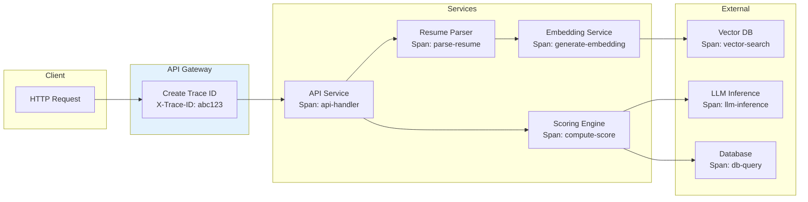

# AI Native ATS Cloud SaaS - Observability

[← Previous: Security & Compliance](./06-security-and-compliance.md) | [Back to Index](./00-index.md) | [Next: Interview Guide →](./08-interview-guide.md)

---

## Metrics Strategy

### USE Method (Utilization, Saturation, Errors)

```
┌─────────────────────────────────────────────────────────────────┐
│                    USE METRICS BY COMPONENT                     │
├─────────────────────────────────────────────────────────────────┤
│                                                                 │
│  API SERVICES                                                   │
│  ────────────                                                   │
│  Utilization: CPU/memory usage per pod                          │
│  Saturation: Request queue depth, connection pool usage         │
│  Errors: 5xx rate, timeout rate, circuit breaker trips          │
│                                                                 │
│  GPU CLUSTER (LLM)                                              │
│  ─────────────────                                              │
│  Utilization: GPU compute %, GPU memory %                       │
│  Saturation: Inference queue depth, batch queue wait            │
│  Errors: OOM errors, inference failures, model load failures    │
│                                                                 │
│  DATABASE                                                       │
│  ────────                                                       │
│  Utilization: CPU, connections, disk I/O                        │
│  Saturation: Lock wait time, replication lag                    │
│  Errors: Query errors, connection errors, deadlocks             │
│                                                                 │
│  VECTOR DATABASE                                                │
│  ───────────────                                                │
│  Utilization: Memory usage, index size                          │
│  Saturation: Query queue depth, compaction backlog              │
│  Errors: Search failures, timeout rate, shard errors            │
│                                                                 │
└─────────────────────────────────────────────────────────────────┘
```

### RED Method (Rate, Errors, Duration)

| Service | Rate Metric | Error Metric | Duration Metric |
|---------|-------------|--------------|-----------------|
| **API Gateway** | Requests/sec by endpoint | Error rate (4xx, 5xx) | p50, p95, p99 latency |
| **Resume Parser** | Resumes parsed/min | Parse failure rate | Parse duration |
| **Scoring Engine** | Scores computed/min | Scoring failure rate | Scoring latency |
| **Vector Search** | Searches/sec | Search error rate | Query latency |
| **Scheduling AI** | Conversations/min | Response failure rate | Response latency |

### Business Metrics

```
┌─────────────────────────────────────────────────────────────────┐
│                    BUSINESS METRICS DASHBOARD                   │
├─────────────────────────────────────────────────────────────────┤
│                                                                 │
│  RECRUITMENT FUNNEL                                             │
│  ──────────────────                                             │
│  • Applications received (today/week/month)                     │
│  • Applications processed by AI (count, %)                      │
│  • Stage conversion rates (apply → screen → interview → offer)  │
│  • Time-to-hire (median, by job type)                           │
│  • Offer acceptance rate                                        │
│                                                                 │
│  AI PERFORMANCE                                                 │
│  ──────────────                                                 │
│  • AI score distribution (histogram)                            │
│  • AI vs Human agreement rate                                   │
│  • Human override rate (AI score changed)                       │
│  • AI recommendation accuracy (vs hiring outcome)               │
│  • Explanation quality score (user feedback)                    │
│                                                                 │
│  FAIRNESS METRICS                                               │
│  ────────────────                                               │
│  • Disparate impact ratio (by protected class)                  │
│  • Score distribution by demographic                            │
│  • Stage advancement rate by demographic                        │
│  • Bias alert count (last 30 days)                              │
│                                                                 │
│  PLATFORM HEALTH                                                │
│  ───────────────                                                │
│  • Active tenants (DAU, WAU, MAU)                               │
│  • API error rate (SLO: <0.1%)                                  │
│  • AI latency p99 (SLO: <1s)                                    │
│  • Resume parse success rate (SLO: >95%)                        │
│                                                                 │
└─────────────────────────────────────────────────────────────────┘
```

### AI-Specific Metrics

| Metric | Description | Target | Alert Threshold |
|--------|-------------|--------|-----------------|
| **Embedding latency** | Time to generate embeddings | <100ms p95 | >200ms p95 |
| **Vector search latency** | ANN search time | <50ms p95 | >100ms p95 |
| **LLM inference latency** | Full LLM generation time | <2s p95 | >3s p95 |
| **Scoring throughput** | Candidates scored per minute | >100/min | <50/min |
| **Model serving memory** | GPU memory utilization | <80% | >90% |
| **Queue depth (LLM)** | Pending inference requests | <100 | >500 |
| **Embedding freshness** | Age of oldest stale embedding | <24h | >48h |
| **Bias drift** | Change in disparate impact ratio | Stable | >5% change/week |

---

## Logging Strategy

### Log Levels and Usage

| Level | Usage | Examples | Retention |
|-------|-------|----------|-----------|
| **ERROR** | System failures, exceptions | Parse failures, API errors, DB errors | 90 days |
| **WARN** | Degradation, recoverable issues | Slow queries, retry success, cache miss | 30 days |
| **INFO** | Business events, state changes | Application created, stage change, score computed | 14 days |
| **DEBUG** | Detailed troubleshooting | Request/response bodies, algorithm steps | 3 days (sampled) |

### Structured Logging Format

```json
{
  "timestamp": "2024-01-15T10:30:45.123Z",
  "level": "INFO",
  "service": "scoring-engine",
  "trace_id": "abc123def456",
  "span_id": "789ghi012",
  "tenant_id": "acme-corp",
  "user_id": "recruiter-jane",
  "event": "score_computed",
  "data": {
    "application_id": "app-xyz789",
    "candidate_id": "cand-abc123",
    "job_id": "job-def456",
    "overall_score": 87,
    "latency_ms": 342,
    "model_version": "v2.3.1"
  },
  "metadata": {
    "region": "us-east-1",
    "pod": "scoring-engine-7f8c9d",
    "version": "1.5.2"
  }
}
```

### Audit Logging

```
AUDIT LOG REQUIREMENTS:

WHAT TO LOG (Immutable audit trail):
────────────────────────────────────
• All AI scoring decisions (score, explanation, model version)
• All human decisions (advance, reject, override)
• All data access (who viewed which candidate)
• All data modifications (profile updates)
• All authentication events (login, logout, failed attempts)
• All permission changes (role assignments)
• All configuration changes (tenant settings)

AUDIT LOG SCHEMA:
─────────────────
{
  "audit_id": "uuid",
  "timestamp": "ISO-8601",
  "actor": {
    "user_id": "string",
    "tenant_id": "string",
    "role": "string",
    "ip_address": "string",
    "user_agent": "string"
  },
  "action": "string (e.g., 'score_candidate', 'advance_stage')",
  "resource": {
    "type": "string (e.g., 'application', 'candidate')",
    "id": "string",
    "tenant_id": "string"
  },
  "details": {
    // Action-specific data
  },
  "outcome": "success | failure | partial",
  "compliance_tags": ["gdpr_art22", "eeoc"]
}

RETENTION:
──────────
• Minimum 5 years (legal/compliance)
• 7 years for federal contractors
• Immutable storage (append-only)
• Tamper-evident (cryptographic chaining)
```

### PII Redaction in Logs

```
PII REDACTION RULES:

ALWAYS REDACT:
──────────────
• Email: jane@email.com → j***@e***.com
• Phone: +1-555-123-4567 → ***-***-4567
• SSN: 123-45-6789 → ***-**-6789
• Full name in debug logs: Jane Smith → [REDACTED]

NEVER LOG:
──────────
• Passwords/secrets
• Full credit card numbers
• Full SSN/government IDs
• Resume file contents
• Interview notes (use IDs only)

IMPLEMENTATION:
───────────────
• Automatic PII detection in logging middleware
• Regex patterns for common PII formats
• ML-based PII detection for free text
• Alert on potential PII in logs
```

---

## Distributed Tracing

### Trace Propagation



### Key Spans to Instrument

| Span Name | Parent | Attributes | Purpose |
|-----------|--------|------------|---------|
| `http.request` | Root | method, path, status, latency | API request tracking |
| `resume.parse` | http.request | file_type, pages, confidence | Parsing performance |
| `embedding.generate` | resume.parse | model, dimensions, batch_size | Embedding latency |
| `vector.search` | http.request | collection, top_k, latency | Search performance |
| `score.compute` | http.request | application_id, model_version | Scoring tracking |
| `llm.inference` | score.compute | model, tokens_in, tokens_out | LLM performance |
| `db.query` | Various | query_type, table, rows | Database performance |
| `bias.check` | score.compute | classes_checked, flags | Fairness monitoring |

### Trace Sampling Strategy

```
SAMPLING CONFIGURATION:

HEAD-BASED SAMPLING:
────────────────────
• Default rate: 10% (1 in 10 requests traced)
• Error requests: 100% (always trace errors)
• Slow requests (>p99): 100% (always trace slow)
• Debug mode: 100% (for troubleshooting)

TAIL-BASED SAMPLING (Enhanced):
────────────────────────────────
• Collect all spans initially
• Decision at trace completion:
  - Trace contains error → keep
  - Trace latency > threshold → keep
  - Trace matches interesting pattern → keep
  - Otherwise → sample at 10%

SPECIAL CASES:
──────────────
• AI scoring requests: 100% (audit requirement)
• Bias-flagged decisions: 100% (compliance)
• New user sessions: 100% (onboarding experience)
• Synthetic probes: 100% (SLO measurement)
```

---

## Alerting

### Alert Priority Levels

| Priority | Response Time | Notification | Examples |
|----------|---------------|--------------|----------|
| **P1 - Critical** | 5 minutes | Page on-call | Data breach, total outage, data loss |
| **P2 - High** | 30 minutes | Page + Slack | Partial outage, AI unavailable, SLO breach |
| **P3 - Medium** | 4 hours | Slack channel | Degraded performance, elevated errors |
| **P4 - Low** | Next business day | Email digest | Warning trends, capacity planning |

### Critical Alerts (Page-Worthy)

```yaml
# Alert: Total API Failure
alert: APITotalFailure
expr: sum(rate(http_requests_total{status=~"5.."}[5m])) / sum(rate(http_requests_total[5m])) > 0.5
for: 2m
labels:
  severity: critical
annotations:
  summary: "More than 50% of API requests failing"
  runbook: "https://runbooks.internal/api-failure"

# Alert: Database Primary Down
alert: DatabasePrimaryDown
expr: pg_up{role="primary"} == 0
for: 30s
labels:
  severity: critical
annotations:
  summary: "Primary database is unreachable"
  runbook: "https://runbooks.internal/db-failover"

# Alert: AI Scoring Complete Failure
alert: AIScoringDown
expr: sum(rate(ai_scoring_requests_total{status="success"}[5m])) == 0
for: 5m
labels:
  severity: critical
annotations:
  summary: "AI scoring has zero successful requests"
  runbook: "https://runbooks.internal/ai-scoring-failure"

# Alert: Data Breach Indicator
alert: PotentialDataBreach
expr: rate(unauthorized_access_attempts[5m]) > 100
for: 1m
labels:
  severity: critical
annotations:
  summary: "High rate of unauthorized access attempts detected"
  runbook: "https://runbooks.internal/security-incident"
```

### Warning Alerts

```yaml
# Alert: AI Latency Degradation
alert: AIScoringLatencyHigh
expr: histogram_quantile(0.99, rate(ai_scoring_duration_seconds_bucket[5m])) > 3
for: 10m
labels:
  severity: warning
annotations:
  summary: "AI scoring p99 latency exceeds 3 seconds"

# Alert: Bias Drift Detected
alert: BiasDriftDetected
expr: abs(disparate_impact_ratio - disparate_impact_ratio offset 7d) > 0.05
for: 1h
labels:
  severity: warning
annotations:
  summary: "Disparate impact ratio changed by >5% compared to last week"

# Alert: Resume Parsing Failures Elevated
alert: ResumeParsingFailuresHigh
expr: rate(resume_parse_failures_total[15m]) / rate(resume_parse_attempts_total[15m]) > 0.1
for: 15m
labels:
  severity: warning
annotations:
  summary: "Resume parsing failure rate exceeds 10%"

# Alert: GPU Memory Pressure
alert: GPUMemoryPressure
expr: gpu_memory_used_bytes / gpu_memory_total_bytes > 0.9
for: 5m
labels:
  severity: warning
annotations:
  summary: "GPU memory utilization exceeds 90%"
```

### Fairness-Specific Alerts

```yaml
# Alert: Disparate Impact Below Threshold
alert: DisparateImpactViolation
expr: disparate_impact_ratio{protected_class=~".+"} < 0.8
for: 1h
labels:
  severity: high
  compliance: "eeoc"
annotations:
  summary: "Disparate impact ratio below 0.8 for {{ $labels.protected_class }}"
  description: "Current ratio: {{ $value }}. EEOC 4/5 rule threshold is 0.8."
  runbook: "https://runbooks.internal/bias-response"

# Alert: Bias Audit Due
alert: BiasAuditOverdue
expr: days_since_last_bias_audit > 365
labels:
  severity: medium
  compliance: "nyc_ll144"
annotations:
  summary: "Annual bias audit is overdue"
  description: "NYC Local Law 144 requires annual independent bias audit"
```

---

## Dashboards

### Executive Dashboard

```
┌─────────────────────────────────────────────────────────────────┐
│                    EXECUTIVE DASHBOARD                          │
├─────────────────────────────────────────────────────────────────┤
│                                                                 │
│  ┌──────────────┐  ┌──────────────┐  ┌──────────────┐          │
│  │  PLATFORM    │  │   HIRING     │  │     AI       │          │
│  │  HEALTH      │  │   FUNNEL     │  │  ACCURACY    │          │
│  │              │  │              │  │              │          │
│  │  ✓ 99.95%    │  │  12,450      │  │    87%       │          │
│  │  Uptime      │  │  Apps/week   │  │  Accuracy    │          │
│  └──────────────┘  └──────────────┘  └──────────────┘          │
│                                                                 │
│  ┌──────────────┐  ┌──────────────┐  ┌──────────────┐          │
│  │  FAIRNESS    │  │  USER        │  │   ERROR      │          │
│  │  STATUS      │  │  ACTIVITY    │  │   RATE       │          │
│  │              │  │              │  │              │          │
│  │  ✓ COMPLIANT │  │  2,340 DAU   │  │   0.03%      │          │
│  │  DI > 0.8    │  │              │  │              │          │
│  └──────────────┘  └──────────────┘  └──────────────┘          │
│                                                                 │
│  [WEEKLY TREND GRAPHS]                                          │
│  ─────────────────────                                          │
│  • Applications processed ▲ 12%                                 │
│  • AI override rate: 8% (stable)                                │
│  • Time-to-hire: 18 days (▼ 2 days)                             │
│                                                                 │
└─────────────────────────────────────────────────────────────────┘
```

### Operations Dashboard

```
┌─────────────────────────────────────────────────────────────────┐
│                    OPERATIONS DASHBOARD                         │
├─────────────────────────────────────────────────────────────────┤
│                                                                 │
│  SERVICE HEALTH                                                 │
│  ──────────────                                                 │
│  ┌─────────────────────────────────────────────────────────┐    │
│  │  Service          Status    Latency(p99)    Error Rate  │    │
│  │  ─────────────    ──────    ────────────    ──────────  │    │
│  │  api-gateway      ✓ OK      45ms            0.02%       │    │
│  │  resume-parser    ✓ OK      2.1s            0.5%        │    │
│  │  scoring-engine   ⚠ WARN    1.8s            0.1%        │    │
│  │  vector-db        ✓ OK      28ms            0.01%       │    │
│  │  llm-cluster      ✓ OK      1.2s            0.05%       │    │
│  │  primary-db       ✓ OK      12ms            0.001%      │    │
│  └─────────────────────────────────────────────────────────┘    │
│                                                                 │
│  RESOURCE UTILIZATION                                           │
│  ────────────────────                                           │
│  CPU: ███████░░░ 68%    Memory: ████████░░ 78%                  │
│  GPU: █████░░░░░ 52%    Disk:   ███░░░░░░░ 34%                  │
│                                                                 │
│  QUEUE DEPTHS                                                   │
│  ────────────                                                   │
│  Resume parsing:  ████░░░░░░ 127/500                            │
│  AI scoring:      ██░░░░░░░░ 45/200                             │
│  LLM inference:   █░░░░░░░░░ 23/100                             │
│                                                                 │
│  RECENT ALERTS                                                  │
│  ─────────────                                                  │
│  • 10:45 [WARN] Scoring latency elevated (resolved)             │
│  • 09:12 [INFO] Auto-scaled LLM cluster: 4 → 6 pods             │
│                                                                 │
└─────────────────────────────────────────────────────────────────┘
```

### Fairness Dashboard

```
┌─────────────────────────────────────────────────────────────────┐
│                    FAIRNESS MONITORING DASHBOARD                │
├─────────────────────────────────────────────────────────────────┤
│                                                                 │
│  DISPARATE IMPACT RATIOS (Last 30 Days)                         │
│  ────────────────────────────────────────                       │
│                                                                 │
│  Protected Class       Ratio    Status    Trend                 │
│  ───────────────       ─────    ──────    ─────                 │
│  Gender (Female)       0.87     ✓ PASS    ↔ Stable              │
│  Race (Black)          0.82     ✓ PASS    ↑ Improving           │
│  Race (Hispanic)       0.85     ✓ PASS    ↔ Stable              │
│  Race (Asian)          0.91     ✓ PASS    ↔ Stable              │
│  Age (40+)             0.79     ⚠ WATCH   ↓ Declining           │
│                                                                 │
│  [THRESHOLD LINE: 0.80 (EEOC 4/5 Rule)]                         │
│                                                                 │
│  SCORE DISTRIBUTION BY DEMOGRAPHIC                              │
│  ────────────────────────────────────                           │
│  [Histogram showing score distributions overlaid by group]      │
│                                                                 │
│  AI OVERRIDE ANALYSIS                                           │
│  ────────────────────                                           │
│  Total overrides: 234 (8% of decisions)                         │
│  Override by demographic:                                       │
│    • Female candidates: 12% override rate                       │
│    • Male candidates: 6% override rate                          │
│    ⚠ Investigate disparity in override rates                    │
│                                                                 │
│  AUDIT TRAIL                                                    │
│  ───────────                                                    │
│  Last audit: 2024-01-15 (87 days ago)                           │
│  Next audit due: 2025-01-15 (278 days)                          │
│  Audit status: ✓ COMPLIANT                                      │
│                                                                 │
└─────────────────────────────────────────────────────────────────┘
```

---

## Runbooks

### Runbook: AI Scoring Degradation

```
RUNBOOK: AI Scoring Latency/Failure

SYMPTOMS:
─────────
• Alert: AIScoringLatencyHigh or AIScoringDown
• Dashboard shows elevated p99 latency or increased error rate
• User reports: slow or failed scoring

DIAGNOSIS STEPS:
────────────────
1. Check GPU cluster status
   → kubectl get pods -n ai-platform -l app=llm-serving
   → Look for: CrashLoopBackOff, OOMKilled, Pending

2. Check inference queue depth
   → metrics: llm_inference_queue_depth
   → If >500: bottleneck at inference

3. Check GPU memory utilization
   → metrics: gpu_memory_used_bytes / gpu_memory_total_bytes
   → If >95%: memory pressure, OOM risk

4. Check model loading status
   → logs: kubectl logs -n ai-platform -l app=llm-serving | grep "model"
   → Look for: load failures, version mismatches

REMEDIATION:
────────────
IF GPU pods unhealthy:
   → kubectl rollout restart deployment/llm-serving -n ai-platform

IF queue depth high:
   → Scale up: kubectl scale deployment/llm-serving --replicas=8 -n ai-platform
   → Enable queue throttling: set env LLM_QUEUE_THROTTLE=true

IF memory pressure:
   → Reduce batch size: set env LLM_BATCH_SIZE=4 (default: 8)
   → Scale up to distribute load

IF model loading fails:
   → Check model registry for corrupted artifacts
   → Rollback to previous model version

FALLBACK:
─────────
If AI scoring cannot be restored in 15 minutes:
1. Enable degraded mode: AI_SCORING_FALLBACK=true
2. System will use keyword-based scoring
3. Flag all scores as "degraded_mode"
4. Communicate to customers via status page

ESCALATION:
───────────
• 15 min: Page ML platform on-call
• 30 min: Page engineering manager
• 60 min: Page CTO for customer communication decision
```

### Runbook: Bias Alert Response

```
RUNBOOK: Disparate Impact Violation

SYMPTOMS:
─────────
• Alert: DisparateImpactViolation
• Dashboard shows DI ratio < 0.8 for a protected class

IMMEDIATE ACTIONS (Within 1 hour):
───────────────────────────────────
1. Verify data accuracy
   → Query: SELECT protected_class, COUNT(*), AVG(score),
            COUNT(*) FILTER (WHERE selected)
            FROM scoring_outcomes GROUP BY protected_class
   → Ensure sample sizes are statistically significant (n > 30)

2. Check for data issues
   → Recent changes to scoring model?
   → Changes in applicant demographics?
   → Data collection issues?

3. Document findings
   → Create incident ticket
   → Note current DI ratio and affected group

INVESTIGATION (Within 24 hours):
─────────────────────────────────
1. Analyze score distribution
   → Compare score distributions across groups
   → Identify if gap is at threshold boundary

2. Review feature importance
   → Run SHAP analysis on recent decisions
   → Identify features causing disparity

3. Check for proxy discrimination
   → Are correlated features causing indirect bias?
   → Examples: zip code, university name, company names

REMEDIATION OPTIONS:
────────────────────
Option A: Threshold Adjustment
   → Lower selection threshold for affected group
   → Requires legal/compliance approval
   → Document justification

Option B: Model Retraining
   → Add fairness constraints to training
   → Use adversarial debiasing
   → Validate on held-out set

Option C: Feature Removal
   → Identify and remove biased features
   → Retrain without problematic features
   → May reduce overall accuracy

Option D: Human Review
   → Flag all affected-group candidates for human review
   → Temporary measure while investigating

COMPLIANCE NOTIFICATION:
────────────────────────
• Notify compliance team within 24 hours
• Document in bias audit trail
• If persistent (>1 week): Consider pausing AI scoring for affected group

ESCALATION:
───────────
• Immediate: Compliance officer
• 24 hours: General counsel (if ratio < 0.6)
• 1 week: Executive team if not resolved
```

---

## SLO Dashboard

```
┌─────────────────────────────────────────────────────────────────┐
│                    SLO STATUS DASHBOARD                         │
├─────────────────────────────────────────────────────────────────┤
│                                                                 │
│  SLO                          Target    Current   Budget        │
│  ───                          ──────    ───────   ──────        │
│  API Availability             99.9%     99.95%    ████████░░    │
│  AI Scoring Availability      99.5%     99.7%     ██████████    │
│  API Latency (p99)            <500ms    320ms     ██████████    │
│  AI Scoring Latency (p99)     <1s       850ms     ████████░░    │
│  Error Rate                   <0.1%     0.03%     ██████████    │
│  Resume Parse Success         >95%      97.2%     ██████████    │
│  Disparate Impact Ratio       >0.8      0.85      ████████░░    │
│                                                                 │
│  ERROR BUDGET BURN RATE (30-day window)                         │
│  ──────────────────────────────────────                         │
│  API Availability:     ░░░░░░░░░░░░░░░░░░░░ 45% consumed        │
│  AI Availability:      ░░░░░░░░░░░░░░░░░░░░ 30% consumed        │
│  API Latency:          ░░░░░░░░░░░░░░░░░░░░ 20% consumed        │
│                                                                 │
│  INCIDENTS CONSUMING BUDGET:                                    │
│  ─────────────────────────────                                  │
│  • Jan 10: DB failover (12 min downtime) - 15% budget           │
│  • Jan 8: LLM cold start (5 min degraded) - 5% budget           │
│                                                                 │
└─────────────────────────────────────────────────────────────────┘
```
