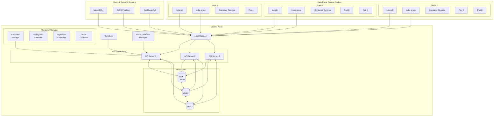
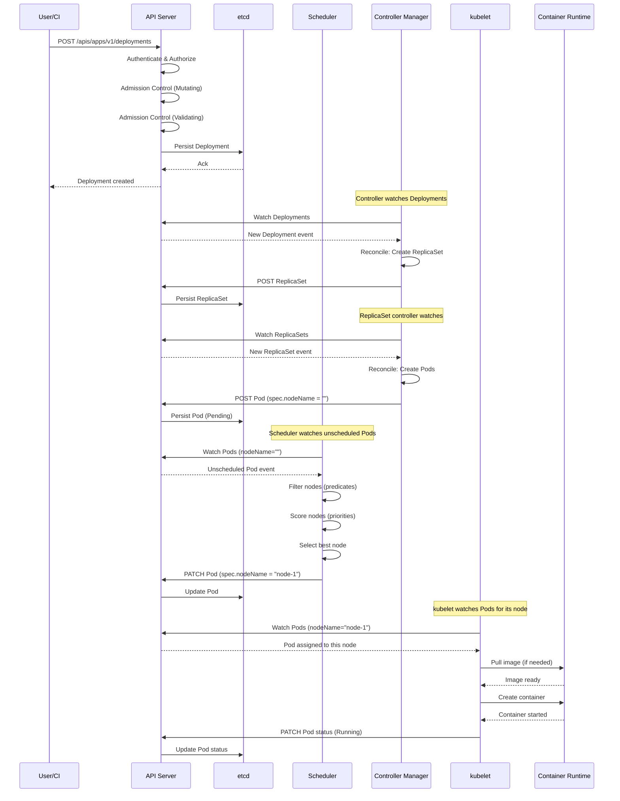
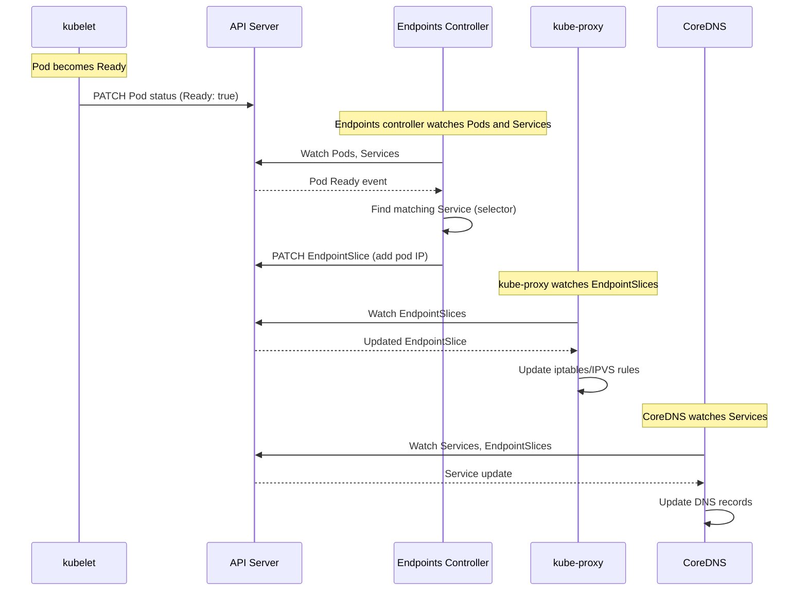
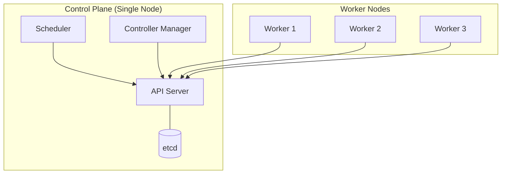
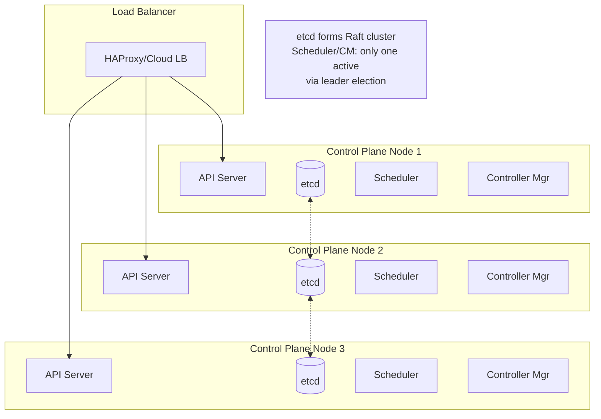
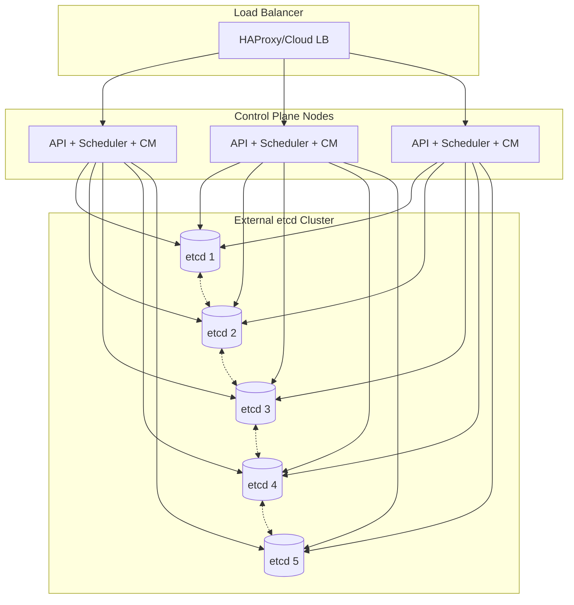
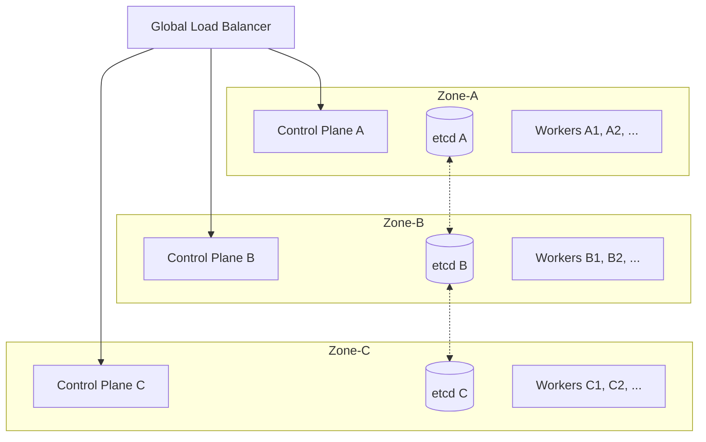

# High-Level Design

[← Back to Index](./00-index.md)

---

## System Architecture

### Control Plane vs Data Plane Overview



### Component Responsibilities

| Component | Layer | Responsibility |
|-----------|-------|---------------|
| **API Server** | Control | RESTful API gateway, authentication, authorization, admission control, watch notifications |
| **etcd** | Control | Persistent storage of all cluster state using Raft consensus |
| **Scheduler** | Control | Watch unscheduled pods, assign to nodes based on constraints and scoring |
| **Controller Manager** | Control | Run reconciliation loops for core resources (Deployment, ReplicaSet, Node, etc.) |
| **Cloud Controller Manager** | Control | Integrate with cloud provider APIs (load balancers, volumes, routes) |
| **kubelet** | Data | Node agent: pod lifecycle, container runtime, health checks, resource monitoring |
| **kube-proxy** | Data | Network proxy implementing Service abstraction via iptables/IPVS rules |
| **Container Runtime** | Data | Execute containers (containerd, CRI-O) via Container Runtime Interface (CRI) |

---

## Data Flow

### Pod Creation Flow



### Service Endpoint Update Flow



---

## Key Architectural Decisions

### 1. Declarative vs Imperative Configuration

| Approach | Pros | Cons | Verdict |
|----------|------|------|---------|
| **Declarative** | Self-healing, idempotent, GitOps-friendly, audit trail | Learning curve, verbose specs | **Chosen** |
| **Imperative** | Simple for one-off tasks, familiar to operators | Not reproducible, no self-healing, drift | Limited use |

**Rationale:** Declarative configuration enables continuous reconciliation. Users specify desired state; the system converges to it. Imperative commands (`kubectl run`) are syntactic sugar that creates declarative specs.

### 2. Centralized vs Distributed Scheduling

| Approach | Pros | Cons | Verdict |
|----------|------|------|---------|
| **Centralized** | Global view, optimal placement, simpler conflict resolution | Scalability limits, single component | **Kubernetes default** |
| **Distributed (cell-based)** | Better scale, lower latency, fault isolation | Complex coordination, suboptimal global placement | Borg/Omega pattern |

**Rationale:** Centralized scheduling works well up to ~5,000 nodes. For larger scale, consider cell architecture or custom scheduling frameworks.

### 3. Watch-based vs Polling Synchronization

| Approach | Pros | Cons | Verdict |
|----------|------|------|---------|
| **Watch (long-poll)** | Real-time updates, efficient bandwidth | Connection management, reconnection logic | **Chosen** |
| **Polling** | Simpler, stateless | High latency, wasted bandwidth | Not used |

**Rationale:** Watch mechanism uses HTTP/2 streaming with `resourceVersion` for efficient incremental updates. Shared informers reduce API server load by multiplexing watches.

### 4. etcd vs Other Storage Backends

| Option | Pros | Cons | Verdict |
|--------|------|------|---------|
| **etcd** | Proven, watch support, strong consistency, Kubernetes-native | Memory-bound, scale limits | **Default** |
| **PostgreSQL/CockroachDB** | Better scale, familiar, SQL queries | No native watch, custom watch layer needed | Emerging (K3s, Kine) |
| **Spanner** | Global scale, strong consistency | Proprietary (Google) | GKE internal |

**Rationale:** etcd is purpose-built for Kubernetes with native watch support. Alternatives require a watch adapter layer.

### 5. Container Network Interface (CNI) Choice

| Option | Model | Pros | Cons |
|--------|-------|------|------|
| **Overlay (Flannel, Calico VXLAN)** | Encapsulation | Works anywhere, no infrastructure changes | Overhead, MTU reduction |
| **Native routing (Calico BGP)** | Direct | Better performance, no encapsulation | Requires network infrastructure support |
| **Cloud-native (AWS VPC CNI)** | Pod IPs from VPC | Native performance, no overlay | Cloud-specific, IP exhaustion risk |
| **eBPF (Cilium)** | Kernel-level | High performance, advanced observability | Complexity, kernel version requirements |

**Recommendation:** Match CNI to infrastructure. Cloud-native for cloud, Cilium for advanced use cases.

---

## Architecture Pattern Checklist

- [x] **Sync vs Async:** Async reconciliation via controllers; sync for critical API operations
- [x] **Event-driven vs Request-response:** Event-driven controllers watching for changes
- [x] **Push vs Pull:** Pull model (watch long-poll), push-like experience
- [x] **Stateless vs Stateful:** Stateless control plane components, state externalized to etcd
- [x] **Read-heavy vs Write-heavy:** Read-heavy (watches, status queries); moderate writes
- [x] **Real-time vs Batch:** Real-time scheduling and reconciliation
- [x] **Leader election:** Scheduler and Controller Manager use lease-based leader election

---

## Deployment Topologies

### Single Control Plane (Development)



**Use:** Development, testing, small clusters
**Risk:** Single point of failure

### Stacked HA Control Plane



**Use:** Production clusters
**Pros:** Simple topology, easier to manage
**Cons:** etcd co-located risks, more resource usage per control plane node

### External etcd Cluster



**Use:** Large production clusters, managed Kubernetes
**Pros:** etcd scaled and managed independently, better resource isolation
**Cons:** More infrastructure, network latency between control plane and etcd

### Multi-Zone HA



**Use:** Regional resilience, zone failure tolerance
**Considerations:** etcd latency across zones, quorum requirements

---

## Integration Points

### Container Runtime Interface (CRI)

```
kubelet ←→ CRI ←→ Container Runtime
           ↓
    ┌──────┴──────┐
    ↓             ↓
containerd      CRI-O
    ↓             ↓
   runc          runc
```

### Container Network Interface (CNI)

```
Pod creation → kubelet → CNI plugin → Network configuration
                              ↓
                    ┌─────────┴─────────┐
                    ↓                   ↓
               Calico/Cilium      AWS VPC CNI
                    ↓                   ↓
            Overlay/BGP routing   VPC ENI attachment
```

### Container Storage Interface (CSI)

```
PVC creation → Controller → CSI Driver → Storage Backend
                                ↓
                    ┌───────────┴───────────┐
                    ↓                       ↓
               EBS CSI Driver         Ceph CSI Driver
                    ↓                       ↓
               AWS EBS API            Ceph RBD/CephFS
```

---

## Failure Modes

| Failure | Impact | Mitigation |
|---------|--------|------------|
| **API Server down** | No new deployments, no kubectl access | Multi-replica with load balancer |
| **etcd quorum loss** | Control plane completely unavailable | 3-5 node cluster, multi-zone |
| **Scheduler down** | New pods stuck in Pending | Leader election, multiple replicas |
| **Controller Manager down** | No reconciliation, drift from desired state | Leader election, multiple replicas |
| **kubelet down** | Node's pods not managed, no health updates | Node controller marks NotReady, reschedules pods |
| **kube-proxy down** | Service routing broken on that node | DaemonSet ensures restart, Cilium alternative |
| **Network partition** | Split-brain, inconsistent state | etcd quorum prevents writes without majority |

**Static Stability:** Data plane continues running during control plane outage. kubelet uses cached pod specs, containers keep running, kube-proxy rules remain in place.
