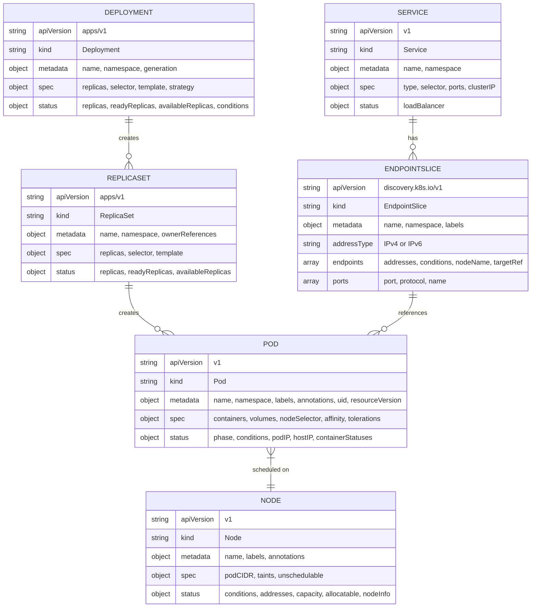
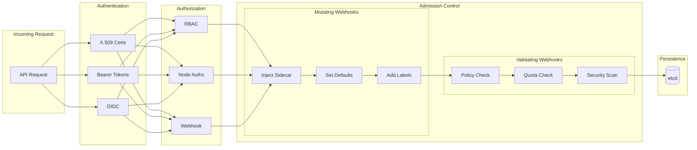
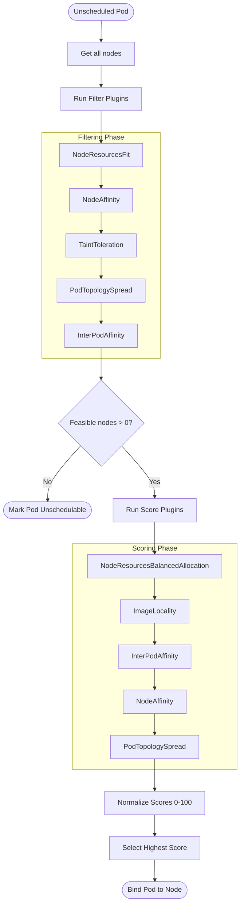
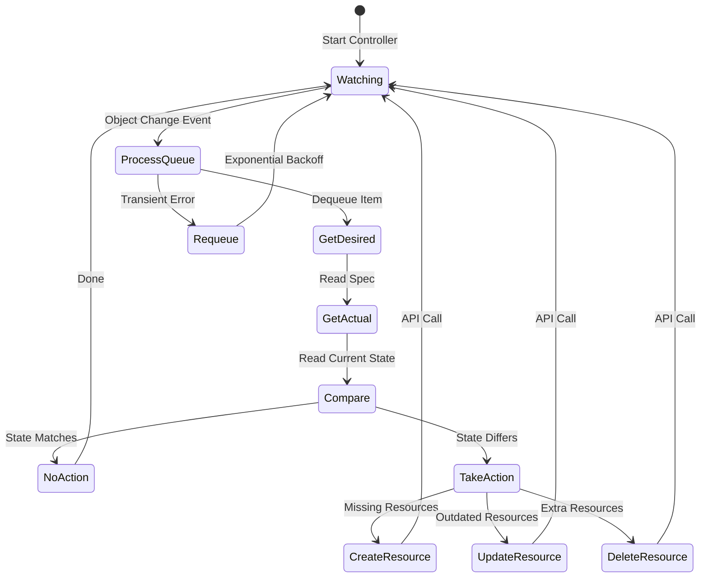
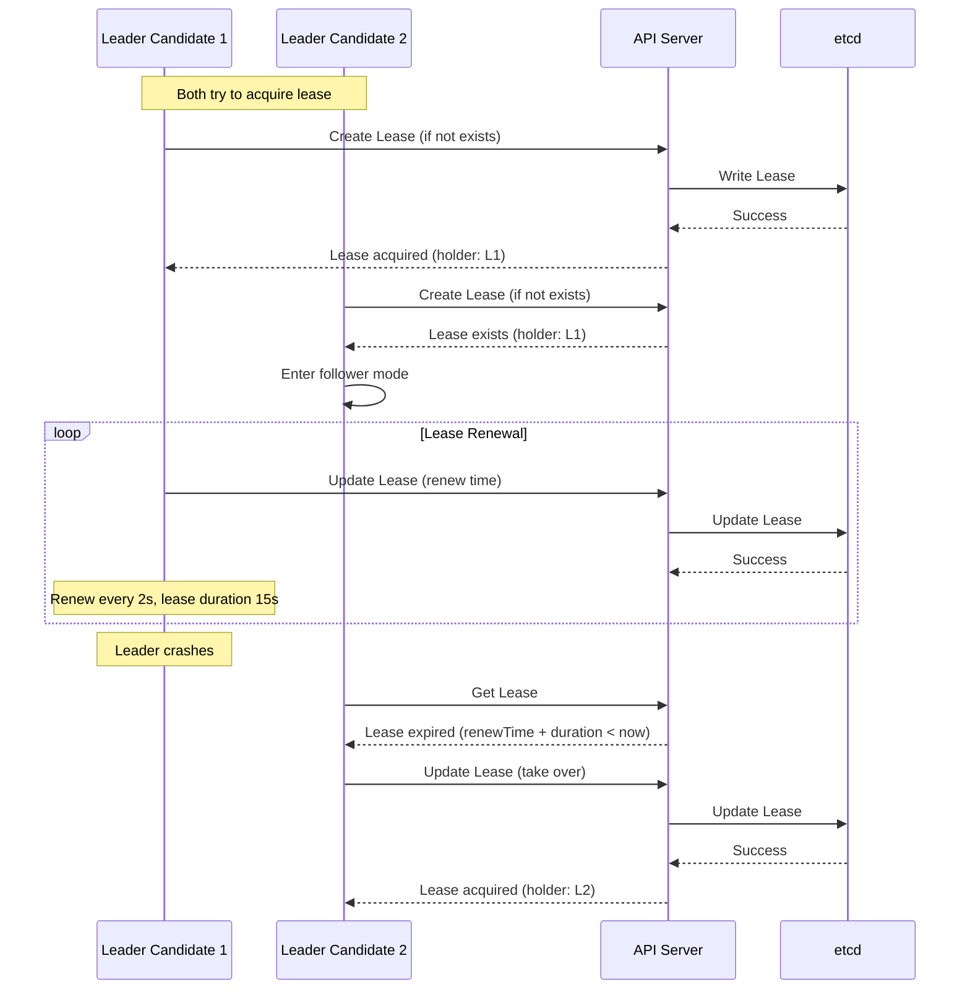
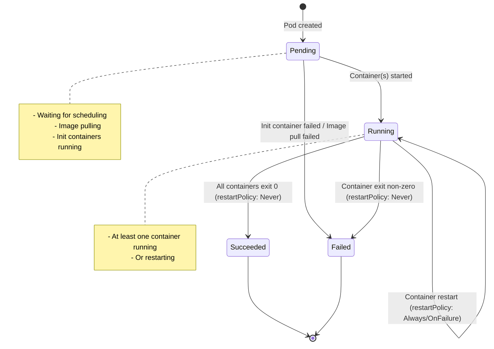
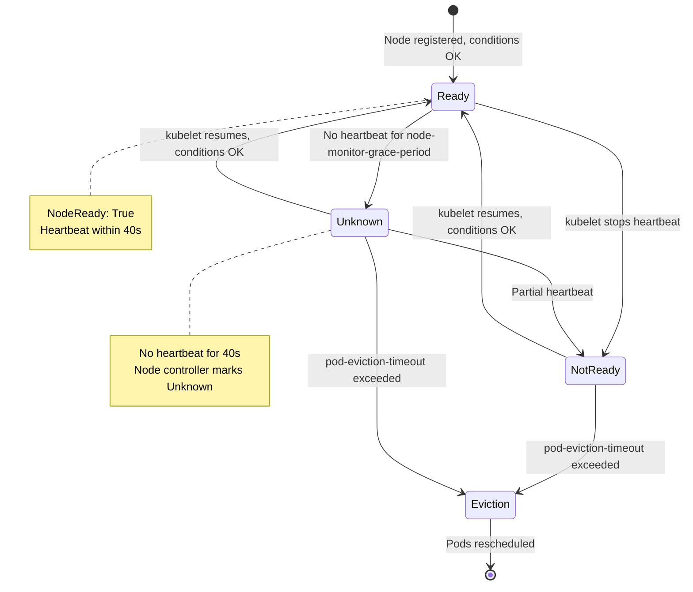

# Low-Level Design

[← Back to Index](./00-index.md)

---

## Data Model

### etcd Key Structure

```
etcd key hierarchy:
/registry/
├── pods/
│   └── {namespace}/
│       └── {pod-name}              → Pod spec + status JSON
├── services/
│   └── {namespace}/
│       └── {service-name}          → Service spec JSON
├── deployments/
│   └── {namespace}/
│       └── {deployment-name}       → Deployment spec JSON
├── replicasets/
│   └── {namespace}/
│       └── {replicaset-name}       → ReplicaSet spec JSON
├── nodes/
│   └── {node-name}                 → Node spec + status JSON
├── namespaces/
│   └── {namespace-name}            → Namespace spec JSON
├── secrets/
│   └── {namespace}/
│       └── {secret-name}           → Encrypted Secret data
├── configmaps/
│   └── {namespace}/
│       └── {configmap-name}        → ConfigMap data
├── events/
│   └── {namespace}/
│       └── {event-name}            → Event JSON (TTL'd)
├── leases/
│   └── kube-system/
│       └── {component-name}        → Leader election lease
└── endpointslices/
    └── {namespace}/
        └── {slice-name}            → EndpointSlice JSON
```

### Core Resource Schemas



### Resource Versioning

| Field | Purpose | Scope |
|-------|---------|-------|
| `metadata.resourceVersion` | Optimistic concurrency, watch bookmark | Per-object, etcd revision |
| `metadata.generation` | Spec change counter (user-initiated) | Per-object |
| `status.observedGeneration` | Controller's last reconciled generation | Per-object |
| `metadata.uid` | Unique identifier for object lifetime | Cluster-wide, immutable |

**Optimistic Concurrency Example:**
```
1. Client reads Pod (resourceVersion: 12345)
2. Client modifies Pod
3. Client sends update with resourceVersion: 12345
4. API Server checks: current etcd version == 12345?
   - Yes → Apply update, increment resourceVersion
   - No → Return HTTP 409 Conflict (object modified by another client)
```

### Indexing Strategy

| Index | Purpose | Implementation |
|-------|---------|----------------|
| Namespace + Name | Primary key lookup | etcd key path |
| Label selector | Find pods for service | In-memory index (API server) |
| Field selector | Filter by specific fields | Limited fields indexed |
| Owner reference | Find children of a parent | Garbage collection, cascading deletes |
| Node name | Find pods on a node | Scheduler, kubelet watches |

### Data Retention

| Data Type | Retention | Mechanism |
|-----------|-----------|-----------|
| Core resources | Until deleted | Explicit deletion or owner cascade |
| Events | 1 hour default | TTL-based expiration |
| Completed Jobs | Configurable (TTL controller) | `.spec.ttlSecondsAfterFinished` |
| Old ReplicaSets | Configurable | `.spec.revisionHistoryLimit` |
| etcd history | Compaction interval | `--auto-compaction-retention` |

---

## API Design

### RESTful Resource API

**Base URL:** `https://{api-server}/apis/{group}/{version}/namespaces/{namespace}/{resource}`

**Examples:**
```
GET    /api/v1/namespaces/default/pods              # List pods in namespace
GET    /api/v1/namespaces/default/pods/my-pod       # Get specific pod
POST   /api/v1/namespaces/default/pods              # Create pod
PUT    /api/v1/namespaces/default/pods/my-pod       # Replace pod
PATCH  /api/v1/namespaces/default/pods/my-pod       # Partial update
DELETE /api/v1/namespaces/default/pods/my-pod       # Delete pod

# Subresources
GET    /api/v1/namespaces/default/pods/my-pod/log   # Get pod logs
POST   /api/v1/namespaces/default/pods/my-pod/exec  # Exec into container
PUT    /api/v1/namespaces/default/pods/my-pod/status # Update status only
```

### Watch API

**Watch for changes:**
```
GET /api/v1/namespaces/default/pods?watch=true&resourceVersion=12345

Response (streaming):
{"type":"ADDED","object":{...pod JSON...}}
{"type":"MODIFIED","object":{...pod JSON...}}
{"type":"DELETED","object":{...pod JSON...}}
{"type":"BOOKMARK","object":{"metadata":{"resourceVersion":"12350"}}}
```

**Watch event types:**
- `ADDED` - New object created
- `MODIFIED` - Object updated
- `DELETED` - Object removed
- `BOOKMARK` - Periodic checkpoint (resourceVersion sync)
- `ERROR` - Watch error, client should re-list

### Admission Control Pipeline



**Admission Phases:**
1. **Mutating admission** - Can modify the request (e.g., inject sidecar, set defaults)
2. **Object schema validation** - Validate against OpenAPI schema
3. **Validating admission** - Can only accept or reject (e.g., policy enforcement)

### API Response Codes

| Code | Meaning | When Used |
|------|---------|-----------|
| 200 | OK | Successful GET, PUT |
| 201 | Created | Successful POST |
| 204 | No Content | Successful DELETE (background) |
| 400 | Bad Request | Invalid request syntax |
| 401 | Unauthorized | Authentication failed |
| 403 | Forbidden | Authorization denied |
| 404 | Not Found | Resource doesn't exist |
| 409 | Conflict | resourceVersion mismatch, already exists |
| 422 | Unprocessable Entity | Validation error |
| 429 | Too Many Requests | Rate limited |
| 500 | Internal Server Error | Server-side error |
| 503 | Service Unavailable | API server overloaded |

---

## Core Algorithms

### 1. Scheduler Filtering and Scoring



**Pseudocode:**

```
FUNCTION schedule_pod(pod):
    // Phase 1: Get all nodes
    all_nodes = get_all_nodes()

    // Phase 2: Filtering - eliminate unsuitable nodes
    feasible_nodes = []
    FOR node IN all_nodes:
        IF passes_all_filters(pod, node):
            feasible_nodes.append(node)

    IF len(feasible_nodes) == 0:
        mark_unschedulable(pod, "No nodes match constraints")
        RETURN

    // Phase 3: Scoring - rank remaining nodes
    node_scores = {}
    FOR node IN feasible_nodes:
        score = 0
        FOR plugin IN score_plugins:
            plugin_score = plugin.score(pod, node)  // 0-100
            weight = plugin.weight
            score += plugin_score * weight
        node_scores[node] = score

    // Phase 4: Normalize and select
    max_score = max(node_scores.values())
    best_nodes = [n for n, s in node_scores if s == max_score]
    selected_node = random_choice(best_nodes)  // Tie-breaker

    // Phase 5: Bind
    bind_pod_to_node(pod, selected_node)
```

**Filter Plugins (Predicates):**

| Plugin | Purpose |
|--------|---------|
| `NodeResourcesFit` | Check CPU, memory, GPU requests fit |
| `NodeAffinity` | Match node selector and affinity rules |
| `TaintToleration` | Pod tolerates node's taints |
| `PodTopologySpread` | Zone/node spreading constraints |
| `InterPodAffinity` | Pod affinity/anti-affinity rules |
| `VolumeBinding` | PV available on node |
| `NodeUnschedulable` | Node not cordoned |

**Score Plugins (Priorities):**

| Plugin | Strategy |
|--------|----------|
| `NodeResourcesBalancedAllocation` | Prefer balanced CPU/memory utilization |
| `ImageLocality` | Prefer nodes with container image cached |
| `InterPodAffinity` | Score based on affinity/anti-affinity |
| `PodTopologySpread` | Score based on zone spreading |
| `NodeResourcesFit` | Bin-packing or spreading preference |

### 2. Controller Reconciliation Loop



**Pseudocode (Deployment Controller):**

```
FUNCTION reconcile_deployment(deployment):
    // Get current state
    deployment = get_deployment(name, namespace)
    IF deployment == nil:
        RETURN  // Deleted, nothing to do

    // Find all ReplicaSets owned by this Deployment
    all_rs = list_replicasets(namespace, owner=deployment.uid)

    // Identify the "new" ReplicaSet (matches current template)
    new_rs = find_or_create_new_replicaset(deployment, all_rs)

    // Scale up new ReplicaSet, scale down old ones (rolling update)
    old_rs_list = [rs for rs in all_rs if rs != new_rs]

    // Calculate how many pods we can surge/be unavailable
    max_surge = calculate_max_surge(deployment)
    max_unavailable = calculate_max_unavailable(deployment)

    // Current pod counts
    current_replicas = sum([rs.status.replicas for rs in all_rs])
    available_replicas = sum([rs.status.availableReplicas for rs in all_rs])

    // Scale up new RS if we have surge budget
    IF new_rs.spec.replicas < deployment.spec.replicas:
        IF current_replicas < deployment.spec.replicas + max_surge:
            scale_up(new_rs, min(max_surge, deployment.spec.replicas - new_rs.spec.replicas))

    // Scale down old RS if new pods are available
    IF new_rs.status.availableReplicas > 0:
        scale_down_old_replicasets(old_rs_list, max_unavailable)

    // Update deployment status
    update_deployment_status(deployment)

FUNCTION scale_down_old_replicasets(old_rs_list, max_unavailable):
    FOR rs IN old_rs_list:
        IF rs.spec.replicas > 0:
            // Scale down proportionally
            scale_down(rs, 1)  // One at a time for safety
```

### 3. Leader Election (Lease-based)



**Pseudocode:**

```
FUNCTION leader_election_loop(identity, lease_name):
    WHILE true:
        lease = get_lease(lease_name)

        IF lease == nil:
            // Try to become leader by creating lease
            lease = create_lease(lease_name, holder=identity, duration=15s)
            IF success:
                start_leading()

        ELSE IF lease.holder == identity:
            // We are leader, renew lease
            IF now - lease.renewTime < lease.duration:
                update_lease(lease_name, renewTime=now)
            ELSE:
                // Our own lease expired (clock issue), re-acquire
                try_acquire_lease()

        ELSE:
            // Someone else is leader
            IF lease.renewTime + lease.duration < now:
                // Lease expired, try to take over
                update_lease(lease_name, holder=identity, renewTime=now)
                IF success:
                    start_leading()
            ELSE:
                // Wait for lease to expire or holder to release
                wait(lease.renewTime + lease.duration - now)

        sleep(retry_period)  // 2 seconds
```

### 4. Service Endpoint Selection (kube-proxy)

**iptables Mode:**
```
FUNCTION setup_service_iptables(service, endpoints):
    // Create chain for this service
    service_chain = "KUBE-SVC-" + hash(service.namespace + "/" + service.name)

    // For each endpoint, create an endpoint chain
    FOR i, endpoint IN enumerate(endpoints):
        ep_chain = "KUBE-SEP-" + hash(endpoint.ip + ":" + endpoint.port)

        // Add DNAT rule to endpoint chain
        add_rule(ep_chain,
            "-p tcp -j DNAT --to-destination {endpoint.ip}:{endpoint.port}")

        // Add jump from service chain with probability
        probability = 1.0 / (len(endpoints) - i)
        add_rule(service_chain,
            "-m statistic --mode random --probability {probability} -j {ep_chain}")

    // Add rule to intercept traffic to ClusterIP
    add_rule("KUBE-SERVICES",
        "-d {service.clusterIP} -p tcp --dport {service.port} -j {service_chain}")
```

**IPVS Mode:**
```
FUNCTION setup_service_ipvs(service, endpoints):
    // Create virtual server for service ClusterIP
    ipvsadm -A -t {service.clusterIP}:{service.port} -s rr  // Round-robin

    // Add real servers (endpoints)
    FOR endpoint IN endpoints:
        ipvsadm -a -t {service.clusterIP}:{service.port}
            -r {endpoint.ip}:{endpoint.port} -m  // Masquerading mode
```

---

## State Machines

### Pod Lifecycle State Machine



### Node Condition State Machine



---

## Concurrency Control

### Optimistic Concurrency with resourceVersion

```
Update conflict handling:

Client A                  API Server              etcd
   |                          |                     |
   |-- GET pod (rv: 100) ---->|                     |
   |<--- pod (rv: 100) -------|                     |
   |                          |                     |
   |-- PUT pod (rv: 100) ---->|-- Compare rv: 100 ->|
   |                          |<-- Current: 100 ----|
   |                          |-- Write (rv: 101) ->|
   |<--- Success (rv: 101) ---|                     |

Client B (concurrent):
   |                          |                     |
   |-- GET pod (rv: 100) ---->|                     |
   |<--- pod (rv: 100) -------|                     |
   |                          |                     |
   |-- PUT pod (rv: 100) ---->|-- Compare rv: 100 ->|
   |                          |<-- Current: 101 ----|
   |<--- 409 Conflict --------|                     |
   |                          |                     |
   |-- Retry: GET, modify, PUT                      |
```

### Work Queue Rate Limiting

```
Controller work queue with rate limiting:

FUNCTION add_with_rate_limit(item, queue):
    // Exponential backoff for failures
    failures = failure_count[item]

    IF failures == 0:
        delay = 0
    ELSE:
        delay = min(base_delay * 2^failures, max_delay)
        // e.g., 5ms, 10ms, 20ms, ..., cap at 1000s

    queue.add_after(item, delay)

FUNCTION process_queue(queue, reconcile_func):
    WHILE true:
        item = queue.get()  // Blocks until item available

        result = reconcile_func(item)

        IF result.error:
            failure_count[item]++
            queue.add_with_rate_limit(item)  // Requeue with backoff
        ELSE:
            failure_count[item] = 0
            queue.done(item)
```
