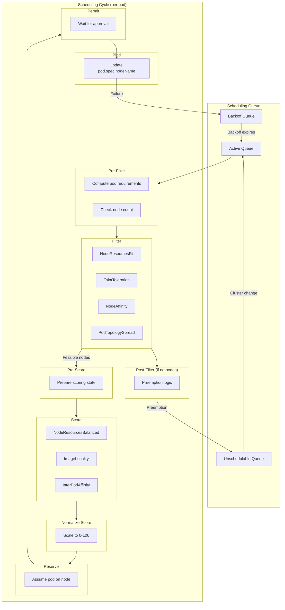
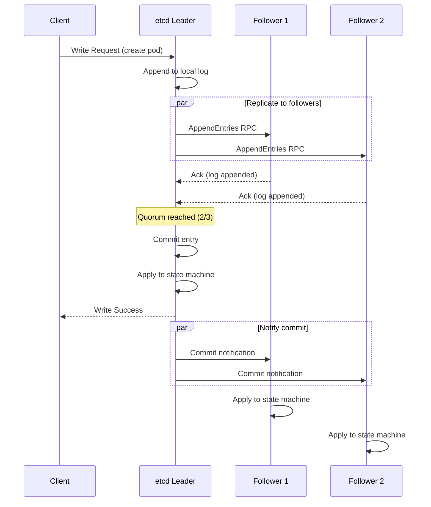
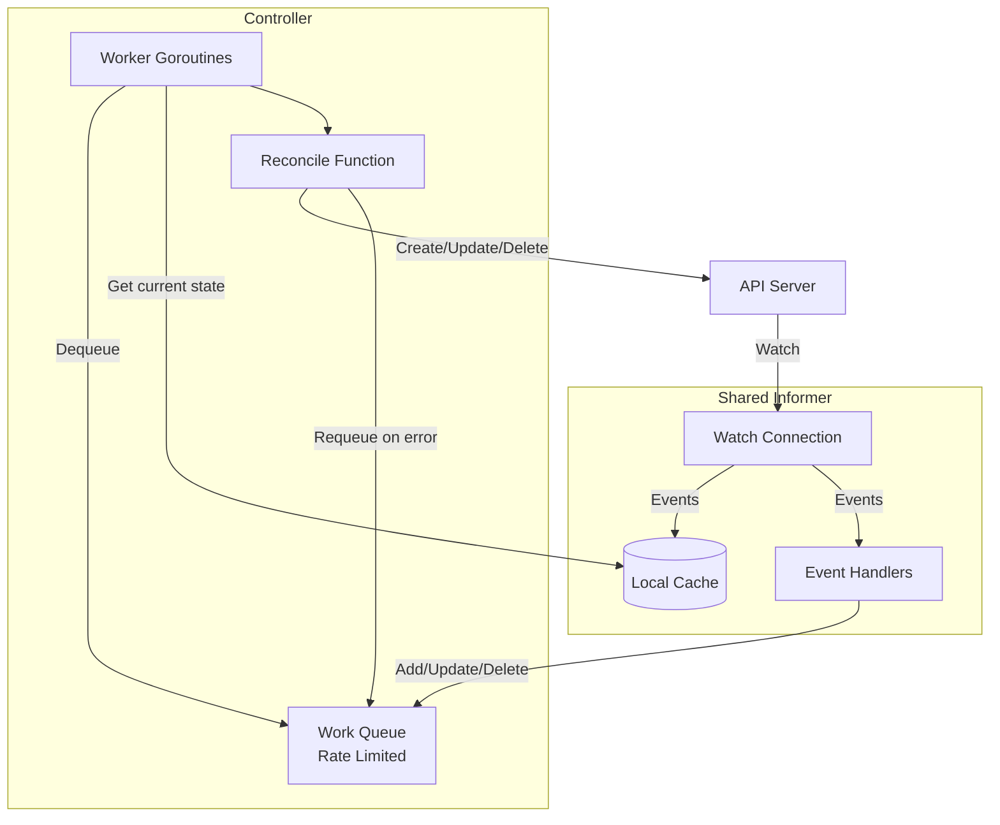
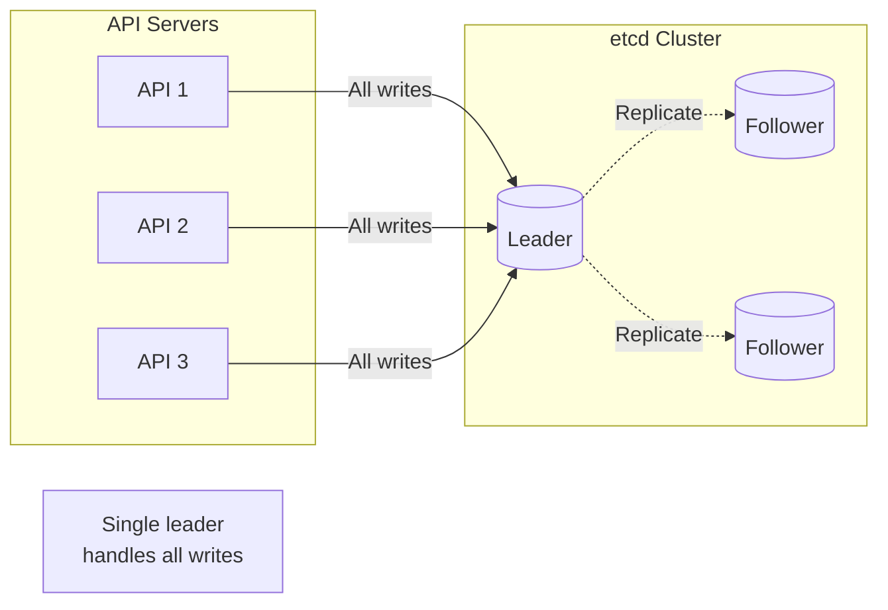
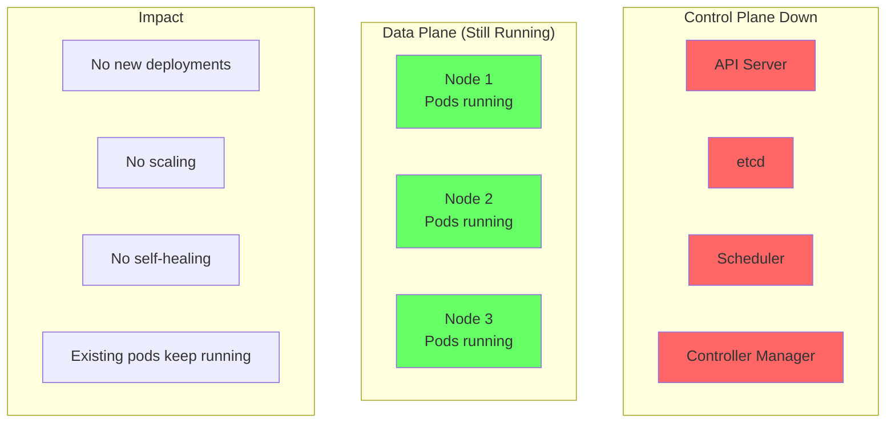

# Deep Dive & Bottleneck Analysis

[← Back to Index](./00-index.md)

---

## Critical Component Deep Dives

### Deep Dive 1: Scheduler

#### Why This Is Critical

The scheduler is the brain of workload placement. Poor scheduling decisions lead to:
- Resource imbalance (some nodes overloaded, others idle)
- Failed deployments (no feasible nodes found)
- Performance degradation (suboptimal placement)
- SLA violations (latency-sensitive pods on distant nodes)

#### How It Works Internally

**Scheduling Framework Architecture:**



**Scheduling Algorithm Detail:**

```
FUNCTION scheduling_cycle(pod):
    // 1. Pre-Filter: Quick checks before iterating nodes
    state = run_pre_filter_plugins(pod)
    IF state.unschedulable:
        RETURN unschedulable(state.reason)

    // 2. Filter: Find feasible nodes
    all_nodes = get_nodes()
    feasible = []

    // Optimization: Sample nodes for very large clusters
    IF len(all_nodes) > percentageOfNodesToScore * totalNodes:
        all_nodes = sample_nodes(all_nodes, percentageOfNodesToScore)

    FOR node IN all_nodes:
        status = run_filter_plugins(pod, node)
        IF status.schedulable:
            feasible.append(node)

        // Early termination if enough nodes found
        IF len(feasible) >= minFeasibleNodesToFind:
            BREAK

    IF len(feasible) == 0:
        // 3. Post-Filter: Try preemption
        nomination = run_preemption(pod)
        IF nomination.success:
            schedule_with_preemption(pod, nomination)
        ELSE:
            add_to_unschedulable_queue(pod)
        RETURN

    // 4. Pre-Score: Prepare for scoring
    run_pre_score_plugins(pod, feasible)

    // 5. Score: Rank feasible nodes
    scores = {}
    FOR node IN feasible:
        total = 0
        FOR plugin IN score_plugins:
            score = plugin.score(pod, node)  // 0-100
            total += score * plugin.weight
        scores[node] = total

    // 6. Normalize: Ensure comparable scores
    run_normalize_score_plugins(scores)

    // 7. Select: Pick highest scoring node
    selected = select_highest_score(scores)

    // 8. Reserve: Optimistically assume pod scheduled
    run_reserve_plugins(pod, selected)

    // 9. Permit: Wait for any gates (e.g., quota check)
    permit_status = run_permit_plugins(pod, selected)
    IF permit_status == WAIT:
        wait_for_permit(pod)

    // 10. Bind: Actually assign pod to node (async)
    go_bind_async(pod, selected)

FUNCTION go_bind_async(pod, node):
    // Pre-Bind: Storage provisioning, etc.
    run_pre_bind_plugins(pod, node)

    // Bind: Update API server
    update_pod_nodename(pod, node)

    // Post-Bind: Cleanup, metrics
    run_post_bind_plugins(pod, node)
```

**Preemption Logic:**

```
FUNCTION run_preemption(preemptor_pod):
    candidates = []

    FOR node IN all_nodes:
        // Find pods that could be preempted
        victims = find_preemptable_pods(node, preemptor_pod)

        IF preemptor_fits_after_preemption(node, preemptor_pod, victims):
            candidates.append({node, victims})

    IF len(candidates) == 0:
        RETURN {success: false}

    // Select node that minimizes disruption
    // Prefer: Fewer victims, lower priority victims, later start time
    best = select_best_preemption_candidate(candidates)

    // Delete victim pods
    FOR victim IN best.victims:
        delete_pod(victim, gracePeriod=30s)

    // Nominate preemptor for this node
    set_pod_nomination(preemptor_pod, best.node)

    RETURN {success: true, node: best.node}
```

#### Performance Optimizations

| Optimization | Description | Impact |
|--------------|-------------|--------|
| **Parallelism** | Score nodes concurrently | 2-5x faster scoring |
| **Node sampling** | Only consider subset of nodes | Reduces filter time for large clusters |
| **Equivalence class** | Group similar pods, cache scheduling decisions | Avoid re-computing for identical pods |
| **Preemption caching** | Cache preemption analysis results | Faster preemption decisions |

#### Failure Modes

| Failure | Impact | Handling |
|---------|--------|----------|
| Scheduler crash | New pods stuck in Pending | Leader election, automatic failover |
| Bind failure | Pod stuck in assumed state | Unreserve, retry scheduling |
| Stale node info | Suboptimal placement | Informer sync, periodic re-list |
| Scheduling storm | High latency | Throughput-based back-pressure |

---

### Deep Dive 2: etcd

#### Why This Is Critical

etcd is the single source of truth for all cluster state. Its properties directly determine:
- Cluster consistency (can't schedule pod to deleted node)
- Watch correctness (controllers see all changes)
- Recovery capability (cluster can be restored from etcd backup)

#### How It Works Internally

**Raft Consensus Flow:**



**etcd Architecture:**

```
etcd Internals:

┌────────────────────────────────────────────────────────────┐
│                      etcd Server                            │
├────────────────────────────────────────────────────────────┤
│                                                             │
│  ┌─────────────┐  ┌─────────────┐  ┌─────────────────────┐ │
│  │  gRPC API   │  │    Raft     │  │      Watch          │ │
│  │   Server    │  │  Consensus  │  │    Subsystem        │ │
│  └──────┬──────┘  └──────┬──────┘  └──────────┬──────────┘ │
│         │                │                     │           │
│  ┌──────▼────────────────▼─────────────────────▼─────────┐ │
│  │                    MVCC Store                          │ │
│  │  ┌─────────────┐  ┌─────────────┐  ┌───────────────┐  │ │
│  │  │  Key Index  │  │  Revision   │  │    Backend    │  │ │
│  │  │   (B-tree)  │  │   History   │  │   (boltdb)    │  │ │
│  │  └─────────────┘  └─────────────┘  └───────────────┘  │ │
│  └───────────────────────────────────────────────────────┘ │
│                                                             │
└────────────────────────────────────────────────────────────┘
```

**Key Concepts:**

| Concept | Description |
|---------|-------------|
| **Revision** | Monotonically increasing global version number |
| **MVCC** | Multi-Version Concurrency Control - keeps history |
| **Compaction** | Remove old revisions to reclaim space |
| **Watch** | Stream changes from a specific revision |
| **Lease** | TTL-based key expiration (used for leader election) |

**Watch Mechanism:**

```
Watch Protocol:

Client                          etcd
   |                              |
   |-- WatchCreate(key, rev=N) -->|
   |                              |
   |<-- WatchCreated(watch_id) ---|
   |                              |
   |        ... time passes ...   |
   |                              |
   |<-- Event(PUT, key, rev=N+1) -|
   |                              |
   |<-- Event(PUT, key, rev=N+2) -|
   |                              |
   |<-- Event(DELETE, key, rev=N+3)
   |                              |
   |-- WatchCancel(watch_id) ---->|
```

**Watch Guarantees:**
- **Ordered:** Events delivered in revision order
- **Reliable:** No missed events (if connection maintained)
- **Resumable:** Client can resume from last seen revision
- **Compact-safe:** Error if requested revision was compacted

#### Performance Characteristics

| Metric | Typical Value | Notes |
|--------|---------------|-------|
| Read latency (quorum) | 1-5 ms | Depends on network |
| Read latency (serializable) | < 1 ms | Local read, may be stale |
| Write latency | 5-20 ms | Must sync to disk |
| Throughput | 10K-50K ops/sec | Depends on hardware |
| Max recommended DB size | 8 GB | Configurable, larger = slower |

#### Failure Modes

| Failure | Impact | Handling |
|---------|--------|----------|
| Leader failure | Brief unavailability (election) | New leader elected in ~1s |
| Minority partition | Partitioned nodes can't write | Quorum nodes continue |
| Majority partition | **Cluster unavailable** | Manual intervention required |
| Disk full | Write failures | Monitoring, alerting, compaction |
| Slow disk (fsync) | High latency, timeout | Use SSD, monitor disk_backend_commit_duration |

---

### Deep Dive 3: Controller Manager

#### Why This Is Critical

Controllers implement the reconciliation model that makes Kubernetes self-healing. Without them:
- Deployments don't create ReplicaSets
- ReplicaSets don't create Pods
- Nodes going offline don't trigger rescheduling
- Garbage collection doesn't work

#### How It Works Internally

**Controller Pattern:**



**Reconciliation Loop Detail:**

```
FUNCTION controller_main():
    // Setup shared informers (one per resource type)
    informer_factory = create_informer_factory(client, resync_period=12h)

    // Get specific informers
    deployment_informer = informer_factory.apps().v1().deployments()
    replicaset_informer = informer_factory.apps().v1().replicasets()
    pod_informer = informer_factory.core().v1().pods()

    // Create work queue with rate limiting
    queue = create_rate_limited_queue(
        base_delay=5ms,
        max_delay=1000s,
        overall_rate=10qps,
        burst=100
    )

    // Register event handlers
    deployment_informer.add_event_handler({
        add: func(obj) { queue.add(key_for(obj)) },
        update: func(old, new) { queue.add(key_for(new)) },
        delete: func(obj) { queue.add(key_for(obj)) }
    })

    // Also watch related objects
    replicaset_informer.add_event_handler({
        add: func(obj) {
            owner = get_controller_of(obj)
            IF owner != nil AND owner.kind == "Deployment":
                queue.add(key_for(owner))
        }
        // Similar for update/delete
    })

    // Start informers
    informer_factory.start()
    informer_factory.wait_for_cache_sync()

    // Start workers
    FOR i = 0; i < worker_count; i++:
        go worker_loop(queue, reconcile_deployment)

FUNCTION worker_loop(queue, reconcile_func):
    WHILE true:
        key = queue.get()  // Blocks

        TRY:
            result = reconcile_func(key)
            IF result.requeue_after > 0:
                queue.add_after(key, result.requeue_after)
            ELSE IF result.requeue:
                queue.add_rate_limited(key)
            ELSE:
                queue.forget(key)  // Reset rate limit
        CATCH error:
            log.error("Reconcile failed", key, error)
            queue.add_rate_limited(key)  // Exponential backoff
        FINALLY:
            queue.done(key)
```

**Key Controllers in Controller Manager:**

| Controller | Watches | Reconciles |
|------------|---------|------------|
| Deployment | Deployments, ReplicaSets | Create/update ReplicaSets for rolling updates |
| ReplicaSet | ReplicaSets, Pods | Create/delete Pods to match desired replicas |
| Node | Nodes | Evict pods from unhealthy nodes |
| Endpoints | Pods, Services | Create EndpointSlices for service routing |
| Namespace | Namespaces | Delete all resources when namespace deleted |
| ServiceAccount | ServiceAccounts, Secrets | Create default SA, tokens |
| GarbageCollector | All objects | Delete orphaned objects |

#### Failure Modes

| Failure | Impact | Handling |
|---------|--------|----------|
| Controller Manager crash | No reconciliation | Leader election, standby takes over |
| API server unreachable | Controller stalled | Retry with backoff, informer reconnect |
| Informer cache stale | Wrong decisions | Resync period (12h default), re-list |
| Work queue overflow | Delayed reconciliation | Rate limiting, back-pressure |

---

## Bottleneck Analysis

### Bottleneck 1: etcd Write Throughput

**Problem:** All mutations go through etcd, which is limited by disk fsync latency.



**Symptoms:**
- High `etcd_disk_backend_commit_duration_seconds`
- API server request latency increases
- etcd leader changes frequently (under load)

**Mitigation:**

| Strategy | Description | Trade-off |
|----------|-------------|-----------|
| **Fast disks (NVMe SSD)** | Reduce fsync latency | Hardware cost |
| **Dedicated etcd nodes** | Isolate from other workloads | Infrastructure complexity |
| **Separate etcd cluster** | Different cluster for events | Operational complexity |
| **Reduce watch scope** | API server watch caching | Memory on API server |

### Bottleneck 2: API Server Request Handling

**Problem:** API server becomes bottleneck under high QPS or many watches.

**Symptoms:**
- High API server CPU/memory usage
- Slow watch delivery (events delayed)
- Connection timeouts

**Mitigation:**

| Strategy | Description | Trade-off |
|----------|-------------|-----------|
| **Multiple API servers** | Load balance across replicas | Complexity, LB config |
| **Watch cache** | Cache watch responses | Memory on API server |
| **API Priority & Fairness** | Prevent priority inversion | Config complexity |
| **Request rate limiting** | Protect from overload | May block legitimate requests |

### Bottleneck 3: Scheduler Throughput

**Problem:** Single active scheduler processes pods sequentially.

**Symptoms:**
- Pods stuck in Pending
- High scheduler latency (`scheduling_attempt_duration_seconds`)
- Scheduling queue backlog

**Mitigation:**

| Strategy | Description | Trade-off |
|----------|-------------|-----------|
| **Parallelism** | Score nodes in parallel | Limited by single scheduling thread |
| **Node sampling** | Only consider subset of nodes | Suboptimal placement |
| **Multiple schedulers** | Different schedulers for different workloads | Conflict potential |
| **Cluster sharding** | Smaller clusters with less contention | Operational complexity |

---

## Concurrency & Race Conditions

### Potential Race Conditions

| Race Condition | Trigger | Impact | Solution |
|----------------|---------|--------|----------|
| **Double-scheduling** | Two schedulers race to bind same pod | Pod scheduled twice | Single active scheduler (leader election) |
| **Stale read** | Controller reads cached data | Wrong reconciliation | resourceVersion in watch, optimistic concurrency |
| **Concurrent updates** | Multiple controllers update same object | Lost updates | resourceVersion conflict, retry |
| **Orphaned resources** | Owner deleted before child created | Resource leak | Owner UID in child, garbage collector |
| **Endpoint race** | Pod ready before endpoint updated | Traffic to unready pod | Readiness gates, endpoint propagation delay |

### Controller Conflict Resolution

**Scenario:** Deployment controller and HPA both want to change replica count.

```
Resolution: Use subresources and owner references

1. Deployment controller manages spec.replicas
   - Reads Deployment spec
   - Creates/updates ReplicaSet

2. HPA manages scale subresource
   - Reads Deployment via /scale subresource
   - Updates /scale (which updates spec.replicas)

3. Deployment controller sees spec change
   - Reconciles: updates ReplicaSet.spec.replicas

Conflict avoided by:
- Single owner of spec.replicas (HPA when enabled)
- Subresource isolation
- Controller watching its owned resources
```

### Leader Election Safety

```
Leader election properties:

1. At-most-one leader: Only one holder of lease at a time
2. Leader must renew: If leader doesn't renew, lease expires
3. Graceful handoff: Retiring leader can release lease

Failure scenarios:
- Leader crashes: Lease expires after leaseDuration (15s)
- Network partition: Leader can't renew, standby acquires
- Clock skew: Lease timing may be off, use server-side time

Configuration:
  leaseDuration: 15s  # How long lease is valid
  renewDeadline: 10s  # How long to retry renewing
  retryPeriod: 2s     # How often to retry acquiring
```

---

## Failure Scenario Analysis

### Scenario: Control Plane Outage



**Impact:**
- New pods cannot be scheduled
- Scaling operations fail
- Self-healing disabled (crashed containers won't reschedule)
- **Existing workloads continue running** (static stability)

**Recovery:**
1. Restore etcd from backup (if data loss)
2. Restart control plane components
3. Controllers reconcile and recover state

### Scenario: etcd Quorum Loss

```
3-node etcd cluster:

Node 1: Leader (up)
Node 2: Follower (down)
Node 3: Follower (down)

Quorum = ⌊3/2⌋ + 1 = 2 nodes needed

Result: Cluster CANNOT process writes
        Reads may still work (stale)
```

**Recovery:**
1. If nodes are recoverable: restart them
2. If data is lost: restore from backup
3. Worst case: rebuild cluster from scratch

### Scenario: Cascading Pod Eviction

```
Trigger: Node goes NotReady

Timeline:
0s: kubelet stops heartbeat
40s: Node marked Unknown (node-monitor-grace-period)
5m: Pods evicted (pod-eviction-timeout)
5m: Scheduler reschedules pods

Risk: All pods on node reschedule simultaneously
      May overload other nodes or scheduler
```

**Mitigation:**
- Pod Disruption Budgets (PDB) limit concurrent evictions
- Priority classes ensure critical pods scheduled first
- Cluster autoscaler can add nodes
