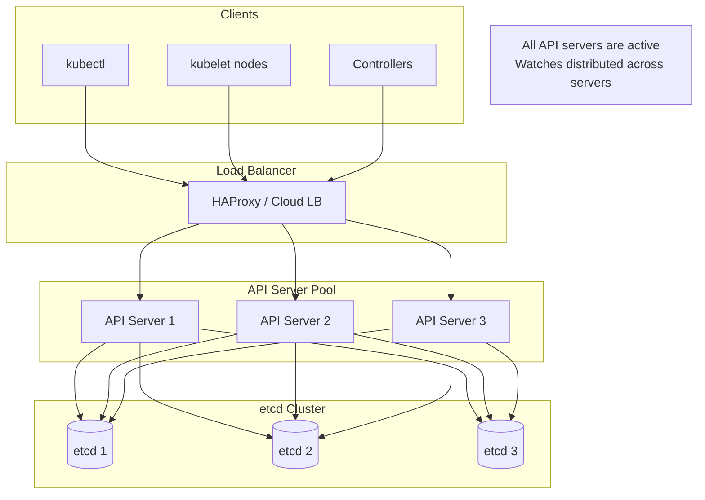
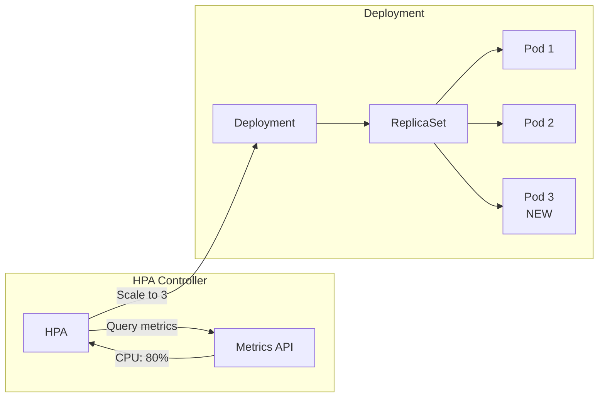
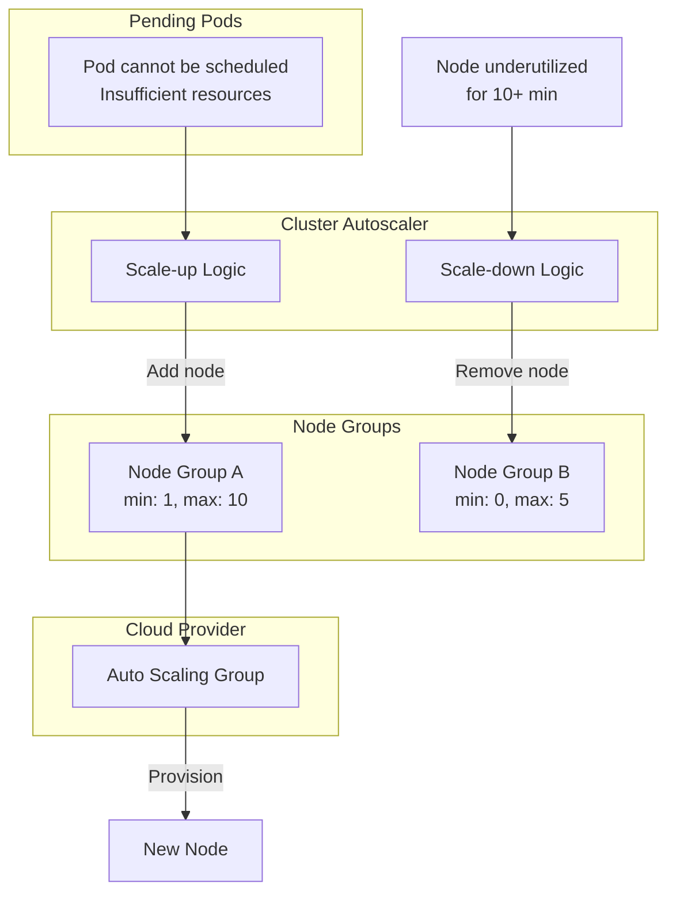
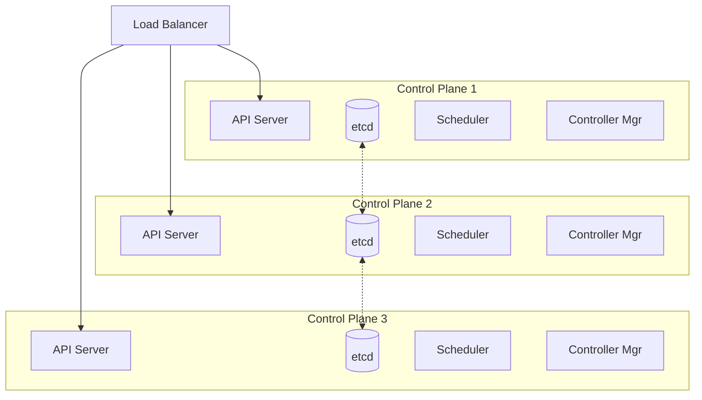
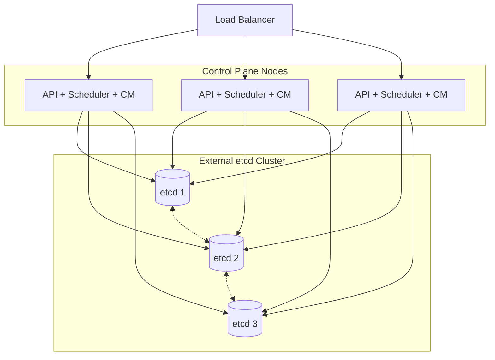
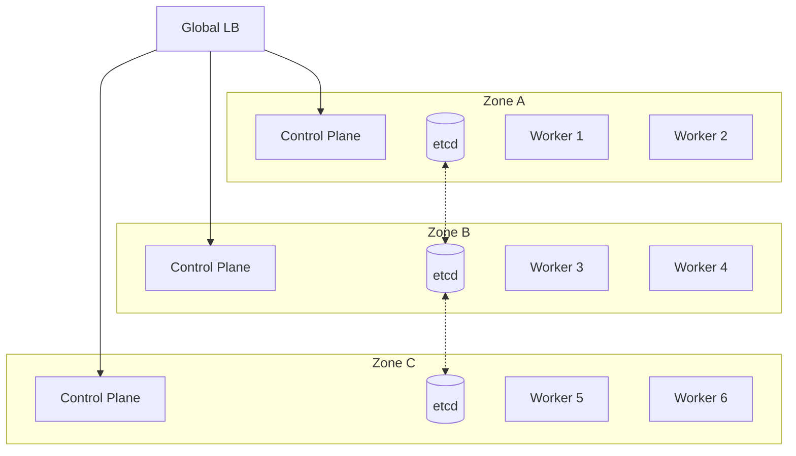
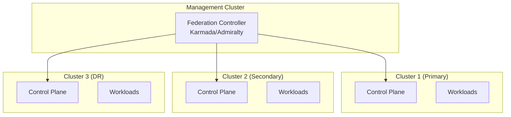

# Scalability & Reliability

[← Back to Index](./00-index.md)

---

## Scaling Strategies

### Horizontal Scaling

#### Control Plane Components

| Component | Scaling Model | Max Replicas | Notes |
|-----------|---------------|--------------|-------|
| **API Server** | Active-active | 3-7+ | Load balanced, stateless |
| **etcd** | Raft consensus | 3, 5, or 7 | Odd numbers only, quorum-based |
| **Scheduler** | Active-passive | 3 (1 active) | Leader election |
| **Controller Manager** | Active-passive | 3 (1 active) | Leader election |
| **Cloud Controller Manager** | Active-passive | 3 (1 active) | Leader election |

**API Server Scaling:**



#### Data Plane Scaling

| Component | Scaling Approach |
|-----------|------------------|
| **Nodes** | Add more worker nodes (up to ~5,000 tested) |
| **kubelet** | One per node, scales with nodes |
| **kube-proxy** | DaemonSet, one per node |
| **Pods** | Horizontal Pod Autoscaler (HPA) |

### Vertical Scaling

| Component | CPU Increase Impact | Memory Increase Impact |
|-----------|---------------------|------------------------|
| **API Server** | More request handling, faster serialization | Larger watch cache, more concurrent connections |
| **etcd** | Faster consensus, compaction | More data in memory, faster reads |
| **Scheduler** | Faster scoring algorithm | Cache more node/pod state |
| **Controller Manager** | Faster reconciliation | More objects in informer cache |

**Recommended Sizing by Cluster Size:**

| Cluster Size | API Server | etcd | Scheduler/CM |
|--------------|------------|------|--------------|
| < 100 nodes | 2 CPU, 4 GB | 2 CPU, 4 GB | 1 CPU, 2 GB |
| 100-500 nodes | 4 CPU, 16 GB | 4 CPU, 16 GB | 2 CPU, 8 GB |
| 500-1,000 nodes | 8 CPU, 32 GB | 8 CPU, 32 GB | 4 CPU, 16 GB |
| 1,000-5,000 nodes | 16 CPU, 64 GB | 16 CPU, 64 GB | 8 CPU, 32 GB |

### Autoscaling

#### Horizontal Pod Autoscaler (HPA)



**HPA Algorithm:**

```
desiredReplicas = ceil[currentReplicas × (currentMetricValue / desiredMetricValue)]

Example:
- Current: 2 replicas, 80% CPU utilization
- Target: 50% CPU utilization
- Desired: ceil(2 × (80/50)) = ceil(3.2) = 4 replicas

Stabilization:
- Scale-up: 15s delay (default)
- Scale-down: 5 min delay (default)
- Prevents thrashing
```

#### Vertical Pod Autoscaler (VPA)

```
VPA Modes:

1. Off: Only recommendations, no action
2. Auto: Automatically apply recommendations (pod restart)
3. Recreate: Evict and recreate pods with new resources
4. Initial: Only set resources on pod creation

VPA vs HPA:
- HPA: Change replica count
- VPA: Change resource requests/limits
- Generally don't use both for same metric
```

#### Cluster Autoscaler



**Scale-up triggers:**
- Pod stuck in Pending
- Node selector/affinity can't be satisfied
- Insufficient resources

**Scale-down conditions:**
- Node utilization < 50% for 10 minutes
- All pods can be moved elsewhere
- No PDBs preventing eviction
- No local storage preventing eviction

#### Karpenter (Next-generation Autoscaler)

```
Karpenter vs Cluster Autoscaler:

Cluster Autoscaler:
- Works with predefined node groups
- Nodes are uniform within a group
- Slower to provision (ASG scaling)

Karpenter:
- Provisions optimal nodes per-pod
- Mixed instance types, sizes
- Faster provisioning (direct EC2 API)
- Better bin-packing
- Supports spot instances natively
```

---

## High Availability

### HA Topology Options

#### Option 1: Stacked etcd



**Pros:** Simpler setup, fewer machines
**Cons:** etcd failure affects co-located API server

#### Option 2: External etcd



**Pros:** Independent scaling, better isolation
**Cons:** More infrastructure, network latency

### Multi-Zone Distribution



**Zone Failure Tolerance:**
- 3-zone deployment tolerates 1 zone failure
- etcd quorum: 2/3 nodes still available
- Workloads spread across remaining zones

### Static Stability

**Definition:** Data plane continues operating during control plane outage.

```
Static Stability Properties:

1. kubelet caches pod specs locally
   - Continues running pods without API server
   - Restarts crashed containers using cached spec

2. kube-proxy rules persist in iptables/IPVS
   - Service routing continues working
   - No new endpoint updates until control plane recovers

3. Container runtime operates independently
   - Running containers unaffected
   - Image pulls may fail (registry auth)

4. DNS cache on pods
   - CoreDNS may fail, but pod DNS cached
   - Depends on TTL configuration
```

**Recovery after control plane returns:**
1. kubelets reconnect and sync state
2. Controllers reconcile any drift
3. Pending operations resume
4. Watch connections re-establish

---

## Fault Tolerance

### Component Failure Handling

| Component | Failure Detection | Recovery Mechanism |
|-----------|-------------------|-------------------|
| API Server | Load balancer health check | Route to healthy replicas |
| etcd node | Raft heartbeat timeout | Leader election, continue with quorum |
| Scheduler | Lease expiration (15s) | Standby acquires leader lease |
| Controller Manager | Lease expiration (15s) | Standby acquires leader lease |
| kubelet | Node heartbeat (40s) | Node marked NotReady, pods evicted |
| Pod | Liveness probe | Container restart, rescheduling |

### Pod Disruption Budgets (PDB)

```
PDB ensures minimum availability during voluntary disruptions:

Example PDB:
apiVersion: policy/v1
kind: PodDisruptionBudget
metadata:
  name: my-app-pdb
spec:
  minAvailable: 2    # OR maxUnavailable: 1
  selector:
    matchLabels:
      app: my-app

Effect:
- Node drain waits if eviction would violate PDB
- Cluster autoscaler respects PDB
- Rolling updates respect PDB
```

### Node Failure Handling

```
Timeline for node failure:

0s     - kubelet stops heartbeating
40s    - Node condition: Ready → Unknown
         (node-monitor-grace-period)
5m     - Pods evicted (pod-eviction-timeout)
         Taint: node.kubernetes.io/unreachable:NoExecute

TaintBasedEvictions (default enabled):
- Pods without toleration evicted immediately
- Pods with tolerationSeconds evicted after delay

Example toleration:
tolerations:
- key: "node.kubernetes.io/unreachable"
  operator: "Exists"
  effect: "NoExecute"
  tolerationSeconds: 300  # Stay for 5 more minutes
```

---

## Disaster Recovery

### etcd Backup and Restore

**Backup Strategy:**

```
Backup Types:

1. Snapshot backup (recommended):
   etcdctl snapshot save /backup/snapshot.db

2. Volume snapshot:
   Cloud provider snapshot of etcd data volume

Backup frequency:
- Critical: Every 5-15 minutes
- Standard: Hourly
- Dev/test: Daily

Backup retention:
- Last 24 hours: Hourly
- Last 7 days: Daily
- Last 30 days: Weekly
```

**Restore Process:**

```
1. Stop all control plane components

2. Restore etcd on all nodes:
   etcdctl snapshot restore /backup/snapshot.db \
     --data-dir=/var/lib/etcd-restored \
     --name=etcd-node-1 \
     --initial-cluster="etcd-node-1=https://...,etcd-node-2=https://..." \
     --initial-cluster-token=etcd-cluster-restored \
     --initial-advertise-peer-urls=https://...

3. Update etcd configuration to use restored data-dir

4. Start etcd cluster

5. Verify etcd health:
   etcdctl endpoint health

6. Start API servers, schedulers, controller managers

7. Verify cluster state:
   kubectl get nodes
   kubectl get pods --all-namespaces
```

### Multi-Cluster Federation



**Federation Patterns:**
- **Replicated:** Same workloads in all clusters
- **Partitioned:** Different workloads per cluster
- **Hybrid:** Critical workloads replicated, others partitioned

### RPO/RTO Targets

| Scenario | RPO (Data Loss) | RTO (Downtime) |
|----------|-----------------|----------------|
| Single node failure | 0 | < 1 minute |
| Single zone failure | 0 | < 5 minutes |
| etcd quorum loss | Last backup | 15-30 minutes |
| Control plane corruption | Last backup | 30-60 minutes |
| Region failure (multi-region) | 0 | < 5 minutes |
| Region failure (single-region) | Last backup | Hours (manual failover) |

---

## Scaling Limits and Thresholds

### Kubernetes Tested Limits

| Resource | Tested Limit | Soft Limit (Practical) |
|----------|--------------|------------------------|
| Nodes per cluster | 5,000 | 3,000 |
| Pods per cluster | 150,000 | 100,000 |
| Pods per node | 110 | 100 |
| Services per cluster | 10,000 | 5,000 |
| Endpoints per service | 250 (before EndpointSlices) | Use EndpointSlices |
| Namespaces | 10,000 | 5,000 |
| ConfigMaps per namespace | 10,000 | - |
| Secrets per namespace | 10,000 | - |

### When to Consider Cluster Sharding

**Symptoms requiring sharding:**
- API server latency > 1s p99
- etcd database > 8 GB
- Scheduler throughput < 50 pods/second
- Watch connection issues

**Sharding Approaches:**

| Approach | Description | Use Case |
|----------|-------------|----------|
| **Namespace-based** | Different namespaces in different clusters | Multi-tenant isolation |
| **Workload-based** | Different app tiers in different clusters | Performance isolation |
| **Geographic** | Regional clusters | Latency, compliance |
| **Cell architecture** | Borg-style cells | Hyperscale (100K+ nodes) |

### Beyond 5,000 Nodes

```
Strategies for hyperscale:

1. GKE Approach:
   - Spanner-based control plane storage
   - Custom scheduler with better parallelism
   - Aggressive watch caching

2. Cell Architecture (Borg-inspired):
   - Multiple independent clusters (cells)
   - Global scheduling layer above cells
   - Each cell: 1,000-5,000 nodes

3. Scheduler Optimization:
   - Multi-scheduler with affinity
   - Gang scheduling for batch
   - Bin-packing algorithms

4. etcd Alternatives:
   - K3s with SQLite/PostgreSQL
   - Custom storage backends
```
