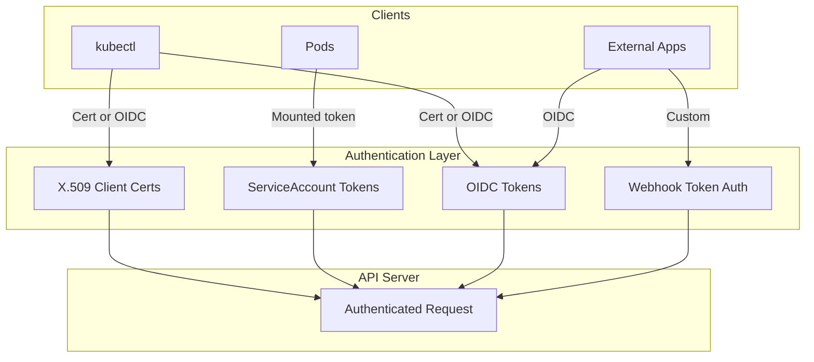
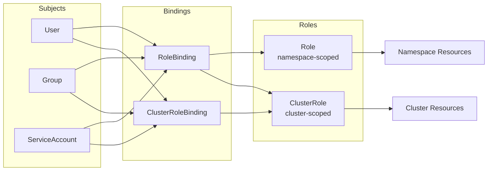
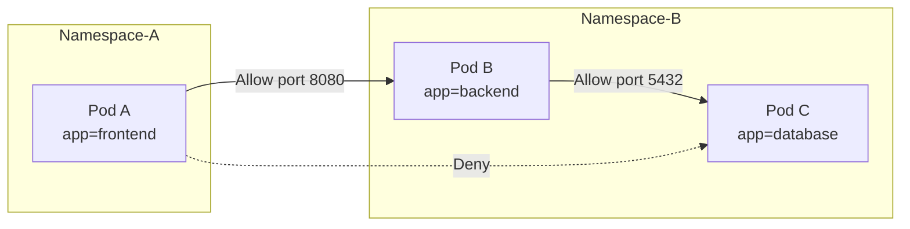
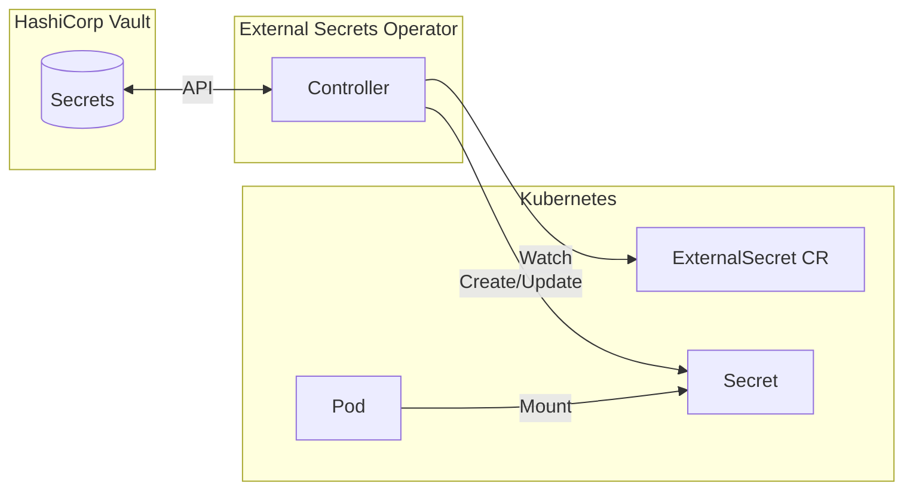
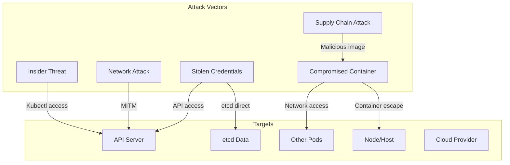

# Security & Compliance

[← Back to Index](./00-index.md)

---

## Authentication (AuthN)

### Authentication Methods



### Authentication Method Comparison

| Method | Use Case | Rotation | Notes |
|--------|----------|----------|-------|
| **X.509 Certificates** | Cluster components, administrators | Manual or automated (cert-manager) | Built-in, requires PKI management |
| **ServiceAccount Tokens** | Pod-to-API communication | Auto-rotated (BoundServiceAccountToken) | Auto-mounted to pods |
| **OIDC Tokens** | Human users via IdP | IdP-managed | Integrates with Okta, Azure AD, Google |
| **Webhook Token Auth** | Custom auth systems | Varies | External authentication service |

### ServiceAccount Token Security

```
Legacy ServiceAccount Tokens:
- Non-expiring
- Stored as Secrets
- Automatically mounted to all pods

BoundServiceAccountTokens (default since 1.22):
- Time-bound (1 hour default, auto-refresh)
- Audience-bound (specific API server)
- Not stored as Secrets
- Projected volumes

Example projected token volume:
volumes:
- name: kube-api-access
  projected:
    sources:
    - serviceAccountToken:
        expirationSeconds: 3607
        path: token
    - configMap:
        name: kube-root-ca.crt
        items:
        - key: ca.crt
          path: ca.crt
```

---

## Authorization (AuthZ)

### RBAC (Role-Based Access Control)



### RBAC Example

```
# Role: Allow read pods in 'production' namespace
apiVersion: rbac.authorization.k8s.io/v1
kind: Role
metadata:
  namespace: production
  name: pod-reader
rules:
- apiGroups: [""]
  resources: ["pods"]
  verbs: ["get", "list", "watch"]
- apiGroups: [""]
  resources: ["pods/log"]
  verbs: ["get"]

---
# RoleBinding: Bind to user 'jane'
apiVersion: rbac.authorization.k8s.io/v1
kind: RoleBinding
metadata:
  name: read-pods
  namespace: production
subjects:
- kind: User
  name: jane
  apiGroup: rbac.authorization.k8s.io
roleRef:
  kind: Role
  name: pod-reader
  apiGroup: rbac.authorization.k8s.io
```

### Common ClusterRoles

| ClusterRole | Permissions | Use Case |
|-------------|-------------|----------|
| `cluster-admin` | Full access to all resources | Super-admin, break-glass |
| `admin` | Full namespace access, no quota/resource limits | Namespace admin |
| `edit` | Read/write most resources | Developers |
| `view` | Read-only access | Auditors, viewers |

### Node Authorization

```
Node authorizer restricts kubelets to:
- Read: Secrets, ConfigMaps, PVs/PVCs for pods on their node
- Write: Node status, pod status, events
- Cannot: Access other nodes' secrets, create pods

Requires:
- NodeRestriction admission plugin
- Kubelets in system:nodes group
```

---

## Pod Security

### Pod Security Admission (PSA)

```
Pod Security Standards (replacing PodSecurityPolicy):

1. Privileged: No restrictions
   - Cluster operations, privileged workloads

2. Baseline: Prevent known privilege escalations
   - No privileged containers
   - No hostNetwork, hostPID, hostIPC
   - No hostPath volumes (except specific paths)
   - Restricted capabilities

3. Restricted: Heavily restricted, hardened
   - Must run as non-root
   - Must drop ALL capabilities
   - Seccomp profile required
   - No privilege escalation

Enforcement modes:
- enforce: Reject violating pods
- audit: Log violations
- warn: Warn users
```

### Pod Security Context

```
securityContext:
  runAsNonRoot: true
  runAsUser: 1000
  runAsGroup: 3000
  fsGroup: 2000
  seccompProfile:
    type: RuntimeDefault
  capabilities:
    drop:
      - ALL
    add:
      - NET_BIND_SERVICE
  readOnlyRootFilesystem: true
  allowPrivilegeEscalation: false
```

### Container Isolation

| Mechanism | Protection | Notes |
|-----------|------------|-------|
| **Namespaces** | Process, network, mount isolation | Linux kernel feature |
| **Cgroups** | Resource limits | CPU, memory, I/O |
| **Seccomp** | System call filtering | Block dangerous syscalls |
| **AppArmor** | Mandatory access control | File, network, capability restrictions |
| **SELinux** | Mandatory access control | Label-based access control |

---

## Network Security

### Network Policies



### Default Deny Network Policy

```
# Deny all ingress in namespace
apiVersion: networking.k8s.io/v1
kind: NetworkPolicy
metadata:
  name: default-deny-ingress
  namespace: production
spec:
  podSelector: {}  # All pods in namespace
  policyTypes:
  - Ingress

---
# Deny all egress in namespace
apiVersion: networking.k8s.io/v1
kind: NetworkPolicy
metadata:
  name: default-deny-egress
  namespace: production
spec:
  podSelector: {}
  policyTypes:
  - Egress
```

### Allow Specific Traffic

```
# Allow frontend to backend on port 8080
apiVersion: networking.k8s.io/v1
kind: NetworkPolicy
metadata:
  name: allow-frontend-to-backend
  namespace: production
spec:
  podSelector:
    matchLabels:
      app: backend
  policyTypes:
  - Ingress
  ingress:
  - from:
    - podSelector:
        matchLabels:
          app: frontend
    ports:
    - protocol: TCP
      port: 8080
```

### Service Mesh mTLS

```
mTLS with service mesh (Istio/Linkerd):

┌──────────────┐     mTLS      ┌──────────────┐
│   Pod A      │───────────────│   Pod B      │
│ ┌──────────┐ │               │ ┌──────────┐ │
│ │   App    │ │               │ │   App    │ │
│ └────┬─────┘ │               │ └────┬─────┘ │
│      │       │               │      │       │
│ ┌────▼─────┐ │               │ ┌────▼─────┐ │
│ │ Sidecar  │ │   Encrypted   │ │ Sidecar  │ │
│ │ (Envoy)  │◄──────────────►│ │ (Envoy)  │ │
│ └──────────┘ │               │ └──────────┘ │
└──────────────┘               └──────────────┘

Benefits:
- Encryption in transit
- Mutual authentication
- Identity-based access control
- Automatic certificate rotation
```

---

## Secret Management

### Kubernetes Secrets

```
Secret Types:
- Opaque: Generic key-value pairs
- kubernetes.io/service-account-token: ServiceAccount tokens
- kubernetes.io/dockerconfigjson: Registry credentials
- kubernetes.io/tls: TLS certificates

Storage:
- Stored in etcd (encrypted at rest with --encryption-provider-config)
- Base64 encoded (NOT encrypted by default!)
```

### Secrets Encryption at Rest

```
# EncryptionConfiguration
apiVersion: apiserver.config.k8s.io/v1
kind: EncryptionConfiguration
resources:
  - resources:
      - secrets
    providers:
      - aescbc:
          keys:
            - name: key1
              secret: <base64-encoded-key>
      - identity: {}  # Fallback for reading unencrypted

Encryption providers:
- aescbc: AES-CBC with PKCS#7 padding
- aesgcm: AES-GCM (faster, authenticated)
- secretbox: XSalsa20+Poly1305
- kms: External KMS (AWS KMS, Azure Key Vault, etc.)
```

### External Secret Management



**External Secrets Operator:**
- Syncs secrets from external providers
- Supports Vault, AWS Secrets Manager, GCP Secret Manager, Azure Key Vault
- Automatic rotation based on provider

---

## Threat Model

### STRIDE Analysis

| Threat | Example | Mitigation |
|--------|---------|------------|
| **Spoofing** | Stolen ServiceAccount token | Short-lived tokens, audience binding |
| **Tampering** | Modified API request | TLS, request signing, audit logging |
| **Repudiation** | Deny malicious action | Comprehensive audit logging |
| **Information Disclosure** | etcd data exposure | Encryption at rest, network policies |
| **Denial of Service** | API server DDoS | Rate limiting, resource quotas |
| **Elevation of Privilege** | Container escape | Pod security, seccomp, sandboxing |

### Attack Vectors



### Critical Threats and Mitigations

| Threat | Risk | Mitigation |
|--------|------|------------|
| **Container escape** | High | Sandboxing (gVisor, Kata), seccomp, drop capabilities |
| **etcd compromise** | Critical | Encryption at rest, network isolation, mTLS |
| **Malicious image** | High | Image scanning, admission control, signed images |
| **API server DDoS** | High | Rate limiting, Priority & Fairness |
| **Credential theft** | High | Short-lived tokens, RBAC least privilege |
| **Lateral movement** | High | Network policies, zero trust |

---

## Admission Control Security

### Security-Focused Admission Controllers

| Controller | Purpose |
|------------|---------|
| **PodSecurity** | Enforce Pod Security Standards |
| **ImagePolicyWebhook** | Validate/mutate image sources |
| **ValidatingAdmissionWebhook** | Custom validation (OPA/Gatekeeper) |
| **MutatingAdmissionWebhook** | Inject security sidecars, defaults |

### Policy Engines

```
OPA Gatekeeper Example:

# ConstraintTemplate
apiVersion: templates.gatekeeper.sh/v1
kind: ConstraintTemplate
metadata:
  name: k8srequiredlabels
spec:
  crd:
    spec:
      names:
        kind: K8sRequiredLabels
      validation:
        openAPIV3Schema:
          properties:
            labels:
              type: array
              items:
                type: string
  targets:
    - target: admission.k8s.gatekeeper.sh
      rego: |
        package k8srequiredlabels
        violation[{"msg": msg}] {
          provided := {label | input.review.object.metadata.labels[label]}
          required := {label | label := input.parameters.labels[_]}
          missing := required - provided
          count(missing) > 0
          msg := sprintf("Missing required labels: %v", [missing])
        }

# Constraint
apiVersion: constraints.gatekeeper.sh/v1beta1
kind: K8sRequiredLabels
metadata:
  name: pods-must-have-owner
spec:
  match:
    kinds:
      - apiGroups: [""]
        kinds: ["Pod"]
  parameters:
    labels: ["owner", "app"]
```

---

## Compliance

### Audit Logging

```
Audit Policy:

apiVersion: audit.k8s.io/v1
kind: Policy
rules:
  # Log all requests at Metadata level
  - level: Metadata
    resources:
    - group: ""
      resources: ["secrets", "configmaps"]

  # Log request and response bodies for exec
  - level: RequestResponse
    resources:
    - group: ""
      resources: ["pods/exec", "pods/portforward"]

  # Don't log watch requests
  - level: None
    verbs: ["watch"]

Audit levels:
- None: Don't log
- Metadata: Log request metadata only
- Request: Log metadata + request body
- RequestResponse: Log metadata + request + response body
```

### CIS Benchmarks

```
CIS Kubernetes Benchmark categories:

1. Control Plane Components
   - API server security configuration
   - Controller manager settings
   - Scheduler settings
   - etcd security

2. Worker Nodes
   - kubelet configuration
   - Configuration file permissions

3. Policies
   - RBAC and service accounts
   - Pod Security Standards
   - Network policies
   - Secrets management

4. Managed Services (EKS, GKE, AKS)
   - Provider-specific controls

Tools:
- kube-bench: Automated CIS benchmark checks
- kube-hunter: Penetration testing
```

### Compliance Frameworks

| Framework | Kubernetes Considerations |
|-----------|---------------------------|
| **SOC 2** | Audit logging, access control, encryption |
| **PCI DSS** | Network segmentation, encryption, logging |
| **HIPAA** | Encryption, access control, audit trails |
| **GDPR** | Data protection, access logging |
| **FedRAMP** | CIS benchmarks, encryption, RBAC |
