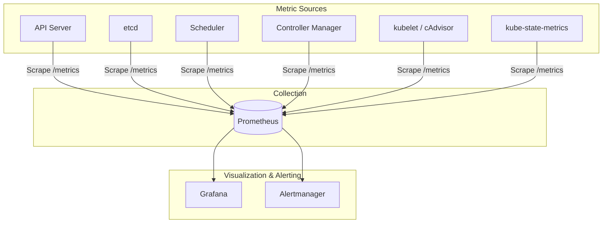
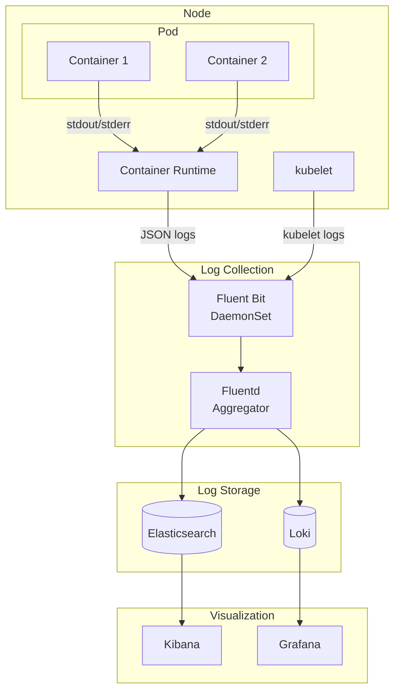
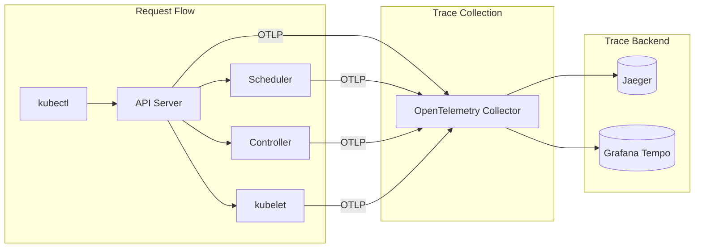

# Observability

[← Back to Index](./00-index.md)

---

## Metrics

### Metrics Architecture



### Control Plane Metrics

#### API Server Metrics

| Metric | Type | Description | Alert Threshold |
|--------|------|-------------|-----------------|
| `apiserver_request_total` | Counter | Total requests by verb, resource, code | High 5xx rate |
| `apiserver_request_duration_seconds` | Histogram | Request latency | p99 > 1s |
| `apiserver_current_inflight_requests` | Gauge | In-flight requests | Near max |
| `apiserver_admission_controller_admission_duration_seconds` | Histogram | Admission latency | p99 > 100ms |
| `apiserver_watch_events_total` | Counter | Watch events sent | High rate = controller churn |
| `apiserver_longrunning_requests` | Gauge | Long-running requests (watches) | Track connection count |

```
Key API Server Alerts:

alert: APIServerHighLatency
expr: histogram_quantile(0.99, rate(apiserver_request_duration_seconds_bucket{verb!="WATCH"}[5m])) > 1
for: 5m
severity: critical

alert: APIServerHighErrorRate
expr: sum(rate(apiserver_request_total{code=~"5.."}[5m])) / sum(rate(apiserver_request_total[5m])) > 0.01
for: 5m
severity: warning
```

#### etcd Metrics

| Metric | Type | Description | Alert Threshold |
|--------|------|-------------|-----------------|
| `etcd_server_has_leader` | Gauge | Whether member has leader | 0 = critical |
| `etcd_server_leader_changes_seen_total` | Counter | Leader elections | High rate = instability |
| `etcd_disk_backend_commit_duration_seconds` | Histogram | Disk fsync latency | p99 > 25ms |
| `etcd_mvcc_db_total_size_in_bytes` | Gauge | Database size | > 80% of quota |
| `etcd_network_peer_round_trip_time_seconds` | Histogram | Peer latency | High = network issues |

```
Key etcd Alerts:

alert: etcdNoLeader
expr: etcd_server_has_leader == 0
for: 1m
severity: critical

alert: etcdHighCommitDurations
expr: histogram_quantile(0.99, rate(etcd_disk_backend_commit_duration_seconds_bucket[5m])) > 0.025
for: 5m
severity: warning

alert: etcdDatabaseSpaceExceeded
expr: (etcd_mvcc_db_total_size_in_bytes / etcd_server_quota_backend_bytes) > 0.8
for: 5m
severity: warning
```

#### Scheduler Metrics

| Metric | Type | Description | Alert Threshold |
|--------|------|-------------|-----------------|
| `scheduler_schedule_attempts_total` | Counter | Scheduling attempts by result | High unschedulable |
| `scheduler_scheduling_algorithm_duration_seconds` | Histogram | Scheduling latency | p99 > 1s |
| `scheduler_pending_pods` | Gauge | Pending pods by queue | Increasing trend |
| `scheduler_preemption_attempts_total` | Counter | Preemption attempts | High rate = capacity issue |

### Data Plane Metrics

#### kubelet / cAdvisor Metrics

| Metric | Type | Description | Use |
|--------|------|-------------|-----|
| `kubelet_running_pods` | Gauge | Running pods on node | Capacity planning |
| `kubelet_pod_start_duration_seconds` | Histogram | Pod startup latency | SLO monitoring |
| `container_cpu_usage_seconds_total` | Counter | Container CPU | Per-container monitoring |
| `container_memory_usage_bytes` | Gauge | Container memory | OOM prediction |
| `container_network_receive_bytes_total` | Counter | Network received | Traffic analysis |

#### kube-state-metrics

```
kube-state-metrics exposes Kubernetes object state as metrics:

# Deployment metrics
kube_deployment_status_replicas
kube_deployment_status_replicas_available
kube_deployment_status_replicas_unavailable

# Pod metrics
kube_pod_status_phase
kube_pod_status_ready
kube_pod_container_status_restarts_total

# Node metrics
kube_node_status_condition
kube_node_status_capacity

# Resource quota
kube_resourcequota
```

---

## Logging

### Logging Architecture



### Log Collection Patterns

| Pattern | Description | Pros | Cons |
|---------|-------------|------|------|
| **DaemonSet** | Fluent Bit on each node | Simple, efficient | Can't access pod context |
| **Sidecar** | Logging container per pod | Rich context, isolated | Resource overhead |
| **Agent** | Application-level logging | Full control | Application changes needed |

### Container Logging

```
Container logs flow:

1. Application writes to stdout/stderr
2. Container runtime captures output
3. Written to /var/log/containers/<pod>_<namespace>_<container>-<id>.log
4. Symlinked from /var/log/pods/<namespace>_<pod>_<uid>/<container>/0.log
5. Log collector reads and forwards

Log format (JSON, if configured):
{
  "log": "INFO: Request processed\n",
  "stream": "stdout",
  "time": "2024-01-15T10:30:00.000000000Z"
}
```

### Audit Logging

```
API Server Audit Log Format:

{
  "kind": "Event",
  "apiVersion": "audit.k8s.io/v1",
  "level": "RequestResponse",
  "auditID": "abc-123",
  "stage": "ResponseComplete",
  "requestURI": "/api/v1/namespaces/default/pods",
  "verb": "create",
  "user": {
    "username": "admin",
    "groups": ["system:masters"]
  },
  "sourceIPs": ["10.0.0.1"],
  "objectRef": {
    "resource": "pods",
    "namespace": "default",
    "name": "my-pod",
    "apiVersion": "v1"
  },
  "responseStatus": {
    "metadata": {},
    "code": 201
  },
  "requestReceivedTimestamp": "2024-01-15T10:30:00.000000Z",
  "stageTimestamp": "2024-01-15T10:30:00.100000Z"
}
```

---

## Distributed Tracing

### Tracing Architecture



### Kubernetes Tracing Points

| Component | Trace Points | Context |
|-----------|--------------|---------|
| **API Server** | Request handling, admission, etcd calls | User request ID |
| **Scheduler** | Filtering, scoring, binding | Pod UID |
| **Controller Manager** | Reconciliation loops | Resource UID |
| **kubelet** | Pod sync, container operations | Pod UID |

### Example Trace

```
Request: Create Pod

Span: api-server.handle-create (10ms)
├── Span: api-server.authenticate (1ms)
├── Span: api-server.authorize (1ms)
├── Span: api-server.mutating-admission (2ms)
│   ├── Span: webhook.inject-sidecar (1ms)
├── Span: api-server.validating-admission (2ms)
├── Span: api-server.etcd-create (3ms)
└── Span: api-server.watch-notify (1ms)

... later ...

Span: scheduler.schedule (50ms)
├── Span: scheduler.filter (20ms)
│   ├── Span: filter.node-resources-fit (5ms)
│   ├── Span: filter.taint-toleration (5ms)
│   └── Span: filter.pod-topology-spread (10ms)
├── Span: scheduler.score (25ms)
│   ├── Span: score.node-affinity (10ms)
│   └── Span: score.image-locality (15ms)
└── Span: scheduler.bind (5ms)
```

---

## Alerting

### Alert Hierarchy

```
Alert Priority Levels:

P1 - Critical (Page immediately)
  - etcd quorum loss
  - API server unavailable
  - Multiple nodes NotReady
  - Cluster-wide pod failures

P2 - High (Page during business hours)
  - Single control plane component down
  - High API latency
  - etcd performance degradation
  - Persistent volume issues

P3 - Warning (Ticket)
  - High pod restart rate
  - Approaching resource limits
  - Certificate expiration warnings
  - Elevated error rates

P4 - Info (Dashboard only)
  - Deployment rollouts
  - Scaling events
  - Routine maintenance
```

### Critical Alerts

```yaml
# Cluster-wide critical alerts

- alert: KubernetesAPIServerDown
  expr: absent(up{job="kubernetes-apiservers"} == 1)
  for: 5m
  labels:
    severity: critical
  annotations:
    summary: "Kubernetes API server is down"

- alert: KubernetesEtcdDown
  expr: absent(up{job="etcd"} == 1)
  for: 5m
  labels:
    severity: critical
  annotations:
    summary: "etcd cluster is down"

- alert: KubernetesSchedulerDown
  expr: absent(up{job="kube-scheduler"} == 1)
  for: 5m
  labels:
    severity: critical
  annotations:
    summary: "Kubernetes scheduler is down"

- alert: KubernetesNodeNotReady
  expr: kube_node_status_condition{condition="Ready",status="true"} == 0
  for: 5m
  labels:
    severity: warning
  annotations:
    summary: "Kubernetes node {{ $labels.node }} is not ready"

- alert: KubernetesPodCrashLooping
  expr: rate(kube_pod_container_status_restarts_total[15m]) > 0.1
  for: 5m
  labels:
    severity: warning
  annotations:
    summary: "Pod {{ $labels.namespace }}/{{ $labels.pod }} is crash looping"
```

### SLO-Based Alerts

```yaml
# Based on Kubernetes SLOs

- alert: APIServerLatencySLOBreach
  expr: |
    histogram_quantile(0.99,
      sum(rate(apiserver_request_duration_seconds_bucket{verb!~"WATCH|CONNECT"}[5m])) by (le)
    ) > 1
  for: 10m
  labels:
    severity: warning
  annotations:
    summary: "API server p99 latency exceeds 1s SLO"

- alert: PodStartupLatencySLOBreach
  expr: |
    histogram_quantile(0.99,
      sum(rate(kubelet_pod_start_duration_seconds_bucket[5m])) by (le)
    ) > 5
  for: 10m
  labels:
    severity: warning
  annotations:
    summary: "Pod startup p99 latency exceeds 5s SLO"
```

---

## Dashboards

### Cluster Overview Dashboard

```
Cluster Overview Panels:

Row 1: Cluster Health
┌─────────────────┬─────────────────┬─────────────────┐
│  Nodes Ready    │  Pods Running   │  Deployments    │
│     47/50       │   1234/1250     │    150/150      │
└─────────────────┴─────────────────┴─────────────────┘

Row 2: Control Plane
┌─────────────────┬─────────────────┬─────────────────┐
│  API Server     │  etcd Health    │  Scheduler      │
│  p99: 45ms      │  Leader: etcd-1 │  Queue: 0       │
└─────────────────┴─────────────────┴─────────────────┘

Row 3: Resource Utilization
┌─────────────────────────────────────────────────────┐
│  CPU Utilization by Node (time series graph)        │
└─────────────────────────────────────────────────────┘
┌─────────────────────────────────────────────────────┐
│  Memory Utilization by Node (time series graph)     │
└─────────────────────────────────────────────────────┘

Row 4: Network
┌─────────────────────────────────────────────────────┐
│  Pod Network Traffic (ingress/egress)               │
└─────────────────────────────────────────────────────┘
```

### Control Plane Dashboard

```
Control Plane Deep Dive:

API Server:
- Request rate by verb
- Request latency histogram
- Error rate by code
- Watch connection count
- Admission latency

etcd:
- Leader status
- Commit duration
- Database size
- Peer round-trip time
- Raft proposal rate

Scheduler:
- Scheduling rate
- Pending pods
- Scheduling latency
- Preemption rate
- Plugin execution time

Controller Manager:
- Work queue depth
- Reconciliation rate
- Error rate by controller
- Leader election status
```

### Namespace Dashboard

```
Namespace View Panels:

Filters: [Namespace: production] [Time: Last 6h]

Row 1: Overview
┌─────────────────┬─────────────────┬─────────────────┐
│  Pods: 45       │  Services: 12   │  Deployments: 8 │
│  Running: 43    │  Endpoints: 89  │  Ready: 8       │
└─────────────────┴─────────────────┴─────────────────┘

Row 2: Resource Usage
┌─────────────────────────────────────────────────────┐
│  CPU: Requested vs Used vs Limit                    │
│  [=========>         ]  45% of limit                │
└─────────────────────────────────────────────────────┘
┌─────────────────────────────────────────────────────┐
│  Memory: Requested vs Used vs Limit                 │
│  [==============>    ]  70% of limit                │
└─────────────────────────────────────────────────────┘

Row 3: Pod Table
┌─────────────────────────────────────────────────────┐
│ Pod Name        │ Status  │ CPU  │ Memory │ Restarts│
├─────────────────┼─────────┼──────┼────────┼─────────┤
│ api-server-1    │ Running │ 200m │ 256Mi  │ 0       │
│ web-frontend-2  │ Running │ 100m │ 128Mi  │ 1       │
│ worker-3        │ Pending │ -    │ -      │ 0       │
└─────────────────────────────────────────────────────┘
```

---

## Health Checks

### Component Health Endpoints

| Component | Endpoint | Response |
|-----------|----------|----------|
| API Server | `/healthz` | ok (200) or error (500) |
| API Server | `/livez` | ok (200) or error (500) |
| API Server | `/readyz` | ok (200) or error (500) |
| etcd | `/health` | {"health":"true"} |
| Scheduler | `/healthz` | ok (200) |
| Controller Manager | `/healthz` | ok (200) |
| kubelet | `/healthz` | ok (200) |

### Health Check Details

```
API Server health check breakdown:

GET /healthz?verbose=true

[+]ping ok
[+]log ok
[+]etcd ok
[+]poststarthook/start-kube-apiserver-admission-initializer ok
[+]poststarthook/generic-apiserver-start-informers ok
[+]poststarthook/start-apiextensions-informers ok
[+]poststarthook/start-apiextensions-controllers ok
[+]poststarthook/crd-informer-synced ok
[+]poststarthook/start-service-ip-repair-controllers ok
[+]poststarthook/rbac/bootstrap-roles ok
[+]poststarthook/scheduling/bootstrap-system-priority-classes ok
healthz check passed
```

### Liveness vs Readiness

```
API Server health endpoints:

/livez - Liveness check
  - Is the process alive?
  - Failure → restart container
  - Checks: ping, log

/readyz - Readiness check
  - Is the server ready to serve traffic?
  - Failure → remove from load balancer
  - Checks: ping, log, etcd, informers, admission

/healthz - Combined (legacy)
  - Checks all components
  - Used by some monitoring systems
```
