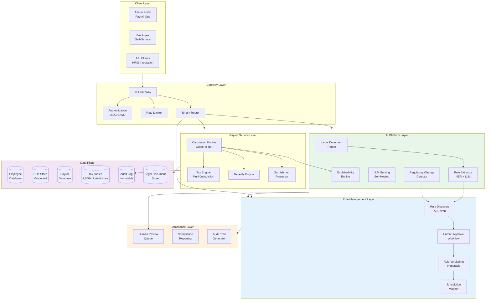

# Compliance First AI Native Payroll Engine - System Design

[Back to System Design Index](../README.md)

---

## System Overview

A **Compliance First AI Native Payroll Engine** is a next-generation cloud SaaS platform where artificial intelligence is embedded as a first-class architectural component for **payroll rules discovery, creation, and automatic application**. Unlike traditional payroll systems that rely on manually coded rules maintained by compliance teams, this system uses AI to parse legal documents (labor laws, tax codes, collective agreements), extract structured payroll rules, and apply them automatically based on employee jurisdiction.

The defining architectural challenges include: (1) **AI-driven legal document parsing** using NLP and LLMs to extract payroll rules from unstructured legal text, (2) **human-in-the-middle approval workflow** where AI suggests rules with reasoning and humans approve/modify before activation, (3) **multi-jurisdiction rule engine** supporting 7,040+ US tax jurisdictions plus international regulations, (4) **explainable calculations** where every payroll line item includes rule citations and reasoning, and (5) **regulatory change detection** that proactively monitors for law changes and suggests rule updates.

Modern AI-native payroll platforms like Rippling (hub-and-spokes architecture with compliance engine), Deel (in-house global payroll engine covering 50+ countries), Papaya Global (AI validation engine for 160+ countries), and Gusto (powered by Symmetry tax engine) demonstrate this architectural shift toward automated compliance, real-time multi-jurisdiction calculation, and AI-assisted payroll operations.

---

## Key Characteristics

| Characteristic | Value | Implication |
|----------------|-------|-------------|
| **Traffic Pattern** | Batch-heavy (pay runs), with real-time preview | Batch optimization, async calculation, preview caching |
| **Consistency Model** | Strong for calculations, Eventual for analytics | ACID for pay data, CQRS for reporting |
| **Availability Target** | 99.99% for pay runs, 99.9% for AI features | Pay deadline criticality, AI graceful degradation |
| **Latency Target** | <1s single calculation, <30min batch (10K employees) | Parallel processing, pre-computed rules |
| **Accuracy Requirement** | 100% (zero tolerance) | Decimal arithmetic, deterministic engine |
| **Privacy Requirement** | Critical - SSN, salary, bank accounts | Field-level encryption, self-hosted AI |
| **Compliance Requirement** | Multi-framework (FLSA, ACA, GDPR, EU AI Act, SOX) | Human-in-loop for AI, immutable audit trails |

---

## Complexity Rating

| Aspect | Rating | Reason |
|--------|--------|--------|
| **Overall** | Very High | AI rule discovery + multi-jurisdiction + compliance + explainability |
| **AI Legal Document Parsing** | Very High | NER, LLM extraction, confidence scoring, hallucination mitigation |
| **Multi-Jurisdiction Rule Engine** | Very High | 7,040+ US jurisdictions, conflict resolution, reciprocity agreements |
| **Calculation Engine** | High | Gross-to-net pipeline, tax tables, wage bases, garnishments |
| **Human-in-the-Loop Workflow** | High | Approval workflows, versioning, rollback, accountability |
| **Explainability Engine** | High | Line-item explanations, rule citations, natural language generation |
| **Compliance & Audit** | Medium-High | Immutable logs, 7-year retention, regulatory reporting |

---

## Quick Navigation

| Document | Description |
|----------|-------------|
| [01 - Requirements & Estimations](./01-requirements-and-estimations.md) | Functional/Non-functional requirements, capacity planning, SLOs |
| [02 - High-Level Design](./02-high-level-design.md) | Architecture, AI platform, rule engine, data flows |
| [03 - Low-Level Design](./03-low-level-design.md) | Data model, API design, rule extraction & calculation algorithms |
| [04 - Deep Dive & Bottlenecks](./04-deep-dive-and-bottlenecks.md) | Legal parsing, rule engine, calculation engine deep dives |
| [05 - Scalability & Reliability](./05-scalability-and-reliability.md) | Batch processing, multi-region, disaster recovery |
| [06 - Security & Compliance](./06-security-and-compliance.md) | Data protection, payroll compliance, threat model |
| [07 - Observability](./07-observability.md) | Metrics, logging, compliance dashboards, alerting |
| [08 - Interview Guide](./08-interview-guide.md) | 45-min pacing, trap questions, trade-offs |

---

## Core Payroll Modules

| Module | Responsibility | AI Enhancement |
|--------|----------------|----------------|
| **Rule Discovery Engine** | Parse legal documents, extract payroll rules | NLP/LLM for structured rule extraction |
| **Rule Management** | Version, approve, activate, supersede rules | AI confidence scoring, change suggestions |
| **Calculation Engine** | Gross-to-net computation | Explainable calculations with rule citations |
| **Tax Engine** | Federal, state, local, international taxes | Multi-jurisdiction resolution, rate lookup |
| **Benefits Engine** | Pre-tax, post-tax deductions | Eligibility determination, limit tracking |
| **Garnishment Processor** | Wage attachments, child support, levies | Priority calculation, disposable income |
| **Compliance Monitor** | Regulatory change detection | AI-powered law monitoring, alert generation |
| **Audit & Reporting** | Pay stubs, tax forms, compliance reports | Natural language explanation generation |

---

## AI Capabilities Matrix

| Capability | Technology | Use Cases |
|------------|------------|-----------|
| **Legal Document Parsing** | OCR + NLP + LLM extraction | Parse labor laws, tax codes, collective agreements |
| **Rule Extraction** | Named Entity Recognition + Classification | Identify wage thresholds, overtime rules, tax rates |
| **Confidence Scoring** | ML classification + uncertainty estimation | Flag low-confidence extractions for human review |
| **Regulatory Monitoring** | Web scraping + change detection | Alert on new laws, amendments, rate changes |
| **Calculation Explanation** | LLM generation + template filling | Generate plain-language pay stub explanations |
| **Anomaly Detection** | Statistical ML + rule-based | Flag unusual calculations, potential fraud |
| **Compliance Q&A** | RAG + LLM | Answer questions about applicable regulations |

---

## Architecture Overview



---

## AI-Native vs Traditional Payroll

| Aspect | Traditional Payroll | AI-Native Payroll |
|--------|---------------------|-------------------|
| **Rule Updates** | Manual coding by compliance team | AI extracts from legal documents, human approves |
| **Jurisdiction Handling** | Static configuration per employee | Dynamic resolution based on work/residence |
| **Compliance Monitoring** | Periodic manual review | Continuous AI monitoring, proactive alerts |
| **Calculation Errors** | Discovered in audits or complaints | Real-time anomaly detection |
| **Employee Questions** | Call HR, manual research | Natural language Q&A with rule citations |
| **Pay Stub Explanation** | Generic descriptions | Personalized explanations with reasoning |
| **Multi-Jurisdiction** | Complex manual configuration | Automatic rule selection and conflict resolution |
| **Regulatory Changes** | Delayed implementation | Real-time detection and suggestion |

---

## When to Use This Design

**Use Compliance First AI Native Payroll When:**
- Operating in multiple jurisdictions (multi-state, multi-country)
- High volume of regulatory changes affects payroll (>50 updates/year)
- Compliance audit trail requirements are strict (SOX, regulated industry)
- Employee self-service with explainable calculations is required
- Data sovereignty requirements prevent external AI API usage
- Competitive advantage through faster compliance adaptation

**Do NOT Use When:**
- Single jurisdiction with stable regulations
- Small employee count (<100) with simple payroll needs
- No budget for AI infrastructure (GPU clusters)
- No internal expertise to manage AI operations
- Off-the-shelf payroll SaaS meets all requirements

---

## Real-World Implementations

| System | Architecture | Key Innovation |
|--------|--------------|----------------|
| **Rippling** | Hub-and-spokes with unified employee graph | Automatic compliance violation detection, remediation suggestions |
| **Deel** | In-house payroll engine, 50+ countries | Real-time gross-to-net across jurisdictions, PaySpace acquisition |
| **Papaya Global** | Hybrid ICP model, AI validation engine | Built-in compliance engine, 160+ countries |
| **Gusto (Symmetry)** | Industry-standard tax engine | 7,040+ US jurisdictions, certified calculations |
| **ADP** | Legacy with AI augmentation | Regulatory monitoring, compliance alerts |
| **Workday** | Cloud HCM with payroll module | Continuous compliance, embedded analytics |

---

## Technology Stack (Reference)

| Layer | Technology Options | Selection Criteria |
|-------|-------------------|-------------------|
| **LLM Serving** | vLLM, TensorRT-LLM, Triton | Throughput, latency, GPU efficiency |
| **NLP/NER** | spaCy, HuggingFace Transformers | Legal entity recognition accuracy |
| **Rule Engine** | Custom DSL, Drools, OPA | Versioning, auditability, performance |
| **Tax Calculation** | Symmetry, Vertex, custom | Jurisdiction coverage, certification |
| **Payroll Database** | PostgreSQL, CockroachDB | ACID, multi-region, encryption |
| **Rule Store** | PostgreSQL + Git-like versioning | Immutable history, branching |
| **Audit Log** | Kafka + append-only store | Immutability, high throughput |
| **Vector Database** | Milvus, Pgvector | Semantic search for regulations |

---

## Quick Reference Card

```
┌─────────────────────────────────────────────────────────────────┐
│   COMPLIANCE FIRST AI NATIVE PAYROLL ENGINE - QUICK REFERENCE   │
├─────────────────────────────────────────────────────────────────┤
│                                                                 │
│  SCALE TARGETS               KEY PATTERNS                       │
│  ─────────────               ────────────                       │
│  • 5K+ tenants               • AI rule discovery (NLP/LLM)      │
│  • 10M employees/month       • Human-in-the-loop approval       │
│  • 50K pay runs/month        • Multi-jurisdiction resolution    │
│  • 7,040+ US jurisdictions   • Explainable calculations         │
│  • 99.99% pay run success    • Self-hosted AI for privacy       │
│                                                                 │
├─────────────────────────────────────────────────────────────────┤
│                                                                 │
│  PAYROLL MODULES             AI CAPABILITIES                    │
│  ──────────────              ───────────────                    │
│  • Rule Discovery            • Legal document parsing           │
│  • Calculation Engine        • Rule extraction (NER + LLM)      │
│  • Tax Engine                • Regulatory change detection      │
│  • Benefits Engine           • Calculation explanation          │
│  • Garnishment Processor     • Compliance Q&A (RAG)             │
│  • Audit & Reporting         • Anomaly detection                │
│                                                                 │
├─────────────────────────────────────────────────────────────────┤
│                                                                 │
│  COMPLIANCE FRAMEWORKS       PRIVACY REQUIREMENTS               │
│  ────────────────────        ────────────────────               │
│  • FLSA (wage/overtime)      • Self-hosted LLM                  │
│  • ACA (healthcare)          • Field-level encryption (SSN)     │
│  • GDPR (EU employees)       • Tenant-specific keys             │
│  • EU AI Act (explainability)• Data residency routing           │
│  • SOX (financial controls)  • 7-year audit retention           │
│                                                                 │
├─────────────────────────────────────────────────────────────────┤
│                                                                 │
│  INTERVIEW KEYWORDS                                             │
│  ─────────────────                                              │
│  Rule extraction, NER, Legal NLP, Human-in-the-loop,            │
│  Multi-jurisdiction, Gross-to-net, Tax withholding,             │
│  Explainable AI, Audit trail, Regulatory compliance,            │
│  Batch processing, Pay run deadline, Garnishments,              │
│  Reciprocity agreements, FLSA, ACA, EU AI Act                   │
│                                                                 │
└─────────────────────────────────────────────────────────────────┘
```

---

## Interview Readiness Checklist

| Topic | Must Know | Deep Dive |
|-------|-----------|-----------|
| Rule Extraction | NER for payroll entities, LLM prompting | Confidence scoring, hallucination mitigation |
| Multi-Jurisdiction | Federal/state/local hierarchy | Reciprocity agreements, conflict resolution |
| Gross-to-Net | Pre-tax → taxes → post-tax flow | Wage bases, garnishment priority |
| Tax Calculation | Federal brackets, FICA rates | 7,040+ jurisdictions, local taxes |
| Human-in-Loop | Approval workflow basics | Version control, rollback, accountability |
| Explainability | Line-item breakdown | Natural language generation, rule citations |
| Compliance | FLSA, ACA, GDPR basics | EU AI Act requirements, SOX controls |
| Privacy | Encryption at rest/transit | Field-level encryption, key hierarchy |

---

## Related Systems

- [AI Native Cloud ERP SaaS](../2.18-ai-native-cloud-erp-saas/00-index.md) - ERP integration, financial posting
- [Identity & Access Management](../2.5-identity-access-management/00-index.md) - AuthN/AuthZ patterns
- [Secret Management System](../2.16-secret-management-system/00-index.md) - Key management for sensitive data
- [Distributed Job Scheduler](../2.6-distributed-job-scheduler/00-index.md) - Batch pay run scheduling
- [Event Sourcing System](../1.18-event-sourcing-system/00-index.md) - Audit trail patterns

---

## References

- Rippling Engineering - Hub-and-spokes architecture, compliance violation detection
- Deel Global Payroll - In-house payroll engine, multi-country localization
- Papaya Global - AI-powered compliance validation, hybrid ICP model
- Symmetry Software - Tax engine powering 7,040+ US jurisdictions
- EU AI Act (2024) - Employment AI classified as "high-risk," explainability requirements
- FLSA Regulations - Federal minimum wage, overtime requirements
- IRS Publication 15 (Circular E) - Employer's Tax Guide
- spaCy Legal NLP - Named entity recognition for legal documents
