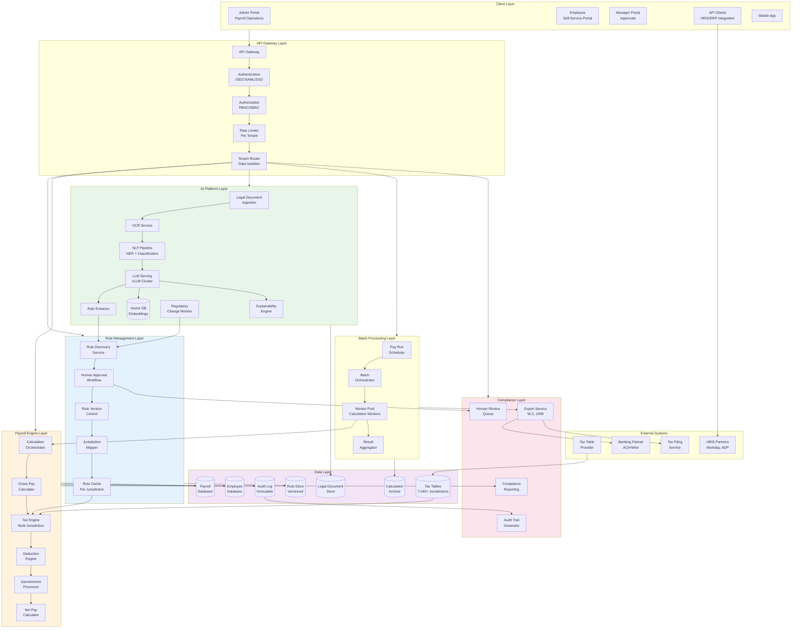
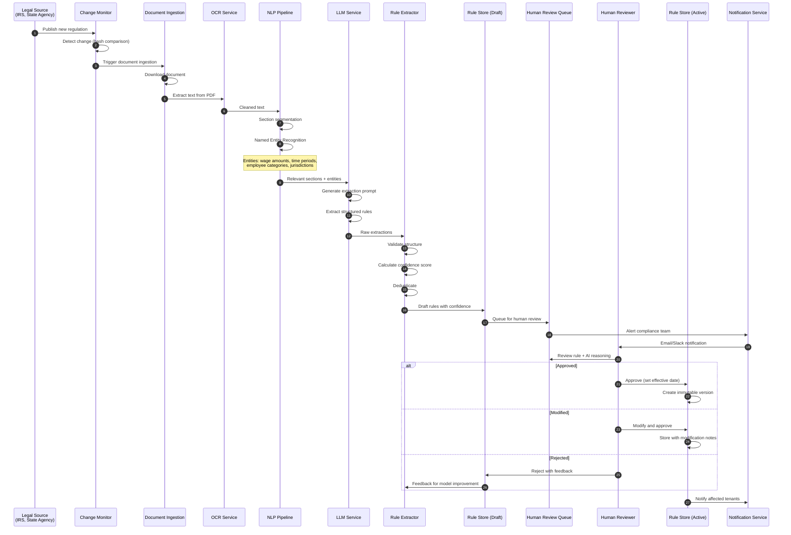
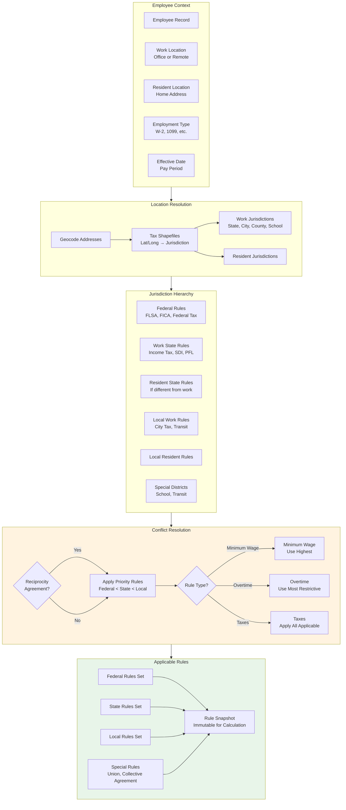
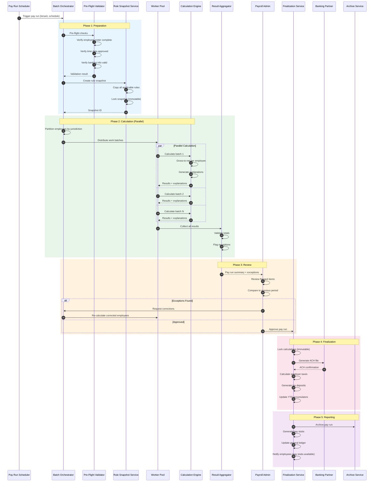
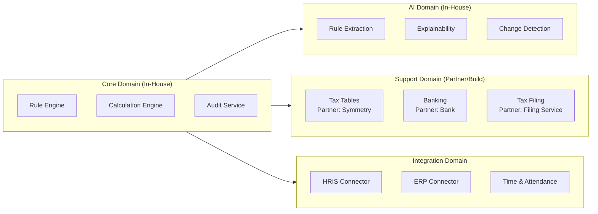
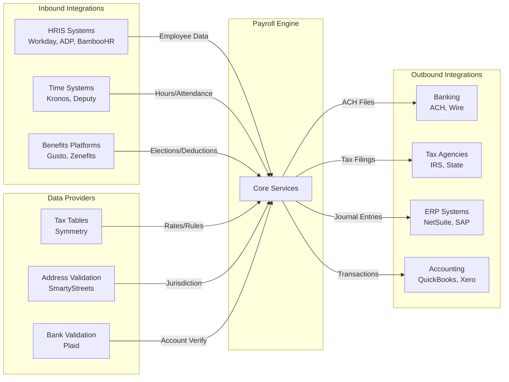
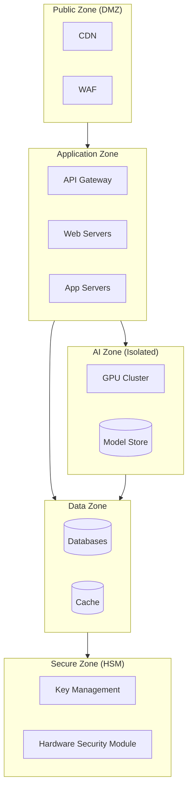
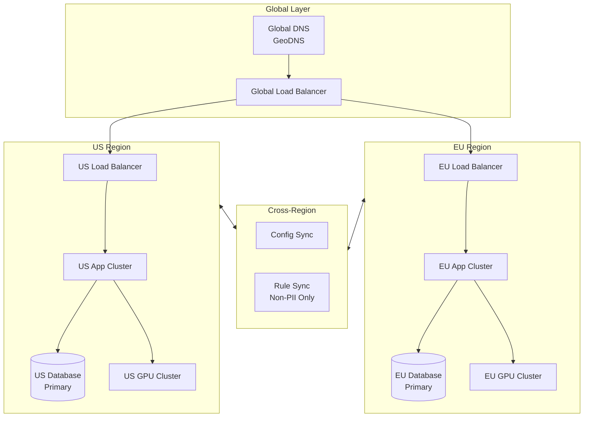

# High-Level Design

> **Navigation**: [Index](./00-index.md) | [Requirements](./01-requirements-and-estimations.md) | **HLD** | [LLD](./03-low-level-design.md) | [Deep Dive](./04-deep-dive-and-bottlenecks.md) | [Scale](./05-scalability-and-reliability.md) | [Security](./06-security-and-compliance.md) | [Observability](./07-observability.md) | [Interview Guide](./08-interview-guide.md)

---

## 1. System Architecture

### 1.1 Complete Architecture Diagram



---

## 2. Key Data Flows

### 2.1 AI Rules Discovery Flow



### 2.2 Gross-to-Net Calculation Flow

```mermaid
flowchart TB
    subgraph Inputs["Inputs"]
        TimeData[Time & Attendance<br/>Hours, OT, PTO]
        EmployeeProfile[Employee Profile<br/>Location, Status, Elections]
        EarningsConfig[Earnings Configuration<br/>Salary, Rates, Bonus]
        PayPeriod[Pay Period<br/>Start/End Dates]
    end

    subgraph GrossCalc["Gross Pay Calculation"]
        RegularPay[Regular Pay<br/>Hours × Rate or Salary/periods]
        OvertimePay[Overtime Pay<br/>OT Hours × Rate × 1.5]
        BonusPay[Bonus/Commission<br/>As configured]
        OtherEarnings[Other Earnings<br/>Tips, Reimbursements]
        GrossTotal[Gross Pay Total]
    end

    subgraph PreTaxDeductions["Pre-Tax Deductions"]
        Retirement401k[401k/403b<br/>Employee + Match]
        HSA[HSA Contribution]
        FSA[FSA - Medical/Dependent]
        TransitBenefits[Transit Benefits]
        HealthPremium[Health Insurance Premium]
        TaxableGross[Taxable Gross]
    end

    subgraph TaxCalculations["Tax Calculations"]
        FederalTax[Federal Income Tax<br/>W-4 + Brackets]
        SocialSecurity[Social Security<br/>6.2% up to wage base]
        Medicare[Medicare<br/>1.45% + 0.9% additional]
        StateTax[State Income Tax<br/>Work State Rules]
        LocalTax[Local Taxes<br/>City/County/School]
        TotalTaxes[Total Tax Withholding]
    end

    subgraph PostTaxDeductions["Post-Tax Deductions"]
        RothContrib[Roth 401k/IRA]
        LifeInsurance[Life Insurance<br/>(excess coverage)]
        UnionDues[Union Dues]
        CharityDeductions[Charitable Deductions]
        PostTaxTotal[Post-Tax Deductions Total]
    end

    subgraph Garnishments["Garnishments (Priority Order)"]
        TaxLevy[Tax Levies<br/>IRS, State]
        ChildSupport[Child Support]
        Alimony[Alimony]
        StudentLoan[Student Loans]
        Creditor[Creditor Garnishments]
        GarnishmentTotal[Total Garnishments]
    end

    subgraph Output["Output"]
        NetPay[Net Pay]
        PayStub[Pay Stub<br/>with Explanations]
        EmployerTaxes[Employer Tax<br/>Liabilities]
        AuditRecord[Audit Record<br/>Complete Trail]
        GLEntries[General Ledger<br/>Journal Entries]
    end

    Inputs --> GrossCalc
    RegularPay --> GrossTotal
    OvertimePay --> GrossTotal
    BonusPay --> GrossTotal
    OtherEarnings --> GrossTotal

    GrossTotal --> PreTaxDeductions
    Retirement401k --> TaxableGross
    HSA --> TaxableGross
    FSA --> TaxableGross
    TransitBenefits --> TaxableGross
    HealthPremium --> TaxableGross

    TaxableGross --> TaxCalculations
    FederalTax --> TotalTaxes
    SocialSecurity --> TotalTaxes
    Medicare --> TotalTaxes
    StateTax --> TotalTaxes
    LocalTax --> TotalTaxes

    TotalTaxes --> PostTaxDeductions
    RothContrib --> PostTaxTotal
    LifeInsurance --> PostTaxTotal
    UnionDues --> PostTaxTotal
    CharityDeductions --> PostTaxTotal

    PostTaxTotal --> Garnishments
    TaxLevy --> GarnishmentTotal
    ChildSupport --> GarnishmentTotal
    Alimony --> GarnishmentTotal
    StudentLoan --> GarnishmentTotal
    Creditor --> GarnishmentTotal

    GarnishmentTotal --> NetPay
    NetPay --> Output

    style GrossCalc fill:#e3f2fd
    style PreTaxDeductions fill:#e8f5e9
    style TaxCalculations fill:#fff3e0
    style PostTaxDeductions fill:#fce4ec
    style Garnishments fill:#f3e5f5
```

### 2.3 Jurisdiction Resolution Flow



### 2.4 Pay Run Batch Processing Flow



---

## 3. Architecture Layers

### 3.1 Layer Overview

| Layer | Responsibility | Key Components | Scaling Strategy |
|-------|----------------|----------------|------------------|
| **Client** | User interfaces | Admin Portal, Employee SSP, Mobile | CDN, edge caching |
| **Gateway** | Traffic management | API Gateway, Auth, Rate Limiting | Horizontal, stateless |
| **Rule Management** | Rule lifecycle | Discovery, Approval, Versioning | Event-driven, async |
| **Payroll Engine** | Calculations | Gross-to-net, Taxes, Deductions | Worker pool, parallel |
| **AI Platform** | Intelligence | NLP, LLM, Extraction, Explanation | GPU cluster, batching |
| **Batch Processing** | Pay runs | Scheduler, Workers, Aggregation | Auto-scaling workers |
| **Data** | Persistence | Employee, Rules, Payroll, Audit | Sharded, replicated |
| **Compliance** | Regulatory | Review Queue, Reporting, Export | Async, queued |

### 3.2 Service Boundaries



---

## 4. Key Architectural Decisions

### 4.1 Decision 1: Rule Engine Architecture

| Option | Description | Pros | Cons |
|--------|-------------|------|------|
| **Commercial BRMS (Drools)** | Use established business rules engine | Mature, feature-rich, tooling | License cost, less control, versioning challenges |
| **Custom DSL** | Build domain-specific rule language | Full control, optimized for payroll, native versioning | Development effort, maintenance |
| **Pure LLM** | Let LLM interpret rules at runtime | Flexible, handles ambiguity | Non-deterministic, slow, expensive |

**Decision: Custom DSL with LLM-assisted extraction**
- **Rationale**: Payroll rules have specific patterns (conditions, actions, effective dates). Custom DSL allows versioned, auditable rules while LLM handles extraction from legal documents.
- **Trade-off**: Higher initial development, but better long-term control and auditability.

### 4.2 Decision 2: AI Hosting Model

| Option | Description | Pros | Cons |
|--------|-------------|------|------|
| **Cloud AI APIs (OpenAI, Claude)** | Use external LLM APIs | Latest models, no infrastructure | Data leaves premises, compliance risk, latency |
| **Self-hosted vLLM** | Host open-source models on own GPUs | Data sovereignty, compliance, low latency | GPU infrastructure cost, model updates |
| **Hybrid** | Self-hosted for sensitive, cloud for general | Balance of benefits | Complexity, two systems to maintain |

**Decision: Self-hosted vLLM for all payroll AI**
- **Rationale**: Legal documents and payroll data are highly sensitive. Compliance (GDPR, SOX) requires data sovereignty. Self-hosting ensures no PII leaves the system.
- **Trade-off**: GPU infrastructure cost (~$50K-100K/year) vs. compliance risk and data security.

### 4.3 Decision 3: Tax Calculation Strategy

| Option | Description | Pros | Cons |
|--------|-------------|------|------|
| **Build** | Build own tax engine for all jurisdictions | Full control, no vendor dependency | Massive effort, certification challenges |
| **Partner (Symmetry, Vertex)** | Use certified tax calculation partner | Certified, maintained, 7,040+ jurisdictions | Cost, dependency, integration complexity |
| **Hybrid** | Partner for tables, own logic for application | Control over logic, certified data | Integration effort |

**Decision: Hybrid - Partner for tax tables, own calculation logic**
- **Rationale**: Tax tables require constant maintenance and certification. Partners (Symmetry) specialize in this. Our value is in rule discovery and application logic.
- **Trade-off**: Partner dependency for data, but own control over calculation and explainability.

### 4.4 Decision 4: Multi-Tenancy Model

| Option | Description | Pros | Cons |
|--------|-------------|------|------|
| **Database per tenant** | Separate database for each tenant | Strong isolation, easy compliance | Cost at scale, management overhead |
| **Schema per tenant** | Shared database, separate schemas | Good isolation, moderate cost | Schema management complexity |
| **Shared with encryption** | Shared tables, tenant encryption keys | Cost-efficient, scalable | Requires careful isolation, key management |

**Decision: Shared database with tenant-specific encryption**
- **Rationale**: Cost-efficient for 10K+ tenants. Encryption provides isolation without infrastructure overhead. Enterprise tenants can upgrade to dedicated.
- **Trade-off**: Requires robust row-level security and key management.

### 4.5 Decision 5: Calculation Architecture

| Option | Description | Pros | Cons |
|--------|-------------|------|------|
| **Real-time only** | Calculate on-demand for each request | Simple, always current | Slow for batch, resource-intensive |
| **Batch only** | Pre-calculate during pay runs | Efficient, predictable | Can't preview, stale until run |
| **Hybrid** | Real-time preview, batch for finalization | Best of both, good UX | Two code paths, complexity |

**Decision: Hybrid - Real-time for preview, Batch for pay runs**
- **Rationale**: Employees and admins need real-time previews for "what-if" scenarios. Final pay runs need batch efficiency and consistency guarantees.
- **Trade-off**: Two calculation modes to maintain, but essential for UX.

---

## 5. Component Details

### 5.1 Rule Management Layer

| Component | Responsibility | Key Interfaces |
|-----------|----------------|----------------|
| **Rule Discovery Service** | Receive AI extractions, create draft rules | `createDraftRule()`, `linkToSource()` |
| **Human Approval Workflow** | Route rules for review, track approvals | `submitForReview()`, `approve()`, `reject()` |
| **Rule Version Control** | Maintain immutable rule history | `createVersion()`, `getVersionAt()`, `compare()` |
| **Jurisdiction Mapper** | Map rules to jurisdictions | `getRulesFor()`, `resolveConflicts()` |
| **Rule Cache** | Cache active rules by jurisdiction | `get()`, `invalidate()`, `warmup()` |

### 5.2 Payroll Engine Layer

| Component | Responsibility | Key Interfaces |
|-----------|----------------|----------------|
| **Calculation Orchestrator** | Coordinate calculation pipeline | `calculate()`, `preview()`, `batch()` |
| **Gross Pay Calculator** | Sum earnings, apply overtime rules | `calculateGross()`, `applyOTRules()` |
| **Tax Engine** | Multi-jurisdiction tax withholding | `calculateFederal()`, `calculateState()`, `calculateLocal()` |
| **Deduction Engine** | Pre-tax and post-tax deductions | `applyPreTax()`, `applyPostTax()` |
| **Garnishment Processor** | Priority-ordered wage attachments | `calculateDisposable()`, `applyGarnishments()` |
| **Net Pay Calculator** | Final net pay computation | `calculateNet()`, `generateStub()` |

### 5.3 AI Platform Layer

| Component | Responsibility | Key Interfaces |
|-----------|----------------|----------------|
| **Document Ingestion** | Fetch, store, prepare legal documents | `ingest()`, `getStatus()` |
| **OCR Service** | Extract text from PDFs/images | `extractText()`, `detectLayout()` |
| **NLP Pipeline** | NER, classification, section segmentation | `extractEntities()`, `classify()`, `segment()` |
| **LLM Serving** | Self-hosted model inference | `generate()`, `embed()` |
| **Rule Extractor** | Structured rule extraction from text | `extract()`, `validate()`, `score()` |
| **Explainability Engine** | Generate calculation explanations | `explain()`, `summarize()` |
| **Change Monitor** | Detect regulatory changes | `monitor()`, `alert()`, `diff()` |

---

## 6. Integration Architecture

### 6.1 External Integrations



### 6.2 Integration Patterns

| Integration | Pattern | Protocol | Frequency |
|-------------|---------|----------|-----------|
| HRIS Sync | Pull + Webhook | REST API, SFTP | Real-time + daily batch |
| Time & Attendance | Push | REST API | Per approval |
| Tax Tables | Pull | REST API | Daily |
| Banking | Push | SFTP (NACHA format) | Per pay run |
| Tax Filing | Push | API + SFTP | Per deadline |
| ERP/Accounting | Push | REST API, webhook | Per pay run |

---

## 7. Security Architecture

### 7.1 Security Zones



### 7.2 Data Protection

| Data Type | Classification | Protection |
|-----------|----------------|------------|
| SSN, Tax IDs | Highly Sensitive | Field-level encryption, separate key |
| Bank Accounts | Highly Sensitive | Field-level encryption, tokenization |
| Salary, Pay | Sensitive | Tenant encryption, role-based access |
| Hours, Rates | Business | Tenant encryption |
| Audit Logs | Compliance | Append-only, integrity hash chain |

---

## 8. Deployment Architecture

### 8.1 Multi-Region Deployment



### 8.2 Data Residency Rules

| Tenant Region | Primary DB | AI Processing | Backup |
|---------------|------------|---------------|--------|
| US | US-East | US GPU Cluster | US-West |
| EU (GDPR) | EU-West | EU GPU Cluster | EU-North |
| UK (post-Brexit) | UK-South | EU GPU Cluster | EU-West |
| Canada | Canada-Central | US GPU Cluster | Canada-East |
