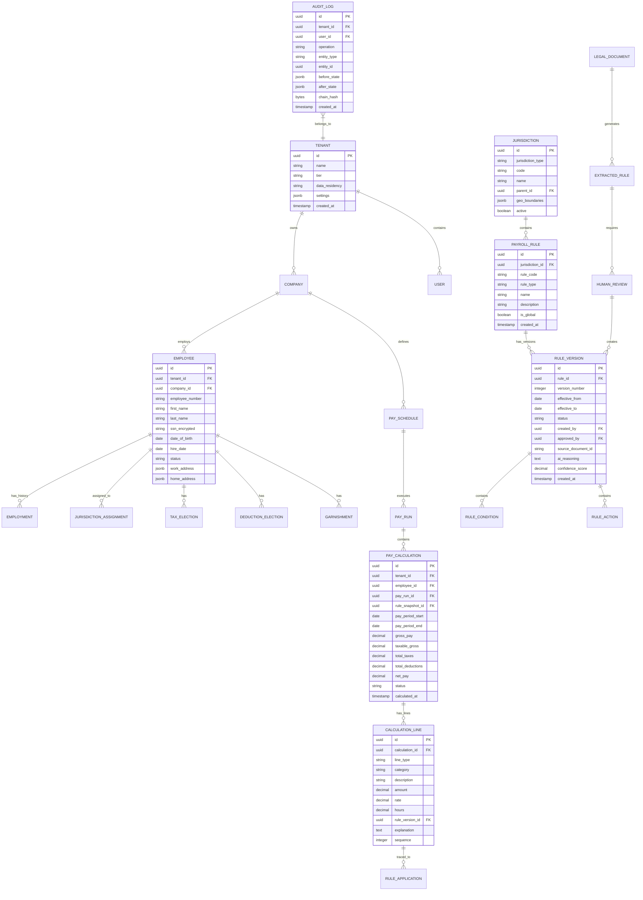

# Low-Level Design

> **Navigation**: [Index](./00-index.md) | [Requirements](./01-requirements-and-estimations.md) | [HLD](./02-high-level-design.md) | **LLD** | [Deep Dive](./04-deep-dive-and-bottlenecks.md) | [Scale](./05-scalability-and-reliability.md) | [Security](./06-security-and-compliance.md) | [Observability](./07-observability.md) | [Interview Guide](./08-interview-guide.md)

---

## 1. Data Model

### 1.1 Entity Relationship Diagram



---

## 2. Core Schema Definitions

### 2.1 Jurisdiction & Rules Schema

```
TABLE jurisdictions (
    id                  UUID PRIMARY KEY,
    jurisdiction_type   ENUM('federal', 'state', 'county', 'city', 'school_district', 'transit', 'country'),
    code                VARCHAR(50) NOT NULL,           -- 'US', 'CA', 'CA-LA', 'NYC'
    name                VARCHAR(255) NOT NULL,
    parent_id           UUID REFERENCES jurisdictions(id),
    country_code        CHAR(2),                        -- ISO 3166-1
    geo_boundaries      JSONB,                          -- GeoJSON polygon
    timezone            VARCHAR(50),
    active              BOOLEAN DEFAULT true,
    created_at          TIMESTAMP WITH TIME ZONE,
    updated_at          TIMESTAMP WITH TIME ZONE
);
-- Index: (jurisdiction_type, code) UNIQUE
-- Index: parent_id for hierarchy queries
-- Index: GIN on geo_boundaries for spatial queries

TABLE payroll_rules (
    id                  UUID PRIMARY KEY,
    jurisdiction_id     UUID REFERENCES jurisdictions(id),
    rule_code           VARCHAR(100) NOT NULL,          -- 'FED_MIN_WAGE', 'CA_OT_DAILY'
    rule_type           ENUM('minimum_wage', 'overtime', 'tax_withholding', 'deduction',
                             'benefit', 'garnishment', 'leave', 'reporting'),
    name                VARCHAR(255) NOT NULL,
    description         TEXT,
    priority            INTEGER DEFAULT 0,              -- Higher = evaluated later
    is_global           BOOLEAN DEFAULT false,          -- Applies to all tenants
    tenant_id           UUID,                           -- NULL for global rules
    created_at          TIMESTAMP WITH TIME ZONE,
    updated_at          TIMESTAMP WITH TIME ZONE
);
-- Index: (jurisdiction_id, rule_type, rule_code)
-- Index: tenant_id for tenant-specific rules

TABLE rule_versions (
    id                  UUID PRIMARY KEY,
    rule_id             UUID REFERENCES payroll_rules(id),
    version_number      INTEGER NOT NULL,
    effective_from      DATE NOT NULL,
    effective_to        DATE,                           -- NULL = currently active
    status              ENUM('draft', 'pending_approval', 'active', 'superseded', 'rejected'),

    -- Source tracking
    source_type         ENUM('ai_extracted', 'manual', 'imported'),
    source_document_id  UUID,
    ai_confidence       DECIMAL(3,2),                   -- 0.00 to 1.00
    ai_reasoning        TEXT,

    -- Approval tracking
    created_by          UUID REFERENCES users(id),
    approved_by         UUID REFERENCES users(id),
    approved_at         TIMESTAMP WITH TIME ZONE,
    rejection_reason    TEXT,

    -- Rule definition (DSL)
    rule_definition     JSONB NOT NULL,                 -- Structured rule DSL

    created_at          TIMESTAMP WITH TIME ZONE
);
-- Index: (rule_id, version_number) UNIQUE
-- Index: (rule_id, status, effective_from) for active rule lookup
-- Constraint: Only one active version per rule at any time

TABLE rule_conditions (
    id                  UUID PRIMARY KEY,
    rule_version_id     UUID REFERENCES rule_versions(id),
    condition_type      VARCHAR(50) NOT NULL,           -- 'employee_type', 'hours_worked', 'wage_threshold'
    field               VARCHAR(100) NOT NULL,          -- 'employee.type', 'calculation.hours_worked'
    operator            VARCHAR(20) NOT NULL,           -- 'eq', 'gt', 'lt', 'gte', 'lte', 'in', 'between'
    value               JSONB NOT NULL,                 -- Flexible value storage
    sequence            INTEGER NOT NULL,               -- Evaluation order
    logical_operator    ENUM('AND', 'OR') DEFAULT 'AND'
);
-- Index: rule_version_id

TABLE rule_actions (
    id                  UUID PRIMARY KEY,
    rule_version_id     UUID REFERENCES rule_versions(id),
    action_type         VARCHAR(50) NOT NULL,           -- 'set_rate', 'multiply', 'add', 'subtract', 'lookup'
    target_field        VARCHAR(100) NOT NULL,          -- 'calculation.federal_tax'
    formula             TEXT,                           -- DSL formula expression
    parameters          JSONB,                          -- Additional parameters
    sequence            INTEGER NOT NULL
);
-- Index: rule_version_id
```

### 2.2 Employee & Payroll Schema

```
TABLE employees (
    id                  UUID PRIMARY KEY,
    tenant_id           UUID REFERENCES tenants(id),
    company_id          UUID REFERENCES companies(id),
    employee_number     VARCHAR(50),

    -- Personal info (sensitive)
    first_name          VARCHAR(100) NOT NULL,
    last_name           VARCHAR(100) NOT NULL,
    ssn_encrypted       BYTEA,                          -- Field-level encrypted
    date_of_birth       DATE,

    -- Employment info
    hire_date           DATE NOT NULL,
    termination_date    DATE,
    status              ENUM('active', 'on_leave', 'terminated'),
    employment_type     ENUM('full_time', 'part_time', 'contractor'),
    flsa_status         ENUM('exempt', 'non_exempt'),

    -- Addresses (for jurisdiction determination)
    work_address        JSONB NOT NULL,                 -- {street, city, state, zip, lat, lng}
    home_address        JSONB NOT NULL,

    -- Banking (sensitive)
    bank_account_encrypted BYTEA,                       -- Field-level encrypted
    routing_number_encrypted BYTEA,

    created_at          TIMESTAMP WITH TIME ZONE,
    updated_at          TIMESTAMP WITH TIME ZONE
);
-- Index: (tenant_id, employee_number) UNIQUE
-- Index: (tenant_id, status) for active employee queries
-- Row-level security: tenant_id = current_tenant()

TABLE jurisdiction_assignments (
    id                  UUID PRIMARY KEY,
    employee_id         UUID REFERENCES employees(id),
    jurisdiction_id     UUID REFERENCES jurisdictions(id),
    assignment_type     ENUM('work', 'residence', 'tax_withhold'),
    effective_from      DATE NOT NULL,
    effective_to        DATE,
    is_primary          BOOLEAN DEFAULT false,
    created_at          TIMESTAMP WITH TIME ZONE
);
-- Index: (employee_id, assignment_type, effective_from)

TABLE tax_elections (
    id                  UUID PRIMARY KEY,
    employee_id         UUID REFERENCES employees(id),
    tax_type            ENUM('federal', 'state', 'local'),
    jurisdiction_id     UUID REFERENCES jurisdictions(id),

    -- W-4 data (federal)
    filing_status       ENUM('single', 'married_filing_jointly', 'married_filing_separately', 'head_of_household'),
    multiple_jobs       BOOLEAN DEFAULT false,
    dependents_amount   DECIMAL(10,2) DEFAULT 0,
    other_income        DECIMAL(10,2) DEFAULT 0,
    deductions          DECIMAL(10,2) DEFAULT 0,
    extra_withholding   DECIMAL(10,2) DEFAULT 0,
    exempt              BOOLEAN DEFAULT false,

    effective_from      DATE NOT NULL,
    effective_to        DATE,
    created_at          TIMESTAMP WITH TIME ZONE
);
-- Index: (employee_id, tax_type, jurisdiction_id, effective_from)

TABLE pay_runs (
    id                  UUID PRIMARY KEY,
    tenant_id           UUID REFERENCES tenants(id),
    company_id          UUID REFERENCES companies(id),
    pay_schedule_id     UUID REFERENCES pay_schedules(id),

    pay_period_start    DATE NOT NULL,
    pay_period_end      DATE NOT NULL,
    pay_date            DATE NOT NULL,

    status              ENUM('draft', 'calculating', 'review', 'approved', 'processing', 'completed', 'failed'),
    rule_snapshot_id    UUID,                           -- Immutable snapshot of rules used

    total_gross         DECIMAL(18,2),
    total_taxes         DECIMAL(18,2),
    total_deductions    DECIMAL(18,2),
    total_net           DECIMAL(18,2),
    employee_count      INTEGER,

    started_at          TIMESTAMP WITH TIME ZONE,
    completed_at        TIMESTAMP WITH TIME ZONE,
    approved_by         UUID REFERENCES users(id),
    approved_at         TIMESTAMP WITH TIME ZONE,

    created_at          TIMESTAMP WITH TIME ZONE
);
-- Index: (tenant_id, status) for active pay runs
-- Index: (tenant_id, pay_date) for historical queries

TABLE pay_calculations (
    id                  UUID PRIMARY KEY,
    tenant_id           UUID REFERENCES tenants(id),
    employee_id         UUID REFERENCES employees(id),
    pay_run_id          UUID REFERENCES pay_runs(id),
    rule_snapshot_id    UUID NOT NULL,                  -- Immutable rule snapshot

    pay_period_start    DATE NOT NULL,
    pay_period_end      DATE NOT NULL,

    -- Amounts (stored as DECIMAL for accuracy)
    gross_pay           DECIMAL(18,4) NOT NULL,
    taxable_gross       DECIMAL(18,4) NOT NULL,
    total_taxes         DECIMAL(18,4) NOT NULL,
    total_deductions    DECIMAL(18,4) NOT NULL,
    net_pay             DECIMAL(18,4) NOT NULL,

    -- YTD tracking
    ytd_gross           DECIMAL(18,4),
    ytd_taxes           DECIMAL(18,4),
    ytd_net             DECIMAL(18,4),

    status              ENUM('draft', 'calculated', 'approved', 'paid', 'voided'),
    explanation_summary TEXT,                           -- AI-generated summary

    calculated_at       TIMESTAMP WITH TIME ZONE,
    created_at          TIMESTAMP WITH TIME ZONE
);
-- Index: (employee_id, pay_period_start)
-- Index: (pay_run_id, status)
-- Partition by: (tenant_id, pay_period_start) RANGE quarterly

TABLE calculation_lines (
    id                  UUID PRIMARY KEY,
    calculation_id      UUID REFERENCES pay_calculations(id),

    line_type           ENUM('earning', 'pre_tax_deduction', 'tax', 'post_tax_deduction', 'garnishment', 'employer_contribution'),
    category            VARCHAR(100) NOT NULL,          -- 'regular_pay', 'federal_income_tax', '401k_employee'
    subcategory         VARCHAR(100),                   -- 'social_security', 'medicare'
    description         TEXT,

    -- Calculation details
    amount              DECIMAL(18,4) NOT NULL,
    rate                DECIMAL(10,6),                  -- Tax rate or hourly rate
    hours               DECIMAL(10,2),                  -- If applicable
    base_amount         DECIMAL(18,4),                  -- Amount rate was applied to

    -- Traceability
    rule_version_id     UUID REFERENCES rule_versions(id),
    explanation         TEXT NOT NULL,                  -- Human-readable explanation
    calculation_details JSONB,                          -- Detailed calculation breakdown

    sequence            INTEGER NOT NULL,               -- Display order
    created_at          TIMESTAMP WITH TIME ZONE
);
-- Index: (calculation_id, line_type)
-- Index: rule_version_id for rule impact analysis
```

### 2.3 AI & Legal Document Schema

```
TABLE legal_documents (
    id                  UUID PRIMARY KEY,
    tenant_id           UUID,                           -- NULL for global documents

    document_type       ENUM('federal_law', 'state_law', 'local_ordinance', 'regulation',
                             'irs_publication', 'collective_agreement', 'company_policy'),
    jurisdiction_id     UUID REFERENCES jurisdictions(id),

    title               VARCHAR(500) NOT NULL,
    source_url          VARCHAR(2000),
    source_agency       VARCHAR(255),

    publication_date    DATE,
    effective_date      DATE,

    -- Document content
    content_type        VARCHAR(50),                    -- 'application/pdf', 'text/html'
    content_hash        CHAR(64) NOT NULL,              -- SHA-256 for deduplication
    storage_path        VARCHAR(500),                   -- Path in document store

    -- Processing status
    status              ENUM('ingested', 'processing', 'extracted', 'reviewed', 'archived'),
    processing_started  TIMESTAMP WITH TIME ZONE,
    processing_completed TIMESTAMP WITH TIME ZONE,

    created_at          TIMESTAMP WITH TIME ZONE
);
-- Index: content_hash UNIQUE for deduplication
-- Index: (jurisdiction_id, document_type, status)

TABLE extracted_rules (
    id                  UUID PRIMARY KEY,
    document_id         UUID REFERENCES legal_documents(id),

    -- Extraction metadata
    extraction_model    VARCHAR(100),                   -- Model version used
    extraction_timestamp TIMESTAMP WITH TIME ZONE,

    -- Extracted content
    source_text         TEXT NOT NULL,                  -- Original text from document
    source_section      VARCHAR(255),                   -- Section/paragraph reference
    source_page         INTEGER,

    -- Structured extraction
    extracted_rule      JSONB NOT NULL,                 -- Structured rule in DSL format
    rule_type_inferred  VARCHAR(50),                    -- AI-inferred rule type
    jurisdiction_inferred UUID,                         -- AI-inferred jurisdiction
    effective_date_inferred DATE,

    -- Confidence & reasoning
    confidence_score    DECIMAL(3,2) NOT NULL,          -- 0.00 to 1.00
    ai_reasoning        TEXT NOT NULL,                  -- Explanation of extraction
    uncertainty_flags   JSONB,                          -- Specific uncertainties

    -- Review status
    review_status       ENUM('pending', 'in_review', 'approved', 'modified', 'rejected'),
    reviewed_by         UUID REFERENCES users(id),
    review_notes        TEXT,
    reviewed_at         TIMESTAMP WITH TIME ZONE,

    -- Link to created rule (if approved)
    created_rule_version_id UUID REFERENCES rule_versions(id),

    created_at          TIMESTAMP WITH TIME ZONE
);
-- Index: (document_id, review_status)
-- Index: (confidence_score) for prioritizing reviews

TABLE regulatory_changes (
    id                  UUID PRIMARY KEY,
    jurisdiction_id     UUID REFERENCES jurisdictions(id),

    change_type         ENUM('new_law', 'amendment', 'rate_change', 'deadline_change', 'repeal'),
    detected_at         TIMESTAMP WITH TIME ZONE,
    source_url          VARCHAR(2000),

    title               VARCHAR(500),
    summary             TEXT,
    effective_date      DATE,

    -- Impact assessment
    affected_rule_types JSONB,                          -- Array of affected rule types
    estimated_impact    ENUM('low', 'medium', 'high', 'critical'),

    -- Processing
    status              ENUM('detected', 'triaged', 'processing', 'completed', 'dismissed'),
    assigned_to         UUID REFERENCES users(id),
    document_id         UUID REFERENCES legal_documents(id),

    created_at          TIMESTAMP WITH TIME ZONE
);
-- Index: (jurisdiction_id, status)
-- Index: (effective_date, status) for upcoming changes
```

---

## 3. Core Algorithms

### 3.1 Rule Extraction from Legal Document

```
ALGORITHM: ExtractPayrollRulesFromDocument

INPUT:
  - document: LegalDocument (PDF or text)
  - jurisdiction: Jurisdiction context

OUTPUT:
  - extracted_rules: List<ExtractedRule> with confidence scores

PSEUDOCODE:

FUNCTION extract_payroll_rules(document, jurisdiction):
    extracted_rules = []

    // ============================================
    // PHASE 1: Document Preprocessing
    // ============================================

    IF document.content_type == 'application/pdf':
        text = ocr_service.extract_text(document.content)
        layout = ocr_service.detect_layout(document.content)
    ELSE:
        text = document.content
        layout = NULL

    // Clean and normalize text
    text = normalize_text(text)
    text = remove_headers_footers(text, layout)

    // ============================================
    // PHASE 2: Section Segmentation
    // ============================================

    sections = segment_by_legal_structure(text)
    // Identifies: chapters, sections, subsections, paragraphs
    // Uses patterns like "Section 1.", "§ 123", "(a)", "(1)"

    FOR section IN sections:
        section.hierarchy = determine_hierarchy(section)
        section.context = get_surrounding_context(section, sections)

    // ============================================
    // PHASE 3: Named Entity Recognition
    // ============================================

    FOR section IN sections:
        entities = ner_model.extract(section.text)

        // Payroll-specific entities:
        // - WAGE_AMOUNT: "$15.00", "minimum wage"
        // - TIME_PERIOD: "per hour", "weekly", "annually"
        // - EMPLOYEE_CATEGORY: "exempt", "non-exempt", "part-time"
        // - THRESHOLD: "40 hours", "50 employees"
        // - MULTIPLIER: "1.5 times", "double"
        // - JURISDICTION: "California", "New York City"
        // - EFFECTIVE_DATE: "January 1, 2026"
        // - EXCEPTION: "except", "excluding", "unless"

        section.entities = entities

    // ============================================
    // PHASE 4: Payroll Relevance Classification
    // ============================================

    payroll_sections = []

    FOR section IN sections:
        classification = classifier.predict(section.text, section.entities)

        // Classification categories:
        // - WAGE_REQUIREMENT: Minimum wage, pay frequency
        // - OVERTIME_RULE: OT thresholds, rates
        // - TAX_PROVISION: Withholding, rates, bases
        // - DEDUCTION_RULE: Allowed/required deductions
        // - LEAVE_PROVISION: PTO, sick leave, FMLA
        // - REPORTING_REQUIREMENT: Filing deadlines
        // - NOT_PAYROLL: Non-relevant section

        IF classification.category != 'NOT_PAYROLL':
            section.payroll_category = classification.category
            section.relevance_score = classification.confidence
            payroll_sections.append(section)

    // Sort by relevance for processing priority
    payroll_sections = sort_by_relevance(payroll_sections)

    // ============================================
    // PHASE 5: LLM Rule Extraction
    // ============================================

    FOR section IN payroll_sections:
        prompt = build_extraction_prompt(section, jurisdiction)

        response = llm.generate(
            system_prompt = RULE_EXTRACTION_SYSTEM_PROMPT,
            user_prompt = prompt,
            output_schema = PAYROLL_RULE_SCHEMA,
            temperature = 0.1,  // Low for determinism
            max_tokens = 2000
        )

        // Parse structured response
        rules = parse_llm_response(response)

        FOR rule IN rules:
            // Validate structure
            IF NOT validate_rule_structure(rule):
                CONTINUE

            // Calculate confidence
            rule.confidence = calculate_confidence(
                extraction_confidence = response.confidence,
                entity_coverage = count_matched_entities(rule, section.entities),
                structural_quality = assess_rule_quality(rule),
                jurisdiction_match = verify_jurisdiction(rule, jurisdiction)
            )

            // Add source tracing
            rule.source_text = section.text
            rule.source_section = section.reference
            rule.source_page = section.page_number
            rule.ai_reasoning = response.reasoning

            extracted_rules.append(rule)

    // ============================================
    // PHASE 6: Post-Processing
    // ============================================

    // Deduplicate similar rules
    extracted_rules = deduplicate_rules(extracted_rules)

    // Resolve conflicts between rules
    extracted_rules = resolve_extraction_conflicts(extracted_rules)

    // Flag low-confidence extractions
    FOR rule IN extracted_rules:
        IF rule.confidence < 0.7:
            rule.flags.append('LOW_CONFIDENCE')
        IF has_ambiguous_language(rule):
            rule.flags.append('AMBIGUOUS_LANGUAGE')

    RETURN extracted_rules


FUNCTION build_extraction_prompt(section, jurisdiction):
    RETURN """
    You are a payroll compliance expert extracting rules from legal documents.

    JURISDICTION: {jurisdiction.name} ({jurisdiction.code})
    DOCUMENT SECTION: {section.reference}

    TEXT:
    ---
    {section.text}
    ---

    IDENTIFIED ENTITIES:
    {format_entities(section.entities)}

    PARENT CONTEXT:
    {section.context}

    TASK:
    Extract all payroll rules from this section. For each rule, provide:

    1. RULE_TYPE: One of [minimum_wage, overtime, tax_withholding, deduction, benefit, garnishment, leave, reporting]

    2. CONDITIONS: When does this rule apply?
       - Employee type (exempt/non-exempt, full-time/part-time)
       - Thresholds (hours, wages, employee count)
       - Time periods (daily, weekly, pay period)
       - Exceptions

    3. ACTIONS: What does this rule require?
       - Rate/amount
       - Calculation method
       - Formula if applicable

    4. EFFECTIVE_DATE: When does this take effect?

    5. REASONING: Explain why you extracted this rule and your confidence level.

    OUTPUT FORMAT: JSON array of rules following the schema.

    IMPORTANT:
    - Only extract explicit rules, not implied ones
    - Note any ambiguity or uncertainty
    - Cross-reference with identified entities
    - If no payroll rules exist, return empty array
    """


FUNCTION calculate_confidence(extraction_confidence, entity_coverage, structural_quality, jurisdiction_match):
    // Weighted scoring
    weights = {
        extraction_confidence: 0.4,
        entity_coverage: 0.25,
        structural_quality: 0.25,
        jurisdiction_match: 0.1
    }

    score = (
        extraction_confidence * weights.extraction_confidence +
        entity_coverage * weights.entity_coverage +
        structural_quality * weights.structural_quality +
        jurisdiction_match * weights.jurisdiction_match
    )

    RETURN ROUND(score, 2)


TIME COMPLEXITY: O(n × m) where n = sections, m = avg extraction time per section
SPACE COMPLEXITY: O(n) for storing sections and extracted rules
```

### 3.2 Gross-to-Net Calculation

```
ALGORITHM: CalculateGrossToNet

INPUT:
  - employee: Employee record
  - pay_period: PayPeriod (start_date, end_date)
  - earnings: List<Earning> (hours, rates, bonuses)
  - rule_snapshot: ImmutableRuleSnapshot

OUTPUT:
  - calculation: PayCalculation with all lines and explanations

PSEUDOCODE:

FUNCTION calculate_gross_to_net(employee, pay_period, earnings, rule_snapshot):
    calculation = new PayCalculation()
    calculation.employee_id = employee.id
    calculation.pay_period = pay_period
    calculation.rule_snapshot_id = rule_snapshot.id

    // Get YTD totals for wage base limits
    ytd = get_ytd_totals(employee, pay_period.year)

    // Get applicable jurisdictions for this employee
    jurisdictions = resolve_jurisdictions(employee, pay_period.end_date)

    // ============================================
    // STEP 1: Calculate Gross Pay
    // ============================================

    gross_lines = []

    FOR earning IN earnings:
        SWITCH earning.type:
            CASE 'regular':
                amount = earning.hours * earning.rate
                explanation = "Regular pay: {hours} hours × ${rate}/hour"

            CASE 'overtime':
                ot_rules = get_rules(rule_snapshot, jurisdictions, 'overtime')
                ot_rate = calculate_ot_rate(earning.rate, ot_rules)
                amount = earning.hours * ot_rate
                explanation = "Overtime: {hours} hours × ${ot_rate}/hour (1.5× regular rate per {rule.citation})"

            CASE 'salary':
                periods_per_year = get_pay_frequency_periods(employee.pay_schedule)
                amount = earning.annual_salary / periods_per_year
                explanation = "Salary: ${annual} annual ÷ {periods} pay periods"

            CASE 'bonus':
                amount = earning.amount
                explanation = "Bonus: ${amount}"

            CASE 'commission':
                amount = earning.amount
                explanation = "Commission: ${amount}"

        gross_lines.append(CalculationLine(
            type = 'earning',
            category = earning.type,
            amount = ROUND(amount, 2),
            hours = earning.hours,
            rate = earning.rate,
            explanation = explanation
        ))

    calculation.gross_pay = SUM(gross_lines.amount)
    calculation.lines.extend(gross_lines)

    // ============================================
    // STEP 2: Pre-Tax Deductions
    // ============================================

    pre_tax_deductions = []

    FOR election IN employee.deduction_elections WHERE election.is_pre_tax:
        rules = get_rules(rule_snapshot, jurisdictions, 'deduction', election.type)

        amount = calculate_deduction(
            election = election,
            gross_pay = calculation.gross_pay,
            ytd = ytd,
            rules = rules
        )

        // Check annual limits (e.g., 401k $23,000 for 2024)
        IF election.type == '401k':
            remaining_limit = rules.annual_limit - ytd.contrib_401k
            amount = MIN(amount, remaining_limit)
            IF amount < election.amount:
                explanation += " (limited by annual maximum)"

        pre_tax_deductions.append(CalculationLine(
            type = 'pre_tax_deduction',
            category = election.type,
            amount = ROUND(amount, 2),
            rule_version_id = rules[0].id,
            explanation = generate_deduction_explanation(election, amount, rules)
        ))

    calculation.lines.extend(pre_tax_deductions)
    calculation.taxable_gross = calculation.gross_pay - SUM(pre_tax_deductions.amount)

    // ============================================
    // STEP 3: Federal Income Tax
    // ============================================

    federal_rules = get_rules(rule_snapshot, 'FEDERAL', 'tax_withholding', 'income')
    w4 = employee.tax_elections.get('federal')

    federal_tax = calculate_federal_withholding(
        taxable_gross = calculation.taxable_gross,
        pay_frequency = employee.pay_schedule.frequency,
        filing_status = w4.filing_status,
        dependents_credit = w4.dependents_amount,
        other_income = w4.other_income,
        deductions = w4.deductions,
        extra_withholding = w4.extra_withholding,
        exempt = w4.exempt,
        rules = federal_rules
    )

    calculation.lines.append(CalculationLine(
        type = 'tax',
        category = 'federal_income_tax',
        amount = ROUND(federal_tax.amount, 2),
        rate = federal_tax.effective_rate,
        base_amount = calculation.taxable_gross,
        rule_version_id = federal_rules[0].id,
        explanation = federal_tax.explanation,
        calculation_details = federal_tax.breakdown
    ))

    // ============================================
    // STEP 4: FICA Taxes (Social Security + Medicare)
    // ============================================

    fica_rules = get_rules(rule_snapshot, 'FEDERAL', 'tax_withholding', 'fica')

    // Social Security (6.2% up to wage base)
    ss_wage_base = fica_rules.social_security_wage_base  // e.g., $168,600 for 2024
    ss_rate = fica_rules.social_security_rate            // 6.2%

    ytd_ss_wages = ytd.social_security_wages
    remaining_ss_base = MAX(0, ss_wage_base - ytd_ss_wages)
    ss_taxable = MIN(calculation.taxable_gross, remaining_ss_base)
    ss_amount = ss_taxable * ss_rate

    calculation.lines.append(CalculationLine(
        type = 'tax',
        category = 'social_security',
        amount = ROUND(ss_amount, 2),
        rate = ss_rate,
        base_amount = ss_taxable,
        rule_version_id = fica_rules[0].id,
        explanation = generate_ss_explanation(ss_taxable, ss_rate, ytd_ss_wages, ss_wage_base)
    ))

    // Medicare (1.45% + 0.9% additional over $200K)
    medicare_rate = fica_rules.medicare_rate            // 1.45%
    additional_medicare_rate = fica_rules.additional_medicare_rate  // 0.9%
    additional_medicare_threshold = fica_rules.additional_medicare_threshold  // $200,000

    medicare_base = calculation.taxable_gross * medicare_rate

    // Additional Medicare Tax
    ytd_wages_for_additional = ytd.gross + calculation.taxable_gross
    IF ytd_wages_for_additional > additional_medicare_threshold:
        wages_over_threshold = ytd_wages_for_additional - additional_medicare_threshold
        additional_this_period = MIN(wages_over_threshold, calculation.taxable_gross)
        additional_medicare = additional_this_period * additional_medicare_rate
    ELSE:
        additional_medicare = 0

    total_medicare = medicare_base + additional_medicare

    calculation.lines.append(CalculationLine(
        type = 'tax',
        category = 'medicare',
        amount = ROUND(total_medicare, 2),
        rate = medicare_rate,
        base_amount = calculation.taxable_gross,
        explanation = generate_medicare_explanation(calculation.taxable_gross, medicare_rate, additional_medicare)
    ))

    // ============================================
    // STEP 5: State Income Tax
    // ============================================

    FOR state IN jurisdictions.states:
        state_rules = get_rules(rule_snapshot, state, 'tax_withholding', 'income')
        state_election = employee.tax_elections.get(state.code)

        IF state_rules.has_income_tax:
            state_tax = calculate_state_withholding(
                taxable_gross = calculation.taxable_gross,
                state = state,
                election = state_election,
                rules = state_rules,
                federal_tax = federal_tax.amount
            )

            calculation.lines.append(CalculationLine(
                type = 'tax',
                category = 'state_income_tax_' + state.code,
                amount = ROUND(state_tax.amount, 2),
                rate = state_tax.effective_rate,
                base_amount = state_tax.taxable_wages,
                rule_version_id = state_rules[0].id,
                explanation = state_tax.explanation
            ))

    // ============================================
    // STEP 6: Local Taxes
    // ============================================

    FOR locality IN jurisdictions.localities:
        local_rules = get_rules(rule_snapshot, locality, 'tax_withholding')

        IF local_rules.exists:
            local_tax = calculate_local_tax(
                taxable_gross = calculation.taxable_gross,
                locality = locality,
                rules = local_rules
            )

            calculation.lines.append(CalculationLine(
                type = 'tax',
                category = 'local_tax_' + locality.code,
                amount = ROUND(local_tax.amount, 2),
                rate = local_tax.rate,
                explanation = local_tax.explanation
            ))

    // ============================================
    // STEP 7: Post-Tax Deductions
    // ============================================

    FOR election IN employee.deduction_elections WHERE NOT election.is_pre_tax:
        amount = calculate_post_tax_deduction(election, calculation.gross_pay)

        calculation.lines.append(CalculationLine(
            type = 'post_tax_deduction',
            category = election.type,
            amount = ROUND(amount, 2),
            explanation = "Post-tax {type}: ${amount}"
        ))

    // ============================================
    // STEP 8: Garnishments (Priority Order)
    // ============================================

    IF employee.garnishments.exists:
        garnishment_rules = get_rules(rule_snapshot, jurisdictions, 'garnishment')

        // Calculate disposable income
        disposable = calculate_disposable_income(
            gross = calculation.gross_pay,
            mandatory_deductions = SUM(tax_lines.amount) + SUM(required_deductions.amount),
            rules = garnishment_rules
        )

        // Apply garnishments in priority order
        // 1. Tax levies (IRS, state)
        // 2. Child support
        // 3. Alimony
        // 4. Federal student loans
        // 5. Creditor garnishments

        remaining_disposable = disposable

        FOR garnishment IN employee.garnishments ORDER BY garnishment.priority:
            max_garnishment = calculate_max_garnishment(
                disposable = remaining_disposable,
                garnishment_type = garnishment.type,
                rules = garnishment_rules
            )

            amount = MIN(garnishment.amount_per_period, max_garnishment)
            remaining_disposable -= amount

            calculation.lines.append(CalculationLine(
                type = 'garnishment',
                category = garnishment.type,
                amount = ROUND(amount, 2),
                explanation = generate_garnishment_explanation(garnishment, amount, max_garnishment)
            ))

    // ============================================
    // STEP 9: Calculate Net Pay
    // ============================================

    total_taxes = SUM(calculation.lines WHERE type == 'tax')
    total_deductions = SUM(calculation.lines WHERE type IN ('pre_tax_deduction', 'post_tax_deduction', 'garnishment'))

    calculation.total_taxes = total_taxes
    calculation.total_deductions = total_deductions
    calculation.net_pay = calculation.gross_pay - total_taxes - total_deductions

    // ============================================
    // STEP 10: Generate Summary Explanation
    // ============================================

    calculation.explanation_summary = generate_pay_summary(calculation)

    // ============================================
    // STEP 11: Create Audit Record
    // ============================================

    audit_record = create_audit_record(
        calculation = calculation,
        rule_snapshot = rule_snapshot,
        employee = employee
    )

    RETURN calculation


FUNCTION calculate_federal_withholding(taxable_gross, pay_frequency, filing_status, ...):
    // Using IRS percentage method (2020+ W-4)

    // Step 1: Adjust to annual
    periods_per_year = get_periods(pay_frequency)
    annual_wages = taxable_gross * periods_per_year

    // Step 2: Adjust for other income and deductions
    adjusted_annual = annual_wages + other_income - deductions

    // Step 3: Apply dependents credit
    adjusted_annual -= dependents_credit

    // Step 4: Calculate tentative withholding from tax brackets
    brackets = federal_rules.brackets[filing_status]
    annual_tax = 0

    remaining = adjusted_annual
    FOR bracket IN brackets:
        IF remaining <= 0:
            BREAK
        taxable_in_bracket = MIN(remaining, bracket.upper - bracket.lower)
        annual_tax += taxable_in_bracket * bracket.rate
        remaining -= taxable_in_bracket

    // Step 5: Convert back to pay period
    period_tax = annual_tax / periods_per_year

    // Step 6: Add extra withholding
    period_tax += extra_withholding

    // Generate explanation
    explanation = """
    Federal Income Tax Calculation:
    1. Gross wages this period: ${taxable_gross}
    2. Annualized wages: ${annual_wages}
    3. Adjusted for credits: ${adjusted_annual}
    4. Annual tax (IRS tables): ${annual_tax}
    5. Per-period tax: ${period_tax}
    Filing status: {filing_status}
    """

    RETURN {
        amount: MAX(0, period_tax),
        effective_rate: period_tax / taxable_gross,
        explanation: explanation,
        breakdown: { brackets used, rates applied }
    }


TIME COMPLEXITY: O(j × r) where j = jurisdictions, r = rules per jurisdiction
SPACE COMPLEXITY: O(l) where l = number of calculation lines
```

### 3.3 Jurisdiction Resolution

```
ALGORITHM: ResolveApplicableJurisdictions

INPUT:
  - employee: Employee with work and home addresses
  - effective_date: Date for rule lookup

OUTPUT:
  - jurisdictions: Structured jurisdiction set with applicable rules

PSEUDOCODE:

FUNCTION resolve_jurisdictions(employee, effective_date):
    result = new JurisdictionSet()

    // ============================================
    // STEP 1: Resolve Work Location Jurisdictions
    // ============================================

    work_address = get_effective_address(employee.work_address, effective_date)

    // Geocode to lat/lng if not already
    IF NOT work_address.has_coordinates:
        work_address = geocode(work_address)

    // Query tax shapefiles for jurisdictions
    work_jurisdictions = query_tax_shapefiles(work_address.lat, work_address.lng)

    // Returns hierarchy:
    // - Country (US)
    // - State (CA)
    // - County (Los Angeles)
    // - City (Los Angeles)
    // - School District
    // - Transit District
    // - Special Districts

    result.work_state = work_jurisdictions.state
    result.work_localities = work_jurisdictions.localities

    // ============================================
    // STEP 2: Resolve Residence Jurisdictions
    // ============================================

    home_address = get_effective_address(employee.home_address, effective_date)

    IF NOT home_address.has_coordinates:
        home_address = geocode(home_address)

    home_jurisdictions = query_tax_shapefiles(home_address.lat, home_address.lng)

    result.residence_state = home_jurisdictions.state
    result.residence_localities = home_jurisdictions.localities

    // ============================================
    // STEP 3: Check Reciprocity Agreements
    // ============================================

    IF result.work_state != result.residence_state:
        reciprocity = check_reciprocity_agreement(
            work_state = result.work_state,
            residence_state = result.residence_state
        )

        IF reciprocity.exists:
            // Employee only withholds in residence state
            result.reciprocity = reciprocity
            result.state_withholding = [result.residence_state]
            result.explanation = """
                Reciprocity agreement between {work_state} and {residence_state}.
                Income tax withheld only for {residence_state}.
            """
        ELSE:
            // May need to withhold in both states
            result.state_withholding = [result.work_state, result.residence_state]
            result.explanation = """
                No reciprocity. Work state ({work_state}) withholding required.
                May need to file in residence state ({residence_state}).
            """
    ELSE:
        result.state_withholding = [result.work_state]

    // ============================================
    // STEP 4: Resolve Multi-State Workers
    // ============================================

    IF employee.is_multi_state:
        // Employee works in multiple states (e.g., traveling salesperson)
        FOR work_allocation IN employee.state_allocations:
            state_jurisdictions = query_by_state(work_allocation.state)

            result.additional_states.append({
                state: state_jurisdictions.state,
                allocation_percent: work_allocation.percent,
                days_worked: work_allocation.days
            })

        // Some states have day thresholds for nexus
        FOR state IN result.additional_states:
            IF state.days_worked >= get_nexus_threshold(state):
                result.state_withholding.append(state)

    // ============================================
    // STEP 5: Determine Tax Types by Jurisdiction
    // ============================================

    result.federal = FEDERAL_JURISDICTION

    FOR jurisdiction IN result.all_jurisdictions:
        jurisdiction.applicable_taxes = []

        IF jurisdiction.has_income_tax:
            jurisdiction.applicable_taxes.append('income')
        IF jurisdiction.has_local_tax:
            jurisdiction.applicable_taxes.append('local')
        IF jurisdiction.has_transit_tax:
            jurisdiction.applicable_taxes.append('transit')
        IF jurisdiction.has_school_tax:
            jurisdiction.applicable_taxes.append('school')
        IF jurisdiction.has_sdi:
            jurisdiction.applicable_taxes.append('disability')
        IF jurisdiction.has_pfl:
            jurisdiction.applicable_taxes.append('paid_family_leave')

    // ============================================
    // STEP 6: Build Rule Priority Order
    // ============================================

    // For minimum wage: Use highest (most favorable to employee)
    // For overtime: Use most restrictive (most protective)
    // For taxes: Apply all applicable

    result.rule_priority = build_priority_order(result.all_jurisdictions)

    RETURN result


FUNCTION check_reciprocity_agreement(work_state, residence_state):
    // Known reciprocity agreements (as of 2024)
    reciprocity_map = {
        'DC': ['MD', 'VA'],
        'IL': ['IA', 'KY', 'MI', 'WI'],
        'IN': ['KY', 'MI', 'OH', 'PA', 'WI'],
        'IA': ['IL'],
        'KY': ['IL', 'IN', 'MI', 'OH', 'VA', 'WV', 'WI'],
        'MD': ['DC', 'PA', 'VA', 'WV'],
        'MI': ['IL', 'IN', 'KY', 'MN', 'OH', 'WI'],
        'MN': ['MI', 'ND'],
        'MT': ['ND'],
        'NJ': ['PA'],
        'ND': ['MN', 'MT'],
        'OH': ['IN', 'KY', 'MI', 'PA', 'WV'],
        'PA': ['IN', 'MD', 'NJ', 'OH', 'VA', 'WV'],
        'VA': ['DC', 'KY', 'MD', 'PA', 'WV'],
        'WV': ['KY', 'MD', 'OH', 'PA', 'VA'],
        'WI': ['IL', 'IN', 'KY', 'MI']
    }

    IF work_state IN reciprocity_map:
        IF residence_state IN reciprocity_map[work_state]:
            RETURN {
                exists: TRUE,
                work_state: work_state,
                residence_state: residence_state,
                withhold_in: residence_state
            }

    RETURN { exists: FALSE }


TIME COMPLEXITY: O(j) where j = number of jurisdictions
SPACE COMPLEXITY: O(j) for jurisdiction data
```

---

## 4. API Design

### 4.1 Payroll Calculation APIs

```
// ============================================
// Calculate Gross-to-Net (Preview)
// ============================================

POST /api/v1/payroll/calculate

Request:
{
    "employee_id": "uuid",
    "pay_period_start": "2025-01-01",
    "pay_period_end": "2025-01-15",
    "earnings": [
        {
            "type": "regular",
            "hours": 80.0,
            "rate": 50.00
        },
        {
            "type": "overtime",
            "hours": 5.0,
            "rate": 50.00
        },
        {
            "type": "bonus",
            "amount": 500.00
        }
    ],
    "options": {
        "include_explanation": true,
        "include_breakdown": true
    }
}

Response:
{
    "calculation_id": "calc-uuid",
    "status": "calculated",
    "employee_id": "uuid",
    "pay_period": {
        "start": "2025-01-01",
        "end": "2025-01-15"
    },
    "summary": {
        "gross_pay": 4875.00,
        "taxable_gross": 4387.50,
        "total_taxes": 1156.23,
        "total_deductions": 487.50,
        "net_pay": 3231.27
    },
    "lines": [
        {
            "type": "earning",
            "category": "regular",
            "amount": 4000.00,
            "hours": 80.0,
            "rate": 50.00,
            "explanation": "Regular pay: 80 hours × $50.00/hour"
        },
        {
            "type": "earning",
            "category": "overtime",
            "amount": 375.00,
            "hours": 5.0,
            "rate": 75.00,
            "explanation": "Overtime: 5 hours × $75.00/hour (1.5× rate per CA Labor Code §510)"
        },
        {
            "type": "pre_tax_deduction",
            "category": "401k",
            "amount": 487.50,
            "explanation": "401(k) contribution: 10% of gross ($4,875.00 × 10%)"
        },
        {
            "type": "tax",
            "category": "federal_income_tax",
            "amount": 612.50,
            "rate": 0.14,
            "explanation": "Federal income tax: $4,387.50 taxable wages, 14% effective rate (22% marginal bracket)"
        },
        {
            "type": "tax",
            "category": "social_security",
            "amount": 271.83,
            "rate": 0.062,
            "explanation": "Social Security: $4,387.50 × 6.2%"
        },
        {
            "type": "tax",
            "category": "medicare",
            "amount": 63.62,
            "rate": 0.0145,
            "explanation": "Medicare: $4,387.50 × 1.45%"
        },
        {
            "type": "tax",
            "category": "state_income_tax_CA",
            "amount": 208.28,
            "rate": 0.0475,
            "explanation": "California state income tax: $4,387.50 taxable, 4.75% effective rate"
        }
    ],
    "explanation_summary": "Your gross pay of $4,875.00 includes regular earnings ($4,000), overtime ($375 at 1.5× rate), and a bonus ($500). After your 401(k) contribution of $487.50 (10%), your taxable wages are $4,387.50. Federal and state taxes total $1,156.23, resulting in net pay of $3,231.27.",
    "rule_snapshot_id": "snapshot-uuid",
    "calculated_at": "2025-01-10T14:30:00Z"
}


// ============================================
// Get Calculation Explanation
// ============================================

GET /api/v1/payroll/calculations/{calculation_id}/explain

Response:
{
    "calculation_id": "calc-uuid",
    "employee_name": "John Doe",
    "pay_period": "January 1-15, 2025",
    "explanation": {
        "summary": "Your take-home pay for this period is $3,231.27...",
        "sections": [
            {
                "title": "Earnings",
                "content": "You earned $4,875.00 gross this period...",
                "lines": [...]
            },
            {
                "title": "Pre-Tax Deductions",
                "content": "Your pre-tax 401(k) contribution of $487.50 reduces your taxable income...",
                "lines": [...]
            },
            {
                "title": "Taxes",
                "content": "Based on your W-4 elections and California residency...",
                "lines": [...]
            }
        ],
        "faqs": [
            {
                "question": "Why did my federal tax increase?",
                "answer": "Your overtime pushed you into a higher tax bracket for this period..."
            }
        ]
    },
    "rules_applied": [
        {
            "rule_code": "CA_OT_DAILY",
            "description": "California daily overtime (>8 hours)",
            "citation": "CA Labor Code §510"
        }
    ]
}
```

### 4.2 Rule Management APIs

```
// ============================================
// Extract Rules from Document
// ============================================

POST /api/v1/rules/extract

Request:
{
    "document_url": "https://leginfo.ca.gov/...",
    "document_type": "state_law",
    "jurisdiction_code": "CA",
    "options": {
        "priority": "high",
        "notify_on_complete": true
    }
}

Response:
{
    "extraction_id": "extract-uuid",
    "status": "queued",
    "estimated_completion": "2025-01-10T15:00:00Z",
    "webhook_url": "https://api.example.com/webhooks/extraction"
}


// ============================================
// Get Pending Rule Approvals
// ============================================

GET /api/v1/rules/pending-approval?jurisdiction=CA&rule_type=minimum_wage

Response:
{
    "pending_rules": [
        {
            "id": "rule-uuid",
            "rule_code": "CA_MIN_WAGE_2026",
            "jurisdiction": "California",
            "rule_type": "minimum_wage",
            "effective_date": "2026-01-01",
            "source": {
                "document_id": "doc-uuid",
                "document_title": "SB 123 - Minimum Wage Adjustment",
                "section": "Section 3(a)",
                "page": 5
            },
            "extracted_rule": {
                "conditions": [
                    {"field": "jurisdiction", "operator": "eq", "value": "CA"},
                    {"field": "employer_size", "operator": "gte", "value": 26}
                ],
                "actions": [
                    {"action": "set_minimum_wage", "value": 16.50, "unit": "per_hour"}
                ]
            },
            "ai_confidence": 0.94,
            "ai_reasoning": "Section 3(a) explicitly states 'The minimum wage for employers with 26 or more employees shall be $16.50 per hour effective January 1, 2026.' This matches the pattern of previous CA minimum wage legislation.",
            "flags": [],
            "created_at": "2025-01-05T10:00:00Z"
        }
    ],
    "pagination": {
        "total": 15,
        "page": 1,
        "per_page": 20
    }
}


// ============================================
// Approve/Reject Rule
// ============================================

POST /api/v1/rules/{rule_id}/review

Request:
{
    "action": "approve",  // or "modify" or "reject"
    "modifications": null,  // Required if action is "modify"
    "notes": "Verified against official legislative record. Effective date confirmed.",
    "effective_date_override": null  // Optional override
}

Response:
{
    "rule_id": "rule-uuid",
    "status": "active",
    "version": 1,
    "approved_by": "user-uuid",
    "approved_at": "2025-01-10T16:00:00Z",
    "notes": "Verified against official legislative record."
}


// ============================================
// Get Rules for Jurisdiction
// ============================================

GET /api/v1/rules?jurisdiction=CA&rule_type=overtime&effective_date=2025-01-15

Response:
{
    "rules": [
        {
            "id": "rule-uuid",
            "rule_code": "CA_OT_DAILY",
            "name": "California Daily Overtime",
            "jurisdiction": "CA",
            "type": "overtime",
            "effective_from": "2000-01-01",
            "version": 3,
            "conditions": [
                {"field": "hours_worked_day", "operator": "gt", "value": 8}
            ],
            "actions": [
                {"action": "multiply_rate", "value": 1.5, "for_hours_over": 8}
            ],
            "citation": "CA Labor Code §510",
            "explanation": "Employees earn 1.5× their regular rate for hours worked beyond 8 in a workday."
        },
        {
            "id": "rule-uuid-2",
            "rule_code": "CA_OT_DOUBLE",
            "name": "California Double Overtime",
            "conditions": [
                {"field": "hours_worked_day", "operator": "gt", "value": 12}
            ],
            "actions": [
                {"action": "multiply_rate", "value": 2.0, "for_hours_over": 12}
            ]
        }
    ]
}
```

### 4.3 Pay Run APIs

```
// ============================================
// Create Pay Run
// ============================================

POST /api/v1/pay-runs

Request:
{
    "company_id": "company-uuid",
    "pay_schedule_id": "schedule-uuid",
    "pay_period_start": "2025-01-01",
    "pay_period_end": "2025-01-15",
    "pay_date": "2025-01-20"
}

Response:
{
    "pay_run_id": "run-uuid",
    "status": "draft",
    "employee_count": 150,
    "created_at": "2025-01-10T10:00:00Z"
}


// ============================================
// Execute Pay Run Calculation
// ============================================

POST /api/v1/pay-runs/{pay_run_id}/calculate

Response:
{
    "pay_run_id": "run-uuid",
    "status": "calculating",
    "progress": {
        "total_employees": 150,
        "calculated": 0,
        "errors": 0
    },
    "estimated_completion": "2025-01-10T10:15:00Z"
}


// ============================================
// Get Pay Run Status
// ============================================

GET /api/v1/pay-runs/{pay_run_id}

Response:
{
    "pay_run_id": "run-uuid",
    "status": "review",
    "pay_period": {
        "start": "2025-01-01",
        "end": "2025-01-15"
    },
    "pay_date": "2025-01-20",
    "summary": {
        "employee_count": 150,
        "total_gross": 750000.00,
        "total_taxes": 187500.00,
        "total_deductions": 75000.00,
        "total_net": 487500.00
    },
    "exceptions": [
        {
            "employee_id": "emp-uuid",
            "employee_name": "Jane Smith",
            "type": "missing_time_data",
            "message": "Time entries not approved for 01/13-01/15"
        }
    ],
    "comparison_to_previous": {
        "gross_change_percent": 2.5,
        "net_change_percent": 2.3,
        "flagged_variances": []
    },
    "rule_snapshot_id": "snapshot-uuid",
    "calculated_at": "2025-01-10T10:14:32Z"
}


// ============================================
// Approve and Finalize Pay Run
// ============================================

POST /api/v1/pay-runs/{pay_run_id}/approve

Request:
{
    "approval_notes": "Reviewed all calculations. Exceptions resolved."
}

Response:
{
    "pay_run_id": "run-uuid",
    "status": "approved",
    "approved_by": "user-uuid",
    "approved_at": "2025-01-10T11:00:00Z",
    "next_steps": [
        "ACH file generation scheduled for 2025-01-18",
        "Tax deposits scheduled for 2025-01-20"
    ]
}
```

---

## 5. Rule DSL Specification

### 5.1 Rule Definition Schema

```json
{
    "rule_code": "CA_OT_DAILY",
    "rule_type": "overtime",
    "name": "California Daily Overtime",
    "description": "Overtime pay for hours worked beyond 8 in a workday",

    "conditions": {
        "operator": "AND",
        "clauses": [
            {
                "field": "employee.flsa_status",
                "operator": "eq",
                "value": "non_exempt"
            },
            {
                "field": "jurisdiction.work_state",
                "operator": "eq",
                "value": "CA"
            },
            {
                "field": "calculation.hours_worked_day",
                "operator": "gt",
                "value": 8
            }
        ]
    },

    "actions": [
        {
            "action_type": "calculate_overtime",
            "parameters": {
                "threshold": 8,
                "multiplier": 1.5,
                "basis": "regular_rate",
                "unit": "daily"
            }
        }
    ],

    "exceptions": [
        {
            "condition": {
                "field": "employee.is_exempt_ca_ot",
                "operator": "eq",
                "value": true
            },
            "action": "skip_rule"
        }
    ],

    "metadata": {
        "citation": "CA Labor Code §510",
        "source_url": "https://leginfo.legislature.ca.gov/...",
        "effective_from": "2000-01-01",
        "last_updated": "2024-01-01"
    }
}
```

### 5.2 Condition Operators

| Operator | Description | Example |
|----------|-------------|---------|
| `eq` | Equals | `"value": "CA"` |
| `neq` | Not equals | `"value": "exempt"` |
| `gt` | Greater than | `"value": 8` |
| `gte` | Greater than or equal | `"value": 40` |
| `lt` | Less than | `"value": 100000` |
| `lte` | Less than or equal | `"value": 50` |
| `in` | In list | `"value": ["CA", "NY", "WA"]` |
| `not_in` | Not in list | `"value": ["TX", "FL"]` |
| `between` | Between range | `"value": [100, 200]` |
| `contains` | String contains | `"value": "sales"` |
| `matches` | Regex match | `"value": "^MGR.*"` |

### 5.3 Action Types

| Action Type | Description | Parameters |
|-------------|-------------|------------|
| `set_rate` | Set a fixed rate | `rate`, `unit` |
| `multiply` | Multiply by factor | `multiplier`, `base` |
| `add` | Add fixed amount | `amount` |
| `subtract` | Subtract amount | `amount` |
| `calculate_tax` | Apply tax calculation | `brackets`, `filing_status` |
| `calculate_overtime` | OT calculation | `threshold`, `multiplier`, `unit` |
| `lookup_table` | Table lookup | `table_name`, `key_field` |
| `apply_limit` | Apply max/min limit | `max`, `min`, `annual` |
| `pro_rate` | Pro-rate by days/hours | `full_amount`, `period` |
