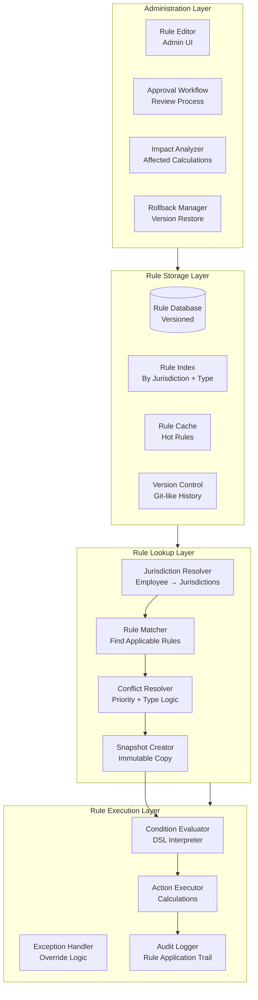
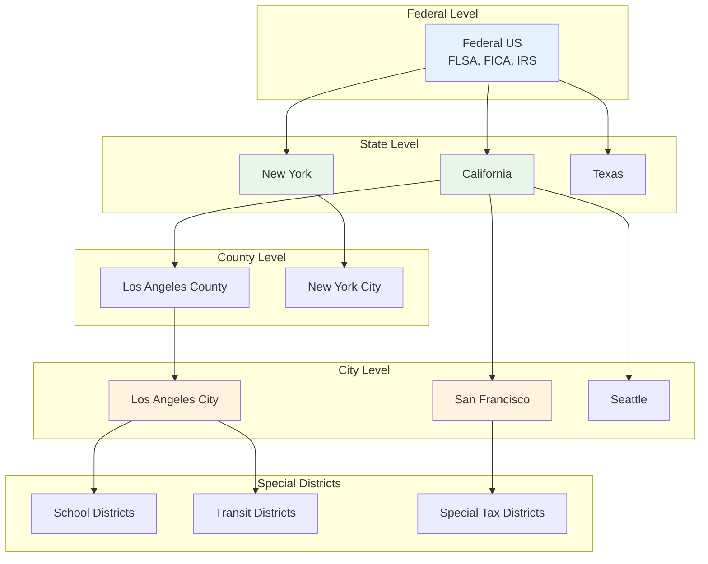

# Deep Dive & Bottlenecks

> **Navigation**: [Index](./00-index.md) | [Requirements](./01-requirements-and-estimations.md) | [HLD](./02-high-level-design.md) | [LLD](./03-low-level-design.md) | **Deep Dive** | [Scale](./05-scalability-and-reliability.md) | [Security](./06-security-and-compliance.md) | [Observability](./07-observability.md) | [Interview Guide](./08-interview-guide.md)

---

## 1. Deep Dive: AI-Driven Legal Document Parsing

### 1.1 Component Architecture

```mermaid
flowchart TB
    subgraph Ingestion["Document Ingestion"]
        Monitor[Change Monitor<br/>RSS, Web Scraping]
        Fetcher[Document Fetcher]
        Dedup[Deduplication<br/>Content Hash]
        Queue[Ingestion Queue]
    end

    subgraph Preprocessing["Document Preprocessing"]
        OCR[OCR Engine<br/>Tesseract/Cloud]
        LayoutDetect[Layout Detection<br/>Headers, Tables]
        TextClean[Text Cleaning<br/>Normalize, Remove Noise]
        Segmenter[Section Segmenter<br/>Legal Structure Parser]
    end

    subgraph NLPPipeline["NLP Pipeline"]
        NER[Named Entity Recognition<br/>Payroll Entities]
        Classifier[Relevance Classifier<br/>Payroll vs Non-Payroll]
        RelationExtract[Relation Extraction<br/>Conditions, Actions]
    end

    subgraph LLMExtraction["LLM Extraction"]
        PromptBuilder[Prompt Builder<br/>Context Assembly]
        LLMInference[LLM Inference<br/>vLLM Cluster]
        OutputParser[Output Parser<br/>JSON Validation]
        ConfidenceScorer[Confidence Scorer]
    end

    subgraph PostProcessing["Post-Processing"]
        Deduplicator[Rule Deduplicator]
        ConflictResolver[Conflict Resolver]
        QualityChecker[Quality Checker]
        ReviewQueue[Human Review Queue]
    end

    Monitor --> Fetcher
    Fetcher --> Dedup
    Dedup --> Queue

    Queue --> OCR
    OCR --> LayoutDetect
    LayoutDetect --> TextClean
    TextClean --> Segmenter

    Segmenter --> NER
    NER --> Classifier
    Classifier --> RelationExtract

    RelationExtract --> PromptBuilder
    PromptBuilder --> LLMInference
    LLMInference --> OutputParser
    OutputParser --> ConfidenceScorer

    ConfidenceScorer --> Deduplicator
    Deduplicator --> ConflictResolver
    ConflictResolver --> QualityChecker
    QualityChecker --> ReviewQueue
```



### 1.2 Named Entity Recognition for Payroll

**Custom NER Model Training:**

| Entity Type | Examples | Training Approach |
|-------------|----------|-------------------|
| `WAGE_AMOUNT` | "$15.00", "minimum wage", "hourly rate" | Pattern + context |
| `TIME_PERIOD` | "per hour", "weekly", "annually", "pay period" | Dictionary + rules |
| `EMPLOYEE_CATEGORY` | "exempt", "non-exempt", "full-time", "seasonal" | Classification |
| `THRESHOLD` | "40 hours", "50 employees", "26 or more" | Pattern matching |
| `MULTIPLIER` | "1.5 times", "double time", "150%" | Regex + context |
| `JURISDICTION` | "State of California", "New York City" | Gazetteer + NER |
| `EFFECTIVE_DATE` | "January 1, 2026", "effective immediately" | Date parser + context |
| `EXCEPTION` | "except", "excluding", "unless", "provided that" | Dictionary |
| `LEGAL_CITATION` | "§510", "Section 3(a)", "26 U.S.C. §3101" | Pattern matching |

**NER Pipeline:**

```
INPUT: "For employers with 26 or more employees, the minimum wage shall be $16.00 per hour effective January 1, 2025."

STEP 1: Tokenization
["For", "employers", "with", "26", "or", "more", "employees", ",", "the", "minimum", "wage", "shall", "be", "$16.00", "per", "hour", "effective", "January", "1", ",", "2025", "."]

STEP 2: Entity Detection
- "26 or more employees" → THRESHOLD (employer_size >= 26)
- "minimum wage" → WAGE_TYPE
- "$16.00" → WAGE_AMOUNT (16.00)
- "per hour" → TIME_PERIOD (hourly)
- "January 1, 2025" → EFFECTIVE_DATE (2025-01-01)

STEP 3: Relation Extraction
- CONDITION: employer_size >= 26
- ACTION: set minimum_wage = 16.00 per hour
- EFFECTIVE: 2025-01-01
```

### 1.3 LLM Extraction Strategy

**Prompt Engineering for Rule Extraction:**

```
SYSTEM PROMPT:
You are a payroll compliance expert. Your task is to extract structured payroll rules from legal documents.

RULES FOR EXTRACTION:
1. Only extract EXPLICIT rules, not implied interpretations
2. Flag any ambiguity with [UNCERTAIN] marker
3. Include exact text references for traceability
4. Extract conditions as structured predicates
5. Extract actions as calculable operations

OUTPUT SCHEMA:
{
  "rules": [{
    "rule_type": "enum: minimum_wage|overtime|tax|deduction|benefit|leave",
    "conditions": [{"field": "string", "operator": "string", "value": "any"}],
    "actions": [{"action": "string", "parameters": {}}],
    "effective_date": "YYYY-MM-DD",
    "source_text": "exact quote",
    "confidence": 0.0-1.0,
    "reasoning": "explanation"
  }]
}

USER PROMPT:
JURISDICTION: {jurisdiction_name}
DOCUMENT: {document_title}
SECTION: {section_reference}

TEXT:
---
{section_text}
---

IDENTIFIED ENTITIES:
{entity_list}

Extract all payroll rules from this section.
```

**Confidence Scoring Algorithm:**

```
FUNCTION calculate_extraction_confidence(extraction, section, entities):
    scores = {}

    // 1. Entity Coverage (25%)
    // How many extracted values match identified entities?
    matched_entities = count_matching_entities(extraction, entities)
    total_values = count_extraction_values(extraction)
    scores.entity_coverage = matched_entities / total_values IF total_values > 0 ELSE 0.5

    // 2. Structural Quality (25%)
    // Is the extraction well-formed and complete?
    has_conditions = extraction.conditions IS NOT EMPTY
    has_actions = extraction.actions IS NOT EMPTY
    has_effective_date = extraction.effective_date IS NOT NULL
    scores.structural = (has_conditions + has_actions + has_effective_date) / 3

    // 3. Source Text Alignment (25%)
    // Can we find the source text in the section?
    source_found = section.text.contains(extraction.source_text)
    source_relevance = semantic_similarity(extraction.source_text, extraction.actions)
    scores.source_alignment = 0.5 * source_found + 0.5 * source_relevance

    // 4. LLM Self-Assessment (25%)
    // What confidence did the LLM report?
    scores.llm_confidence = extraction.confidence

    // Weighted final score
    final_score = (
        0.25 * scores.entity_coverage +
        0.25 * scores.structural +
        0.25 * scores.source_alignment +
        0.25 * scores.llm_confidence
    )

    // Apply penalties
    IF extraction.has_uncertain_markers:
        final_score *= 0.8
    IF extraction.source_text.length < 20:
        final_score *= 0.9

    RETURN ROUND(final_score, 2)
```

### 1.4 Failure Modes & Mitigations

| Failure Mode | Description | Impact | Mitigation |
|--------------|-------------|--------|------------|
| **OCR Errors** | Poor quality scans produce garbled text | Missed rules, wrong values | Multi-engine OCR, confidence thresholds, manual review for low-quality docs |
| **Context Loss** | Rule spans multiple pages/sections | Incomplete extraction | Sliding window with overlap, section linking |
| **Hallucination** | LLM invents rules not in text | False positives | Strict source text matching, entity grounding, low temperature |
| **Missed Rules** | Valid rules not extracted | Compliance gap | Multiple extraction passes, ensemble models, human spot-checks |
| **Ambiguous Language** | Legal text with multiple interpretations | Uncertain rules | Flag for human review, confidence penalties |
| **Nested Conditions** | Complex "if-then-else" structures | Oversimplified rules | Recursive extraction, condition tree parsing |
| **Effective Date Confusion** | Multiple dates in section | Wrong effective date | Date context analysis, explicit date linking |
| **Jurisdiction Mismatch** | State rule applied to wrong state | Incorrect calculations | Jurisdiction validation, geo-verification |

---

## 2. Deep Dive: Multi-Jurisdiction Rule Engine

### 2.1 Rule Engine Architecture



### 2.2 Jurisdiction Hierarchy



### 2.3 Conflict Resolution Algorithm

```
ALGORITHM: ResolveRuleConflicts

INPUT:
  - applicable_rules: List<Rule> from multiple jurisdictions
  - rule_type: Type of rule being resolved
  - employee_context: Employee data for evaluation

OUTPUT:
  - resolved_rules: Ordered list of rules to apply

PSEUDOCODE:

FUNCTION resolve_conflicts(applicable_rules, rule_type, employee_context):
    // Group rules by jurisdiction level
    federal_rules = filter(applicable_rules, level='federal')
    state_rules = filter(applicable_rules, level='state')
    local_rules = filter(applicable_rules, level='local')
    special_rules = filter(applicable_rules, level='special')

    resolved = []

    SWITCH rule_type:

        CASE 'minimum_wage':
            // Use HIGHEST wage (most favorable to employee)
            all_wages = []
            FOR rule IN applicable_rules:
                wage = evaluate_condition(rule, employee_context)
                IF wage:
                    all_wages.append({rule: rule, wage: wage})

            highest = MAX(all_wages, key=lambda x: x.wage)
            resolved = [highest.rule]

            // Record reasoning
            resolved[0].conflict_resolution = """
                Multiple minimum wages apply:
                - Federal: $7.25/hour
                - California: $16.00/hour
                - Los Angeles: $16.78/hour
                Applied: Los Angeles ($16.78) as highest applicable rate.
            """

        CASE 'overtime':
            // Use MOST RESTRICTIVE (most protective to employee)
            // Consider: daily vs weekly, threshold, rate

            daily_rules = filter(applicable_rules, has_daily_ot=TRUE)
            weekly_rules = filter(applicable_rules, has_weekly_ot=TRUE)

            // California has both daily (>8hrs) and weekly (>40hrs)
            // Federal only has weekly (>40hrs)

            IF daily_rules:
                lowest_daily = MIN(daily_rules, key=lambda r: r.daily_threshold)
                resolved.append(lowest_daily)

            lowest_weekly = MIN(weekly_rules, key=lambda r: r.weekly_threshold)
            resolved.append(lowest_weekly)

            // Also check for 7th day rules, double-time thresholds
            seventh_day_rules = filter(applicable_rules, has_7th_day=TRUE)
            resolved.extend(seventh_day_rules)

        CASE 'tax_withholding':
            // Apply ALL applicable taxes (additive)
            // Order: Federal first, then state, then local

            // Federal income tax
            resolved.append(filter(federal_rules, tax_type='income')[0])

            // FICA (Social Security + Medicare)
            resolved.append(filter(federal_rules, tax_type='fica')[0])

            // State income tax (may be multiple for multi-state workers)
            FOR state IN get_taxable_states(employee_context):
                state_income = filter(state_rules, jurisdiction=state, tax_type='income')
                IF state_income:
                    resolved.append(state_income[0])

                // State disability, paid family leave
                state_sdi = filter(state_rules, jurisdiction=state, tax_type='sdi')
                IF state_sdi:
                    resolved.append(state_sdi[0])

            // Local taxes (city, county, school district)
            FOR locality IN get_taxable_localities(employee_context):
                local_tax = filter(local_rules, jurisdiction=locality)
                resolved.extend(local_tax)

        CASE 'deduction':
            // Apply based on rule priority and mutual exclusivity
            grouped = group_by(applicable_rules, 'deduction_category')

            FOR category, rules IN grouped:
                IF rules.are_mutually_exclusive:
                    // Take highest priority
                    resolved.append(MAX(rules, key=lambda r: r.priority))
                ELSE:
                    // Apply all
                    resolved.extend(rules)

        CASE 'leave':
            // Use MOST GENEROUS (most favorable to employee)
            grouped = group_by(applicable_rules, 'leave_type')

            FOR leave_type, rules IN grouped:
                most_generous = MAX(rules, key=lambda r: r.benefit_value)
                resolved.append(most_generous)

    // Sort by execution order
    resolved = sort_by_priority(resolved)

    // Add conflict resolution audit trail
    FOR rule IN resolved:
        rule.resolution_reason = generate_resolution_explanation(rule, applicable_rules)

    RETURN resolved


FUNCTION get_taxable_states(employee_context):
    states = []

    // Work state always taxable
    states.append(employee_context.work_state)

    // Residence state if different and no reciprocity
    IF employee_context.residence_state != employee_context.work_state:
        IF NOT has_reciprocity(employee_context.work_state, employee_context.residence_state):
            states.append(employee_context.residence_state)

    // Additional states for multi-state workers
    FOR allocation IN employee_context.state_allocations:
        IF allocation.days >= get_nexus_threshold(allocation.state):
            states.append(allocation.state)

    RETURN UNIQUE(states)
```

### 2.4 Rule Caching Strategy

```
RULE CACHE ARCHITECTURE:

┌─────────────────────────────────────────────────────────────────┐
│                     Rule Cache Hierarchy                        │
├─────────────────────────────────────────────────────────────────┤
│                                                                 │
│  L1 Cache (In-Memory, Per Worker)                              │
│  ├── Hot rules by jurisdiction hash                             │
│  ├── TTL: 5 minutes                                             │
│  └── Size: 10,000 rules per worker                             │
│                                                                 │
│  L2 Cache (Redis Cluster)                                       │
│  ├── All active rules by jurisdiction                          │
│  ├── TTL: 1 hour                                                │
│  ├── Invalidation: On rule approval                            │
│  └── Size: ~500MB (400K rules × ~1KB)                          │
│                                                                 │
│  L3 Storage (PostgreSQL)                                        │
│  ├── All rule versions (historical)                            │
│  ├── Indexed by: jurisdiction_id, rule_type, effective_date    │
│  └── Size: ~2GB                                                 │
│                                                                 │
└─────────────────────────────────────────────────────────────────┘

CACHE KEY STRUCTURE:
  rules:{jurisdiction_id}:{rule_type}:{effective_date}
  Example: rules:CA:overtime:2025-01-15

INVALIDATION STRATEGY:
  1. Rule approved → Invalidate L2 cache for affected jurisdiction
  2. L1 cache checks L2 on miss
  3. Background job warms L2 cache for common jurisdictions
  4. Pay run creates immutable snapshot (bypasses cache)
```

### 2.5 Failure Modes & Mitigations

| Failure Mode | Description | Impact | Mitigation |
|--------------|-------------|--------|------------|
| **Missing Rule** | No rule exists for jurisdiction/type | Calculation fails or uses wrong default | Default rules hierarchy, alerting on gaps |
| **Conflicting Rules** | Multiple rules claim same scope | Ambiguous calculation | Explicit priority, conflict resolution algorithm |
| **Stale Cache** | Cache not invalidated after rule change | Outdated calculations | Event-driven invalidation, short TTLs |
| **Effective Date Gap** | No rule active for pay period | Calculation failure | Require continuous coverage, alert on gaps |
| **Circular Dependency** | Rule A depends on Rule B depends on A | Infinite loop | DAG validation on rule creation |
| **Version Skew** | Different workers use different versions | Inconsistent results | Immutable snapshots for pay runs |

---

## 3. Deep Dive: Calculation Engine with Explainability

### 3.1 Calculation Pipeline Architecture

```mermaid
flowchart TB
    subgraph Input["Input Validation"]
        TimeValidation[Time Data Validation]
        EmployeeValidation[Employee Data Validation]
        ElectionValidation[Election Validation]
    end

    subgraph Preparation["Calculation Preparation"]
        YTDLoader[YTD Totals Loader]
        JurisdictionResolver[Jurisdiction Resolver]
        RuleSnapshotCreator[Rule Snapshot Creator]
    end

    subgraph GrossCalc["Gross Calculation"]
        EarningsCalc[Earnings Calculator]
        OvertimeCalc[Overtime Calculator]
        BonusCalc[Bonus/Commission Calculator]
    end

    subgraph Deductions["Deduction Calculation"]
        PreTaxCalc[Pre-Tax Deductions<br/>401k, HSA, FSA]
        TaxableGrossCalc[Taxable Gross Calculator]
    end

    subgraph Taxes["Tax Calculation"]
        FederalCalc[Federal Tax Calculator]
        FICACalc[FICA Calculator<br/>SS + Medicare]
        StateCalc[State Tax Calculator]
        LocalCalc[Local Tax Calculator]
    end

    subgraph PostCalc["Post-Tax & Garnishments"]
        PostTaxCalc[Post-Tax Deductions]
        GarnishmentCalc[Garnishment Calculator]
        NetPayCalc[Net Pay Calculator]
    end

    subgraph Explainability["Explainability Generation"]
        LineExplainer[Line-by-Line Explainer]
        SummaryGenerator[Summary Generator]
        ComparisonEngine[Period Comparison]
    end

    subgraph Output["Output & Audit"]
        CalculationStore[Calculation Storage]
        AuditTrailGen[Audit Trail Generator]
        PayStubGen[Pay Stub Generator]
    end

    Input --> Preparation
    Preparation --> GrossCalc
    GrossCalc --> Deductions
    Deductions --> Taxes
    Taxes --> PostCalc
    PostCalc --> Explainability
    Explainability --> Output
```



### 3.2 Decimal Arithmetic for Accuracy

**Why Decimal Matters:**

```
PROBLEM: Floating-Point Errors

// JavaScript floating-point
0.1 + 0.2 = 0.30000000000000004  // WRONG!

// Payroll calculation with floating-point
hourly_rate = 50.25
hours = 40.0
gross = hourly_rate * hours  // Expected: 2010.00

// With floating-point: might get 2009.9999999999998
// Rounding to 2 decimals: could round down to 2009.99
// Over 1 year (26 pay periods): $0.26 error per employee
// For 10,000 employees: $2,600 cumulative error

SOLUTION: Decimal/Fixed-Point Arithmetic

// Use DECIMAL(18,4) in database
// Use Decimal libraries in code (Python decimal, Java BigDecimal)
// Round only at final output, not intermediate steps
// Store cents/minor units as integers internally

IMPLEMENTATION:
// Internal: Store as integer cents
hourly_rate_cents = 5025  // $50.25 as cents
hours_hundredths = 4000   // 40.00 hours × 100

gross_cents = (hourly_rate_cents * hours_hundredths) / 100
// = (5025 * 4000) / 100
// = 20100000 / 100
// = 201000 cents = $2,010.00 EXACT

// Only convert to dollars at display
gross_dollars = gross_cents / 100.0
```

**Rounding Rules:**

| Calculation Type | Rounding Rule | Standard |
|------------------|---------------|----------|
| Hourly earnings | Round to nearest cent | Common practice |
| Tax withholding | Round to nearest dollar | IRS allows |
| FICA taxes | Round to nearest cent | Required |
| Benefits | Per plan document | Varies |
| Final net pay | Round to nearest cent | Required |

### 3.3 Explanation Generation

```
ALGORITHM: GenerateCalculationExplanation

INPUT:
  - calculation: PayCalculation with all lines
  - employee: Employee context
  - previous_calculation: Previous period (optional)

OUTPUT:
  - explanation: Structured explanation with summary and details

PSEUDOCODE:

FUNCTION generate_explanation(calculation, employee, previous):
    explanation = new Explanation()

    // ============================================
    // Section 1: Earnings Explanation
    // ============================================
    earnings_lines = filter(calculation.lines, type='earning')

    earnings_explanation = new Section("Your Earnings")
    earnings_explanation.summary = generate_earnings_summary(earnings_lines)

    FOR line IN earnings_lines:
        SWITCH line.category:
            CASE 'regular':
                detail = "Regular pay: {hours} hours at ${rate}/hour = ${amount}"
            CASE 'overtime':
                ot_rule = get_rule(line.rule_version_id)
                detail = "Overtime: {hours} hours at ${rate}/hour ({multiplier}× your regular rate per {ot_rule.citation})"
            CASE 'bonus':
                detail = "Bonus payment: ${amount}"

        earnings_explanation.add_line(detail.format(line))

    explanation.add_section(earnings_explanation)

    // ============================================
    // Section 2: Pre-Tax Deductions Explanation
    // ============================================
    pretax_lines = filter(calculation.lines, type='pre_tax_deduction')

    IF pretax_lines:
        pretax_explanation = new Section("Pre-Tax Deductions")
        pretax_explanation.summary = """
            These deductions are taken before taxes are calculated,
            which reduces your taxable income and saves you money on taxes.
        """

        FOR line IN pretax_lines:
            rule = get_rule(line.rule_version_id)
            IF line.category == '401k':
                detail = "401(k) contribution: {percent}% of gross (${amount}). YTD: ${ytd_contrib} of ${annual_limit} limit."
            ELIF line.category == 'hsa':
                detail = "HSA contribution: ${amount}. This is tax-free for medical expenses."

            pretax_explanation.add_line(detail.format(line, rule))

        explanation.add_section(pretax_explanation)

    // ============================================
    // Section 3: Tax Explanation
    // ============================================
    tax_lines = filter(calculation.lines, type='tax')

    tax_explanation = new Section("Tax Withholdings")
    total_taxes = sum(tax_lines.amount)
    effective_rate = total_taxes / calculation.taxable_gross

    tax_explanation.summary = """
        Total taxes withheld: ${total_taxes} ({effective_rate}% effective rate).
        Your taxable wages are ${taxable_gross} after pre-tax deductions.
    """.format(total_taxes, effective_rate, calculation.taxable_gross)

    FOR line IN tax_lines:
        rule = get_rule(line.rule_version_id)

        SWITCH line.category:
            CASE 'federal_income_tax':
                w4 = employee.tax_elections.federal
                detail = """
                    Federal income tax: ${amount}
                    - Filing status: {filing_status}
                    - Marginal bracket: {bracket}%
                    - Effective rate: {effective_rate}%
                """

            CASE 'social_security':
                detail = """
                    Social Security: ${amount} (6.2% of ${base})
                    YTD wages: ${ytd_wages} of ${wage_base} annual limit
                """

            CASE 'medicare':
                IF line.includes_additional:
                    detail = """
                        Medicare: ${amount}
                        - Base Medicare (1.45%): ${base_amount}
                        - Additional Medicare (0.9% on wages over $200K): ${additional}
                    """
                ELSE:
                    detail = "Medicare: ${amount} (1.45% of ${base})"

            CASE line.category.startswith('state_income_tax'):
                state = extract_state(line.category)
                detail = """
                    {state} state income tax: ${amount}
                    - Taxable wages: ${base}
                    - Effective rate: {rate}%
                    Reference: {citation}
                """

        tax_explanation.add_line(detail.format(line, rule))

    explanation.add_section(tax_explanation)

    // ============================================
    // Section 4: Comparison to Previous Period
    // ============================================
    IF previous:
        comparison = new Section("Compared to Last Period")

        gross_change = calculation.gross_pay - previous.gross_pay
        net_change = calculation.net_pay - previous.net_pay
        tax_change = calculation.total_taxes - previous.total_taxes

        comparison.summary = """
            Your net pay {increased/decreased} by ${abs(net_change)} from last period.
        """

        IF abs(gross_change) > 0:
            comparison.add_line("Gross pay change: ${gross_change}")

        IF abs(tax_change) > 10:
            tax_reason = analyze_tax_change(calculation, previous)
            comparison.add_line("Tax change: ${tax_change}. Reason: {tax_reason}")

        explanation.add_section(comparison)

    // ============================================
    // Section 5: FAQ / Common Questions
    // ============================================
    faqs = generate_personalized_faqs(calculation, employee)
    explanation.add_section(faqs)

    // ============================================
    // Final Summary
    // ============================================
    explanation.summary = """
        Your gross pay of ${gross_pay} includes {earnings_breakdown}.
        After pre-tax deductions of ${pretax_total}, your taxable wages are ${taxable_gross}.
        Federal, state, and local taxes total ${total_taxes}, resulting in net pay of ${net_pay}.
    """.format(calculation)

    RETURN explanation


FUNCTION generate_personalized_faqs(calculation, employee):
    faqs = []

    // Overtime question if employee had OT
    IF calculation.has_overtime:
        faqs.append({
            question: "Why is my overtime rate different from my regular rate?",
            answer: "California law requires overtime pay at 1.5× your regular rate for hours over 8 in a day or 40 in a week. Your overtime rate of ${ot_rate} is calculated as ${regular_rate} × 1.5."
        })

    // Tax bracket question if marginal > effective
    IF calculation.marginal_bracket > calculation.effective_rate + 5:
        faqs.append({
            question: "Why is my tax rate lower than my tax bracket?",
            answer: "Your marginal tax bracket is {marginal}%, but your effective rate is only {effective}%. This is because federal taxes use progressive brackets - you only pay the higher rate on income above each threshold."
        })

    // YTD limit question if approaching limits
    IF calculation.approaching_ss_limit:
        faqs.append({
            question: "Will my Social Security tax change soon?",
            answer: "You've earned ${ytd_ss_wages} this year toward the ${ss_limit} Social Security wage base. Once you reach the limit, Social Security tax (6.2%) will no longer be withheld, increasing your net pay by approximately ${weekly_savings} per pay period."
        })

    RETURN faqs
```

### 3.4 Failure Modes & Mitigations

| Failure Mode | Description | Impact | Mitigation |
|--------------|-------------|--------|------------|
| **Rounding Errors** | Accumulated floating-point drift | Incorrect pay, reconciliation issues | Decimal arithmetic, store as cents |
| **YTD Drift** | Accumulated totals don't match sum of periods | W-2 discrepancies | Reconciliation checks, audit trails |
| **Rule Lookup Failure** | Can't find applicable rule | Calculation stops | Default rules, graceful degradation |
| **Circular Calculation** | Benefit depends on tax depends on benefit | Infinite loop | Dependency graph, iteration limit |
| **Retroactive Change** | Rule change affects past calculations | Recalculation needed | Retro-pay engine, version tracking |
| **Negative Net Pay** | Deductions exceed gross | Invalid payment | Validation, garnishment limits |

---

## 4. Bottleneck Analysis

### 4.1 Identified Bottlenecks

| Bottleneck | Location | Impact | Severity |
|------------|----------|--------|----------|
| **Legal Document Ingestion** | AI Platform | Delayed rule updates | Medium |
| **Rule Lookup for Multi-State** | Rule Engine | Slow calculation | High |
| **Batch Pay Run at Peak** | Calculation Engine | Deadline risk | Critical |
| **LLM Inference Queue** | AI Platform | Extraction delays | Medium |
| **Tax Table Updates** | Data Layer | Stale rates | High |
| **Audit Log Write** | Data Layer | Calculation slowdown | Medium |

### 4.2 Bottleneck: Batch Pay Run Processing

```
PROBLEM:
- 10,000 employees to calculate
- 30-minute deadline
- Each calculation requires:
  - Jurisdiction resolution (~10ms)
  - Rule lookup (~20ms)
  - Gross-to-net calculation (~50ms)
  - Explanation generation (~100ms)
  - Database writes (~20ms)
- Total: ~200ms per employee
- Sequential: 10,000 × 200ms = 33 minutes (OVER DEADLINE)

SOLUTION: Parallel Processing Pipeline

┌─────────────────────────────────────────────────────────────────┐
│                    Batch Processing Architecture                │
├─────────────────────────────────────────────────────────────────┤
│                                                                 │
│  Phase 1: Preparation (Single-threaded)                        │
│  ├── Load employee roster                                       │
│  ├── Create rule snapshot                                       │
│  ├── Partition employees by jurisdiction cluster                │
│  └── Time: ~2 minutes                                          │
│                                                                 │
│  Phase 2: Calculation (Parallel Workers)                        │
│  ├── Workers: 50 parallel workers                               │
│  ├── Batch size: 200 employees per worker                       │
│  ├── Each worker: jurisdiction → rules → calculate → store      │
│  ├── Time: ~200ms × 200 / worker = 40 seconds per batch         │
│  └── Total: ~8 minutes for 10,000 employees                     │
│                                                                 │
│  Phase 3: Explanation (Async, GPU-accelerated)                  │
│  ├── Queue explanation generation                               │
│  ├── LLM batch inference                                        │
│  └── Time: ~5 minutes (parallel with review)                    │
│                                                                 │
│  Phase 4: Aggregation & Validation (Single-threaded)            │
│  ├── Collect results                                            │
│  ├── Validate totals                                            │
│  ├── Flag exceptions                                            │
│  └── Time: ~2 minutes                                          │
│                                                                 │
│  TOTAL: ~17 minutes (well under 30-minute deadline)             │
│                                                                 │
└─────────────────────────────────────────────────────────────────┘

OPTIMIZATION TECHNIQUES:
1. Pre-warm rule cache before pay run
2. Batch database writes (commit every 100 calculations)
3. Jurisdiction clustering (group employees by similar rules)
4. Async explanation generation (don't block calculation)
5. Connection pooling (reuse database connections)
```

### 4.3 Bottleneck: Rule Lookup for Multi-Jurisdiction

```
PROBLEM:
- Employee works in CA, lives in NV, travels to AZ, TX
- Need rules from: Federal, CA, NV, AZ, TX, LA County, SF City
- Naive approach: 7 database queries × ~10ms = 70ms per employee

SOLUTION: Jurisdiction-Aware Caching

// Cache structure
CACHE KEY: rules:{jurisdiction_hash}:{rule_type}:{date}

// Jurisdiction clustering
// Most employees in same company share work jurisdiction
// Pre-compute common jurisdiction sets

FUNCTION get_rules_optimized(employee, rule_types, date):
    // Step 1: Compute jurisdiction set hash
    jurisdictions = resolve_jurisdictions(employee)
    jurisdiction_hash = hash(sort(jurisdictions.ids))

    // Step 2: Check L1 cache (in-memory)
    cache_key = f"rules:{jurisdiction_hash}:{date}"
    IF L1_CACHE.contains(cache_key):
        RETURN L1_CACHE.get(cache_key)

    // Step 3: Check L2 cache (Redis)
    IF L2_CACHE.contains(cache_key):
        rules = L2_CACHE.get(cache_key)
        L1_CACHE.set(cache_key, rules, ttl=300)
        RETURN rules

    // Step 4: Batch database query
    rules = database.query("""
        SELECT * FROM rule_versions rv
        JOIN payroll_rules pr ON rv.rule_id = pr.id
        WHERE pr.jurisdiction_id = ANY($1)
          AND rv.status = 'active'
          AND rv.effective_from <= $2
          AND (rv.effective_to IS NULL OR rv.effective_to > $2)
        ORDER BY pr.jurisdiction_id, pr.priority
    """, [jurisdictions.ids, date])

    // Step 5: Cache result
    L2_CACHE.set(cache_key, rules, ttl=3600)
    L1_CACHE.set(cache_key, rules, ttl=300)

    RETURN rules

RESULT: Single batched query + caching reduces 70ms → ~5ms for cached, ~15ms for uncached
```

### 4.4 Bottleneck Mitigation Summary

| Bottleneck | Mitigation | Before | After | Improvement |
|------------|------------|--------|-------|-------------|
| Batch Pay Run | Parallel workers (50x) | 33 min | 17 min | 48% faster |
| Rule Lookup | Jurisdiction clustering + caching | 70ms | 5-15ms | 80% faster |
| LLM Inference | Batch inference, GPU optimization | 500ms | 100ms | 80% faster |
| Audit Log Write | Async batch writes | 20ms sync | 2ms async | 90% faster |
| Tax Table Updates | Incremental updates, CDC | 1hr full refresh | 5min delta | 92% faster |
