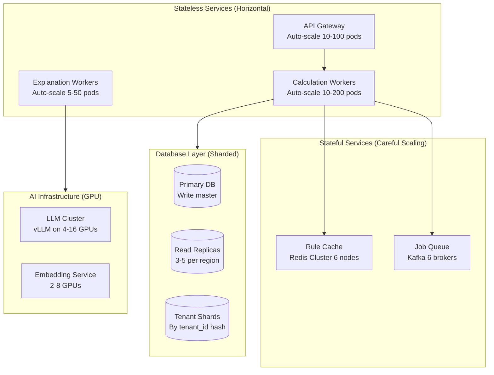
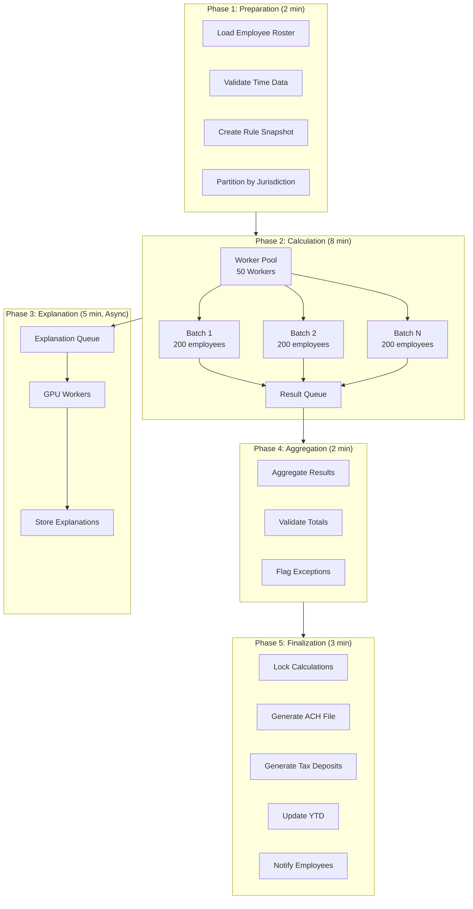
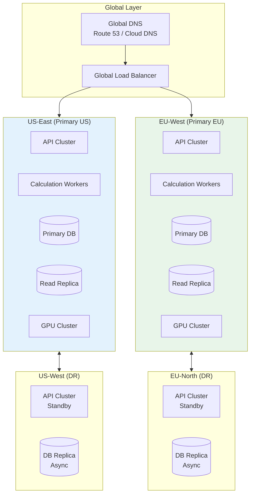

# Scalability & Reliability

> **Navigation**: [Index](./00-index.md) | [Requirements](./01-requirements-and-estimations.md) | [HLD](./02-high-level-design.md) | [LLD](./03-low-level-design.md) | [Deep Dive](./04-deep-dive-and-bottlenecks.md) | **Scale** | [Security](./06-security-and-compliance.md) | [Observability](./07-observability.md) | [Interview Guide](./08-interview-guide.md)

---

## 1. Scalability Strategy

### 1.1 Scaling Dimensions

| Dimension | Growth Vector | Scaling Approach |
|-----------|---------------|------------------|
| **Tenants** | 1K → 10K tenants | Horizontal: Add app servers, shard databases |
| **Employees** | 200K → 5M employees | Horizontal: Partition by tenant, parallel workers |
| **Pay Runs** | 10K → 100K/month | Horizontal: Worker pool auto-scaling |
| **Jurisdictions** | 7K → 10K+ | Vertical: Better caching, query optimization |
| **AI Workload** | 1M → 10M inferences/month | Horizontal: GPU cluster scaling |
| **Storage** | 5TB → 50TB | Horizontal: Sharding, tiered storage |

### 1.2 Component Scaling Strategy



### 1.3 Horizontal Scaling

**API Gateway & Application Servers:**

| Metric | Trigger | Action |
|--------|---------|--------|
| CPU > 70% | 2 min sustained | Add 2 pods |
| CPU < 30% | 5 min sustained | Remove 1 pod |
| Request latency p99 > 500ms | 1 min | Add 2 pods |
| Queue depth > 1000 | Immediate | Add 5 pods |

**Calculation Workers:**

```
AUTO-SCALING POLICY:

Base capacity: 20 workers

Pay run scaling:
  - Small run (<1K employees): 20 workers
  - Medium run (1K-10K): 50 workers
  - Large run (10K-100K): 100 workers
  - Enterprise run (100K+): 200 workers

Peak period scaling (1st, 15th, last of month):
  - Pre-scale to 100 workers at 00:00
  - Scale based on queue depth
  - Scale down after 12:00

Event-driven scaling:
  - Pay run created → Add workers based on employee count
  - Pay run completed → Release workers after 5 min idle
```

### 1.4 Database Scaling

**Sharding Strategy:**

```
SHARDING APPROACH: Tenant-based consistent hashing

Shard key: tenant_id
Number of shards: 64 (expandable to 256)
Virtual nodes: 256 per physical shard

SHARD ALLOCATION:
  shard_id = consistent_hash(tenant_id) % num_shards

SHARD DISTRIBUTION:
  - Shards 0-15: SMB tenants (high count, low volume)
  - Shards 16-47: Mid-market tenants
  - Shards 48-63: Enterprise tenants (dedicated capacity)

CROSS-SHARD QUERIES:
  - Global rules: Replicated to all shards
  - Tax tables: Replicated to all shards
  - Analytics: Separate analytics database (federated queries)

REBALANCING:
  - Online rebalancing with consistent hashing
  - Move tenants to new shards without downtime
  - Split hot shards when tenant grows
```

**Read Replica Strategy:**

```
READ REPLICA TOPOLOGY:

Primary (Write) ──┬── Replica 1 (Sync, same AZ)
                  ├── Replica 2 (Async, different AZ)
                  └── Replica 3 (Async, different region for DR)

READ ROUTING:
  - Real-time calculations → Primary (strong consistency)
  - Pay stub views → Replica 1 (low latency)
  - Reports/Analytics → Replica 2 (offload primary)
  - Disaster recovery → Replica 3 (failover ready)

REPLICATION LAG MONITORING:
  - Alert if lag > 5 seconds
  - Route reads to primary if lag > 10 seconds
  - Automatic failover if lag > 60 seconds
```

---

## 2. Batch Processing Architecture

### 2.1 Pay Run Processing Pipeline



### 2.2 Worker Pool Management

```
WORKER POOL CONFIGURATION:

Calculation Workers:
  - Min: 20 workers
  - Max: 200 workers
  - Batch size: 200 employees
  - Timeout: 60 seconds per batch
  - Retry: 3 attempts with exponential backoff

Resource allocation per worker:
  - CPU: 2 cores
  - Memory: 4 GB
  - Database connections: 5 (pooled)

WORK DISTRIBUTION:

Pay Run Request:
  - Employee count: 10,000
  - Partitions: 50 batches × 200 employees
  - Workers allocated: 50 (1 partition per worker)
  - Estimated time: 40 seconds per batch
  - Total parallel time: ~2 minutes (with overhead)

FAILURE HANDLING:

Worker failure:
  1. Detect failure (heartbeat timeout)
  2. Reassign batch to healthy worker
  3. Log failure for investigation
  4. Continue with remaining batches

Batch failure:
  1. Retry batch up to 3 times
  2. If still failing, mark employees as "failed"
  3. Continue with other batches
  4. Alert admin for manual intervention
  5. Pay run can complete with partial results
```

### 2.3 Batch Processing Guarantees

| Guarantee | Implementation |
|-----------|----------------|
| **At-least-once processing** | Idempotent calculations, deduplication |
| **Ordering within employee** | Single worker per employee |
| **Deadline awareness** | Priority queuing, preemption |
| **Partial failure handling** | Continue with successful employees |
| **Audit completeness** | Log before/after for every calculation |

---

## 3. Multi-Region Deployment

### 3.1 Region Architecture



### 3.2 Data Residency

| Tenant Region | Primary DB | Read Replicas | AI Processing | Backup |
|---------------|------------|---------------|---------------|--------|
| US | US-East | US-East, US-West | US GPU | US-West |
| EU (GDPR) | EU-West | EU-West, EU-North | EU GPU | EU-North |
| UK | EU-West | EU-West | EU GPU | EU-North |
| Canada | US-East | US-East | US GPU | US-West |
| APAC | APAC-South | APAC-South | APAC GPU | APAC-East |

### 3.3 Cross-Region Replication

```
REPLICATION STRATEGY:

Within Region (Synchronous):
  Primary → Replica 1 (same AZ, sync commit)
  - RPO: 0 (no data loss)
  - Latency: ~1ms additional

Cross-Region (Asynchronous):
  Primary → DR Replica (different region)
  - RPO: ~30 seconds typical
  - Latency: ~50ms additional (not on critical path)

What's Replicated:
  ✓ Employee data (PII stays in region)
  ✓ Payroll calculations
  ✓ Audit logs
  ✓ Rule versions

What's NOT Replicated Cross-Region:
  ✗ Global rules (maintained separately per region)
  ✗ Tax tables (same in all regions)
  ✗ AI models (deployed per region)
```

---

## 4. Fault Tolerance & Reliability

### 4.1 Single Points of Failure (SPOF) Analysis

| Component | SPOF Risk | Mitigation |
|-----------|-----------|------------|
| API Gateway | Low | Multiple instances, load balanced |
| Database Primary | Medium | Synchronous replica, automatic failover |
| Rule Cache (Redis) | Medium | Redis Cluster (6 nodes), persistence |
| Job Queue (Kafka) | Low | Multi-broker, replication factor 3 |
| LLM Cluster | Medium | Multiple GPUs, queue-based degradation |
| Tax Table Provider | High | Local cache, 24hr backup, multiple providers |

### 4.2 Failure Scenarios & Recovery

**Scenario 1: Database Primary Failure**

```
DETECTION:
  - Health check fails for 30 seconds
  - Synchronous replica cannot reach primary

AUTOMATIC FAILOVER:
  1. Promote synchronous replica to primary (30 seconds)
  2. Update connection strings via service discovery
  3. Redirect writes to new primary
  4. Alert operations team
  5. Create new replica from promoted primary

IMPACT:
  - Writes blocked for ~30 seconds
  - Reads continue on replicas
  - No data loss (synchronous replica)

RECOVERY:
  - Failed node investigated and repaired
  - Rejoins as replica
  - Full sync from current primary
```

**Scenario 2: Pay Run Deadline at Risk**

```
DETECTION:
  - Pay run progress < expected at T-2 hours
  - Worker failures > 10%
  - Queue depth increasing

AUTOMATIC MITIGATION:
  1. Scale workers to maximum (200)
  2. Increase batch parallelism
  3. Disable non-essential logging
  4. Alert operations team

MANUAL ESCALATION (if needed):
  1. Prioritize critical employees (executives, contractors)
  2. Run calculations sequentially for problematic employees
  3. Generate partial ACH file
  4. Notify affected employees
  5. Schedule makeup pay run

PREVENTION:
  - Start pay run with buffer time (6 hours before deadline)
  - Pre-flight checks catch issues early
  - Test runs in staging environment
```

**Scenario 3: AI Platform Unavailable**

```
DETECTION:
  - LLM inference timeout > 10 seconds
  - GPU cluster health check fails

GRACEFUL DEGRADATION:
  1. Queue explanation requests (don't block calculation)
  2. Use cached/template explanations
  3. Mark pay stubs as "detailed explanation pending"
  4. Continue pay run without AI explanations

IMPACT:
  - Pay runs complete on time
  - Explanations generated when AI recovers
  - New rule extraction queued

RECOVERY:
  - GPU cluster restored
  - Process queued explanation requests
  - Update pay stubs with full explanations
```

### 4.3 Circuit Breaker Pattern

```
CIRCUIT BREAKER CONFIGURATION:

Tax Table Lookup:
  - Failure threshold: 5 failures in 10 seconds
  - Open duration: 30 seconds
  - Half-open: Allow 1 request to test
  - Fallback: Use cached tax tables (24hr stale max)

External API (Banking):
  - Failure threshold: 3 failures in 30 seconds
  - Open duration: 60 seconds
  - Fallback: Queue ACH file, retry later

LLM Inference:
  - Failure threshold: 10 failures in 60 seconds
  - Open duration: 120 seconds
  - Fallback: Template explanations, queue for retry

CIRCUIT BREAKER STATES:

CLOSED ──[failures > threshold]──> OPEN
   ↑                                   │
   │                                   │
   └───────[success]─── HALF_OPEN <────┘
                            │           timeout
                            └───[failure]───────────> OPEN
```

### 4.4 Retry Strategy

| Operation | Max Retries | Backoff | Notes |
|-----------|-------------|---------|-------|
| Database write | 3 | Exponential (100ms, 500ms, 2s) | Idempotent with transaction ID |
| Rule lookup | 2 | Fixed (50ms) | Fast retry, then cache |
| Tax calculation | 3 | Exponential | Must succeed for pay run |
| LLM inference | 2 | Fixed (1s) | Queue if fails, non-blocking |
| ACH transmission | 5 | Exponential (1m, 5m, 15m, 1h, 4h) | Critical, long backoff |

---

## 5. Disaster Recovery

### 5.1 Recovery Objectives

| Metric | Target | Justification |
|--------|--------|---------------|
| **RPO** (Recovery Point Objective) | 0 for payroll data | Cannot lose pay calculations |
| **RTO** (Recovery Time Objective) | 15 minutes | Must meet pay deadlines |
| **MTTR** (Mean Time to Repair) | 30 minutes | Minimize employee impact |

### 5.2 Disaster Recovery Architecture

```
DR TOPOLOGY:

┌─────────────────────────────────────────────────────────────────┐
│                    Primary Region (US-East)                     │
├─────────────────────────────────────────────────────────────────┤
│  Active-Active:                                                 │
│  ├── API Gateway (active)                                       │
│  ├── Calculation Workers (active)                               │
│  ├── Database Primary (all writes)                              │
│  └── GPU Cluster (active)                                       │
└─────────────────────────────────────────────────────────────────┘
                              │
                              │ Synchronous replication (same region)
                              │ Asynchronous replication (cross-region)
                              ▼
┌─────────────────────────────────────────────────────────────────┐
│                    DR Region (US-West)                          │
├─────────────────────────────────────────────────────────────────┤
│  Warm Standby:                                                  │
│  ├── API Gateway (standby, can activate in 2 min)               │
│  ├── Calculation Workers (minimal, can scale in 5 min)          │
│  ├── Database Replica (async, <1 min lag)                       │
│  └── GPU Cluster (shared with EU, can allocate in 5 min)        │
└─────────────────────────────────────────────────────────────────┘
```

### 5.3 Failover Procedure

```
AUTOMATED FAILOVER RUNBOOK:

TRIGGER CONDITIONS:
  - Primary region health check fails for 5 minutes
  - Multiple AZ failure detected
  - Manual trigger by operations

PHASE 1: Detection (0-2 minutes)
  1. Health check failures detected
  2. Automated alerts sent
  3. Failover decision made (auto or manual)

PHASE 2: Promotion (2-5 minutes)
  1. Promote DR database replica to primary
  2. Update DNS to point to DR region
  3. Start standby API servers
  4. Scale calculation workers

PHASE 3: Validation (5-10 minutes)
  1. Run health checks on DR services
  2. Verify database connectivity
  3. Test sample calculation
  4. Verify API endpoints

PHASE 4: Traffic Migration (10-15 minutes)
  1. Gradually shift traffic to DR (10%, 50%, 100%)
  2. Monitor error rates
  3. Confirm all services operational

PHASE 5: Communication (Ongoing)
  1. Status page update
  2. Customer notification
  3. Post-incident review scheduled
```

### 5.4 Backup Strategy

| Data Type | Backup Frequency | Retention | Storage |
|-----------|------------------|-----------|---------|
| Database (full) | Daily | 30 days | Cross-region object storage |
| Database (incremental) | Hourly | 7 days | Cross-region object storage |
| Audit logs | Real-time replication | 7 years | Immutable storage |
| Rule versions | Real-time replication | Forever | Append-only |
| Legal documents | Daily | Forever | Object storage |
| AI models | On deployment | 10 versions | Object storage |

---

## 6. Performance Optimization

### 6.1 Caching Strategy

```
CACHE HIERARCHY:

┌─────────────────────────────────────────────────────────────────┐
│  L1: In-Memory (Per Worker)                                     │
│  ├── Hot rules by jurisdiction                                  │
│  ├── Tax tables for current year                                │
│  ├── Employee data for current batch                            │
│  ├── TTL: 5 minutes                                             │
│  └── Size: 500MB per worker                                     │
├─────────────────────────────────────────────────────────────────┤
│  L2: Distributed Cache (Redis Cluster)                          │
│  ├── All active rules                                           │
│  ├── Tax tables (all years)                                     │
│  ├── Session data                                               │
│  ├── TTL: 1 hour (rules), 24 hours (tax tables)                │
│  └── Size: 10GB cluster                                         │
├─────────────────────────────────────────────────────────────────┤
│  L3: Database                                                   │
│  ├── All data (source of truth)                                │
│  ├── Indexed for common queries                                │
│  └── Size: 50TB+                                                │
└─────────────────────────────────────────────────────────────────┘

CACHE WARMING:
  - Pre-warm L2 cache at 00:00 daily
  - Pre-warm L1 cache at pay run start
  - Proactive cache refresh on rule changes
```

### 6.2 Query Optimization

```
CRITICAL QUERY PATTERNS:

1. Get active rules for jurisdictions
   - Index: (jurisdiction_id, status, effective_from)
   - Strategy: Batch query all jurisdictions at once

2. Get employee YTD totals
   - Index: (employee_id, year, calculation_type)
   - Strategy: Materialized view, refreshed per pay run

3. Get pay run calculations
   - Index: (pay_run_id, status)
   - Partition: By (tenant_id, pay_period_start)
   - Strategy: Partition pruning

4. Audit log insert
   - Strategy: Async batch insert (100 records)
   - Index: Created after batch (not during insert)

QUERY PERFORMANCE TARGETS:
  - Rule lookup: <10ms (cached), <50ms (uncached)
  - YTD totals: <20ms
  - Calculation insert: <5ms (batched)
  - Audit log insert: <1ms (async)
```

### 6.3 Resource Optimization

| Resource | Optimization | Impact |
|----------|--------------|--------|
| CPU | Worker right-sizing, batch parallelism | 30% cost reduction |
| Memory | Connection pooling, object reuse | 40% memory reduction |
| Database | Read replicas, query optimization | 50% primary load reduction |
| Network | Compression, connection reuse | 20% latency reduction |
| GPU | Batch inference, model quantization | 3x throughput increase |
| Storage | Tiered storage, compression | 60% storage cost reduction |
