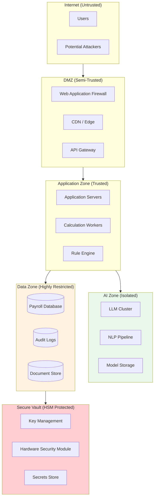
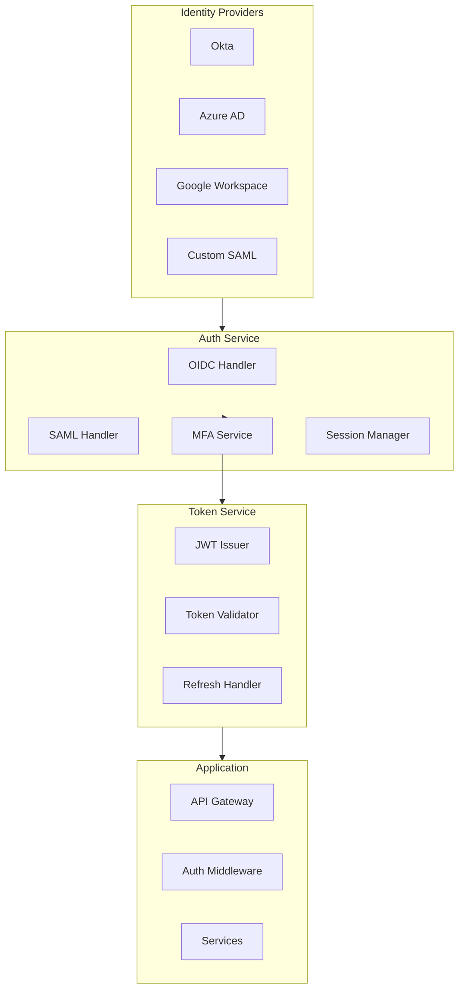
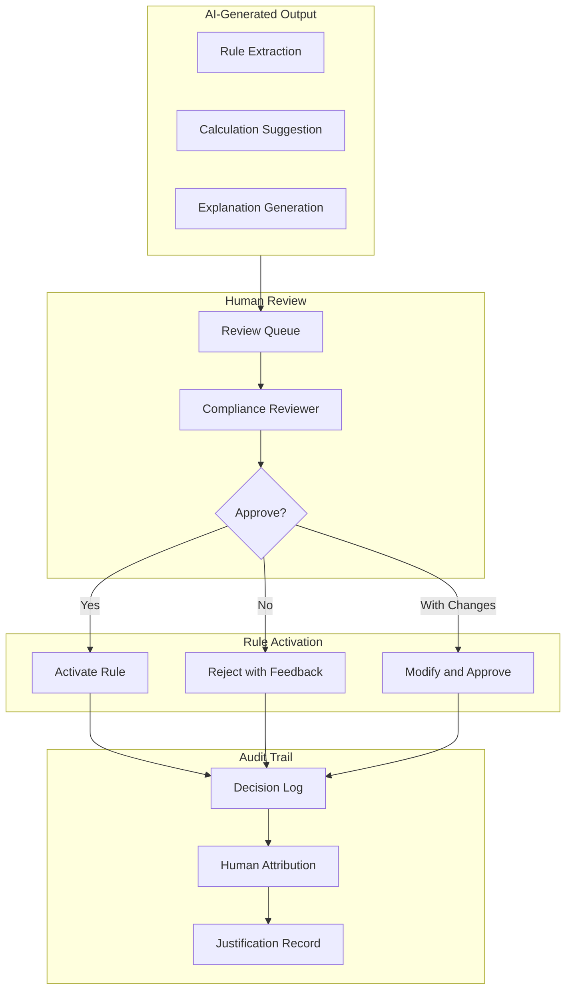

# Security & Compliance

> **Navigation**: [Index](./00-index.md) | [Requirements](./01-requirements-and-estimations.md) | [HLD](./02-high-level-design.md) | [LLD](./03-low-level-design.md) | [Deep Dive](./04-deep-dive-and-bottlenecks.md) | [Scale](./05-scalability-and-reliability.md) | **Security** | [Observability](./07-observability.md) | [Interview Guide](./08-interview-guide.md)

---

## 1. Security Architecture

### 1.1 Security Zones



### 1.2 Defense in Depth

| Layer | Controls | Technologies |
|-------|----------|--------------|
| **Perimeter** | DDoS protection, WAF, rate limiting | Cloudflare, AWS Shield |
| **Network** | Segmentation, firewalls, mTLS | VPC, Security Groups, Istio |
| **Application** | AuthN/AuthZ, input validation, CSRF | OIDC, OAuth 2.0, RBAC |
| **Data** | Encryption at rest/transit, masking | AES-256, TLS 1.3, tokenization |
| **Endpoint** | Secure coding, dependency scanning | SAST, DAST, SCA |
| **Monitoring** | SIEM, intrusion detection, audit logs | Splunk, Datadog, CloudTrail |

---

## 2. Data Classification & Protection

### 2.1 Data Classification

| Classification | Description | Examples | Protection Level |
|----------------|-------------|----------|------------------|
| **Critical** | Cannot be exposed under any circumstances | SSN, bank account numbers | Field-level encryption + HSM |
| **Sensitive** | PII requiring strong protection | Salary, tax elections, addresses | Tenant encryption + access control |
| **Confidential** | Business-sensitive | Pay rates, hours, deductions | Tenant encryption |
| **Internal** | General business data | Rule metadata, job titles | Standard encryption |
| **Public** | Safe to expose | Tax brackets, minimum wage rates | No encryption required |

### 2.2 Field-Level Encryption

```
ENCRYPTION ARCHITECTURE:

┌─────────────────────────────────────────────────────────────────┐
│                     Key Hierarchy                               │
├─────────────────────────────────────────────────────────────────┤
│                                                                 │
│  Master Key (HSM-protected)                                     │
│  └── Never leaves HSM                                           │
│      └── Used to encrypt KEKs                                   │
│                                                                 │
│  Key Encryption Key (KEK) - Per Region                          │
│  └── Stored encrypted by Master Key                             │
│      └── Used to encrypt DEKs                                   │
│                                                                 │
│  Data Encryption Key (DEK) - Per Tenant                         │
│  └── Stored encrypted by KEK                                    │
│      └── Used to encrypt actual data                           │
│                                                                 │
│  Field-Specific Key - Per Sensitive Field                       │
│  └── Derived from DEK + field identifier                       │
│      └── SSN key, Bank Account key, Salary key                 │
│                                                                 │
└─────────────────────────────────────────────────────────────────┘

ENCRYPTION PROCESS:

1. Application requests encryption of SSN "123-45-6789"
2. Key service retrieves tenant DEK (decrypted using KEK)
3. Derive field key: HKDF(DEK, "ssn")
4. Encrypt: AES-256-GCM(field_key, plaintext)
5. Store: encrypted_value + IV + auth_tag
6. Keys rotated every 90 days (re-encrypt on access)

DECRYPTION PROCESS:

1. Application requests decryption
2. Verify user has permission for field access
3. Retrieve encrypted value from database
4. Retrieve and decrypt tenant DEK
5. Derive field key
6. Decrypt and return plaintext
7. Log access in audit trail
```

### 2.3 Data Masking

| Field | Display to Owner | Display to Admin | Display in Logs |
|-------|------------------|------------------|-----------------|
| SSN | XXX-XX-6789 | XXX-XX-XXXX | [REDACTED] |
| Bank Account | XXXX1234 | [MASKED] | [REDACTED] |
| Salary | $XXX,XXX | Full (with audit) | [REDACTED] |
| Address | Full | Full | City, State only |
| Tax Elections | Full | Full | [REDACTED] |

---

## 3. Authentication & Authorization

### 3.1 Authentication Architecture



### 3.2 Authorization Model (RBAC + ABAC)

**Role-Based Access Control (RBAC):**

| Role | Description | Permissions |
|------|-------------|-------------|
| **Super Admin** | Tenant administrator | All permissions within tenant |
| **Payroll Admin** | Manages payroll operations | Run payroll, view all data, approve pay runs |
| **Payroll Processor** | Day-to-day operations | Enter time, preview calculations |
| **Manager** | Department manager | View direct reports, approve time |
| **Employee** | Self-service user | View own pay stubs, update elections |
| **Compliance Officer** | Rule management | Approve rules, view audit logs |
| **Auditor** | Read-only access | View all data, no modifications |

**Attribute-Based Access Control (ABAC):**

```
ABAC POLICY EXAMPLES:

Policy: Manager can only view employees in their department
{
  "effect": "allow",
  "action": "employee:read",
  "resource": "employee",
  "condition": {
    "employee.department_id": {"equals": "user.department_id"}
  }
}

Policy: Payroll admin can only process payroll for assigned companies
{
  "effect": "allow",
  "action": "payroll:run",
  "resource": "company",
  "condition": {
    "company.id": {"in": "user.assigned_companies"}
  }
}

Policy: No access to employee salary unless explicit permission
{
  "effect": "deny",
  "action": "employee:read_salary",
  "resource": "employee",
  "condition": {
    "user.permissions": {"not_contains": "view_salary"}
  }
}
```

### 3.3 Session Management

| Aspect | Policy |
|--------|--------|
| Session duration | 8 hours (idle timeout: 30 min) |
| Concurrent sessions | Max 3 per user |
| Session storage | Redis with encryption |
| Token type | JWT (RS256, 15 min expiry) |
| Refresh token | Opaque, 24 hour expiry, single use |
| MFA requirement | Required for admin roles, salary access |

---

## 4. Payroll-Specific Compliance

### 4.1 Regulatory Compliance Matrix

| Regulation | Scope | Key Requirements | Implementation |
|------------|-------|------------------|----------------|
| **FLSA** | US Federal | Minimum wage, overtime, recordkeeping | Rule engine, audit trails |
| **ACA** | US Federal | Healthcare eligibility, reporting | Benefits tracking, 1095-C generation |
| **ERISA** | US Federal | Retirement plan administration | 401k tracking, vesting |
| **FMLA** | US Federal | Leave tracking | Leave management module |
| **FCRA** | US Federal | Background check consent | Consent management |
| **State Laws** | US States | Varies (wage, leave, break rules) | Multi-jurisdiction rule engine |
| **GDPR** | EU | Data protection, right to explanation | Encryption, explainability engine |
| **EU AI Act** | EU | High-risk AI requirements | Human-in-loop, transparency |
| **SOX** | US Public Companies | Financial controls | Segregation of duties, audit |
| **PCI-DSS** | If processing cards | Cardholder data protection | Tokenization (if applicable) |

### 4.2 FLSA Compliance

```
FLSA COMPLIANCE REQUIREMENTS:

Minimum Wage:
  ✓ Track federal minimum ($7.25) and state/local rates
  ✓ Apply highest applicable rate
  ✓ Alert on violations before pay run completion
  ✓ Audit trail of rate applied

Overtime:
  ✓ Track hours worked (>40/week = 1.5× rate)
  ✓ State-specific rules (CA daily overtime)
  ✓ Correct classification (exempt vs non-exempt)
  ✓ Include all compensation in regular rate

Recordkeeping (7 years):
  ✓ Employee identification
  ✓ Hours worked each workday/week
  ✓ Basis of wages (hourly, salary, etc.)
  ✓ Regular hourly rate
  ✓ Total wages per pay period
  ✓ Date of payment and period covered

SYSTEM CONTROLS:
  - Automatic minimum wage validation
  - Overtime calculation with rule engine
  - Immutable audit logs (7 year retention)
  - Exemption status verification workflow
```

### 4.3 EU AI Act Compliance

```
EU AI ACT REQUIREMENTS FOR EMPLOYMENT AI:

Classification: HIGH-RISK
(AI systems used in employment, including payroll-affecting decisions)

Requirements:
1. RISK MANAGEMENT
   ✓ Documented risk assessment
   ✓ Continuous monitoring
   ✓ Mitigation measures

2. DATA GOVERNANCE
   ✓ Training data documentation
   ✓ Data quality controls
   ✓ Bias detection and mitigation

3. TRANSPARENCY
   ✓ Clear labeling as AI system
   ✓ Explanation of decision factors
   ✓ Right to human review

4. HUMAN OVERSIGHT
   ✓ Human-in-the-loop for rule activation
   ✓ Override capability
   ✓ Meaningful human control

5. ACCURACY & ROBUSTNESS
   ✓ Performance metrics documented
   ✓ Adversarial testing
   ✓ Fallback mechanisms

6. LOGGING
   ✓ Automatic logging of operations
   ✓ Traceability of decisions
   ✓ 10-year retention (or system lifetime)

IMPLEMENTATION:
  - All AI rule extractions require human approval
  - Every calculation includes rule citations
  - Override mechanism with audit trail
  - Comprehensive logging of AI decisions
```

### 4.4 SOX Compliance (for Public Company Clients)

| Control | Implementation |
|---------|----------------|
| **Segregation of Duties** | Payroll processor ≠ approver ≠ auditor |
| **Access Controls** | RBAC + ABAC, MFA for admin |
| **Change Management** | Rule changes require approval, versioning |
| **Audit Trails** | Immutable logs, cryptographic chain |
| **Reconciliation** | Automatic GL reconciliation, variance detection |
| **Period Close** | Lock periods, prevent backdating |

---

## 5. Human-in-the-Loop Compliance

### 5.1 AI Governance Framework



### 5.2 Approval Workflow

| Stage | Actor | Actions | Audit Data |
|-------|-------|---------|------------|
| **Extraction** | AI | Extract rule from document | Model version, confidence, reasoning |
| **Queue** | System | Prioritize by urgency/confidence | Queue position, time in queue |
| **Review** | Compliance Analyst | Review extraction, verify source | Time spent, documents accessed |
| **Decision** | Compliance Analyst | Approve, Reject, or Modify | Decision, justification, timestamp |
| **Approval** | Compliance Manager | Second approval (if modified) | Approver ID, override reason |
| **Activation** | System | Set effective date, notify | Activation time, affected tenants |

### 5.3 Override Capability

```
OVERRIDE MECHANISM:

Scenario: AI calculation differs from expected

Employee/Admin Action:
  1. Flag calculation as "disputed"
  2. Provide expected value and reason
  3. Attach supporting documentation

System Response:
  1. Create override request
  2. Route to supervisor for approval
  3. Log original calculation and override

Supervisor Action:
  1. Review original calculation
  2. Review AI reasoning
  3. Review override request
  4. Approve or deny override
  5. Provide written justification

Audit Trail:
  - Original calculation preserved
  - Override decision recorded
  - Both values visible in history
  - Regulatory reporting uses approved value
```

---

## 6. Threat Model

### 6.1 Threat Actors

| Actor | Motivation | Capability | Target |
|-------|------------|------------|--------|
| **External Attacker** | Financial gain | Medium-High | PII, bank accounts |
| **Insider (Employee)** | Fraud, revenge | High (access) | Salary data, system abuse |
| **Nation State** | Espionage | Very High | Large datasets |
| **Competitor** | Business intel | Medium | Salary benchmarks |
| **Disgruntled Employee** | Sabotage | Low-Medium | Data corruption |

### 6.2 Top Threats & Mitigations

| Threat | Description | Impact | Likelihood | Mitigation |
|--------|-------------|--------|------------|------------|
| **Ghost Employees** | Fraudulent employee records | Financial loss | Medium | Approval workflows, reconciliation |
| **Salary Data Breach** | Unauthorized access to salary info | Reputation, legal | Medium | Field-level encryption, access logging |
| **Rule Manipulation** | Malicious rule change | Incorrect calculations | Low | Human approval, versioning, audit |
| **AI Prompt Injection** | Manipulate rule extraction | Wrong rules activated | Low | Input sanitization, human review |
| **Insider Payroll Fraud** | Admin inflates own pay | Financial loss | Medium | Segregation of duties, anomaly detection |
| **Account Takeover** | Credential compromise | Data access | Medium | MFA, session management |
| **Ransomware** | Encrypt payroll data | Business disruption | Medium | Backups, immutable storage |

### 6.3 STRIDE Analysis

| Threat Type | Example | Mitigation |
|-------------|---------|------------|
| **Spoofing** | Attacker poses as employee | MFA, strong authentication |
| **Tampering** | Modify calculation after approval | Immutable records, hash chains |
| **Repudiation** | Admin denies changing salary | Comprehensive audit logs |
| **Information Disclosure** | SSN data leak | Encryption, access controls |
| **Denial of Service** | Pay run unavailable | Rate limiting, redundancy |
| **Elevation of Privilege** | Employee gains admin access | RBAC, least privilege |

---

## 7. Security Controls

### 7.1 Preventive Controls

| Control | Implementation |
|---------|----------------|
| Input validation | Whitelist validation, parameterized queries |
| Access control | RBAC + ABAC, least privilege |
| Encryption | TLS 1.3, AES-256, field-level encryption |
| Network segmentation | VPC, security groups, private subnets |
| Secure SDLC | Code review, SAST, dependency scanning |

### 7.2 Detective Controls

| Control | Implementation |
|---------|----------------|
| Audit logging | Immutable logs, 7-year retention |
| Anomaly detection | ML-based fraud detection |
| Intrusion detection | Network IDS, WAF alerts |
| Access monitoring | User behavior analytics |
| Vulnerability scanning | Weekly scans, CVE monitoring |

### 7.3 Corrective Controls

| Control | Implementation |
|---------|----------------|
| Incident response | Documented playbooks, 24/7 on-call |
| Disaster recovery | Multi-region, automated failover |
| Key rotation | 90-day rotation, automated |
| Patch management | Monthly patches, emergency process |
| Account recovery | Verified identity, audit trail |

---

## 8. Compliance Reporting

### 8.1 Automated Compliance Reports

| Report | Frequency | Audience | Content |
|--------|-----------|----------|---------|
| Access audit | Monthly | Security team | User access patterns, anomalies |
| Rule change log | Weekly | Compliance team | All rule modifications |
| Calculation accuracy | Per pay run | Payroll admin | Variance analysis |
| Data access log | On-demand | Auditors | Who accessed what data |
| GDPR data inventory | Quarterly | DPO | PII locations, retention |
| SOX control evidence | Quarterly | External auditors | Control test results |

### 8.2 Audit Preparation

```
AUDIT READINESS CHECKLIST:

SOC 2 Type II:
  ✓ Security policies documented
  ✓ Access reviews completed
  ✓ Incident response tested
  ✓ Change management evidence
  ✓ Encryption key management
  ✓ Backup and recovery tested

GDPR:
  ✓ Data processing records
  ✓ Consent documentation
  ✓ Right to access procedures
  ✓ Right to erasure procedures
  ✓ Data breach response plan
  ✓ DPA agreements with processors

Payroll Audit:
  ✓ Calculation audit trails
  ✓ Rule version history
  ✓ Approval workflows documented
  ✓ Reconciliation evidence
  ✓ Exception handling records
```
