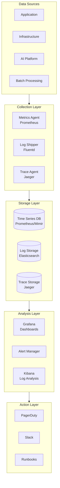
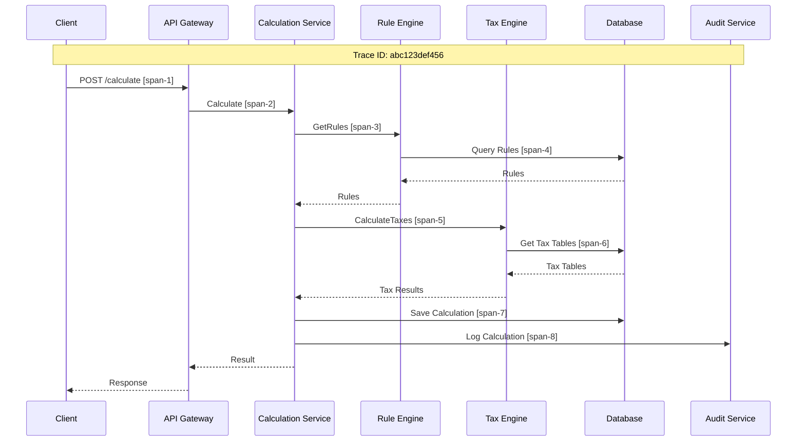

# Observability

> **Navigation**: [Index](./00-index.md) | [Requirements](./01-requirements-and-estimations.md) | [HLD](./02-high-level-design.md) | [LLD](./03-low-level-design.md) | [Deep Dive](./04-deep-dive-and-bottlenecks.md) | [Scale](./05-scalability-and-reliability.md) | [Security](./06-security-and-compliance.md) | **Observability** | [Interview Guide](./08-interview-guide.md)

---

## 1. Observability Strategy

### 1.1 Three Pillars of Observability



### 1.2 Observability by Component

| Component | Metrics | Logs | Traces | Priority |
|-----------|---------|------|--------|----------|
| API Gateway | Request rate, latency, errors | Access logs, auth failures | Full request trace | P0 |
| Calculation Engine | Calculations/sec, accuracy, duration | Calculation details, exceptions | Per-employee trace | P0 |
| Rule Engine | Lookups/sec, cache hit ratio | Rule applications, conflicts | Rule resolution trace | P0 |
| AI Platform | Inference latency, throughput | Extraction results, confidence | Extraction pipeline trace | P1 |
| Batch Processing | Pay run progress, worker utilization | Job status, failures | End-to-end pay run | P0 |
| Database | Connections, query latency, replication lag | Slow queries, errors | Query traces | P0 |

---

## 2. Metrics

### 2.1 Pay Run Metrics (Critical)

```
# Pay Run Completion
payroll_pay_runs_total{tenant, status}
payroll_pay_runs_duration_seconds{tenant, employee_count_bucket}
payroll_pay_runs_deadline_margin_seconds{tenant}

# Calculation Metrics
payroll_calculations_total{tenant, status}
payroll_calculations_duration_seconds{quantile="0.5,0.95,0.99"}
payroll_calculations_per_second{tenant}

# Error Metrics
payroll_calculation_errors_total{tenant, error_type}
payroll_validation_failures_total{tenant, validation_type}

# Accuracy Metrics
payroll_pay_variance_dollars{tenant, variance_bucket}
payroll_recalculations_total{tenant, reason}
```

### 2.2 Rule Engine Metrics

```
# Rule Lookup Performance
payroll_rule_lookups_total{jurisdiction, rule_type}
payroll_rule_lookup_duration_seconds{quantile="0.5,0.95,0.99"}
payroll_rule_cache_hits_total{cache_level}
payroll_rule_cache_misses_total{cache_level}

# Rule Coverage
payroll_active_rules_count{jurisdiction, rule_type}
payroll_rules_pending_approval_count{}
payroll_rule_coverage_gaps_total{jurisdiction}

# Rule Conflicts
payroll_rule_conflicts_detected_total{jurisdiction}
payroll_rule_conflicts_resolved_total{resolution_type}
```

### 2.3 AI Platform Metrics

```
# Document Processing
payroll_documents_processed_total{document_type, status}
payroll_document_processing_duration_seconds{document_type, quantile}

# Rule Extraction
payroll_rules_extracted_total{confidence_bucket}
payroll_extraction_confidence_histogram{quantile}
payroll_extraction_precision{}  # Post-review measurement
payroll_extraction_recall{}

# LLM Inference
payroll_llm_inference_total{model, operation}
payroll_llm_inference_duration_seconds{model, quantile}
payroll_llm_tokens_processed_total{model, direction}
payroll_llm_queue_depth{}

# Human Review
payroll_review_queue_depth{}
payroll_review_turnaround_seconds{quantile}
payroll_review_approval_rate{}
payroll_review_modification_rate{}
```

### 2.4 Compliance Metrics

```
# Pay Run Compliance
payroll_late_pay_runs_total{tenant}
payroll_pay_deadline_misses_total{tenant}
payroll_compliance_violations_total{tenant, violation_type}

# Tax Filing
payroll_tax_filings_total{filing_type, status}
payroll_tax_filing_deadline_margin_hours{filing_type}

# Audit Trail
payroll_audit_log_entries_total{operation_type}
payroll_audit_log_integrity_checks_total{status}

# Data Protection
payroll_encryption_operations_total{operation, field_type}
payroll_access_control_denials_total{resource, reason}
```

### 2.5 Infrastructure Metrics (USE Method)

```
# CPU
node_cpu_utilization_percent{instance, role}
container_cpu_throttled_seconds_total{pod}

# Memory
node_memory_utilization_percent{instance}
container_memory_working_set_bytes{pod}

# Network
node_network_receive_bytes_total{instance}
node_network_transmit_bytes_total{instance}

# Storage
node_disk_utilization_percent{instance, device}
node_disk_io_time_seconds_total{instance, device}

# Database
db_connections_active{instance}
db_connections_waiting{instance}
db_replication_lag_seconds{instance}
db_query_duration_seconds{query_type, quantile}
```

---

## 3. Logging

### 3.1 Log Levels & Usage

| Level | Usage | Examples |
|-------|-------|----------|
| **ERROR** | Failures requiring attention | Calculation failure, DB connection error |
| **WARN** | Potential issues | High queue depth, slow query, low confidence extraction |
| **INFO** | Normal operations | Pay run started, calculation completed, rule approved |
| **DEBUG** | Troubleshooting detail | Rule lookup parameters, calculation breakdown |
| **TRACE** | Detailed debugging | Full request/response, intermediate values |

### 3.2 Structured Log Format

```json
{
  "timestamp": "2025-01-15T14:30:00.123Z",
  "level": "INFO",
  "service": "calculation-engine",
  "trace_id": "abc123def456",
  "span_id": "span789",
  "tenant_id": "tenant-uuid",
  "employee_id": "emp-uuid",
  "pay_run_id": "run-uuid",
  "operation": "gross_to_net_calculation",
  "duration_ms": 150,
  "status": "success",
  "details": {
    "gross_pay": 4875.00,
    "net_pay": 3231.27,
    "rules_applied": 12,
    "jurisdictions": ["FEDERAL", "CA", "LA_CITY"]
  },
  "context": {
    "user_id": "user-uuid",
    "request_id": "req-uuid",
    "source_ip": "192.168.1.100"
  }
}
```

### 3.3 Sensitive Data Handling in Logs

| Field | Logging Policy | Example |
|-------|----------------|---------|
| SSN | Never log | `[REDACTED]` |
| Bank Account | Never log | `[REDACTED]` |
| Salary | Log hash only | `salary_hash: abc123` |
| Employee Name | Log first initial + last | `J. Smith` |
| Tax Elections | Log type only | `election_type: federal_w4` |
| Addresses | Log city/state only | `Los Angeles, CA` |

### 3.4 Key Log Events

```
CRITICAL LOG EVENTS (Always Capture):

Pay Run Events:
  - pay_run.started: {pay_run_id, tenant_id, employee_count}
  - pay_run.calculation_completed: {pay_run_id, duration_ms}
  - pay_run.approved: {pay_run_id, approved_by}
  - pay_run.failed: {pay_run_id, error_type, details}

Calculation Events:
  - calculation.started: {calculation_id, employee_id}
  - calculation.rule_applied: {calculation_id, rule_id, result}
  - calculation.completed: {calculation_id, gross, net, duration_ms}
  - calculation.error: {calculation_id, error_type, stack_trace}

Rule Events:
  - rule.extracted: {extraction_id, document_id, confidence}
  - rule.approved: {rule_id, approved_by, effective_date}
  - rule.rejected: {rule_id, rejected_by, reason}
  - rule.activated: {rule_id, jurisdiction, tenant_count_affected}

Security Events:
  - auth.login_success: {user_id, method, source_ip}
  - auth.login_failure: {user_email, reason, source_ip}
  - access.denied: {user_id, resource, action, reason}
  - data.accessed: {user_id, resource_type, record_id}
```

---

## 4. Distributed Tracing

### 4.1 Trace Propagation



### 4.2 Key Spans

| Span Name | Parent | Attributes |
|-----------|--------|------------|
| `api.request` | Root | method, path, status_code |
| `calculation.gross_to_net` | api.request | employee_id, gross, net |
| `rule_engine.get_rules` | calculation | jurisdiction_count, rule_count |
| `rule_engine.cache_lookup` | get_rules | cache_level, hit |
| `tax_engine.federal` | calculation | taxable_gross, tax_amount |
| `tax_engine.state` | calculation | state, tax_amount |
| `db.query` | Various | query_type, duration_ms |
| `audit.log` | calculation | operation, entity_id |

### 4.3 Trace Sampling Strategy

| Condition | Sampling Rate | Reason |
|-----------|---------------|--------|
| Error response | 100% | Debug all errors |
| High latency (>2s) | 100% | Performance issues |
| Pay run calculation | 10% | Representative sample |
| Rule extraction | 100% | Critical for audit |
| Normal API call | 1% | Cost management |
| Health check | 0% | Noise reduction |

---

## 5. Dashboards

### 5.1 Executive Dashboard

```
┌─────────────────────────────────────────────────────────────────┐
│                    PAYROLL OPERATIONS DASHBOARD                 │
├─────────────────────────────────────────────────────────────────┤
│                                                                 │
│  TODAY'S PAY RUNS          CALCULATION ACCURACY                 │
│  ┌─────────────────┐       ┌─────────────────┐                 │
│  │ Completed: 45   │       │ 100% ✓          │                 │
│  │ In Progress: 3  │       │ Errors: 0       │                 │
│  │ Failed: 0       │       │ Variance: $0.00 │                 │
│  └─────────────────┘       └─────────────────┘                 │
│                                                                 │
│  EMPLOYEES PROCESSED        COMPLIANCE STATUS                   │
│  ┌─────────────────┐       ┌─────────────────┐                 │
│  │ Today: 125,432  │       │ Rules: 100%     │                 │
│  │ MTD: 2.3M       │       │ Filings: On Time│                 │
│  │ YTD: 28.5M      │       │ Audit: Clear    │                 │
│  └─────────────────┘       └─────────────────┘                 │
│                                                                 │
│  [========================================] 100% System Health  │
│                                                                 │
└─────────────────────────────────────────────────────────────────┘
```

### 5.2 Pay Run Operations Dashboard

```
┌─────────────────────────────────────────────────────────────────┐
│                      PAY RUN MONITOR                            │
├─────────────────────────────────────────────────────────────────┤
│                                                                 │
│  ACTIVE PAY RUNS                                               │
│  ┌─────────────────────────────────────────────────────────┐   │
│  │ Tenant        │ Status      │ Progress │ ETA   │ Alert  │   │
│  │ Acme Corp     │ Calculating │ 67%      │ 5 min │        │   │
│  │ Beta Inc      │ Review      │ 100%     │ -     │        │   │
│  │ Gamma LLC     │ Calculating │ 23%      │ 12min │ ⚠️ Slow │   │
│  └─────────────────────────────────────────────────────────┘   │
│                                                                 │
│  CALCULATION THROUGHPUT (Last Hour)                            │
│  ┌─────────────────────────────────────────────────────────┐   │
│  │                                                         │   │
│  │  2000 │    ╱╲                                           │   │
│  │       │   ╱  ╲    ╱╲                                    │   │
│  │  1000 │  ╱    ╲  ╱  ╲  ╱╲                              │   │
│  │       │ ╱      ╲╱    ╲╱  ╲                             │   │
│  │     0 └─────────────────────────────────────────────   │   │
│  │       00:00  00:15  00:30  00:45  01:00                │   │
│  └─────────────────────────────────────────────────────────┘   │
│                                                                 │
│  WORKER POOL                     ERROR RATE                     │
│  ├── Active: 45/100             ├── 0.00%                      │
│  ├── Queue Depth: 230           ├── Last Error: None           │
│  └── Avg Duration: 150ms        └── 24h Errors: 0              │
│                                                                 │
└─────────────────────────────────────────────────────────────────┘
```

### 5.3 AI Platform Dashboard

```
┌─────────────────────────────────────────────────────────────────┐
│                    AI EXTRACTION MONITOR                        │
├─────────────────────────────────────────────────────────────────┤
│                                                                 │
│  EXTRACTION PIPELINE                                            │
│  ┌─────────────────────────────────────────────────────────┐   │
│  │ Ingested → OCR → NLP → LLM → Review → Active            │   │
│  │    25    →  22  →  22 →  15  →   8   →   5              │   │
│  └─────────────────────────────────────────────────────────┘   │
│                                                                 │
│  EXTRACTION CONFIDENCE DISTRIBUTION                            │
│  ┌─────────────────────────────────────────────────────────┐   │
│  │  >90%  ████████████████████████████  68%                │   │
│  │  80-90 ████████████  24%                                │   │
│  │  70-80 ████  6%                                         │   │
│  │  <70%  ██  2%                                           │   │
│  └─────────────────────────────────────────────────────────┘   │
│                                                                 │
│  HUMAN REVIEW METRICS           LLM PERFORMANCE                │
│  ├── Pending: 8                 ├── Latency p50: 450ms         │
│  ├── Avg Turnaround: 4h        ├── Latency p99: 2.1s          │
│  ├── Approval Rate: 92%        ├── Throughput: 50 req/min     │
│  └── Modification Rate: 6%     └── GPU Util: 78%              │
│                                                                 │
└─────────────────────────────────────────────────────────────────┘
```

### 5.4 Compliance Dashboard

```
┌─────────────────────────────────────────────────────────────────┐
│                   COMPLIANCE MONITOR                            │
├─────────────────────────────────────────────────────────────────┤
│                                                                 │
│  REGULATORY DEADLINES                                           │
│  ┌─────────────────────────────────────────────────────────┐   │
│  │ Filing           │ Due Date   │ Status    │ Days Left  │   │
│  │ Q4 941 Filing    │ Jan 31     │ Ready     │ 16         │   │
│  │ W-2 Distribution │ Jan 31     │ In Prog   │ 16         │   │
│  │ 1099 Filing      │ Jan 31     │ Ready     │ 16         │   │
│  │ CA DE-9 Q4       │ Jan 31     │ Pending   │ 16         │   │
│  └─────────────────────────────────────────────────────────┘   │
│                                                                 │
│  RULE COVERAGE BY JURISDICTION                                  │
│  ┌─────────────────────────────────────────────────────────┐   │
│  │ Federal    ████████████████████████████████████ 100%    │   │
│  │ States     ████████████████████████████████  98%        │   │
│  │ Local      ████████████████████████████  94%            │   │
│  │ Gaps: NYC new law (pending), SF HCSO update             │   │
│  └─────────────────────────────────────────────────────────┘   │
│                                                                 │
│  AUDIT LOG INTEGRITY           COMPLIANCE VIOLATIONS           │
│  ├── Last Check: 5 min ago     ├── This Month: 0               │
│  ├── Status: ✓ Verified        ├── This Year: 2                │
│  └── Chain Valid: Yes          └── Resolved: 2                 │
│                                                                 │
└─────────────────────────────────────────────────────────────────┘
```

---

## 6. Alerting

### 6.1 Alert Severity Levels

| Level | Response Time | Examples | Notification |
|-------|---------------|----------|--------------|
| **P0 - Critical** | Immediate (24/7) | Pay run failure, data breach | Page, phone call |
| **P1 - High** | 15 minutes | High error rate, deadline risk | Page, Slack |
| **P2 - Medium** | 1 hour | Elevated latency, queue backlog | Slack, email |
| **P3 - Low** | Next business day | Non-critical warnings | Email, ticket |

### 6.2 Critical Alerts (P0)

```yaml
# Pay Run Failure
- alert: PayRunFailed
  expr: payroll_pay_runs_total{status="failed"} > 0
  for: 0m
  labels:
    severity: critical
  annotations:
    summary: "Pay run failed for tenant {{ $labels.tenant }}"
    runbook: "https://runbooks/pay-run-failure"

# Pay Deadline at Risk
- alert: PayDeadlineAtRisk
  expr: payroll_pay_runs_deadline_margin_seconds < 3600
  for: 5m
  labels:
    severity: critical
  annotations:
    summary: "Pay run may miss deadline - {{ $value }}s remaining"
    runbook: "https://runbooks/pay-deadline-risk"

# Calculation Accuracy Issue
- alert: CalculationAccuracyAlert
  expr: payroll_calculation_errors_total > 0
  for: 0m
  labels:
    severity: critical
  annotations:
    summary: "Calculation error detected - {{ $value }} errors"
    runbook: "https://runbooks/calculation-error"

# Database Primary Down
- alert: DatabasePrimaryDown
  expr: up{job="postgres-primary"} == 0
  for: 30s
  labels:
    severity: critical
  annotations:
    summary: "Database primary is down"
    runbook: "https://runbooks/database-failover"
```

### 6.3 High Priority Alerts (P1)

```yaml
# High Error Rate
- alert: HighErrorRate
  expr: rate(payroll_calculation_errors_total[5m]) > 0.01
  for: 5m
  labels:
    severity: high
  annotations:
    summary: "Error rate exceeds 1%"

# AI Pipeline Down
- alert: AIPipelineDown
  expr: up{job="llm-service"} == 0
  for: 2m
  labels:
    severity: high
  annotations:
    summary: "LLM service unavailable"

# Tax Filing Deadline Approaching
- alert: TaxFilingDeadlineApproaching
  expr: payroll_tax_filing_deadline_margin_hours < 48
  for: 1h
  labels:
    severity: high
  annotations:
    summary: "Tax filing deadline in {{ $value }} hours"

# High Human Review Backlog
- alert: ReviewBacklogHigh
  expr: payroll_review_queue_depth > 50
  for: 30m
  labels:
    severity: high
  annotations:
    summary: "{{ $value }} rules pending human review"
```

### 6.4 Alert Routing

```yaml
routes:
  - match:
      severity: critical
    receiver: pagerduty-critical
    continue: true

  - match:
      severity: critical
    receiver: slack-critical

  - match:
      severity: high
    receiver: pagerduty-high

  - match:
      severity: high
    receiver: slack-alerts

  - match:
      severity: medium
    receiver: slack-alerts

  - match:
      severity: low
    receiver: email-alerts

receivers:
  - name: pagerduty-critical
    pagerduty_configs:
      - service_key: CRITICAL_SERVICE_KEY
        severity: critical

  - name: slack-critical
    slack_configs:
      - channel: '#payroll-critical'
        send_resolved: true

  - name: slack-alerts
    slack_configs:
      - channel: '#payroll-alerts'
        send_resolved: true
```

---

## 7. Runbooks

### 7.1 Pay Run Failure Runbook

```
RUNBOOK: Pay Run Failure
SEVERITY: Critical
ON-CALL: Payroll Operations

SYMPTOMS:
  - Alert: PayRunFailed
  - Pay run status = "failed" in dashboard
  - Customer reports pay run stuck

IMMEDIATE ACTIONS:
  1. Check pay run status in admin portal
  2. Identify failure phase (preparation, calculation, finalization)
  3. Check error logs for specific failure reason

COMMON CAUSES & FIXES:

Cause: Worker node failure
  - Check worker pod status: kubectl get pods -n payroll
  - Restart failed workers: kubectl delete pod <pod-name>
  - Workers auto-restart and resume from checkpoint

Cause: Database connection timeout
  - Check database status: pg_isready -h <host>
  - Check connection pool: SELECT * FROM pg_stat_activity
  - If needed, restart connection pooler

Cause: Rule lookup failure
  - Check rule cache status: redis-cli INFO
  - Clear and rebuild cache if corrupted
  - Fall back to direct database queries

ESCALATION:
  - If not resolved in 15 min, escalate to database DBA
  - If deadline at risk, notify customer success team
  - If data integrity concern, escalate to security team

POST-INCIDENT:
  - Document root cause
  - Create ticket for permanent fix
  - Update runbook if needed
```

### 7.2 AI Extraction Accuracy Drop Runbook

```
RUNBOOK: AI Extraction Accuracy Drop
SEVERITY: High
ON-CALL: AI Platform Team

SYMPTOMS:
  - Alert: ExtractionAccuracyDrop
  - Human approval rate dropping
  - Confidence scores declining

INVESTIGATION:
  1. Check recent document types being processed
  2. Review sample of low-confidence extractions
  3. Check for model drift or data quality issues

COMMON CAUSES & FIXES:

Cause: New document format
  - Review sample documents
  - Update preprocessing pipeline if needed
  - Consider retraining NER model

Cause: Model degradation
  - Compare current vs baseline performance
  - Roll back to previous model version if needed
  - Queue retraining with recent approved samples

Cause: Prompt drift
  - Review extraction prompts
  - A/B test prompt variations
  - Update prompts and monitor results

ESCALATION:
  - If accuracy below 85%, pause auto-extraction
  - Route all new extractions to human review
  - Notify compliance team of potential delays
```
