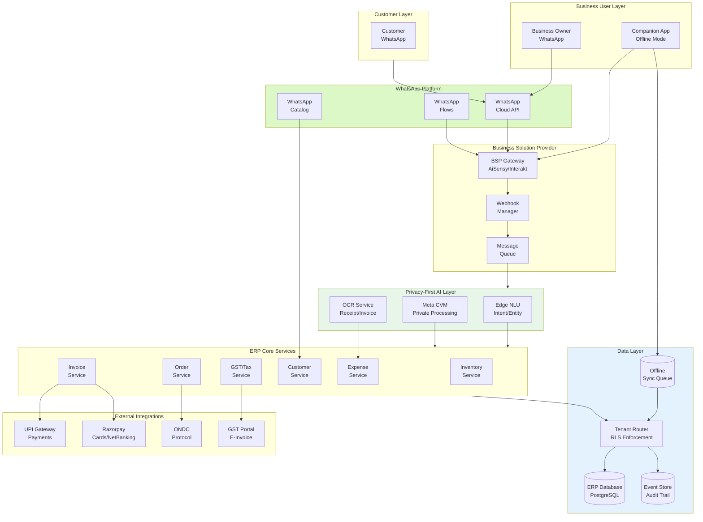

# WhatsApp Native ERP for SMB - System Design

[Back to System Design Index](../README.md)

---

## System Overview

A **WhatsApp Native ERP for SMB** is a revolutionary enterprise resource planning platform where WhatsApp serves as the primary interface for all business operations, eliminating the need for traditional web or mobile applications. Unlike conventional ERPs that use WhatsApp merely as a notification channel, this system enables complete business management through conversational interactions - inventory queries, order creation, invoice generation, and expense tracking all happen within the WhatsApp chat interface.

The defining architectural challenges include: (1) **WhatsApp Business API integration** with rate limiting, webhook reliability, and multi-lingual natural language understanding, (2) **privacy-first AI processing** using Meta's Confidential Virtual Machines (CVM) for processing business data without persistent storage, (3) **offline-first architecture** critical for regions with unreliable connectivity, and (4) **India-first compliance** supporting DPDP Act, GST, UPI payments, and ONDC integration.

Real-world implementations like AiSensy, Interakt, Gallabox, and WhatsApp Business Catalog demonstrate the viability of WhatsApp-native business tools, while this design extends the pattern to full ERP functionality for the 15+ million SMBs actively using WhatsApp for business in India alone.

---

## Key Characteristics

| Characteristic | Value | Implication |
|----------------|-------|-------------|
| **Traffic Pattern** | Message-driven, bursty (festival spikes) | Priority queuing, predictive scaling |
| **Consistency Model** | Strong for orders/invoices, Eventual for analytics | Event sourcing, offline sync |
| **Availability Target** | 99.9% core, graceful degradation when WhatsApp down | SMS/app fallback, offline queue |
| **Latency Target** | <2s message response, <5s AI extraction | Edge NLU, batched processing |
| **Privacy Requirement** | Critical - CVM-based AI, no persistent message storage | Meta Private Processing, ephemeral keys |
| **Compliance Requirement** | India DPDP, GST, UPI | Data localization, tax automation |
| **AI Integration** | Privacy-first - CVM + Edge NLU + On-device | No self-hosted LLMs, Meta infrastructure |

---

## Complexity Rating

| Aspect | Rating | Reason |
|--------|--------|--------|
| **Overall** | High | WhatsApp API + AI + compliance + offline-first |
| **WhatsApp API Integration** | High | Rate limits, webhooks, Flows, multi-tenancy |
| **Privacy-First AI** | High | CVM architecture, ephemeral processing, no storage |
| **Offline-First Sync** | Medium-High | Conflict resolution, reconnection, queue management |
| **India Compliance** | Medium | DPDP, GST, UPI - well-documented but complex |
| **Multi-Tenant Data** | Medium | Shared DB with RLS, tenant-specific encryption |

---

## Quick Navigation

| Document | Description |
|----------|-------------|
| [01 - Requirements & Estimations](./01-requirements-and-estimations.md) | Functional/Non-functional requirements, capacity for 100K SMBs |
| [02 - High-Level Design](./02-high-level-design.md) | Architecture, WhatsApp integration, AI layers, data flows |
| [03 - Low-Level Design](./03-low-level-design.md) | Data model, conversation APIs, multi-lingual NLU |
| [04 - Deep Dive & Bottlenecks](./04-deep-dive-and-bottlenecks.md) | Rate limiting, offline sync, privacy-first AI |
| [05 - Scalability & Reliability](./05-scalability-and-reliability.md) | Festival spikes, degradation modes, disaster recovery |
| [06 - Security & Compliance](./06-security-and-compliance.md) | India DPDP, GST, E2E encryption, threat model |
| [07 - Observability](./07-observability.md) | SMB health metrics, WhatsApp-specific monitoring |
| [08 - Interview Guide](./08-interview-guide.md) | 45-min pacing, trap questions, unique aspects |

---

## WhatsApp-Native vs Traditional ERP

| Aspect | Traditional ERP | WhatsApp-Native ERP |
|--------|-----------------|---------------------|
| **Primary Interface** | Web/Mobile SPA | WhatsApp chat |
| **Learning Curve** | High - forms, menus | Zero - natural conversation |
| **App Installation** | Required | Not required (WhatsApp already installed) |
| **User Adoption** | 10-30% of employees | 100% (everyone uses WhatsApp) |
| **Offline Capability** | App-specific | WhatsApp handles queuing |
| **AI Processing** | Self-hosted LLMs | Privacy-first CVM (Meta) |
| **Regional Language** | Limited | Native Hindi/Hinglish support |
| **Target Market** | Enterprise | SMB/Micro-business |
| **Cost Structure** | Per-seat licensing | Per-message + subscription |

---

## Core ERP Modules (WhatsApp-Native)

| Module | WhatsApp Interaction | AI Enhancement |
|--------|---------------------|----------------|
| **Inventory** | "Kitna stock hai iPhone ka?" → Stock response | Low stock alerts, reorder suggestions |
| **Orders** | WhatsApp Flow → Order wizard | Auto-extract from customer messages |
| **Invoicing** | "Invoice banao [customer]" → PDF shared | GST auto-calculation, payment link |
| **Customers** | Catalog sync, order history lookup | Segment-based messaging |
| **Expenses** | Photo of receipt → Auto-logged | OCR extraction, categorization |
| **Accounting** | "Aaj ka sale batao" → Daily summary | Cash flow prediction |

---

## Architecture Overview



---

## When to Use This Design

**Use WhatsApp-Native ERP When:**
- Target market is SMB/micro-businesses in emerging markets
- Users are already on WhatsApp (India: 500M+ users)
- Traditional app adoption is a barrier
- Regional language support is critical (Hindi, Tamil, etc.)
- Privacy-first AI is required (no self-hosted data)
- Offline capability is essential
- GST/UPI integration is needed (India)

**Do NOT Use When:**
- Enterprise with complex approval workflows (use traditional ERP)
- Heavy desktop usage required (forms, spreadsheets)
- Real-time collaborative editing needed
- WhatsApp penetration is low in target market
- Business processes can't be conversationalized

---

## Real-World Implementations & References

| Platform | Capability | Scale |
|----------|------------|-------|
| **AiSensy** | WhatsApp marketing, CRM, chatbots | Wipro, HomeLane, Fortune |
| **Interakt** | AI campaigns, customer support, shared inbox | 10K+ SMBs |
| **Gallabox** | Lead capture, automation, multi-agent | India SMB focus |
| **WhatsApp Catalog** | Native product catalog, cart | 50M+ business accounts |
| **JioMart on WhatsApp** | Full commerce via chat | 7x increase in orders |
| **Meta Private Processing** | CVM-based AI (April 2025) | WhatsApp-wide |

---

## Technology Stack (Reference)

| Layer | Technology Options | Selection Criteria |
|-------|-------------------|-------------------|
| **BSP Integration** | AiSensy, Interakt, Gallabox, Twilio | India presence, pricing, API quality |
| **Message Queue** | Redis Streams, RabbitMQ | Webhook throughput, ordering |
| **Edge NLU** | FastText, DistilBERT | Latency, multi-lingual |
| **OCR** | Tesseract, Google Vision API | Accuracy, cost |
| **ERP Database** | PostgreSQL with RLS | Multi-tenancy, JSON support |
| **Event Store** | Kafka, Pulsar | Durability, replay |
| **Payments** | Razorpay, UPI PSP | India support, fees |
| **SMS Fallback** | Twilio, Gupshup | Reliability, cost |

---

## Quick Reference Card

```
┌─────────────────────────────────────────────────────────────────┐
│      WHATSAPP NATIVE ERP FOR SMB - QUICK REFERENCE              │
├─────────────────────────────────────────────────────────────────┤
│                                                                 │
│  SCALE TARGETS               KEY PATTERNS                       │
│  ─────────────               ────────────                       │
│  • 100K+ SMB tenants         • WhatsApp-first (no web UI)       │
│  • 10M messages/day          • Privacy-first AI (CVM)           │
│  • 500K orders/day           • Offline-first sync               │
│  • 99.9% availability        • BSP integration (not direct)     │
│  • <2s response time         • Shared DB with RLS               │
│                                                                 │
├─────────────────────────────────────────────────────────────────┤
│                                                                 │
│  ERP MODULES                 WHATSAPP FEATURES USED             │
│  ───────────                 ─────────────────────              │
│  • Inventory                 • Cloud API (webhooks)             │
│  • Orders                    • Flows (structured input)         │
│  • Invoicing                 • Catalog (products)               │
│  • Customers                 • Interactive buttons              │
│  • Expenses                  • Document sharing (PDF)           │
│  • Basic Accounting          • Template messages                │
│                                                                 │
├─────────────────────────────────────────────────────────────────┤
│                                                                 │
│  INDIA COMPLIANCE            INTEGRATIONS                       │
│  ────────────────            ────────────                       │
│  • DPDP Act (data local)     • UPI payments                     │
│  • GST (CGST/SGST/IGST)      • Razorpay                         │
│  • E-Invoice                 • ONDC protocol                    │
│  • HSN codes                 • GST portal                       │
│                                                                 │
├─────────────────────────────────────────────────────────────────┤
│                                                                 │
│  INTERVIEW KEYWORDS                                             │
│  ─────────────────                                              │
│  WhatsApp Business API, BSP, Webhooks, WhatsApp Flows,          │
│  CVM (Confidential VM), Privacy-first AI, Edge NLU,             │
│  Offline-first, Message priority queue, Festival scaling,       │
│  India DPDP, GST compliance, UPI deep links, ONDC               │
│                                                                 │
└─────────────────────────────────────────────────────────────────┘
```

---

## Interview Readiness Checklist

| Topic | Must Know | Deep Dive |
|-------|-----------|-----------|
| WhatsApp API | Cloud API, webhooks, rate limits | Flows, catalog sync, template approval |
| AI Processing | Privacy-first concept | Meta CVM architecture, ephemeral keys |
| Multi-Tenancy | Shared DB with RLS | Tenant-specific encryption, isolation |
| Offline Sync | Queue-based, conflict resolution | CRDT patterns, logical clocks |
| India Compliance | DPDP basics, GST structure | Data localization, consent management |
| Scaling | Horizontal scaling, caching | Festival pre-scaling, degradation modes |
| Payments | UPI integration | Deep links, PSP architecture |

---

## Related Systems

- [AI Native Cloud ERP SaaS](../2.18-ai-native-cloud-erp-saas/00-index.md) - Enterprise ERP with self-hosted AI
- [AI Native ATS Cloud SaaS](../2.19-ai-native-ats-cloud-saas/00-index.md) - Recruiting system patterns
- [Compliance-First AI-Native Payroll Engine](../2.20-compliance-first-ai-native-payroll-engine/00-index.md) - Payroll compliance
- [Distributed Message Queue](../1.6-distributed-message-queue/00-index.md) - Message handling patterns
- [Identity & Access Management](../2.5-identity-access-management/00-index.md) - AuthN/AuthZ patterns

---

## References

- Meta Engineering Blog: "Building Private Processing for AI tools on WhatsApp" (April 2025)
- WhatsApp Business Platform documentation - Cloud API, Flows, Catalogs
- India Digital Personal Data Protection (DPDP) Act 2023
- AiSensy, Interakt, Gallabox documentation and pricing
- WhatsApp pricing restructure (July 2025) - per-message model
- JioMart WhatsApp commerce case study - 7x order increase
