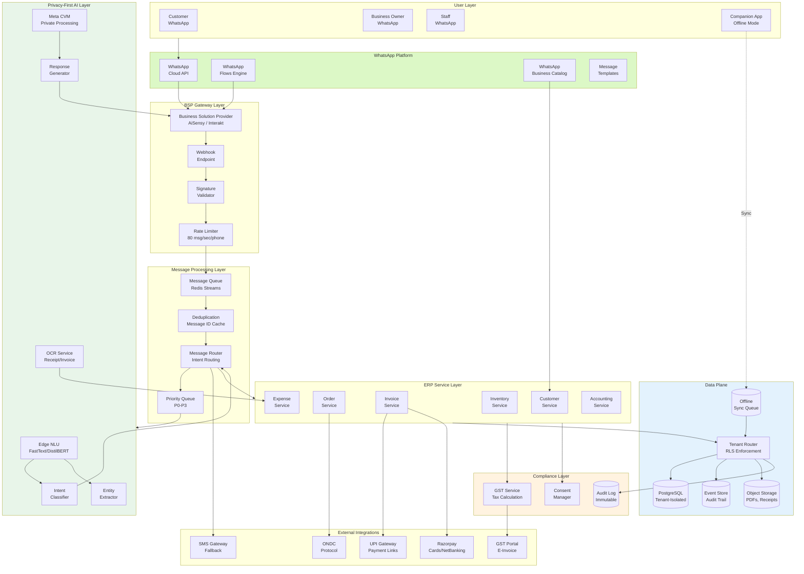
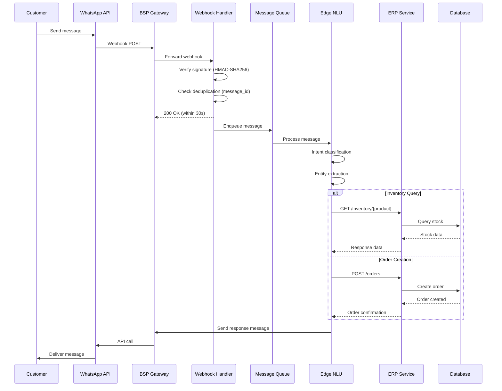
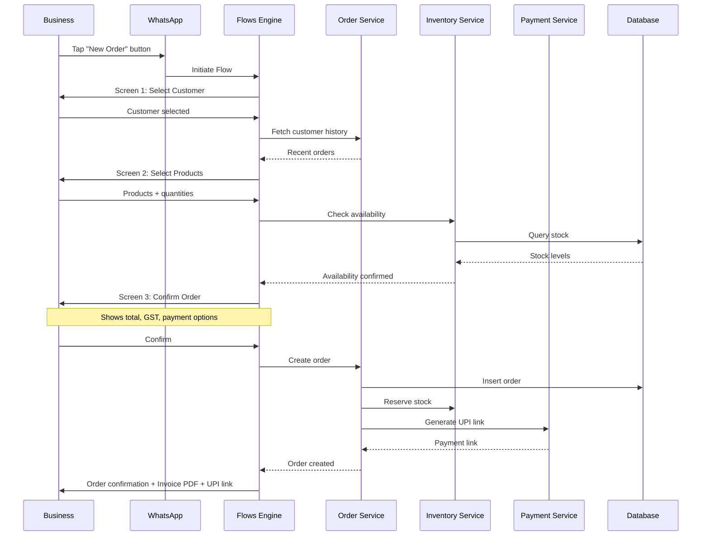
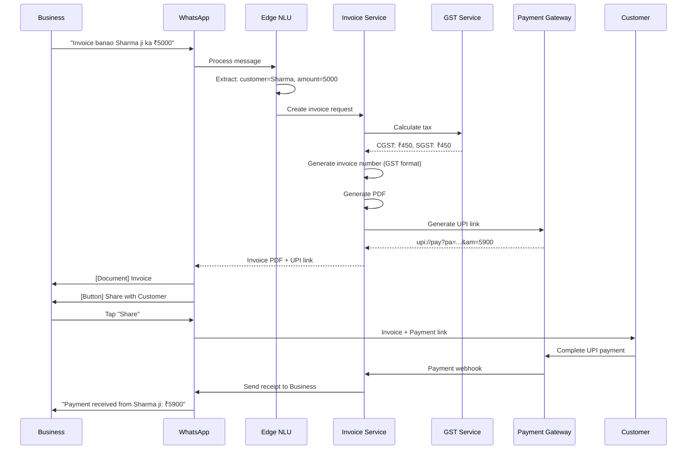
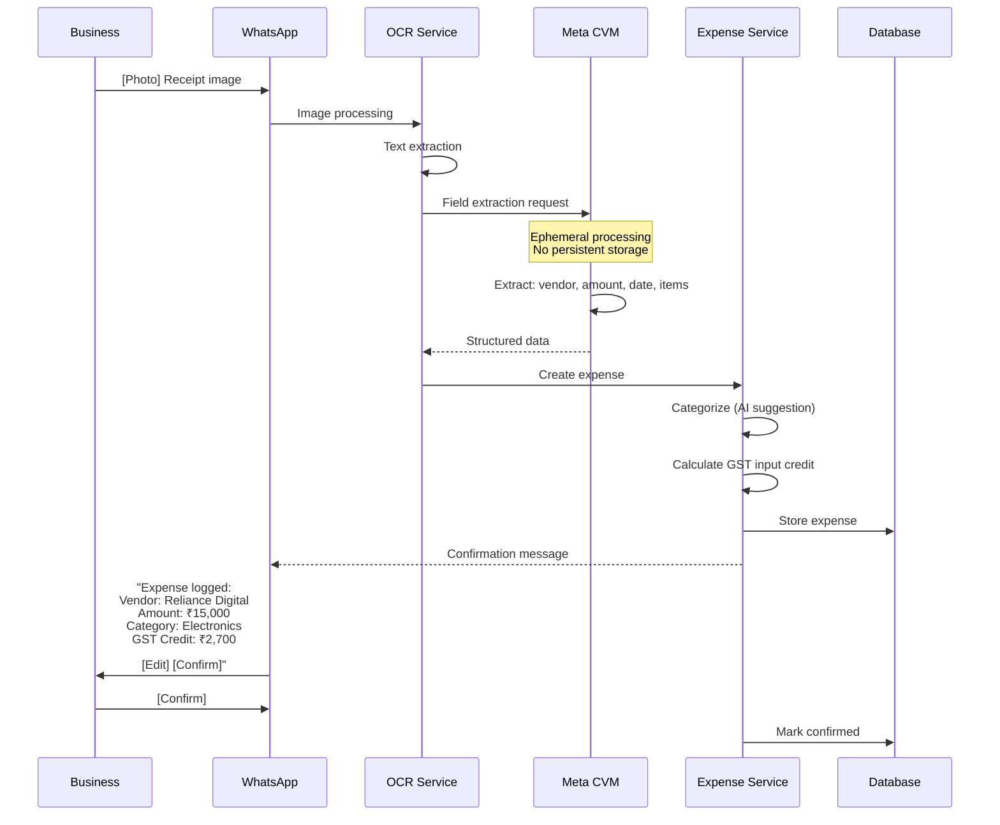
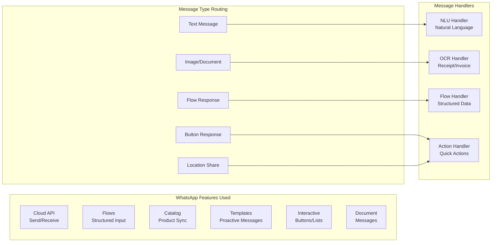
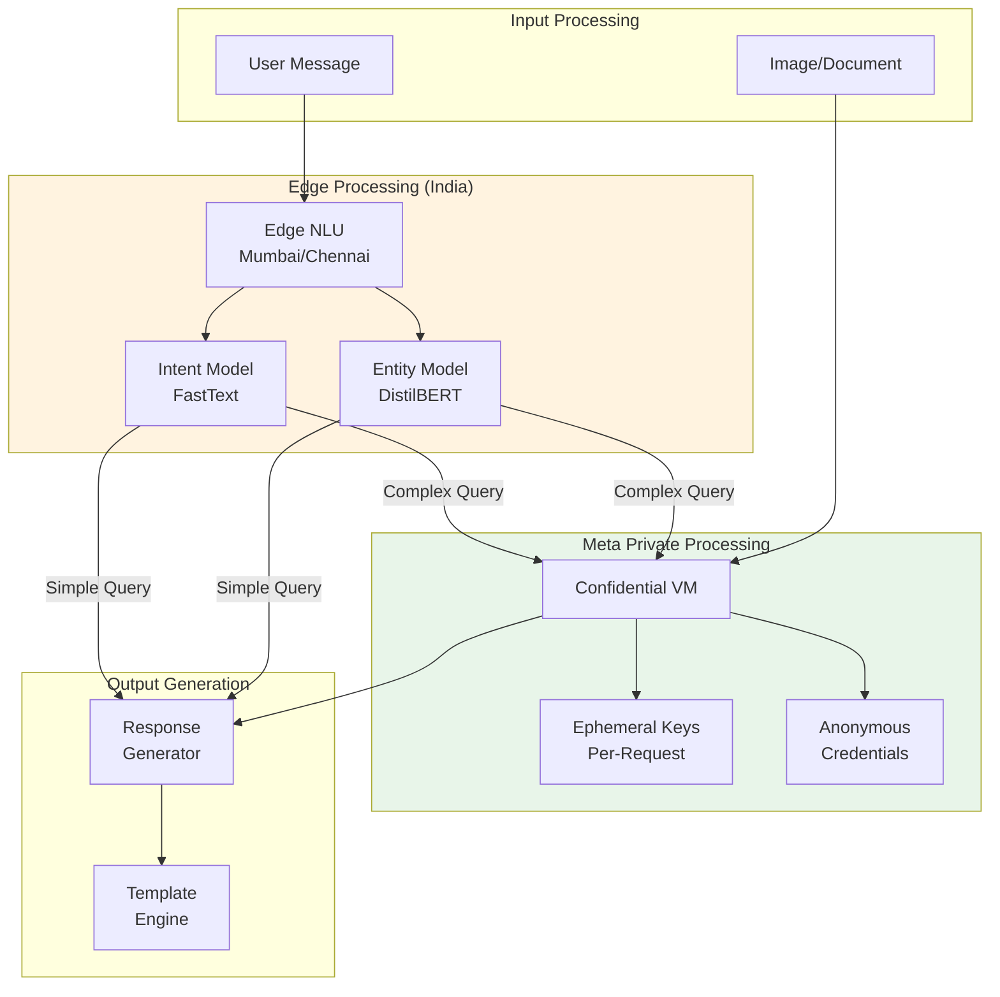
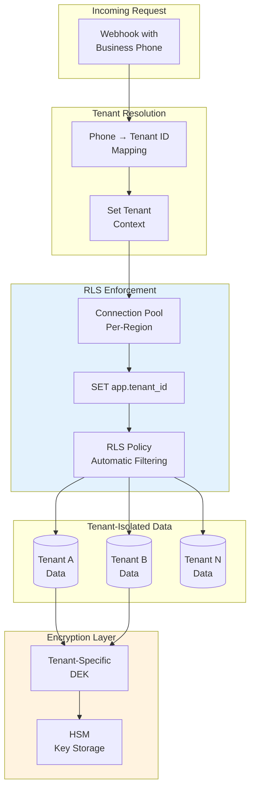
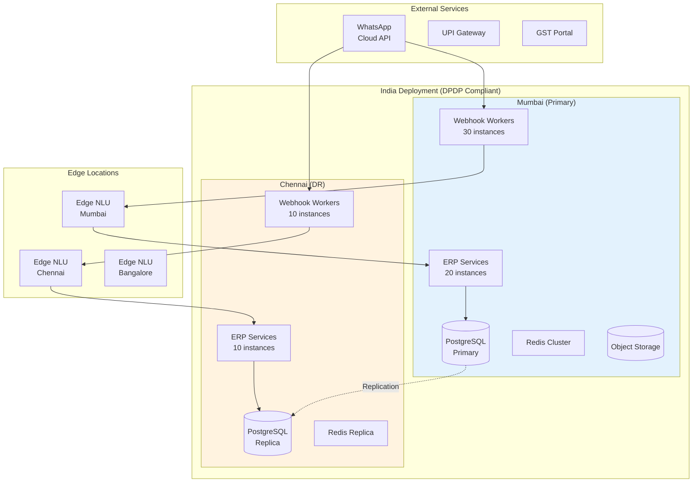

# High-Level Design

[Back to Index](./00-index.md)

---

## Architecture Principles

The WhatsApp Native ERP is architected around four foundational principles:

1. **WhatsApp-First**: All core business operations happen within WhatsApp - no traditional web/mobile UI required for daily operations
2. **Privacy-First AI**: Leverage Meta's CVM (Confidential Virtual Machines) for AI processing without persistent data storage
3. **Offline-First**: Operations continue seamlessly during connectivity issues, with automatic sync on reconnection
4. **India-First Compliance**: DPDP Act, GST, UPI, and ONDC as core requirements, not afterthoughts

---

## Architecture Layers

| Layer | Responsibility | Key Components |
|-------|---------------|----------------|
| **WhatsApp Platform** | User interface, message delivery | Cloud API, Flows, Catalog |
| **BSP Gateway** | API mediation, webhook management | AiSensy/Interakt/Gallabox |
| **Message Processing** | Routing, classification, queuing | Webhook handler, message router |
| **AI Layer** | NLU, OCR, intelligent responses | Edge NLU, Meta CVM, OCR service |
| **ERP Services** | Business logic | Inventory, Orders, Invoicing, etc. |
| **Data Plane** | Persistence, sync | PostgreSQL, Event Store, Sync Queue |
| **Integration Layer** | External services | Payments (UPI), Tax (GST), Commerce (ONDC) |

---

## Complete System Architecture

---

## Key Architectural Decisions

### Decision 1: BSP vs Direct Meta API

| Option | Pros | Cons |
|--------|------|------|
| **Direct Meta API** | Full control, no middleman fees | Complex setup, compliance burden, no local support |
| **BSP (Recommended)** | Faster onboarding, managed infrastructure, India presence, compliance handled | Per-message markup, vendor dependency |

**Decision**: Use BSP (AiSensy, Interakt, or Gallabox)

**Rationale**:
- 2-3 day onboarding vs 2-3 weeks direct
- Built-in compliance for India regulations
- Local support and documentation in Hindi
- Managed webhook infrastructure
- Cost difference minimal at SMB scale (~₹0.10-0.20/message markup)

---

### Decision 2: Privacy-First AI Architecture

| Option | Pros | Cons |
|--------|------|------|
| **Self-Hosted LLM (vLLM)** | Full control, no data leaves premises | GPU costs ($80K+/month), operational complexity |
| **External API (OpenAI/Anthropic)** | Easy integration, high quality | Data leaves India (DPDP violation), cost per token |
| **Meta CVM + Edge NLU (Recommended)** | Privacy-first, no persistent storage, leverages WhatsApp infrastructure | Limited customization, Meta dependency |

**Decision**: Meta CVM for complex reasoning + Edge NLU for intent/entity

**Rationale**:
- Meta's Private Processing (April 2025) provides CVM-based AI with ephemeral keys
- Edge NLU (FastText/DistilBERT) handles 90% of requests (intent + entity) locally
- No business data stored in AI systems
- DPDP-compliant by design
- Cost-effective for SMB scale

---

### Decision 3: Multi-Tenancy Model

| Option | Pros | Cons |
|--------|------|------|
| **Database per Tenant** | Maximum isolation, easy backup/restore | High cost at 100K tenants, operational overhead |
| **Schema per Tenant** | Good isolation, moderate cost | Schema migration complexity |
| **Shared DB with RLS (Recommended)** | Cost-effective, simple operations | Requires careful RLS implementation |

**Decision**: Shared PostgreSQL with Row-Level Security

**Rationale**:
- 100K SMBs = cost is critical constraint
- Average SMB: <1000 transactions/month
- PostgreSQL RLS provides strong logical isolation
- Tenant-specific encryption keys for sensitive data
- Upgrade path to dedicated for large tenants

---

### Decision 4: Message Processing Pattern

| Option | Pros | Cons |
|--------|------|------|
| **Synchronous Processing** | Simple, immediate response | Timeout risk, no retry, blocking |
| **Async with Priority Queue (Recommended)** | Graceful degradation, priority handling, retry | Slight latency increase, complexity |

**Decision**: Async processing with priority queue

**Rationale**:
- WhatsApp webhooks have 30-second timeout
- Festival spikes need backpressure handling
- Critical messages (payments) need priority
- Failed messages need retry mechanism

**Priority Levels**:
- **P0**: Payment callbacks, order confirmations
- **P1**: Inventory updates, order creation
- **P2**: Queries, reports
- **P3**: Marketing, bulk messages

---

### Decision 5: Offline-First Strategy

| Option | Pros | Cons |
|--------|------|------|
| **Online-Only** | Simple architecture | Unusable in low connectivity |
| **Companion App Offline (Recommended)** | Full offline capability, WhatsApp handles message queuing | Two sync paths, conflict resolution needed |

**Decision**: Companion app with offline queue + WhatsApp as secondary sync channel

**Rationale**:
- India has significant connectivity gaps
- WhatsApp already handles message queuing offline
- Companion app enables full ERP functionality offline
- Conflict resolution: Last-Write-Wins for most, server-authoritative for inventory

---

## Data Flow Diagrams

### Flow 1: Message Processing Pipeline

### Flow 2: Order Creation via WhatsApp Flow

### Flow 3: Invoice Generation & Payment

### Flow 4: Expense Tracking via Receipt Photo

---

## Component Design

### WhatsApp Integration Component

### Privacy-First AI Component

### Multi-Tenant Data Component

---

## Architecture Pattern Checklist

| Pattern | Decision | Rationale |
|---------|----------|-----------|
| **Sync vs Async** | Async with priority queue | WhatsApp timeout handling, graceful degradation |
| **Event-driven vs Request-response** | Hybrid - Events for audit, Request for queries | Audit trail + immediate responses |
| **Push vs Pull** | Push (WhatsApp webhooks) + Pull (companion app sync) | Real-time + offline support |
| **Stateless vs Stateful** | Stateless services, stateful data layer | Horizontal scaling, session in database |
| **Read-heavy vs Write-heavy** | Mixed - read for queries, write for transactions | Separate read replicas for reports |
| **Real-time vs Batch** | Real-time for operations, batch for reports/GST export | User experience + compliance |
| **Edge vs Origin** | Edge for NLU, Origin for transactions | Latency for AI, consistency for data |

---

## Technology Stack

| Component | Technology | Selection Rationale |
|-----------|------------|---------------------|
| **BSP** | AiSensy / Interakt | India presence, Hindi docs, competitive pricing |
| **Message Queue** | Redis Streams | Simplicity, ordering, persistence |
| **Edge NLU** | FastText + DistilBERT | Multilingual, low latency, small footprint |
| **OCR** | Google Vision API / Tesseract | Accuracy vs cost trade-off |
| **ERP Database** | PostgreSQL 15+ | RLS, JSONB, mature ecosystem |
| **Event Store** | PostgreSQL (append-only table) | Simplicity, same DB, strong consistency |
| **Object Storage** | Object Storage (S3-compatible) | PDFs, receipts, scalable |
| **Cache** | Redis | Session, tenant context, deduplication |
| **Payment** | Razorpay + UPI PSP | India coverage, UPI deep links |
| **SMS Fallback** | Gupshup / Twilio | India rates, reliability |

---

## Deployment Architecture

---

## Failure Scenarios & Handling

| Failure | Detection | Handling |
|---------|-----------|----------|
| **WhatsApp API Down** | Health check fails | Route to SMS fallback for critical |
| **BSP Unavailable** | Webhook errors | Queue locally, retry with backoff |
| **Edge NLU Timeout** | Latency >500ms | Use template responses |
| **Database Failover** | Connection errors | Automatic failover to Chennai |
| **Payment Callback Missed** | Reconciliation check | Polling backup for pending payments |
| **OCR Service Overloaded** | Queue depth >1000 | Defer non-critical, notify user |

---

## Integration Points Summary

| Integration | Protocol | Purpose |
|-------------|----------|---------|
| **WhatsApp Cloud API** | REST + Webhooks | Message send/receive |
| **WhatsApp Flows** | JSON schema | Structured input capture |
| **WhatsApp Catalog** | API sync | Product listing |
| **UPI** | Deep links + Webhooks | Payment collection |
| **Razorpay** | REST + Webhooks | Card/NetBanking |
| **GST Portal** | E-invoice API | Invoice submission |
| **ONDC** | Protocol API | Marketplace orders |
| **SMS Gateway** | REST | Fallback channel |
