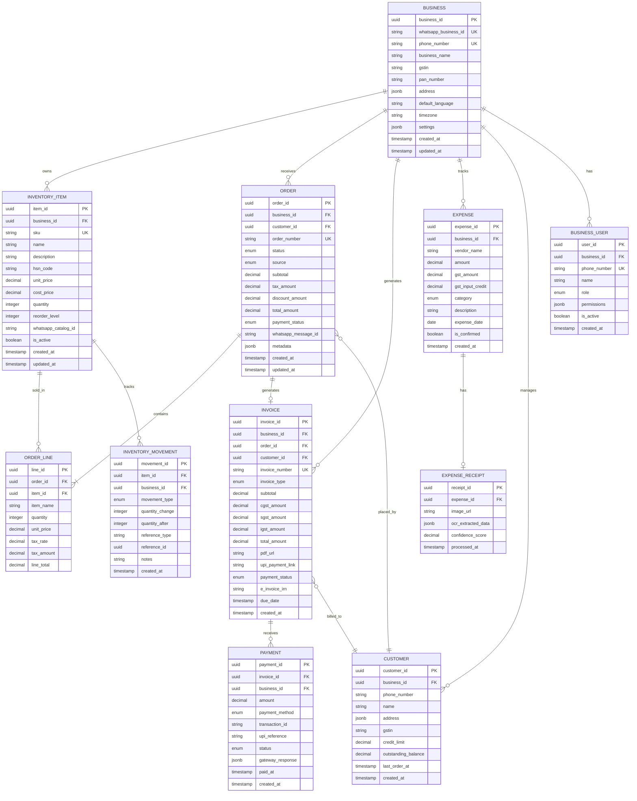

# Low-Level Design

[Back to Index](./00-index.md)

---

## Data Model

### Entity Relationship Diagram



### Core Tables Schema

#### Business (Tenant)

```sql
CREATE TABLE business (
    business_id UUID PRIMARY KEY DEFAULT gen_random_uuid(),
    whatsapp_business_id VARCHAR(50) UNIQUE NOT NULL,
    phone_number VARCHAR(15) UNIQUE NOT NULL,
    business_name VARCHAR(255) NOT NULL,
    gstin VARCHAR(15),
    pan_number VARCHAR(10),
    address JSONB DEFAULT '{}',
    default_language VARCHAR(10) DEFAULT 'hi',
    timezone VARCHAR(50) DEFAULT 'Asia/Kolkata',
    settings JSONB DEFAULT '{}',
    subscription_tier VARCHAR(20) DEFAULT 'free',
    subscription_expires_at TIMESTAMP,
    created_at TIMESTAMP DEFAULT NOW(),
    updated_at TIMESTAMP DEFAULT NOW()
);

-- Indexes
CREATE INDEX idx_business_phone ON business(phone_number);
CREATE INDEX idx_business_gstin ON business(gstin) WHERE gstin IS NOT NULL;
```

#### Inventory Item

```sql
CREATE TABLE inventory_item (
    item_id UUID PRIMARY KEY DEFAULT gen_random_uuid(),
    business_id UUID NOT NULL REFERENCES business(business_id),
    sku VARCHAR(50) NOT NULL,
    name VARCHAR(255) NOT NULL,
    description TEXT,
    hsn_code VARCHAR(8),
    unit_price DECIMAL(12, 2) NOT NULL,
    cost_price DECIMAL(12, 2),
    quantity INTEGER DEFAULT 0,
    reorder_level INTEGER DEFAULT 10,
    whatsapp_catalog_id VARCHAR(100),
    is_active BOOLEAN DEFAULT true,
    created_at TIMESTAMP DEFAULT NOW(),
    updated_at TIMESTAMP DEFAULT NOW(),

    UNIQUE(business_id, sku)
);

-- RLS Policy
ALTER TABLE inventory_item ENABLE ROW LEVEL SECURITY;

CREATE POLICY inventory_item_tenant_isolation ON inventory_item
    USING (business_id = current_setting('app.tenant_id')::UUID);

-- Indexes
CREATE INDEX idx_inventory_business ON inventory_item(business_id);
CREATE INDEX idx_inventory_name ON inventory_item(business_id, name);
CREATE INDEX idx_inventory_low_stock ON inventory_item(business_id, quantity)
    WHERE quantity <= reorder_level;
```

#### Order

```sql
CREATE TABLE orders (
    order_id UUID PRIMARY KEY DEFAULT gen_random_uuid(),
    business_id UUID NOT NULL REFERENCES business(business_id),
    customer_id UUID REFERENCES customer(customer_id),
    order_number VARCHAR(20) NOT NULL,
    status VARCHAR(20) DEFAULT 'pending',
    source VARCHAR(20) DEFAULT 'whatsapp', -- whatsapp, ondc, manual
    subtotal DECIMAL(12, 2) NOT NULL,
    tax_amount DECIMAL(12, 2) DEFAULT 0,
    discount_amount DECIMAL(12, 2) DEFAULT 0,
    total_amount DECIMAL(12, 2) NOT NULL,
    payment_status VARCHAR(20) DEFAULT 'pending',
    whatsapp_message_id VARCHAR(100),
    metadata JSONB DEFAULT '{}',
    created_at TIMESTAMP DEFAULT NOW(),
    updated_at TIMESTAMP DEFAULT NOW(),

    UNIQUE(business_id, order_number)
);

-- Order Status: pending → confirmed → shipped → delivered → cancelled
-- Payment Status: pending → partial → paid → refunded

-- RLS Policy
ALTER TABLE orders ENABLE ROW LEVEL SECURITY;

CREATE POLICY orders_tenant_isolation ON orders
    USING (business_id = current_setting('app.tenant_id')::UUID);

-- Indexes
CREATE INDEX idx_orders_business_date ON orders(business_id, created_at DESC);
CREATE INDEX idx_orders_status ON orders(business_id, status);
CREATE INDEX idx_orders_customer ON orders(customer_id);
```

#### Invoice

```sql
CREATE TABLE invoice (
    invoice_id UUID PRIMARY KEY DEFAULT gen_random_uuid(),
    business_id UUID NOT NULL REFERENCES business(business_id),
    order_id UUID REFERENCES orders(order_id),
    customer_id UUID REFERENCES customer(customer_id),
    invoice_number VARCHAR(30) NOT NULL,
    invoice_type VARCHAR(20) DEFAULT 'tax_invoice',
    subtotal DECIMAL(12, 2) NOT NULL,
    cgst_amount DECIMAL(12, 2) DEFAULT 0,
    sgst_amount DECIMAL(12, 2) DEFAULT 0,
    igst_amount DECIMAL(12, 2) DEFAULT 0,
    total_amount DECIMAL(12, 2) NOT NULL,
    pdf_url VARCHAR(500),
    upi_payment_link VARCHAR(500),
    payment_status VARCHAR(20) DEFAULT 'pending',
    e_invoice_irn VARCHAR(100),
    due_date DATE,
    created_at TIMESTAMP DEFAULT NOW(),

    UNIQUE(business_id, invoice_number)
);

-- Invoice Number Format: INV-{GSTIN_STATE_CODE}-{FY}-{SEQUENCE}
-- Example: INV-27-2425-00001 (Maharashtra, FY 2024-25, sequence 1)

-- RLS Policy
ALTER TABLE invoice ENABLE ROW LEVEL SECURITY;

CREATE POLICY invoice_tenant_isolation ON invoice
    USING (business_id = current_setting('app.tenant_id')::UUID);
```

#### Audit Log (Append-Only)

```sql
CREATE TABLE audit_log (
    log_id UUID PRIMARY KEY DEFAULT gen_random_uuid(),
    business_id UUID NOT NULL,
    user_phone VARCHAR(15),
    action_type VARCHAR(50) NOT NULL,
    entity_type VARCHAR(50) NOT NULL,
    entity_id UUID,
    before_state JSONB,
    after_state JSONB,
    whatsapp_message_id VARCHAR(100),
    ip_address INET,
    user_agent TEXT,
    chain_hash VARCHAR(64), -- SHA-256 of previous record for tamper detection
    created_at TIMESTAMP DEFAULT NOW()
);

-- No UPDATE or DELETE permissions on this table
REVOKE UPDATE, DELETE ON audit_log FROM PUBLIC;

-- Partition by month for performance
CREATE TABLE audit_log_2025_01 PARTITION OF audit_log
    FOR VALUES FROM ('2025-01-01') TO ('2025-02-01');

-- Index for queries
CREATE INDEX idx_audit_business_date ON audit_log(business_id, created_at DESC);
CREATE INDEX idx_audit_entity ON audit_log(entity_type, entity_id);
```

---

## API Design

### Webhook Handler API

**Endpoint**: `POST /webhook/whatsapp`

**Request** (from BSP):
```json
{
  "object": "whatsapp_business_account",
  "entry": [{
    "id": "WHATSAPP_BUSINESS_ACCOUNT_ID",
    "changes": [{
      "value": {
        "messaging_product": "whatsapp",
        "metadata": {
          "display_phone_number": "919876543210",
          "phone_number_id": "PHONE_NUMBER_ID"
        },
        "messages": [{
          "from": "919123456789",
          "id": "wamid.xxx",
          "timestamp": "1706745600",
          "type": "text",
          "text": {
            "body": "Stock check iPhone 15"
          }
        }]
      },
      "field": "messages"
    }]
  }]
}
```

**Processing**:
```
1. Verify X-Hub-Signature-256 header
2. Extract business_id from phone_number_id
3. Check message_id in deduplication cache
4. Enqueue to priority queue based on message type
5. Return 200 OK immediately
```

**Response**: `200 OK` (within 30 seconds)

---

### Internal ERP APIs

#### Inventory Service

**Query Stock**
```
GET /api/v1/inventory/search?q={query}

Headers:
  X-Tenant-ID: {business_id}

Response:
{
  "items": [
    {
      "item_id": "uuid",
      "name": "iPhone 15 Pro",
      "sku": "IPH15P-128",
      "quantity": 12,
      "unit_price": 134900,
      "reorder_level": 5,
      "status": "in_stock"
    }
  ],
  "total": 1
}
```

**Update Stock**
```
POST /api/v1/inventory/{item_id}/adjust

Headers:
  X-Tenant-ID: {business_id}

Request:
{
  "quantity_change": -5,
  "movement_type": "sale",
  "reference_type": "order",
  "reference_id": "order_uuid",
  "notes": "Sold to customer"
}

Response:
{
  "item_id": "uuid",
  "previous_quantity": 12,
  "new_quantity": 7,
  "movement_id": "uuid"
}
```

#### Order Service

**Create Order**
```
POST /api/v1/orders

Headers:
  X-Tenant-ID: {business_id}

Request:
{
  "customer_phone": "919123456789",
  "customer_name": "Sharma ji",
  "source": "whatsapp",
  "whatsapp_message_id": "wamid.xxx",
  "items": [
    {
      "item_id": "uuid",
      "quantity": 2,
      "unit_price": 134900
    }
  ],
  "discount_amount": 0
}

Response:
{
  "order_id": "uuid",
  "order_number": "ORD-2025-00001",
  "status": "pending",
  "total_amount": 318522,
  "tax_breakdown": {
    "subtotal": 269900,
    "cgst": 24291,
    "sgst": 24291,
    "igst": 0
  }
}
```

#### Invoice Service

**Generate Invoice**
```
POST /api/v1/invoices

Headers:
  X-Tenant-ID: {business_id}

Request:
{
  "order_id": "uuid",
  "customer_id": "uuid",
  "due_days": 30,
  "generate_payment_link": true
}

Response:
{
  "invoice_id": "uuid",
  "invoice_number": "INV-27-2425-00001",
  "pdf_url": "https://storage.example.com/invoices/xxx.pdf",
  "upi_payment_link": "upi://pay?pa=business@upi&pn=BusinessName&am=318522&cu=INR&tn=INV-27-2425-00001",
  "total_amount": 318522
}
```

---

## Message Classification & Routing

### Intent Classification Model

**Supported Intents**:

| Intent | Examples | Priority |
|--------|----------|----------|
| `inventory_query` | "stock check", "kitna maal hai" | P2 |
| `inventory_update` | "10 iPhone add karo" | P1 |
| `order_create` | "order le lo", "booking karo" | P1 |
| `order_status` | "order ka status", "kahan hai order" | P2 |
| `order_cancel` | "cancel karo", "order hatao" | P1 |
| `invoice_generate` | "bill banao", "invoice chahiye" | P1 |
| `invoice_share` | "bill bhejo customer ko" | P2 |
| `expense_log` | [image received] | P2 |
| `report_request` | "aaj ka sale", "weekly report" | P2 |
| `payment_status` | "payment aaya kya" | P1 |
| `help` | "help", "kaise kare" | P3 |
| `greeting` | "hi", "namaste" | P3 |
| `unknown` | (fallback) | P3 |

### Entity Extraction

**Entity Types**:

| Entity | Examples | Extraction |
|--------|----------|------------|
| `product_name` | "iPhone 15", "Samsung TV" | Fuzzy match against inventory |
| `quantity` | "10", "das", "dozen" | Number parsing (Hindi numerals) |
| `customer_name` | "Sharma ji", "Ravi" | NER + customer lookup |
| `customer_phone` | "9876543210" | Regex + validation |
| `amount` | "5000", "pach hazar" | Number parsing |
| `date` | "aaj", "kal", "last week" | Relative date parsing |
| `order_id` | "ORD-2025-00001" | Pattern match |

### NLU Pipeline (Pseudocode)

```
FUNCTION process_message(message, business_id):
    # Step 1: Language Detection
    language = detect_language(message.text)  # hi, en, hi-en (Hinglish)

    # Step 2: Preprocessing
    normalized_text = normalize(message.text)
    # - Lowercase
    # - Remove special characters
    # - Expand abbreviations (plz → please)
    # - Handle Hindi numerals (१२३ → 123)

    # Step 3: Intent Classification
    intent, confidence = intent_classifier.predict(normalized_text)

    IF confidence < 0.7:
        intent = "unknown"

    # Step 4: Entity Extraction
    entities = entity_extractor.extract(normalized_text, business_id)

    # Step 5: Entity Resolution
    FOR entity IN entities:
        IF entity.type == "product_name":
            entity.resolved = fuzzy_match_inventory(entity.value, business_id)
        ELIF entity.type == "customer_name":
            entity.resolved = lookup_customer(entity.value, business_id)

    # Step 6: Context Enhancement
    context = get_conversation_context(business_id, message.from)

    IF context.last_intent == "order_create" AND intent == "unknown":
        # Continue order flow
        intent = "order_continue"

    RETURN {
        intent: intent,
        confidence: confidence,
        entities: entities,
        language: language,
        context: context
    }
```

### Message Router (Pseudocode)

```
FUNCTION route_message(classification, message, business_id):
    intent = classification.intent
    entities = classification.entities

    SWITCH intent:
        CASE "inventory_query":
            product = entities.get("product_name")
            IF product.resolved:
                result = inventory_service.get_stock(business_id, product.resolved.item_id)
                response = format_stock_response(result, classification.language)
            ELSE:
                response = "Kaunsa product check karna hai? /nList dekhen: [Product List]"

        CASE "order_create":
            IF has_required_entities(entities, ["customer_name", "product_name", "quantity"]):
                order = order_service.create(business_id, entities)
                response = format_order_confirmation(order)
            ELSE:
                # Initiate WhatsApp Flow for structured input
                response = trigger_order_flow(business_id)

        CASE "invoice_generate":
            customer = entities.get("customer_name")
            IF customer.resolved:
                invoice = invoice_service.generate(business_id, customer.resolved.customer_id)
                response = send_invoice_document(invoice)
            ELSE:
                response = "Kis customer ka invoice banau? Customer ka naam ya number batao."

        CASE "expense_log":
            IF message.type == "image":
                # Async OCR processing
                job_id = expense_service.process_receipt_async(business_id, message.image_url)
                response = "Receipt mil gaya! Processing... ek minute mein details bhejta hoon."
            ELSE:
                response = "Receipt ki photo bhejo, main automatically expense add kar dunga."

        CASE "report_request":
            report_type = entities.get("report_type", "daily_sales")
            date_range = entities.get("date_range", "today")
            report = reporting_service.generate(business_id, report_type, date_range)
            response = format_report(report, classification.language)

        CASE "unknown":
            response = generate_help_response(classification.language)
            response += "\n\nKya karna hai?\n"
            response += "[Stock Check] [New Order] [Invoice] [Report]"

    RETURN response
```

---

## Conversation Patterns

### Pattern 1: Command Style (Power Users)

```
User: /stock iPhone
Bot:  iPhone ka stock:
      - iPhone 15 Pro (128GB): 12 units
      - iPhone 15 (128GB): 8 units
      - iPhone 14: 3 units (Low Stock!)

User: /order Sharma 2 iPhone 15 Pro
Bot:  Order created!
      Order #ORD-2025-00001
      Customer: Sharma
      Items: 2x iPhone 15 Pro
      Total: ₹2,69,800 + GST
      [Confirm] [Edit] [Cancel]
```

### Pattern 2: Natural Language (Default)

```
User: Bhai kitna stock bacha hai mobile ka
Bot:  Aapke paas total 45 mobiles hain:

      📱 iPhone Series: 23 units
         - iPhone 15 Pro: 12
         - iPhone 15: 8
         - iPhone 14: 3 (Low!)

      📱 Samsung Series: 15 units
      📱 OnePlus Series: 7 units

      Kisi specific model ka detail chahiye?

User: iPhone 15 Pro ka rate kya hai
Bot:  iPhone 15 Pro (128GB)
      💰 MRP: ₹1,34,900
      📦 Stock: 12 units

      Order create karoon? [Yes] [No]
```

### Pattern 3: WhatsApp Flow (Structured Input)

```
[User taps "New Order" button]

Bot: [Flow Screen 1]
     👤 Customer Select
     ─────────────────
     Recent Customers:
     ○ Sharma ji (+91 98765...)
     ○ Ravi Kumar (+91 87654...)
     ○ Priya Store (+91 76543...)

     [Search Customer] [New Customer]

[User selects "Sharma ji"]

Bot: [Flow Screen 2]
     🛒 Add Items
     ─────────────────
     Search: [____________]

     Popular Items:
     □ iPhone 15 Pro - ₹1,34,900
     □ iPhone 15 - ₹79,900
     □ Samsung S24 - ₹74,999

     Cart: 0 items

[User selects items]

Bot: [Flow Screen 3]
     ✅ Confirm Order
     ─────────────────
     Customer: Sharma ji

     Items:
     2x iPhone 15 Pro    ₹2,69,800
     1x Cover            ₹1,500
     ─────────────────────────────
     Subtotal:           ₹2,71,300
     GST (18%):          ₹48,834
     ─────────────────────────────
     Total:              ₹3,20,134

     [Confirm Order] [Edit]
```

### Pattern 4: Voice Input

```
User: [Voice Note] "Aaj ka sale total bata"

Bot:  📊 Aaj ki Summary (15 Jan 2025)
      ─────────────────────────
      Total Sales: ₹4,52,300

      💳 Payment Breakdown:
         UPI: ₹3,21,500 (71%)
         Cash: ₹1,30,800 (29%)

      📦 Orders: 23
      📄 Invoices: 18

      [Detailed Report] [Compare Yesterday]
```

### Pattern 5: Proactive Alerts

```
Bot:  ⚠️ Low Stock Alert!

      Following items are below reorder level:

      🔴 iPhone 14: 3 units (Reorder: 10)
      🟡 Samsung Charger: 8 units (Reorder: 15)

      [Create Purchase Order] [Remind Later] [Ignore]

Bot:  💰 Payment Received!

      Customer: Sharma ji
      Amount: ₹3,20,134
      Invoice: INV-27-2425-00015
      Method: UPI

      Outstanding balance: ₹0
```

---

## GST Calculation Logic

### Tax Calculation (Pseudocode)

```
FUNCTION calculate_gst(business, customer, items):
    business_state = extract_state_from_gstin(business.gstin)
    customer_state = extract_state_from_gstin(customer.gstin) OR
                     extract_state_from_address(customer.address)

    is_interstate = business_state != customer_state

    FOR item IN items:
        hsn = item.hsn_code
        gst_rate = get_gst_rate(hsn)  # 5%, 12%, 18%, 28%

        taxable_value = item.quantity * item.unit_price

        IF is_interstate:
            # Interstate: IGST only
            item.igst = taxable_value * gst_rate
            item.cgst = 0
            item.sgst = 0
        ELSE:
            # Intrastate: CGST + SGST (split equally)
            item.cgst = taxable_value * (gst_rate / 2)
            item.sgst = taxable_value * (gst_rate / 2)
            item.igst = 0

        item.total_tax = item.cgst + item.sgst + item.igst

    RETURN {
        subtotal: SUM(items.taxable_value),
        cgst: SUM(items.cgst),
        sgst: SUM(items.sgst),
        igst: SUM(items.igst),
        total: subtotal + total_tax
    }
```

### Invoice Number Generation

```
FUNCTION generate_invoice_number(business):
    # Format: INV-{STATE_CODE}-{FY}-{SEQUENCE}
    # Example: INV-27-2425-00001

    state_code = business.gstin[0:2]  # First 2 digits of GSTIN

    current_date = NOW()
    IF current_date.month >= 4:
        fy = str(current_date.year)[2:4] + str(current_date.year + 1)[2:4]
    ELSE:
        fy = str(current_date.year - 1)[2:4] + str(current_date.year)[2:4]

    # Atomic sequence generation
    sequence = ATOMIC_INCREMENT(
        key = f"invoice_seq:{business.business_id}:{fy}",
        start = 1
    )

    invoice_number = f"INV-{state_code}-{fy}-{sequence:05d}"

    RETURN invoice_number
```

---

## Offline Sync Protocol

### Sync Queue Schema

```sql
CREATE TABLE offline_sync_queue (
    sync_id UUID PRIMARY KEY DEFAULT gen_random_uuid(),
    business_id UUID NOT NULL,
    device_id VARCHAR(100) NOT NULL,
    operation_type VARCHAR(50) NOT NULL,
    entity_type VARCHAR(50) NOT NULL,
    entity_id UUID,
    payload JSONB NOT NULL,
    logical_timestamp BIGINT NOT NULL,
    sync_status VARCHAR(20) DEFAULT 'pending',
    retry_count INTEGER DEFAULT 0,
    created_at TIMESTAMP DEFAULT NOW(),
    synced_at TIMESTAMP
);

CREATE INDEX idx_sync_pending ON offline_sync_queue(business_id, sync_status)
    WHERE sync_status = 'pending';
```

### Sync Protocol (Pseudocode)

```
FUNCTION sync_offline_operations(business_id, device_id, operations):
    # operations is ordered by logical_timestamp

    results = []

    FOR op IN operations:
        TRY:
            SWITCH op.operation_type:
                CASE "create_order":
                    # Check for conflicts
                    existing = find_order_by_idempotency_key(op.payload.idempotency_key)
                    IF existing:
                        results.append({op_id: op.sync_id, status: "duplicate", server_id: existing.order_id})
                        CONTINUE

                    order = order_service.create(business_id, op.payload)
                    results.append({op_id: op.sync_id, status: "success", server_id: order.order_id})

                CASE "update_inventory":
                    # Server-authoritative for inventory
                    current_qty = get_current_quantity(op.payload.item_id)

                    IF op.payload.expected_qty != current_qty:
                        # Conflict - server wins but inform client
                        results.append({
                            op_id: op.sync_id,
                            status: "conflict",
                            server_quantity: current_qty,
                            client_expected: op.payload.expected_qty
                        })
                    ELSE:
                        inventory_service.adjust(business_id, op.payload)
                        results.append({op_id: op.sync_id, status: "success"})

                CASE "log_expense":
                    # Last-write-wins for expenses
                    expense = expense_service.create(business_id, op.payload)
                    results.append({op_id: op.sync_id, status: "success", server_id: expense.expense_id})

            # Mark as synced
            UPDATE offline_sync_queue SET sync_status = 'synced', synced_at = NOW()
                WHERE sync_id = op.sync_id

        CATCH error:
            # Increment retry, mark for retry
            UPDATE offline_sync_queue SET retry_count = retry_count + 1
                WHERE sync_id = op.sync_id

            results.append({op_id: op.sync_id, status: "error", message: error.message})

    RETURN {
        results: results,
        server_timestamp: NOW(),
        pending_changes: get_server_changes_since(business_id, device_id, last_sync)
    }
```

---

## UPI Payment Link Generation

### UPI Deep Link Format

```
FUNCTION generate_upi_link(business, invoice):
    # UPI Intent URL format
    # upi://pay?pa=VPA&pn=NAME&am=AMOUNT&cu=INR&tn=NOTE

    params = {
        pa: business.upi_vpa,           # business@upi
        pn: url_encode(business.business_name),
        am: invoice.total_amount,       # Amount in decimal
        cu: "INR",
        tn: url_encode(f"Payment for {invoice.invoice_number}")
    }

    # Optional: Include structured reference
    IF business.settings.use_upi_reference:
        params.tr = invoice.invoice_id  # Transaction reference

    query_string = "&".join([f"{k}={v}" FOR k, v IN params])

    RETURN f"upi://pay?{query_string}"
```

### Example UPI Link

```
upi://pay?pa=shopname@okaxis&pn=Shop%20Name&am=32013.40&cu=INR&tn=Payment%20for%20INV-27-2425-00001
```

### Payment Callback Handler

```
POST /webhook/razorpay

Request:
{
  "event": "payment.captured",
  "payload": {
    "payment": {
      "entity": {
        "id": "pay_xxx",
        "amount": 3201340,  // Paisa
        "currency": "INR",
        "status": "captured",
        "method": "upi",
        "vpa": "customer@upi",
        "notes": {
          "invoice_id": "uuid"
        }
      }
    }
  }
}

Processing:
1. Verify webhook signature
2. Extract invoice_id from notes
3. Update invoice payment_status = 'paid'
4. Create payment record
5. Send WhatsApp notification to business
```
