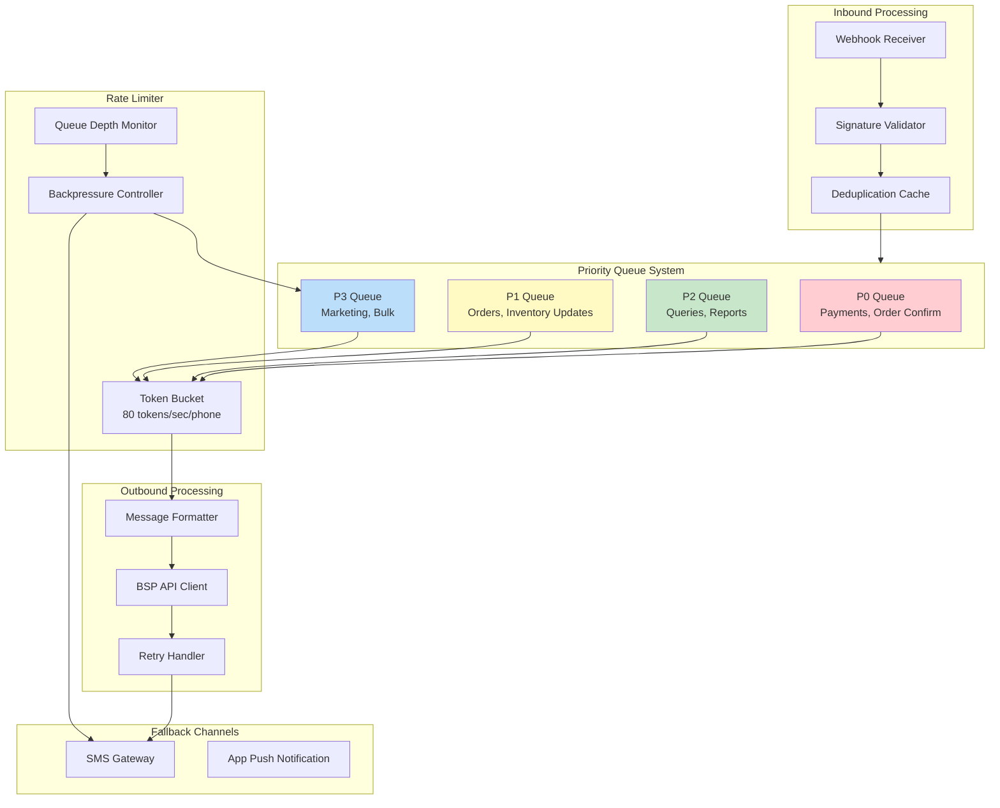
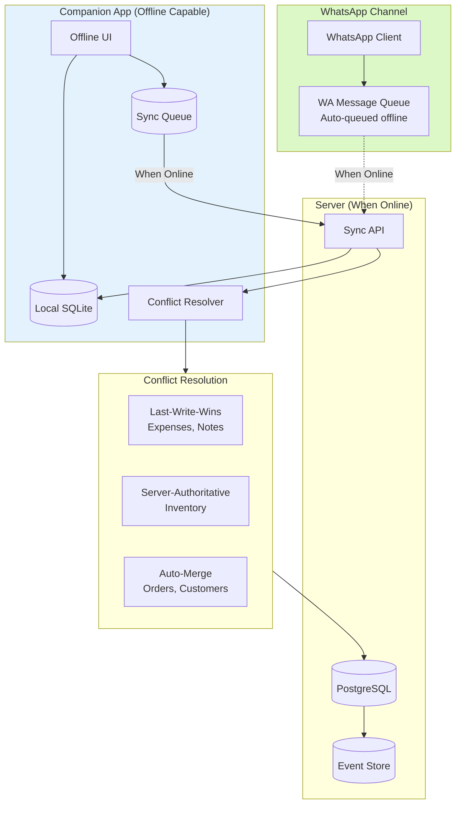
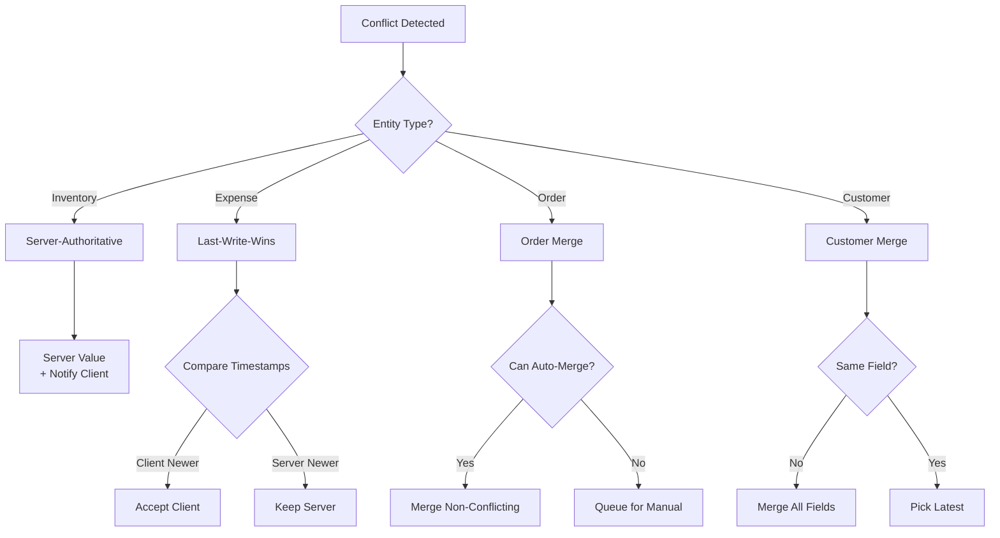
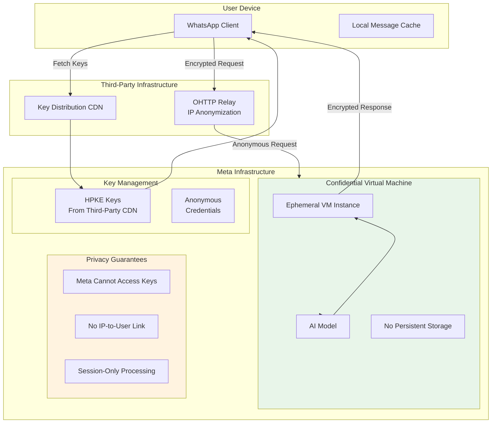
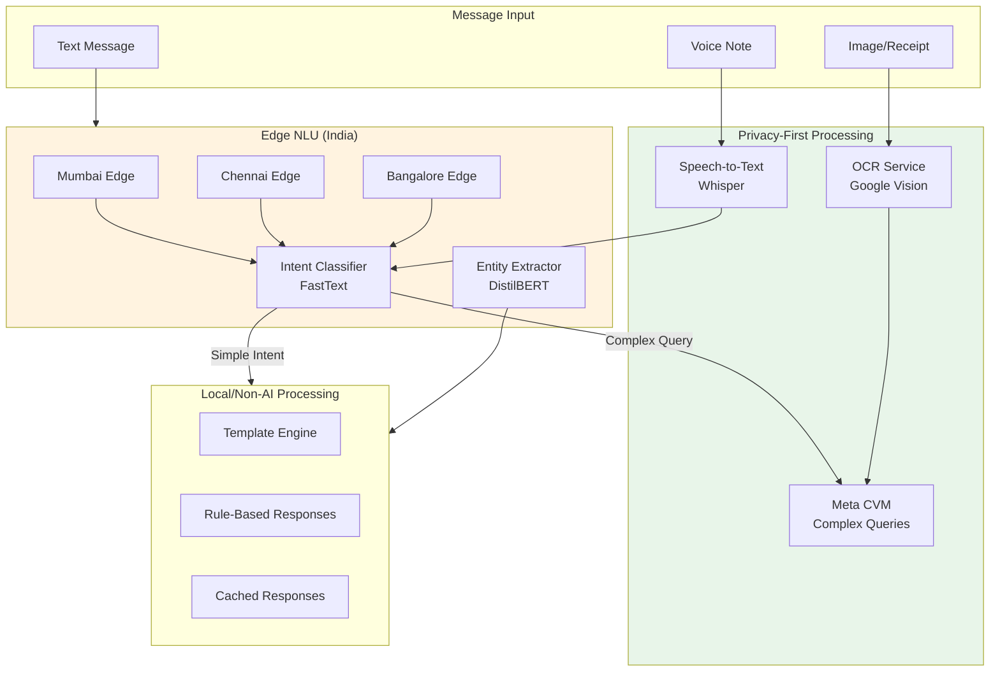

# Deep Dive & Bottlenecks

[Back to Index](./00-index.md)

---

## Deep Dive 1: WhatsApp Rate Limiting & Message Prioritization

### The Challenge

WhatsApp Business API enforces strict rate limits that can bottleneck operations during peak periods:

| Limit Type | Value | Impact |
|------------|-------|--------|
| **Messages per second per phone** | 80 | Max outbound throughput |
| **Messages per 24h window** | Based on tier | Quality rating dependent |
| **Template messages** | Per-approved template | Pre-approval required |
| **Media messages** | 100 MB file size | Large receipts may fail |

During festival sales (Diwali, Eid), message volume can spike 10x, creating severe bottlenecks.

### Rate Limiting Architecture



### Priority Queue Implementation

```
PRIORITY LEVELS:

P0 - Critical (Process immediately)
├── Payment success/failure callbacks
├── Order confirmation to customer
├── Invoice delivery
├── Out-of-stock alerts (blocking order)
└── Security alerts (OTP, account activity)

P1 - Important (Process within 30 seconds)
├── Order creation acknowledgment
├── Inventory update confirmations
├── New customer order received
└── Payment reminder (due today)

P2 - Normal (Process within 5 minutes)
├── Stock query responses
├── Report generation
├── Order status queries
├── General queries

P3 - Low (Process when capacity available)
├── Marketing messages
├── Promotional broadcasts
├── Weekly summaries
├── Feature announcements
```

### Token Bucket Algorithm (Pseudocode)

```
CLASS TokenBucket:
    CONSTRUCTOR(phone_number):
        self.phone_number = phone_number
        self.capacity = 80  # Max tokens
        self.refill_rate = 80  # Tokens per second
        self.tokens = 80
        self.last_refill = NOW()

    FUNCTION acquire(count=1):
        self.refill()

        IF self.tokens >= count:
            self.tokens -= count
            RETURN True
        ELSE:
            RETURN False

    FUNCTION refill():
        now = NOW()
        elapsed = now - self.last_refill
        refill_amount = elapsed.seconds * self.refill_rate
        self.tokens = MIN(self.capacity, self.tokens + refill_amount)
        self.last_refill = now

    FUNCTION wait_time():
        # How long until we have at least 1 token
        IF self.tokens >= 1:
            RETURN 0
        deficit = 1 - self.tokens
        RETURN deficit / self.refill_rate


CLASS RateLimitedSender:
    FUNCTION send_message(phone_number, message, priority):
        bucket = get_or_create_bucket(phone_number)

        IF bucket.acquire():
            RETURN bsp_client.send(phone_number, message)
        ELSE:
            IF priority == P0:
                # Critical - wait and retry
                SLEEP(bucket.wait_time())
                RETURN self.send_message(phone_number, message, priority)
            ELIF priority == P3:
                # Low priority - defer or drop
                queue_for_later(phone_number, message)
                RETURN "queued"
            ELSE:
                # Medium priority - short wait
                IF bucket.wait_time() < 5:
                    SLEEP(bucket.wait_time())
                    RETURN self.send_message(phone_number, message, priority)
                ELSE:
                    queue_for_later(phone_number, message)
                    RETURN "queued"
```

### Backpressure Handling

```
FUNCTION handle_backpressure(queue_depth, phone_number):
    thresholds = {
        warning: 1000,
        critical: 5000,
        emergency: 10000
    }

    IF queue_depth > thresholds.emergency:
        # Emergency: Fallback to SMS for P0/P1
        enable_sms_fallback(phone_number, priorities=[P0, P1])
        # Drop P3 messages
        clear_queue(phone_number, priority=P3)
        # Alert operations team
        send_alert("EMERGENCY: Queue overflow for " + phone_number)

    ELIF queue_depth > thresholds.critical:
        # Critical: Aggregate messages
        enable_message_aggregation(phone_number)
        # Defer P3
        pause_queue(phone_number, priority=P3)

    ELIF queue_depth > thresholds.warning:
        # Warning: Increase batch size
        increase_batch_size(phone_number)
```

### Message Aggregation Strategy

```
BEFORE AGGREGATION (10 messages):
─────────────────────────────────
1. "Order #001 created"
2. "Order #002 created"
3. "Order #003 created"
4. "Stock alert: iPhone low"
5. "Payment received #001"
6. "Order #004 created"
7. "Stock alert: Samsung low"
8. "Payment received #002"
9. "Order #005 created"
10. "Stock alert: Charger low"

AFTER AGGREGATION (3 messages):
─────────────────────────────────
1. "💰 Payments received:
    • Order #001: ₹15,000
    • Order #002: ₹8,500
    Total: ₹23,500"

2. "📦 5 new orders created:
    #001, #002, #003, #004, #005
    Total value: ₹1,25,000
    [View Details]"

3. "⚠️ Low Stock Alert:
    • iPhone: 3 units
    • Samsung: 5 units
    • Charger: 2 units
    [Create PO]"
```

### Failure Scenarios & Recovery

| Scenario | Detection | Recovery |
|----------|-----------|----------|
| **Rate limit exceeded** | 429 response | Exponential backoff, queue |
| **BSP timeout** | No response in 30s | Retry with backoff |
| **Invalid template** | 400 response | Log, notify, use generic |
| **Phone blocked** | Specific error code | Alert business, manual review |
| **Webhook delivery failure** | Missing callback | Polling backup |

---

## Deep Dive 2: Offline-First Sync Architecture

### The Challenge

Indian SMBs often operate in areas with intermittent connectivity:
- Rural areas: 2G/3G with frequent drops
- Urban: Network congestion during peak hours
- Power outages affecting connectivity

The system must:
1. Allow full ERP operations when offline
2. Sync seamlessly when connectivity returns
3. Handle conflicts between offline operations from multiple devices
4. Maintain data integrity and audit trail

### Offline Architecture



### Sync Protocol Design

```
SYNC PROTOCOL v1.0
==================

1. DEVICE STATE
   - device_id: Unique identifier
   - last_sync_timestamp: Server timestamp of last successful sync
   - logical_clock: Lamport timestamp for ordering
   - pending_operations: Queue of unsynced operations

2. OPERATION ENVELOPE
   {
     operation_id: UUID,
     device_id: string,
     logical_timestamp: int,
     operation_type: string,
     entity_type: string,
     entity_id: UUID | null,
     payload: object,
     idempotency_key: string,
     created_at: timestamp
   }

3. SYNC REQUEST
   POST /api/v1/sync
   {
     device_id: string,
     last_sync_timestamp: timestamp,
     operations: [Operation]
   }

4. SYNC RESPONSE
   {
     sync_timestamp: timestamp,
     operation_results: [
       {operation_id, status, server_entity_id, conflict_data}
     ],
     server_changes: [
       {entity_type, entity_id, operation, data, timestamp}
     ],
     next_page_token: string | null
   }
```

### Conflict Resolution Strategies



### Conflict Resolution (Pseudocode)

```
FUNCTION resolve_conflict(server_entity, client_operation):
    entity_type = client_operation.entity_type

    SWITCH entity_type:
        CASE "inventory_item":
            # Server-authoritative: Inventory must be accurate
            RETURN {
                resolution: "server_wins",
                server_value: server_entity.quantity,
                client_value: client_operation.payload.quantity,
                message: "Inventory updated by another device. Server quantity: " +
                         server_entity.quantity
            }

        CASE "expense":
            # Last-write-wins: Simple conflict resolution
            IF client_operation.logical_timestamp > server_entity.updated_at:
                apply_client_changes(server_entity, client_operation)
                RETURN {resolution: "client_wins"}
            ELSE:
                RETURN {
                    resolution: "server_wins",
                    server_value: server_entity
                }

        CASE "order":
            # Merge non-conflicting fields
            merged = {}
            conflicts = []

            FOR field IN ["status", "notes", "shipping_address"]:
                IF client_operation.payload.has(field):
                    IF server_entity[field] == client_operation.payload.expected[field]:
                        # No conflict - apply change
                        merged[field] = client_operation.payload[field]
                    ELSE:
                        # Conflict - record for review
                        conflicts.append({
                            field: field,
                            server: server_entity[field],
                            client: client_operation.payload[field]
                        })

            IF conflicts.empty():
                apply_merge(server_entity, merged)
                RETURN {resolution: "merged", merged_fields: merged}
            ELSE:
                RETURN {
                    resolution: "manual_required",
                    auto_merged: merged,
                    conflicts: conflicts
                }

        CASE "customer":
            # Field-level merge with latest timestamp
            FOR field IN client_operation.payload.changed_fields:
                server_field_time = server_entity.field_timestamps[field]
                client_field_time = client_operation.payload.field_timestamps[field]

                IF client_field_time > server_field_time:
                    server_entity[field] = client_operation.payload[field]
                    server_entity.field_timestamps[field] = client_field_time

            RETURN {resolution: "field_merged"}
```

### Offline Queue Management

```
CLASS OfflineSyncQueue:
    CONSTRUCTOR(device_id, business_id):
        self.device_id = device_id
        self.business_id = business_id
        self.queue = PersistentQueue("sync_queue")
        self.logical_clock = load_or_create_clock()

    FUNCTION enqueue(operation_type, entity_type, payload):
        self.logical_clock += 1

        operation = {
            operation_id: generate_uuid(),
            device_id: self.device_id,
            logical_timestamp: self.logical_clock,
            operation_type: operation_type,
            entity_type: entity_type,
            payload: payload,
            idempotency_key: generate_idempotency_key(operation_type, payload),
            created_at: NOW()
        }

        self.queue.push(operation)

        # Also apply locally for immediate UI update
        apply_local(operation)

        RETURN operation.operation_id

    FUNCTION sync():
        IF NOT is_online():
            RETURN {status: "offline"}

        pending = self.queue.get_all()
        IF pending.empty():
            # Just fetch server changes
            RETURN fetch_server_changes()

        TRY:
            response = sync_api.post({
                device_id: self.device_id,
                last_sync_timestamp: self.last_sync,
                operations: pending
            })

            FOR result IN response.operation_results:
                IF result.status == "success":
                    self.queue.remove(result.operation_id)
                    update_local_with_server_id(result.operation_id, result.server_entity_id)
                ELIF result.status == "conflict":
                    handle_conflict(result)
                    self.queue.remove(result.operation_id)
                ELIF result.status == "error":
                    IF is_retryable(result.error):
                        # Keep in queue for retry
                        increment_retry_count(result.operation_id)
                    ELSE:
                        # Permanent failure - remove and notify
                        self.queue.remove(result.operation_id)
                        notify_user_of_failure(result)

            # Apply server changes to local DB
            FOR change IN response.server_changes:
                apply_server_change_local(change)

            self.last_sync = response.sync_timestamp

            RETURN {status: "success", synced: pending.length}

        CATCH NetworkError:
            RETURN {status: "network_error", pending: pending.length}
```

### WhatsApp as Sync Channel

When the companion app is offline but WhatsApp is working, use WhatsApp messages as a sync mechanism:

```
SCENARIO: App offline, WhatsApp online
─────────────────────────────────────

1. Customer sends order via WhatsApp
   └── Server processes normally
   └── Stores order in database

2. Business receives WhatsApp notification
   └── "New order from Sharma ji: ₹15,000"
   └── Can respond via WhatsApp to confirm/reject

3. When app comes online
   └── Sync API fetches all orders created via WhatsApp
   └── Local database updated
   └── No data loss
```

---

## Deep Dive 3: Privacy-First AI Processing

### The Challenge

Processing business data with AI while maintaining privacy:
- No persistent storage of message content in AI systems
- DPDP Act compliance requires data to stay in India
- Business owners don't want their sales data visible to platform
- AI must still provide intelligent responses

### Meta's Private Processing Architecture (April 2025)



### Privacy-First Processing Flow

```
PRIVACY-FIRST AI PROCESSING FLOW
================================

Step 1: Key Acquisition (Anonymous)
───────────────────────────────────
- Device fetches HPKE public keys from third-party CDN
- Meta cannot trace which user fetched keys
- Keys are ephemeral (per-session)

Step 2: Request Encryption
──────────────────────────
- Message encrypted with ephemeral key
- Only CVM can decrypt
- Meta infrastructure cannot read

Step 3: Anonymous Routing
─────────────────────────
- Request routed through OHTTP relay
- Relay hides user IP from Meta
- Meta sees only relay IP

Step 4: CVM Processing
──────────────────────
- CVM decrypts message
- AI model processes
- No persistent storage
- Result encrypted for device

Step 5: Response Delivery
─────────────────────────
- Encrypted response returned
- Only device can decrypt
- Processing complete, data gone
```

### Our AI Architecture



### Processing Decision Matrix

| Input Type | Processing Layer | Privacy Level | Latency Target |
|------------|------------------|---------------|----------------|
| Simple command `/stock iPhone` | Edge NLU + Template | High | <200ms |
| Natural language query | Edge NLU + CVM | High | <2s |
| Complex reasoning | CVM (full) | High | <5s |
| Receipt image | OCR + CVM | Medium | <10s |
| Voice note | STT + Edge NLU | High | <3s |
| Repeated query (cached) | Local cache | Highest | <50ms |

### Edge NLU Implementation

```
EDGE NLU DEPLOYMENT
===================

Location: India (Mumbai, Chennai, Bangalore)
Models: FastText (intent), DistilBERT (entity)
Footprint: 500MB total
Latency: <100ms p95

INTENT CLASSIFICATION (FastText)
─────────────────────────────────
Model: Custom trained on 50K Indian SMB messages
Languages: Hindi, English, Hinglish
Intents: 15 categories
Accuracy: 94%

Training data sources:
- Anonymized SMB chat logs (with consent)
- Synthetic data generation
- Active learning from corrections

ENTITY EXTRACTION (DistilBERT)
──────────────────────────────
Model: Fine-tuned multilingual DistilBERT
Entities: product_name, quantity, customer, amount, date
F1 Score: 91%

Entity resolution:
- Product names: Fuzzy match against inventory (Levenshtein)
- Customer names: Phonetic matching (Soundex) + history lookup
- Amounts: Hindi numeral parsing, word-to-number
```

### Privacy Guarantees

```
PRIVACY GUARANTEES
==================

1. NO PERSISTENT STORAGE
   - Messages processed in memory only
   - No logging of message content
   - CVM instances destroyed after use

2. NO CROSS-TENANT DATA LEAKAGE
   - Each business's data isolated
   - AI models don't learn from individual data
   - No training on business data without consent

3. DATA LOCALIZATION
   - All processing in India
   - Edge nodes in Mumbai, Chennai, Bangalore
   - No data transfer outside India

4. AUDIT TRAIL (Metadata Only)
   - Log: timestamp, intent, entity_types (not values)
   - Example: "2025-01-15 10:30:00, inventory_query, [product_name]"
   - NOT: "2025-01-15 10:30:00, inventory_query, iPhone 15 Pro"

5. CONSENT-BASED AI
   - AI features require explicit opt-in
   - Users can disable AI anytime
   - Non-AI fallback always available
```

---

## Bottleneck Analysis

### Bottleneck 1: WhatsApp API Rate Limits During Festival Sales

**Problem**: Diwali sale can generate 10x normal message volume. At 80 messages/sec/phone, a business with 10,000 customers faces severe delays.

**Impact**:
- Order confirmations delayed by minutes
- Payment notifications stuck
- Customer frustration, lost sales

**Mitigation**:

| Strategy | Implementation | Effectiveness |
|----------|----------------|---------------|
| **Message aggregation** | Batch similar messages into digest | 3-5x reduction |
| **Priority queuing** | Critical messages first | Ensures important messages through |
| **SMS fallback** | P0 messages via SMS when queue >5000 | 100% delivery for critical |
| **Pre-scaling** | Scale webhook workers 3 days before | Handle 10x capacity |
| **Template optimization** | Use shorter templates | 20% more messages/sec |

### Bottleneck 2: OCR Processing Throughput

**Problem**: Receipt/invoice OCR is slow (5-10s per image). During bulk expense logging (month-end), queue builds up.

**Impact**:
- Users wait for expense confirmation
- Processing delays compound
- Poor user experience

**Mitigation**:

| Strategy | Implementation | Effectiveness |
|----------|----------------|---------------|
| **Async processing** | Return immediately, notify when done | UX improvement |
| **Batch processing** | Process multiple receipts together | 40% throughput gain |
| **Pre-processing** | Image optimization before OCR | 20% speed improvement |
| **Caching** | Cache common vendor templates | 30% hit rate |
| **Multiple OCR providers** | Fallback when one is slow | Reliability improvement |

### Bottleneck 3: Multi-Lingual NLU Accuracy

**Problem**: Hinglish (Hindi-English mix) and regional languages have lower NLU accuracy, causing misclassification.

**Impact**:
- Wrong responses frustrate users
- Increased fallback to manual handling
- Support burden increases

**Mitigation**:

| Strategy | Implementation | Effectiveness |
|----------|----------------|---------------|
| **Active learning** | Learn from corrections | Continuous improvement |
| **Confidence thresholds** | Ask clarification when <80% | Reduces errors |
| **Common phrases cache** | Pre-classified frequent inputs | 30% faster, more accurate |
| **Language detection first** | Route to language-specific model | 15% accuracy improvement |
| **Graceful fallback** | Structured buttons when unsure | Always works |

### Bottleneck 4: Database Hot Spots

**Problem**: Shared database with 100K tenants creates hot spots during peak times, especially for popular tables (orders, inventory).

**Impact**:
- Slow queries
- Connection pool exhaustion
- Cascading failures

**Mitigation**:

| Strategy | Implementation | Effectiveness |
|----------|----------------|---------------|
| **Read replicas** | Route reads to replicas | 70% read offload |
| **Caching** | Cache tenant data, inventory | 80% cache hit |
| **Partitioning** | Partition by business_id hash | Even distribution |
| **Connection pooling** | PgBouncer with proper limits | Connection efficiency |
| **Query optimization** | Index optimization, query rewriting | 50% query speed |

---

## Performance Optimization Summary

```
┌─────────────────────────────────────────────────────────────────┐
│            PERFORMANCE OPTIMIZATION TARGETS                      │
├─────────────────────────────────────────────────────────────────┤
│                                                                 │
│  MESSAGE PROCESSING                                             │
│  ──────────────────                                             │
│  Current: 200 msg/sec     Target: 1000 msg/sec                  │
│  Optimizations:                                                 │
│  • Parallel webhook workers (+300%)                             │
│  • Message batching (+50%)                                      │
│  • Connection pooling (+30%)                                    │
│                                                                 │
│  NLU LATENCY                                                    │
│  ───────────                                                    │
│  Current: 300ms p95       Target: 100ms p95                     │
│  Optimizations:                                                 │
│  • Edge deployment (-150ms)                                     │
│  • Model quantization (-30ms)                                   │
│  • Caching frequent queries (-50ms for hits)                    │
│                                                                 │
│  OCR THROUGHPUT                                                 │
│  ──────────────                                                 │
│  Current: 20 docs/sec     Target: 100 docs/sec                  │
│  Optimizations:                                                 │
│  • Parallel processing (+200%)                                  │
│  • Image pre-processing (+30%)                                  │
│  • Provider load balancing (+50%)                               │
│                                                                 │
│  DATABASE QUERIES                                               │
│  ────────────────                                               │
│  Current: 50ms avg        Target: 10ms avg                      │
│  Optimizations:                                                 │
│  • Index optimization (-20ms)                                   │
│  • Query caching (-15ms for hits)                               │
│  • Read replica routing (-10ms)                                 │
│                                                                 │
└─────────────────────────────────────────────────────────────────┘
```
