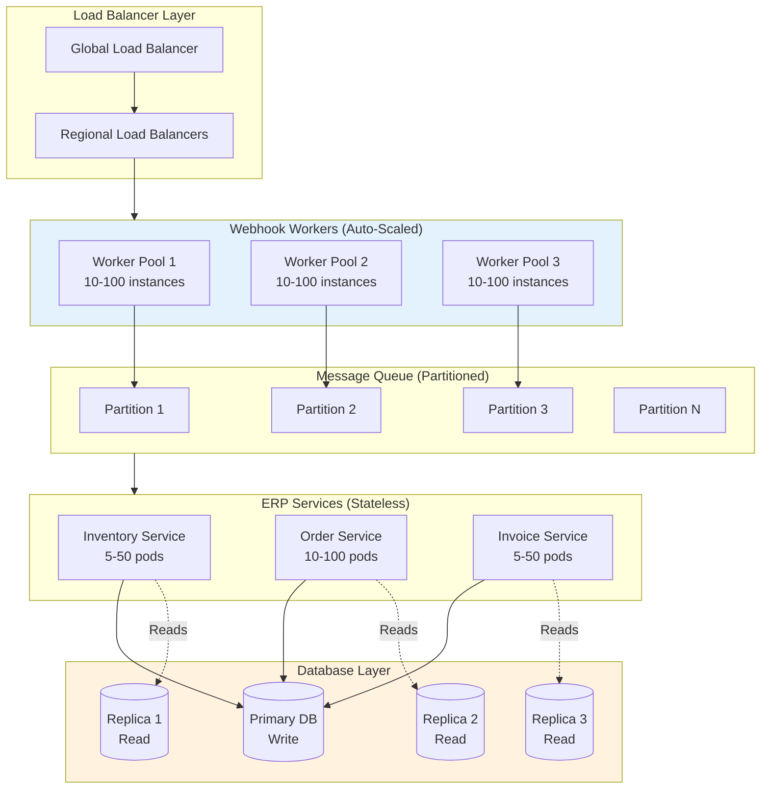
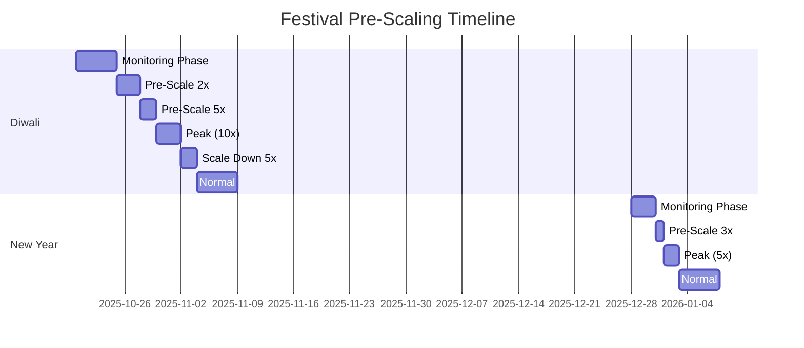
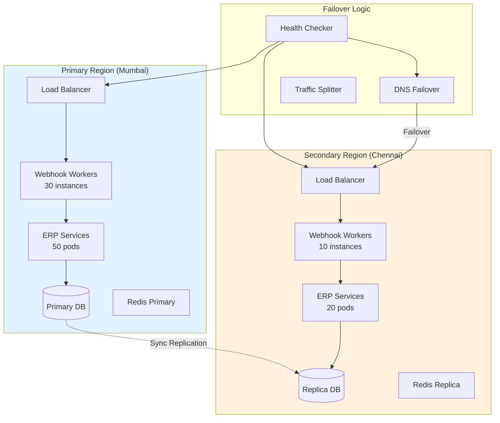
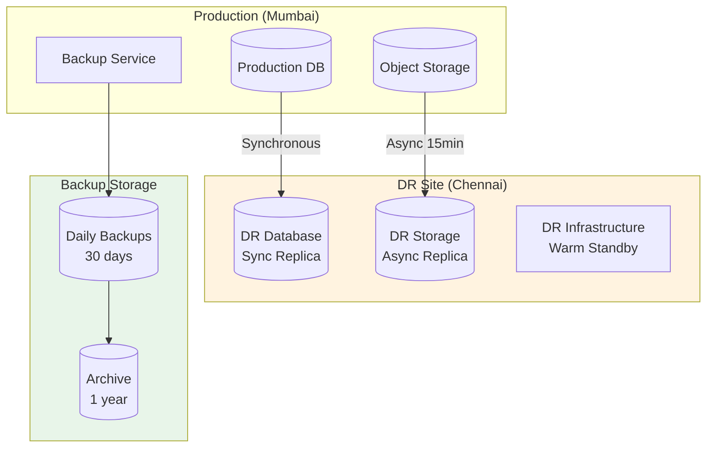

# Scalability & Reliability

[Back to Index](./00-index.md)

---

## Scalability Strategy

### Scaling Dimensions

| Dimension | Year 1 | Year 3 | Year 5 | Strategy |
|-----------|--------|--------|--------|----------|
| **Tenants** | 100K | 300K | 500K | Shared DB → Schema-per-tenant for large |
| **Messages/Day** | 10M | 50M | 100M | Horizontal webhook workers |
| **Orders/Day** | 500K | 2M | 5M | Partitioned order tables |
| **Storage** | 27TB | 150TB | 400TB | Tiered storage (hot/warm/cold) |
| **Peak QPS** | 500 | 1500 | 3000 | Auto-scaling + pre-scaling |

### Horizontal Scaling Architecture



### Auto-Scaling Configuration

```yaml
# Webhook Worker Auto-Scaling
webhook-workers:
  min_replicas: 10
  max_replicas: 100
  target_cpu_utilization: 60%
  target_memory_utilization: 70%

  custom_metrics:
    - name: queue_depth
      target_value: 100  # Messages per worker
    - name: message_latency_p95
      target_value: 1000  # milliseconds

  scale_up:
    stabilization_window: 60s
    policies:
      - type: Pods
        value: 10
        period: 60s
      - type: Percent
        value: 100
        period: 60s

  scale_down:
    stabilization_window: 300s
    policies:
      - type: Percent
        value: 10
        period: 60s

# ERP Services Auto-Scaling
erp-services:
  order-service:
    min_replicas: 10
    max_replicas: 100
    target_cpu: 65%

  inventory-service:
    min_replicas: 5
    max_replicas: 50
    target_cpu: 70%

  invoice-service:
    min_replicas: 5
    max_replicas: 50
    target_cpu: 60%
```

### Database Scaling Strategy

```
DATABASE SCALING APPROACH
=========================

YEAR 1: Single Primary + Read Replicas
───────────────────────────────────────
- Primary: 32 vCPU, 128GB RAM, 2TB SSD
- Read Replicas: 3x (16 vCPU, 64GB RAM)
- PgBouncer for connection pooling
- Row-Level Security for tenant isolation

YEAR 2-3: Partitioned Tables
────────────────────────────
- Partition orders by business_id hash (64 partitions)
- Partition audit_log by month
- Add more read replicas (5-7)
- Consider Citus for distributed queries

YEAR 5: Schema-per-Tenant for Large Tenants
───────────────────────────────────────────
- Tenants with >10K orders/month get dedicated schema
- Shared pool for small tenants
- Federation layer for cross-tenant queries

PARTITIONING STRATEGY:

-- Orders partitioned by business_id hash
CREATE TABLE orders (
    order_id UUID,
    business_id UUID,
    ...
) PARTITION BY HASH (business_id);

CREATE TABLE orders_p0 PARTITION OF orders
    FOR VALUES WITH (MODULUS 64, REMAINDER 0);
...
CREATE TABLE orders_p63 PARTITION OF orders
    FOR VALUES WITH (MODULUS 64, REMAINDER 63);
```

---

## Festival/Flash Sale Handling

### Festival Calendar-Based Pre-Scaling



### Pre-Scaling Strategy

```
FESTIVAL PRE-SCALING PLAYBOOK
=============================

T-7 Days: Preparation
─────────────────────
□ Review last year's traffic patterns
□ Pre-warm database caches
□ Test auto-scaling policies
□ Verify SMS fallback capacity
□ Alert on-call team

T-3 Days: Pre-Scale Phase 1
───────────────────────────
□ Scale webhook workers to 2x baseline
□ Add 2 read replicas
□ Increase connection pool limits
□ Enable message aggregation (ready)
□ Pre-generate common invoice templates

T-1 Day: Pre-Scale Phase 2
──────────────────────────
□ Scale webhook workers to 5x baseline
□ Scale ERP services to 3x
□ Enable priority queue strict mode
□ Activate SMS fallback (standby)
□ War room setup for operations team

D-Day: Festival Peak
────────────────────
□ Monitor queue depths (alert at 1000)
□ Enable message aggregation if needed
□ Activate SMS fallback if queue >5000
□ Defer P3 messages (marketing)
□ Hourly capacity review

T+2 Days: Scale Down
────────────────────
□ Gradual scale down (10% per hour)
□ Disable emergency modes
□ Post-mortem data collection
□ Return to normal configuration
```

### Traffic Spike Handling (Pseudocode)

```
FUNCTION handle_traffic_spike(current_metrics):
    queue_depth = current_metrics.queue_depth
    latency_p95 = current_metrics.message_latency_p95
    error_rate = current_metrics.webhook_error_rate

    # Level 1: Elevated traffic
    IF queue_depth > 500 OR latency_p95 > 1000:
        enable_aggressive_autoscaling()
        increase_batch_size(2x)
        log("ELEVATED: Scaling up, increasing batch size")

    # Level 2: High traffic
    IF queue_depth > 2000 OR latency_p95 > 2000:
        enable_message_aggregation()
        pause_p3_messages()
        log("HIGH: Aggregation enabled, P3 paused")

    # Level 3: Critical traffic
    IF queue_depth > 5000 OR error_rate > 1%:
        enable_sms_fallback(priorities=[P0, P1])
        drop_p3_messages()
        alert_oncall("CRITICAL traffic spike")
        log("CRITICAL: SMS fallback active, P3 dropped")

    # Level 4: Emergency
    IF queue_depth > 10000 OR error_rate > 5%:
        enable_sms_for_all_critical()
        reject_new_marketing_requests()
        page_leadership()
        log("EMERGENCY: Full SMS mode, leadership paged")


FUNCTION scale_workers(target_multiplier):
    current = get_current_worker_count()
    target = min(current * target_multiplier, MAX_WORKERS)

    scale_webhook_workers(target)
    scale_erp_services(target * 0.5)  # ERP needs less scaling

    # Wait for warm-up
    wait_for_healthy(target, timeout=300)
```

---

## Reliability & Fault Tolerance

### Single Points of Failure (SPOF) Analysis

| Component | SPOF Risk | Mitigation |
|-----------|-----------|------------|
| **WhatsApp API** | High (external) | SMS fallback, companion app |
| **BSP Gateway** | High (external) | Multi-BSP support, circuit breaker |
| **Primary Database** | High | Synchronous replica, auto-failover |
| **Message Queue** | Medium | Redis Cluster, persistence |
| **Payment Gateway** | Medium | Multi-provider (Razorpay + UPI direct) |
| **OCR Service** | Low | Multiple providers, degraded mode |

### Redundancy Architecture



### Failover Mechanisms

```
FAILOVER SCENARIOS
==================

Scenario 1: Primary Database Failure
────────────────────────────────────
Detection: Heartbeat failure for 30 seconds
Action:
  1. Promote Chennai replica to primary (automatic)
  2. Update connection strings via service discovery
  3. Alert operations team
  4. Start data recovery for Mumbai

RTO: 2 minutes
RPO: 0 (synchronous replication)

Scenario 2: Mumbai Region Failure
─────────────────────────────────
Detection: All Mumbai health checks fail
Action:
  1. DNS failover to Chennai (5 min TTL)
  2. Scale Chennai to full capacity
  3. Route all traffic to Chennai
  4. Alert and investigate Mumbai

RTO: 10 minutes
RPO: 0 (synchronous replication)

Scenario 3: WhatsApp API Outage
───────────────────────────────
Detection: BSP reports delivery failures >10%
Action:
  1. Queue messages locally (up to 1 hour)
  2. Enable SMS for P0/P1 messages
  3. Notify businesses via companion app
  4. Monitor WhatsApp status page

RTO: N/A (external dependency)
User Impact: Degraded (SMS available)

Scenario 4: BSP Gateway Failure
───────────────────────────────
Detection: Webhook failures >5%
Action:
  1. Circuit breaker trips
  2. Switch to backup BSP (if configured)
  3. Queue messages for retry
  4. Alert and contact BSP support

RTO: 5 minutes (with backup BSP)
RPO: 0 (messages queued)
```

### Circuit Breaker Pattern

```
CLASS CircuitBreaker:
    STATES = [CLOSED, OPEN, HALF_OPEN]

    CONSTRUCTOR(service_name, config):
        self.service_name = service_name
        self.failure_threshold = config.failure_threshold  # 5
        self.success_threshold = config.success_threshold  # 3
        self.timeout = config.timeout  # 30 seconds
        self.state = CLOSED
        self.failure_count = 0
        self.success_count = 0
        self.last_failure_time = null

    FUNCTION call(operation):
        IF self.state == OPEN:
            IF NOW() - self.last_failure_time > self.timeout:
                self.state = HALF_OPEN
            ELSE:
                RAISE CircuitOpenException

        TRY:
            result = operation()

            IF self.state == HALF_OPEN:
                self.success_count += 1
                IF self.success_count >= self.success_threshold:
                    self.reset()
            ELSE:
                self.failure_count = 0

            RETURN result

        CATCH Exception as e:
            self.failure_count += 1
            self.last_failure_time = NOW()

            IF self.failure_count >= self.failure_threshold:
                self.state = OPEN
                alert(f"Circuit OPEN for {self.service_name}")

            RAISE e

    FUNCTION reset():
        self.state = CLOSED
        self.failure_count = 0
        self.success_count = 0


# Usage
bsp_circuit = CircuitBreaker("bsp_gateway", {
    failure_threshold: 5,
    success_threshold: 3,
    timeout: 30
})

FUNCTION send_whatsapp_message(message):
    TRY:
        RETURN bsp_circuit.call(() => bsp_client.send(message))
    CATCH CircuitOpenException:
        # Fallback to SMS for critical
        IF message.priority == P0:
            RETURN sms_gateway.send(message)
        ELSE:
            queue_for_retry(message)
```

### Graceful Degradation Modes

```
DEGRADATION LEVELS
==================

Level 0: Full Functionality
───────────────────────────
All systems operational:
- WhatsApp messaging: Full
- AI processing: Full
- OCR: Full
- Payments: Full

Level 1: AI Degraded
────────────────────
Trigger: AI latency >3s or errors >5%
Impact:
- WhatsApp messaging: Full
- AI processing: Template responses only
- OCR: Queued for later
- Payments: Full

User experience:
"Due to high demand, smart responses are temporarily unavailable.
Please use the buttons below:
[Stock Check] [New Order] [Invoice]"

Level 2: WhatsApp Degraded
──────────────────────────
Trigger: WhatsApp delivery <90%
Impact:
- WhatsApp messaging: P0/P1 only
- SMS: Active for critical
- AI processing: Disabled
- Payments: SMS confirmation

User notification:
SMS: "WhatsApp is experiencing delays. Critical updates will be sent via SMS."

Level 3: Companion App Only
───────────────────────────
Trigger: WhatsApp completely unavailable
Impact:
- WhatsApp: Unavailable
- Companion app: Full functionality
- Offline mode: Active
- Sync: When WhatsApp returns

User notification:
App push: "WhatsApp is down. Please use the app for all operations.
Your data will sync automatically when WhatsApp returns."

Level 4: Offline Mode
─────────────────────
Trigger: Both WhatsApp and server unavailable
Impact:
- App: Offline mode
- Operations: Local only
- Sync: Queued
- Data: Local storage

User experience:
App shows: "You're offline. Operations saved locally.
Will sync when connection is restored."
```

---

## Disaster Recovery

### DR Configuration

| Metric | Target | Implementation |
|--------|--------|----------------|
| **RTO** | 4 hours | Chennai warm standby |
| **RPO** | 1 hour | Synchronous DB replication |
| **Backup Frequency** | Daily full, hourly incremental | Automated backups |
| **Retention** | 30 days hot, 1 year cold | Tiered storage |

### DR Architecture



### DR Runbook

```
DISASTER RECOVERY RUNBOOK
=========================

Pre-Conditions:
- DR site in Chennai operational
- Database replica in sync (lag <1 minute)
- Runbook tested quarterly

Step 1: Assess Situation (0-15 minutes)
───────────────────────────────────────
□ Confirm Mumbai site is unrecoverable
□ Check database replica status
□ Check storage replication status
□ Notify stakeholders

Step 2: Activate DR Site (15-60 minutes)
────────────────────────────────────────
□ Promote Chennai database to primary
□ Scale Chennai infrastructure to production capacity
□ Update DNS to point to Chennai
□ Verify BSP webhook endpoint update

Step 3: Verify Services (60-120 minutes)
────────────────────────────────────────
□ Test message sending/receiving
□ Test order creation
□ Test payment callbacks
□ Test invoice generation
□ Verify data integrity (sample checks)

Step 4: Communication (Ongoing)
───────────────────────────────
□ Update status page
□ Notify affected businesses
□ Send SMS to active users
□ Update support channels

Step 5: Stabilization (120-240 minutes)
───────────────────────────────────────
□ Monitor error rates
□ Address any data inconsistencies
□ Prepare Mumbai site recovery plan
□ Document incident

Post-DR:
────────
□ Conduct post-mortem
□ Update DR procedures
□ Test Mumbai recovery
□ Failback when Mumbai ready
```

### Backup Strategy

```
BACKUP CONFIGURATION
====================

Database Backups:
─────────────────
- Full backup: Daily at 02:00 IST
- Incremental: Every 6 hours
- WAL archiving: Continuous
- Retention: 30 days

Backup commands:
  pg_basebackup (full)
  pg_receivewal (continuous)

Object Storage (PDFs, Receipts):
────────────────────────────────
- Cross-region replication: Every 15 minutes
- Versioning: Enabled (30 days)
- Lifecycle: Move to cold after 90 days

Event Store:
────────────
- Kafka/Pulsar: 30-day retention in hot storage
- Archive: Cold storage after 30 days
- Replay capability: Up to 1 year

Encryption:
───────────
- Backups encrypted with tenant-specific keys
- Keys stored in HSM (Mumbai + Chennai)
- Key rotation: 90 days
```

---

## Capacity Planning Summary

```
┌─────────────────────────────────────────────────────────────────┐
│            CAPACITY PLANNING SUMMARY                             │
├─────────────────────────────────────────────────────────────────┤
│                                                                 │
│  NORMAL OPERATIONS (100K tenants)                               │
│  ─────────────────────────────────                              │
│  Webhook Workers: 30 instances                                  │
│  ERP Services: 50 pods total                                    │
│  Database: 1 primary + 3 read replicas                          │
│  Redis: 3-node cluster                                          │
│  Peak QPS: 500/sec                                              │
│                                                                 │
│  FESTIVAL PEAK (10x)                                            │
│  ────────────────────                                           │
│  Webhook Workers: 100 instances                                 │
│  ERP Services: 150 pods                                         │
│  Database: Add 2 read replicas                                  │
│  Redis: Scale to 6 nodes                                        │
│  Peak QPS: 1500/sec                                             │
│                                                                 │
│  DR SITE (Chennai)                                              │
│  ─────────────────                                              │
│  Warm standby: 30% of production capacity                       │
│  Scale-up time: 30 minutes to full capacity                     │
│  Database: Synchronous replica                                  │
│  Storage: 15-minute async replication                           │
│                                                                 │
│  SLOs                                                           │
│  ────                                                           │
│  Availability: 99.9% (8.7 hours/year downtime)                  │
│  RTO: 4 hours                                                   │
│  RPO: 1 hour                                                    │
│  Message latency: <2s p95                                       │
│                                                                 │
└─────────────────────────────────────────────────────────────────┘
```
