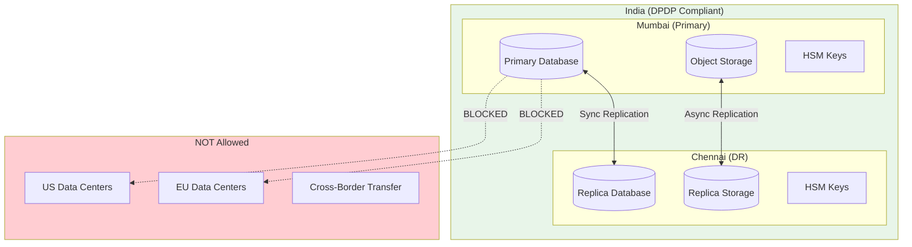
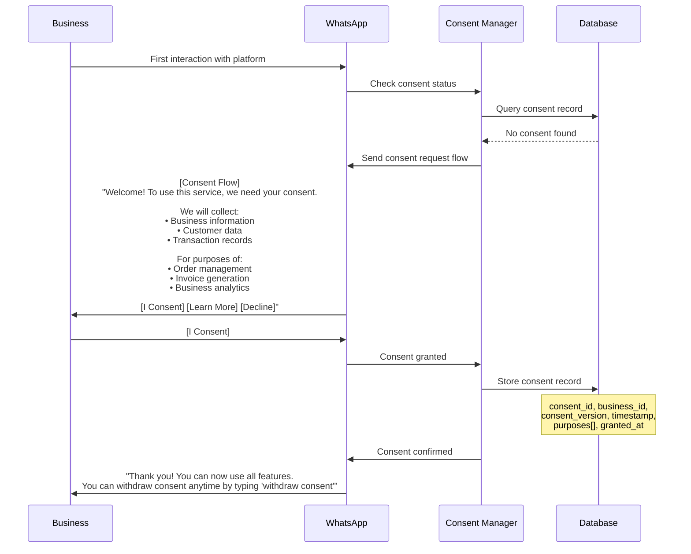
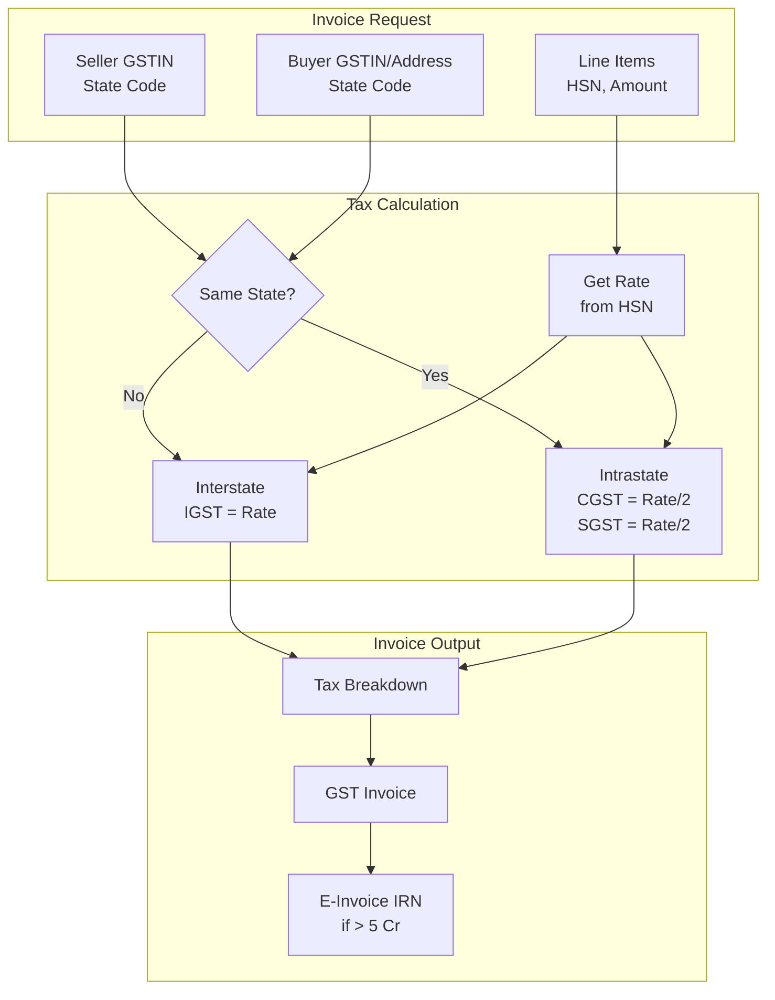
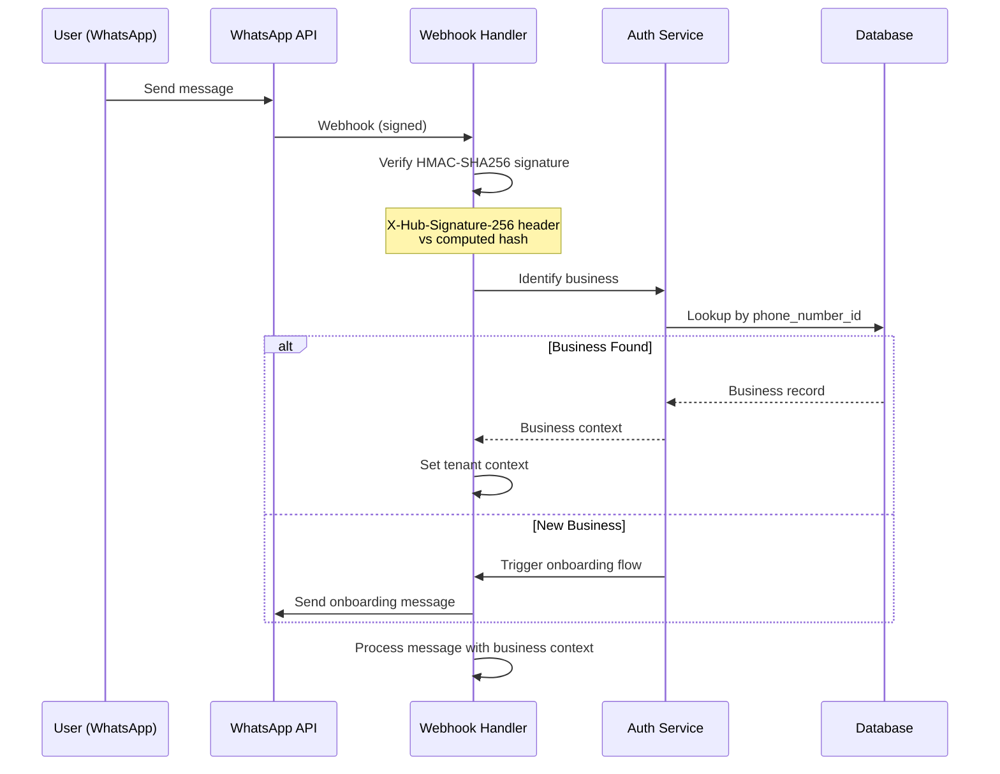
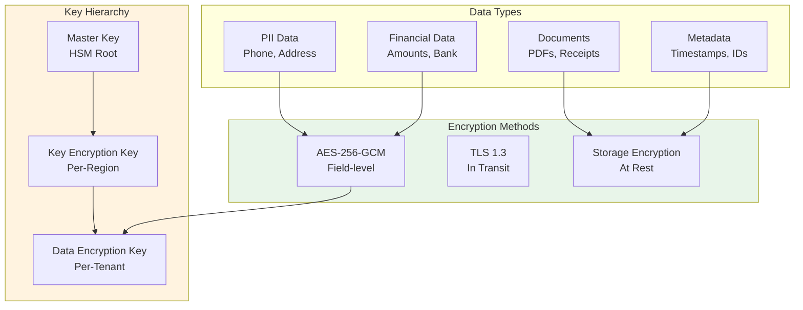

# Security & Compliance

[Back to Index](./00-index.md)

---

## India Digital Personal Data Protection (DPDP) Act Compliance

### DPDP Act Requirements & Implementation

| DPDP Requirement | Implementation |
|------------------|----------------|
| **Data Localization** | All personal data stored in India (Mumbai/Chennai only) |
| **Consent** | WhatsApp Flow for explicit opt-in before data collection |
| **Purpose Limitation** | Data used only for stated ERP purposes |
| **Data Minimization** | Collect only necessary fields |
| **Right to Access** | "Mera data dikha" command exports all data |
| **Right to Correction** | Update via WhatsApp chat |
| **Right to Erasure** | Cryptographic deletion within 30 days |
| **Data Breach Notification** | 72-hour notification to Data Protection Board |

### Data Localization Architecture



### Consent Management Flow



### Consent Data Model

```sql
CREATE TABLE consent_record (
    consent_id UUID PRIMARY KEY DEFAULT gen_random_uuid(),
    business_id UUID NOT NULL REFERENCES business(business_id),
    consent_version VARCHAR(10) NOT NULL,
    purposes JSONB NOT NULL, -- ["order_management", "invoicing", "analytics"]
    granted_at TIMESTAMP NOT NULL,
    granted_via VARCHAR(50) NOT NULL, -- whatsapp_flow, app, web
    ip_address INET,
    device_info JSONB,
    withdrawn_at TIMESTAMP,
    withdrawal_reason TEXT,
    is_active BOOLEAN DEFAULT true,
    created_at TIMESTAMP DEFAULT NOW()
);

-- Ensure only one active consent per business
CREATE UNIQUE INDEX idx_active_consent ON consent_record(business_id)
    WHERE is_active = true;
```

### Right to Erasure Implementation

```
RIGHT TO ERASURE WORKFLOW
=========================

Trigger: User sends "delete my data" or "mera data delete karo"

Step 1: Verify Identity (0-1 hour)
──────────────────────────────────
- Send OTP to registered phone
- Confirm via WhatsApp flow
- Log erasure request

Step 2: Data Identification (1-24 hours)
────────────────────────────────────────
- Identify all data associated with business_id
- Categories:
  • Business profile
  • Customer records
  • Orders and invoices
  • Expenses and receipts
  • Audit logs (anonymize, don't delete)
  • WhatsApp message references

Step 3: Data Export (Optional, 24-48 hours)
───────────────────────────────────────────
- Generate data export package
- Send via WhatsApp document
- Retain export for 7 days

Step 4: Cryptographic Deletion (48-72 hours)
────────────────────────────────────────────
- Delete tenant-specific encryption keys
- Data becomes unreadable (crypto-shredding)
- Mark records as "deleted" (no actual delete for audit)

Step 5: Confirmation (Within 30 days)
─────────────────────────────────────
- Send confirmation message
- Update consent record
- Log completion

PSEUDOCODE:

FUNCTION process_erasure_request(business_id):
    # Step 1: Verification
    otp = generate_otp()
    send_otp_via_whatsapp(business_id, otp)
    verified = wait_for_verification(business_id, otp, timeout=1h)

    IF NOT verified:
        RETURN error("Verification failed")

    # Step 2: Create erasure job
    job = create_erasure_job(business_id)
    job.status = "pending"

    # Step 3: Export data (if requested)
    IF job.export_requested:
        export = generate_data_export(business_id)
        send_document(business_id, export)

    # Step 4: Cryptographic deletion
    # Delete the Data Encryption Key (DEK)
    delete_tenant_dek(business_id)

    # Mark all records as deleted (data now unreadable)
    UPDATE business SET status = 'deleted', deleted_at = NOW()
        WHERE business_id = job.business_id

    # Anonymize audit logs (keep structure, remove PII)
    UPDATE audit_log SET
        user_phone = 'REDACTED',
        before_state = anonymize_json(before_state),
        after_state = anonymize_json(after_state)
    WHERE business_id = job.business_id

    # Step 5: Confirmation
    job.status = "completed"
    job.completed_at = NOW()

    # Note: Cannot send WhatsApp as business is deleted
    # Log completion for compliance
    log_erasure_completion(job)

    RETURN success("Data deletion completed")
```

---

## GST Compliance

### GST Invoice Requirements

| Field | Requirement | Implementation |
|-------|-------------|----------------|
| **Invoice Number** | Unique, sequential per FY | Auto-generated: INV-{STATE}-{FY}-{SEQ} |
| **GSTIN** | Seller's GST number | From business profile |
| **Place of Supply** | State code | Derived from customer address |
| **HSN/SAC Code** | Product classification | Mapped in inventory |
| **Tax Breakdown** | CGST, SGST, IGST separately | Calculated based on place of supply |
| **Reverse Charge** | If applicable | Flag in invoice |

### GST Calculation Engine



### GST Rate Lookup

```
GST RATE TABLE (SIMPLIFIED)
===========================

Category           | HSN Prefix | Rate
─────────────────────────────────────────
Essential Goods    | 01-10      | 0% / 5%
Food & Beverages   | 15-24      | 5% / 12%
Textiles           | 50-63      | 5% / 12%
Electronics        | 84-85      | 18%
Luxury Goods       | 71 (Gold)  | 3%
Services           | 99         | 18%
Most Products      | Default    | 18%

FUNCTION get_gst_rate(hsn_code):
    # Lookup in rate table
    rate = gst_rate_table.lookup(hsn_code)

    IF rate is null:
        # Default to 18% for unknown
        rate = 0.18
        log_warning(f"Unknown HSN: {hsn_code}, using default 18%")

    RETURN rate
```

### E-Invoice Integration

```
E-INVOICE WORKFLOW (For businesses > 5 Cr turnover)
===================================================

Step 1: Generate Invoice JSON
─────────────────────────────
{
  "Version": "1.1",
  "TranDtls": {
    "TaxSch": "GST",
    "SupTyp": "B2B"
  },
  "DocDtls": {
    "Typ": "INV",
    "No": "INV-27-2425-00001",
    "Dt": "15/01/2025"
  },
  "SellerDtls": {
    "Gstin": "27XXXXX1234X1Z5",
    "LglNm": "Business Name",
    ...
  },
  "BuyerDtls": {...},
  "ItemList": [{
    "SlNo": "1",
    "PrdDesc": "iPhone 15 Pro",
    "HsnCd": "8517",
    "Qty": 2,
    "UnitPrice": 134900,
    "TotAmt": 269800,
    "GstRt": 18,
    "IgstAmt": 48564
  }],
  ...
}

Step 2: Submit to IRP (Invoice Registration Portal)
───────────────────────────────────────────────────
POST https://einvoice1.gst.gov.in/eicore/v1.03/Invoice
Headers:
  client-id: {API_CLIENT_ID}
  client-secret: {API_SECRET}
  gstin: {SELLER_GSTIN}

Response:
{
  "AckNo": 232100001234,
  "AckDt": "2025-01-15 10:30:00",
  "Irn": "a1b2c3d4e5f6...",
  "SignedInvoice": "eyJ...",
  "SignedQRCode": "data:image/png;base64,..."
}

Step 3: Update Invoice with IRN
───────────────────────────────
UPDATE invoice SET
    e_invoice_irn = response.Irn,
    e_invoice_ack_no = response.AckNo,
    e_invoice_qr = response.SignedQRCode
WHERE invoice_id = current_invoice_id
```

---

## Authentication & Authorization

### Authentication Flow



### Authorization Model

```
AUTHORIZATION MODEL
===================

Entity: Business (Tenant)
─────────────────────────
- Full access to own data
- No access to other businesses' data
- Enforced via RLS

Entity: Business User (Staff)
─────────────────────────────
Roles:
- owner: Full access
- manager: All except settings, billing
- staff: Orders, inventory, invoices only
- viewer: Read-only access

Permissions Matrix:
┌───────────────┬───────┬─────────┬───────┬────────┐
│ Resource      │ Owner │ Manager │ Staff │ Viewer │
├───────────────┼───────┼─────────┼───────┼────────┤
│ Settings      │ CRUD  │ R       │ -     │ -      │
│ Billing       │ CRUD  │ R       │ -     │ -      │
│ Users         │ CRUD  │ R       │ -     │ -      │
│ Inventory     │ CRUD  │ CRUD    │ CRUD  │ R      │
│ Orders        │ CRUD  │ CRUD    │ CRUD  │ R      │
│ Invoices      │ CRUD  │ CRUD    │ CRUD  │ R      │
│ Expenses      │ CRUD  │ CRUD    │ CRU   │ R      │
│ Reports       │ CRUD  │ CRUD    │ R     │ R      │
│ Customers     │ CRUD  │ CRUD    │ CRUD  │ R      │
└───────────────┴───────┴─────────┴───────┴────────┘

FUNCTION check_permission(user, resource, action):
    role = user.role
    permissions = role_permissions[role][resource]

    IF action IN permissions:
        RETURN true
    ELSE:
        log_access_denied(user, resource, action)
        RETURN false
```

### Multi-User WhatsApp Access

```
MULTI-USER SCENARIO
===================

Business: "Sharma Electronics"
Phone Numbers:
- +91 98765 43210 (Owner - Sharma ji)
- +91 87654 32109 (Manager - Ravi)
- +91 76543 21098 (Staff - Priya)

Each phone number is registered as a business_user
linked to the same business_id.

Identification Flow:
1. Message arrives from +91 87654 32109
2. Lookup: business_user WHERE phone = +91 87654 32109
3. Found: user_id = xyz, business_id = abc, role = manager
4. Set context: tenant = abc, user = xyz, role = manager
5. Process message with role-based permissions

Access Control:
- Ravi (Manager) sends "delete expense #123"
- Check: can manager delete expenses? → Yes (CRU for expenses, but D for owner only)
- Wait, check matrix: Manager has CRUD for expenses
- Allow deletion
```

---

## Data Security

### Encryption Architecture



### Encryption Implementation

```
ENCRYPTION CONFIGURATION
========================

At Rest:
────────
Database: PostgreSQL with pgcrypto extension
Storage: AES-256 server-side encryption
Keys: Tenant-specific DEKs stored in HSM

In Transit:
───────────
External: TLS 1.3 (minimum)
Internal: mTLS between services
WhatsApp: Signal Protocol (Meta-managed)

Field-Level Encryption:
───────────────────────
Encrypted fields:
- customer.phone_number
- customer.address
- business.gstin
- business.pan_number
- payment.bank_account
- payment.upi_vpa

FUNCTION encrypt_field(value, business_id):
    dek = get_tenant_dek(business_id)
    nonce = generate_random_nonce(12)
    ciphertext = aes_gcm_encrypt(value, dek, nonce)
    RETURN base64_encode(nonce + ciphertext)

FUNCTION decrypt_field(encrypted_value, business_id):
    dek = get_tenant_dek(business_id)
    decoded = base64_decode(encrypted_value)
    nonce = decoded[0:12]
    ciphertext = decoded[12:]
    RETURN aes_gcm_decrypt(ciphertext, dek, nonce)

Key Rotation:
─────────────
KEK: Rotate every 365 days
DEK: Rotate every 90 days
Process:
1. Generate new DEK
2. Re-encrypt all data (background job)
3. Mark old DEK as deprecated
4. Delete old DEK after 30 days
```

---

## Threat Model

### Top Security Threats

| Threat | Risk | Mitigation |
|--------|------|------------|
| **WhatsApp Account Takeover** | High | MFA, session monitoring, anomaly detection |
| **Webhook Spoofing** | High | HMAC-SHA256 signature verification |
| **Data Breach** | High | Encryption at rest, field-level encryption |
| **Insider Threat** | Medium | RBAC, audit logging, least privilege |
| **DDoS on Webhooks** | Medium | Rate limiting, CDN, auto-scaling |
| **SQL Injection** | Medium | Parameterized queries, RLS |
| **Payment Fraud** | Medium | Webhook signature verification, reconciliation |
| **Session Hijacking** | Low | Short-lived tokens, device binding |

### Threat Mitigation Details

```
THREAT: WhatsApp Account Takeover
─────────────────────────────────
Attack: Attacker gains access to business WhatsApp

Detection:
- New device login notification
- Unusual message patterns
- Geographic anomalies

Mitigation:
1. Two-factor verification for sensitive operations
2. Session tracking per device
3. Anomaly detection on message patterns
4. Alert on new device access
5. Ability to revoke access remotely


THREAT: Webhook Spoofing
────────────────────────
Attack: Attacker sends fake webhooks to inject malicious data

Detection:
- Invalid signature
- Unknown IP addresses
- Malformed payloads

Mitigation:
1. Verify X-Hub-Signature-256 on every request
   signature = HMAC-SHA256(request_body, app_secret)
   compare with header value

2. IP allowlisting (Meta webhook IPs)
3. Request body validation
4. Idempotency checks (message_id deduplication)


THREAT: Payment Webhook Manipulation
────────────────────────────────────
Attack: Attacker sends fake payment success webhooks

Detection:
- Invalid Razorpay signature
- Payment not found in Razorpay
- Amount mismatch

Mitigation:
1. Verify Razorpay webhook signature
2. Verify payment via API call
3. Match amount and invoice_id
4. Reconciliation checks (daily)

FUNCTION verify_payment_webhook(payload, signature):
    # Step 1: Verify signature
    expected = HMAC-SHA256(payload, razorpay_secret)
    IF signature != expected:
        log_security_event("Invalid payment signature")
        RETURN reject()

    # Step 2: Verify with Razorpay API
    payment = razorpay_api.get_payment(payload.payment_id)
    IF payment is null:
        log_security_event("Payment not found")
        RETURN reject()

    # Step 3: Verify amount
    IF payment.amount != expected_amount:
        log_security_event("Amount mismatch")
        RETURN reject()

    # Step 4: Process payment
    RETURN process_payment(payment)
```

### Security Monitoring

```
SECURITY MONITORING CHECKLIST
=============================

Real-time Alerts:
─────────────────
□ Failed signature validations > 10/min
□ Unusual login patterns (new devices)
□ High-value transactions (> ₹1 lakh)
□ Bulk data access attempts
□ Failed authentication > 5 attempts
□ Geographic anomalies (message from unusual location)

Daily Reviews:
──────────────
□ Access pattern analysis
□ Failed transaction review
□ New user registrations
□ Permission changes
□ Data export requests

Weekly Reviews:
───────────────
□ Security event summary
□ Vulnerability scan results
□ Compliance checklist
□ Key rotation status
```

---

## Audit Logging

### Audit Log Requirements

| Event Type | Logged Fields | Retention |
|------------|---------------|-----------|
| **Authentication** | user, device, IP, timestamp, success/fail | 2 years |
| **Data Access** | user, resource, action, timestamp | 7 years |
| **Data Modification** | user, resource, before/after, timestamp | 7 years |
| **Admin Actions** | user, action, target, timestamp | 7 years |
| **Security Events** | type, details, timestamp, severity | 7 years |

### Audit Log Schema

```sql
CREATE TABLE audit_log (
    log_id UUID PRIMARY KEY DEFAULT gen_random_uuid(),
    business_id UUID NOT NULL,
    user_id UUID,
    user_phone VARCHAR(15),
    action_type VARCHAR(50) NOT NULL,
    action_category VARCHAR(20) NOT NULL, -- auth, data, admin, security
    resource_type VARCHAR(50),
    resource_id UUID,
    before_state JSONB,
    after_state JSONB,
    metadata JSONB, -- IP, device, geolocation
    whatsapp_message_id VARCHAR(100),
    chain_hash VARCHAR(64) NOT NULL, -- Tamper detection
    created_at TIMESTAMP DEFAULT NOW()
);

-- Tamper detection: each log entry includes hash of previous
-- chain_hash = SHA256(previous_chain_hash + current_log_data)

-- Partition by month
CREATE TABLE audit_log_2025_01 PARTITION OF audit_log
    FOR VALUES FROM ('2025-01-01') TO ('2025-02-01');

-- No updates or deletes allowed
REVOKE UPDATE, DELETE ON audit_log FROM PUBLIC;
```

### Audit Log Implementation

```
FUNCTION create_audit_log(event):
    # Get previous hash for chain
    previous = get_latest_audit_log(event.business_id)
    previous_hash = previous.chain_hash IF previous ELSE "GENESIS"

    # Create log entry
    log_entry = {
        log_id: generate_uuid(),
        business_id: event.business_id,
        user_id: event.user_id,
        user_phone: mask_phone(event.user_phone), # +91XXXXX1234
        action_type: event.action_type,
        action_category: categorize(event.action_type),
        resource_type: event.resource_type,
        resource_id: event.resource_id,
        before_state: event.before_state,
        after_state: event.after_state,
        metadata: {
            ip_address: event.ip,
            device_info: event.device,
            whatsapp_message_id: event.message_id
        },
        created_at: NOW()
    }

    # Compute chain hash
    log_data = serialize(log_entry)
    log_entry.chain_hash = SHA256(previous_hash + log_data)

    # Insert (no updates allowed)
    INSERT INTO audit_log VALUES (log_entry)

    RETURN log_entry.log_id


# Tamper detection check
FUNCTION verify_audit_chain(business_id, start_date, end_date):
    logs = get_audit_logs(business_id, start_date, end_date)
    previous_hash = get_hash_before(business_id, start_date)

    FOR log IN logs:
        expected_hash = SHA256(previous_hash + serialize(log))
        IF log.chain_hash != expected_hash:
            alert("AUDIT LOG TAMPERING DETECTED", log.log_id)
            RETURN false
        previous_hash = log.chain_hash

    RETURN true
```

---

## Compliance Summary

```
┌─────────────────────────────────────────────────────────────────┐
│            COMPLIANCE MATRIX                                     │
├─────────────────────────────────────────────────────────────────┤
│                                                                 │
│  INDIA DPDP ACT                                                 │
│  ──────────────                                                 │
│  ✓ Data Localization: All data in India                         │
│  ✓ Consent: WhatsApp Flow opt-in                                │
│  ✓ Right to Access: Export via chat command                     │
│  ✓ Right to Erasure: 30-day crypto-shredding                    │
│  ✓ Breach Notification: 72-hour process                         │
│                                                                 │
│  GST COMPLIANCE                                                 │
│  ──────────────                                                 │
│  ✓ Invoice Format: GST-compliant structure                      │
│  ✓ Tax Calculation: CGST/SGST/IGST engine                       │
│  ✓ HSN Codes: Product mapping                                   │
│  ✓ E-Invoice: NIC portal integration (>5 Cr)                    │
│  ✓ GSTR Export: Filing-ready data                               │
│                                                                 │
│  SECURITY                                                       │
│  ────────                                                       │
│  ✓ Encryption: AES-256-GCM at rest, TLS 1.3 in transit          │
│  ✓ Key Management: HSM-backed, per-tenant keys                  │
│  ✓ Access Control: RBAC with RLS                                │
│  ✓ Audit Logging: Immutable, chain-hashed                       │
│  ✓ Webhook Security: HMAC-SHA256 verification                   │
│                                                                 │
│  CERTIFICATIONS TARGET                                          │
│  ─────────────────────                                          │
│  □ ISO 27001 (Year 1)                                           │
│  □ SOC 2 Type II (Year 2)                                       │
│                                                                 │
└─────────────────────────────────────────────────────────────────┘
```
